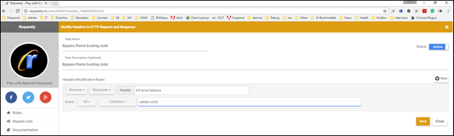

# Résolution des problèmes liés au compositeur d’expérience visuelle

Des problèmes d’affichage se produisent parfois dans la variable [!DNL Adobe Target] [!UICONTROL Compositeur d’expérience visuelle] (VEC) sous certaines conditions.

## Lorsque j’ouvre mon site web dans le compositeur d’expérience visuelle, la variable [!DNL Target] Les bibliothèques ne se chargent pas. (Compositeur d’expérience visuelle uniquement)  {#section_8A7D3F4AD2CC4C3B823EE9432B97E06F}

Target ajoute deux paramètres (`mboxEdit=1` et `mboxDisable=1`) lors de l’ouverture du site web dans le compositeur d’expérience visuelle.

Si votre site web (en particulier les applications de page unique) supprime nos paramètres ou les supprime en naviguant d’une page à une autre (sans rechargement de page), la fonctionnalité Target est rompue et les bibliothèques Target ne se chargent pas. 
Pour éviter ce problème, assurez-vous de ne pas supprimer ces deux paramètres.

## Ma page ne s’ouvre pas dans le compositeur d’expérience avancé ou elle se charge lentement. Les activités ou les expériences se chargent lentement dans le compositeur d’expérience visuelle. (Compositeur d’expérience visuelle uniquement)  {#section_71E7601BE9894E3DA3A7FBBB72B6B0C1}

Dans les compositeurs d’expérience, plusieurs problèmes peuvent avoir un impact sur les performances. Les problèmes courants sont les suivants :

* La page ne contient pas de mbox.
* Votre site utilise le blocage par proxy, ce qui ne permet pas à la page d’être ouverte dans les compositeurs d’expérience.
* Votre site n’est pas autorisé à être ouvert dans une iFrame.

Si des problèmes se produisent dans le compositeur d’expérience avancé, désactivez-le et utilisez le compositeur d’expérience visuelle à la place.

Pour désactiver le compositeur d’expérience avancé, accédez à **[!UICONTROL Administration]** > **[!UICONTROL Compositeur d’expérience visuelle]** et désactivez la fonction **[!UICONTROL Activation du compositeur d’expérience avancé]** .

Le message d’erreur suivant s’affiche dans la console pour certains utilisateurs :

Si le compositeur d’expérience visuelle et le compositeur d’expérience avancé ne fonctionnent pas, utilisez une extension de navigateur telle que Requestly (Chrome ou Firefox) ou Modify Response Headers (Firefox) qui peut remplacer les options d’en-tête X-Frames pour votre site et les autoriser à être chargés dans des iFrames, en activant le compositeur d’expérience visuelle. Si vous ne pouvez pas avoir recours à des extensions de navigateur, utilisez le compositeur basé sur les formulaires.

>[!NOTE]
>
>Outre les informations suivantes, vous pouvez utiliser l’[extension de navigateur Adobe Target VEC Helper](/help/main/c-experiences/c-visual-experience-composer/r-troubleshoot-composer/vec-helper-browser-extension.md) pour Google Chrome.

>[!NOTE]
>
>Utilisez ces modules externes uniquement dans le cadre de modifications dans le VEC.
>
>Pour l’extension Requestly, lorsque la suppression d’en-têtes est nécessaire, il convient d’effectuer l’une des opérations suivantes :
>
>* Ajoutez des règles d’URL pour les URL que vous souhaitez ouvrir avec le compositeur d’expérience visuelle. Les en-têtes sont alors supprimés uniquement pour ces URL.
>
>* Activez la règle lorsque vous effectuez une modification dans le compositeur d’expérience visuelle et désactivez la règle lorsque vous ne l’utilisez pas.
>
>Pour l’extension Modify Response Headers (Firefox), vous ne pouvez pas ajouter de règles d’URL, il convient donc d’effectuer l’opération suivante :
>
>* Activez la règle lorsque vous effectuez une modification dans le compositeur d’expérience visuelle et désactivez la règle lorsque vous ne l’utilisez pas.

**Pour utiliser l’extension Requestly dans Chrome ou Firefox :**

1. Désactivez le compositeur d’expérience avancé.
1. Installez l’extension de navigateur Requestly dans Chrome ou Firefox.
1. Ouvrez l’extension et configurez-la de la manière suivante :
1. Sélectionnez **[!UICONTROL Modify headers]**.
1. Saisissez les entrées suivantes :

   * Nom de la règle
   * Règles de modification

      * Basculez de **[!UICONTROL Add]** vers **[!UICONTROL Remove]**.
      * Basculez de **[!UICONTROL Request]** vers **[!UICONTROL Response]**.
      * Saisissez X-Frame-Options en tant que nom d’en-tête.
      * Répétez les étapes précédentes et saisissez « x-frame-options » comme nom d’en-tête.

         >[!NOTE]
         >
         >Les en-têtes manipulés via Requestly sont sensibles à la casse.

      * Remplacez **[!UICONTROL Equals]** par **[!UICONTROL Contains]** pour la condition de l’URL source, puis saisissez l’URL de l’activité que vous essayez de charger dans le compositeur d’expérience virtuelle.

      

1. Cliquez sur **[!UICONTROL Enregistrer]**.

   

   Vous devez à présent être en mesure de charger rapidement la page à l’aide du compositeur d’expérience visuelle.

**Pour utiliser l’extension Modify Response Headers dans Firefox :**

1. Installez l’extension Modify Response Headers dans Firefox, puis redémarrez le navigateur.
1. Dans les extensions de Firefox, sélectionnez l’extension Modify Response Headers.
1. Cliquez sur **[!UICONTROL Preferences]**.
1. Sélectionnez **[!UICONTROL Filter]** dans le menu déroulant Action.
1. Dans le champ du nom de l’en-tête, saisissez **[!UICONTROL X-Frame-Options]**.
1. Répétez les étapes 4 et 5 pour ajouter un filtre doté de **[!UICONTROL x-frame-options]**.
1. Cliquez sur **[!UICONTROL Ajouter]**.
1. Cliquez sur **[!UICONTROL Start]**.

Après avoir configuré une extension, ouvrez Target. Vos pages doivent à présent être chargées dans le compositeur d’expérience visuelle, et ce même si le compositeur d’expérience avancé est désactivé.

## Ma page ne s’affiche pas dans le compositeur d’expérience visuelle (compositeur d’expérience visuelle uniquement) {#does-not-load}

* Le navigateur n’est pas pris en charge.
* Le navigateur bloque une page non sécurisée d’un site sécurisé.

   Dans la barre d’adresses du navigateur, cliquez sur l’icône située à gauche de l’URL, puis sur **[!UICONTROL Désactiver la protection de cette page]**.
* Vous avez tapé une URL incorrecte.
* Vous n’avez pas entré d’URL par défaut dans la page de configuration du compte.

   Assurez-vous que ce paramètre est activé, puis téléchargez et mettez à jour at.js sur votre site web.

* Si vous essayez d’utiliser la variable [new [!UICONTROL Assistant d’édition visuelle] extension](/help/main/c-experiences/c-visual-experience-composer/r-troubleshoot-composer/visual-editing-helper-extension.md) puis revenez à la [ancienne extension](/help/main/c-experiences/c-visual-experience-composer/r-troubleshoot-composer/vec-helper-browser-extension.md) et [!DNL Target] ne parvient pas à charger votre site web, effacez toutes les données du navigateur et désactivez la nouvelle extension.

* Si le chargement de votre site web échoue dans le VEC ou se comporte de manière inattendue, un correctif potentiel consiste à accepter les cookies de votre site web dans le navigateur avant de tenter de charger le site web dans [!DNL Target].

## Le compositeur d’expérience visuelle semble rompu lorsque j’utilise le mode de navigation. (Compositeur d’expérience visuelle uniquement)  {#section_FA2A18E8FD6A4274B2E395DBAA2FB407}

Lorsque vous utilisez le mode Parcourir, si vous accédez à une URL qui ne comporte pas [!DNL Target] bibliothèques implémentées ([at.js](https://experienceleague.adobe.com/docs/target-dev/developer/client-side/at-js-implementation/overview.html){target=_blank} or [Adobe Experience Platform Web SDK](https://experienceleague.adobe.com/docs/target-dev/developer/client-side/aep-web-sdk.html){target=_blank}) ou contient un en-tête frame-buster, le VEC semble rompu. En raison de problèmes de sécurité du navigateur, [!DNL Target] ne peut pas accéder correctement à l’URL à laquelle vous avez accédé ou l’URL du VEC ne se met pas à jour de manière cohérente lors du chargement de la page.

Ce problème se produit car le compositeur d’expérience visuelle charge la page web dans une `<iframe>`. Les mécanismes de sécurité actuels des navigateurs empêchent le [!DNL Target] l’interface utilisateur d’ à partir de l’accès aux éléments du cadre donné en raison de la stratégie de même origine. Les navigateurs bloquent les scripts qui tentent d’accéder à un cadre d’une origine différente et qui contient des informations telles que la variable `location.href`.

Vous devez utiliser la nouvelle [Extension Visual Editing Helper](/help/main/c-experiences/c-visual-experience-composer/r-troubleshoot-composer/visual-editing-helper-extension.md) (recommandé) ou le [ancienne extension](/help/main/c-experiences/c-visual-experience-composer/r-troubleshoot-composer/vec-helper-browser-extension.md) pour injecter la variable [!DNL Target] dans les pages afin de les parcourir de manière optimale.
