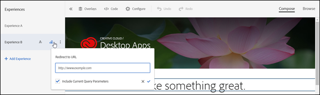

# Redirection vers une URL

Utilisez l’option [!UICONTROL Redirect to URL] de [!DNL Adobe Target] lorsque vous souhaitez envoyer le visiteur sur une autre page plutôt que d’afficher du contenu sur la même page.

Vous pouvez avoir deux pages complètement différentes à tester au lieu de modifier simplement des éléments de contenu d’une page. Dans ce cas, votre test A/B compare la page A à la page B. Configurez une campagne de test A/B avec deux expériences : l’une pointant vers la page par défaut A, l’autre redirigeant vers la page B. Dans le menu Action d’expérience, situé en cliquant sur le libellé de lettre de l’expérience, choisissez **[!UICONTROL Redirect to URL]** et spécifiez l’URL de la page B. L’offre est configurée pour rediriger le visiteur vers une autre page.

L’offre de redirection exécute un code JavaScript pour rediriger le navigateur. Il utilise la méthode `window.location.replace();`, de sorte que la page à partir de laquelle le visiteur est redirigé ne soit pas stockée dans l’historique du navigateur. Le visiteur peut ainsi toujours utiliser le bouton permettant de retourner à la page précédente dans le navigateur.

Les offres de redirection ont quelques limites :

* Pour les offres de redirection dans les activités utilisant A4T, votre mise en œuvre doit respecter certaines conditions préalables minimales. En outre, vous devez prendre connaissance de certaines informations importantes. Pour plus d’informations, voir [FAQ sur les offres de redirection (A4T)](/help/main/c-integrating-target-with-mac/a4t/r-a4t-faq/a4t-faq-redirect-offers.md#concept_21BF213F10E1414A9DCD4A98AF207905).
* Lors de l’utilisation du compositeur d’expérience d’après les formulaires, les offres de redirection ne doivent pas être utilisées dans des mbox qui font partie de la page. Une offre de redirection ne doit être utilisée qu’à partir d’une balise de script qui fait partie de la balise HTML `<head>`. Vous devez toujours utiliser l’auto création et définir l’offre de redirection pour la mbox globale.

>[!NOTE]
>
>Si vous souhaitez transmettre la valeur de référence de la page de destination, il est recommandé d’utiliser une offre HTML plutôt qu’une offre de redirection.

Pour créer une offre de redirection :

1. Créez une expérience.
1. Passez la souris sur une expérience, puis cliquez sur l’icône Rediriger vers l’URL ().

   

1. Saisissez l’URL.
1. Si vous le souhaitez, sélectionnez l’option permettant d’inclure les paramètres de requête actuels.

   Si cette option est sélectionnée, tout élément après le point d’interrogation (?) dans l’URL du visiteur est ajouté à l’URL de redirection au moment de la redirection.

   Cette option est sélectionnée par défaut.
1. (Facultatif) Créez des règles supplémentaires.

   Les règles supplémentaires peuvent être basées sur les éléments suivants :

   * URL
   * Domaine
   * Chemin
   * Fragment de hachage (#)
   * Requête
   * Paramètre de mbox

   Les règles supplémentaires peuvent être jointes à l’URL à l’aide d’un opérateur ET ou OU. Toutes les règles ajoutées sont évaluées les unes par rapport aux autres avec un opérateur ET.

## Problèmes connus

* Dans les mises en œuvre d’at.js, les activités de redirection peuvent provoquer l’entrée dans une boucle de l’URL d’aperçu (la distribution de l’offre se répète). Vous pouvez utiliser le [mode Assurance qualité](/help/main/c-activities/c-activity-qa/activity-qa.md) au lieu d’effectuer l’aperçu et la vérification de la qualité. Ce problème n’a aucun impact sur la distribution réelle de l’offre. (TGT-23019)
