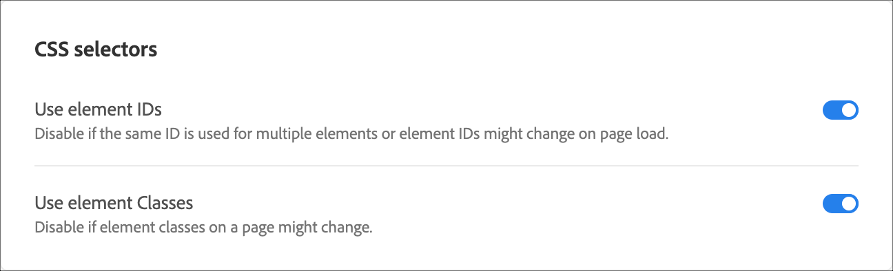

# Sélecteurs d’éléments utilisés dans le compositeur d’expérience visuelle

Un sélecteur d’éléments est une expression CSS qui peut identifier un ou plusieurs éléments.

Vous pouvez trouver des informations de base à propos des sélecteurs CSS dans le document [Selectors (Sélecteurs)](https://developer.mozilla.org/en-US/docs/Web/Guide/CSS/Getting_started/Selectors) du MDN (Mozilla Developer Network, réseau de développeurs Mozilla).

Vous pouvez définir si vous utilisez l’élément classé ou les ID d’élément dans vos préférences de compte. Cliquez sur **[!UICONTROL Administration > Compositeur d’expérience visuelle]**, puis choisissez vos sélecteurs CSS préférés.



>[!NOTE]
>
>Les classes d’éléments sont disponibles en tant que sélecteurs dans les activités de test A/B, de personnalisation automatisée, de ciblage d’expérience et de test multivarié.

Pour plus d’informations sur quand utiliser des sélecteurs CSS et quand utiliser des identifiants uniques, consultez les [Bonnes pratiques et limites du compositeur d’expérience visuelle](/help/main/c-experiences/c-visual-experience-composer/experience-composer-best-practices.md#concept_E284B3F704C04406B174D9050A2528A6).

## Adobe [!DNL Target] Génère un sélecteur pour un élément {#section_D89D954BCBFB486CA081BE183776A475}

Target utilise un algorithme simple pour créer un sélecteur. Vous trouverez ci-dessous une brève explication de la logique de génération :

1. Si un élément comporte un identifiant, par exemple `id="container"`, alors le sélecteur pour l’élément est `#container`.

   Par exemple :

   ```html
   <div class="wrapper">
     <div id="container"> <!-- Selector is computed for this element -->
       <ul class="navigation">
         <li class="item active"> Home </li>
         <li class="item"> Men </li>
         <li class="item"> Women </li>
         <li class="item"> Kids </li>
       </ul>
     </div>
   </div>
   ```

1. Si un élément comporte un attribut de classe, Target tente d’exploiter la première classe de n’importe quelle classe présente sur l’élément.

   Target tente d’analyser l’élément parent jusqu’à ce qu’il trouve l’élément `<HTML>` ou un élément avec un identifiant. Chaque fois qu’un élément comporte un id et que le sélecteur est calculé sur son enfant descendant, l’id de cet élément contribue au sélecteur.

   Par exemple :

   ```html
   <div class="wrapper">
     <div id="container"> <!-- id is present here. It contributes to selector -->
       <ul class="navigation">
         <li class="item active"> Home </li> <!-- Selector is computed for this element -->
         <li class="item"> Men </li>
         <li class="item"> Women </li>
         <li class="item"> Kids </li>
       </ul>
     </div>
   </div>
   ```

   Dans cet exemple :

   Sélecteur : `#container` > `ul.navigation:eq(0)` > `li.item:eq(0)` (« > » indique l’enfant immédiat.)

   `eq` indique à l’index qu’il y a un élément qui comporte &quot;tagName=UL&quot; et que la première classe est `navigation`. Par conséquent, `index` est égal à 0. Pour plus d’informations, voir l’article [Selectors (Sélecteurs)](https://developer.mozilla.org/en-US/docs/Web/Guide/CSS/Getting_started/Selectors) dans MDN.

1. Si un élément ne comporte pas de classe, Target utilise `tagName` comme élément et examine l’élément parent jusqu’à ce que l’élément `<HTML>` ou un élément avec identifiant soit trouvé.

   Par exemple :

   ```html
   <div class="wrapper">
     <div id="container"> <!-- id is present here. It contributes to selector -->
       <ul class="navigation">
         <li> Home </li>
         <li> Men </li>
         <li class="active"> Women </li>
         <li> Kids </li><!-- Selector is computed for this element -->
       </ul>
     </div>
   </div>
   ```

   Sélecteur : `#container` > `ul.navigation(0)` > `li:nth-of-type(4)`.

   Vous pouvez en savoir plus sur [nth-of-type sur la page web des astuces CSS](https://css-tricks.com/almanac/selectors/n/nth-of-type/).

Dans le processus ci-dessus :

* Vous pouvez utiliser n’importe quel sélecteur CSS tant qu’il identifie de manière unique un élément dans le DOM.
* L’approche ci-dessus est celle utilisée par Target. Target ne rend pas obligatoire l’utilisation de cette approche. Vous pouvez ajouter n’importe quel sélecteur tant que le point n° 1 est vrai.
* Vous pouvez utiliser n’importe quel attribut dans le sélecteur. Ce document n’utilise le nom de classe que comme exemple.
