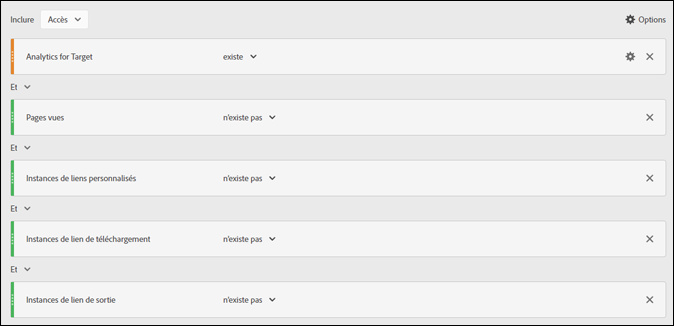

# Minimisation du nombre de visiteurs ou de visites exagéré dans A4T

Informations destinées à vous aider à minimiser les effets d’un nombre de visiteurs ou de visites exagéré lors de l’utilisation d’[!DNL Adobe Analytics] comme source des rapports pour [!DNL Adobe Target] (A4T).

>[!IMPORTANT]
>Le 14 novembre 2016, Adobe Analytics a modifié la façon dont certaines données sont traitées pour les clients qui utilisent la création de rapports Analytics for Target (A4T). Ces modifications améliorent l’alignement entre les données Adobe Target et le modèle de données d’Adobe Analytics. Ces modifications ont été déployées pour tous les clients utilisant A4T. Ces modifications ont pour but de résoudre un problème en raison duquel certains clients ont remarqué un nombre de visiteurs exagéré lors de l’exécution d’activités Target.
>
>Cette modification n’est pas rétroactive. Si vos rapports historiques indiquent des nombres exagérés et que vous souhaitez les exclure de vos rapports, vous pouvez créer une suite de rapports virtuelle, comme expliqué ci-dessous.
>
>Par ailleurs, plusieurs bibliothèques JavaScript ont été mises à jour afin de minimiser les nombres de visites ou de visiteurs exagérés. Adobe vous recommande de mettre les bibliothèques à niveau vers les versions de bibliothèque suivantes (ou ultérieures) :
>
>* Service d’identification des visiteurs d’Experience Cloud : visitorAPI.js version 2.3.0 ou ultérieure.
>* Adobe Analytics : appMeasurement.js version 2.1.
>* Adobe Target : at.js version 0.9.6 ou ultérieure (à l’exception de la version 1.1.0 si vous utilisez les offres de redirection avec A4T).

## Qu’est-ce qui a changé ?  {#section_9CCF45F5D66D48EBA88F3A178B27D986}

Lorsqu’[!DNL Adobe Analytics] est utilisé pour mesurer les activités [!DNL Target] (sous le nom A4T), [!DNL Analytics] collecte des données supplémentaires qui ne sont pas disponibles lorsqu’il n’y a pas d’activité [!DNL Target] sur la page. L’activité [!DNL Target] déclenche un appel en haut de la page, tandis qu’[!DNL Analytics] déclenche généralement ses appels de collecte de données au bas de la page. Dans l’implémentation d’A4T actuelle, Adobe a inclus ces données supplémentaires chaque fois qu’une activité [!DNL Target] était active. À l’avenir, Adobe incluera ces données supplémentaires uniquement en cas de déclenchement des balises [!DNL Target] et [!DNL Analytics].

## Pourquoi Adobe a-t-il apporté cette modification ? {#section_92380A4BD69E4B8886692DD27540C92A}

Adobe se targue de la précision et de la qualité des données. Lorsque la balise [!DNL Target] se déclenche, mais pas la balise [!DNL Analytics], Analytics enregistre « données partielles » (parfois appelées « accès désassemblés »). Sans activité [!DNL Target], ces accès désassemblés ne seraient pas capturés par [!DNL Analytics]. Si l’inclusion des données partielles dans les rapports [!DNL Analytics] fournit des informations supplémentaires, elle crée également des incohérences par rapport aux données historiques des périodes où aucune activité [!DNL Target] n’était active. Cette situation peut être source de problèmes pour les utilisateurs d’[!DNL Analytics] qui analysent les tendances qui se dégagent au fil du temps. Afin d’assurer la cohérence des données dans [!DNL Analytics], l’Adobe exclut toutes les données partielles.

## Qu’est-ce qui contribue aux données partielles ?  {#section_C9C906BEAA7D44DAB9D3C03932A2FEB8}

Adobe a rencontré des clients qui enregistraient des taux élevés de données partielles dans [!DNL Analytics]. Un taux élevé de données partielles peut résulter d’une implémentation incorrecte, mais il existe également des causes légitimes.

Les causes identifiées des données partielles incluent :

* **Alignement incorrect des identifiants de suites de rapports (implémentation) :** la suite de rapports spécifiée lors de la configuration d’une activité ne correspond pas à la suite de rapports de la page où le test est diffusé. Les données ne peuvent pas être réconciliées sur les serveurs [!DNL Analytics], elles ressemblent donc à des données partielles.
* **Pages lentes :** [!DNL Target] les appels se trouvent en haut de la page et les appels [!DNL Analytics] se trouvent généralement en bas de la page. Si la page se charge lentement, cela augmente la probabilité qu’un visiteur quitte la page après le déclenchement de l’appel à [!DNL Target], mais avant l’appel à [!DNL Analytics]. Les pages lentes peuvent s’avérer particulièrement problématiques sur les sites web mobiles où les connexions sont souvent plus lentes.
* **Erreurs de page :** en cas d’erreurs JavaScript ou d’autres scénarios où tous les points de contact ne se déclenchent pas (service d’Experience Cloud ID, Target et Analytics), des données partielles sont générées.
* **Offres de redirection dans l’activité [!DNL Target] :** pour les offres de redirection dans les activités utilisant A4T, votre mise en œuvre doit respecter certaines conditions préalables minimales. En outre, vous devez prendre connaissance de certaines informations importantes. Pour plus d’informations, consultez la [FAQ sur les offres de redirection (A4T)](/help/main/c-integrating-target-with-mac/a4t/r-a4t-faq/a4t-faq-redirect-offers.md#section_FA9384C2AA9D41EDBCE263FFFD1D9B58).
* **Versions obsolètes des bibliothèques :** au cours de l’année écoulée, Adobe a apporté diverses améliorations aux bibliothèques JavaScript ([!DNL appMeasurement.js], `at.js`, et `visitorAPI.js`) pour garantir un envoi de données aussi efficace que possible. Pour en savoir plus sur les exigences d’implémentation, consultez la page [Avant l’implémentation](/help/main/c-integrating-target-with-mac/a4t/before-implement.md#concept_046BC89C03044417A30B63CE34C22543).

## Quelles sont les bonnes pratiques pour réduire les données partielles ? {#section_065C38501527451C8058278054A1818D}

Pour réduire la collecte de données partielles, nous vous recommandons de passer en revue les étapes suivantes :

| Étape | Tâche |
| --- | --- |
|  | Assurez-vous que la suite de rapports sélectionnée dans [!DNL Target] est identique à celle présente sur les pages où l’activité est présentée. |
|  | Assurez-vous que les bibliothèques visitorAPI.js, appMeasurement.js, et at.js se trouvent sur des versions compatibles avec A4T. Pour en savoir plus sur les exigences d’implémentation, voir [Avant l’implémentation](/help/main/c-integrating-target-with-mac/a4t/before-implement.md). |
|  | Vérifiez que le SDID est défini sur tous les appels [!DNL Target] et [!DNL Analytics] qui quittent la page et que les SDID correspondent. Utilisez un analyseur de réseau ou un outil de débogage pour vérifier que le paramètre `mboxMCSDID` sur l’appel à [!DNL Target] correspond au paramètre SDID de l’appel à [!DNL Analytics]. |
|  | Vérifiez que les bibliothèques d’implémentation se chargent dans l’ordre correct sur vos sites. Pour plus d’informations, voir [Implémentation d’Analytics for Target](/help/main/c-integrating-target-with-mac/a4t/a4timplementation.md). |

## Comment puis-je voir de combien de données partielles je dispose ? {#section_89B663E2824A4805AB934153508A0F4B}

Ces informations ne sont pas directement disponibles dans [!DNL Analytics], mais vous pouvez contacter l’Assistance clientèle d’Adobe pour obtenir un rapport de données partielles. Ce rapport est destiné à faciliter le débogage.

## Comment puis-je afficher les tendances historiques sans les données partielles ? {#section_4C9DED560FAD4428B362DDA2064897C3}

Cette modification du traitement des données n’affecte les données qu’après la date de sortie (14 novembre 2016). Si vous souhaitez ajuster vos mesures historiques pour les faire correspondre, Adobe vous recommande de créer un segment afin d’exclure les données partielles.

Les informations suivantes relatives à cette modification incluent des instructions destinées à vous aider à définir le segment et à l’appliquer à une suite de rapports virtuelle pour que ce segment soit toujours appliqué à vos vues [!DNL Analytics].

Dans la plupart des cas, un [!DNL Target] accès est associé à un [!DNL Analytics] accès sur chaque page web. Cet assemblage se produit lorsqu’un paramètre SDID cohérent se trouve à la fois dans un appel [!DNL Target] et [!DNL Analytics] et qu’un appel [!DNL Experience Cloud ID] (MCID) se trouve dans un appel [!DNL Analytics] sur la même page. [!DNL Target] dispose également du MCID, mais si l’appel à [!DNL Target] se produit avant le retour de l’ID du visiteur, l’accès reste assemblé en raison du SDID. L’utilisateur peut également rester suffisamment longtemps sur la page pour déclencher un appel à [!DNL Analytics] après qu’un appel à [!DNL Target] ait été déclenché. Ce scénario est idéal.

**Accès aux données partielles :** les utilisateurs ne restent parfois pas suffisamment longtemps sur une page pour envoyer un appel à [!DNL Analytics], mais [!DNL Target] dispose d’un MCID correct. De ce fait, les accès enregistrent des données partielles (accès sans affichage de la page [!DNL Analytics]). Si ces utilisateurs reviennent sur votre site et consultent une page comportant du code [!DNL Analytics], ils seront probablement comptés en tant que visiteurs récurrents. Ces accès auraient été perdus si la page ne comportait que du code [!DNL Analytics]. Certains clients ne souhaitent pas récupérer les données de ces accès car elles exagèrent certaines mesures (visites) et diminuent d’autres mesures (nombre de pages vues par visite, durée par visite, etc.). Vous voyez également des visites sans aucune page vue. Toutefois, il existe de bonnes raisons de conserver ces données.

Afin de minimiser les accès à données partielles, vous pouvez faire charger votre page plus rapidement, mettre à jour les bibliothèques vers les versions les plus récentes ou créer une [suite de rapports virtuelle](https://experienceleague.adobe.com/docs/analytics/components/virtual-report-suites/vrs-workflow/vrs-create.html?lang=fr) qui exclut ces accès. Pour connaître les instructions étape par étape, consultez la page [Créer des suites de rapports virtuelles](https://experienceleague.adobe.com/docs/analytics/components/virtual-report-suites/vrs-workflow/vrs-create.html) dans le *Guide des composants d’Analytics*.

L’illustration suivante présente la définition de segment pour la suite de rapports virtuelle :

Lors de la création de la suite de rapports virtuelle, spécifiez la configuration suivante pour la définition de segment (comme présenté dans l’illustration ci-dessus) :

* **Afficher les accès :**
* Analytics for Target : Existe
* Et
* Pages vues : N’existe pas
* Et
* Instances de liens personnalisés : N’existe pas
* Et
* Instances de lien de téléchargement : N’existe pas
* Et
* Instances de lien de sortie : N’existe pas

**Accès orphelins :** il arrive parfois que les utilisateurs ne restent pas suffisamment longtemps sur la page pour un appel Analytics et Target n’obtient pas de MCID correct. Ces accès sont ce qu’Adobe définit comme étant des accès « orphelins ». Ils représentent les clients qui reviennent rarement et ils exagèrent le nombre de visites et de visiteurs de manière inappropriée.

Afin de minimiser ces accès « orphelins », vous pouvez créer une [suite de rapports virtuelle](https://experienceleague.adobe.com/docs/analytics/components/virtual-report-suites/vrs-workflow/vrs-create.html) qui exclut ces accès, comme expliqué ci-dessus.

## Quel impact cette modification a-t-elle sur mes rapports [!DNL Target] ? {#section_AAD354C722BE46D4875507F0FCBA5E36}

Une fois cette modification effectuée, vous verrez peut-être une diminution du nombre de visiteurs et de visites dans les tests en direct car [!DNL Adobe] ne traite plus les données partielles entrantes. Les conversions et les accès aux autres mesures [!DNL Analytics] ne connaîtront aucun changement.
