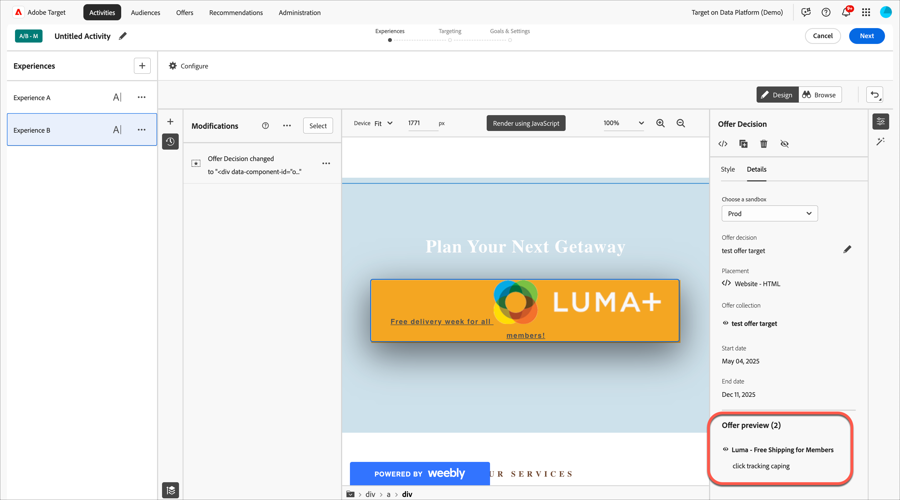

# Utilisation des décisions d’offre

Utilisez des [!DNL Adobe Target] avec les décisions d’offre [!DNL Adobe Journey Optimizer] pour déterminer et diffuser la meilleure offre pour vos visiteurs sur le web et les appareils mobiles.

Ajoutez des décisions d’offre créées en [!DNL Adobe Journey Optimizer] à des activités [!DNL Target] ([!UICONTROL A/B Test] manuelle ou [!UICONTROL Experience Targeting]) à l’aide du [!UICONTROL Visual Experience Composer] (VEC) ou de l’[!UICONTROL Form-Based Composer] pour tester et diffuser des offres personnalisées aux visiteurs sur vos canaux entrants optimisés par [!DNL Target].

Pour plus d’informations sur les [!DNL Adobe Journey Optimizer] et les décisions d’offre, consultez les rubriques suivantes de la documentation *[!DNL Journey Optimizer]* :

* [Prise en main de Journey Optimizer](https://experienceleague.adobe.com/docs/journey-optimizer/using/get-started/get-started.html)

* [À Propos De La Gestion Des Décisions](https://experienceleague.adobe.com/docs/journey-optimizer/using/offer-decisioning/get-started-decision/starting-offer-decisioning.html)

## Conditions préalables

Pour utiliser les décisions d’offre dans [!DNL Target], vous avez besoin des éléments suivants :

* [!DNL Adobe Target Standard] ou [!DNL Adobe Target Premium] implémentés à l’aide de [Adobe Experience Platform Web SDK](https://experienceleague.corp.adobe.com/docs/target-dev/developer/client-side/aep-web-sdk.html?lang=fr){target=_blank}.

  Cette fonctionnalité n’est pas disponible lors de l’implémentation de [!DNL Target] avec at.js ou d’autres SDK [!DNL Target].

* [!DNL Adobe Journey Optimizer Ultimate] (AJO + Offer Decisioning) ou [!DNL Adobe Experience Platform] et le module complémentaire de service d’application [!UICONTROL Offer Decisioning].

## Exemples de cas d’utilisation

Les exemples suivants sont des cas d’utilisation de l’intégration [!DNL Target]/[!DNL Adobe Journey Optimizer] pour utiliser les décisions d’offre dans des activités [!DNL Target] :

### Marchandisage sportif

En tant que spécialiste marketing pour une ligue sportive, vous souhaitez personnaliser le contenu de votre page d’accueil (sur les sites web de bureau et mobiles). Vous souhaitez personnaliser du contenu en fonction de plusieurs dimensions et présenter une offre pour des marchandises de franchise liées à la boutique. Ce qui vous intéresse, c’est :

* L&#39;équipe préférée du visiteur
* Activité récente d’un athlète ou d’un joueur (par exemple, mouvement d’équipe, mise à jour de contrat ou blessures)

Par exemple, vous souhaitez offrir une expérience personnalisée pour chacune des régions suivantes : Dortmund, Francfort et Bochum, ainsi que pour les utilisateurs qui sont des fans implicites et explicites de ces équipes. En tant que mesures, vous souhaitez examiner les visites et les clics sur le site de marchandisage.

Vous souhaitez concevoir une activité [!UICONTROL A/B Test] (répartition 50/50) entre l’expérience par défaut et l’expérience personnalisée (qui comprend une décision d’offre avec des offres pour chaque région et équipe). Vous souhaitez utiliser cette activité pour déterminer la conversion et l’effet élévateur pour l’expérience personnalisée par rapport au contrôle.

### Plateformes de streaming de jeux

En tant que spécialiste marketing pour une organisation de jeux, vous souhaitez proposer une offre personnalisée pour une plateforme de streaming de jeux pour les utilisateurs d’ordinateurs et de téléphones mobiles provenant de différentes régions : Allemagne, France, Mexique et Brésil. Lorsqu’un visiteur accède au site web pour ordinateur ou mobile à partir de l’une de ces zones géographiques, vous souhaitez proposer une offre de jeu en streaming dans la langue locale et au prix correspondant dans la devise locale.

Dans [!DNL Adobe Journey Optimizer], vous pouvez créer une offre héroïque de page d’accueil personnalisée pour chacune des zones géographiques ciblées, ainsi qu’une offre de secours avec un héros de page d’accueil par défaut. Vous pouvez ensuite créer une décision d’offre qui incorpore ces offres et leurs règles d’éligibilité. Ensuite, dans [!DNL Target], vous pouvez créer une activité [!DNL Experience Targeting] (XT) et insérer cette décision d’offre dans votre site web mobile ou de bureau pour offrir une expérience personnalisée aux visiteurs.

## Créez une expérience qui utilise une décision d’offre :

1. Lors de la modification ou de la création d’une [!UICONTROL A/B Test] manuelle ou d’une activité de [!UICONTROL Experience Targeting] (XT) dans le [!UICONTROL Visual Experience Composer] (VEC), cliquez sur un élément de page pour afficher le menu [options](/help/main/c-experiences/c-visual-experience-composer/viztarget-options.md).

   

   >[!NOTE]
   >
   >Vous pouvez également créer une expérience qui utilise des [!UICONTROL Offer Decisions] dans le [[!UICONTROL Form-Based Experience Composer]](/help/main/c-experiences/form-experience-composer.md).

1. Cliquez sur **[!UICONTROL Replace Content]**, puis sur **[!UICONTROL Offer Decision]**.

   L’option [!UICONTROL Offer Decision] est disponible lors de la modification ou de la création d’activités [[!UICONTROL A/B Test]](/help/main/c-activities/t-test-ab/test-ab.md#types) manuelles ou [[!UICONTROL Experience Targeting]](/help/main/c-activities/t-experience-target/experience-target.md) (XT) uniquement. Cette option n’est pas disponible pour les autres types d’activités. Les options disponibles dans le menu varient en fonction de l’élément sélectionné.

   

1. Dans le rail de **[!UICONTROL Add Offer Decision]** situé sur le côté droit du compositeur d’expérience visuelle, sélectionnez le sandbox souhaité, puis cliquez sur Sélectionner la décision d’offre.emplacement.

   Un [sandbox](https://experienceleague.adobe.com/docs/experience-platform/sandbox/ui/overview.html){target=_blank} dans le [!DNL Adobe Experience Platform] vous permet de partitionner votre instance en environnements virtuels. Par exemple, vous pouvez avoir un environnement de production et un environnement d’évaluation. Un [emplacement](https://experienceleague.adobe.com/docs/journey-optimizer/using/offer-decisioning/create-components/creating-placements.html){target=_blank} dans [!DNL Adobe Journey Optimizer] permet de s’assurer que le contenu d’offre approprié s’affiche au bon endroit.

   

1. Sélectionnez l’emplacement et la décision d’offres de votre choix, puis cliquez sur **[!UICONTROL Add]**.

   

   Votre site web s’affiche dans le compositeur d’expérience visuelle où vous pouvez voir la décision d’offre nouvellement créée dans le rail [!UICONTROL Modifications]. Vous pouvez cliquer sur une offre sous [!UICONTROL Offer Preview] au bas du rail de [!UICONTROL Offer Decision] pour examiner la décision d’offre.

   <!--You can examine the various offers contained in the offer by clicking the appropriate icon at the bottom of the [!UICONTROL Offer Preview] dialog box, including the fallback offer. A fallback offer is the default offer displayed when a visitor is not eligible for any of the personalized offers in the collection.-->

   

1. Terminez la création de l’activité en suivant les étapes [!UICONTROL Targeting] et [!UICONTROL Goals & Settings] du workflow en trois parties.

   >[!IMPORTANT]
   >
   >Pour vous assurer que l&#39;activité [!DNL Target] est personnalisée, assurez-vous que les dates de début/fin actuelles de l&#39;activité sont synchronisées avec les dates de début/fin de la décision d&#39;offre en [!DNL Adobe Journey Optimizer]. Si les dates de début/fin [!DNL Target] se trouvent en dehors de la plage de dates de début/fin de la décision d’offre, le contenu [!DNL Target] par défaut s’affiche pour les visiteurs.

## Remarques et limitations

Tenez compte des informations suivantes lorsque vous utilisez des décisions d’offre :

* L’intégration d’Offer Decisioning fonctionne pour les implémentations [!DNL Target] basées sur le [SDK Web Adobe Experience Platform](https://experienceleague.corp.adobe.com/docs/target-dev/developer/client-side/aep-web-sdk.html?lang=fr){target=_blank}. Cette fonctionnalité n’est pas disponible lors de l’implémentation de [!DNL Target] avec at.js ou d’autres SDK [!DNL Target].

* L’intégration [!DNL Target]/[!DNL Adobe Journey Optimizer] prend uniquement en charge les activités [[!UICONTROL A/B Test]](/help/main/c-activities/t-test-ab/test-ab.md#types) manuelles et [[!UICONTROL Experience Targeting]](/help/main/c-activities/t-experience-target/experience-target.md) (XT). Cette fonctionnalité n’est pas disponible pour les autres types d’activités.

* Vous ne pouvez pas utiliser [[!UICONTROL Analytics as the reporting source]](/help/main/c-integrating-target-with-mac/a4t/a4t.md) (A4T) si vous utilisez des décisions d’offre dans une activité . Choisissez [!DNL Target] comme source de création de rapports sur la page [!UICONTROL Goals and Settings] lors de la configuration de l’activité si vous utilisez les décisions d’offre dans l’activité.

* Les offres avec le type de contenu texte/html ne prennent pas en charge la diffusion de contenu deliveryURL. L’URL de diffusion est prise en charge par le [compositeur d’expérience d’après les formulaires](/help/main/c-experiences/form-experience-composer.md) uniquement lorsque le client est chargé de récupérer et de composer explicitement le contenu.

* Les rapports [!DNL Target] ne fournissent pas de rapports au niveau de la décision d’offre.

* La visualisation des [liens d’assurance qualité](/help/main/c-activities/c-activity-qa/activity-qa.md) pour les expériences [!DNL Target] contenant des décisions d’offre affecte le capping de la fréquence défini dans les [!DNL Adobe Journey Optimizer] de ces décisions d’offre.
