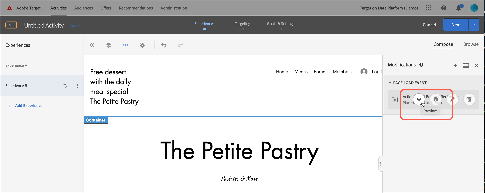

# Utilisation des décisions d’offre

Utilisez [!DNL Adobe Target] avec les décisions d’offre [!DNL Adobe Journey Optimizer] pour déterminer et diffuser la meilleure offre qui soit pour vos visiteurs sur le Web et sur mobile.

Ajoutez des décisions d’offre créées dans [!DNL Adobe Journey Optimizer] aux activités [!DNL Target] (manuelles [!UICONTROL A/B Test] ou [!UICONTROL Experience Targeting]) à l’aide du [!UICONTROL Visual Experience Composer] (VEC) ou du [!UICONTROL Form-Based Composer] pour tester et diffuser des offres personnalisées à vos visiteurs sur vos canaux entrants alimentés par [!DNL Target].

Pour plus d’informations sur [!DNL Adobe Journey Optimizer] et les décisions d’offre, consultez les rubriques suivantes dans la documentation *[!DNL Journey Optimizer]* :

* [Prise en main de Journey Optimizer](https://experienceleague.adobe.com/docs/journey-optimizer/using/get-started/get-started.html?lang=fr)

* [À propos de la gestion de décision](https://experienceleague.adobe.com/docs/journey-optimizer/using/offer-decisioning/get-started-decision/starting-offer-decisioning.html?lang=fr)

## Conditions préalables

Pour utiliser les décisions d’offre dans [!DNL Target], vous avez besoin des éléments suivants :

* [!DNL Adobe Target Standard] ou [!DNL Adobe Target Premium] implémentés à l’aide du [SDK Web de Adobe Experience Platform](https://experienceleague.corp.adobe.com/docs/target-dev/developer/client-side/aep-web-sdk.html?lang=fr){target=_blank}.

  Cette fonctionnalité n’est pas disponible lors de l’implémentation de [!DNL Target] avec at.js ou d’autres kits SDK [!DNL Target].

* [!DNL Adobe Journey Optimizer Ultimate] (AJO + Offer decisioning) ou [!DNL Adobe Experience Platform] et module complémentaire du service d’application [!UICONTROL Offer Decisioning].

## Exemples de cas d’utilisation

Les exemples suivants illustrent des cas d’utilisation de l’intégration [!DNL Target]/[!DNL Adobe Journey Optimizer] pour utiliser les décisions d’offre dans les activités [!DNL Target] :

### Marchandisage sportif

En tant que responsable marketing d’une ligue sportive, vous souhaitez personnaliser le contenu de votre page d’accueil (sur les ordinateurs de bureau et les sites web mobiles). Vous souhaitez personnaliser le contenu en fonction de plusieurs dimensions et présenter une offre pour acheter des marchandises en franchise liées à la boutique. Vous êtes intéressé par :

* L’équipe préférée du visiteur
* Activité athlète/joueur récente (par exemple, mouvement d’équipe, mises à jour de contrat ou blessures)

Par exemple, vous souhaitez offrir une expérience personnalisée pour chacune des régions suivantes : Dortmund, Francfort et Bochum, ainsi que pour les utilisateurs qui aiment implicitement et explicitement ces équipes. Pour les mesures, vous souhaitez consulter les visites et les clics sur le site de marchandisage.

Vous souhaitez concevoir une activité [!UICONTROL A/B Test] (division 50/50) entre l’expérience par défaut et l’expérience personnalisée (qui inclut une décision d’offre avec des offres pour chaque région et équipe). Vous souhaitez utiliser cette activité pour déterminer la conversion et l’effet élévateur de l’expérience personnalisée par rapport au contrôle.

### Plateformes de diffusion en continu de jeux

En tant que marketeur pour une organisation de jeux, vous souhaitez proposer une offre personnalisée pour une plate-forme de diffusion en continu de jeux pour les utilisateurs de bureau et de mobiles de différentes régions géographiques : Allemagne, France, Mexique et Brésil. Lorsqu’un visiteur accède au site web pour ordinateur ou mobile à partir de l’une de ces géographies, vous souhaitez diffuser une offre de diffusion en continu de jeux dans la langue locale avec un prix correspondant pour la devise locale.

Dans [!DNL Adobe Journey Optimizer], vous pouvez créer une offre principale de page d’accueil personnalisée pour chacune des zones géographiques ciblées, ainsi qu’une offre de secours avec une héroïne de page d’accueil par défaut. Vous pouvez ensuite créer une décision d’offre qui intègre ces offres et leurs règles d’éligibilité. Ensuite, dans [!DNL Target], vous pouvez créer une activité [!DNL Experience Targeting] (XT) et insérer cette décision d’offre dans votre bureau ou site web mobile pour offrir l’expérience personnalisée aux visiteurs.

## Créez une expérience qui utilise une décision d’offre :

1. Lors de la modification ou de la création d’une activité [!UICONTROL A/B Test] ou [!UICONTROL Experience Targeting] manuelle (XT) dans le [!UICONTROL Visual Experience Composer] (VEC), cliquez sur un élément de page pour afficher le [menu options](/help/main/c-experiences/c-visual-experience-composer/viztarget-options.md).

   

   >[!NOTE]
   >
   >Vous pouvez également créer une expérience qui utilise [!UICONTROL Offer Decisions] dans [[!UICONTROL Form-Based Experience Composer]](/help/main/c-experiences/form-experience-composer.md).

1. Cliquez sur **[!UICONTROL Insert Before]**, **[!UICONTROL Insert After]** ou **[!UICONTROL Replace Content]**, puis sur **[!UICONTROL Offer Decision]**.

   L’option [!UICONTROL Offer Decision] est disponible uniquement lors de la modification ou de la création d’activités [manuelles [!UICONTROL A/B Test]](/help/main/c-activities/t-test-ab/test-ab.md#types) ou [[!UICONTROL Experience Targeting]](/help/main/c-activities/t-experience-target/experience-target.md) (XT). Cette option n’est pas disponible pour les autres types d’activité. Les options disponibles dans le menu varient en fonction de l’élément sélectionné.

   

1. Dans la boîte de dialogue **[!UICONTROL Add Offer Decision]**, sélectionnez l’environnement de test et l’emplacement souhaités.

   Un [sandbox](https://experienceleague.adobe.com/docs/experience-platform/sandbox/ui/overview.html?lang=fr){target=_blank} dans [!DNL Adobe Experience Platform] vous permet de partitionner votre instance en environnements virtuels. Par exemple, vous pouvez avoir un environnement de production et un environnement intermédiaire. Un [emplacement](https://experienceleague.adobe.com/docs/journey-optimizer/using/offer-decisioning/create-components/creating-placements.html?lang=fr){target=_blank} dans [!DNL Adobe Journey Optimizer] permet de s’assurer que le contenu d’offre approprié s’affiche au bon emplacement.

   

1. Sélectionnez la décision d’offre souhaitée, puis cliquez sur **[!UICONTROL Create]**.

   

   Votre site web s’affiche dans le VEC, où vous pouvez voir la décision d’offre nouvellement créée dans le volet [!UICONTROL Modifications] sur le côté droit. Vous pouvez passer le pointeur de la souris sur la modification et cliquer sur l’icône [!UICONTROL Preview] pour examiner la décision concernant l’offre.

   

   Vous pouvez examiner les différentes offres contenues dans l’offre en cliquant sur l’icône appropriée au bas de la boîte de dialogue [!UICONTROL Offer Preview], y compris l’offre de secours. Une offre de secours est l’offre par défaut affichée lorsqu’un visiteur n’est éligible à aucune des offres personnalisées de la collection.

   

1. Terminez la création de l’activité en suivant les étapes [!UICONTROL Targeting] et [!UICONTROL Goals & Settings] du workflow assisté en trois parties.

   >[!IMPORTANT]
   >
   >Pour vous assurer que l’activité [!DNL Target] est personnalisée, assurez-vous que les dates de début/fin actuelles de l’activité sont synchronisées avec les dates de début/fin de la décision d’offre dans [!DNL Adobe Journey Optimizer]. Si les dates de début et de fin [!DNL Target] se situent en dehors de la plage de dates de début et de fin de la décision de l’offre, le contenu par défaut [!DNL Target] s’affiche pour les visiteurs.

   

## Remarques et limitations

Tenez compte des informations suivantes lorsque vous travaillez avec les décisions d’offre :

* L’intégration de l’offer decisioning fonctionne pour les implémentations de [!DNL Target] basées sur le [SDK Web de Adobe Experience Platform](https://experienceleague.corp.adobe.com/docs/target-dev/developer/client-side/aep-web-sdk.html?lang=fr){target=_blank}. Cette fonctionnalité n’est pas disponible lors de l’implémentation de [!DNL Target] avec at.js ou d’autres kits SDK [!DNL Target].

* L’intégration [!DNL Target]/[!DNL Adobe Journey Optimizer] prend uniquement en charge les activités [ manuelles [!UICONTROL A/B Test]](/help/main/c-activities/t-test-ab/test-ab.md#types) et [[!UICONTROL Experience Targeting]](/help/main/c-activities/t-experience-target/experience-target.md) (XT). Cette fonctionnalité n’est pas disponible pour les autres types d’activité.

* Vous ne pouvez pas utiliser [[!UICONTROL Analytics as the reporting source]](/help/main/c-integrating-target-with-mac/a4t/a4t.md) (A4T) si vous utilisez des décisions d’offre dans une activité. Sélectionnez [!DNL Target] comme source de création de rapports sur la page [!UICONTROL Goals and Settings] lors de la configuration de l’activité si vous utilisez les décisions d’offre dans l’activité.

* Les offres de type de contenu texte/html ne prennent pas en charge la diffusion de contenu deliveryURL. L’URL de diffusion est prise en charge par le [ compositeur d’expérience d’après les formulaires ](/help/main/c-experiences/form-experience-composer.md) uniquement lorsque le client est chargé de récupérer et de composer explicitement le contenu.

* La création de rapports [!DNL Target] ne fournit pas de rapports de niveau décision d’offre.

* La visualisation de [ liens d’assurance qualité ](/help/main/c-activities/c-activity-qa/activity-qa.md) pour les expériences [!DNL Target] qui contiennent des décisions d’offre affecte le plafonnement de la fréquence défini dans [!DNL Adobe Journey Optimizer] pour ces décisions d’offre.
