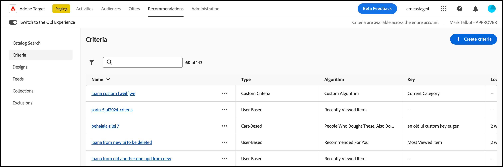

# [!UICONTROL Criteria]

[!UICONTROL Criteria] dans [!DNL Adobe Target] [!DNL Recommendations] sont des règles qui déterminent quels produits ou contenu recommander selon un jeu prédéterminé de comportements de visiteurs. Les critères peuvent être basés sur les tendances populaires, les comportements actuels et passés d’un visiteur ou des produits et contenus similaires. Vous pouvez tester plusieurs types de recommandations les uns par rapport aux autres en ajoutant plusieurs critères.

Les sections suivantes expliquent plus en détail les clés de critère et la logique de recommandation que vous pouvez utiliser pour chaque clé. Cliquez sur les liens pour obtenir des informations plus détaillées.

## Secteur industriel vertical {#section_936BCFCF234C49A2BEC1C38AAC2D71AF}

Lors de la création d’un critère, vous sélectionnez un secteur industriel vertical en fonction des objectifs de votre activité de recommandations.

| Secteur industriel vertical | Objectif |
|--- |--- |
| [!UICONTROL Retail/Ecommerce] | Conversion entraînant un achat |
| [!UICONTROL Lead Generation/B2B/Financial Services] | Conversion sans achat |
| [!UICONTROL Media/Publishing] | Engagement |

Les autres options de critère changent en fonction du secteur industriel vertical que vous sélectionnez. Vous pouvez définir votre secteur industriel vertical par défaut sur la page **[!UICONTROL Administration]>[!UICONTROL Recommendations]** ou vous pouvez spécifier le secteur industriel vertical pour chaque critère.

## Type d’algorithme {#section_885B3BB1B43048A88A8926F6B76FC482}

Le type d’algorithme sélectionné détermine les algorithmes disponibles.

Le tableau suivant explique les différents types d’algorithmes et leurs algorithmes associés.

| Type d’algorithme | Quand utiliser | Algorithmes disponibles |
| --- | --- | --- |
| [!UICONTROL Cart-Based] | Effectuez des recommandations en fonction du contenu du panier de l’utilisateur. | <ul><li>[!UICONTROL People Who Viewed These, Also Viewed]</li><li>[!UICONTROL People Who Viewed These, Also Bought]</li><li>[!UICONTROL People Who Bought These, Also Bought]</li></ul>Pour plus d’informations, voir [Basé sur le panier](/help/main/c-recommendations/c-algorithms/base-the-recommendation-on-a-recommendation-key.md#cart-based) dans *Baser la recommandation sur une clé de recommandation*. |
| [!UICONTROL Popularity-Based] | Effectuez des recommandations en fonction de la popularité globale d’un élément sur votre site ou de la popularité des éléments au sein de la catégorie, de la marque, du genre, préférée ou la plus consultée d’un utilisateur, etc. | <ul><li>[!UICONTROL Most Viewed Across the Site]</li><li>[!UICONTROL Most Viewed by Category]</li><li>[!UICONTROL Most Viewed by Item Attribute]</li><li>[!UICONTROL Top Sellers Across the Site]</li><li>[!UICONTROL Top Sellers by Category]</li><li>[!UICONTROL Top Sellers by Item Attribute]</li><li>[!UICONTROL Top by Analytics Metric]</li></ul> |
| [!UICONTROL Item-Based] | Effectuez des recommandations sur la base de la recherche d’éléments similaires à un élément que l’utilisateur consulte actuellement ou a récemment consulté. | <ul><li>[!UICONTROL People Who Viewed This, Viewed That]</li><li>[!UICONTROL People Who Viewed This, Bought That]</li><li>[!UICONTROL People Who Bought This, Bought That]</li><li>[!UICONTROL Items with Similar Attributes]</li></ul> |
| [!UICONTROL User-Based] | Effectuez des recommandations en fonction du comportement de l’utilisateur. | <ul><li>[!UICONTROL Recently Viewed Items]</li><li>[!UICONTROL Recommended for You]</li></ul> |
| [!UICONTROL Custom Criteria] | Faites des recommandations en fonction d’un fichier personnalisé que vous chargez. | <ul><li>Algorithme personnalisé</li></ul> |

Pour plus d’informations sur chaque algorithme, voir [Baser la recommandation sur une clé de recommandation](/help/main/c-recommendations/c-algorithms/base-the-recommendation-on-a-recommendation-key.md).

## Utilisation d’une clé de recommandation personnalisée {#custom-key}

Vous pouvez également baser les recommandations sur la valeur d’un attribut de profil personnalisé.

>[!NOTE]
>
>Les paramètres de profil personnalisés peuvent être transmis à [!DNL Target] via JavaScript, l’API ou les intégrations. Pour plus d’informations sur les attributs de profil personnalisés, voir [Profils des visiteurs](/help/main/c-target/c-visitor-profile/visitor-profile.md).

Supposons, par exemple, que vous souhaitiez afficher les films recommandés en fonction du film ajouté le plus récemment à la file d’attente par un utilisateur.

1. Cliquez sur **[!UICONTROL Recommendations]** > **[!UICONTROL Criteria]**.

1. Cliquez sur **[!UICONTROL Create Criteria]** > **[!UICONTROL Create Criteria]**.

1. Renseignez les informations de la [section Informations de base](/help/main/c-recommendations/c-algorithms/create-new-algorithm.md#info).

1. Dans la section [Algorithme recommandé](/help/main/c-recommendations/c-algorithms/create-new-algorithm.md#rec-algo) , sélectionnez **[!UICONTROL Item Based]** dans la liste **[!UICONTROL Algorithm Type]**.

1. Sélectionnez **[!UICONTROL People Who Viewed This, Viewed That]** dans la liste **[!UICONTROL Algorithm]**.

1. Sélectionnez votre attribut de profil personnalisé dans la liste **[!UICONTROL Recommendation Key]** (par exemple, [!UICONTROL Last Show Added to Watchlist]).

## Affichage des informations sur les critères {#section_7162DE58E4594FD688A4D7FDB829FD8B}

Vous pouvez afficher les détails des critères en cliquant sur les critères de votre choix dans la colonne [!UICONTROL Name].

L’onglet **[!UICONTROL Algorithm Info]** vous permet d’afficher des informations générales sur les critères sélectionnés, y compris leurs [!UICONTROL Name], [!UICONTROL Description], [!UICONTROL Industry Vertical], [!UICONTROL Page Types], [!UICONTROL Recommendation Key], [!UICONTROL Recommendation Logic], [!UICONTROL Algorithm ID] et informations de dernière modification (date et personne ayant modifié l’algorithme).

La section **[!UICONTROL Algorithm Usage]** vous permet de visualiser la liste des activités qui font référence aux critères sélectionnés.

>[!NOTE]
>
>La fonctionnalité [!UICONTROL Algorithm Usage] est actuellement prise en charge pour les activités [!DNL Recommendations] uniquement. Cette fonctionnalité n’est actuellement pas prise en charge pour les activités [!UICONTROL A/B Test], [!UICONTROL Auto-Allocate], [!UICONTROL Auto-Target] et [!UICONTROL Experience Targeting] (XT) qui incluent [des recommandations en tant qu’offre](/help/main/c-recommendations/recommendations-as-an-offer.md).