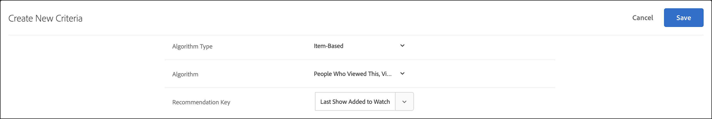

# Critères

Critères dans [!DNL Adobe Target] [!DNL Recommendations] sont des règles qui déterminent quels produits ou contenu recommander selon un ensemble prédéterminé de comportements de visiteurs. Les critères peuvent être basés sur des tendances populaires, les comportements actuel et passé d’un visiteur ou des produits et contenus similaires. Vous pouvez tester plusieurs types de recommandations les uns par rapport aux autres en ajoutant plusieurs critères.

Les sections suivantes expliquent plus d’informations sur les clés de critère et sur la logique de recommandation que vous pouvez utiliser pour chaque clé. Cliquez sur les liens pour obtenir des informations plus détaillées.

## Secteur industriel vertical {#section_936BCFCF234C49A2BEC1C38AAC2D71AF}

Lors de la création d’un critère, vous sélectionnez un secteur industriel vertical en fonction des objectifs de votre activité de recommandations.

| Secteur industriel vertical | Objectif |
|--- |--- |
| Vente au détail / commerce électronique | Conversion entraînant un achat |
| Génération de piste / B2B / Services financiers | Conversion sans achat |
| Médias / Publication | Engagement |

Les autres options de critère changent en fonction du secteur industriel vertical que vous sélectionnez. Vous pouvez définir votre secteur industriel vertical par défaut sur le **[!UICONTROL Recommendations > Paramètres]** ou vous pouvez spécifier le secteur industriel vertical pour chaque critère.

## Type d’algorithme {#section_885B3BB1B43048A88A8926F6B76FC482}

Le type d’algorithme sélectionné détermine les algorithmes disponibles. Il existe plusieurs types d’algorithmes, qui sont représentés sous forme de cartes de critères lorsque vous configurez une [!DNL Recommendations] activité.

Le tableau suivant explique les différents types d’algorithmes et leurs algorithmes associés.

| Type d’algorithme | Quand utiliser | Algorithmes disponibles |
| --- | --- | --- |
| [!UICONTROL Basé sur le panier] | Effectuez des recommandations en fonction du contenu du panier de l’utilisateur. | <ul><li>Les personnes qui les ont consultés ont consulté ceux-ci</li><li>Les personnes qui les ont consultés ont acheté ces</li><li>Les personnes qui ont acheté ceux-ci ont acheté ceux-là</li></ul>Pour plus d’informations, voir [Basé sur le panier](/help/main/c-recommendations/c-algorithms/base-the-recommendation-on-a-recommendation-key.md#cart-based) in *Baser la recommandation sur une clé de recommandation*. |
| [!UICONTROL Basé sur la popularité] | Effectuez des recommandations en fonction de la popularité globale d’un élément sur votre site ou de la popularité des éléments au sein de la catégorie, de la marque, du genre, préférée ou la plus consultée d’un utilisateur, etc. | <ul><li>Les plus consultés sur le site</li><li>Les plus consultés par catégorie</li><li>Attribut d’élément le plus consulté</li><li>Meilleurs vendeurs sur le site</li><li>Meilleurs vendeurs par catégorie</li><li>Meilleurs vendeurs par attribut d’article</li><li>Mesure Début par Analytics</li></ul> |
| [!UICONTROL Basé sur des éléments] | Effectuez des recommandations sur la base de la recherche d’éléments similaires à un élément que l’utilisateur consulte actuellement ou a récemment consulté. | <ul><li>Les personnes ayant consulté ceci ont consulté cela</li><li>Les personnes ayant consulté ceci ont acheté cela</li><li>Les personnes ayant acheté ceci ont acheté cela</li><li>Éléments avec des attributs similaires</li></ul> |
| [!UICONTROL Basé sur les utilisateurs] | Effectuez des recommandations en fonction du comportement de l’utilisateur. | <ul><li>Éléments récemment consultés</li><li>Recommandé pour vous</li></ul> |
| [!UICONTROL Critères personnalisés] | Faites des recommandations en fonction d’un fichier personnalisé que vous chargez. | <ul><li>Algorithme personnalisé</li></ul> |

Pour plus d’informations sur chaque algorithme, voir [Baser la recommandation sur une clé de recommandation](/help/main/c-recommendations/c-algorithms/base-the-recommendation-on-a-recommendation-key.md).

## Utilisation d’une clé de recommandation personnalisée {#custom-key}

Vous pouvez également baser les recommandations sur la valeur d’un attribut de profil personnalisé.

>[!NOTE]
>
>Les paramètres de profil personnalisés peuvent être transmis à [!DNL Target] par le biais de JavaScript, d’API ou d’intégrations. Pour plus d’informations sur les attributs de profil personnalisés, voir [Profils de visiteur](/help/main/c-target/c-visitor-profile/visitor-profile.md).

Supposons, par exemple, que vous souhaitiez afficher les films recommandés en fonction du film ajouté le plus récemment à la file d’attente par un utilisateur.

1. Cliquez sur **[!UICONTROL Recommendations]** > **[!UICONTROL Critères]**.

1. Cliquez sur **[!UICONTROL Création de critères]** > **[!UICONTROL Création de critères]**.

1. Renseignez les informations de la section [Section Informations de base](/help/main/c-recommendations/c-algorithms/create-new-algorithm.md#info).

1. Dans le [Algorithme recommandé](/help/main/c-recommendations/c-algorithms/create-new-algorithm.md#rec-algo) , sélectionnez **[!UICONTROL Basé sur les éléments]** de la **[!UICONTROL Type d’algorithme]** liste.

1. Sélectionner **[!UICONTROL Les personnes ayant consulté ceci ont consulté cela]** de la **[!UICONTROL Algorithme]** liste.

1. Sélectionnez votre attribut de profil personnalisé dans la **[!UICONTROL Clé de recommandation]** list (par exemple, [!UICONTROL Dernier affichage ajouté à la liste de contrôle]).

   

## Affichage des informations sur les critères {#section_7162DE58E4594FD688A4D7FDB829FD8B}

Vous pouvez afficher les détails d’un critère sur une carte contextuelle en faisant glisser le pointeur de la souris sur une carte et en cliquant sur l’icône Informations sur une carte de critère sans ouvrir le critère.

Cliquez sur l’onglet **[!UICONTROL Informations sur l’algorithme]** pour afficher des informations générales sur le critère sélectionné, y compris son Nom, ses Descriptions, son Secteur industriel vertical, son ou ses Type(s) de page, sa Clé de recommandation, sa Logique de recommandation et son ID d’algorithme.

Cliquez sur l’onglet **[!UICONTROL Utilisation de l’algorithme]** pour afficher la liste des activités qui font référence au critère sélectionné. La carte répertorie les activités principales, inactives et de brouillon. Cliquez sur les listes déroulantes Activités actives/Activités inactives/Activités de brouillon pour afficher la liste complète des activités qui font référence à ce critère. Vous pouvez cliquer sur le lien Activité pour ouvrir l’activité à modifier.

>[!NOTE]
>
>Le [!UICONTROL Utilisation de l’algorithme] Cette fonctionnalité est actuellement prise en charge uniquement pour les activités Recommendations. Cette fonctionnalité n’est actuellement pas prise en charge pour les activités de test A/B, d’affectation automatique, de ciblage automatique et de ciblage d’expérience (XT) qui incluent : [recommandations en tant qu’offre](/help/main/c-recommendations/recommendations-as-an-offer.md).
