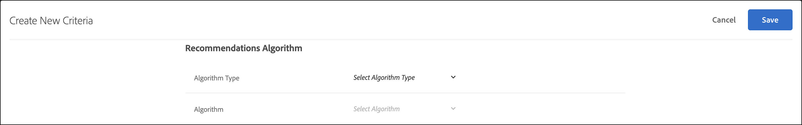

# Création de critères

Les critères de [!UICONTROL Adobe Target] [!UICONTROL Recommendations] contrôlent le contenu de vos activités [!UICONTROL Recommendations]. Créez des critères pour afficher les recommandations les plus appropriées pour votre activité. Ces critères utilisent les actions du visiteur ou de la visiteuse pour déterminer le contenu ou les produits à afficher.

Les sections suivantes expliquent comment créer un critère.

## Accès à l’écran Créer des critères

Il existe plusieurs façons d’accéder à l’écran [!UICONTROL Create New Criteria]. Certaines options de l’écran varient en fonction de l’accès à ce dernier.

* Sur l’écran **[!UICONTROL Recommendations]** > Bibliothèque **[!UICONTROL Criteria]**, cliquez sur **[!UICONTROL Create Criteria]** > **[!UICONTROL Create Criteria]**. Les critères que vous créez à cet emplacement deviennent automatiquement disponibles pour toutes les activités [!DNL Recommendations].
* Lorsque vous créez une activité de [!DNL Recommendations] à l’aide du [!UICONTROL Visual Experience Composer] (VEC), vous êtes immédiatement redirigé(e) vers l’écran de [!UICONTROL Select Criteria] après avoir sélectionné un élément sur votre page et cliqué sur [!UICONTROL Replace w/ Recommendations], [!UICONTROL Insert Recommendations Before] ou [!UICONTROL Insert Recommendations After]. Vous pouvez ensuite sélectionner un critère disponible ou cliquer sur **[!UICONTROL Create Criteria]**. Si vous créez un critère, vous avez la possibilité de l’enregistrer pour l’utiliser avec d’autres activités [!DNL Recommendations]. Pour plus d’informations, voir [Créer une activité Recommendations](/help/main/c-recommendations/t-create-recs-activity/create-recs-activity.md).
* Lorsque vous modifiez une activité de [!DNL Recommendations], cliquez dans une zone de [!UICONTROL Recommendations Location] de la page, puis sélectionnez **[!UICONTROL Change Criteria]**. Sur l’écran [!UICONTROL Select Criteria], cliquez sur **[!UICONTROL Create Criteria]**. Vous avez la possibilité d’enregistrer les nouveaux critères afin de les utiliser avec d’autres activités [!DNL Recommendations].

Les étapes suivantes supposent que vous accédez à l’écran de [!UICONTROL Create New Criteria] en utilisant la première méthode : **[!UICONTROL Recommendations]** > écran de bibliothèque **[!UICONTROL Criteria]**.

1. Cliquez sur **[!UICONTROL Recommendations]** > **[!UICONTROL Criteria]**.

1. Cliquez sur **[!UICONTROL Create Criteria]** > **[!UICONTROL Create Criteria]**.

1. Configurez les informations dans les sections suivantes.

## [!UICONTROL Basic Information] {#info}

1. Saisissez un **[!UICONTROL Criteria Name]**.

   C’est le nom « interne » utilisé pour décrire ce critère. Par exemple, vous voulez peut-être appeler votre critère « Produits générant la marge la plus élevée », mais vous ne voulez pas que ce titre soit affiché publiquement. Reportez-vous à la prochaine étape pour configurer le titre destiné au public.

1. Saisissez un **[!UICONTROL Display Title]** destiné au public qui apparaîtra sur la page pour toutes les recommandations qui utilisent ce critère.

   Vous pouvez par exemple souhaiter afficher « Les personnes qui ont consulté cet article ont aussi consulté celui-ci » ou « Produits similaires » lorsque vous utilisez ce critère pour afficher des recommandations.

1. Saisissez un **[!UICONTROL Description]** court des critères.

   La description doit vous aider à identifier les critères et peut inclure des informations sur l’objectif des critères.

1. Sélectionnez un secteur industriel vertical en fonction des objectifs de votre activité Recommendations.

   | Secteur industriel vertical | Objectif |
   |--- |--- |
   | [!UICONTROL Retail/Ecommerce] | Conversion entraînant un achat |
   | [!UICONTROL Lead Generation/B2B/Financial Services] | Conversion sans achat |
   | [!UICONTROL Media/Publishing] | Engagement |

   Les autres options de critères changent en fonction du secteur vertical que vous sélectionnez.

1. Sélectionnez un **[!UICONTROL Page Type]**.

   Vous pouvez sélectionner plusieurs types de page.

   Ensemble, les types de page et verticaux du secteur vous aident à classer les critères enregistrés, ce qui facilite la réutilisation des critères pour d’autres activités [!DNL Recommendations].

## [!UICONTROL Recommendations Algorithm] {#rec-algo}

1. Sélectionnez un **[!UICONTROL Algorithm Type]** et **[!UICONTROL Algorithm]** :

   

   | Type d’algorithme | Quand utiliser/algorithmes disponibles |
   | --- | --- |
   | [!UICONTROL Cart-Based] | Faites des recommandations en fonction du contenu du panier de l’utilisateur. <ul><li>[!UICONTROL People Who Viewed These, Also Viewed] </li><li>[!UICONTROL People Who Viewed These, Also Bought]</li><li>[!UICONTROL People Who Bought These, Also Bought]</li></ul> |
   | [!UICONTROL Popularity-Based] | Faites des recommandations en fonction de la popularité globale d’un élément sur votre site ou en fonction de la popularité des éléments dans la catégorie, la marque, le genre préféré ou le plus consulté d’un utilisateur, etc. <ul><li>[!UICONTROL Most Viewed Across the Site]</li><li>[!UICONTROL Most Viewed by Category]</li><li>[!UICONTROL Most Viewed by Item Attribute]</li><li>[!UICONTROL Top Sellers Across the Site]</li><li>[!UICONTROL Top Sellers by Category]</li><li>[!UICONTROL Top Sellers by Item Attribute]</li><li>[!UICONTROL Top by Analytics Metric]</li></ul> |
   | [!UICONTROL Item-Based] | Faites des recommandations basées sur la recherche d’éléments similaires à un élément que l’utilisateur consulte actuellement ou a récemment consulté. <ul><li>[!UICONTROL People Who Viewed This, Viewed That]</li><li>[!UICONTROL People Who Viewed This, Bought That]</li><li>[!UICONTROL People Who Bought This, Bought That]</li><li>[!UICONTROL Items with Similar Attributes]</li></ul> |
   | [!UICONTROL User-Based] | Faites des recommandations basées sur le comportement de l’utilisateur. | <ul><li>[!UICONTROL Recently Viewed Items]</li><li>[!UICONTROL Recommended for You]</li></ul> |
   | [!UICONTROL Custom Criteria] | Faites des recommandations basées sur un fichier personnalisé que vous téléchargez. | <ul><li>Algorithme personnalisé</li></ul> |

   >[!NOTE]
   >
   >Si vous sélectionnez **[!UICONTROL Items]**/**[!UICONTROL Media with Similar Attributes]**, vous aurez la possibilité de définir des [règles de similarité de contenu](#similarity).

1. Sélectionnez, le cas échéant, un **Attribut d’élément** et **Attribut de profil à faire correspondre**, une **Clé de recommandation**, **Clé de filtrage** et/ou **Mesure Analytics** pour configurer l’algorithme.

Les autres options de configuration de l’algorithme varient en fonction de l’algorithme sélectionné. Pour terminer la configuration de l’algorithme, sélectionnez un [!UICONTROL Recommendation Key], un [!UICONTROL Filtering Key], un [!UICONTROL Co-Occurrence Basis], un [!UICONTROL Analytics Metric] et/ou un [!UICONTROL Item Attribute] et un [!UICONTROL Profile Attribute to Match].

Pour plus d’informations sur le choix d’une [!UICONTROL Recommendation Key], voir [Baser la recommandation sur une clé de recommandation](/help/main/c-recommendations/c-algorithms/base-the-recommendation-on-a-recommendation-key.md).

## [!UICONTROL Backup Content] {#content}

[!UICONTROL Backup Content] règles déterminent ce qui se produit si le nombre d’éléments recommandés ne remplit pas votre conception [ recommendations](/help/main/c-recommendations/c-design-overview/design-overview.md). Il est possible que [!DNL Recommendations] critères renvoient moins de recommandations que ce que votre conception appelle. Par exemple, si votre conception comporte des emplacements pour quatre éléments, mais que vos critères entraînent la recommandation de seulement deux éléments, vous pouvez laisser les emplacements restants vides, utiliser des recommandations de sauvegarde pour remplir les emplacements supplémentaires ou choisir d&#39;afficher aucune recommandation.

1. (Facultatif) Faites glisser le bouton (bascule) **[!UICONTROL Partial Design Rendering]** vers la position « activé ».

   Le plus grand nombre possible d&#39;emplacements seront remplis, mais le modèle de conception peut inclure un espace vide pour les emplacements restants. Si cette option est désactivée et qu’il n’y a pas assez de contenu pour remplir tous les emplacements disponibles, les recommandations ne sont pas diffusées et le contenu par défaut s’affiche à la place.

   Activez cette option si vous souhaitez que les recommandations soient diffusées avec des emplacements vides. Utilisez des recommandations de sauvegarde si vous souhaitez que les emplacements de recommandations soient remplis de contenu en fonction de vos critères avec des emplacements vides remplis de contenu similaire ou populaire de votre site, comme expliqué à l’étape suivante.

1. (Facultatif) Faites glisser le bouton (bascule) **[!UICONTROL Show Backup Content]** vers la position « activé ».

   Remplissez les emplacements vides restants dans la conception avec une sélection aléatoire des produits les plus consultés de l’ensemble de votre site.

   L’utilisation des recommandations de sauvegarde garantit que votre conception de recommandation remplit tous les emplacements disponibles. Supposons que vous ayez une conception 4 x 1, comme illustré ci-dessous :

   

   Supposons que votre critère entraîne la recommandation de deux éléments uniquement. Si vous activez l&#39;option [!UICONTROL Partial Design Rendering], les deux premiers emplacements sont remplis, mais les deux autres restent vides. Cependant, si vous activez l’option [!UICONTROL Show Backup Recommendations], les deux premiers emplacements sont remplis en fonction de vos critères spécifiés et les deux emplacements restants sont remplis en fonction de vos recommandations de sauvegarde.

   Le tableau suivant montre le résultat que vous observerez lors de l’utilisation des options [!UICONTROL Partial Design Rendering] et [!UICONTROL Backup Content] :

   | Rendu de conception partiel | Contenu de sauvegarde | Résultats |
   |--- |--- |--- |
   | Désactivé | Désactivé | Si un nombre inférieur de recommandations est renvoyé par rapport à celui attendu par la conception, cette dernière est remplacée par le contenu par défaut et aucune recommandation n’est affichée. |
   | Activé | Désactivé | La conception est rendue, mais elle peut inclure des espaces vides si un nombre inférieur de recommandations par rapport à celui attendu est renvoyé. |
   | Activé | Activé | Les recommandations de sauvegarde remplissent les emplacements de la conception, en affichant entièrement celle-ci. Si l’application des règles d’inclusion aux recommandations de sauvegarde limite le nombre de recommandations de sauvegarde incluses de sorte que la conception ne puisse pas être remplie, cette dernière est partiellement affichée. Si le critère ne renvoie aucune recommandation et si les règles d’inclusion limitent les recommandations de sauvegarde à zéro, la conception est remplacée par le contenu par défaut. |
   | Désactivé | Activé | Les recommandations de sauvegarde remplissent les emplacements de la conception, en affichant entièrement celle-ci. Si l’application des règles d’inclusion aux recommandations de sauvegarde limite le nombre de recommandations de sauvegarde incluses de sorte que la conception ne puisse pas être remplie, cette dernière est replacée par le contenu par défaut et aucune recommandation n’est affichée. |

   Pour plus d’informations, voir [Utiliser une recommandation de sauvegarde](/help/main/c-recommendations/c-algorithms/backup-recs.md).

1. (Conditionnel) Si vous avez sélectionné **[!UICONTROL Show Backup Content]** à l’étape précédente, vous pouvez activer **[!UICONTROL Apply inclusion rules to backup recommendations]**.

   Les règles d’inclusion déterminent quels éléments sont inclus dans vos recommandations. Les options disponibles dépendent du secteur industriel vertical.

   Pour plus d’informations, voir [Spécifier les règles d’inclusion](#inclusion) ci-dessous.

## [!UICONTROL Data Source] {#data-source}

1. Sélectionnez le **[!UICONTROL Behavioral Data Source]** souhaité : [!UICONTROL Adobe Target] ou [!UICONTROL Analytics].

   >[!NOTE]
   >
   >La section [!UICONTROL Behavioral Data Source] s’affiche uniquement si votre implémentation utilise [Analytics for Target](/help/main/c-integrating-target-with-mac/a4t/a4t.md) (A4T).

   

   Si vous avez choisi [!UICONTROL Analytics], sélectionnez la suite de rapports de votre choix.

   Si le critère utilise [!DNL Adobe Analytics] comme source de données comportementales, une fois créé, le délai de disponibilité du critère dépend de l’utilisation ou non de la suite de rapports et de l’intervalle de recherche en amont sélectionnés pour un autre critère, comme expliqué ci-dessous :

   * **Configuration unique d’une suite de rapports** : la première fois qu’une suite de rapports est utilisée avec une fenêtre de recherche de plage de données spécifique, [!DNL Target Recommendations] peut prendre de deux à sept jours pour télécharger complètement les données comportementales de la suite de rapports sélectionnée depuis [!DNL Analytics]. Cette période dépend de la charge du système [!DNL Analytics].
   * **Critères nouveaux ou modifiés à l’aide d’une suite de rapports déjà disponible** : lors de la création d’un critère ou de la modification d’un critère existant, si la suite de rapports sélectionnée a déjà été utilisée avec [!DNL Target Recommendations], avec une plage de données inférieure ou égale à celle sélectionnée, les données sont immédiatement disponibles et aucune configuration unique n’est requise. Dans ce cas ou si les paramètres d’un algorithme sont modifiés sans changer la suite de rapports ou la plage de données sélectionnée, l’algorithme s’exécute ou se réexécute dans les 12 heures.
   * **Exécutions d’algorithme en cours** : les données sont transmises quotidiennement d’[!DNL Analytics] à [!DNL Target Recommendations]. Par exemple, pour la recommandation [!UICONTROL Viewed Affinity], lorsqu’un utilisateur consulte un produit, un appel de suivi d’affichage de produit est transmis en [!DNL Analytics] en temps quasi réel. Les données [!DNL Analytics] sont envoyées à [!DNL Target] tôt le lendemain matin et [!DNL Target] exécute l’algorithme en moins de 12 heures.

   Pour plus d’informations, voir [Utilisation d’Adobe Analytics avec Target Recommendations](/help/main/c-recommendations/c-algorithms/use-adobe-analytics-with-recommendations.md).

1. Définissez la **[!UICONTROL Lookback Window]** pour déterminer la période des données historiques de comportement des utilisateurs disponibles à utiliser lors de la détermination des recommandations à afficher. Cette option est disponible pour tous les algorithmes, à l’exception de [!UICONTROL Items with Similar Attributes] et [!UICONTROL Custom Algorithms].

   

   Si votre site reçoit un volume de trafic important et que les comportements changent fréquemment, sélectionnez une fenêtre de données plus courte. Une fenêtre plus courte permet [!DNL Recommendations] d’être plus réactif aux changements du marché et de votre entreprise. Par exemple, une fenêtre plus courte signifie que [!DNL Recommendations] détectera les changements de comportement des visiteurs lorsque ces derniers commencent des achats saisonniers, tels que les achats de la rentrée ou de la période des fêtes, et recommanderont les articles appropriés à ces saisons.

   Si vous n’avez pas beaucoup de données ou que le comportement des visiteurs ne change pas fréquemment, vous pouvez sélectionner une fenêtre plus longue. Cependant, pour de nombreux sites, une fenêtre plus courte permet d’obtenir des recommandations de meilleure qualité.

   Les périodes de données disponibles sont :

   | Option Recherche en amont | Fréquence de mise à jour (affichée au survol) | Algorithmes pris en charge |
   | --- | --- | --- |
   | Six heures | L’algorithme s’exécute toutes les 3 à 6 heures | [!UICONTROL Popularity-Based] des algorithmes lorsque le [!UICONTROL Behavioral Data Source] sélectionné est [!DNL Adobe Target] |
   | Un jour | L’algorithme s’exécute toutes les 12 à 24 heures | [!UICONTROL Popularity-Based] algorithmes |
   | Deux jours | L’algorithme s’exécute toutes les 12 à 24 heures | <ul><li>[!UICONTROL Popularity-Based] algorithmes</li><li>[!UICONTROL Item-Based] algorithmes</li><li>[!UICONTROL User-Based] algorithmes</li><li>[!UICONTROL Cart-Based] algorithmes</li></ul> |
   | Une semaine | L’algorithme s’exécute toutes les 24 à 48 heures | <ul><li>[!UICONTROL Popularity-Based] algorithmes</li><li>[!UICONTROL Item-Based] algorithmes</li><li>[!UICONTROL User-Based] algorithmes</li><li>[!UICONTROL Cart-Based] algorithmes</li></ul> |
   | Deux semaines | L’algorithme s’exécute toutes les 24 à 48 heures | <ul><li>[!UICONTROL Popularity-Based] algorithmes</li><li>[!UICONTROL Item-Based] algorithmes</li><li>Tous les algorithmes [!UICONTROL User-Based]</li><li>[!UICONTROL Cart-Based] algorithmes</li></ul> |
   | Un mois (30 jours) | L’algorithme s’exécute toutes les 24 à 48 heures | <ul><li>[!UICONTROL Popularity-Based] algorithmes</li><li>[!UICONTROL Item-Based] algorithmes</li><li>[!UICONTROL User-Based] algorithmes</li><li>[!UICONTROL Cart-Based] algorithmes</li></ul> |
   | Deux mois (61 jours) | L’algorithme s’exécute toutes les 24 à 48 heures | <ul><li>[!UICONTROL Popularity-Based] algorithmes</li><li>[!UICONTROL Item-Based] algorithmes</li><li>[!UICONTROL User-Based] algorithmes</li><li>[!UICONTROL Cart-Based] algorithmes</li></ul> |

## Similarité de contenu {#similarity}

Utilisez des règles de [!UICONTROL Content Similarity] pour effectuer des recommandations en fonction des attributs d’élément ou de média.

>[!NOTE]
>
>Si vous avez sélectionné **[!UICONTROL Item-Based]**/ **[!UICONTROL Media with Similar Attributes]** comme [!UICONTROL Algorithm Type] et [!UICONTROL Algorithm], vous avez la possibilité de définir des règles de similarité de contenu.

La similarité de contenu compare des mots-clés d’attributs d’éléments et effectue des recommandations basées sur le nombre de mots-clés que différents éléments ont en commun. Les recommandations basées sur la similarité de contenu ne nécessitent pas d’anciennes données pour fournir des résultats solides.

L’utilisation de la similarité de contenu pour générer des recommandations est particulièrement efficace pour les nouveaux éléments, qui ne sont pas susceptibles de s’afficher dans les recommandations utilisant *Personnes qui ont consulté ceci, Également visualiser* et d’autres logiques basées sur le comportement passé. Vous pouvez également utiliser la similarité de contenu pour générer des recommandations utiles pour les nouveaux visiteurs, qui n’ont pas d’achats antérieurs ni d’autres données historiques.

Lorsque vous sélectionnez **[!UICONTROL Item-Based]**/**[!UICONTROL Media with Similar Attributes]**, vous avez la possibilité de créer des règles pour augmenter ou réduire l’importance d’attributs d’élément spécifiques dans la détermination des recommandations. Pour des éléments tels que des livres, vous pouvez augmenter l’importance d’attributs tels que le *genre*, l’*auteur*, la *série* et ainsi de suite, pour recommander des livres similaires.

Étant donné que la similarité de contenu utilise des mots-clés pour comparer des éléments, certains attributs, tels que *message* ou *description*, peuvent parasiter la comparaison. Vous pouvez créer des règles pour ignorer ces attributs.

Par défaut, tous les attributs sont définis sur *De base*. À moins de vouloir modifier ce paramètre, vous ne devez pas créer de règle.

>[!NOTE]
>
>L’algorithme de similarité de contenu peut utiliser un échantillonnage aléatoire pour calculer la similarité entre les éléments. Par conséquent, les évaluations de similarité entre les éléments peuvent varier entre les exécutions d’algorithme.

## Règles d’inclusion {#inclusion}

Plusieurs options vous aident à préciser les éléments qui s’affichent dans vos recommandations. Vous pouvez utiliser des règles d’inclusion lors de la création de critères ou de promotions.

Les règles d’inclusion sont facultatives. Cependant, le fait de définir ces détails vous permet de mieux contrôler les éléments qui apparaissent dans vos recommandations. Chaque détail configuré précise les critères d’affichage.

Vous pouvez, par exemple, choisir d’afficher uniquement les chaussures pour femmes dont le stock est supérieur à 50 et le prix compris entre 25 € et 45 €. Vous pouvez également pondérer chaque attribut, de telle sorte que la probabilité d’affichage soit plus élevée pour les éléments qui présentent plus d’intérêt pour vos activités.

Par exemple, vous pouvez choisir d’afficher les offres d’emploi pour les visiteurs qui visitent votre site uniquement à partir de certaines villes et qui possèdent les diplômes universitaires requis.

Les options de règle d’inclusion varient selon le secteur industriel vertical. Par défaut, les règles d’inclusion sont appliquées aux recommandations de sauvegarde.

>[!IMPORTANT]
>
>Veuillez utiliser les règles d’inclusion avec prudence. Elles se révèlent utiles si, par exemple, des règles en vigueur dans votre entreprise interdisent la recommandation d’une marque pendant la consultation d’une autre marque. L’utilisation de cette fonctionnalité a toutefois un coût. Si vous empêchez l’affichage de certains éléments alors qu’ils devraient normalement être affichés selon les critères d’activité, l’effet élévateur risque d’être amoindri.

Les règles d’inclusion sont jointes par l’opérateur ET. Toutes les règles doivent être respectées pour inclure un élément dans une recommandation.

Pour créer une règle d’inclusion simple, comme mentionné précédemment, afin d’afficher seulement les chaussures pour femmes dont le stock est supérieur à 50 et le prix compris entre 25 et 45 €, procédez comme suit :

1. (Conditionnel) Faites glisser le bouton (bascule) **[!UICONTROL Allow recently purchased items to be recommended?]** vers la position « activé ».

   Ce paramètre est basé sur `productPurchasedId`. Le comportement par défaut est de ne pas recommander des articles précédemment achetés. En général, vous ne souhaitez pas promouvoir des articles qu’un client a récemment achetés. Il est utile si vous vendez des articles que les gens n’achètent en général qu’une fois, comme des kayaks. Si vous vendez des articles que les gens reviennent acheter à plusieurs reprises, comme du shampooing ou d&#39;autres articles personnels, vous devez activer cette option.

1. Définissez une gamme de prix pour les produits que vous souhaitez recommander.
1. Définissez la valeur de stock minimale pour les produits que vous souhaitez recommander.
1. Configurez la recommandation de manière à afficher uniquement les éléments qui répondent à certains critères.

   Vous pouvez indiquer que les éléments sont inclus uniquement lorsque l’un des attributs de la liste répond (ou ne répond pas) à l’une ou plusieurs des conditions spécifiées.

   Les évaluateurs disponibles dépendent de la valeur que vous sélectionnez dans la première liste déroulante. Vous pouvez inclure plusieurs éléments. Ces éléments sont évalués par l’opérateur OU.

   Plusieurs règles sont associées à l’aide de l’opérateur ET.

   >[!NOTE]
   >
   >Cette option limite les éléments affichés dans la recommandation. Elle n’affecte pas les pages sur lesquelles la recommandation est affichée. Pour limiter l’emplacement d’affichage de la recommandation, sélectionnez les pages dans le compositeur d’expérience.

Pour plus d’informations, voir [Utilisation de règles d’inclusion dynamiques et statiques](/help/main/c-recommendations/c-algorithms/use-dynamic-and-static-inclusion-rules.md).

## Pondération d’attribut {#weighting}

Vous pouvez ajouter plusieurs règles pour « déplacer » l’algorithme en fonction d’informations ou de métadonnées importantes relatives au catalogue de contenu afin que certains éléments soient plus susceptibles d’être affichés.

Par exemple, vous pouvez appliquer une pondération plus élevée aux articles en vente afin qu&#39;ils apparaissent plus souvent dans la recommandation. Les articles non soldés ne sont pas complètement exclus, mais ils apparaîtront moins souvent. Plusieurs attributs pondérés peuvent être appliqués au même algorithme et les attributs pondérés peuvent être testés dans un trafic partagé dans la recommandation.

1. Sélectionnez une valeur.

   La valeur détermine le type d’élément le plus susceptible de s’afficher, selon l’un des critères disponibles.

1. Sélectionnez un évaluateur.

1. Saisissez le mot clé pour compléter les attributs de règle.

   Par exemple, la règle complète peut être « La catégorie contient des chaussures sous-chaîne ».

1. Sélectionnez le poids à assigner à la règle.

   Les options sont comprises entre 0 et 100, avec des incréments de 25.

1. Ajoutez d’autres règles si nécessaire.

Lorsque vous avez terminé, cliquez sur **[!UICONTROL Create]**.

Si vous créez une activité de [!UICONTROL Recommendations] ou en modifiez une existante, la case à cocher **[!UICONTROL Save criteria for later]** est activée par défaut. Si vous ne souhaitez pas utiliser les critères dans d’autres activités, décochez la case avant de procéder à l’enregistrement.
