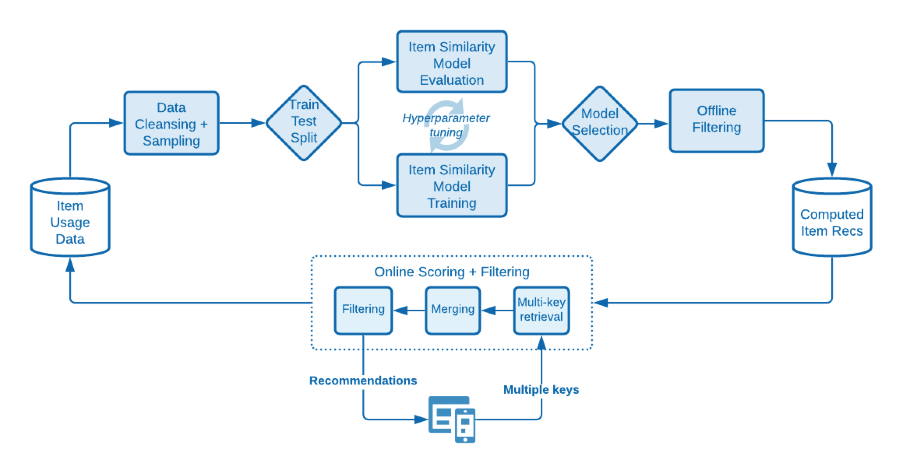

# La science derrière les algorithmes de recommandations de Target

Description détaillée des algorithmes utilisés dans [!DNL Adobe Target Recommendations], y compris les détails logiques et mathématiques de la formation des modèles et du processus de diffusion des modèles.

L’apprentissage des modèles est le processus par lequel les recommandations sont générées par les algorithmes d’apprentissage [!DNL Adobe Target]. [!DNL Target] La diffusion de modèles permet de fournir des recommandations aux visiteurs de votre site (également appelée diffusion de contenu).

[!DNL Target] comprend les grands types d’algorithmes suivants dans [!DNL Recommendations] :

* **Algorithmes basés sur un article** : incluez des algorithmes qui suivent la logique « Les personnes qui ont consulté/acheté cet article ont également consulté/acheté ces articles ». Ces algorithmes sont regroupés sous le terme générique de filtrage collaboratif article par article, ainsi que des algorithmes [!UICONTROL Items with Similar Attributes].

* **Algorithmes basés sur l’utilisateur** : incluez les algorithmes [!UICONTROL Recently Viewed] et [!UICONTROL Recommended for You].

* **Algorithmes basés sur la popularité** : incluez des algorithmes qui renvoient les articles les plus consultés ou les plus achetés sur le site web ou les plus consultés ou les plus achetés par catégorie ou attribut d’article.

* **Algorithmes basés sur le panier** : incluez des recommandations basées sur plusieurs éléments avec la logique « Les personnes qui ont consulté/acheté ces éléments, ont également consulté/acheté ces éléments ».

* **Critères personnalisés** : incluez des recommandations basées sur des fichiers personnalisés chargés dans [!DNL Target].

>[!NOTE]
>
>Pour des informations plus générales sur chaque type d’algorithme et les algorithmes individuels, voir [Baser la recommandation sur une clé de recommandation](/help/main/c-recommendations/c-algorithms/base-the-recommendation-on-a-recommendation-key.md).

La plupart des algorithmes répertoriés ci-dessus sont basés sur la présence d’une ou de plusieurs clés. Ces clés sont utilisées pour récupérer des éléments similaires au moment de la diffusion du contenu (lorsque des recommandations sont faites). Les clés spécifiées par le client peuvent inclure l’élément actuel que quelqu’un consulte, le dernier élément consulté ou acheté, l’élément le plus consulté, la catégorie actuelle ou la catégorie préférée de ce visiteur. D’autres algorithmes, tels que les recommandations basées sur le panier ou sur l’utilisateur, utilisent des clés implicites (qui ne peuvent pas être configurées par le client). Pour plus d’informations, consultez la section *Clés de recommandation* dans [Baser la recommandation sur une clé de recommandation](/help/main/c-recommendations/c-algorithms/base-the-recommendation-on-a-recommendation-key.md#keys). Notez toutefois que ces clés ne sont pertinentes qu’au moment de la diffusion du modèle (diffusion de contenu). Ces clés n’affectent pas la logique de temps d’entraînement « hors ligne » ou du modèle.

Les sections suivantes regroupent les algorithmes d’une manière légèrement différente des types d’algorithmes décrits ci-dessus. Le regroupement suivant est basé sur la similitude de la logique d’entraînement du modèle.

## Filtrage collaboratif article-article

Les algorithmes incluent :

* [!UICONTROL People Who Viewed This, Viewed That]
* [!UICONTROL People Who Viewed This, Bought That]
* [!UICONTROL People Who Bought This, Bought That]

Les algorithmes de recommandation de filtrage collaboratif élément par élément reposent sur l’idée que vous devez utiliser les modèles comportementaux de nombreux utilisateurs (et donc collaboratif) pour fournir des recommandations utiles pour un élément donné (par exemple, filtrer le catalogue d’éléments possibles à recommander). Bien qu&#39;il existe de nombreux algorithmes différents qui relèvent du [filtrage collaboratif](https://en.wikipedia.org/wiki/Collaborative_filtering), ces algorithmes utilisent universellement des sources de données comportementales comme entrées. En [!DNL Target Recommendations], ces entrées sont les affichages et les achats uniques d’articles par les utilisateurs.

Pour l’algorithme « Les personnes qui ont consulté/acheté cet article ont également consulté/acheté ces articles », l’objectif est de calculer une similarité s(A, B) entre toutes les paires d’articles. Pour un élément A donné, les principales recommandations sont ensuite classées selon leur similarité s(A,B).

Un exemple d’une telle similarité est la cooccurrence entre les éléments : un simple décompte du nombre d’utilisateurs qui ont acheté les deux éléments. Bien qu’intuitive, une telle mesure est naïve dans la mesure où elle est biaisée en faveur de la recommandation d’éléments populaires. Par exemple, si, dans une épicerie retailer, la plupart des gens achètent du pain, le pain aura une forte cooccurrence avec tous les articles, mais ce n&#39;est pas nécessairement une bonne recommandation. [!DNL Target] utilise plutôt une mesure de similarité plus sophistiquée appelée rapport de vraisemblance du log (LLR). Cette quantité est importante lorsque la probabilité que deux articles, A et B, coexistent est très différente de la probabilité qu&#39;ils ne coexistent pas. Pour des raisons de concrétisation, prenons l’exemple de l’algorithme [!UICONTROL People Who Viewed This, Bought That]. La similarité du LLR est importante lorsque la probabilité que B ait été acheté est *non* indépendamment du fait que quelqu’un ait consulté A.

Par exemple, si

L’élément B ne doit alors pas être recommandé avec l’élément A. Des détails complets sur ce calcul de similarité du ratio de vraisemblance journal sont fournis [dans ce PDF](/help/main/c-recommendations/c-algorithms/assets/log-likelihood-ratios-recommendation-algorithms.pdf).

Le flux logique de l’implémentation réelle de l’algorithme est illustré dans le diagramme schématique suivant :

Les détails de ces étapes sont les suivants :

* **Données d’entrée** : données comportementales, sous la forme d’affichages et d’achats de visiteurs collectés lorsque vous [implémentez Target](https://experienceleague.adobe.com/docs/target-dev/developer/recommendations.html){target=_blank} ou à partir de [Adobe Analytics](/help/main/c-recommendations/c-algorithms/use-adobe-analytics-with-recommendations.md){target=_blank}.

* **Modèle de formation** :

   * **Nettoyage et échantillonnage des données** : pour les algorithmes avec une recherche en amont de N jours, les données comportementales sont d’abord filtrées afin d’inclure uniquement ces N jours de données. Les règles de collection et les exclusions globales sont ensuite appliquées pour supprimer tous les éléments qui ne doivent pas être recommandés. Enfin, pour tous les visiteurs et visiteuses qui ont interagi avec plus de 1 000 éléments, les données d’utilisation sont échantillonnées à seulement 1 000 éléments.
   * **Calcul de similarité d’élément** : il s’agit de l’étape de calcul principale : calcul de la similarité du rapport de vraisemblance logarithmique entre toutes les paires d’éléments candidats et classement des paires d’éléments en fonction de ce score de similarité.
   * **Filtrage hors ligne** : enfin, tous les autres filtres dynamiques applicables sont appliqués (par exemple, les exclusions de catégories dynamiques). Après cette étape, les recommandations précalculées sont mises en cache globalement pour être disponibles pour diffusion.

* **Diffusion de modèles** : le contenu de Recommendations est diffusé à partir du réseau [!DNL Target]global « Edge »[ d’](/help/main/c-intro/how-target-works.md#concept_0AE2ED8E9DE64288A8B30FCBF1040934). Lorsque des requêtes de mbox sont envoyées à [!DNL Target] et qu’il est déterminé que le contenu des recommandations doit être diffusé sur la page, la requête de la clé [item appropriée](/help/main/c-recommendations/c-algorithms/base-the-recommendation-on-a-recommendation-key.md#keys) pour l’algorithme de recommandations est analysée à partir de la requête ou recherchée à partir du profil utilisateur, puis utilisée pour récupérer les recommandations calculées dans les étapes précédentes. D’autres filtres dynamiques sont appliqués à ce stade, avant que la [conception](/help/main/c-recommendations/c-design-overview/create-design.md) appropriée ne soit rendue.

## Similarité de contenu

Algorithme inclus :

* [!UICONTROL Items with Similar Attributes]

Dans ce type d’algorithme, deux éléments sont considérés comme liés si leurs noms et descriptions textuelles sont sémantiquement similaires. Contrairement à la plupart des algorithmes de recommandations dans lesquels les sources de données comportementales doivent être utilisées, les algorithmes de similarité de contenu utilisent les métadonnées des catalogues de produits pour obtenir la similarité entre les éléments. [!DNL Target] est donc en mesure d’émettre des recommandations dans des scénarios dits de « démarrage à froid », où aucune donnée comportementale n’a été collectée (par exemple, au début d’une activité [!DNL Target]).

Bien que les aspects de diffusion de modèles et de diffusion de contenu des algorithmes de similarité de contenu de [!DNL Target] soient identiques à d’autres algorithmes basés sur des éléments, les étapes d’entraînement de modèles sont radicalement différentes et impliquent une série d’étapes de traitement et de prétraitement en langage naturel, comme illustré dans le diagramme suivant. Le cœur du calcul de similarité est l&#39;utilisation de la similarité cosinus des vecteurs tf-idf modifiés qui représentent chaque élément du catalogue.

Les détails de ces étapes sont les suivants :

* **Données d’entrée** : comme décrit précédemment, cet algorithme est basé uniquement sur les données de catalogue (ingérées par les [!DNL Target] via un [flux de catalogue), l’API Entities ou à partir de mises à jour sur la page](https://experienceleague.adobe.com/docs/target-dev/developer/recommendations.html){target=_blank}.

* **Modèle de formation** :

   * **Extraction d’attributs** : après l’application de filtres statiques standard, de règles de catalogue et d’exclusions globales, cet algorithme extrait les champs de texte pertinents du schéma d’entité. [!DNL Target] utilise automatiquement les champs nom, message et catégorie des attributs d’entité et tente d’extraire n’importe quel champ de chaîne des [attributs d’entité](/help/main/c-recommendations/c-products/entity-attributes.md) personnalisés. Pour ce faire, assurez-vous que la majorité des valeurs de ce champ ne sont pas analysables sous la forme d’un nombre, d’une date ou d’une valeur booléenne.
   * **Suppression de mots vides et de mots vides** : pour une correspondance de similarité de texte plus précise, il est recommandé de supprimer les mots vides très courants qui ne modifient pas considérablement la signification d’un élément (par exemple, « était », « est », « et », etc.). De même, le terme de bourrage fait référence au processus de réduction de mots ayant des suffixes différents à leur mot racine, qui a une signification identique (par exemple, « connect », « connection » et « connection » ont tous le même mot racine : « connect »). [!DNL Target] utilise la tige de boule de neige. [!DNL Target] effectue d&#39;abord la détection automatique de la langue, et peut arrêter la suppression de mots pour jusqu&#39;à 50 langues et la gestion de contenu pour 18 langues.
   * **création n-gramme** : Suite aux étapes précédentes, chaque mot est traité comme un jeton. Le processus de combinaison de séquences contiguës de jetons en un seul jeton est appelé création de n-grammes. Les algorithmes de [!DNL Target] prennent en compte jusqu&#39;à 2 grammes.
   * **calcul tf-idf** : l’étape suivante implique la création de vecteurs tf-idf pour refléter l’importance relative des jetons dans la description de l’élément. Pour chaque jeton/terme t d&#39;un élément i, dans un catalogue D avec |D| on calcule d&#39;abord le terme fréquence TF(t, i) (nombre d&#39;occurrences du terme dans l&#39;élément i), ainsi que la fréquence document DF(t, D). En substance, le nombre d’éléments pour lesquels le jeton t existe. La mesure tf-idf est alors

     

     [!DNL Target] utilise l’implémentation de la fonctionnalité *tf-idf* d’Apache Spark, qui hache chaque jeton dans un espace de 218 jetons. Au cours de cette étape, l’amplification et l’enfouissement des attributs spécifiés par le client sont également appliqués en ajustant les fréquences du terme dans chaque vecteur en fonction des paramètres spécifiés dans les [critères](/help/main/c-recommendations/c-algorithms/create-new-algorithm.md#similarity).

   * **Calcul de similarité d&#39;élément** : Le calcul de similarité d&#39;élément final est effectué en utilisant une similarité cosinus approximative. Pour deux items, *A* et *B*, avec les vecteurs tA et tB, la similarité cosinus est définie comme :

     

     Pour éviter une complexité significative dans le calcul des similitudes entre tous les N x N éléments, le vecteur *tf-idf* est tronqué pour ne contenir que ses 500 entrées les plus grandes, puis calcule les similitudes cosinus entre les éléments à l&#39;aide de cette représentation vectorielle tronquée. Cette approche s’avère plus robuste pour les calculs de similarité de vecteurs épars, par rapport à d’autres techniques de voisinage proche approximatif (ANN), telles que le hachage sensible à la localité.

   * **Service de modèles** : ce processus est identique aux techniques de filtrage collaboratif article par article décrites dans la section précédente.

## Recommandations à plusieurs clés

Les algorithmes incluent :

* Recommandations basées sur le panier
* [!UICONTROL Recommended For You]

Les ajouts les plus récents à la suite [!DNL Target] d’algorithmes de recommandations sont [!UICONTROL Recommended For You] et une série d’algorithmes de recommandations basés sur le panier. Les deux types d’algorithmes utilisent des techniques de filtrage collaboratif pour former des recommandations individuelles basées sur des éléments. Ensuite, au moment du service, plusieurs éléments de l’historique de navigation de l’utilisateur (par [!UICONTROL Recommended For You]) ou du panier actuel de l’utilisateur (pour les recommandations basées sur le panier) sont utilisés pour récupérer ces recommandations basées sur les éléments, qui sont ensuite fusionnées pour former la liste finale de recommandations. Notez qu’il existe de nombreuses versions d’algorithmes de recommandation personnalisés. Le choix d’un algorithme à plusieurs clés signifie que des recommandations sont immédiatement disponibles après qu’un visiteur a accédé à un historique de navigation et que les recommandations peuvent être mises à jour pour répondre au comportement le plus récent du visiteur.

Ces algorithmes s’appuient sur les techniques de filtrage collaboratif fondamentales décrites dans la section recommandations basées sur les éléments , mais incorporent également l’optimisation des hyperparamètres pour déterminer la mesure de similarité optimale entre les éléments. L&#39;algorithme effectue une division chronologique des données comportementales pour chaque utilisateur, et entraîne des modèles de recommandation sur les données antérieures tout en essayant de prédire les articles qu&#39;un utilisateur consulte ou achète ultérieurement. La mesure de similarité qui produit la [précision moyenne moyenne] optimale (https://en.wikipedia.org/wiki/Evaluation_measures_(information_retrieval)) est ensuite choisie.

La logique des étapes d’entraînement et de notation du modèle est illustrée dans le diagramme suivant :

Les détails de ces étapes sont les suivants :

* **Données d’entrée** : est identique aux méthodes de filtrage collaboratif (CF) élément par élément. Les algorithmes [!UICONTROL Both Recommended For You] et basés sur le panier utilisent des données comportementales, sous la forme d’affichages et d’achats des utilisateurs collectés lors de l’[implémentation de Target](https://experienceleague.adobe.com/docs/target-dev/developer/recommendations.html){target=_blank} ou à partir de [Adobe Analytics](/help/main/c-recommendations/c-algorithms/use-adobe-analytics-with-recommendations.md){target=_blank}.

* **Modèle de formation** :

   * **Nettoyage et échantillonnage des données** : il s’agit toujours de la même procédure que pour les méthodes de filtrage collaboratif, où l’intervalle de recherche en amont est appliqué pour filtrer les données comportementales selon une période appropriée, suivie de l’application de règles de catalogue et d’exclusions globales. Les visiteurs et visiteuses qui ont interagi avec plus de 1 000 éléments n’ont pris en compte que leurs 1 000 utilisations les plus récentes.
   * **Répartition des tests d’entraînement** : effectuez une répartition chronologique des utilisations de chaque utilisateur, en attribuant les 80 % premiers de leurs utilisations aux données d’entraînement, les 20 % restants étant attribués aux données de test.
   * **Entraînement du modèle de similarité d’élément** : le calcul de similarité d’élément principal diffère pour les algorithmes [!UICONTROL Recommended For You] et basés sur le panier de la manière dont les vecteurs d’élément candidat sont construits. Par [!UICONTROL Recommended For You], les vecteurs d&#39;article ont des utilisateurs de dimension NUsers, où chaque entrée représente la somme des évaluations implicites pour cet utilisateur de l&#39;article - les achats d&#39;un article ont un poids de 2 fois celui des vues de l&#39;article. Pour les recommandations basées sur le panier, les vecteurs d’élément ont des entrées binaires ; si le comportement au sein de la session doit uniquement être pris en compte, il existe une nouvelle entrée pour chaque session. Sinon, il y a une entrée dans ce vecteur d’élément pour chaque visiteur.

  L&#39;étape d&#39;apprentissage calcule plusieurs types de similitudes vectorielles: la similarité LLR ([discutée ici](/help/main/c-recommendations/c-algorithms/assets/log-likelihood-ratios-recommendation-algorithms.pdf)), la similarité cosinus (définie précédemment), et une similarité L2 normalisée, définie comme:

  

   * **Évaluation du modèle de similarité d’élément** : l’évaluation du modèle est effectuée en prenant les recommandations générées à l’étape précédente et en effectuant des prédictions sur le jeu de données de test. La phase de notation en ligne est simulée en ordonnant chronologiquement les utilisations d’articles de chaque utilisateur dans le jeu de données de test, puis en effectuant 100 recommandations pour des sous-ensembles d’articles ordonnés dans le but de prédire les vues et achats ultérieurs. Une mesure de récupération des informations, la [précision moyenne moyenne]&#x200B;(https://en.wikipedia.org/wiki/Evaluation_measures_(information_retrieval)), est utilisée pour évaluer la qualité de ces recommandations. Cette mesure prend en compte l’ordre des recommandations et favorise les éléments pertinents plus haut dans la liste des recommandations, ce qui est une propriété importante pour les systèmes de classement.
   * **Sélection de modèle** : après l’évaluation hors ligne, le modèle présentant la précision moyenne la plus élevée est sélectionné et toutes les recommandations individuelles d’élément sont calculées pour lui.
   * **Filtrage hors ligne** : la dernière étape de l’apprentissage des modèles consiste à appliquer les filtres dynamiques applicables. Après cette étape, les recommandations précalculées sont mises en cache globalement pour être disponibles pour diffusion.

* **Diffusion de modèles** : contrairement aux algorithmes précédents dans lesquels les recommandations de diffusion impliquent de spécifier une seule clé à récupérer, suivie de l’application de règles métier, les algorithmes [!UICONTROL Recommended for You] et Basés sur le panier utilisent un processus d’exécution plus complexe.

   * **Récupération et fusion de plusieurs clés** : pour les recommandations basées sur le panier, un maximum de dix éléments transmis dans le panier sont considérés comme des clés pour la récupération et les recommandations de chaque élément sont pondérées de manière égale. Par [!UICONTROL Recommended for You], jusqu’aux cinq derniers éléments consultés uniques et aux cinq derniers éléments achetés uniques sont considérés comme des clés de récupération, les recommandations provenant d’éléments achetés étant pondérées deux fois plus que les recommandations provenant d’éléments consultés. Lors de la fusion de recommandations, si un élément apparaît dans plusieurs listes individuelles de recommandations, ses scores de similarité pondérés sont ajoutés. La liste finale des recommandations issues de cette étape est alors la liste fusionnée des recommandations répondérées, classées par ordre décroissant.
   * **Filtrage** : ensuite, les règles de filtrage telles que la suppression des éléments précédemment consultés et/ou achetés, ainsi que d’autres règles métier dynamiques sont appliquées.

Ces processus sont illustrés dans l’image suivante, où un visiteur a consulté l’élément A et a acheté l’élément B. Les recommandations individuelles sont récupérées avec les scores de similarité hors ligne affichés sous chaque libellé d’élément. Après la récupération, les recommandations sont fusionnées avec des scores de similarité pondérés additionnés. Enfin, dans un scénario où le client a spécifié que les articles précédemment consultés et achetés doivent être filtrés, l’étape de filtrage supprime les articles A et B de la liste des recommandations.

## Basé Sur La Popularité

Les algorithmes incluent :

* [!UICONTROL Most Viewed Across the Site]
* [!UICONTROL Most Viewed by Category]
* [!UICONTROL Most Viewed by Item Attribute]
* [!UICONTROL Top Sellers Across the Site]
* [!UICONTROL Top Sellers by Category]
* [!UICONTROL Top Sellers by Item Attribute]

[!DNL Target] fournit des algorithmes basés sur la popularité pour les articles les plus consultés, ainsi que pour les articles les plus vendus sur un site web ou répartis par attribut ou catégorie d’article. Les algorithmes basés sur la popularité classent les éléments en fonction du nombre de sessions au cours desquelles cet élément a été consulté ou acheté au cours d’une période donnée.

Tous ces algorithmes combinent des données comportementales agrégées où le nombre total de sessions au cours desquelles des éléments ont été consultés et achetés est enregistré à la fois à des résolutions horaires et quotidiennes. Des algorithmes individuels recherchent ensuite les articles les plus consultés ou les plus achetés pour l’intervalle de recherche en amont configuré par le client.

Les nuances d’algorithme individuelles sont les suivantes :

* [!UICONTROL Most Viewed Across the Site] et [!UICONTROL Top Sellers Across the Site] classent les éléments en fonction du nombre total de sessions au cours desquelles ces éléments ont été affichés ou achetés, respectivement. La sortie est une liste unique (sans clé) d’éléments recommandés.
* La plupart des articles consultés/les plus vendus par catégorie/attribut d&#39;article sont des recommandations dans lesquelles les articles sont triés en fonction du nombre total de sessions au cours desquelles ces articles ont été consultés ou achetés, mais regroupés par catégorie d&#39;article ou attribut d&#39;article spécifique. Les sorties sont des listes d’éléments recommandés, indexés par des valeurs de catégories ou des valeurs d’attributs d’élément.

## Récemment consultés

L’algorithme de recommandations « récemment consultées » permet de personnaliser les recommandations en cours de session. Cet algorithme ne nécessite aucune « formation de modèle » hors ligne. Au lieu de cela, [!DNL Target] utilise le [profil du visiteur](/help/main/c-target/c-visitor-profile/visitor-profile.md) unique pour gérer une liste en cours d’exécution des éléments qui ont été consultés au cours d’une session donnée et peut faire apparaître ces éléments dans des activités Recommendations. Cela permet d’effectuer des mises à jour en temps réel des recommandations et de personnaliser la page suivante.

## Critères personnalisés

Les critères personnalisés permettent aux clients de [télécharger leurs propres recommandations vers [!DNL Target]](/help/main/c-recommendations/c-algorithms/recommendations-csv.md), ce qui offre une flexibilité importante et permet d’« apporter votre propre modèle ». Les critères personnalisés remplacent la partie « formation hors ligne » de [!UICONTROL Item-Based] recommandations, mais se comportent de la même manière que les algorithmes de recommandation basés sur les éléments lors de la phase de diffusion de contenu en ligne, dans la mesure où une seule clé est utilisée pour récupérer les recommandations et où les règles/filtres métier sont ensuite appliqués.
