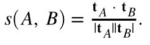

#  La science derrière les algorithmes de recommandations de Target

Description détaillée des algorithmes utilisés dans [!DNL Adobe Target Recommendations], y compris les détails logiques et mathématiques de la formation de modèle et du processus de diffusion des modèles.

La formation de modèle est le processus de génération de recommandations par la fonction [!DNL Adobe Target] algorithmes d’apprentissage. La diffusion de modèles est la méthode [!DNL Target] diffuse des recommandations aux visiteurs de votre site (également appelé diffusion de contenu).

[!DNL Target] inclut les types d’algorithmes suivants dans [!DNL Recommendations]:

* **Algorithmes basés sur des éléments**: Inclure les algorithmes qui suivent la logique &quot;Les personnes qui ont consulté/acheté cet article ont également consulté/acheté ces articles&quot;. Ces algorithmes sont regroupés sous le terme parapluie de filtrage collaboratif article-article, ainsi que [!UICONTROL Éléments avec des attributs similaires] algorithmes.

* **Algorithmes basés sur les utilisateurs**: Inclure la variable [!UICONTROL Récemment consultés] et [!UICONTROL Recommandé pour vous] algorithmes.

* **Algorithmes basés sur la popularité**: Incluez des algorithmes qui renvoient les articles les plus consultés ou les plus achetés sur le site web, ou les articles les plus consultés ou les plus achetés par catégorie ou attribut d’article.

* **Algorithmes basés sur le panier**: Incluez des recommandations à plusieurs éléments avec la logique &quot;les personnes qui ont consulté/acheté ces éléments, ont également consulté/acheté ces éléments&quot;.

* **Critères personnalisés**: Inclure des recommandations basées sur des fichiers personnalisés chargés dans [!DNL Target].

>[!NOTE]
>
>Pour plus d’informations sur chaque type d’algorithme et les algorithmes individuels, voir [Baser la recommandation sur une clé de recommandation](/help/main/c-recommendations/c-algorithms/base-the-recommendation-on-a-recommendation-key.md).

La plupart des algorithmes répertoriés ci-dessus reposent sur la présence d’une ou de plusieurs clés. Ces clés sont utilisées pour récupérer des éléments similaires au moment de la diffusion du contenu (lorsque des recommandations sont faites). Les clés spécifiées par le client peuvent inclure l’article actuel qu’un visiteur consulte, le dernier article consulté ou acheté, l’article le plus consulté, la catégorie actuelle ou la catégorie préférée pour ce visiteur. D’autres algorithmes, tels que les recommandations reposant sur le panier ou l’utilisateur, utilisent des clés implicites (qui ne peuvent pas être configurées par le client). Pour plus d’informations, voir *Clés de recommandation*, dans [Baser la recommandation sur une clé de recommandation](/help/main/c-recommendations/c-algorithms/base-the-recommendation-on-a-recommendation-key.md#keys). Notez toutefois que ces clés ne sont pertinentes qu’au moment de la diffusion du modèle (diffusion de contenu). Ces clés n’affectent pas la logique du temps de formation &quot;hors ligne&quot; ou du modèle.

Les sections suivantes regroupent les algorithmes d’une manière légèrement différente des types décrits ci-dessus. Le regroupement suivant est basé sur la similarité de la logique de formation du modèle.

## Filtrage collaboratif des éléments

Les algorithmes incluent :

* [!UICONTROL Les personnes ayant consulté ceci ont consulté cela]
* [!UICONTROL Les personnes ayant consulté ceci ont acheté cela]
* [!UICONTROL Les personnes ayant acheté ceci ont acheté cela]

Les algorithmes de recommandation collaborative de filtrage des éléments reposent sur l’idée que vous devriez utiliser les modèles comportementaux de nombreux utilisateurs (d’où la collaboration) pour fournir des recommandations utiles pour un élément donné (par exemple, filtrer le catalogue des éléments possibles à recommander). Bien qu’il existe de nombreux algorithmes différents qui tombent sous le parapluie général de [filtrage collaboratif](https://en.wikipedia.org/wiki/Collaborative_filtering), ces algorithmes utilisent universellement des sources de données comportementales comme entrées. Dans [!DNL Target Recommendations], ces entrées sont les vues et achats uniques d’éléments par les utilisateurs.

Pour l’algorithme &quot;Les personnes qui ont consulté/acheté cet article ont également consulté/acheté ces articles&quot;, l’objectif est de calculer une similarité s(A,B) entre toutes les paires d’articles. Pour un élément A donné, les principales recommandations sont ensuite classées selon leur similarité s(A,B).

Un exemple de cette similarité est la co-occurrence entre les éléments : comptage simple du nombre d’utilisateurs qui ont acheté les deux articles. Bien qu’intuitive, une telle mesure est naïve dans la mesure où elle est orientée vers la recommandation d’articles populaires. Par exemple, si, dans une épicerie, la plupart des consommateurs achètent du pain, celui-ci aura une forte co-occurrence avec tous les articles, mais ce n’est pas nécessairement une bonne recommandation. [!DNL Target] utilise plutôt une mesure de similarité plus sophistiquée appelée taux de probabilité du journal (LLR). Cette quantité est importante lorsque la probabilité que deux éléments, A et B, se produisent simultanément est très différente de la probabilité qu’ils ne se produisent pas conjointement. Pour être concret, envisagez un cas de la [!UICONTROL Les personnes ayant consulté ceci ont acheté cela] algorithme. La similarité du LR est importante lorsque la probabilité que B ait été acheté est *not* indépendamment du fait que quelqu’un ait consulté A.

Par exemple, si

L’élément B ne doit pas être recommandé avec l’élément A. Des détails complets sur ce calcul de similarité du taux de probabilité du journal sont fournis. [dans ce PDF](/help/main/c-recommendations/c-algorithms/assets/log-likelihood-ratios-recommendation-algorithms.pdf).

Le flux logique de l’implémentation réelle de l’algorithme est illustré dans le diagramme schéma suivant :

Les détails de ces étapes sont les suivants :

* **Données d’entrée**: Données comportementales, sous la forme d’affichages et d’achats de visiteurs collectés lorsque vous [implémentation de Target](https://developer.adobe.com/target/implement/recommendations/){target=_blank} ou de [Adobe Analytics](/help/main/c-recommendations/c-algorithms/use-adobe-analytics-with-recommendations.md){target=_blank}.

* **Formation de modèles**:

   * **Nettoyage et échantillonnage des données**: Pour les algorithmes avec une recherche en amont N-jour, les données comportementales sont d’abord filtrées afin d’inclure uniquement ces N jours de données. Les règles de collecte et les exclusions globales sont ensuite appliquées pour supprimer les éléments qui ne doivent pas être recommandés. Enfin, les données d’utilisation des visiteurs ayant interagi avec plus de 1 000 éléments ne sont échantillonnées que pour 1 000 éléments.
   * **Calcul de la similarité d’élément**: Il s’agit de l’étape principale de calcul : en calculant la similarité du ratio de probabilité du journal entre toutes les paires d’éléments candidats et en classant les paires d’éléments par ce score de similarité.
   * **Filtrage hors ligne**: Enfin, tout filtre dynamique applicable supplémentaire est appliqué (exclusions de catégorie dynamique, par exemple). Après cette étape, les recommandations précalculées sont mises en cache globalement pour être disponibles pour le service.

* **Diffusion de modèles**: Le contenu Recommendations est diffusé à partir de [!DNL Target]&#39;s [réseau mondial &quot;Edge&quot;](/help/main/c-intro/how-target-works.md#concept_0AE2ED8E9DE64288A8B30FCBF1040934). Lorsque des requêtes de mbox sont envoyées à [!DNL Target] et il est déterminé que le contenu des recommandations doit être diffusé sur la page, la demande pour la [item key](/help/main/c-recommendations/c-algorithms/base-the-recommendation-on-a-recommendation-key.md#keys) pour l’algorithme recommendations est analysé à partir de la requête ou consulté à partir du profil utilisateur, puis utilisé pour récupérer les recommandations calculées lors des étapes précédentes. D’autres filtres dynamiques sont actuellement appliqués, avant que les [design](/help/main/c-recommendations/c-design-overview/create-design.md) est rendue.

## similarité de contenu

Algorithme inclus :

* [!UICONTROL Éléments avec des attributs similaires]

Dans ce type d’algorithme, deux éléments sont considérés comme liés si leurs noms et descriptions textuelles sont sémantiquement similaires. Contrairement à la plupart des algorithmes de recommandations dans lesquels des sources de données comportementales doivent être utilisées, les algorithmes de similarité de contenu utilisent des métadonnées provenant de catalogues de produits pour dériver la similarité entre les éléments. [!DNL Target] est donc en mesure de générer des recommandations dans les scénarios dits de &quot;démarrage à froid&quot;, où aucune donnée comportementale n’a été collectée (par exemple, au début d’une [!DNL Target] activité).

Bien que les aspects de diffusion de contenu et de diffusion de contenu du modèle [!DNL Target]Les algorithmes de similarité de contenu de sont identiques aux autres algorithmes basés sur un élément, les étapes de formation du modèle sont radicalement différentes et impliquent une série d’étapes de traitement et de prétraitement du langage naturel, comme illustré dans le diagramme ci-dessous. Le coeur du calcul de la similarité est l’utilisation de la similarité cosinale des vecteurs tf-idf modifiés qui représentent chaque élément du catalogue.

Les détails de ces étapes sont les suivants :

* **Données d’entrée**: Comme décrit précédemment, cet algorithme est basé uniquement sur des données de catalogue (ingérées par [!DNL Target] via un [Flux de catalogue, API des entités ou à partir des mises à jour sur la page](https://developer.adobe.com/target/implement/recommendations/){target=_blank}.

* **Formation de modèles**:

   * **Extraction d’attributs**: Après l’application de filtres statiques réguliers, de règles de catalogue et d’exclusions globales, cet algorithme extrait les champs textuels pertinents du schéma d’entité. [!DNL Target] utilise automatiquement les champs de nom, de message et de catégorie des attributs d’entité et tente d’extraire les champs de chaîne d’un champ personnalisé. [attributs d’entité](/help/main/c-recommendations/c-products/entity-attributes.md). Ce processus s’effectue en s’assurant que la majorité des valeurs de ce champ ne peut pas être analysée en tant que nombre, date ou valeur booléenne.
   * **Suppression de mots-clés et de blocage**: Pour une correspondance plus précise des similarités de texte, il est prudent de supprimer les mots &quot;stop&quot; très courants qui ne modifient pas significativement la signification d’un élément (par exemple, &quot;was&quot;, &quot;is&quot;, &quot;and&quot;, etc.). De même, le terme &quot;chaîne&quot; fait référence au processus de réduction des mots avec des suffixes différents sur leur mot racine, qui a une signification identique (par exemple, &quot;connexion&quot;, &quot;connexion&quot; et &quot;connexion&quot;), et qui ont tous le même mot racine : &quot;connect&quot;). [!DNL Target] utilise le moteur de recherche Snowball. [!DNL Target] effectue d’abord une détection automatique des langues et peut arrêter la suppression de mots pour 50 langues au maximum et la recherche de termes pour 18 langues.
   * **Création n-gramme**: Après les étapes précédentes, chaque mot est traité comme un jeton. Le processus de combinaison de séquences contiguës de jetons en un seul jeton est appelé création n-gram. [!DNL Target]Les algorithmes de peuvent prendre en compte jusqu’à 2 grammes.
   * **calcul tf-idf**: L’étape suivante implique la création de vecteurs tf-idf pour refléter l’importance relative des jetons dans la description de l’élément. Pour chaque jeton/terme t d’un élément i, dans un catalogue D avec |D| éléments, la fréquence du terme TF(t, i) est calculée en premier (le nombre de fois où le terme apparaît dans l’élément i), ainsi que la fréquence du document DF(t, D). En substance, le nombre d’éléments où le jeton t existe. La mesure tf-idf est alors

      

      [!DNL Target] utilise Apache Spark *tf-idf* implémentation des fonctionnalités, qui, sous le capot, hache chaque jeton sur un espace de 218 jetons. Au cours de cette étape, l’amplification et l’enterrement des attributs spécifiés par le client sont également appliqués en ajustant les fréquences de terme dans chaque vecteur en fonction des paramètres spécifiés dans la variable [critères](/help/main/c-recommendations/c-algorithms/create-new-algorithm.md#similarity).

   * **Calcul de la similarité d’élément**: Le calcul final de la similarité d’élément est effectué à l’aide d’une similarité cosinale approximative. Pour deux éléments : *A* et *B*, avec les vecteurs tA et tB, la similarité cosinale est définie comme suit :

      

      Pour éviter une complexité significative des similarités de calcul entre tous les éléments N x N, la variable *tf-idf* vectoriel est tronqué pour ne contenir que ses 500 plus grandes entrées, puis calculer les similarités cosinales entre les éléments à l’aide de cette représentation vectorielle tronquée. Cette approche s’avère plus robuste pour les calculs de similarité vectorielle épars, par rapport à d’autres techniques approximatives du voisin le plus proche (ANN), telles que le hachage sensible à la localisation.

   * **Diffusion de modèles**: Ce processus est identique aux techniques de filtrage collaboratif des éléments décrites dans la section précédente.

## Recommandations multi-clés

Les algorithmes incluent :

* Recommandations basées sur le panier
* [!UICONTROL Recommandé pour vous]

Les ajouts les plus récents à la variable [!DNL Target] suite d’algorithmes de recommandations sont [!UICONTROL Recommandé pour vous] et une série d’algorithmes de recommandations basés sur le panier. Les deux types d’algorithmes utilisent des techniques de filtrage collaboratif pour former des recommandations individuelles basées sur des éléments. Ensuite, au moment du serveur, plusieurs éléments dans l’historique de navigation de l’utilisateur (pour [!UICONTROL Recommandé pour vous]) ou le panier actuel de l’utilisateur (pour les recommandations basées sur le panier) sont utilisés pour récupérer ces recommandations basées sur des éléments, qui sont ensuite fusionnées pour former la liste finale des recommandations. Notez qu’il existe de nombreuses versions des algorithmes de recommandation personnalisés. Le choix d’un algorithme multi-clé signifie que les recommandations sont immédiatement disponibles lorsqu’un visiteur a un historique de navigation et que les recommandations peuvent être mises à jour pour répondre au comportement du visiteur le plus récent.

Ces algorithmes reposent sur les techniques de filtrage collaboratif de base décrites dans la section Recommandations basées sur les éléments , mais intègrent également le réglage d’hyperparamètres pour déterminer la mesure de similarité optimale entre les éléments. L’algorithme effectue une division chronologique des données comportementales pour chaque utilisateur et forme les modèles de recommandation sur les données antérieures tout en tentant de prévoir les éléments qu’un utilisateur consulte ou achète ultérieurement. La mesure de similarité qui produit l’optimisation [Précision moyenne](https://en.wikipedia.org/wiki/Evaluation_measures_(information_retrieval)#Mean_average_precision) est ensuite sélectionné.

La logique des étapes de formation et de notation des modèles est présentée dans le diagramme suivant :

Les détails de ces étapes sont les suivants :

* **Données d’entrée**: Ceci est identique aux méthodes de filtrage collaboratif (CF) des éléments. [!UICONTROL Nous vous recommandons les deux] Les algorithmes basés sur le panier utilisent des données comportementales sous la forme d’affichages et d’achats d’utilisateurs collectés lorsque vous [implémentation de Target](https://developer.adobe.com/target/implement/recommendations/){target=_blank} ou de [Adobe Analytics](/help/main/c-recommendations/c-algorithms/use-adobe-analytics-with-recommendations.md){target=_blank}.

* **Formation de modèles**:

   * **Nettoyage et échantillonnage des données**: C’est à nouveau la même chose que pour les méthodes de filtrage collaboratif, où l’intervalle de recherche en amont est appliqué pour filtrer les données comportementales sur une période appropriée, suivie par l’application de règles de catalogue et d’exclusions globales. Les visiteurs qui ont interagi avec plus de 1 000 éléments n’ont pris en compte que les 1 000 utilisations les plus récentes.
   * **Division du test du train**: Réalisez une répartition chronologique des utilisations pour chaque utilisateur, en allouant les 80 % premiers de leurs utilisations aux données d’apprentissage, les 20 % restants étant alloués aux données de test.
   * **Formation au modèle de similarité d’élément**: Le calcul de la similarité des éléments principaux diffère pour [!UICONTROL Recommandé pour vous] et les algorithmes basés sur le panier de la manière dont les vecteurs d’élément candidat sont construits. Pour [!UICONTROL Recommandé pour vous], les vecteurs d’élément ont une dimension NUsers, où chaque entrée représente la somme des évaluations implicites pour cet utilisateur de l’élément ; les achats d’un élément reçoivent un poids 2x celui des vues de l’élément. Pour les recommandations basées sur le panier, les vecteurs d’élément ont des entrées binaires ; si le comportement au sein d’une session doit uniquement être pris en compte, il existe une nouvelle entrée pour chaque session. Sinon, il y a une entrée dans ce vecteur d’élément pour chaque visiteur.

   L’étape d’entraînement calcule plusieurs types de similarités vectorielles : similarité LLR ([présenté ici](/help/main/c-recommendations/c-algorithms/assets/log-likelihood-ratios-recommendation-algorithms.pdf)), une similarité cosinale (définie précédemment) et une similarité L2 normalisée, définie comme suit :

   

   * **Évaluation du modèle de similarité d’élément**: L’évaluation du modèle s’effectue en suivant les recommandations générées à l’étape précédente et en établissant des prédictions sur le jeu de données de test. La phase de notation en ligne est imitée en classant chronologiquement les utilisations de chaque élément de l’utilisateur dans le jeu de données de test, puis en effectuant 100 recommandations pour les sous-ensembles triés d’éléments afin de tenter de prédire les vues et achats suivants. Une mesure de récupération d’informations, la variable [Précision moyenne](https://en.wikipedia.org/wiki/Evaluation_measures_(information_retrieval)#Mean_average_precision), est utilisé pour évaluer la qualité de ces recommandations. Cette mesure prend en compte l’ordre des recommandations et favorise les éléments pertinents plus haut dans la liste des recommandations, ce qui est une propriété importante pour les systèmes de classement.
   * **Sélection de modèle**: Après l’évaluation hors ligne, le modèle dont la précision moyenne est la plus élevée est sélectionné et toutes les recommandations d’éléments individuels sont calculées pour celui-ci.
   * **Filtrage hors ligne**: La dernière étape de la formation du modèle consiste à appliquer les filtres dynamiques applicables. Après cette étape, les recommandations précalculées sont mises en cache globalement pour être disponibles pour le service.

* **Diffusion de modèles**: Contrairement aux algorithmes précédents dans lesquels la diffusion de recommandations impliquait la spécification d’une clé unique pour la récupération, suivie de l’application de règles commerciales, la variable [!UICONTROL Recommandé pour vous] Les algorithmes basés sur le panier utilisent un processus d’exécution plus complexe.

   * **Récupération et fusion multi-clés**: Pour les recommandations basées sur le panier, jusqu’à dix éléments transmis dans le panier sont considérés comme des clés à récupérer et les recommandations de chacun d’eux sont pondérées de manière égale. Pour [!UICONTROL Recommandé pour vous], jusqu’aux cinq derniers éléments consultés uniques et les cinq derniers éléments achetés uniques sont considérés comme des clés à récupérer, les recommandations provenant des éléments achetés étant pondérées deux fois plus que les recommandations provenant des éléments consultés. Lors de la fusion de recommandations, si un élément apparaît dans plusieurs listes individuelles de recommandations, ses scores de similarité pondérés sont ajoutés. La liste finale des recommandations de cette étape est alors la liste fusionnée des recommandations repondérées, classées dans l’ordre décroissant.
   * **Filtrage**: Ensuite, des règles de filtrage telles que la suppression des articles précédemment consultés et/ou achetés, ainsi que d’autres règles métier dynamiques sont appliquées.

Ces processus sont illustrés dans l’image suivante, où un visiteur a consulté l’article A et l’article B. Les recommandations individuelles sont récupérées avec les scores de similarité hors ligne affichés sous chaque étiquette d’article. Après la récupération, les recommandations sont fusionnées avec les scores de similarité pondérés additionnés. Enfin, dans un scénario où le client a spécifié que les articles consultés et achetés précédemment doivent être filtrés, l’étape de filtrage supprime les articles A et B de la liste de recommandations.

## Basé sur la popularité

Les algorithmes incluent :

* [!UICONTROL Les plus consultés sur le site]
* [!UICONTROL Les plus consultés par catégorie]
* [!UICONTROL Attribut d’élément le plus consulté]
* [!UICONTROL Meilleurs vendeurs sur le site]
* [!UICONTROL Meilleurs vendeurs par catégorie]
* [!UICONTROL Meilleurs vendeurs par attribut d’article]

[!DNL Target] fournit des algorithmes reposant sur la popularité pour les articles les plus consultés, ainsi que pour les articles les plus vendus sur un site web, ou ventilés selon un attribut d’article ou une catégorie. Les algorithmes basés sur la popularité classent les éléments en fonction du nombre de sessions au cours desquelles cet élément a été affiché ou acheté au cours d’une période donnée.

Tous ces algorithmes combinent des données comportementales agrégées où le nombre total de sessions au cours desquelles les articles ont été consultés et achetés est enregistré aux résolutions horaire et quotidienne. Les algorithmes individuels recherchent ensuite les articles les plus consultés ou les plus achetés pour l’intervalle de recherche en amont configuré par le client.

Les nuances des algorithmes individuels sont les suivantes :

* [!UICONTROL Les plus consultés sur le site] et [!UICONTROL Meilleurs vendeurs sur le site] classer les éléments par nombre agrégé de sessions au cours desquelles ils ont été consultés ou achetés, respectivement. La sortie est une liste unique (sans clé) des éléments recommandés.
* La plupart des articles les plus consultés/les plus vendus par attribut de catégorie/d’élément sont des recommandations où les articles sont triés par le nombre agrégé de sessions au cours desquelles ces articles ont été consultés ou achetés, mais regroupés par catégorie d’article ou attribut d’article spécifique. Les sorties sont des listes d’éléments recommandés, indexées par valeurs de catégories ou par valeurs d’attributs d’élément.

## Récemment consultés

L’algorithme de recommandations &quot;récemment consultées&quot; permet la personnalisation des recommandations en session. Cet algorithme ne nécessite aucune &quot;formation de modèle&quot; hors ligne. Au lieu de cela, [!DNL Target] utilise l’unique [Profil du visiteur](/help/main/c-target/c-visitor-profile/visitor-profile.md) pour conserver une liste en cours d’exécution des éléments qui ont été affichés au cours d’une session donnée et qui peuvent apparaître dans les activités de recommandations. Cela permet des mises à jour en temps réel des recommandations et de la personnalisation de la page suivante.

## Critères personnalisés

Les critères personnalisés permettent aux clients de [charger leurs propres recommandations dans [!DNL Target]](/help/main/c-recommendations/c-algorithms/recommendations-csv.md), offrant une flexibilité importante et permettant d’&quot;apporter votre propre modèle&quot;. Les critères personnalisés remplacent la partie &quot;Formation hors ligne&quot; de [!UICONTROL Basé sur des éléments] recommandations, mais se comportent de la même manière que les algorithmes de recommandation basés sur un élément lors de la phase de diffusion du contenu en ligne, en ce sens qu’une seule clé est utilisée pour la récupération des recommandations et que les règles/filtres métier sont ensuite appliqués.
