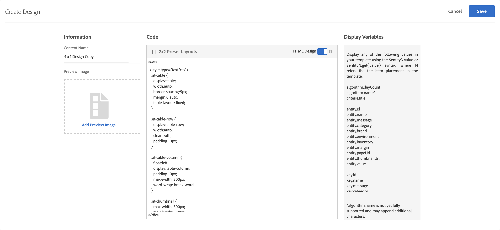

#  Créer une conception

Une conception définit la manière dont les recommandations s’affichent sur une page.

Vous pouvez créer une conception de [!UICONTROL Recommandations] à l’aide d’une conception par défaut ou en créant une conception personnalisée. Le **[!UICONTROL Recommendations > Conceptions]** L’écran affiche à la fois les cartes de conception par défaut et les conceptions qui ont été créées dans votre compte.

Gardez les informations suivantes à l’esprit lorsque vous utilisez des conceptions :

* Vous pouvez créer une conception de recommandations à l’aide d’une conception par défaut ou vous pouvez créer une conception personnalisée.
* Vous ne pouvez pas modifier ni supprimer une conception par défaut.
* Vous pouvez modifier, copier ou supprimer une conception personnalisée.
* Pour créer une conception basée sur une conception par défaut, vous devez d’abord la copier, puis la modifier.

Cette illustration présente la conception 1 x 4 par défaut :


Cette illustration présente une conception personnalisée :


Vous pouvez créer une conception au cours du processus de création d’activité à partir du compositeur d’expérience visuelle (VEC) ou de la bibliothèque de conception en dehors de la création d’activité. Les sections suivantes supposent que vous créez des conceptions à partir de la bibliothèque, mais les étapes sont similaires.

## Création de conceptions

Vous pouvez créer une conception basée sur une conception par défaut ou vous pouvez créer une conception personnalisée.

### Création d’une conception basée sur une conception par défaut

1. Cliquez sur **[!UICONTROL Recommendations]** > **[!UICONTROL Conceptions]** pour afficher la variable [!UICONTROL Conceptions] bibliothèque .

   

1. Placez le pointeur de la souris sur la carte de la conception que vous souhaitez créer, puis cliquez sur l’icône **[!UICONTROL Copier]** icône .

   

   Le [!UICONTROL Créer une conception] s’affiche.

   

1. Dans le **[!UICONTROL Informations]** ajouter un panneau, **[!UICONTROL Nom du contenu]** et de l’image d’aperçu facultative à afficher sur la carte de conception.

   Lorsque vous utilisez une conception par défaut, le nom de la conception et &quot;Copier&quot; apparaissent dans la variable **[!UICONTROL Nom du contenu]** champ . Ce nom est modifiable. Vous pouvez également sélectionner une image à afficher sur la carte de conception.

1. (Conditionnel) Modifiez la conception. **[!UICONTROL Code]**, selon vos besoins.

   Les conceptions de recommandations utilisent le langage de conception libre Velocity. Vous trouverez des informations sur Velocity à l’adresse [https://velocity.apache.org](https://velocity.apache.org) et dans [Personnalisation d’une conception à l’aide de Velocity](/help/main/c-recommendations/c-design-overview/customizing-a-template.md).

   Une conception peut être au format HTML ou non HTML. Par défaut, les conceptions HTML sont entourées de `<div>` balises pour permettre le suivi des clics dans un environnement Web. Les conceptions non HTML sont réservées aux environnements non web dans lesquels le suivi des clics n’est pas possible. Glisser le [!UICONTROL Conception de HTML] basculez sur la position &quot;désactivé&quot; pour utiliser du code non HTML.

   >[!NOTE]
   >
   >Le nombre maximum d’entités qu’il est possible de référencer dans une conception, que ce soit par le biais de boucles ou d’un codage en dur, est de 99.

1. Cliquez sur **[!UICONTROL Enregistrer]**.

### Créer une conception personnalisée

1. Cliquez sur **[!UICONTROL Recommendations]** > **[!UICONTROL Conceptions]** pour afficher la variable [!UICONTROL Conceptions] bibliothèque .

1. Cliquez sur **[!UICONTROL Créer une conception]**.

   Si vous souhaitez baser votre nouvelle conception personnalisée sur une conception existante, placez le pointeur de la souris sur la conception souhaitée, puis cliquez sur l’icône [!UICONTROL Copier] icône . Vous pouvez ensuite modifier la copie pour créer une conception personnalisée.

1. Ajouter un **[!UICONTROL Nom du contenu]** et l’image d’aperçu facultative.

1. (Conditionnel) Modifiez la conception. **[!UICONTROL Code]**, selon vos besoins.

   Pour plus d’informations, reportez-vous aux informations de l’étape 4 ci-dessus.

1. Cliquez sur **[!UICONTROL Enregistrer]**.

## Modification, copie ou suppression d’une conception

N’oubliez pas que vous ne pouvez pas modifier ni copier une conception par défaut. vous ne pouvez copier que les conceptions par défaut.

Passez la souris sur la conception souhaitée dans la [!UICONTROL Conception] , puis cliquez sur l’icône appropriée : modifier, copier ou supprimer.


Vous pouvez copier une conception existante pour créer une conception en double que vous pourrez ensuite modifier. Vous pouvez ainsi créer une conception similaire avec moins d’effort.

Gardez à l’esprit que les conceptions sont disponibles pour l’ensemble du compte. Veillez à tenir compte de cela avant de supprimer une conception. Les conceptions supprimées ne peuvent pas être récupérées.

## Exemple d’objet JSON {#section_75BFB2537CFF4FBD9B560F59EB32C8DD}

L’exemple suivant montre comment les réponses JSON peuvent être renvoyées lors de la configuration d’une activité via l’éditeur basé sur les formulaires.

1. Créez une conception dans la bibliothèque de conception ou dans le processus basé sur les formulaires. Si vous tentez de le faire dans le flux de travaux du compositeur d’expérience visuelle (VEC), vous ne pouvez pas créer autre chose qu’une conception HTML, qui est encapsulée dans une balise `<div>` à des fins de suivi des clics.

1. Assurez-vous que l’option « Conception HTML » est désactivée :

   

1. Le code suivant est un exemple de ce que vous pouvez coller dans votre conception :

   ```javascript
       #* 
       * "Return a simple list of recommended entity ids"   
       *#
   
       {   
         "notes":{   
         "purpose": "Return a simple list of recommended entity ids",   
         "use-case": "Use this approach if you prefer to do a real-time lookup of entity attribute details (such as inventory, price, rating) from another system (such as a CMS, PIM or ecommerce platform)",   
         "version": "01"   
         },   
         "recommendedItems": {   
           "key": "$key.id",   
           "slot-01": "$entity1.id",   
           "slot-02": "$entity2.id",   
           "slot-03": "$entity3.id",   
           "slot-04": "$entity4.id",   
           "slot-05": "$entity5.id",   
           "slot-06": "$entity6.id",   
           "slot-07": "$entity7.id",   
           "slot-08": "$entity8.id",   
           "slot-09": "$entity9.id",   
           "slot-10": "$entity10.id"   
         }   
       }  
   ```

1. Configuration d’un formulaire [!DNL Recommendations] activité qui utilise cette conception.

   1. Accédez au **[!UICONTROL Activités]** page.
   1. Cliquez sur **[!UICONTROL Créer l’activité]** > **[!UICONTROL Recommandations]**.
   1. Sous **[!UICONTROL Choix du compositeur d’expérience]**, sélectionnez **[!UICONTROL Formulaire]**, puis cliquez sur **[!UICONTROL Suivant]**.
   1. Sous Emplacement, saisissez le texte : « Sample_Recs_Response ».
   1. Sous **[!UICONTROL Contenu par défaut]**, cliquez sur la flèche vers le bas, puis sur **[!UICONTROL Ajouter une recommandation]**.
   1. Choisissez un type de page. Celui-ci détermine le filtrage initial de l’écran suivant.
   1. Sélectionnez une carte de critères, puis cliquez sur **[!UICONTROL Suivant]**.
   1. Sélectionnez la conception que vous avez créée à l’étape précédente, puis cliquez sur **[!UICONTROL Suivant]**.
   1. Terminez le processus de configuration.
   1. Cliquez sur la flèche droite en regard de **[!UICONTROL Inactif]**, puis sélectionnez **[!UICONTROL Activer]**.

1. Une fois votre activité configurée et activée, vous pouvez configurer un exemple de requête pour récupérer la réponse JSON vierge.

   À partir du moment où vous enregistrez votre activité, [!DNL Target] doit créer un modèle pour prendre en charge la configuration de critère sélectionnée. Cette tâche peut prendre un certain temps selon le nombre de facteurs. Les résultats apparaissent une fois le modèle créé.

   Par exemple :

   ```
   https://[YOUR_CLIENT_CODE].tt.omtrdc.net/m2/YOUR_CLIENT_CODE/ubox/raw?mbox=[YOUR_MBOX_NAME]&mboxContentType=text/html&mboxXDomain=disabled&entity.id=[ENTITY_ID]&mboxHost=rawbox_sample&at_property=[AT_PROPERTY_TOKEN]&mboxNoRedirect=true&mboxPC=1234-4321&mboxSession=9876-7000
   ```

   où

   | Paramètre | Valeur |
   |--- |--- |
   | `[YOUR_CLIENT_CODE]` | Code client Target (disponible sous /help/target/products.html#recsSettings > Jeton d’API Recommendations > Code client). |
   | `[YOUR_MBOX_NAME]` | Nom que vous avez sélectionné dans la section &quot;emplacements&quot; de Recommendations basé sur les formulaires, dans ce cas Sample_Recs_Response. |
   | `[ENTITY_ID` | L’`entity.id` d’un élément de votre catalogue. |
   | `[AT_PROPERTY_TOKEN]` | (Facultatif) Ajoutez ce paramètre si vous avez sélectionné une propriété (fonctionnalité des autorisations d’Enterprise) pendant la configuration de votre activité. |

Après l’exécution de votre algorithme et l’obtention des résultats, votre réponse doit ressembler à ceci :

{width=&quot;575px&quot;}

## Autres conseils et astuces concernant les objets JSON {#section_C305673C68944749969DB239E3221DC2}

Vous pouvez également renvoyer une simple liste d’éléments délimitée par des virgules en configurant une conception avec la syntaxe suivante :

```
entity1.id, $entity2.id, $entity3.id, $entity4.id, $entity5.id, 
```

Vous avez aussi la possibilité d’envoyer des informations supplémentaires dans la réponse. Le fichier de code suivant est un exemple plus complexe qui renvoie bien plus que les ID d’entité et leurs emplacements associés (ordre). Cet exemple de conception renvoie également les détails de l’activité, les détails du profil Target (le cas échéant) et d’autres `entity.attributes` associés aux éléments renvoyés.

```javascript
    {   
     "adobeRecommendations": {   
      "notes": {   
       "purpose": "Return a list of entity ids with their associated entity.attributes",   
       "use-case": "Use this approach to avoid looking up attribute details after receiving a response from Target",   
       "version": "01"   
      },   
      "recommendedItems": {   
       "slot-01": "$entity1.id",   
       "slot-02": "$entity2.id",   
       "slot-03": "$entity3.id",   
       "slot-04": "$entity4.id",   
       "slot-05": "$entity5.id",   
       "slot-06": "$entity6.id",   
       "slot-07": "$entity7.id",   
       "slot-08": "$entity8.id",   
       "slot-09": "$entity9.id",   
       "slot-10": "$entity10.id"   
      },   
      "activityDetails": {   
       "mbox.name": "email-mbox",   
       "campaign.name": "\${campaign.name}",   
       "campaign.id": "\${campaign.id}",   
       "campaign.recipe.name": "\${campaign.recipe.name}",   
       "campaign.recipe.id": "\${campaign.recipe.id}",   
       "offer.name": "\${offer.name}",   
       "offer.id": "\${offer.id}",   
       "criteria.title": "$criteria.title",   
       "algorithm.name": "$algorithm.name",   
       "algorithm.dayCount": "$algorithm.dayCount"   
      },   
      "visitorProfile": {   
       "profile.favorite-category": "\${profile.favorite-category}",   
       "profile.test": "\${profile.test}",   
       "user.endpoint.lastPurchasedEntity": "\${user.endpoint.lastPurchasedEntity}",   
       "user.endpoint.lastViewedEntity": "\${user.endpoint.lastViewedEntity}",   
       "user.endpoint.mostViewedEntity": "\${user.endpoint.mostViewedEntity}",   
       "user.endpoint.categoryAffinity": "\${user.endpoint.categoryAffinity}",   
       "profile.geolocation.city": "\${profile.geolocation.city}",   
       "profile.geolocation.dma": "\${profile.geolocation.dma}",   
       "profile.geolocation.state": "\${profile.geolocation.state}",   
       "profile.geolocation.country": "\${profile.geolocation.country}",   
       "profile.sessionCount": "\${profile.sessionCount}",   
       "profile.averageDaysBetweenVisits": "\${profile.averageDaysBetweenVisits}",   
       "profile.browserTime": "\${profile.browserTime}",   
       "user.activeActivities": "\${user.activeActivities}",   
       "user.pcId": "\${user.pcId}",   
       "user.isFirstSession": "\${user.isFirstSession}",   
       "user.isNewSession": "\${user.isNewSession}",   
       "user.header": "\${user.header}",   
       "user.parameter": "\${user.parameter}"   
      },   
      "recKey": {   
       "recKeyDetails": {   
        "id": "$key.id",   
        "name": "$key.name",   
        "category": "$key.category",   
        "pageUrl": "$key.pageUrl",   
        "thumbnailUrl": "$key.thumbnailUrl"   
       }   
      },   
      "recDetailedResults": {   
       "recEntity1Details": {   
        "id": "$entity1.id",   
        "name": "$entity1.name",   
        "category": "$entity1.category",   
        "pageUrl": "$entity1.pageUrl",   
        "thumbnailUrl": "$entity1.thumbnailUrl"   
       },   
       "recEntity2Details": {   
        "id": "$entity2.id",   
        "name": "$entity2.name",   
        "category": "$entity2.category",   
        "pageUrl": "$entity2.pageUrl",   
        "thumbnailUrl": "$entity2.thumbnailUrl"   
       },   
       "recEntity3Details": {   
        "id": "$entity3.id",   
        "name": "$entity3.name",   
        "category": "$entity3.category",   
        "pageUrl": "$entity3.pageUrl",   
        "thumbnailUrl": "$entity3.thumbnailUrl"   
       },   
       "recEntity4Details": {   
        "id": "$entity4.id",   
        "name": "$entity4.name",   
        "category": "$entity4.category",   
        "pageUrl": "$entity4.pageUrl",   
        "thumbnailUrl": "$entity4.thumbnailUrl"   
       },   
       "recEntity5Details": {   
        "id": "$entity5.id",   
        "name": "$entity5.name",   
        "category": "$entity5.category",   
        "pageUrl": "$entity5.pageUrl",   
        "thumbnailUrl": "$entity5.thumbnailUrl"   
       },   
       "recEntity6Details": {   
        "id": "$entity6.id",   
        "name": "$entity6.name",   
        "category": "$entity6.category",   
        "pageUrl": "$entity6.pageUrl",   
        "thumbnailUrl": "$entity6.thumbnailUrl"   
       },   
       "recEntity7Details": {   
        "id": "$entity7.id",   
        "name": "$entity7.name",   
        "category": "$entity7.category",   
        "pageUrl": "$entity7.pageUrl",   
        "thumbnailUrl": "$entity7.thumbnailUrl"   
       },   
       "recEntity8Details": {   
        "id": "$entity8.id",   
        "name": "$entity8.name",   
        "category": "$entity8.category",   
        "pageUrl": "$entity8.pageUrl",   
        "thumbnailUrl": "$entity8.thumbnailUrl"   
       },   
       "recEntity9Details": {   
        "id": "$entity9.id",   
        "name": "$entity9.name",   
        "category": "$entity9.category",   
        "pageUrl": "$entity9.pageUrl",   
        "thumbnailUrl": "$entity9.thumbnailUrl"   
       },   
       "recEntity10Details": {   
        "id": "$entity10.id",   
        "name": "$entity10.name",   
        "category": "$entity10.category",   
        "pageUrl": "$entity10.pageUrl",   
        "thumbnailUrl": "$entity10.thumbnailUrl"   
       }   
      }   
     }   
    }  
```

## Vidéo de formation : Création de conceptions personnalisées dans Recommendations (3:20) 

Cette vidéo traite des sujets suivants :

* Créer une conception personnalisée
* Comprendre comment référencer les variables d’affichage dans vos conceptions

>[!VIDEO](https://video.tv.adobe.com/v/27687)
