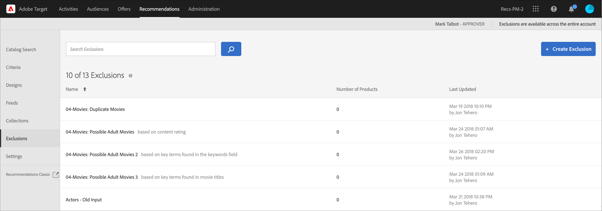

# Exclusions

Créez une exclusion dans [!DNL Adobe Target Recommendations] pour empêcher que des produits ou du contenu ne soient recommandés aux visiteurs. Une exclusion est un sous-ensemble de produits ou de contenu qui ne doit pas être recommandé aux visiteurs.

Les exclusions sont disponibles sur l’ensemble du compte. Contrairement aux collections, où vous spécifiez une collection spécifique pour chaque expérience lorsque vous créez une activité de [!UICONTROL Recommendations], les exclusions s’appliquent à toutes les activités sur le compte. Il n’existe aucune option pour affecter un groupe d’exclusion lors de la création de l’activité.

Voici quelques exemples d’exclusions :

* Produits qui ont été interrompus
* Le catalogue automne/hiver est désormais le seul catalogue qui doit être présent en ligne. Les articles du catalogue d&#39;été ne peuvent plus être achetés.
* Éléments qu&#39;il pourrait être inapproprié de recommander sur la plupart des pages/écrans (produits pour adultes, films NC-17, etc.)
* Produits avec des champs de métadonnées incomplets (miniature, prix ou autres métadonnées importantes manquantes)
* Produits qui ne devraient jamais être recommandés (il se peut qu’un SKU existe dans le système pour quelque chose, mais il ne s’agit pas d’un article achetable, ou il se peut que ce soit un faux SKU permettant à l’équipe d’assurance qualité de simuler un achat sans réellement commander quelque chose, etc.).

>[!IMPORTANT]
>
>Les règles d’exclusion sont appliquées globalement à tous les environnements.
>
>Les règles d’exclusion statiques et dynamiques sont des fonctionnalités puissantes qui peuvent vous aider dans vos efforts de marketing. Pour plus d’informations, des exemples et des scénarios de cas d’utilisation, voir [Utilisation des règles d’inclusion dynamique et statique](/help/main/c-recommendations/c-algorithms/use-dynamic-and-static-inclusion-rules.md#concept_4CB5C0FA705D4E449BD0B37B3D987F9F).

## Créer une exclusion

1. Cliquez sur **[!UICONTROL Recommendations]** > **[!UICONTROL Exclusions]** pour afficher la liste des exclusions existantes.

   

   Le « Nombre d’éléments » signalé pour chaque exclusion sur la vue de liste [!UICONTROL Exclusions] correspond au nombre de produits correspondant aux règles de cette exclusion dans le groupe d’hôtes [Recommendations](/help/main/administrating-target/hosts.md) par défaut configuré (environnement). Consultez les [Paramètres](https://experienceleague.adobe.com/docs/target-dev/developer/recommendations.html){target=_blank} pour modifier le groupe d’hôtes par défaut.

1. Cliquez sur **[!UICONTROL Create Exclusion]**.

1. (Conditionnel) Sélectionnez un environnement à partir du filtre **[!UICONTROL Environment]** lors de la création (ou de la mise à jour) d’une exclusion afin de prévisualiser le contenu de l’exclusion dans cet environnement. Par défaut, les résultats du groupe d’hôtes par défaut s’affichent.

   

1. Saisissez un **[!UICONTROL Name]** d’exclusion et saisissez une description facultative.

1. Utilisez le créateur de règles pour créer les exclusions.

   Sélectionnez un paramètre dans la liste Règles, sélectionnez un opérateur, puis saisissez une ou plusieurs valeurs pour identifier les produits. Séparez les diverses valeurs par des virgules.

1. Cliquez sur **[!UICONTROL Save]**.

## Création d’une exclusion à l’aide de la recherche avancée

Vous pouvez également créer des exclusions à l’aide de [!UICONTROL Advanced Search] sur la page [Recherche catalogue](/help/main/c-recommendations/c-products/catalog-search.md#save-as) ( [!UICONTROL Recommendations] > [!UICONTROL Catalog Search] > [!UICONTROL Advanced Search]).

Après avoir créé une recherche à l’aide de « id > contains », par exemple, vous pouvez cliquer sur [!UICONTROL Save As] > [!UICONTROL Exclusion].

>[!IMPORTANT]
>
>La fonctionnalité [!UICONTROL Advanced Search] ne respecte pas la casse ; toutefois, les produits renvoyés au moment de la diffusion sont basés sur une recherche sensible à la casse. Cette incohérence peut prêter à confusion. Veillez à tenir compte du respect de la casse lorsque vous créez des exclusions sur la base de résultats obtenus à l’aide de la fonctionnalité de recherche avancée. Par exemple, si vous effectuez une recherche portant sur « Vacances », cette recherche initiale répertorie les résultats contenant « Vacances » et « vacances ». Si vous créez ensuite une exclusion avec l’intention d’exclure les produits contenant « vacances », seuls les produits contenant « vacances » sont exclus. Les produits contenant « Vacances » ne sont pas exclus.

## Modifier, copier ou supprimer une exclusion

Pointez sur l’exclusion souhaitée dans la liste, puis cliquez sur l’icône appropriée : modifier, copier ou supprimer.

Vous pouvez copier une exclusion existante pour créer une exclusion en double que vous pouvez ensuite modifier. Vous pouvez ainsi créer une exclusion similaire avec moins d’effort.

N’oubliez pas que les exclusions sont disponibles sur l’ensemble du compte. Veillez à en tenir compte avant de supprimer une exclusion. Les exclusions supprimées ne peuvent pas être récupérées.

## Vidéo de formation : créer des collections et des exclusions dans Recommendations (7:05) 

Cette vidéo traite des sujets suivants :

* Créer une collection
* Créer une exclusion

>[!VIDEO](https://video.tv.adobe.com/v/27689)
