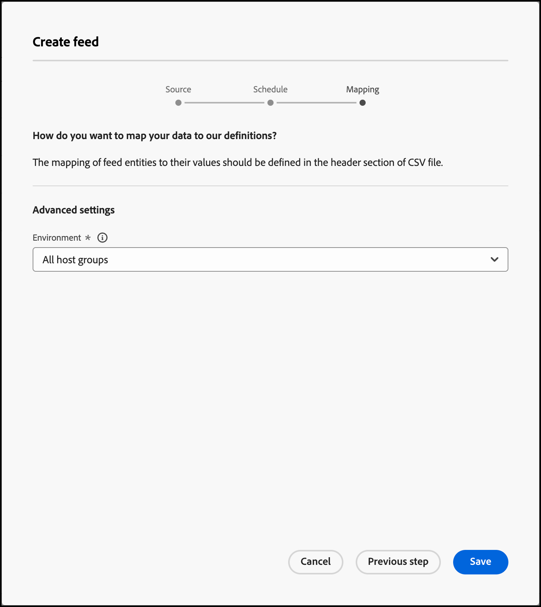

# Flux

Utilisez les flux pour que les entités soient importées dans [!DNL Adobe Target Recommendations]. Les entités peuvent être envoyées sous forme de fichiers CSV, via le format de flux Google Shopping et avec des classifications de produits Adobe Analytics.

## Aperçu des flux {#concept_D1E9C7347C5D4583AA69B02E79607890}

Les flux permettent de transmettre des [Entités](/help/main/c-recommendations/c-products/products.md) ou d’agrémenter vos données de mbox d’informations indisponibles sur la page ou dont l’envoi direct à partir de la page se révèle risqué, telles que les marges bénéficiaires, le coût des produits vendus, etc.

Les flux vous permettent de transmettre des informations détaillées sur les éléments dans [!DNL Recommendations], comme l’ID du produit, la catégorie, le nom, le message et d’autres attributs.

Vous pouvez sélectionner les colonnes de votre fichier de classifications de produits [!DNL Target] ou fichier Google Shopping à envoyer au serveur de [!DNL Recommendations]. 

Ces éléments de données sur chaque élément peuvent ensuite être utilisés pour :

* Afficher les valeurs dans les conceptions
* Définition des règles d’inclusion de critères
* Tri des éléments dans différentes collections
* Appliquer les exclusions aux recommandations

Les descriptions d’élément peuvent être transmises [!DNL Target] utilisation de flux ou de mbox. Si des données sont collectées à la fois par un flux d’entité et une mbox, ce sont les plus récentes qui l’emportent. En règle générale, les données les plus récentes proviennent d’une mbox, dans la mesure où elles sont consultées plus souvent. Dans les rares cas où l’accès aux données de flux d’entité et de mbox survient au même moment, ce sont les données de cette dernière qui sont utilisées.

La liste [!UICONTROL Flux] (**[!UICONTROL Recommandations]** > **[!UICONTROL Flux]**) fournit des informations sur les flux que vous avez créés.


La page Flux contient les colonnes suivantes :

* **Nom** : nom du flux spécifié lors de la création. Pour modifier le nom d’un flux, vous devez modifier le flux lui-même. Lorsque vous enregistrez le flux avec son nouveau nom, il est actualisé.
* **Type** : les types comprennent [CSV](/help/main/c-recommendations/c-products/feeds.md#section_65CC1148C7DD448FB213FDF499D35FCA), [Flux de produits Google](/help/main/c-recommendations/c-products/feeds.md#section_8EFA98B5BC064140B3F74534AA93AFFF) et [Classifications Analytics](/help/main/c-recommendations/c-products/feeds.md#section_79E430D2C75443BEBC9AA0916A337E0A).
* **État** : [état](/help/main/c-recommendations/c-products/feeds.md#concept_E475986720D1400999868B3DFD14A7A0) actuel du flux.
* **Planification** : affiche la fréquence des mises à jour du flux : Quotidien, Hebdomadaire, Toutes les deux semaines ou Jamais.
* **Éléments** : affiche le nombre d’éléments dans le flux.
* **Dernière mise à jour** : affiche la date et l’heure de la dernière mise à jour du flux et le nom de la personne qui l’a mis à jour. Si le flux [!UICONTROL Dernière mise à jour] indique « non défini », il provient de [!DNL Recommendations Classic] et ne peut pas être modifié depuis [!DNL Target Premium Recommendations].

>[!IMPORTANT]
>
>Les entités et attributs d’entité téléchargés expirent après 61 jours. Autrement dit :
>
>* Votre flux doit s’exécuter au moins une fois par mois pour s’assurer que le contenu de votre catalogue n’arrive pas à expiration.
>* La suppression d’un élément de votre fichier de flux ne le supprime pas de votre catalogue. Pour supprimer l’élément du catalogue, supprimez-le manuellement via l’interface utilisateur ou l’API de Target. Vous pouvez également modifier les attributs d’élément (tels que l’inventaire) pour vous assurer que l’élément est exclu de la considération.


## Types de source

Les entités peuvent être envoyées sous forme de fichiers CSV, via le format de flux Google Shopping et avec des classifications de produits Adobe Analytics.

### CSV {#section_65CC1148C7DD448FB213FDF499D35FCA}

Vous pouvez créer un fichier .csv utilisant le format de transfert de fichier CSV propriétaire d’Adobe. Le fichier contient des informations d’affichage sur les attributs personnalisés et réservés pour vos produits. Pour charger des attributs spécifiques à votre mise en œuvre, remplacez `CustomN` sur la ligne d’en-tête par le nom de l’attribut que vous souhaitez utiliser. Dans l’exemple ci-dessous, `entity.Custom1` a été remplacé par : `entity.availability`. Vous pouvez ensuite charger le fichier par lot sur le serveur [!DNL Recommendations].

L’utilisation du format .csv présente les avantages suivants sur le format Google Feed :

* Il ne nécessite pas de mappages de champs.
* Il prend en charge les attributs à valeurs multiples (voir l’exemple ci-dessous).
* Il prend en charge plus de 100 attributs personnalisés. Si vous avez besoin de plus de 100 attributs personnalisés, vous pouvez créer un deuxième fichier de flux comportant un ensemble différent d’attributs personnalisés spécifiés.

Utilisez cette méthode de chargement pour envoyer les informations à afficher si vous n’avez pas de mbox sur votre page ou que vous souhaitez compléter ces informations par des éléments non disponibles sur votre site. Par exemple, vous pouvez envoyer au module les informations du stock qui ne sont pas publiées sur votre site.

Toute donnée chargée à l’aide du fichier .csv, du flux de produit Google ou du flux de classification des produits Analytics remplace la valeur d’attribut d’entité existante dans notre base de données. Si vous envoyez des informations de prix via des requêtes de mbox et que vous envoyez ensuite des valeurs de prix différentes dans le fichier, les valeurs du fichier remplacent les valeurs définies avec la requête de mbox. Une exception à cette règle est l’attribut d’entité `categoryId` où les valeurs de catégorie sont ajoutées au lieu d’être remplacées jusqu’à une limite de 250 caractères.

>[!IMPORTANT]
>
>Dans votre fichier .csv, ne placez pas les valeurs entre guillemets doubles ( &quot; ), sauf si cela est intentionnel. Si vous placez les valeurs entre guillemets doubles, vous devez les faire précéder d’un caractère d’échappement en les plaçant entre un autre jeu de guillemets doubles. Si les guillemets doubles ne sont pas précédés d’un caractère d’échappement, le flux de recommandations ne se charge pas correctement.

Par exemple, la syntaxe suivante est incorrecte :

```
"Apples "Bananas" Grapes"",
```

La syntaxe suivante est correcte :

```
"Apples ""Bananas"" Grapes""",
```

>[!NOTE]
>
>Vous ne pouvez pas remplacer une valeur existante par une valeur vierge. Vous devez transmettre une autre valeur à sa place pour la remplacer. Dans le cas d’un prix de vente, une solution courante consiste à transférer une valeur NULL réelle ou d’autres messages. Vous pouvez alors écrire une règle de modèle afin d’exclure des éléments comportant cette valeur.

Le produit est disponible dans l’interface d’administration environ deux heures après le chargement de son entité.

Voici un exemple de code pour un fichier .csv :

```
## RECSRecommendations Upload File 
## RECS''## RECS'' indicates a Recommendations pre-process header. Please do not remove these lines. 
## RECS 
## RECSUse this file to upload product display information to Recommendations. Each product has its own row. Each line must contain 19 values and if not all are filled a space should be left. 
## RECSThe last 100 columns (entity.custom1 - entity.custom100) are custom. The name 'customN' can be replaced with a custom name such as 'onSale' or 'brand'. 
## RECSIf the products already exist in Recommendations then changes uploaded here will override the data in Recommendations. Any new attributes entered here will be added to the product''s entry in Recommendations. 
## RECSentity.id,entity.name,entity.categoryId,entity.message,entity.thumbnailUrl,entity.value,entity.pageUrl,entity.inventory,entity.margin,entity.last_updated_by,entity.multi_english,entity.availability,entity.tax_country,entity.tax_region,entity.tax_rate,entity.product_type,entity.item_group_id,entity.color,entity.size,entity.brand,entity.gtin 
na3456,RipCurl Watch with Titanium Dial,Watches & Sport,Cutting edge titanium with round case,https://example.com/s7/na3456_Viewer,425,https://example.com/shop/en-us/na3456_RipCurl,24,0.25,csv,"[""New"",""Web"",""Sales"",""[1,2,34,5]""]",in stock,US,CA,9.25,Shop by Category > Watches,dz1,Titanium,44mm,RipCurl,"075380 01050 5" 
na3457,RipCurl Watch with Black Dial,Watches & Sport,Cutting edge matte black with round case,https://example.com/s7/na3457_Viewer,275,https://example.com/shop/en-us/na3457_RipCurl,24,0.27,csv,"[""New"",""Web"",""Sales"",""[1,2,34,5]""]",in stock,US,CA,9.25,Shop by Category > Watches,dz1,Black,44mm,RipCurl,"075340 01060 7"
```

### Google {#section_8EFA98B5BC064140B3F74534AA93AFFF}

Le type de flux de recherche de produit Google utilise le format Google. Celui-ci diffère du format de transfert de fichier CSV propriétaire d’Adobe.

Si vous possédez un flux de produits Google existant, vous pouvez l’utiliser comme fichier d’importation.

>[!NOTE]
>
>L’utilisation des données Google n’est pas obligatoire. [!DNL Recommendations] utilise le même format que Google. Vous pouvez utiliser cette méthode pour envoyer les données dont vous disposez et utiliser les fonctions de planification disponibles. Vous pouvez cependant conserver les noms d’attribut Google prédéfinis lors de la configuration du fichier.

La plupart des détaillants transfèrent des produits vers Google, de telle sorte qu’ils s’affichent lorsqu’un visiteur utilise Google Shopping. [!DNL Recommendations] applique exactement la spécification pour les flux d’entité. Les flux d’entité peuvent être envoyés à [!DNL Recommendations] via .xml, .txt ou .tsv, et peut utiliser la variable [Attributs définis par Google](https://support.google.com/merchants/answer/188494?hl=en&amp;topic=2473824&amp;ctx=topic#US). Les résultats autorisent la recherche dans les [pages de magasinage de Google](https://www.google.com/prdhp).

>[!NOTE]
>
>La méthode POST doit être autorisée sur le serveur qui héberge le contenu du flux Google.

Parce que [!DNL Recommendations] les utilisateurs configurent déjà des flux .xml ou .txt à envoyer à Google par URL ou FTP ; les flux d’entité acceptent ces données de produit et les utilisent pour créer le catalogue de recommandations. Indiquez où ce flux existe et où le serveur de Recommandations récupère les données.

Si vous utilisez Google Shopping pour le chargement du flux d’entité, une mbox de page de produits doit être présente sur la page si vous souhaitez y afficher des recommandations ou effectuer le suivi des consultations de produits pour la diffusion d’algorithmes en fonction des consultations.

Les flux Google ne prennent pas en charge plusieurs valeurs pour un attribut personnalisé.

Le flux s’exécute au moment où vous l’enregistrez et l’activez. Il s’exécute au moment où vous enregistrez le flux, puis chaque jour une heure plus tard.

Voici un exemple de code pour un fichier .xml de flux Google Shopping :

```
<?xml version="1.0" encoding="UTF-8" standalone="yes"?> 
<feed xmlns="https://www.w3.org/2005/Atom" xmlns:ns2="https://base.google.com/ns/1.0" xmlns:ns3="https://base.google.com/cns/1.0"> 
    <title>Product Feed</title> 
    <link href="https://example.com"/> 
    <updated>2017-12-13T08:45:04.918-08:00</updated> 
    <author> 
        <name>Product Feed Author</name> 
    </author> 
    <id>https://example.com</id> 
    <entry> 
        <title>RipCurl Watch with Titanium Dial</title> 
        <description>Cutting edge Titanium with Round case</description> 
        <ns2:id>na3452</ns2:id> 
        <ns2:link>https://example.com/shop/en-us/na3452_RipCurl</ns2:link> 
        <ns2:availability>in stock</ns2:availability> 
        <ns2:condition>NEW</ns2:condition> 
        <ns2:google_product_category>Watches &amp; Sport</ns2:google_product_category> 
        <ns2:gtin>075380 01050 5</ns2:gtin> 
        <ns2:image_link>https://example.com/s7/na3452_Viewer</ns2:image_link> 
        <ns2:mobile_link>https://m.example.com/s7/na3452_Viewer</ns2:mobile_link> 
        <ns2:mpn>71050</ns2:mpn> 
        <ns2:price>425</ns2:price> 
        <ns2:product_review_average>5.0</ns2:product_review_average> 
        <ns2:product_review_count>30</ns2:product_review_count> 
        <ns2:product_type>Shop by Category > Watches </ns2:product_type> 
        <ns2:brand>RipCurl</ns2:brand> 
        <ns2:sale_price>375</ns2:sale_price> 
        <ns2:tax> 
          <ns2:country>US</ns2:country> 
          <ns2:region>CA</ns2:region> 
          <ns2:rate>9.25</ns2:rate> 
          <ns2:tax_ship>y</ns2:tax_ship> 
        </ns2:tax> 
        <ns2:is_bundle>N</ns2:is_bundle> 
    </entry> 
    <entry> 
        <title>RipCurl Watch with Black Dial</title> 
        <description>Cutting edge matte black with Round case</description> 
        <ns2:id>na3453</ns2:id> 
        <ns2:link>https://example.com/shop/en-us/na3453_RipCurl</ns2:link> 
        <ns2:availability>in stock</ns2:availability> 
        <ns2:condition>NEW</ns2:condition> 
        <ns2:google_product_category>Watches &amp; Sport</ns2:google_product_category> 
        <ns2:gtin>075380 013450 5</ns2:gtin> 
        <ns2:image_link>https://example.com/s7/na3453_Viewer</ns2:image_link> 
        <ns2:mobile_link>https://m.example.com/s7/na3453_Viewer</ns2:mobile_link> 
        <ns2:mpn>71050</ns2:mpn> 
        <ns2:price>275</ns2:price> 
        <ns2:product_review_average>4.8</ns2:product_review_average> 
        <ns2:product_review_count>23</ns2:product_review_count> 
        <ns2:product_type>Shop by Category > Watches </ns2:product_type> 
        <ns2:brand>RipCurl</ns2:brand> 
        <ns2:sale_price>249</ns2:sale_price> 
        <ns2:tax> 
          <ns2:country>US</ns2:country> 
          <ns2:region>CA</ns2:region> 
          <ns2:rate>9.25</ns2:rate> 
          <ns2:tax_ship>y</ns2:tax_ship> 
        </ns2:tax> 
        <ns2:is_bundle>N</ns2:is_bundle> 
    </entry> 
</feed> 
```

Voici un exemple de code pour un fichier .tsv de flux Google Shopping :

```
id    title    description    link    price    condition    availability    image_link    tax    shipping_weight    shipping    google_product_category    product_type    item_group_id    color    size    gender    age_group    pattern    brand    gtin    mpn 
na3454    RipCurl Watch with Titanium Dial    Cutting edge titanium with round case    https://example.com/shop/en-us/na3454_RipCurl    425    new    in stock    https://example.com/s7/na3452_Viewer    US:CA:9.25:y    1.5 oz    US:::0.00 USD    Watches & Sport    Shop by Category > Watches    dz1    Black    44mm    male    adult    Solid    RipCurl    075380 01050 5    DZ1437 
na3455    RipCurl Watch with Black Dial    Cutting edge matte black with round case    https://example.com/shop/en-us/na3455_RipCurl    275    new    in stock    https://example.com/s7/na3452_Viewer    US:CA:9.25:y    1.5 oz    US:::0.00 USD    Watches & Sport    Shop by Category > Watches    dz1    Black    44mm    male    adult    Solid    RipCurl    075340 01060 7    DZ1446
```

### Classifications des produits d’analyse {#section_79E430D2C75443BEBC9AA0916A337E0A}

La classification des produits d’analyse est la seule disponible pour les recommandations. Pour plus d’informations sur ce fichier de classification, voir [À propos des classifications](https://experienceleague.adobe.com/docs/analytics/components/classifications/c-classifications.html) dans le *Composants Analytics* guide. Il est possible que toutes les informations dont vous avez besoin pour les recommandations ne soient pas disponibles dans votre implémentation actuelle. Vous êtes donc invité à suivre ce guide de l’utilisateur pour ajouter des informations à votre fichier de classifications.

>[!IMPORTANT]
>
>Avant d’importer des données d’entité dans [!DNL Recommendations] en utilisant les classifications de produits Analytics, sachez qu’il ne s’agit pas de la méthode préconisée.
>
> Tenez compte des restrictions suivantes :
>
>* Les mises à jour des attributs d’entité exigent un délai supplémentaire de 24 heures.
>* [!DNL Target] prend uniquement en charge les classifications de produits. Le code SKU du produit d’analyse doit correspondre au même niveau que l’entrée [!DNL Recommendations]`entity.id` de Des classifications d’analyses personnalisées peuvent être créées au moyen d’Adobe Consulting Services. Veuillez contacter votre gestionnaire de compte si vous avez des questions.


## Création d’un flux {#steps}

Créez un flux pour insérer des informations sur vos produits ou services dans les [!DNL Recommendations].

1. Depuis l’interface Target, cliquez sur **[!UICONTROL Recommandations]** > **[!UICONTROL Flux]** > **[!UICONTROL Créer un flux]**.

   

1. Entrez un nom explicite pour votre flux.
1. Sélectionnez un **[!UICONTROL Type de source]**.

   * CSV
   * Flux de produits Google
   * Classifications Analytics

   Pour plus d’informations sur les types de flux CSV et Flux de produits Google, voir [Présentation des flux](/help/main/c-recommendations/c-products/feeds.md#concept_D1E9C7347C5D4583AA69B02E79607890). Vous pouvez également [téléchargement d’un guide de modèle CSV](/help/main/c-recommendations/c-products/assets/EntityFileUploadTemplate.csv) pour vous aider à formater correctement le flux.

1. (Conditionnel) Si vous avez sélectionné **[!UICONTROL CSV]** ou **[!UICONTROL Flux de produits Google]**, indiquez l’emplacement d’accès du flux.

   * **FTP** : si vous sélectionnez FTP, fournissez les informations du serveur FTP, les informations d’identification de connexion, le nom du fichier et le répertoire FTP. Pour des téléchargements plus sécurisés, vous pouvez opter pour le protocole FTP avec SSL (FTPS).

      Paramètres du serveur FTP pris en charge :

      * FTP et FTPS doivent être configurés pour utiliser le FTP passif.
      * Pour FTPS, configurez le serveur pour accepter les connexions FTPS explicites.
      * SFTP n’est pas pris en charge.
      * Vous pouvez indiquer manuellement un port sur lequel lancer la connexion (par exemple, `ftp://ftp.yoursite.com:2121`). Si vous n’indiquez pas de port, le port FTP ou FTPS par défaut est utilisé.
   * **URL** : si vous sélectionnez URL, spécifiez l’URL.


1. (Conditionnel) Si vous avez sélectionné **[!UICONTROL Classifications Analytics]**, choisissez la suite de rapports dans la liste déroulante.

1. Cliquez sur la flèche **[!UICONTROL Suivant]** pour afficher les options de [!UICONTROL Planification].

   

1. Choisissez une option de mise à jour :

   * Quotidien
   * Hebdomadaire
   * Toutes les 2 semaines
   * Jamais : ne planifiez pas de mise à jour Sélectionnez cette option si vous voulez empêcher l’exécution de ce flux.

1. Spécifiez l’heure à laquelle vous souhaitez que le flux s’exécute.

   Cette option se base sur le fuseau horaire utilisé par votre navigateur. Si vous voulez utiliser l’heure d’un fuseau horaire différent, vous devez calculer cette heure selon votre fuseau horaire.

1. Cliquez sur la flèche **[!UICONTROL Suivant]** pour afficher les options de [!UICONTROL Mapping], puis indiquez la manière dont vous souhaitez mapper vos données aux définitions [!DNL Target].

   

1. (Facultatif) Si vous souhaitez que les flux appartiennent à un environnement (un groupe d’hôtes), sélectionnez le groupe d’hôtes en question.

   Par défaut, le flux appartient à tous les groupes d’hôtes. Cela garantit que les éléments du flux sont disponibles dans tous les environnements. Pour plus d’informations, voir [Hôtes](/help/main/administrating-target/hosts.md#concept_516BB01EBFBD4449AB03940D31AEB66E).

1. Cliquez sur **[!UICONTROL Enregistrer]**.

Après la création ou la modification d’un flux, le flux s’exécute immédiatement, puis se met à jour en fonction des paramètres que vous avez configurés. Il faut un certain temps pour que les informations soient disponibles. Le flux doit tout d’abord être synchronisé, puis traité et indexé pour pouvoir être publié et rendu disponible. L’état actuel s’affiche sous [État du flux](/help/main/c-recommendations/c-products/feeds.md#status) dans la liste des flux. Vous pouvez fermer [!DNL Target] avant que le processus soit terminé et ce dernier se poursuit.

Lorsque l’indexation est en cours, les produits et les en-têtes du flux apparaissent avant que les valeurs individuelles aient été indexées. Cela vous permet de rechercher et de consulter des produits afin que vous puissiez créer des collections, des exclusions, des conceptions et des activités avant que l’indexation soit terminée.

Lorsque l’état indique « Succès », cela signifie que le fichier a été trouvé et analysé correctement. Les informations ne sont pas disponibles pour une utilisation dans les [!DNL Recommendations] tant que le fichier n’a pas été indexé, ce qui peut prendre du temps, selon la taille du fichier. Si le processus échoue, cela signifie que le fichier n’a pas été trouvé (par exemple, vous avez utilisé une URL non valide ou vos informations FTP étaient incorrectes) ou qu’une erreur d’analyse s’est produite.

## États de flux et indicateurs {#concept_E475986720D1400999868B3DFD14A7A0}

Information à propos des états possibles des flux et leurs indicateurs.

### États du flux {#status}

Un flux peut avoir les états suivants :

| État | Description |
|--- |--- |
| Synchronisation | Les informations de configuration du flux sont enregistrés dans Target. |
| Échec de la synchronisation | Les détails de configuration du flux n’ont pas pu être enregistrés dans Target. Veuillez réessayer. |
| Aucune exécution de flux | Vous avez créé un flux, mais il n’a pas été planifié (fréquence = Jamais). |
| Planifié à *date et heure* | Le flux n’a pas été exécuté, mais il doit s’exécuter à la date et à l’heure spécifiées. |
| En attente de téléchargement | Target se prépare à télécharger le fichier de flux. |
| Téléchargement du fichier de flux | Target télécharge le fichier de flux. |
| Importation d’éléments | Target importe des éléments à partir du fichier de flux. |
| Flux importé avec succès à l’*heure* | Target a importé le fichier de flux dans son système de diffusion de contenu. Des modifications ont été apportées aux attributs d’élément dans le système de diffusion de contenu et seront bientôt répercutées dans les recommandations fournies. Si vous ne voyez pas les modifications attendues, réessayez et actualisez la page contenant les recommandations.<br>Remarques:<ul><li>Si des modifications apportées aux attributs d’un élément entraînent l’exclusion d’un élément des recommandations, l’exclusion est immédiatement répercutée. Si un élément est ajouté ou si des modifications apportées aux attributs entraînent la *fin* de l’exclusion d’un élément des recommandations, ces modifications ne sont pas répercutées avant la mise à jour suivante de l’algorithme, qui se produit dans les 24 heures.</li><li>Lorsque cet état s’affiche, il se peut que les mises à jour ne soient pas encore répercutées dans l’interface utilisateur de recherche catalogue. Un état distinct est répertorié sur la recherche de catalogue indiquant la dernière fois où le catalogue indexable a été mis à jour.</li></ul> |
| Échec de l’indexation | L’opération d’index a échoué. Veuillez réessayer. |
| Serveur introuvable | Les destinations FTP ou URL sont incorrectes ou inaccessibles. |

Pour mettre à jour un flux (par exemple, pour apporter des modifications à la configuration ou au fichier du flux), ouvrez le flux, apportez les modifications souhaitées, puis cliquez sur **[!UICONTROL Enregistrer]**.

>[!IMPORTANT]
>
>Le délai d’expiration des entités téléchargées est de 61 jours. Cela signifie que votre fichier de flux doit être téléchargé au moins tous les 60 jours pour éviter toute interruption de vos activités de recommandations. Si un élément n’est pas inclus dans un fichier de flux (ou une autre méthode de mise à jour des entités) au moins une fois tous les 60 jours, [!DNL Adobe Target] déduit que l’élément n’est plus pertinent et le supprime du catalogue.

### Indicateurs de l’état du flux {#section_3C8A236C5CB84C769A9E9E36B8BFABA4}

Les indicateurs de l’état du flux suivants s’affichent dans la colonne [!UICONTROL État] :

| Indicateur d’état | Description |
|--- |--- |
| Indicateur d’état vert | Une fois l’indexation du flux terminée, celui-ci est marqué d’un point vert pour indiquer que son état est Succès. |
| Indicateur d’état jaune | Lorsqu’un index de flux ou un flux est retardé de 25 % par rapport à la fréquence du flux, un point d’état jaune s’affiche. Par exemple, un point jaune s’affiche pour un flux défini pour s’exécuter tous les jours si l’index n’est pas terminé six heures après l’heure planifiée. Remarque : Une fois que l’état du flux est « En attente de la file d’attente d’indexation », les valeurs nouvellement mises à jour sont disponibles dans le traitement des diffusions et des critères. |
| Indicateur d’état blanc | Lorsqu’un flux n’est pas planifié, un point d’état blanc indique que le flux n’a pas encore été exécuté. |
| Indicateur d’état rouge | Si le flux ne parvient pas à transférer les données vers le serveur, un indicateur d’état rouge s’affiche. |

Prenons les exemples suivants :

**Exemple 1 :**

* 1er jour : traitement du flux quotidien à 9 h 00 (heure du Pacifique).
* 2e jour : il est 15 h 30 et le flux n’a pas été exécuté depuis hier à 9 h 00.

L’état doit être jaune car l’index aurait dû s’exécuter il y a environ 6,5 heures. 6,5 heures +24 = 127 % de l’intervalle d’exécution du flux.

**Exemple 2 :**

* 1er janvier : traitement du flux mensuel à 9 h 00 (heure du Pacifique).
* 3 février : il est 10 h 00 et le flux ne s’est pas exécuté depuis un mois, un jour et une heure.

L’état doit être jaune car l’index aurait dû s’exécuter il y a environ un jour et une heure. Même si cela représente seulement (31+(1/25))/30 = 1,03 % du paramètre de fréquence, le délai d’un jour maximum a été dépassé.

## Vidéos de formation

Les vidéos suivantes contiennent davantage d’informations sur les concepts abordés dans cet article.

### Présentation des flux dans Recommendations (3:01) 

Cette vidéo traite des sujets suivants :

* Comprendre l’objectif des flux
* Comprendre la valeur des flux

>[!VIDEO](https://video.tv.adobe.com/v/27695)

### Créer un flux (6:44) 

Cette vidéo traite des sujets suivants :

* Configurer un flux
* Déterminer le type de flux à utiliser

>[!VIDEO](https://video.tv.adobe.com/v/27696)
