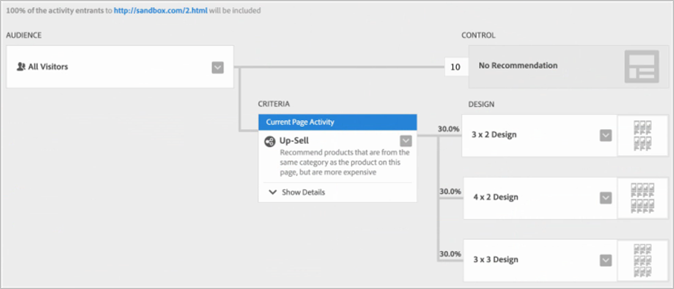

# Différences entre Recommendations Classic et les activités Recommendations dans [!DNL Target] Premium

Informations pour vous aider à faire votre choix entre Recommendations Classic et les activités Recommendations dans Target Premium.

>[!NOTE]
>
>Les activités Recommendations sont disponibles dans le cadre de la solution [!DNL Target Premium]. Elles ne sont pas disponibles dans [!DNL Target Standard] sans une licence [!DNL Target Premium].

Dans [!DNL Recommendations] Classic, les recommandations s’affichaient en créant une mbox de collecte de données sur une page, puis en ajoutant une mbox d’affichage dans un emplacement spécifique de la page. L’activité [!DNL Recommendations] dans [!DNL Target Premium] permet de collecter des informations sur les visiteurs et de créer les recommandations n’importe où sur la page sans avoir à créer une mbox pour chaque emplacement dans lequel vous souhaitez recommander des produits ou du contenu. Une simple référence JavaScript dans l’en-tête de la page active les recommandations à n’importe quel emplacement de la page. Utilisez cette référence JavaScript pour transmettre des clés à la mbox globale de [!DNL Target], par exemple les clés `entity.id` et `entity.categoryId`.

[!DNL Recommendations Classic] apparaît sous la forme d’une carte dans l’interface utilisateur de [!DNL Experience Cloud]. Une activité [!DNL Recommendations] est disponible depuis le workflow [!DNL Target Premium].

Les utilisateurs [!DNL Recommendations Classic] peuvent continuer à utiliser leurs mbox [!DNL Recommendations] dans [!DNL Target Recommendations]. Ils peuvent également associer les approches Classic et [!DNL Target] en conservant leur mbox et en utilisant le code JavaScript dans l’en-tête afin d’activer la fonctionnalité [!DNL Recommendations] pour les autres éléments de la page. Néanmoins, pour tirer pleinement parti de la fonctionnalité de [!DNL Target], les utilisateurs de [!DNL Recommendations Classic] peuvent préférer supprimer leurs anciennes mbox et utiliser uniquement [!DNL Target Recommendations].

L’activité [!DNL Recommendations] de [!DNL Target] améliore [!DNL Recommendations Classic] dans les domaines suivants :

## Recommendations en tant qu’offre

Vous pouvez inclure des recommandations dans les activités [!UICONTROL A/B Test] (y compris [!UICONTROL Auto-Allocate] et [!UICONTROL Auto-Target]) et [!UICONTROL Experience Targeting] (XT).

Cette fonctionnalité offre de nouvelles fonctionnalités, telles que :

* Testez et ciblez le contenu des recommandations et des non-recommandations dans la même activité.
* Testez facilement l’emplacement des recommandations sur la page, y compris l’ordre de plusieurs recommandations.
* Envoyez automatiquement le trafic vers l’expérience de recommandations la plus performante à l’aide de [!UICONTROL Auto-Allocate].
* Affectez dynamiquement les visiteurs à des expériences de recommandations personnalisées en fonction de leur profil à l’aide de [!UICONTROL Auto-Target].

Pour commencer, créez une activité [!UICONTROL A/B Test] ou [!UICONTROL Experience Targeting] à l’aide de [!UICONTROL Visual Experience Composer] et utilisez l’action [!UICONTROL Insert Before], [!UICONTROL Insert After] ou [!UICONTROL Replace With] pour ajouter des recommandations à une expérience.

Pour plus d’informations, consultez [Recommendations en tant qu’offre](/help/main/c-recommendations/recommendations-as-an-offer.md).

## Critères {#section_117709846DAA404580EBE879FFCBD9BA}

[!DNL Target Recommendations] comprend une bibliothèque de critères contenant des jeux de règles et de configurations prédéfinis. Dans [!DNL Recommendations Classic], chaque recommandation a été générée manuellement en remplissant un formulaire et en effectuant une sélection à partir d’une liste volumineuse de règles. Désormais, lorsque vous créez une activité [!DNL Recommendations], vous sélectionnez simplement un jeu de critères préconfiguré. Vous pouvez toujours créer des recommandations personnalisées, mais la bibliothèque de critères comporte la plupart des configurations les plus courantes, prédéfinies pour simplifier le processus et utilisant une langue que les utilisateurs comprennent. Les critères prédéfinis peuvent être utilisés en l’état ou vous pouvez les copier et les modifier pour répondre à vos besoins spécifiques.

Les critères sont préconfigurés et triés par secteur industriel vertical, par type de page et par mise en œuvre. Par exemple, vous pouvez rechercher les critères qui s’appliquent au secteur du commerce de détail pour les utiliser sur une page de produits affichant les produits d’une catégorie spécifique (telle que définie par le paramètre `entity.categoryID`).

Pour plus d’informations sur l’utilisation et la création de critères, voir [Critères](/help/main/c-recommendations/c-algorithms/algorithms.md).

## Workflow {#section_76B4A26297BF422382DE2C79A2713D3C}

Le processus de [!DNL Recommendations] a été simplifié. Au lieu de remplir des formulaires complexes, vous suivez un processus permettant de :

1. sélectionner des critères ;
1. Sélectionnez une [conception](/help/main/c-recommendations/c-design-overview/create-design.md#task_CC5BD28C364742218C1ACAF0D45E0E14) préconfigurée.
1. prévisualiser les recommandations obtenues.

## Aperçu visuel  {#section_639B9E38C9EC4093BF9023EE0F2A15AC}

Vous pouvez prévisualiser vos recommandations après leur configuration et apporter toute modification requise sans avoir à les créer dans la page. Il ne vous reste plus qu’à les tester. Des aperçus sont disponibles dans [!DNL Target].

## Ciblage {#section_93295EA0DBA14210B8518AF4802A459F}

Dans [!DNL Recommendations Classic], il existait six options de ciblage. Les activités Recommendations utilisent l’ensemble des options de ciblage de Target. Définissez une audience en utilisant [!DNL Target] ou d’autres audiences [!DNL Adobe Experience Cloud] (par exemple, [!DNL Audience Manager] et [!DNL Analytics]), puis sélectionnez le pourcentage de participants à l’activité qui voient chaque conception et qui voient le contrôle.

## Création de rapports {#section_25C2FCCE4BC1488496C517C0470B5CD6}

Dans [!DNL Target], [!DNL Recommendations] fournit une fonctionnalité de création de rapports améliorée qui tire parti des fonctionnalités de [!DNL Target] et de [!DNL Experience Cloud]. Au lieu d’afficher seulement l’effet élévateur fourni par les [!DNL Recommendations] comparé aux résultats sans elles, vous pouvez afficher des informations complètes sur votre activité [!DNL Recommendations].

