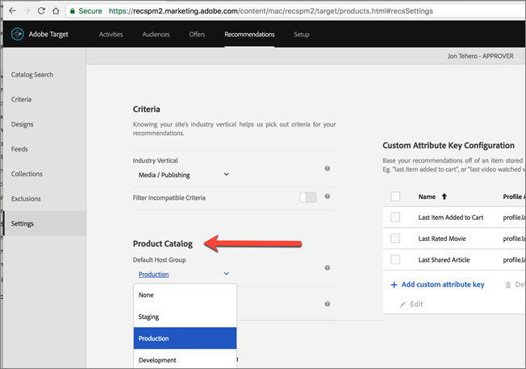

# Forum aux questions (FAQ) de Recommandations

Liste des questions fréquentes (FAQ) relatives aux activités d’[!DNL Adobe Target] [!DNL Recommendations].

## Pourquoi la [!UICONTROL recherche catalogue] n’affiche-t-elle pas les bons résultats lorsque j’effectue une recherche sur un attribut personnalisé avec une valeur numérique ?

Lorsque vous effectuez une recherche catalogue sur un attribut personnalisé doté d’une valeur numérique, les résultats traitent l’attribut personnalisé comme une valeur de type chaîne plutôt que comme une valeur numérique.

Actuellement, aucune fonctionnalité disponible ne permet aux clients de modifier le type d’un attribut. Pour apporter une modification, [ouvrez un problème client](/help/main/cmp-resources-and-contact-information.md#reference_ACA3391A00EF467B87930A450050077C) avec en référence les attributs dont le type doit être passé de chaîne à numérique.

## Combien de temps faut-il pour que les mises à jour des éléments de mon catalogue soient répercutées sur mon site ?

La période et les résultats varient en fonction du mode de mise à jour des éléments.

| Source | Détails |
| --- | --- |
| Attributs d’élément mis à jour via la mbox ou l’API | <ul><li>Les recommandations sont mises à jour dans les 15 minutes.</li><li>Les recommandations et les attributs d’élément existants restent affichés tant que des mises à jour sont disponibles.</li><li>La recherche catalogue est mise à jour après l’indexation du catalogue (3-8 heures).</li></ul> |
| Attributs d’élément mis à jour via le flux | <ul><li>Les recommandations sont mises à jour après l’ingestion du flux (2-8 heures).</li><li>Les recommandations et les attributs d’élément existants restent affichés tant que des mises à jour sont disponibles.</li><li>La recherche catalogue est mise à jour après l’ingestion du flux (2-8 heures) et l’indexation suivante du catalogue (3-8 heures). La recherche catalogue est mise à jour dans un délai de 5 à 16 heures au total.</li></ul> |
| Élément supprimé du catalogue via l’interface utilisateur ou l’API [!DNL Target] | <ul><li>Les recommandations sont mises à jour dans les 15 minutes.</li><li>Les recommandations et les attributs d’élément existants restent affichés tant que des mises à jour sont disponibles.</li><li>La recherche catalogue est mise à jour après l’indexation du catalogue (3-8 heures).</li></ul> |
| Élément ajouté au catalogue via la mbox ou l’API | <ul><li>Les recommandations sont mises à jour après l’exécution de l’algorithme. Les exécutions d’algorithmes sont planifiées toutes les 12 heures pour les algorithmes de 1 à 2 jours et toutes les 24 heures pour les algorithmes de plus de 7 jours.</li><li>Les recommandations existantes restent affichées tant que des mises à jour sont disponibles si l’élément ajouté n’est pas une clé demandée.</li><li>Les recommandations de sauvegarde restent affichées tant que des mises à jour sont disponibles si l’élément ajouté est une clé demandée.</li><li>La recherche catalogue est mise à jour après l’indexation du catalogue (3-8 heures).</li></ul> |
| Élément ajouté au catalogue via un flux | <ul><li>Les recommandations sont mises à jour après l’ingestion du flux (2-8 heures). Les exécutions suivantes de l’algorithme sont planifiées toutes les 12 heures pour les algorithmes de 1 à 2 jours et toutes les 24 heures pour les algorithmes de plus de 7 jours. Les recommandations sont mises à jour dans un délai de 2 à 32 heures au total.</li><li>Les recommandations existantes restent affichées tant que des mises à jour sont disponibles si l’élément ajouté n’est pas une clé demandée.</li><li>Les recommandations de sauvegarde restent affichées tant que des mises à jour sont disponibles si l’élément ajouté est une clé demandée.</li><li>La recherche catalogue est mise à jour après l’ingestion du flux (2-8 heures) et l’indexation du catalogue (3-8 heures). La recherche catalogue est mise à jour dans un délai de 5 à 16 heures au total.</li></ul> |

Après l’importation d’un fichier de flux ou après la réception des mises à jour d’entité via l’API ou la mbox, les modifications suivantes sont répercutées en moins de 60 minutes :

* Si un élément qui a été exclu doit à présent être inclus, il le sera lors de la prochaine exécution de l’algorithme (12-24 heures).

  Cette situation se produit, car [!DNL Target] applique des exclusions en ligne et hors ligne. Lorsqu’un élément a été récemment exclu, l’exclusion en ligne s’applique rapidement. Lorsqu’un élément a été récemment inclus, l’exclusion en ligne disparaît rapidement, mais l’exclusion hors ligne ne disparaît que lors de la prochaine exécution de l’algorithme.

* Si un élément qui a été inclus précédemment doit maintenant être exclu, il l’est selon la chronologie « Attributs d’élément mis à jour… » décrite ci-dessus, en fonction de la source de flux (15 minutes via la mbox/l’API ou 12-24 heures via le flux).

Les modifications suivantes ne sont pas prises en compte avant que l’algorithme suivant ne s’exécute (dans les 12 à 24 heures) :

* Les attributs d’élément utilisés dans les règles de collection utilisées pour l’activité.
* Les attributs d’élément utilisés dans une promotion basée sur un attribut ou une collection associée à l’activité.
* Une catégorie d’éléments où l’élément apparaît pour une « catégorie en cours » ou une « catégorie préférée » dans l’algorithme Meilleures ventes ou Le plus consulté.
* Un classement des éléments recommandés lorsque l’attribut modifié est un attribut personnalisé utilisé comme clé personnalisée pour un algorithme.
* Un classement des éléments recommandés en fonction d’un ou plusieurs attributs modifiés lorsque la logique de recommandation est « Articles avec des attributs similaires », lorsque des facteurs de pondération « Similarité de contenu » sont utilisés ou lorsque des facteurs « Pondération d’attribut » sont utilisés.

>[!NOTE]
>
>Un fichier de flux est considéré comme importé lorsque son état passe de « Importation des éléments » à « Préparation des mises à jour de l’index de recherche ». Les mises à jour peuvent prendre plus de 60 minutes dans l’interface utilisateur de la recherche catalogue. La recherche catalogue est à jour lorsque l’état du flux devient « Mises à jour terminées ». Même si la recherche catalogue n’est pas encore à jour, votre site répercute les mises à jour selon les périodes répertoriées ci-dessus. La durée de mise à jour de l’index de recherche catalogue la plus récente s’affiche sur la page Recherche catalogue.

## Combien de temps faut-il pour qu’une modification apportée à la configuration de mes paramètres d’activité, d’offre, de promotions ou de critères [!UICONTROL Recommendations] soit prise en compte sur mon site ?

* La prise en compte d’une modification des paramètres de promotion sur le site peut prendre jusqu’à cinq heures.
* Dans le cas des autres paramètres de critères, il se peut que la modification ne soit pas prise en compte avant la prochaine exécution de l’algorithme :

   * Certains paramètres de critère (par exemple, &quot;ajout d’une règle d’inclusion dynamique&quot;) sont immédiatement répercutés.
   * D’autres paramètres de critère (par exemple, &quot;suppression d’une règle d’inclusion dynamique&quot;, changement d’intervalle de recherche en amont, etc.) ne peuvent pas être incorporés avant la prochaine exécution de l’algorithme.
   * L’exécution des algorithmes est déclenchée par ces modifications, mais cette opération peut prendre jusqu’à 24 heures. Les algorithmes s’exécutent également selon un planning défini toutes les 12-24 heures.

## Combien de temps faut-il pour que le comportement d’un utilisateur (par exemple, en cliquant sur le produit A et en achetant le produit B) soit pris en compte dans les recommandations ? *that* l’utilisateur reçoit ?

* Le produit/contenu actuellement consulté/acheté influence les recommandations que l’utilisateur reçoit sur la même demande de contenu pageview/[!DNL Target].
* Le comportement historique des utilisateurs, tel que &quot;dernier produit consulté&quot;, &quot;produit le plus consulté&quot; et l’historique d’affichage/d’achat global est mis à jour avec cette requête et influence les recommandations que l’utilisateur reçoit sur la page vue suivante /[!DNL Target] requête de contenu. Par exemple, les algorithmes &quot;Éléments récemment consultés&quot; et &quot;Recommandé pour vous&quot; sont mis à jour avec chaque consultation/achat de produit et sont répercutés sur la demande de contenu suivante.

## Combien de temps faut-il pour que le comportement d’un utilisateur (par exemple, en cliquant sur le produit A et en achetant le produit B) soit pris en compte dans les recommandations ? *other* les utilisateurs reçoivent ?

Le comportement global des utilisateurs est incorporé dans le traitement des algorithmes hors ligne avec chaque exécution d’algorithme effectuée toutes les 12-24 heures.

## Que dois-je faire si des caractères spéciaux rompent ma matrice ? {#section_D27214116EE443638A60887C7D1C534E}

Utilisez des valeurs échappées dans JavaScript. Les guillemets ( &quot; ) peuvent rompre la matrice. Le fragment de code suivant est un exemple de valeurs échappées :

```
#set($String='') 
#set($escaper=$String.class.forName('org.apache.commons.lang.StringEscapeUtils')) 
<script type="text/javascript"> 
console.log("$escaper.escapeJavaScript($entity1.name)") 
console.log("$escaper.escapeJavaScript($entity2.name)") 
console.log('$escaper.escapeJavaScript($entity3.name)') 
names.push("$escaper.escapeJavaScript($entity4.name)") 
</script>
```

## Pourquoi tous les critères, y compris les critères personnalisés, ne sont-ils pas disponibles pour sélection lors de la création d’une activité Recommendations ? {#section_B2265AC8B8A94E0298D495A05C5D817F}

Les critères disponibles sont basés sur la catégorie actuelle. Lorsque vous créez des offres de recommandations, le sélecteur d’algorithmes affiche les critères sur la base de l’ID de catégorie.

Si l’emplacement sur lequel vous appliquez ce critère ne contient pas l’ID de catégorie, certains critères ne sont pas disponibles dans le sélecteur d’algorithmes.

Si vous utilisez un emplacement où l’ID de catégorie est présent dans la mbox, le sélecteur de critères contient tous les critères applicables.

[!DNL Target] a une [Filtrer les critères incompatibles](https://experienceleague.adobe.com/docs/target-dev/developer/recommendations.html){target=_blank} pour contrôler le filtrage intelligent du sélecteur d’algorithmes.

>[!NOTE]
>
>Ce paramètre s’applique uniquement aux activités créées dans le [!UICONTROL compositeur d’expérience visuelle] (VEC). Ce paramètre ne s’applique pas aux activités créées dans le compositeur d’expérience basé sur des formulaires ([!DNL Target] ne dispose pas de contexte d’emplacement).

Pour accéder au paramètre [!UICONTROL Filtrer les critères incompatibles], cliquez sur [!UICONTROL Recommendations] > [!UICONTROL Paramètres] :


Si le paramètre [!UICONTROL Filtrer les critères incompatibles] n’est PAS activé, [!DNL Target] ne filtre pas les algorithmes dans le sélecteur d’algorithmes et tous les algorithmes s’affichent.

Si le paramètre [!UICONTROL Filtrer les critères incompatibles] est activé, dans les activités du compositeur d’expérience visuelle, [!DNL Target] lit les paramètres entityId et categoryId à partir de l’emplacement sélectionné, puis affiche des algorithmes basés sur `currentItem|currentCategory` (si les valeurs respectives sont présentes à cet emplacement). Par conséquent, par défaut, seuls les algorithmes compatibles pour l’emplacement sélectionné sont affichés dans le sélecteur d’algorithmes.

Si le paramètre [!UICONTROL Filtrer les critères incompatibles] est activé, vous pouvez toujours afficher des algorithmes non compatibles en désélectionnant la case [!UICONTROL Compatible] lors de la sélection des critères.


La liste suivante présente les cas spéciaux dans lesquels [!DNL Target] n’affiche pas la case à cocher [!UICONTROL Compatible] :

* Les paramètres entityId et categoryId sont présents à l’emplacement, puis rien n’est filtré.
* Vous utilisez [!DNL mbox.js] version 55 ou antérieure.
* Aucun appel de mbox n’est déclenché depuis la page (!config.isAutoCreateGlobalMbox &amp;&amp; !config.isRegionalMbox)
* Les paramètres de [!DNL Target] ne sont pas définis.

## Que dois-je faire si une collection dans Recommendations atteint zéro (0) ? {#section_E2DB2FE67CF24EEC81412BFF3FA6385D}

Tenez compte des informations suivantes si vous voyez une collection atteindre zéro qui n’était pas auparavant à zéro :

* Vous pouvez réenregistrer la collection et voir si cela met à jour le nombre. En réenregistrant, la collection exécute à nouveau tous les algorithmes qui utilisent cette collection.
* Êtes-vous dans le bon environnement ? Accédez à [!DNL /target/products.html#recsSettings] pour revérifier (comme illustré ci-dessous).

  

* Votre index est-il à jour ? Atteindre [!DNL /target/products.html#productSearch] et vérifiez l’âge en heures de l’index (par exemple, &quot;Indexé il y a 3 heures&quot;). Vous pouvez actualiser l’index si nécessaire.
* Avez-vous modifié un élément dans le flux ou dans la couche de données qui fait que vos entités ne correspondent plus aux règles de collecte ? Assurez-vous que la CASSE correspond (sensible à la casse).
* Le flux a-t-il fonctionné correctement ? Quelqu’un a-t-il modifié le répertoire FTP, le mot de passe, etc. ?
* [!DNL Target] fait de son mieux pour mettre à jour la diffusion (sur la page/l’application du client) aussi rapidement que possible. Cependant, [!DNL Target] doit également fournir une représentation dans l’interface utilisateur pour le marketeur. [!DNL Target] ne retarde pas les mises à jour de diffusion en attendant que celles de l’interface utilisateur soient synchronisées. Vous pouvez utiliser [mboxTrace](/help/main/c-activities/c-troubleshooting-activities/content-trouble.md) pour voir ce qui se trouve dans le système au moment où une demande arrive.

## Quelle est la différence entre la pondération générale des attributs et la pondération des attributs spécifiques à la similarité de contenu ? {#section_FCD96598CBB44B16A4C6C084649928FF}

La pondération des attributs existe sous deux formes : « pondération standard des attributs » et « pondération des attributs de similarité de contenu ».

La « pondération standard des attributs » s’applique à la plupart, ou même à tous les types de critères (et pas seulement à la similarité de contenu). Ce type de pondération donne plus de poids à certaines valeurs d’attribut. Dans l’exemple suivant, les produits Nike sont favorisés dans les recommandations de sortie.


La &quot;pondération des attributs de similarité de contenu&quot; s’applique uniquement aux critères de similarité de contenu.

Ce type de pondération est plus dynamique et repose sur la &quot;clé de recommandation&quot; actuelle (l’élément actuellement consulté). Dans l’exemple suivant (marque x 16), si un visiteur regardait des baskets Nike, il est plus probable qu’il soit recommandé d’autres produits Nike (pas nécessairement uniquement des baskets) plutôt que des baskets de concurrents. Si un visiteur regarde des baskets Adidas, celui-ci est plus susceptible de se voir recommander des produits Adidas.


## Pourquoi [!DNL Target] n’affiche-t-il pas de recommandations dans certains cas ? {#section_DB3F40673AED42228E407C05437D99E9}

Il arrive parfois que [!DNL Target] ne parvienne pas à afficher de recommandations en raison du faible nombre de recommandations disponibles.

Le nombre de valeurs générées par critère est égal à trois fois le nombre d’entités spécifié dans la conception. Le filtrage d’exécution (par exemple la correspondance d’attributs inventaire/mbox) est appliqué une fois les valeurs générées 3 fois, aussi est-il possible que moins de 3 valeurs soient générées au moment de la livraison. Pour pallier cette situation, augmentez le nombre d’entités dans la conception en masquant les autres entités.

Le JavaScript suivant peut être utilisé au début de la conception pour augmenter le nombre d’entités demandées. Dans cet exemple, le nombre d’entités demandées serait de 30 (3x10).

```
#foreach($entity in $entities) 
 #if( $foreach.count > 10 ) 
  #break 
 #end 
 #set ($foo = $entity.id) 
#end 
```

## Quelle est la taille limite d’un appel d’API pour les produits à insérer/mettre à jour ? Puis-je mettre à jour 50 000 produits en un seul appel en utilisant l’API au lieu d’un flux ? {#section_434FE1F187B7436AA39B7C14C7895168}

[!DNL Target] impose une limite de 50 Mo au niveau de l’application. Cependant, cela s’applique seulement lorsque vous transmettez l’en-tête de type de contenu `application/x-www-form-urlencoded`.

Vous pourriez certainement essayer d’envoyer 50 000 produits en un seul appel. Si cela échoue, vous pouvez le diviser en lots. Adobe recommande aux clients de diviser leurs appels en lots de 5 000 ou 10 000 produits afin de réduire la probabilité d’un délai d’attente en raison de la charge du système.

## Dois-je spécifier le nom de la mbox lors de la création de règles de test de critère de recommandation, de promotion ou de modèle ? {#section_FFA42ABCC5954B48A46526E32A3A88A2}

Lors de la création d’une règle de test de critère de recommandation, de promotion ou de modèle basée sur un paramètre mbox, `mboxParameter` ne vous demande plus `mboxName`. Le nom de mbox est désormais optionnel. Cette modification vous permet d’utiliser les paramètres de plusieurs mbox ou de référencer un paramètre qui n’a pas encore été enregistré.

Pour sélectionner le paramètre désiré :

* Lors de la création d’une règle de test de critère, de promotion ou de modèle, sélectionnez un nom de paramètre dans la liste. Commencez par saisir les premiers caractères du nom de paramètre souhaité ou saisissez-en le nom complet.
* Si vous vous souvenez du nom de mbox, mais pas du nom du paramètre, utilisez la case à cocher pour filtrer une mbox connue qui transmet le paramètre désiré.

Quelle que soit la méthode, il n’existe aucun lien entre la mbox et le paramètre. La règle de test de critère, de promotion ou de modèle fonctionne sur la base du paramètre à travers toutes les mbox qui transfèrent ce paramètre.

Si vous modifiez une règle de test de critère, de promotion ou de modèle existante, le critère de filtrage s’affiche avec le nom mbox fourni lors de la création.

## Pourquoi ne puis-je pas enregistrer mon activité Recommendations héritée après avoir défini une nouvelle audience ? {#section_1E47C40B1FE7479BAC3EE0F50CE7C2C4}

Assurez-vous que le nom de l’audience est unique. Si le nom que vous lui avez donné est celui d’une audience déjà existante, vous ne pouvez pas enregistrer votre activité Recommendations héritée (activité Recommendations créée avant octobre 2016).

## Quelle est la taille maximale d’un fichier CSV pour un chargement de flux ? {#section_20F1AF4839A447B9889B246D6E873538}

Le nombre de lignes ou la taille de fichier pour le chargement de flux d’un fichier CSV sont illimités. Cependant, la bonne pratique est de limiter la taille du fichier CSV à 1 Go, afin d’éviter les échecs pendant le chargement du fichier. Si la taille du fichier est supérieure à 1 Go, dans l’idéal, vous devez le diviser en plusieurs fichiers de flux. Le nombre de colonnes d’attributs personnalisés est limité à 100. Le nombre de caractères des attributs personnalisés est limité à 4 096. D’autres limites sur la longueur des colonnes obligatoires sont disponibles sur la page [[!DNL Target] Limitations](/help/main/r-troubleshooting-target/target-limits.md#reference_BEFE60C3AAA442FF94D4EBFB9D3CC9B1).

## Puis-je exclure dynamiquement une entité ? {#exclude}

Dans la chaîne de requêtes, vous pouvez transférer des ID d’entité à des entités que vous souhaitez exclure de vos recommandations. Par exemple, vous pouvez exclure des articles déjà présents dans le panier.

Pour activer la fonctionnalité d’exclusion, utilisez le paramètre mbox `excludedIds`. Ce paramètre pointe sur une liste d’ID d’entité séparés par des virgules. Par exemple, `mboxCreate(..., "excludedIds=1,2,3,4,5")`. La valeur est envoyée lors de la demande de recommandations.

L’exclusion est effectuée pour l’appel [!DNL Target] en cours uniquement. Les éléments ne sont pas exclus lors des appels [!DNL Target] suivants, sauf si la valeur `excludedIds` est transmise à nouveau. Pour exclure des éléments du panier des recommandations sur chaque page, continuez à transmettre la valeur `excludedIds` sur chaque page.

>[!NOTE]
>
>Si un trop grand nombre d’entités sont exclues, les recommandations se comportent comme s’il n’y avait pas assez d’entités pour remplir le modèle de recommandation.

Pour exclure les `entityIds`, modifiez le jeton `&excludes=${mbox.excludedIds}` vers l’URL de contenu de l’offre. Lorsque l’URL de contenu est extraite, les paramètres requis sont substitués en utilisant les paramètres de requête mbox actuels.

Par défaut, cette fonctionnalité est activée pour les recommandations nouvellement créées. Les recommandations existantes doivent être enregistrées pour prendre en charge les Entités exclues dynamiquement.

## Que signifie la réponse NO_CONTENT parfois renvoyée dans la trace de contenu Recommendations ?

NO_CONTENT est renvoyé lorsque les recommandations ne sont pas disponibles pour la combinaison entre l’algorithme et la clé demandée. En règle générale, cette situation se produit lorsque les sauvegardes sont désactivées pour l’algorithme et qu’il y a également une ou plusieurs des conditions suivantes :

* Les résultats ne sont pas encore prêts.

  Cette situation se produit généralement lors du premier enregistrement d’une activité nouvellement créée ou après que des modifications de configuration sont apportées à la collection, aux critères ou aux promotions utilisés dans l’activité.

* Les résultats sont prêts, mais pas encore mis en cache sur le serveur Edge le plus proche pour la combinaison algorithme/clé demandée.

  La requête initie une opération de mise en cache. Par conséquent, ce problème devrait se résoudre après quelques rechargements de page et/ou quelques minutes.

* Les résultats sont prêts, mais pas disponibles pour la valeur de clé fournie.

  Cette situation survient généralement lors de la demande de recommandations pour un élément ajouté au catalogue après l’exécution de l’algorithme le plus récent et se résoudra après la prochaine exécution de celui-ci.

* Le rendu partiel du modèle est désactivé et les résultats disponibles ne sont pas suffisants pour remplir le modèle.

  Cette situation se produit généralement lorsque vous disposez d’une règle d’inclusion dynamique, qui filtre agressivement de nombreux éléments à partir des résultats possibles. Pour éviter tout problème, activez les sauvegardes et n’appliquez pas la règle d’inclusion aux sauvegardes, ou utilisez les critères de séquences avec un critère filtré moins agressif.

## Les recommandations basées sur les éléments récemment consultés persistent-elles sur plusieurs appareils pour un seul visiteur ? {#persist-across-devices}

Lorsqu’un visiteur lance une session, l’ID de session est lié à une seule machine périphérique et un cache de profil temporaire est stocké sur cette machine. Les requêtes suivantes en provenance de la même session lisent ce cache de profil, y compris les éléments récemment consultés.

Lorsque la session se termine (ce qui est généralement le cas après 30 minutes d’inactivité), son état, y compris les éléments récemment consultés, est conservé dans un stockage de profil plus permanent dans le même espace géographique.

Les sessions suivantes provenant de différents appareils peuvent alors accéder à ces éléments récemment consultés, à condition que la nouvelle session soit liée au profil client via le même Marketing Cloud ID (MCID), Experience Cloud ID (ECID) ou CustomerID/mbox3rdPartyId.

Si un visiteur possède deux sessions actives simultanées, les éléments récemment consultés sur un appareil ne mettent pas à jour ceux consultés sur l’autre appareil, sauf si les appareils sont obligés de partager l’ID de session. Il existe une solution à ce problème, mais [!DNL Target] ne prend pas directement en charge le partage d’un ID de session sur plusieurs appareils. Le client doit gérer lui-même ce partage d’ID.

Ce comportement se produit toujours si un visiteur est actif sur un appareil, puis devient actif sur l’autre appareil quelques minutes plus tard. La session du premier appareil n’expire pas avant 30 minutes, et il peut y avoir jusqu’à cinq minutes de retard avant que l’état du profil ne soit écrit dans l’état permanent et traité. Comptez donc 35 minutes pour que la session expire et que le profil soit stocké lorsque vous testez ce comportement.

Si le visiteur ne possède pas deux sessions actives simultanées, les éléments récemment consultés sur un appareil mettent à jour ceux consultés sur l’autre appareil, pour autant que la session soit terminée. Comptez donc 35 minutes pour que la session expire lorsque vous testez ce comportement.

## Puis-je utiliser un algorithme créé dans [!DNL Adobe Recommendations Classic] dans [!DNL Recommendations Premium] ?

[!DNL Recommendations Premium] ne prend pas en charge les algorithmes créés dans [!DNL Recommendations Classic]. Vous pouvez tenter d’utiliser l’algorithme hérité dans [!DNL Target Premium]. Toutefois, cet algorithme peut engendrer des problèmes de synchronisation lors de la désactivation ou de la suppression de l’activité dans l’interface utilisateur de [!DNL Target Premium]. Pour plus d’informations sur les différences entre les deux solutions, voir [[!DNL Recommendations Classic] versus [!DNL Recommendations] activités dans [!DNL Target Premium]](/help/main/c-recommendations/c-recommendations-faq/recommendations-classic-versus-recommendations-activities-target-premium.md).

## Comment dois-je procéder pour recommander uniquement de nouveaux articles ou vidéos ? {#recommend-new-articles}

Certains clients du secteur des médias et de la publication souhaitent s’assurer que les éléments recommandés n’incluent que les articles ou vidéos les plus récents. Par exemple, un client [!DNL Target] a utilisé l’approche suivante pour recommander des articles datant de moins de 60 jours :

1. Transmettez la date de publication de l’article, au format AAAAMMJJ, en tant qu’attribut d’entité personnalisé.
1. Créez un script de profil correspondant à la date du jour moins 60 jours, également au format YYYMMDD.
1. Utilisez un filtre d’inclusion dynamique dans les critères afin que `publish date > today's date minus 60 days`.

### Transmettez la date de publication en tant qu’attribut d’entité personnalisé :

| Attribut d’entité | Exemple |
| --- | --- |
| issueDate | 2021218 |
| lastViewDate | 2021701 |
| parentCategory | commentaire |
| publishDate | 20210113 |
| publishDateDisplay | 13 janvier 2021 |

### Configurez le script de profil :


### Configurez la règle d’inclusion :


>[!NOTE]
>
>Cet exemple peut également être réalisé à l’aide de la correspondance des paramètres et de la transmission de la valeur `priorDate60` en tant que paramètre mbox.

### Quels sont les problèmes connus lors de l’utilisation de [!DNL Recommendations] activités ?

Les problèmes suivants sont des problèmes connus des activités [!UICONTROL Recommendations] :

* Lorsque [!DNL Target] renvoie une offre JSON avec getOffer(), il la renvoie avec le type JSON. Cependant, si vous renvoyez une conception Recommendations JSON, elle est renvoyée avec le type HTML.
* Les entités expirent correctement après 60 jours de non réception des mises à jour par flux ou API ; toutefois, les entités ayant expiré ne sont pas supprimées de l’index de recherche de catalogue après expiration. Les entités supprimées via un flux ou une API ne sont pas non plus actuellement supprimées de l’index de recherche catalogue. (IRI-857)
* Les offres Recommendations dans les activités A/B et de ciblage d’expérience ne présentent pas de prévisualisation visuelle de la barre d’état de Recommendations. (TGT-33426)
* Les collections, exclusions, critères et conceptions créés par le biais de l’API ne sont pas visibles dans l’interface utilisateur de Target et ne peuvent être modifiés que par le biais de l’API. De même, si vous créez l’un de ces éléments dans l’interface utilisateur de Target et que vous le modifiez ultérieurement par le biais de l’API, ces modifications ne sont pas répercutées dans l’interface utilisateur de Target. Les éléments modifiés par le biais de l’API doivent continuer à l’être par ce même biais afin d’éviter toute perte de modifications. (TGT-35777)
* Les activités Recommendations créées par l’intermédiaire de l’API peuvent être visualisées dans l’interface utilisateur, mais ne peuvent être modifiées qu’au moyen de l’API.
* L’état du flux Critères personnalisés affiché dans la vue Liste (carte) de critères est actualisé toutes les dix minutes et peut parfois être obsolète de plus de dix minutes dans de rares circonstances. L’état affiché dans la vue Modification des Critères personnalisés est récupéré en temps réel et est constamment à jour. (TGT-35896, TGT-36173)
