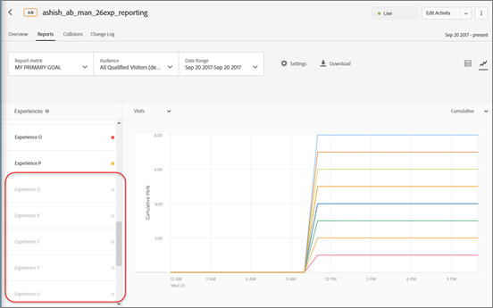

# Paramètres des rapports

Informations pour vous aider à définir les éléments que vous souhaitez afficher dans votre rapport dans [!DNL Adobe Target]. Les paramètres des rapports peuvent être enregistrés en vue d’une utilisation ultérieure.

Pour afficher un rapport :

1. Cliquez sur **[!UICONTROL Activités]**, puis sélectionnez l’activité souhaitée dans la liste.
1. Cliquez sur l’onglet **[!UICONTROL Rapports]**.

   

## Paramètre prédéfini Target {#section_51F67341465045BEB4F1A2FB638A8EB1}

Vous pouvez enregistrer jusqu’à dix paramètres prédéfinis différents du rapport d’une activité spécifique après l’avoir configuré selon vos souhaits (mesures, plages de dates, audiences, paramètres avancés, etc.). Tous [!DNL Target] les utilisateurs peuvent afficher, modifier et supprimer les différents paramètres prédéfinis, quelle que soit la personne qui les a créés.

Vous pouvez également configurer le rapport d’une activité spécifique selon vos souhaits puis enregistrer cette configuration comme votre paramètre prédéfini par défaut/favori. Voici la vue qui s’affiche chaque fois que vous affichez par la suite le rapport de cette activité.

### Création d’un paramètre prédéfini ou d’un paramètre prédéfini par défaut

1. Configurez le rapport de l’activité selon vos besoins.

   Les paramètres disponibles, notamment les mesures, les périodes, les audiences, les paramètres avancés, etc., sont expliqués ci-dessous.

1. Cliquez sur l’icône représentant trois points alignés verticalement > **[!UICONTROL Enregistrer comme nouveau]**, à côté de **[!UICONTROL Paramètre prédéfini Target]**.

   

   La boîte de dialogue Nouveau paramètre prédéfini s’affiche :

   

1. Consultez les informations de la section **[!UICONTROL Filtres]** et **[!UICONTROL Paramètres]** pour vous assurer que le rapport est configuré comme vous le souhaitez, puis spécifiez la variable **[!UICONTROL Nom du paramètre prédéfini]** (jusqu’à 50 caractères).
1. (Conditionnel) Si vous souhaitez que ce rapport soit votre vue de rapport par défaut/favorite, faites glisser la **[!UICONTROL Définir comme paramètre prédéfini par défaut]** bascule vers la position Activé.
1. Cliquez sur **[!UICONTROL Enregistrer]**.

### Sélectionner un autre paramètre prédéfini

Sélectionnez le paramètre prédéfini voulu dans la liste déroulante **[!UICONTROL Paramètre prédéfini Target]**.

### Modification d’un paramètre prédéfini

1. Sélectionnez le paramètre prédéfini à modifier.
1. Modifiez la configuration du rapport comme vous le souhaitez (mesures, plages de dates, audiences, paramètres avancés, etc.).

   Lorsque vous cliquez sur [!UICONTROL Enregistrer] après avoir modifié la configuration du rapport, un astérisque ( * ) s’affiche après le nom du paramètre prédéfini pour indiquer que le paramètre prédéfini a changé, comme illustré ci-dessous :

   

1. Cliquez sur l’icône représentant trois points alignés verticalement > **[!UICONTROL Enregistrer comme nouveau]** pour créer un nouveau paramètre prédéfini.

   Ou

   Cliquez sur l’icône représentant trois points alignés verticalement > **[!UICONTROL Mettre à jour]**, pour mettre à jour le paramètre prédéfini actuel.

   

### Suppression d’un paramètre prédéfini

1. Sélectionnez le paramètre prédéfini à supprimer.
1. Cliquez sur l’icône représentant trois points alignés verticalement > **[!UICONTROL Supprimer]**.

   

1. Cliquez sur **[!UICONTROL Supprimer]** pour confirmer votre suppression (les paramètres prédéfinis supprimés ne peuvent pas être récupérés).

### Gestion des erreurs de paramètre prédéfini

Les alertes et les messages figurant dans les rapports vous permettent de savoir si un paramètre prédéfini n’est plus valide. L’alerte ou le message vous indique de choisir une audience, une mesure, un groupe d’hôtes ou une expérience différents pour rendre un paramètre prédéfini valide.

La liste suivante décrit certaines des situations dans lesquelles un paramètre prédéfini est susceptible de ne plus être valide :

* Une audience de rapport a été supprimée de l’activité mais est référencée dans la définition de paramètre prédéfini.
* Une ou plusieurs mesures ont été supprimées mais sont référencées dans la définition de paramètre prédéfini. Par exemple, vous pouvez supprimer une ou plusieurs mesures de l’activité, puis ajouter de nouvelles mesures.
* Un ou plusieurs groupes d’hôtes (environnement) n’existent pas mais sont référencés dans la définition de paramètre prédéfini.
* Une ou plusieurs expériences ont été supprimées après la création du paramètre prédéfini, mais sont référencées dans la définition de paramètre prédéfini.
* Un paramètre prédéfini n’est sémantiquement pas valide, car les entités référencées existent encore mais ont été mises à jour de manière telle que la définition de paramètre prédéfini a sémantiquement changé. Par exemple, supposons que vous créez un paramètre prédéfini nommé « Revenu sur Chrome ». Vous mettez par la suite l’activité à jour pour mesurer la mesure Conversion au lieu de Revenu. Cette mise à jour de la définition de l’activité invalide sémantiquement la définition de paramètre prédéfini.

## Mesure du rapport {#section_894ABD7148244806B7CE556EBBA2AD62}

Cliquez sur la liste déroulante **[!UICONTROL Mesure du rapport]** afin de sélectionner une autre [mesure de succès](/help/main/c-activities/r-success-metrics/success-metrics.md#reference_D011575C85DA48E989A244593D9B9924) ou plusieurs mesures à afficher dans le graphique et le tableau.

Par défaut, la mesure principale est définie dans la configuration des mesures de succès lors de la création de l’activité. Si vous modifiez la configuration et que vous réenregistrez l’activité, la mesure principale des rapports est mise à jour.

Pour plus d’informations sur la sélection de plusieurs mesures à afficher dans les rapports, voir [Affichage de plusieurs mesures dans un rapport](/help/main/c-reports/c-report-settings/view-multiple-metrics.md#concept_9E3C3F6F3EC1412FAF252975AC0720B7).

## Public {#section_70926EB4618945D9AFF2B0564FF3717B}

Cliquez sur la liste déroulante [!UICONTROL Audience] afin de modifier l’audience affichée pour le rapport.

Pour plus d’informations, consultez la page [Audiences](/help/main/c-target/target.md#concept_A782F8481A5041EBA75103CB26376522).

## Période {#section_A410A768403C4E01891F95CB357E63ED}

La zone Période affiche la période actuelle du rapport. Cliquez sur l’icône déroulante pour afficher un calendrier vous permettant de changer la période du rapport.

Sélectionnez de nouvelles dates de **[!UICONTROL Début]** et de **[!UICONTROL Fin]** pour le rapport. Vous pouvez également utiliser la variable **[!UICONTROL À partir du début de l’activité]** et **[!UICONTROL Jusqu’à la fin de l’activité]** des cases à cocher.

Cliquez sur **[!UICONTROL Dates personnalisées]** pour sélectionner des plages de dates prédéfinies : 7 derniers jours, 15 derniers jours ou 30 derniers jours. Ces périodes prédéfinies sont des périodes flottantes. Si la date de début est inférieure au nombre de jours choisi, le calendrier affichera la période disponible à partir de la date de début, mais décalera d’un jour dès que la date de début sera antérieure au nombre de jours choisi à mesure que la durée de l’activité augmente.

Les rapports comportent les restrictions de date suivantes :

* La date de début du rapport doit être comprise dans les deux dernières années.
* Les rapports de groupe d’offres sont limités à 99 jours à compter d’aujourd’hui.
* Les rapports par heure sont limités à 15 jours.

## Paramètres {#section_D99CE462107D45CABE0960F820E1E972}

Pour configurer les paramètres des rapports :

1. Cliquez sur l’icône d’engrenage, apportez les modifications souhaitées (comme expliqué ci-dessous).
1. Cliquez ensuite sur **[!UICONTROL Enregistrer]**.

L’illustration ci-après présente la boîte de dialogue Paramètres pour une activité A/B :

Les options varient en fonction du type d’activité sélectionné :

### Méthodologie de calcul

Choisissez la méthodologie souhaitée :

* Visiteurs
* Visites
* Impressions d’activité

### Contrôle

Sélectionnez l’expérience de contrôle à utiliser lors du calcul et de la comparaison de l’effet élévateur.

### Environnement

Sélectionnez l’environnement (groupe d’hôtes) à utiliser pour le rapport. Pour plus d’informations, voir [Hôtes](/help/main/administrating-target/hosts.md#concept_516BB01EBFBD4449AB03940D31AEB66E).

### Réinitialisation des données du rapport

Réinitialisez les données de rapport pour supprimer les anciennes données. Les visiteurs actuels restent dans l’activité. Cette option n’est disponible que pour les personnes qui disposent de [!UICONTROL Approbateur] autorisations.

>[!IMPORTANT]
>
>Cette opération est définitive et ne peut pas être annulée.

### Exclusion des valeurs extrêmes

Le [!UICONTROL Exclusion des valeurs extrêmes] La bascule s’applique uniquement aux activités avec les mesures de types Recettes et Engagement. Pour plus d’informations, voir [Exclusion des commandes extrêmes](/help/main/c-reports/c-report-settings/excluding-extreme-orders.md#task_2AE7743FFCDD466DAEEB720BE5F33DAA).

## Télécharger {#section_77E65C50BAAF4AB79242DB3A8778ADEF}

Cliquez sur le bouton **[!UICONTROL Télécharger]** pour télécharger les données d’un rapport dans une [!DNL .csv] format pour une importation rapide dans Excel, Access ou d’autres programmes d’analyse des données.

Pour plus d’informations, voir [Téléchargement de données au format CSV](/help/main/c-reports/downloading-data-in-csv-file.md#concept_3F276FF2BBB2499388F97451D6DE2E75).

## Actualiser {#section_E203729F2F314DF3856D2EE67C60B370}

Cliquez sur le bouton **[!UICONTROL Actualiser]** pour actualiser la vue tabulaire et graphique d’un rapport sans actualiser la page entière, sa configuration ou sa période.

## Autres options {#section_AB1B5C695D7045A0A0AC0E2698D2E7DE}

Cliquez sur l’icône Plus d’options (trois points alignés verticalement) pour accéder aux options [!UICONTROL Modifier l’activité] et [!UICONTROL Afficher les URL d’expérience].

## Options d’affichage

Vous pouvez visualiser le rapport dans différents formats en fonction du type d&#39;activité. Sélectionnez une option.

* **Vue Tableau**: Cliquez sur le bouton **[!UICONTROL Vue Tableau]** pour afficher le rapport sous la forme d’un tableau.
* **Vue graphique**: Cliquez sur le bouton **[!UICONTROL Vue graphique]** pour afficher le rapport sous la forme d’un graphique.
* **Segments automatisés**: (disponible uniquement pour les activités Automated Personalization (AP) et de ciblage automatique (AT).) Cliquez sur le **[!UICONTROL Segments automatisés] pour afficher la [Rapport Segments automatisés](/help/main/c-reports/c-personalization-insights-reports/automated-segments-report.md).
* **Attributs importants**: (Disponible uniquement pour les activités Automated Personalization (AP) et de ciblage automatique (AT).) Cliquez sur le **[!UICONTROL Attributs importants] pour afficher la [Rapport Attributs importants](/help/main/c-reports/c-personalization-insights-reports/important-attributes-report.md).

## Effet élévateur moyen, limites de l’effet élévateur et intervalle de confiance {#section_0D87615B1D3344B3858BA494EEBC16FB}

Les rapports comprennent plusieurs points de données et représentations de visualisation qui vous aident à comprendre les limites de l’effet élévateur et le degré de confiance associé à votre activité. Vous pouvez ainsi déterminer plus précisément un gagnant.

Pour plus d’informations, voir [Effet élévateur moyen, limites de l’effet élévateur et intervalle de confiance](/help/main/c-reports/c-report-settings/average-lift-bounds-and-confidence-interval.md#topic_AFFDC672A8A34D028B100EF6BE5D8129).

Tenez compte des points suivants :

* Disponible uniquement dans les rapports en vue Tableau.
* Cette fonctionnalité n’est pas disponible pour les activités utilisant [Analytics comme source de rapports (A4T)](/help/main/c-integrating-target-with-mac/a4t/a4t.md).

## Contribution des emplacements {#section_5832F126AC114AE1ABFFF4D9B904393B}

Cliquez sur l’icône **[!UICONTROL Contribution des emplacements]** pour que le rapport affiche la contribution par emplacement.

## Expériences {#section_3A450DE1FA7E43F0AAB73165EC3D1C34}

(option disponible seulement dans le rapport en vue graphique)

Sélectionnez ou désélectionnez des expériences à gauche du tableau pour afficher ou masquer les expériences correspondantes dans le tableau.

Dans l’illustration suivante, seules les expériences Défaut, Moyen-Orient et Total s’affichent dans le rapport : L’expérience Asie est masquée dans le graphique.

## Moyenne cumulée {#section_59066693158C4433B87D07402C2BC6CD}

(option disponible seulement dans le rapport en vue graphique)

&quot;Moyenne cumulée&quot; reflète les conversions cumulées (du début de la fenêtre de création de rapports à la date représentée sur le graphique) divisées par les visiteurs cumulés.

Sélectionnez la vue graphique souhaitée :

* Moyenne cumulée
* Effet élévateur moyen cumulé
* Quotidien
* Effet élévateur quotidien

Le nom de cette liste déroulante varie en fonction de la vue sélectionnée, mais il s’agira de l’une des vues répertoriées ci-dessus.

## Méthodologie de calcul {#section_01B0ED5665C74AE1AE97259800190C3E}

(option disponible seulement dans le rapport en vue graphique)

Vous pouvez choisir la méthodologie de calcul pour les graphiques des rapports. Notez que cela n’est pas pris en charge pour [!UICONTROL Automated Personalization] (AP).

Pour accéder au [!UICONTROL Méthodologie de calcul] lors de l’affichage d’un rapport en mode graphique, cliquez sur l’option **[!UICONTROL Mon Principal objectif]** , puis sélectionnez la méthodologie de comptage.

La méthodologie de calcul sera la même que celle sélectionnée dans la boîte de dialogue [!UICONTROL Paramètres] et décrite ci-dessus.

Par défaut, le graphique est tracé en mode [!UICONTROL Quotidien].

Vous pouvez modifier le mode en cliquant sur le bouton [!UICONTROL Quotidien] , puis en sélectionnant une option cumulative.

>[!NOTE]
>
>Le nom de cette liste déroulante varie en fonction du mode sélectionné.

Il existe quatre modes pour les activités de ciblage automatique : Contrôle quotidien, Quotidien ciblé, Contrôle du cumul et Cumul ciblé.

L’ordre par défaut dans lequel le graphique est tracé est le suivant :

* **Tests A/B (y compris l’affectation automatique et Automated Personalization)**: Ordre de création de l’expérience, dans l’ordre décroissant.
* **Ciblage d’expérience (XT)**: Ordre des expériences dans l’activité.
* **Test multivarié (MVT)**: Alphabétique par nom d’expérience.
* **Recommendations**: Ordre de création de l’expérience, dans l’ordre décroissant.

Lorsque vous utilisez les options de la méthodologie de calcul, prenez en compte les avertissements suivants :

* Pour [Activités de ciblage automatique](/help/main/c-activities/auto-target/auto-target-to-optimize.md), il n’existe aucune option pour sélectionner &quot;Visiteurs&quot; comme méthodologie de comptage. Le ciblage automatique est le seul type d’activité que vous ne pouvez pas représenter sous forme de graphique par visiteur.
* Pour les activités qui utilisent [Analytics comme source des rapports (A4T)](/help/main/c-integrating-target-with-mac/a4t/a4t.md), vous ne pouvez pas tracer de manière cumulée Visiteur, Visite ou Impression.

## Utilisation de graphiques comportant plus de 16 expériences dans l’activité

Si une activité comporte moins de 16 expériences, chaque expérience est tracée dans une couleur différente dans le graphique.

Si une activité comporte plus de 16 expériences, les lignes colorées pour les 16 premières expériences s’affichent dans le graphique. Les expériences restantes sont grisées dans le volet Expériences de gauche et aucune ligne correspondante ne s’affiche dans le graphique. Les lignes pour les 16 premières expériences peuvent être affichées à tout moment.

Si vous passez la souris sur une des expériences grisées, une nouvelle ligne grise correspondant à cette expérience s’affiche temporairement dans le graphique. Pour afficher la ligne d’une expérience grisée en couleur, vous pouvez désélectionner une expérience affichée en couleur en cliquant sur son nom, puis sélectionner l’expérience grisée souhaitée en cliquant sur son nom.

À titre d’exemple, l’illustration suivante montre le graphique d’une activité comportant 26 expériences :

Le graphique affiche les lignes pour les 16 premières expériences (on constate quelques chevauchements qui font croire qu’il y a moins de 16 lignes). Le point coloré du volet Expériences de gauche en regard du nom de chaque expérience indique que la ligne de l’expérience s’affiche dans la couleur correspondante.

Si vous faites défiler le volet Expériences vers le bas, vous remarquerez que le nom des expériences 17 à 26 est grisé, comme illustré ci-dessous :

Si vous passez la souris sur l’une des expériences grisées, une nouvelle ligne grise correspondant à cette expérience s’affiche temporairement dans le graphique.

Supposons que vous vouliez afficher la ligne pour l’Experience R et que vous ne vouliez pas afficher la ligne pour l’Experience P. Vous pouvez cliquer sur le nom de l’Experience P pour la désélectionner, puis cliquer sur le nom de l’Experience R pour la sélectionner, comme illustré ci-dessous :

