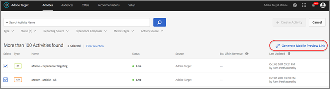

# Aperçu de Target Mobile

Utilisez le lien d’aperçu mobile pour vérifier simplement et de manière exhaustive la qualité des activités des applications mobiles et prenez part à différentes expériences directement sur votre appareil, sans avoir à utiliser de dispositif de test spécifique.

>[!NOTE]
>
>La fonctionnalité d’aperçu mobile requiert de télécharger et d’installer la version appropriée 4.14 (ou ultérieure) du SDK Adobe Mobile.

## Aperçu {#section_981D6FA4AEE64098809EA606E89E4A5E}

La fonctionnalité d’aperçu mobile vous permet de tester entièrement vos activités d’applications mobiles avant de les mettre en service.

## Conditions préalables {#section_A763C564C9E84B0EB448237B5B1E4068}

1. **Utilisez une version prise en charge du SDK :** la fonction d’aperçu mobile requiert de télécharger et d’installer la version appropriée 4.14 (ou ultérieure) du SDK Adobe Mobile dans vos applications correspondantes.

   Pour savoir comment télécharger le SDK approprié, voir :

   * **iOS :** [Avant de commencer](https://experienceleague.adobe.com/docs/mobile-services/ios/getting-started-ios/requirements.html) dans le *Aide d’iOS pour Mobile Services*.
   * **Android :** [Avant de commencer](https://experienceleague.adobe.com/docs/mobile-services/android/getting-started-android/requirements.html) dans le *Aide sur Mobile Services Android*.

1. **Configurez un modèle d’URL :** le lien d’aperçu utilise un modèle d’URL pour ouvrir votre application. Vous devez spécifiez un modèle d’URL unique pour l’aperçu.

   L’illustration suivante présente un exemple sous iOS :

   

   L’illustration suivante présente un exemple sous Android :

   

1. **Suivez les liens profonds Adobe.**

   **iOS :** dans l’AppDelegate, appelez `[ADBMobile trackAdobeDeepLink:url` lorsque le délégué est invité à ouvrir la ressource avec le modèle d’URL spécifié à l’étape précédente.

   Le fragment de code suivant est un exemple :

   ```javascript
   - (BOOL) application:(UIApplication *)app openURL:(NSURL *)url 
                options:(NSDictionary<NSString *,id> *)options { 
   
       if ([[url scheme] isEqualToString:@"com.adobe.targetmobile"]) { 
           [ADBMobile trackAdobeDeepLink:url]; 
           return YES; 
       } 
       return NO; 
   } 
   ```

   **Android :** dans l’application, appelez `Config.trackAdobeDeepLink(URL);` lorsque l’appelant est invité à ouvrir la ressource avec le modèle d’URL spécifié à l’étape précédente.

   ```javascript
    private Boolean shouldOpenDeeplinkUrl() { 
        Intent appLinkIntent = getIntent(); 
        String appLinkAction = appLinkIntent.getAction(); 
        Uri appLinkData = appLinkIntent.getData; 
        if (appLinkData.toString().startsWith("com.adobe.targetmobile")) { 
            Config.trackAdobeDeepLink(appLinkData); 
            return true; 
        } 
        return false; 
     }
   ```

   Pour que l’aperçu mobile fonctionne pour Android, vous devez également ajouter le fragment de code suivant dans [!DNL AndroidManifest.xml] si vous utilisez la version 5 du SDK Mobile Adobe :

   ```javascript
   <activity android:name="com.adobe.marketing.mobile.FullscreenMessageActivity" />
   ```

   Si vous utilisez la version 4 du SDK Mobile Adobe, utilisez le fragment de code suivant :

   ```javascript
   <activity android:name="com.adobe.mobile.MessageFullScreenActivity" />
   ```

## Génération d’un lien d’aperçu {#section_D9D58173FFF34E9BB75EBF357273F128}

1. Dans l’interface utilisateur de Target, cliquez sur l’icône **[!UICONTROL Plus d’options]** (trois points alignés verticalement), puis sélectionnez **[!UICONTROL Créer l’aperçu mobile]**.

   

1. Sélectionnez les activités dont vous voulez afficher l’aperçu, puis cliquez sur **[!UICONTROL Générer le lien d’aperçu mobile]**.

   >[!NOTE]
   >
   >Seules les activités AB et XT basées sur les formulaires peuvent être sélectionnées.

   

1. Spécifiez le modèle d’URL de votre application.

   Il doit être identique à celui présent dans votre application iOS ou Android. Au besoin, répétez ce processus séparément pour iOS et Android.

   

1. Cliquez sur **[!UICONTROL Générer un lien d’aperçu mobile]**, puis copiez le lien.

   

## Afficher l’aperçu sur votre appareil {#section_521F0D46F3DE4A2A98283A1B73FF69F6}

Ouvrez le lien dans un navigateur mobile sur l’appareil sur lequel vous avez installé votre application. Il peut s’agir de l’application de production que vous avez téléchargée de la boutique Apple App Store ou Google Play. Pas besoin d’une version spéciale. Si vous avez un lien d’aperçu actif, vous pourrez afficher les expériences sur l’appareil.

1. Ouvrez le lien dans votre navigateur mobile.

   Partagez le lien que vous avez copié à l’étape précédente depuis l’interface utilisateur de Target vers votre appareil mobile par SMS, e-mail ou via Slack.

   |||

   Votre application s’ouvre et lance le mode d’aperçu de Target Mobile.

1. Sélectionnez la combinaison d’expériences que vous souhaitez afficher, puis cliquez sur **[!UICONTROL Démarrer les expériences]**.

   ||||
||||

## Limites  {#section_4E9BDED0F718485292527EFB508305BD}

* Après avoir cliqué sur le bouton [!UICONTROL Démarrer les expériences], la vue doit charger à nouveau pour afficher le nouveau contenu. Le moyen le plus simple est de basculer vers un autre écran et de revenir ensuite dans l’écran où la modification doit avoir lieu.
* L’aperçu mobile n’est pas pris en charge pour les versions Android antérieures à API-19 (KitKat).
