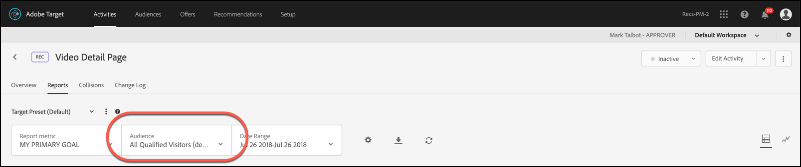

# Application d’une audience de rapport à une mesure de succès

Choisissez une mesure de succès qui qualifie l’utilisateur pour l’audience de rapport dans [!DNL Adobe Target].

Pour toutes les activités, la liste déroulante [!UICONTROL Applied At] vous permet d’appliquer une audience à une mesure de succès, ce qui vous permet d’afficher les numéros de rapport une fois la mesure atteinte et pour les actions suivantes.

Imaginons, par exemple, que vous avez créé une activité pour tous les visiteurs qui entrent sur votre page d’accueil et qui accèdent ensuite à la page de conversion, mais que vous voulez également analyser plus en détails les visiteurs qui ont ajouté dans leur panier des produits pour un montant supérieur à 50 USD avant la conversion.

La liste déroulante [!UICONTROL Applied At] peut comporter trois catégories :

* Tout visiteur ou visiteuse de l’activité
* Seuls les visiteurs qui atteignent une certaine étape de l’activité
* Uniquement les visiteurs qui atteignent la conversion

Autrement dit, vous pouvez spécifier qu’un visiteur doit avoir atteint une mbox sur la page d’entrée de l’activité, une mbox qui définit un point donné au cours de l’activité, ou encore la mbox de conversion à la fin de l’activité.

>[!NOTE]
>
>[Les mesures de succès](/help/main/c-activities/r-success-metrics/success-metrics.md#reference_D011575C85DA48E989A244593D9B9924) sont disponibles uniquement si vous les avez configurées pour votre activité. Si vous n’avez pas défini de mesures de succès, vous ne verrez que deux options dans la liste déroulante : [!UICONTROL Campaign Entry] et [!UICONTROL Conversion].

## Considérations

Prenez en compte les points suivants lorsque vous appliquez une audience de rapport à une mesure de succès :

* Seules les mesures de succès commençant par celle à laquelle l’audience est appliquée affichent les données de rapports segmentées par l’audience
* Les mesures de succès précédant celles auxquelles l’audience est appliquée ne seront pas segmentées par l’audience et afficheront toutes les données du visiteur
* Les mesures sont considérées en fonction de leur ordre dans la définition d’activité, la [!UICONTROL Primary Goal] étant la dernière.

## Afficher la segmentation dans les rapports

Pour afficher la segmentation dans les rapports, sélectionnez l’audience souhaitée dans la liste déroulante [!UICONTROL Audience] du rapport de l’activité.

## Exemple

Prenons l’exemple d’une activité qui a la mesure de succès 1, la mesure de succès 2, la mesure de succès 3 et l’objectif du Principal.

Supposons que l’Audience1 de création de rapports soit définie sur « Entrée » et que l’Audience2 de création de rapports soit définie sur la Mesure de succès 2. Les audiences filtreront les données de rapport comme suit :

|  | Visiteurs | Mesure De Succès 1 | Mesure de succès 2 | Mesure De Succès 3 | Objectif du Principal |
| --- | --- | --- | --- | --- | --- |
| Audience1 | Appliqué | Appliqué | Appliqué | Appliqué | Appliqué |
| Audience2 | Non appliqué | Non appliqué | Appliqué | Appliqué | Appliqué |
