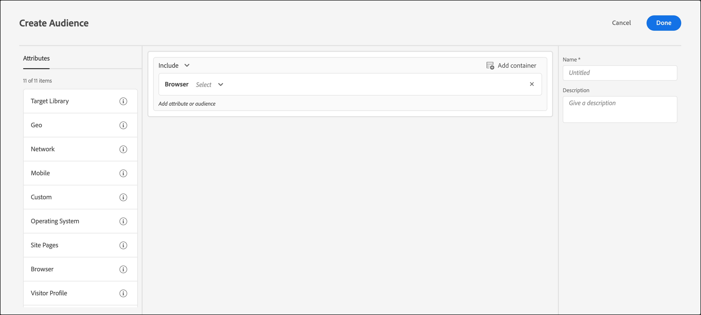
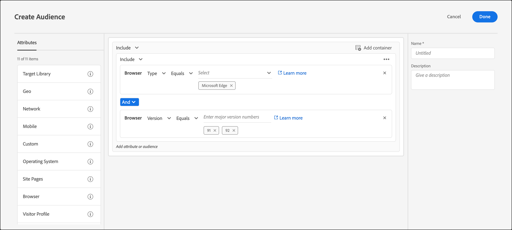

# [!UICONTROL Navigateur]

Vous pouvez cibler les visiteurs qui utilisent un navigateur spécifique ou des options de navigateur spécifiques lors de l’accès à votre page.

Les navigateurs suivants peuvent être ciblés :

* [!UICONTROL Chrome]
* [!UICONTROL Firefox]
* [!UICONTROL Safari]
* [!UICONTROL Internet Explorer]
* 
* [!UICONTROL Opéra]
* [!DNL iPad]
* [!DNL iPhone]

>[!IMPORTANT]
>
>À compter de la version [!DNL Target] Standard/Premium 24.3.1 (4-6 mars 2024), les audiences intégrées créées à l’aide de l’interface utilisateur de Target, telles que `Browser:iPad` et `Browser:iPhone`, ont été mises à jour afin d’effectuer le ciblage approprié pour les [!DNL iPad] et les [!DNL iPhone] utilisant `profile.mobile.deviceVendor`, `profile.mobile.isMobilePhone` et `profile.mobile.isTablet`.
>
>Cette mise à jour ne nécessite aucune action du côté de la clientèle. Les libellés de l’interface utilisateur de [!DNL Target] seront modifiés à l’avenir et seront annoncés dans les notes de mise à jour [[!DNL Target]  (actualisées)](/help/main/r-release-notes/release-notes.md) lorsque ces modifications seront effectuées.
>
>Pour les paramètres de solution, voir [Mises à jour pour [!DNL iPad] et [!DNL iPhone] dans [!UICONTROL Navigateur] les attributs d’audience (30 avril 2024)](#updates) ci-dessous.

Il existe deux façons de cibler les navigateurs :

* **Audience prédéfinie :** Utilisez l’audience prédéfinie si vous souhaitez cibler uniquement les visiteurs qui utilisent un navigateur spécifique pour accéder à votre site. Par exemple, si vous proposez une extension [!DNL Chrome], vous ne ciblez que les utilisateurs [!DNL Chrome].

   1. Lors de la configuration de votre activité, sélectionnez le navigateur dans la liste déroulante.

      Cette option cible l’activité uniquement pour les visiteurs qui utilisent le navigateur spécifié.

      

* **Règle d’audience de navigateur personnalisée :** une audience personnalisée permet de cibler plusieurs navigateurs ou de configurer des règles ou des exclusions pour des navigateurs spécifiques, des versions de navigateur ou des langues de navigateur. Cette fonctionnalité offre une grande flexibilité lors du ciblage d’une activité en fonction des attributs du navigateur.

   1. Dans l’interface [!DNL Target], cliquez sur **[!UICONTROL Audiences]** > **[!UICONTROL Créer une audience]**.
   1. Nommez l’audience et ajoutez une description facultative.
   1. Effectuez un glisser-déposer de **[!UICONTROL Navigateur]** dans le Créateur d’audience.

      

   1. Cliquez sur **[!UICONTROL Sélectionner]**, puis sélectionnez l’une des options suivantes :

      * **Type :** cibler ou exclure un navigateur spécifique. Voir [Type](/help/main/c-target/c-audiences/c-target-rules/browser.md#section_6ADC758F23F145B3A310151546D83D56).
      * **Langue :** cibler ou exclure certains navigateurs configurés pour utiliser des langues spécifiques. Voir [Langue](/help/main/c-target/c-audiences/c-target-rules/browser.md#section_7520D1AA464A45A6843EABE2D2B431A1).
      * **Version :** cibler ou exclure certaines versions de navigateur. Voir [Version](/help/main/c-target/c-audiences/c-target-rules/browser.md#section_37CC8CE45DA04E8682AE6388321BA6EF).

   1. (Facultatif) Configurez des règles supplémentaires pour l’audience.
   1. Cliquez sur **[!UICONTROL Done]** (Terminé).

  L’exemple suivant illustre une audience qui comprend des utilisateurs [!DNL Microsoft Edge] des versions 91 ou 92 :

  

## Options du navigateur {#concept_221D8EEF53CC45AEACEB17CF336A3658}

Ciblez ou excluez des participants aux activités en fonction du type, de la langue ou de la version de leur navigateur.

### Type {#section_6ADC758F23F145B3A310151546D83D56}

Ciblez ou excluez un navigateur spécifique.

Sélectionnez **[!UICONTROL Type]**, puis choisissez « est égal à » ou « n’est pas égal à ».

* [!UICONTROL Est égal à ] : ciblez les navigateurs sélectionnés.
* [!UICONTROL N’est pas égal à ] : excluez les navigateurs sélectionnés.

Sélectionnez un ou plusieurs navigateurs. De nombreuses options sont connectées avec un OU.

### Langue {#section_7520D1AA464A45A6843EABE2D2B431A1}

Ciblez ou excluez certains navigateurs configurés pour utiliser des langues spécifiques.

Par exemple, si une offre n’est disponible qu’en anglais, vous pouvez cibler les navigateurs dont la langue définie est l’anglais. Sinon, si votre page n’est pas compatible avec le format double octet, vous pouvez exclure les navigateurs utilisant les langues d’Asie de l’Est.

L’inclusion ou l’exclusion d’une langue de navigateur peut fournir un ciblage des visiteurs plus précis que le ciblage basé sur la géographie dans les cas où la langue est plus importante que l’emplacement. Par exemple, si vous proposez un article écrit en anglais, vous pouvez soit cibler les pays anglophones, soit cibler les navigateurs dont la langue définie est l’anglais. Le ciblage du navigateur permet aux anglophones vivant dans un pays dont l’anglais n’est pas la langue première de consulter l’article.

Sélectionnez **[!UICONTROL Langue]**, puis choisissez « est égal à » ou « n’est pas égal à ».

* [!UICONTROL Est égal à ] : ciblez les langues de navigateur sélectionnées.
* [!UICONTROL N’est pas égal à ] : excluez les langues de navigateur sélectionnées.

Sélectionnez une ou plusieurs langues. De nombreuses options sont connectées avec un OU.

Les langues de navigateur suivantes peuvent être ciblées ou exclues :

* Anglais
* Français
* Allemand
* Japonais
* Coréen
* Portugais
* Russe
* Espagnol
* Chinois traditionnel

### Version {#section_37CC8CE45DA04E8682AE6388321BA6EF}

Ciblez ou excluez certaines versions de navigateur.

Par exemple, si votre page n’apparaît pas correctement dans [!DNL Internet Explorer] version 11 ou antérieure, vous pouvez créer une audience qui exclut ces versions. Dans ce cas, vous devez configurer une règle dans laquelle le type de navigateur est égal à [!DNL Internet Explorer] et ajouter une deuxième règle dans laquelle la version est inférieure ou égale à 11.

Sélectionnez **[!UICONTROL Version]**, puis choisissez un opérateur :

* [!UICONTROL Est égal]
* [!UICONTROL Est différent de]
* [!UICONTROL Est supérieur à]
* Est supérieur ou égal à
* [!UICONTROL Est inférieur à]
* [!UICONTROL Est inférieur ou égal à]

Saisissez le numéro de version. Seules les versions majeures peuvent être saisies dans le champ de texte. La version spécifiée comprend toutes les versions mineures qui lui sont associées. Par exemple, si vous spécifiez la version 10, les visiteurs de la version 10.1 sont également inclus.

De nombreuses options sont connectées avec un OU.

## Vidéo de formation : création d’audiences 

Cette vidéo fournit des informations sur l’utilisation des catégories d’audiences.

* Créer des audiences
* Définir des catégories d’audiences

>[!VIDEO](https://video.tv.adobe.com/v/17392)

## Mises à jour pour [!DNL iPad] et [!DNL iPhone] dans les attributs d’audience [!UICONTROL navigateur] (30 avril 2024) {#updates}

[!DNL Adobe Target] vous permet de [cibler sur l’un des attributs de catégorie](/help/main/c-target/c-audiences/c-target-rules/target-rules.md), y compris les utilisateurs qui utilisent un navigateur spécifique ou des options de navigateur lorsqu’ils visitent votre page.

À partir de la version [!DNL Target] Standard/Premium 24.3.1 (4-6 mars 2024), les audiences intégrées créées à l’aide de l’interface utilisateur de Target, telles que `Browser:iPad` et `Browser:iPhone`, ont été mises à jour afin d’effectuer un ciblage approprié pour les [!DNL iPad] et les [!DNL iPhone] utilisant `profile.mobile.deviceVendor`, `profile.mobile.isMobilePhone` et `profile.mobile.isTablet`.

Les audiences intégrées créées à l’aide de l’interface utilisateur de [!DNL Target], telles que `Browser:iPad` et `Browser:iPhone`, seront automatiquement déplacées vers la nouvelle définition d’audience et ne nécessitent aucune action de la part des clients. Toutefois, vous devez à l’avenir utiliser les paramètres [décrits ci-dessous](#ui).

Si vous utilisez `user.browserType` dans des scripts de profil pour vérifier s’il s’agit d’un [!DNL iPhone] ou d’un [!DNL iPad] (par exemple, `user.browserType == 'iphone'` ou `user.browserType != 'ipad'`), ces scripts de profil doivent être modifiés comme [indiqué ci-dessous](#profile-scripts) avant le 30 avril 2024 afin de vous assurer que ces audiences continuent de fonctionner comme prévu.

Les audiences JavaScript sont des audiences héritées utilisant des expressions [!DNL Target] qui ont été abandonnées avec l’interface utilisateur de [!DNL Target Classic]. Ces audiences peuvent uniquement être modifiées via l’API. Les clients ne doivent mettre à jour ces audiences que s’ils continuent à utiliser les audiences héritées dans les activités .

### Audiences créées à l’aide de l’interface utilisateur [!DNL Target] {#ui}

Les paramètres suivants pourraient être utilisés à l’avenir :

* **Pour les correspondances de navigateur[!DNL Apple]** : [!UICONTROL Mobile] > [!UICONTROL Fournisseur de l’appareil] [!UICONTROL correspond] [!DNL Apple]

  

* **Pour que le navigateur corresponde à la tablette** : [!UICONTROL Mobile] > [!UICONTROL est Tablette] > [!UICONTROL true]

  

* **Pour les correspondances de navigateur avec iPad** : [!UICONTROL Mobile] > [!UICONTROL Nom marketing de l’appareil] [!UICONTROL correspond] [!DNL iPad] avec un conteneur Et avec [!UICONTROL Mobile] > [!UICONTROL Is Tablet] est [!DNL true]

  

* **Pour les correspondances de navigateur avec iPhone** : [!UICONTROL Mobile] > [!UICONTROL Nom marketing de l’appareil] [!UICONTROL correspond] [!DNL iPhone] avec un conteneur Et avec [!UICONTROL Mobile] > [!UICONTROL Est le téléphone mobile] est [!DNL true]

  

De nombreux autres paramètres peuvent être utilisés, par exemple lorsque des conditions sont annulées. Voici des exemples de conditions annulées :

* **Le navigateur ne correspond pas à iPhone** : [!UICONTROL Mobile] > [!UICONTROL Fournisseur de l’appareil] [!UICONTROL ne correspond pas] [!UICONTROL Apple] avec un conteneur OR avec [!UICONTROL Mobile] > [!UICONTROL Is Mobile Phone] is [!UICONTROL false]

  

* **Le navigateur ne correspond pas à iPad** : [!UICONTROL Mobile] > [!UICONTROL Fournisseur de l’appareil] [!UICONTROL ne correspond pas] [!UICONTROL Apple] avec un conteneur OR avec [!UICONTROL Mobile] > [!UICONTROL Is Tablet] is [!UICONTROL false].

  

### Audiences créées à l’aide de scripts de profil {#profile-scripts}

Si vous utilisez `user.browserType` dans les audiences [!DNL Target Classic] héritées ou dans les scripts de profil, les modifications doivent inclure les éléments suivants :

* **BrowserType est iPhone** :

  Remplacer :

  `user.browserType=="iphone"`

  Avec :

  `profile.mobile.deviceVendor == "Apple" && profile.mobile.isMobilePhone`

* **BrowserType n’est pas iPhone** :

  Remplacer :

  `user.browserType!="iphone"`

  Avec :

  `profile.mobile.deviceVendor != "Apple" || !profile.mobile.isMobilePhone`

* **BrowserType est iPad** :

  Remplacer :

  `user.browserType=="ipad"`

  Avec :

  `profile.mobile.deviceVendor == "Apple" && profile.mobile.isTablet`

* **BrowserType n’est pas iPad** :

  Remplacer :

  `user.browserType!="ipad"`

  Avec :

  `profile.mobile.deviceVendor != "Apple" || !profile.mobile.isTablet`