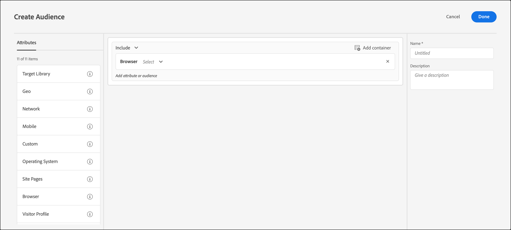

# Navigateur

Vous pouvez cibler les visiteurs qui utilisent un navigateur spécifique ou des options de navigateur spécifiques lors de l’accès à votre page.

Les navigateurs suivants peuvent être ciblés :

* Chrome
* Firefox
* Safari
* Internet Explorer
* Microsoft Edge
* Opera
* iPad 
* iPhone|

Il existe deux façons de cibler les navigateurs :

* **Audience prédéfinie :** Utilisez l’audience prédéfinie si vous souhaitez cibler uniquement les visiteurs qui utilisent un navigateur spécifique pour accéder à votre site. Par exemple, si vous proposez une extension Chrome, vous ne ciblerez que les utilisateurs de Chrome.

   1. Lors de la configuration de votre activité, sélectionnez le navigateur dans la liste déroulante.

      Cette option cible l’activité uniquement pour les visiteurs qui utilisent le navigateur spécifié.

      

* **Règle d’audience de navigateur personnalisée :** Une audience personnalisée vous permet de cibler plusieurs navigateurs ou de configurer des règles ou des exclusions pour des navigateurs, des versions de navigateur ou des langues de navigateur spécifiques. Cette fonctionnalité offre une flexibilité considérable lors du ciblage d’une activité basée sur les attributs du navigateur.

   1. Dans l’interface [!DNL Target], cliquez sur **[!UICONTROL Audiences]** > **[!UICONTROL Créer une audience]**.
   1. Nommez l’audience et ajoutez une description facultative.
   1. Glisser-déposer **[!UICONTROL Navigateur]** dans le créateur d’audiences.

      

   1. Cliquez sur **[!UICONTROL Sélectionner]**, puis sélectionnez l’une des options suivantes :

      * **Type :** cibler ou exclure un navigateur spécifique. Voir [Type](/help/main/c-target/c-audiences/c-target-rules/browser.md#section_6ADC758F23F145B3A310151546D83D56).
      * **Langue :** Ciblez ou excluez certains navigateurs configurés pour utiliser des langues spécifiques. Voir [Langue](/help/main/c-target/c-audiences/c-target-rules/browser.md#section_7520D1AA464A45A6843EABE2D2B431A1).
      * **Version :** cibler ou exclure certaines versions de navigateur. Voir [Version](/help/main/c-target/c-audiences/c-target-rules/browser.md#section_37CC8CE45DA04E8682AE6388321BA6EF).
   1. (Facultatif) Configurez des règles supplémentaires pour l’audience.
   1. Cliquez sur **[!UICONTROL Terminé]**.

   L’exemple suivant illustre une audience qui inclut les utilisateurs de Microsoft Edge sur les versions 91 ou 92 :

   

## Options de navigateur {#concept_221D8EEF53CC45AEACEB17CF336A3658}

Ciblez ou excluez des participants aux activités en fonction du type, de la langue ou de la version de leur navigateur.

### Type {#section_6ADC758F23F145B3A310151546D83D56}

Ciblez ou excluez un navigateur spécifique.

Sélectionnez **[!UICONTROL Type]**, puis choisissez « est égal à » ou « n’est pas égal à ».

* Est égal à : cible les navigateurs sélectionnés.
* N’est pas égal à : exclut les navigateurs sélectionnés.

Sélectionnez un ou plusieurs navigateurs. De nombreuses options sont connectées avec un OU.

### Langue {#section_7520D1AA464A45A6843EABE2D2B431A1}

Ciblez ou excluez certains navigateurs configurés pour utiliser des langues spécifiques.

Par exemple, si une offre n’est disponible qu’en anglais, vous pouvez cibler les navigateurs dont la langue définie est l’anglais. Sinon, si votre page n’est pas compatible avec le format double octet, vous pouvez exclure les navigateurs utilisant les langues d’Asie de l’Est.

L’inclusion ou l’exclusion d’une langue de navigateur peut fournir un ciblage des visiteurs plus précis que le ciblage basé sur la géographie dans les cas où la langue est plus importante que l’emplacement. Par exemple, si vous proposez un article écrit en anglais, vous pouvez soit cibler les pays anglophones, soit cibler les navigateurs dont la langue définie est l’anglais. Le ciblage du navigateur permet aux anglophones vivant dans un pays dont l’anglais n’est pas la langue première de consulter l’article.

Sélectionnez **[!UICONTROL Langue]**, puis choisissez « est égal à » ou « n’est pas égal à ».

* Est égal à : cible les langues de navigateur sélectionnées.
* N’est pas égal à : exclut les langues de navigateur sélectionnées.

Sélectionnez une ou plusieurs langues. De nombreuses options sont connectées avec un OU.

Les langues de navigateur suivantes peuvent être ciblées ou exclues :

* Anglais
* Français
* Allemand
* Japonais
* Coréen
* Portugais
* Russe
* Espagnol
* Chinois traditionnel

### Version {#section_37CC8CE45DA04E8682AE6388321BA6EF}

Ciblez ou excluez certaines versions de navigateur.

Par exemple, si votre page ne s’affiche pas correctement dans Internet Explorer version 11 ou antérieure, vous pouvez créer une audience qui exclut ces versions. Dans ce cas, vous devez créer une règle où le type de navigateur est égal à Internet Explorer puis ajouter une seconde règle où la version est inférieure ou égale à 11.

Sélectionnez **[!UICONTROL Version]**, puis choisissez un opérateur :

* Est égal
* N’est pas égal à
* Est supérieur à
* Est supérieur ou égal à
* Est inférieur à
* Est inférieur ou égal à

Saisissez le numéro de version. Seules les versions majeures peuvent être saisies dans le champ de texte. La version spécifiée comprend toutes les versions mineures qui lui sont associées. Par exemple, si vous spécifiez la version 10, les visiteurs de la version 10.1 sont également inclus.

De nombreuses options sont connectées avec un OU.

## Vidéo de formation : Création d’audiences 

Cette vidéo fournit des informations sur l’utilisation des catégories d’audiences.

* Créer des audiences
* Définir des catégories d’audiences

>[!VIDEO](https://video.tv.adobe.com/v/17392)
