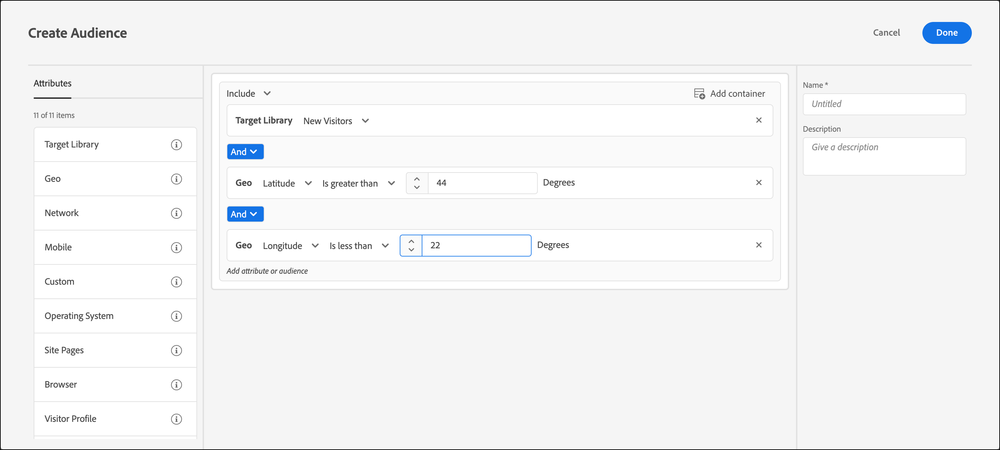

# Géo

Utilisez les audiences dans [!DNL Adobe Target] pour cibler les utilisateurs et utilisatrices en fonction de leur emplacement géographique.

Les paramètres de géolocalisation vous permettent de cibler des activités et des expériences en fonction de la géographie de vos visiteurs. Vous pouvez inclure ou exclure des visiteurs en fonction de leur pays, état/province/département, ville, code postal, latitude, longitude, zone desservie ou opérateur de téléphonie mobile. Ces données sont envoyées avec chaque requête [!DNL Target] et sont basées sur l’adresse IP du visiteur. Sélectionnez ces paramètres comme pour une autre valeur de ciblage.

## Création d’une audience avec ciblage géographique {#section_49CBFFAAC8694C4AAD3DE4B2DB7B05DE}

1. Dans l’interface [!DNL Target], cliquez sur **[!UICONTROL Audiences]** > **[!UICONTROL Create Audience]**.
1. Nommez l’audience et ajoutez une description facultative.
1. Faites glisser et déposez **[!UICONTROL Geo]** dans le volet du Créateur d’audiences.

1. Cliquez sur **[!UICONTROL Select]**, puis sélectionnez l’une des options suivantes :

   * [!UICONTROL Country/Region]
   * [!UICONTROL State]
   * [!UICONTROL City]
   * [!UICONTROL Zip Code]
   * [!UICONTROL Longitude]
   * [!UICONTROL Latitude]
   * [!UICONTROL DMA]
   * [!UICONTROL Mobile Carrier]

   Les informations géographiques d’un visiteur ou d’une visiteuse sont déterminées à partir de l’adresse IP d’origine d’une requête d’emplacement [!DNL Target] (requête de mbox). La résolution IP/zone géographique est effectuée pour le premier appel d’une nouvelle session. En d’autres termes, si l’adresse IP d’un visiteur ou d’une visiteuse change en milieu de session d’une visite, les informations géographiques sont toujours basées sur l’adresse IP du premier appel.

   Par [!UICONTROL Mobile Carrier], [!DNL Target] utilise les données d’enregistrement des adresses IP (à qui appartient le bloc d’adresses IP) pour déterminer l’opérateur mobile approprié à l’aide de [Mobile Country Codes (MCC) et Mobile Network Codes (MNC)](https://www.mcc-mnc.com).

1. Spécifiez un opérateur et la valeur appropriée.
1. (Facultatif) Configurez des règles supplémentaires pour l’audience.
1. Cliquez sur **[!UICONTROL Done]**.

L’illustration suivante présente une audience qui cible les utilisateurs et utilisatrices accédant à l’activité à partir d’une latitude supérieure à 44° et d’une longitude inférieure à 22°.

## Précision {#section_D63D5FFCB49C42F9933AFD0BD7C79DF1}

La précision du géociblage dépend de plusieurs facteurs. Les connexions Wi-Fi sont plus précises que les réseaux cellulaires. Lorsqu’un visiteur utilise une connexion de données cellulaires, la précision de la recherche géographique peut être affectée par l’emplacement, la relation de données du fournisseur avec [DeviceAtlas](https://deviceatlas.com/device-data/user-agent-tester) et d’autres facteurs. Les connexions réseau basées sur des antennes-relais peuvent être moins précises que les connexions Wi-Fi ou câblées. En outre, l’adresse IP d’un visiteur peut être mappée à l’emplacement du FAI du visiteur, qui peut ne pas être identique à l’emplacement réel du visiteur. Certains problèmes de géolocalisation mobile peuvent être résolus à l’aide de l’[API de géolocalisation](https://developer.mozilla.org/en-US/docs/Web/API/Geolocation_API).

Le tableau ci-après indique la précision des informations géographiques basées sur les adresses IP de [DigitalEnvoy](https://www.digitalelement.com/solutions/) pour les connexions Internet sur un réseau WiFi ou câblé. DigitalEnvoy offre les données les plus précises du secteur. La précision globale est de plus de 99,9 % au niveau du pays et atteint 97 % au niveau de la ville. Les informations sur la précision ne s’appliquent pas aux réseaux basés sur des antennes-relais.

| Pays | État | Ville | Région |
|--- |--- |--- |--- |
| US | 99,99 % | 96 % | 94 % |
| Canada | 99,99 % | 96 % | 94 % |
| Europe | 99,99 % |  |  |
| Royaume-Uni | 99,99 % |  | 87 % |
| Allemagne | 99,99 % | 95 % | 93 % |
| Scandinavie | 99 % | Faible 90 s | Moyenne 80 s |
| Espagne | 99,99 % | Autour de 90 % | Moyen à élevé 90 s |
| Asie | 99 % | Moyen 90 s | Faible 90 s |
| Japon | 99,99 % | Moyen 90 s | Faible 90 s |
| Australie | 99,99 % | 94 % | 91 % |

## Utilisation du géociblage dans les scripts de profil {#section_92C93138542C4A94997E3F4BE3F5DA28}

Vous pouvez utiliser les informations géographiques pour les scripts de profil.

Par exemple, utilisez :

* `profile.geolocation.country`
* `profile.geolocation.state`
* `profile.geolocation.city`
* `profile.geolocation.zip`
* `profile.geolocation.dma`
* `profile.geolocation.domainName`
* `profile.geolocation.ispName`
* `profile.geolocation.connectionSpeed`
* `profile.geolocation.mobileCarrier`

Vous pouvez alors écrire une expression cible appelée « A partir des États-Unis » à l’aide du code suivant :

`return profile.geolocation.country == 'united states' || profile.geolocation.country == 'canada' || profile.geolocation.country == 'mexico';`

## Utilisation des valeurs de géociblage comme jetons {#section_E7F7FDF62C3B4934A6565D04B24655F6}

Vous pouvez utiliser `profile.geolocation` valeurs directement comme jetons dans les offres, les modules externes, etc.

Par exemple, utilisez :

* `${profile.geolocation.country}`
* `${profile.geolocation.state}`
* `${profile.geolocation.city}`
* `${profile.geolocation.zip}`
* `${profile.geolocation.dma}`
* `${profile.geolocation.domainName}`
* `${profile.geolocation.ispName}`
* `${profile.geolocation.connectionSpeed}`
* `${profile.geolocation.mobileCarrier}`
* `${profile.geolocation.latitude}`
* `${profile.geolocation.longitude}`

## FAQ sur le géociblage {#section_DD308A53AF0F48FA8C81423580561FE7}

Les questions suivantes sont fréquemment posées à propos du géociblage :

### Comment spécifier la latitude et la longitude ?

+++Afficher les détails
* La valeur de la latitude et de la longitude doit être une valeur numérique en degrés.
* La valeur de latitude et de longitude peut avoir une précision maximale de cinq décimales.
* La valeur de la latitude doit se situer entre -90 et 90.
* La valeur de la longitude doit se situer entre -180 et 180.

+++

### Comment fonctionne le géociblage pour les appareils mobiles ?

+++Afficher les détails
La plupart des utilisateurs d’appareils mobiles accèdent au contenu via WiFi, ce qui signifie que le ciblage géographique basé sur les adresses IP d’[!DNL Target] est aussi précis que sur un ordinateur de bureau. Les connexions basées sur un relais de téléphonie mobile peuvent être moins précises car l’adresse IP du visiteur est basée sur le relais qui capture le signal. Certains problèmes de géolocalisation mobile peuvent être résolus à l’aide de l’[API de géolocalisation](https://developer.mozilla.org/en-US/docs/Web/API/Geolocation_API).

+++

### Comment les fonctionnalités géographiques gèrent-elles les visiteurs d’AOL ?

+++Afficher les détails
En raison de la manière dont AOL traite son trafic par proxy, [!DNL Target] ne pouvez le cibler qu&#39;au niveau du pays. Par exemple, une campagne ciblée sur la France cible avec succès tous les utilisateurs en France. Mais une campagne ciblée sur Paris ne cible pas correctement tous les utilisateurs de Paris. Si vous envisagez de cibler des utilisateurs d’AOL, vous pouvez affecter au champ Région la valeur « aol ». En fait, vous pouvez cibler des utilisateurs d’AOL aux États-Unis en spécifiant deux conditions de ciblage : Pays correspond exactement à « états-unis » et Région correspond exactement à « aol ».

+++

### Quelle granularité de localisation fournit le géociblage ?

+++Afficher les détails
* Pays : globale
* État/province/département : globale
* Ville : globale
* Code postal : États-Unis, Allemagne, Canada
* DMA/ITV (Royaume-Uni) : États-Unis, Royaume-Uni
* Opérateur de téléphonie mobile : globale

+++

### Comment puis-je tester mes activités si je ne me trouve pas dans mon lieu habituel ?

+++Afficher les détails
* **at.js 1.*x*** : vous pouvez remplacer votre adresse IP par une adresse IP provenant d’un autre emplacement et utiliser le paramètre `mboxOverride.browserIp url` . Par exemple, si votre entreprise se trouve au Royaume-Uni, mais que votre campagne mondiale cible les visiteurs d’Auckland, en Nouvelle-Zélande, utilisez ce style d’URL en supposant que `60.234.0.39` est une adresse IP d’Auckland :

  `https://www.mycompany.com?mboxOverride.browserIp=60.234.0.39`

  Effacez vos cookies avant de tester l’activité.

  >[!NOTE]
  >
  >`mboxOverride.browserIp` est pris en charge dans at.js 1.*x* uniquement. Cette fonctionnalité n’est pas prise en charge dans at.js 2.*x*.

* **Équivalent at.js 2.*x*** : pour remplacer votre adresse IP par at.js 2.*x*, installez une extension/un module externe de navigateur (tel que X-Forwarded-For-Header pour Chrome ou Firefox). Cette extension vous permet de transmettre l’en-tête x-forwarded-for dans vos requêtes de page.

+++

### Comment les territoires, comme Porto Rico et Hong Kong, sont-ils cartographiés dans la structure de géociblage ?

+++Afficher les détails
Porto Rico, Hong Kong, ainsi que les autres territoires sont traités comme des valeurs « Pays » indépendantes.

+++

### Le [!DNL Target] capture-t-il (et stocke-t-il) des informations telles que le code postal lorsque l’activité est ciblée avec des fonctionnalités de ciblage de géolocalisation ?

+++Afficher les détails
Non, [!DNL Target] utilise des données géographiques pendant la session uniquement, puis les données sont ignorées.

+++

## Vidéo de formation : création d’audiences 

Cette vidéo fournit des informations sur l’utilisation des catégories d’audiences.

* Créer des audiences
* Définir des catégories d’audiences

>[!VIDEO](https://video.tv.adobe.com/v/17392)
