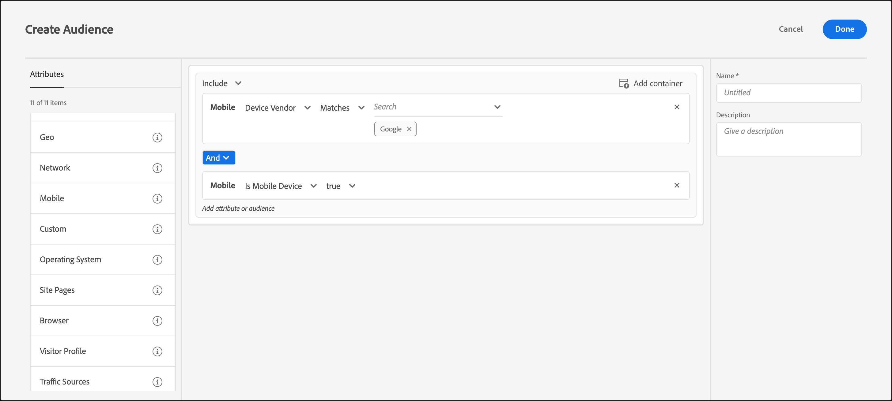

# Mobile

Créez des audiences dans [!DNL Adobe Target] de cibler les appareils mobiles en fonction de paramètres tels que l’appareil mobile, le type d’appareil, le fabricant de l’appareil, les dimensions de l’écran, etc.

Par exemple, vous pouvez vouloir montrer un contenu différent aux utilisateurs qui visitent votre page à l’aide d’un téléphone par rapport à celui que vous afficheriez s’ils visitent à l’aide d’un ordinateur. Dans ce cas, vous pouvez sélectionner l’audience [!UICONTROL Mobile], puis sélectionner l’option **[!UICONTROL Est un téléphone mobile]**. Vous pouvez ensuite ajouter des détails spécifiques qui sont importants pour vous, tels que le type de téléphone, la taille de l’écran (en pixels), etc.

Le ciblage mobile est fourni par [DeviceAtlas](https://deviceatlas.com/device-data/user-agent-tester), un service de DotMobi. DeviceAtlas est une base de données complète de périphériques mobiles créée à partir des données compilées provenant de nombreuses sources, dont les fabricants et les opérateurs réseau. Ces données sont alors vérifiées, référencées et validées pour mettre à disposition une importante base de données des périphériques mobiles.

Les périphériques sont détectés en analysant les chaînes d’agent-utilisateur. Certains fabricants de périphériques, notamment Apple, inhibent cette fonctionnalité en ne fournissant pas suffisamment d’informations dans l’agent-utilisateur.

Par exemple, aux États-Unis, les appareils Apple ne partagent pas de jetons spécifiques aux modèles. Il en résulte qu’il n’est pas possible de détecter des modèles iPhone (tels qu’iPhone 12 Pro, iPhone 12, iPhone 11 Pro Max, etc.) à l’aide d’une méthode simple basée sur des mots-clés.

Pour résoudre ce problème, [!DNL Target] collecte des données supplémentaires afin de détecter avec précision les iPhone et les autres appareils Apple à l’aide des paramètres suivants :

| Paramètre | Type | Description |
|--- |--- |--- |
| devicePixelRatio | Chaîne | Rapport entre les pixels physiques et les pixels indépendants de l’appareil (dips) sur le navigateur. Par exemple, « 1,5 » ou « 2 » |
| screenOrientation | Chaîne | L’appareil et le moteur JavaScript du navigateur prennent en charge l’orientation d’appareil. Peut être Paysage ou Portrait. |
| webGLRenderer | Chaîne | Rendu de navigateur du pilote graphique. |

>[!NOTE]
>
>Les clients qui utilisent Mobile SDK n’ont rien à faire pour appliquer cette fonctionnalité. Les clients utilisant at.js doivent [procéder à une mise à niveau vers at.js version 1.5.0](https://experienceleague.adobe.com/docs/target-dev/developer/client-side/at-js-implementation/target-atjs-versions.html?lang=fr){target=_blank} (ou version ultérieure).

Vous pouvez choisir plusieurs propriétés d’appareil mobile. Plusieurs sélections sont reliées par un opérateur OR.

Les clients qui utilisent une intégration personnalisée (n’utilisant pas at.js ou le SDK mobile) peuvent collecter ces paramètres eux-mêmes et les transmettre en tant que paramètres mbox.

1. Dans l’interface [!DNL Target], cliquez sur **[!UICONTROL Audiences]** > **[!UICONTROL Créer une audience]**.
1. Nommez l’audience et ajoutez une description facultative.
1. Faites glisser et déposez **[!UICONTROL Mobile]** dans le volet du créateur d’audiences.
1. Cliquez sur **[!UICONTROL Sélectionner]**, puis sélectionnez l’une des options suivantes :

   * Nom marketing du périphérique
   * Modèle de périphérique
   * Fournisseur de périphérique
   * Appareil mobile
   * Téléphone mobile
   * Tablette
   * Système d’exploitation
   * Hauteur de l’écran (px)
   * Largeur de l’écran (px)

   >[!NOTE]
   >
   >Vous pouvez effectuer un ciblage selon l’opérateur de téléphonie mobile à l’aide des [paramètres de géolocalisation](/help/main/c-target/c-audiences/c-target-rules/geo.md#concept_5B4D99DE685348FB877929EE0F942670).

1. (Facultatif) Configurez des règles supplémentaires pour l’audience.
1. Cliquez sur **[!UICONTROL Done]** (Terminé).

L’illustration suivante présente une audience ciblant des visiteurs utilisant des appareils fabriqués par Google qui sont des appareils mobiles.

## Considérations

Tenez compte des informations suivantes lors du ciblage des appareils mobiles :

### Ciblage des appareils exécutant iOS 12.2 ou une version ultérieure

En raison des nouvelles modifications introduites dans iOS 12.2, la création d’une audience avec des règles définies par [!UICONTROL Nom marketing de l’appareil] et [!UICONTROL Modèle de l’appareil] qui spécifient les modèles iPhone est affectée. [!DNL Target] ne peut plus cibler les utilisateurs et utilisatrices disposant d’iPhones sur lesquels iOS 12.2 (ou version ultérieure) est installé. Cependant, si ces utilisateurs ne disposent pas d’iOS 12.2 (ou version ultérieure), le ciblage du modèle iPhone continue de fonctionner correctement.

La mise à jour d’iOS 12.2 (ou version ultérieure) n’affecte pas l’identification des modèles suivants, car ces modèles ne prennent pas en charge la mise à niveau vers iOS 12.2 : iPhone, iPhone 3G, iPhone 3GS, iPhone 4, iPhone 4s, iPhone 5, iPhone 5c, iPad, iPad 2, iPad / Retina display, iPad Retina (4e génération), iPod Touch 4 et iPod Touch 5.

### Ciblage des appareils exécutant Safari 14.0.2 (ou version ultérieure)

Lors de l’utilisation de règles mobiles pour cibler des appareils exécutant Safari version 14.0.2 (ou ultérieure) sur macOS, en raison d’un problème connu impliquant les user agents d’Apple et DeviceAtlas, [!DNL Target] identifie incorrectement Safari sur les appareils Mac et iPad. Cette question sera abordée à l&#39;avenir.

## Vidéo de formation : Création d’audiences

Cette vidéo fournit des informations sur l’utilisation des catégories d’audiences.

* Créer des audiences
* Définir des catégories d’audiences

>[!VIDEO](https://video.tv.adobe.com/v/17392)
