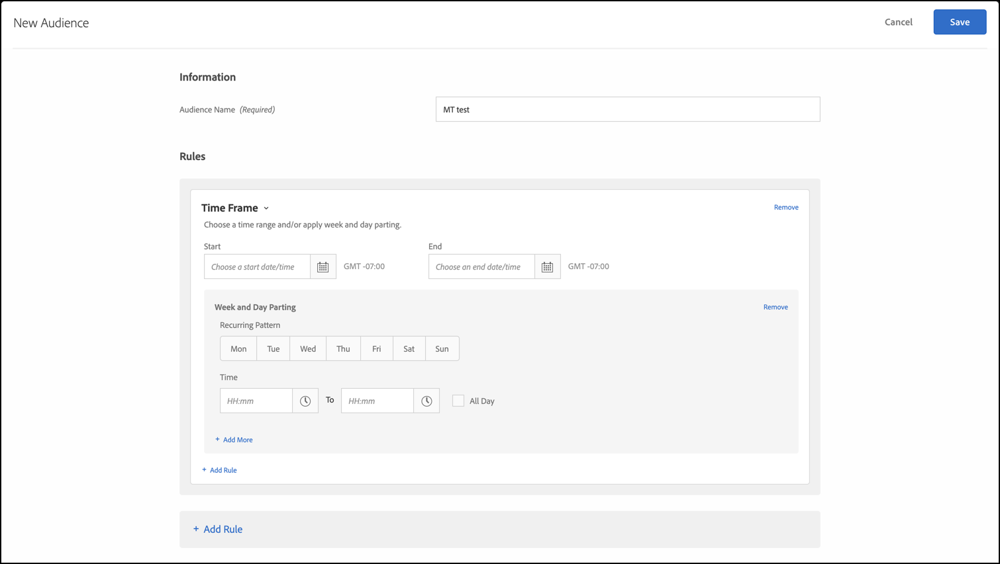

# [!UICONTROL Période]

Vous pouvez ajouter des dates et heures de début et de fin dans [!DNL Adobe Target] pour cibler les utilisateurs et utilisatrices qui visitent votre site au cours d’une période spécifique. Pour créer des schémas récurrents pour le ciblage des audiences, vous pouvez également définir les options Partage de semaine et de journée.

Par exemple, à l’aide de la fonction d’audiences ad hoc [combinées](/help/main/c-target/combining-multiple-audiences.md#concept_A7386F1EA4394BD2AB72399C225981E5), vous pouvez cibler les utilisateurs et utilisatrices qui dépensent peu avec un contenu spécifique au cours des trois jours précédant le Vendredi noir et d’autres contenus après le Vendredi noir.

1. Dans l’interface [!DNL Target], cliquez sur **[!UICONTROL Audiences]** > **[!UICONTROL Créer une audience]**.
1. Nommez l’audience et ajoutez une description facultative.
1. Effectuez un glisser-déposer **[!UICONTROL Période]** dans le volet du créateur d’audiences.

   

1. Spécifiez les dates et heures [!UICONTROL Début] et [!UICONTROL Fin] de l’audience.

   Laissez la date de début vide pour lancer le ciblage conformément à la planification de l’activité. Laissez la date de fin vide pour poursuivre le ciblage jusqu’aux date et heure de fin de l’activité.

   Vous pouvez également laisser à la fois les dates de début et de fin vides. Cette fonctionnalité vous permet d’utiliser la même audience dans plusieurs activités (sans faire de copie de l’audience) tout en contrôlant les dates de début et de fin au niveau de l’activité.

   >[!NOTE]
   >
   >Tenez compte des points suivants :
   >
   >* Le fuseau horaire des dates de début et de fin s’affiche sous la forme GMT +/- NN:NN, où NN:NN correspond au décalage par rapport à GMT et reflète le fuseau horaire au niveau du compte plutôt que le fuseau horaire du visiteur. Par exemple, le fuseau horaire de la Californie s’affiche sous la forme GMT -08:00.
   >
   >* Les audiences d’heure d’[!DNL Target] ne prennent pas en compte les modifications de l’heure d’été. Vous devez réenregistrer manuellement les audiences pour tenir compte des modifications de l’heure d’été.

1. (Conditionnel) Cliquez sur **[!UICONTROL Définir la fréquence]** pour définir des modèles récurrents, y compris les jours des semaines et les heures.

   

   Vous pouvez utiliser les options [!UICONTROL Fréquence], par exemple, pour afficher une option « Discuter maintenant » aux visiteurs et visiteuses uniquement pendant les jours et les heures où votre centre d’appels dispose de personnel.

   Sélectionnez un ou plusieurs jours de la semaine, puis définissez les heures de début et de fin. Cliquez sur **[!UICONTROL Ajouter une fréquence]** pour spécifier des modèles supplémentaires, selon vos besoins.

   >[!NOTE]
   >
   >Le fuseau horaire pour [!UICONTROL Partage de semaine et de journée] s’affiche sous la forme GMT +/- NN:NN, où NN:NN est le décalage par rapport à GMT et reflète le fuseau horaire au niveau du compte plutôt que le fuseau horaire du visiteur. Par exemple, le fuseau horaire de la Californie pour l’heure d’été du Pacifique s’affiche sous la forme GMT -07:00.

1. (Facultatif) Configurez des règles supplémentaires pour l’audience.

   Si vous le souhaitez, vous pouvez répéter l’étape 5 pour chaque règle.

1. Cliquez sur **[!UICONTROL Done]** (Terminé).

## Vidéo de formation : création d’audiences 

Cette vidéo fournit des informations sur l’utilisation des catégories d’audiences.

* Créer des audiences
* Définir des catégories d’audiences

>[!VIDEO](https://video.tv.adobe.com/v/17392)
