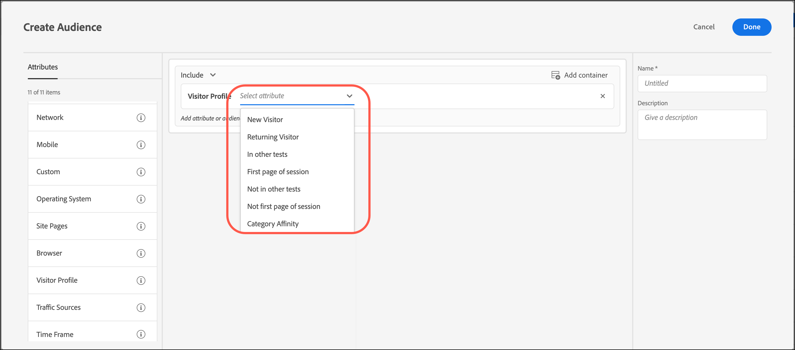

# Profil du visiteur

Créez des audiences dans [!DNL Adobe Target] pour cibler les visiteurs et visiteuses qui répondent à des paramètres de profil spécifiques.

1. Dans l’interface [!DNL Target], cliquez sur **[!UICONTROL Audiences]** > **[!UICONTROL Créer une audience]**.
1. Nommez l’audience et ajoutez une description facultative.
1. Faites glisser et déposez **[!UICONTROL Profil du visiteur]** dans le volet du créateur d’audiences.

1. Cliquez sur **[!UICONTROL Sélectionner]**, puis sélectionnez l’une des options suivantes :

   

   Les paramètres de profil du visiteur sont transmis via la mbox (profil). Vous pouvez cibler les visiteurs nouveaux ou récurrents, ou inclure tous les utilisateurs.

   * [!UICONTROL Nouveau visiteur]
   * [!UICONTROL Visiteur récurrent]
   * [!UICONTROL Dans D’Autres Tests]
   * [!UICONTROL Pas Dans D’Autres Tests]
   * [!UICONTROL Première page de la session]
   * [!UICONTROL Pas la première page de la session]
   * [!UICONTROL Affinité catégorielle]

   Un profil du visiteur est créé en local dans la mémoire périphérique pour chaque appel mbox comportant de nouvelles données `mboxPC`. Après 30 minutes d’inactivité, le profil est enregistré dans la base de données [!DNL Target] et est accessible à partir d’autres périphéries.

   Lorsqu’un visiteur du site se connecte en milieu de session et obtient une `3rdpartyId`, tous les attributs de profil précédemment chargés et liés au `3rdPartyId` sont immédiatement disponibles.

   Vous pouvez cibler des paramètres de profil personnalisés et des paramètres `user.`. Sélectionnez le paramètre que vous souhaitez utiliser pour cibler votre activité. Si le paramètre souhaité ne s’affiche pas, il n’a pas été déclenché par une mbox.

1. (Facultatif) Configurez des règles supplémentaires pour l’audience.
1. Cliquez sur **[!UICONTROL Done]** (Terminé).

## Vidéo de formation : création d’audiences 

Cette vidéo fournit des informations sur l’utilisation des catégories d’audiences.

* Créer des audiences
* Définir des catégories d’audiences

>[!VIDEO](https://video.tv.adobe.com/v/17392)
