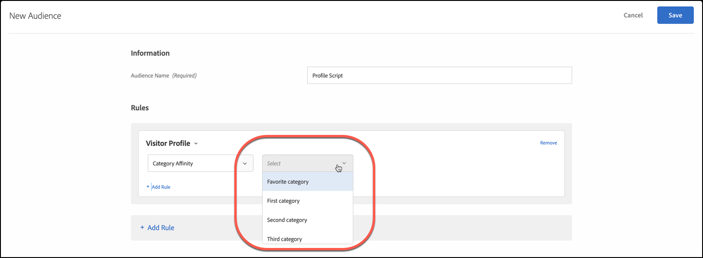

# Affinité catégorielle

La fonctionnalité d’affinité par catégorie d’[!DNL Adobe Target] capture automatiquement les catégories de votre site visitées par un utilisateur, puis calcule l’affinité de l’utilisateur pour chaque catégorie afin qu’elle puisse être ciblée et segmentée. L’affinité catégorielle permet de s’assurer que le contenu est ciblé sur les visiteurs les plus susceptibles d’agir sur ces informations.

## Transmettre des informations d’affinité de catégorie dans [!DNL Target] {#section_B0C8E46EEBAC4549AD90352A47787D04}

Chaque fois qu’un utilisateur se rend sur votre site, ses paramètres de profil sont enregistrés dans la base de données de [!DNL Target]. Ces données sont associées au cookie de l’utilisateur. Un paramètre utile est `user.categoryId`, un paramètre mbox affecté à une page de produit. Quand le visiteur continue sa navigation sur le site ou revient pour une nouvelle session, les catégories de produits qu’il consulte peuvent être enregistrées. Vous pouvez également enregistrer des informations de catégorie en les transmettant en tant que `user.categoryId` de paramètre mbox dans n’importe quelle mbox (y compris une mbox imbriquée), en tant que `user.categoryId` de paramètre d’URL ou dans [!DNL Target] paramètres de page avec une mbox globale. Pour plus d’informations, consultez votre gestionnaire de compte.

Séparez les catégories par une virgule pour inclure un élément dans plusieurs catégories. Par exemple :

* `user.categoryId=clothing,shoes,nike,running,nike clothing,nike shoes,nike running shoes`

D’après la fréquence et la récence des visites effectuées sur vos catégories de produits, les affinités catégorielles (le cas échéant) d’un utilisateur sont enregistrées. Les affinités catégorielles permettent de cibler des populations pour vos activités.

Vous pouvez utiliser `user.categoryAffinities[]` dans un script de profil pour renvoyer un tableau des affinités renseignées par un visiteur. Pour plus d’informations, voir [user.categoryAffinities sous Objets et méthodes dans Attributs de profil](/help/main/c-target/c-visitor-profile/profile-parameters.md#objects).

>[!IMPORTANT]
>
>L’attribut `user.categoryId` utilisé pour l’algorithme d’affinité catégorielle est distinct de l’attribut `entity.categoryId` utilisé pour les recommandations de produits et de contenus de [!DNL Adobe Target Recommendations]. `user.categoryId` est requis pour effectuer le suivi de la catégorie préférée d’un utilisateur. `entity.categoryId` est requis pour baser les recommandations sur la catégorie de l’élément actuel ou de la page en cours. Transmettez les deux valeurs à [!DNL Target] si vous souhaitez utiliser les deux fonctionnalités.

## Business case pour l&#39;affinité catégorielle {#section_D6FF913E88E6486B8FBCE117CA8B253B}

L’activité d’un visiteur au cours d’une session, par exemple la catégorie qu’il consulte le plus souvent, peut être utilisée à des fins de ciblage lors de visites ultérieures. Chaque page de catégorie qu’un visiteur consulte durant une session est capturée et sa catégorie « favorite » est calculée en fonction d’un modèle de récence et de fréquence. Ensuite, chaque fois que le visiteur revient à la page d’accueil, la zone d’image à forte identification peut être ciblée afin que le contenu associé à sa catégorie préférée lui soit présenté.

## Exemple d&#39;utilisation de l&#39;affinité catégorielle {#section_A4AC0CA550924CB4875F4F4047554C18}

Supposons que vous vendez des instruments de musique en ligne et que vous souhaitez promouvoir les guitares basses auprès des visiteurs s’étant déjà intéressés aux guitares dans le passé. Grâce aux affinités catégorielles, vous pouvez créer des offres qui ne s’afficheront que pour les visiteurs ayant ces affinités.

## Algorithme d&#39;affinité catégorielle {#section_8B86C7FF50294208866ABF16F07D5EB9}

L’algorithme d’affinité catégorielle fonctionne comme suit :

* Dix points pour la première catégorie consultée
* Cinq points pour chaque catégorie sur laquelle l’utilisateur a cliqué après le premier
* Lorsqu’un utilisateur clique sur une nouvelle catégorie, 1 est soustrait de toutes les catégories ayant précédemment fait l’objet d’un clic
* Si une catégorie a déjà fait l’objet d’un clic (vue), cliquer de nouveau dessus ne soustrait pas 1 de toutes les autres catégories
* Si vous cliquez sur une sixième nouvelle catégorie, la catégorie notée la plus basse des cinq premières catégories est retirée du calcul.
* À la fin de la session, divisez toutes les valeurs par 2

>[!NOTE]
>
>Lorsque plusieurs catégories sont transmises au cours d’un seul appel de mbox, l’ordre des catégories dans `categoryAffinities` n’est pas garanti. Une catégorie arbitraire est enregistrée en premier et reçoit un score de 10.

### Exemple : algorithme d’affinité catégorielle

Par exemple, si vous affichez la catégorie `mens-clothing`, puis `accessories`, `jewelry` et à nouveau `accessories` dans une session, vous obtenez des affinités de :

* `accessories` : 9 (+5 – 1 + 5)

* `mens-clothing` : 8 (+10 – 1 – 1)

* `jewelry` : 5 (+5)

Lorsque la session se termine et que l’utilisateur revient ensuite sur le site, les scores sont réduits de moitié :

* `accessories` : 4.5 (9/2)

* `mens-clothing` : 4 (8/2)

* `jewelry` : 2,5 (5/2)

En supposant que l’utilisateur consulte, dans l’ordre `jewelry`, `accessories`, `beauty`, `shoes` et `womens-clothing` :

* `accessories` : 6.5 (4.5 + 5 – 1 – 1 - 1)

* `womens-clothing` : 5 (+5)

* `jewelry` : 4.5 (2.5 + 5 – 1 – 1 - 1)

* `shoes` : 4 (+5 – 1)

* `beauty` : 3 (+5 – 1 - 1)

* `mens-clothing` est déposé après le dernier clic sur `womens-clothing` la catégorie de notation le plus faible avec un score de 1 (4 - 1 - 1 - 1)

Lorsque la session se termine et que l’utilisateur revient ensuite sur le site, les scores sont réduits de moitié :

* `accessories` : 3,3 (6,5/2)

* `womens-clothing` : 2,5 (5/2)

* `jewelry` : 2,3 (4,5/2)

* `shoes` : 2 (4/2)

* `beauty` : 1.5 (3/2)

## Utiliser l’affinité catégorielle pour le ciblage {#concept_5750C9E6C97A40F8B062A5C16F2B5FFC}

Les sections suivantes contiennent des informations pour vous aider à utiliser une audience d’affinité catégorielle pour le ciblage dans une activité.

### Créer une audience pour utiliser l&#39;affinité catégorielle {#section_A27C600BBA664FE7A74F8FE076B78F40}

1. Dans la liste **[!UICONTROL Audiences]**, cliquez sur **[!UICONTROL Create Audience]**.

   OU

   Pour copier une audience existante, dans la liste Audiences, passez le curseur de la souris sur l’audience souhaitée, puis cliquez sur l’icône Copier. Vous pouvez ensuite modifier l’audience pour créer une audience similaire.

1. Saisissez un nom d’audience descriptif.
1. Cliquez sur **[!UICONTROL + Add Rule]** > **[!UICONTROL Visitor Profile]**.
1. Dans la liste déroulante **[!UICONTROL Visitor Profile]** , sélectionnez **[!UICONTROL Category Affinity]**.

   

1. Sélectionnez la catégorie souhaitée :

   

   Les catégories incluent :

   * Catégorie préférée
   * Première catégorie
   * Deuxième catégorie
   * Troisième catégorie
   * Quatrième catégorie
   * Cinquième catégorie

   Les options « Catégorie préférée » et « Première catégorie » sont équivalentes.

1. Choisissez l’évaluateur :

   * Contient (non-respect de la casse)
   * Ne contient pas (non-respect de la casse)
   * Est égal

1. Spécifiez chaque nouvelle valeur dans une ligne distincte (par exemple, « chaussures »).
1. Cliquez sur **[!UICONTROL Save]**.

### Utiliser l&#39;audience d&#39;affinité catégorielle dans une activité {#section_91526B942D1B4AEBB8FCDF4EBFF931CF}

Vous pouvez utiliser des audiences d’affinité catégorielle dans n’importe quelle activité. Au cours du workflow guidé en trois étapes, à l’étape [!UICONTROL Target], choisissez l’audience souhaitée.
