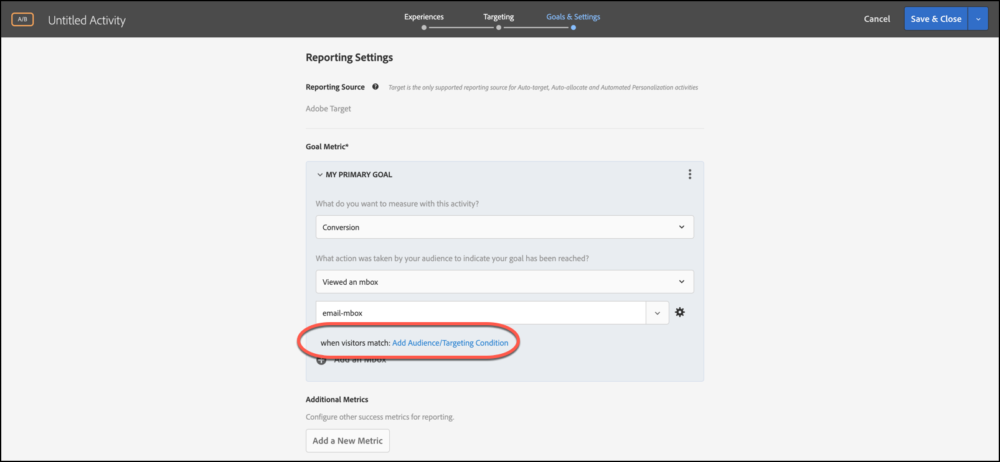
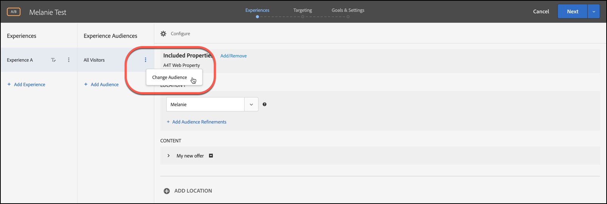

# Combinaison de plusieurs audiences

Combinez plusieurs audiences (y compris [!DNL Adobe Experience Cloud], [!DNL Adobe Experience Platform] et [!DNL Target] audiences) à la volée pour créer des audiences ad hoc. Vous pouvez également créer des règles d’exclusion et exclure des audiences d’une règle.

>[!NOTE]
>
>La source [!DNL Adobe Experience Platform] est disponible pour tous les clients [!DNL Target] qui utilisent le [ SDK Web de Adobe Experience Platform](https://experienceleague.adobe.com/docs/target-dev/developer/client-side/aep-web-sdk.html?lang=en){target=_blank}. Les audiences disponibles à partir de [!DNL Adobe Experience Platform] peuvent être utilisées en l’état ou combinées avec des audiences existantes, comme expliqué dans cette rubrique.
>
>Pour plus d’informations, voir [Utilisation d’audiences de Adobe Experience Platform](/help/main/c-target/c-audiences/audiences.md#aep).

Supposons que vous ayez une audience « Nouveaux visiteurs » et une audience « Utilisateurs Chrome ». Pour une activité spécifique, vous pouvez combiner ces audiences existantes aux nouveaux visiteurs Target utilisant un navigateur Chrome. Au lieu de créer une troisième audience et de la stocker dans la bibliothèque [!UICONTROL Audiences], vous pouvez combiner ces deux audiences lors de la création de l’activité ou de la modification d’une activité existante.

Autre exemple : vous pouvez cibler tous les clients fidèles. Par exemple, vous pouvez inclure une audience [!DNL Audience Manager] spécifique pour l’état de fidélité et la combiner à une audience [!DNL Target] composée des personnes qui se sont inscrites à votre programme de fidélité au cours de la session en cours. Combiner ces deux audiences est plus facile que de créer une troisième audience permanente.

Vous pouvez combiner jusqu’à 20 audiences à l’aide des opérateurs ET et OU.

Vous pouvez créer et utiliser des audiences combinées à différents endroits dans l’interface utilisateur [!DNL Target].

## Créer une audience combinée lors de la création d’une activité {#section_2F1CE9434CC04174B4BA2BFC89B85D77}

Vous pouvez créer une audience combinée ad hoc sur la page [!UICONTROL Target] de l’activité au cours du processus assisté en trois étapes.

1. Lors de la création d’une [activité](/help/main/c-activities/activities.md#concept_D317A95A1AB54674BA7AB65C7985BA03), sur la page **[!UICONTROL Targeting]**, cliquez sur les trois points alignés verticalement, puis sur **[!UICONTROL Replace Audience]**.

   

1. Sur la page **[!UICONTROL Choose Audience]**, cochez les cases en regard des audiences que vous souhaitez utiliser comme blocs de création pour votre audience combinée.

   Utilisez la zone [!UICONTROL Search Audiences] pour cibler votre recherche sur l’audience souhaitée.

   

1. Cliquez sur **[!UICONTROL Combine Multiple Audiences]** dans le coin supérieur droit.

   

1. (Facultatif) Modifiez la nouvelle audience combinée à votre gré.

   La boîte de dialogue [!UICONTROL Edit Audience] vous permet de faire glisser des blocs de création d’audience supplémentaires depuis la gauche vers la nouvelle audience combinée. Vous pouvez également ajouter des règles d’exclusion et exclure des audiences.

   1. Utilisez la fonction glisser-déposer pour ajouter des audiences dans une section existante comme bloc élémentaire de niveau 2.

      Par exemple, supposons que dans l’exemple précédent, vous souhaitiez à présent inclure les utilisateurs Safari à l’audience combinée. Recherchez l’audience « Navigateur Safari » et faites-la glisser dans la zone « Navigateur Firefox » à droite, comme dans l’exemple suivant :

      

      Notez que l’opérateur entre les deux audiences de type navigateur est « ET ». Sélectionnez la liste déroulante [!UICONTROL And] et remplacez-la par &quot;OU&quot; pour créer une audience combinée pour les nouveaux visiteurs utilisant Firefox ou Safari. Veillez à ne pas créer de règles qui excluent tous les membres potentiels de l’audience. Par exemple, il n’est pas possible de visiter une page en utilisant simultanément Firefox et Safari.

      >[!NOTE]
      >
      >L’opérateur (ET ou OU) doit rester identique lorsque vous combinez des audiences. Vous ne pouvez pas mélanger les opérateurs.

   1. Pour ajouter une exclusion à une règle, cliquez sur **[!UICONTROL Exclude]**.

      

      Faites glisser et déposez une audience.

      Par exemple, pour exclure les visiteurs des États-Unis des nouveaux visiteurs, vous pouvez faire glisser l’audience Marché : États-Unis dans la zone.

      Cette audience combinée comprend tous les nouveaux visiteurs sur votre site (à l’exclusion de ceux de San Francisco) utilisant Safari ou Firefox.

   1. Pour exclure une audience d’une règle, cliquez sur **[!UICONTROL Exclusion]** > **[!UICONTROL Exclude this Audience.]**.

      Vous pouvez par exemple créer une audience combinée qui comprend tous les nouveaux visiteurs sur votre site, à l’exclusion de ceux qui utilisent Firefox. Il est plus facile et plus rapide d’exclure les visiteurs utilisant Firefox que de créer une audience combinée qui inclut explicitement plusieurs navigateurs (Safari, Chrome et Internet Explorer), mais pas Firefox.

1. Attribuez un nom explicite à l’audience combinée, puis cliquez sur **[!UICONTROL Done]**.

## Créer une audience combinée à utiliser dans le ciblage des mesures {#section_A42E795AFCBD4575809C5942039910F0}

Vous pouvez créer une audience combinée ad hoc sur la page [!UICONTROL Goals & Settings] de l’activité à utiliser dans le ciblage des mesures. Par exemple pour créer un ciblage basé sur la conversion avec une audience combinée :

1. Lors de la modification ou de la création d’une [activité](/help/main/c-activities/activities.md#concept_D317A95A1AB54674BA7AB65C7985BA03), sur la page **[!UICONTROL Goals & Settings]**, sélectionnez **[!UICONTROL Conversion]** pour la mesure de succès, puis sélectionnez **[!UICONTROL Viewed an Mbox]** comme action.
1. Sélectionnez la mbox souhaitée dans le champ **[!UICONTROL Search mbox]**.

   

1. Cliquez sur l’icône d’engrenage, puis sur **[!UICONTROL Add Audience Targeting]**.
1. Cliquez sur le lien **[!UICONTROL Add Audience/Targeting Condition]** pour afficher la boîte de dialogue [!UICONTROL Choose Audience].

   

1. Passez à l’[étape 2](/help/main/c-target/combining-multiple-audiences.md#section_2F1CE9434CC04174B4BA2BFC89B85D77) de la section Créer une audience combinée lors de la création d’une activité afin de créer l’audience combinée.

## Créer une audience combinée à utiliser dans les rapports {#section_4682D342EFBB43C38E54B99B3A1E14CD}

Vous pouvez créer une audience combinée ad hoc sur la page [!UICONTROL Goals & Settings] de l’activité à utiliser dans les rapports.

1. Lors de la modification ou de la création d&#39;une [activité](/help/main/c-activities/activities.md#concept_D317A95A1AB54674BA7AB65C7985BA03), sur la page **[!UICONTROL Goals & Settings]**, cliquez sur l&#39;icône **[!UICONTROL Add Audience]** sous [!UICONTROL Audiences for Reporting] pour afficher la page [!UICONTROL Choose Audience].

   

1. Passez à l’[étape 2](/help/main/c-target/combining-multiple-audiences.md#section_2F1CE9434CC04174B4BA2BFC89B85D77) de la section Créer une audience combinée lors de la création d’une activité afin de créer l’audience combinée.

## Créer une audience combinée lors de la modification d’une activité {#section_364A12CE96E04B61B7C18113AA586C2C}

Vous pouvez créer une audience combinée ad hoc lors de la modification d’une activité existante.

1. Sur la page [!UICONTROL Activities], passez la souris sur l’activité souhaitée, puis cliquez sur l’icône **[!UICONTROL Edit]** .

   Ou

   Cliquez sur l’activité souhaitée pour l’ouvrir, puis cliquez sur **[!UICONTROL Edit Activity]**.

1. Cliquez sur **[!UICONTROL Configure]** > **[!UICONTROL Audiences]** > **[!UICONTROL Multiple Audiences]**.

   

1. Cliquez sur l’icône d’options supplémentaires (trois points alignés verticalement) en regard de l’audience actuelle de l’activité, puis cliquez sur **[!UICONTROL Change Audience]**.

   

1. Passez à l’[étape 2](/help/main/c-target/combining-multiple-audiences.md#section_2F1CE9434CC04174B4BA2BFC89B85D77) de la section Créer une audience combinée lors de la création d’une activité afin de créer l’audience combinée.
