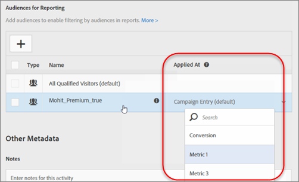
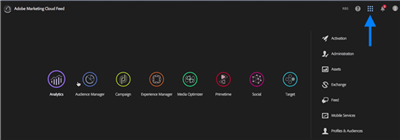

# Notes de mise à jour pour les versions antérieures

Notes de mise à jour pour les versions antérieures dʼ[!DNL Adobe Target], comprenant des notes de mise à jour de [!DNL Target Standard/Premium], la plateforme [!DNL Target] et la bibliothèque JavaScript [!DNL Target] (at.js).

Les notes de mise à jour apparaissent dans l’ordre décroissant de leur date (mois et année) de publication.

>[!NOTE]
>
>Consultez les [Notes de mise à jour Target (actualisées)](/help/main/r-release-notes/release-notes.md#reference_8FE40B43A5A34DDF8F26A53D55EE036A) pour plus d’informations sur les versions de Target du mois en cours (plateforme et Target Standard/Premium).

## Notes de mise à jour - 2025

### [!DNL Target Standard/Premium] 25.5.4 (29 mai 2025)

Cette version comprend les correctifs et mises à jour suivants :

* Correction d’un problème qui empêchait l’ajout ou la modification d’URL en mode AQ. (TGT-51941)
* Ajout d’un paramètre de trafic en mode QA sous [!UICONTROL Reports] > [!UICONTROL Report Settings] (  ) pour s’aligner sur les fonctionnalités de l’ancienne interface utilisateur de [!DNL Target]. (TGT-52228 et TGT-52329)
* Correction d’un problème en raison duquel l’activité basée sur les formulaires générait des liens d’assurance qualité incorrects. L’URL/emplacement de l’activité incluait un « 1 » involontaire à la fin, qui a maintenant été supprimé pour garantir une liaison précise. (TGT-52355 et TGT-52358)
* Correction d’un problème en raison duquel l’activité basée sur les formulaires générait des liens d’assurance qualité incorrects. L’URL d’activité incluait une `http://pid-ppc` involontaire au début de l’URL, qui a été supprimée pour garantir une liaison précise. (TGT-52557)
* Correction d’un problème en raison duquel [!DNL Target] générait des liens d’assurance qualité non valides pour les activités basées sur des formulaires. (TGT-52528 et TGT-52603)
* Correction d’un problème en raison duquel l’enregistrement d’une activité modifiée semblait être en cours de traitement, mais n’était jamais terminé, et aucun message d’erreur ne s’affichait dans [!DNL Target]. (TGT-52461)
* Correction d’un problème en raison duquel le [!UICONTROL Visual Experience Composer] mis à jour (VEC) ne parvenait pas à détecter automatiquement la valeur `at_property`. (TGT-52347)
* Correction d’un problème en raison duquel deux modifications étaient enregistrées alors qu’une seule était attendue après le basculement entre les modes [!UICONTROL Browse] et [!UICONTROL Design] dans le VEC lors de l’interaction avec un élément de formulaire. (TGT-52455)
* Correction d’un problème qui empêchait la sélection du paramètre [!UICONTROL Clicked an Element] dans le VEC mis à jour en raison d’une erreur indiquant que le sélecteur était non valide, déjà utilisé ou non visible. (TGT-52467)
* Correction d’un problème en raison duquel l’ajout d’une zone de [!UICONTROL Recommendation Offer] dans le VEC mis à jour entraînait l’affichage de zones en double (fantômes). Le passage entre les expériences A et B a permis d’ajouter plusieurs zones fantômes. (TGT-52505 et TGT-52519)
* Correction d’un problème dans l’interface utilisateur de [!DNL Target] mise à jour en raison duquel les modifications apportées à une offre HTML via le menu [!UICONTROL Offer] n’étaient pas répercutées dans l’activité associée, et vice versa. Ce comportement correspond désormais à l’interface utilisateur héritée, où les mises à jour se synchronisent correctement entre le menu [!UICONTROL Offer] et l’activité. (TGT-52540 et TGT-52541)
* Correction d’un problème en raison duquel les mises à jour récentes des [!UICONTROL Experience Fragments] dans les [!UICONTROL Offers Library] n’étaient pas prises en compte lors de leur utilisation dans une activité. (TGT-52659)
* Correction d’un problème de localisation dans la traduction chinoise simplifiée d’un message de confirmation. La version précédente ne comportait pas de guillemets autour du nom de l’emplacement et utilisait un langage informel, contrairement au guide de style du client. La traduction mise à jour utilise désormais une ponctuation correcte et un ton formel. (TGT-52364)

### [!DNL Target Standard/Premium] 25.5.3 (22 mai 2025)

Cette version comprend les correctifs et mises à jour suivants :

* Correction d’un problème en raison duquel la fonction de recherche par nom dans la liste [!UICONTROL Activities] ne fonctionnait pas correctement avec les requêtes à plusieurs mots. (TGT-52529)
* Correction d’un problème qui empêchait l’exclusion d’expériences des activités [!UICONTROL Automated Personalization] (AP). (TGT-52383)
* Correction d’un problème en raison duquel l’option « [!UICONTROL Contains] » était absente des [!UICONTROL Filter Rules] lors de la gestion du contenu dans les activités AP. (TGT-52384)
* Correction d’une incohérence dans les rapports des activités [!UICONTROL Automated Personalization] (AP), spécifiquement liée à la manière dont les offres par défaut sont suivies et signalées à l’aide de valeurs `optionLocalId` du système interne de [!DNL Target].
* Correction d’un problème en raison duquel les liens d’assurance qualité ne fournissaient pas l’expérience d’activité prévue. (TGT-52163)
* Correction d’un problème en raison duquel les utilisateurs disposant d’autorisations [!UICONTROL Approver] étaient incorrectement bloqués lors de la modification des activités en direct, et recevaient un message d’erreur « Accès refusé ». (TGT-52416)
* Correction d’un problème en raison duquel les ajustements d’audience ne s’affichaient pas pour certaines activités dans l’interface utilisateur de [!DNL Target] mise à jour. (TGT-52057)
* Correction d’un problème en raison duquel les affinements d’audience et les audiences d’activité étaient inversés dans l’interface utilisateur mise à jour. (TGT-52158)
* Correction d’un problème en raison duquel la génération d’offres ad hoc entraînait des offres en double. (TGT-51938)
* Correction d’un problème qui bloquait les mises à jour d’offre et affichait incorrectement une erreur « Utilisateur non valide ». (TGT-52361)
* Correction d’un problème qui empêchait l’enregistrement des activités existantes et déclenchait une erreur « Entrée utilisateur non valide ». (TGT-52422)
* Correction d’un problème qui bloquait la modification des offres HTML existantes et déclenchait une erreur « Entrée utilisateur non valide » lors de l’enregistrement, même si aucune modification de code n’était apportée. (TGT-52351)
* Correction d’un problème qui empêchait [!DNL Target] de reconnaître le caractère « # » dans l’URL d’un site web. (TGT-52093)
* Correction d’un problème qui empêchait la modification des activités [!DNL Recommendations] pour ajouter ou mettre à jour des promotions, ce qui provoquait des échecs d’enregistrement et des promotions en double. (TGT-52343)
* Correction d’un problème qui empêchait les modifications apportées aux critères ou aux conceptions dans les activités [!DNL Recommendations], ce qui entraînait une erreur « JSON non valide : nom de propriété non reconnu ». (TGT-52375)
* Correction d’un problème en raison duquel les critères de séquence ne s’affichaient pas correctement dans le [!UICONTROL Visual Experience Composer] (VEC) pour les activités [!DNL Recommendations]. (TGT-52435)
* Correction d’un problème en raison duquel les vues n’étaient pas correctement identifiées sur les pages SPA lors de l’utilisation du [!DNL Adobe Experience Platform Web SDK] . (TGT-52106)
* Correction d’un problème en raison duquel les détails d’ODS (On-Device Decisioning) n’étaient pas enregistrés correctement, bien qu’ils aient été inclus dans la payload de l’opération par lots. (TGT-52406)
* Ajout d’un champ `audienceMetadata` aux activités, permettant sa lecture et sa mise à jour lors de la modification. (TGT-51004)
* Ajout d’un message d’erreur pour alerter les utilisateurs lorsqu’une période d’audience n’est pas valide. (TGT52522)
* Mise à jour de la structure des activités pour prendre en charge les audiences en double de différents types. (TGT-51200)

### Version [!DNL Adobe Target] [!DNL AI Assistant] (16 mai 2025)

Nous sommes ravis d&#39;annoncer le lancement du [!DNL AI Assistant] en [!DNL Adobe Target] ! Cette puissante fonctionnalité d’interface utilisateur est conçue pour vous aider à parcourir et à comprendre facilement [!DNL Target] concepts. Disponible sur plusieurs produits en [!DNL Adobe Experience Cloud], dont [!DNL Target], [!DNL AI Assistant] est là pour révolutionner votre expérience.

[!DNL AI Assistant] dans [!UICONTROL Target] est un outil de conversation que vous pouvez utiliser pour accélérer vos workflows avec des applications et des services [!DNL Experience Platform]. Utilisez [!DNL AI Assistant] pour accroître votre productivité globale et améliorer votre compréhension des connaissances sur les produits

En [!DNL Target], la première phase d’[!DNL AI Assistant] fournit une connaissance inestimable des produits, basée sur la documentation [!DNL Experience League]. Que vous configuriez un script de profil, résolviez les erreurs ou envisagiez une mise à niveau vers AEP Web SDK, [!DNL AI Assistant] a tout prévu.

Pour plus d’informations, consultez la présentation de l’assistant d’IA de Adobe Experience Platform [&#128279;](/help/main/c-intro/ai-assistant.md).

### [!DNL Target Standard/Premium] 25.5.2 (8 mai 2025)

Cette version comprend les correctifs et mises à jour suivants :

* [!DNL Target] utilisateurs disposant de droits [!UICONTROL Product Administrator] et [!UICONTROL System Administrator] peuvent désormais modifier tous les paramètres des pages [!UICONTROL Administration], quel que soit leur rôle dans [!DNL Target]. Les utilisateurs ne disposant pas de ces autorisations ont accès en lecture seule à ces paramètres. Cette mise à jour garantit un contrôle d’accès plus strict sur les [paramètres d’administration](/help/main/administrating-target/administrating-target.md). (TGT-48179)
* Correction d’un problème de mise en cache qui empêchait l’enregistrement de l’activité [Préférences du site](/help/main/c-experiences/c-visual-experience-composer/viztarget-options.md#settings). (TGT-52213)
* Correction d’un problème en raison duquel les clients ne pouvaient pas activer la sélection par ID et classe dans la section [!UICONTROL Site Preferences] après le chargement du site dans le VEC. Le paramètre [!UICONTROL Site Preferences] est automatiquement rétabli à désactivé même après activation. (TGT-52207)
* Correction d’un problème en raison duquel le [!UICONTROL Visual Experience Composer] (VEC) n’affichait pas la page correcte lorsque les URL [diffusion de page](/help/main/c-experiences/c-visual-experience-composer/viztarget-options.md#settings) se terminaient par une barre oblique (/). (TGT-52237)
* Correction d’un problème qui empêchait la suppression des modifications de code personnalisé lors du changement d’expériences. (TGT-52240)
* Correction d’un problème en raison duquel les modifications d’HTML dans le VEC recouvraient des éléments de page existants. (TGT-52265)
* Correction d’un problème qui empêchait la modification du code personnalisé dans le VEC mis à jour en raison du fait que le code personnalisé existant n’était pas visible dans l’éditeur. (TGT-52272)
* Correction d’un problème entraînant l’affichage d’un message d’erreur « Les noms en double ne sont pas autorisés » lors de l’enregistrement d’une activité Recommendations. (TGT-52318)
* Correction d’un problème dans le VEC mis à jour qui empêchait les clients et clientes de modifier des éléments de texte ou de supprimer des objets conteneur. (TGT-52348)
* Correction d’un problème qui empêchait l’affichage correct des [!DNL Customer Journey Analytics] sur une page de [!UICONTROL Overview] d’activités. (TGT-52359)
* Correction d’un problème qui empêchait les groupes de génération de rapports de persister dans les activités [!UICONTROL Automated Personalization] (AP). (TGT-52368)
* Correction d’un problème qui empêchait l’enregistrement des activités qui incluaient Offer Decisioning. (TGT-52390)
* Correction d’un problème où l’offre par défaut était sélectionnée, mais où le contenu d’autres offres était affiché dans les activités [!UICONTROL Automated Personalization] (AP) et [!UICONTROL Multivariate Test] (MVT). (TGT-52372)
* Correction de la logique des autorisations GET pour vérifier avec OU entre l’accès complet à l’organisation et l’accès spécifique organisation + utilisateur. (TGT-52374)
* Correction d’un problème en raison duquel les noms d’audience ne s’affichaient pas après la sélection d’une audience pour [!UICONTROL Managed Content] et [!UICONTROL Reporting Audiences], même si [!UICONTROL Show Only Selected] était activé. (TGT-52393)

### [!DNL Target Standard/Premium] 25.5.1 (5 mai 2025)

Cette version comprend les correctifs et mises à jour suivants :

* Correction d’un problème qui empêchait l’affichage d’ajustements d’audience pour certaines activités dans l’interface utilisateur mise à jour. (TGT-52057)
* Correction d’un problème qui empêchait l’utilisation d’audiences combinées dans les activités . (TGT-52346)
* Correction d’un problème qui empêchait la création d’une activité dans un espace de travail autre que celui par défaut à l’aide d’une audience d’activité unique du même espace de travail. (TGE-52349)
* Correction d’un problème en raison duquel les audiences d’activité uniquement disparaissaient de l’interface utilisateur mise à jour après la création et la sélection d’une nouvelle audience. (TGT=52091)
* Correction d’un problème qui empêchait l’utilisation d’audiences en double dans les activités . (TGT-51200 et TGT-52057)
* Correction d’un problème en raison duquel les affinements d’audience et les audiences d’activité étaient inversés dans l’interface utilisateur mise à jour. (TGT-52158)
* Correction d’un problème qui empêchait la création d’une nouvelle activité en raison de l’erreur de saisie utilisateur : « Espace de travail non par défaut non autorisé pour cet utilisateur ». (TGT-52267)
* Correction d’un problème qui empêchait l’affichage des offres dans l’interface utilisateur mise à jour pour les espaces de travail par défaut et non par défaut. [!DNL Target] affiche désormais les offres des deux espaces de travail. (TGT-52339)
* Correction d’un problème en raison duquel [!DNL Target] n’avertissait pas les clients lors de la modification d’une activité et d’un élément de site web modifié. (TGT-52100)
* Correction d’un problème en raison duquel la modification d’une offre avec des offres ad hoc créait une nouvelle offre au lieu de mettre à jour l’offre existante. (TGT-52135)
* Correction d’un problème qui provoquait une erreur de payload non valide lors du déplacement d’offres vers des dossiers. (TGT-52325)
* Correction d’un problème qui provoquait une erreur de saisie de l’utilisateur lors du déplacement d’offres vers des dossiers. (TGT-52296)
* Ajout d’un champ `audienceMetadata` pour chaque activité et vérification de sa lecture et de sa mise à jour lors de sa modification. (TGT-51004)

### [!DNL Target Standard/Premium] 25.4.5 (25 avril 2025)

Cette version comprend les correctifs et mises à jour suivants :

* Correction d’un problème qui entraînait des incohérences dans les listes d’audience entre la page des paramètres de [!UICONTROL Activity] et la page d’aperçu des [!UICONTROL Reporting]. (TGT-52203)
* Correction d’un problème qui empêchait l’ajout d’une nouvelle page à une activité en raison d’une erreur d’entrée utilisateur non valide. (TGT-52263)
* Correction d’un problème en raison duquel les `OptionLocalIDs` étaient incorrectement incrémentées lorsque l’option restait inchangée. (TGT-52187)
* Correction d’un problème en raison duquel `location` et `OptionLocalIDs` s’incrémentaient incorrectement lorsque l’option restait inchangée. (TGT-52188)
* Correction d’un problème en raison duquel l’emplacement sur la page [!UICONTROL Overview] de l’activité était incorrect. (TGT-52182)
* Correction d’un problème où un avertissement de sélecteur non valide ne s’affichait pas pour un emplacement non valide. (TGT-52110)
* Correction d’un problème en raison duquel les fichiers de création de rapports téléchargés affichaient correctement les données présentes dans l’interface utilisateur de création de rapports. (TGT-52068)
* Correction d’un problème en raison duquel les opérations par lots n’échouaient pas après l’ajout de règles de diffusion de page. (TGT-52097)
* Correction d’un problème en raison duquel [!DNL Target] supprimait tous les paramètres de requête de l’URL du site web. (TGT-52100)
* Correction d’une erreur de console qui empêchait les clients de créer des activités dans l’interface utilisateur de [!DNL Target] héritée et mise à jour. (TGT-52181)
* Correction d’un problème qui empêchait les clients et clientes d’ajouter de nouvelles pages, provoquant une erreur d’entrée utilisateur non valide. (TGT-52258)
* Correction d’un problème en raison duquel les modifications disparaissaient après l’ajout de pages supplémentaires, puis en revenant à l’onglet [!UICONTROL Experiences] . (TGT-52264)
* Correction d’un problème qui empêchait les clients et clientes de modifier l’audience dans une activité [!UICONTROL Experience Targeting] (XT). (TGT-52191)
* Correction d’une erreur qui empêchait la modification d’une activité XT en raison d’une règle d’IU non prise en charge. (TGT-52273)
* Correction d’un problème dans le [!UICONTROL Visual Experience Composer] mis à jour (VEC) en raison duquel les chemins de navigation n’étaient pas toujours affichés en bas de l’éditeur, ce qui entraînait des difficultés pour sélectionner précisément les éléments. (TGT-52169)
* Correction d’un problème en raison duquel la liste déroulante [!UICONTROL Audience] n’affichait pas toutes les audiences en raison de la pagination. (TGT-52204)
* Correction d’un problème qui entraînait un message d’entrée utilisateur non valide lors de l’ajout de nouvelles offres dans les activités [!UICONTROL Automated Personalization] (AP). (TGT-52210)
* Correction d’un problème en raison duquel [!UICONTROL Analytics for Target] (A4T) était incorrectement sélectionné comme source de création de rapports, même si le client n’avait pas accès à A4T. (TGT-52226)
* Correction d’un problème qui empêchait l’enregistrement d’une activité avec la mesure URL [!UICONTROL View a Page]. (TGT-52260)
* Correction d’un problème qui empêchait les clients de sélectionner des espaces de travail lors de la création d’offres dans une activité. (TGT-52289)
* Correction d’un problème qui empêchait les clients de créer des activités dans tous les espaces de travail. (Tgt-52218)
* Correction d’un problème où les modifications d’une expérience s’affichaient incorrectement lors du passage à une autre expérience. (TGT-52184)
* Correction d’un problème en raison duquel l’offre par défaut s’affichait incorrectement dans l’interface utilisateur de [!DNL Target] lors de l’ouverture de l’activité. (TGT-52198)

### Mise à jour des autorisations Target (22 avril 2025)

Cette future mise à jour améliore le contrôle organisationnel sur les configurations d’instance de [!DNL Target], empêchant les mises à jour accidentelles qui pourraient affecter la diffusion des activités entre différentes équipes de test et de personnalisation.

À compter du 22 avril 2025, seuls les administrateurs [!UICONTROL Product] et [!UICONTROL Solutions] pourront mettre à jour les paramètres des sections [!UICONTROL Administration], quels que soient leurs rôles dans les espaces de travail [!DNL Target]. Les utilisateurs ne disposant pas de cette autorisation auront un accès en lecture seule aux sections [!UICONTROL Administration].

Pour plus d’informations, voir [ Administration de Target ](/help/main/administrating-target/start-target.md).

### [!DNL Target Standard/Premium] 25.4.4 (17 avril 2025)

Cette version comprend les correctifs et mises à jour suivants :

* Ajout d’un message d’erreur pour guider les utilisateurs et utilisatrices dans la résolution des options en double dans une activité. (TGT-51927)
* Correction d’un problème en raison duquel les sélecteurs `ClickTrack` n’étaient pas supprimés lors de la suppression de pages ou d’expériences avec des offres de redirection. (TGT-51952)
* Correction d’un problème lié à l’autorisation de sélecteurs de `ClickTrack` vides. [!DNL Target] nécessite désormais que le champ de sélecteur ne soit pas vide. (TGT-52107)
* Correction d’un problème qui autorisait incorrectement les mesures avec des noms en double. Les mesures nécessitent désormais des noms uniques. (TGT-52201)
* Correction d’un problème en raison duquel les définitions d’audience n’étaient pas visibles lors de la modification du ciblage au niveau des offres dans les activités [!UICONTROL Automated Personalization] (AP). (TGT-52148)
* Correction d’un problème qui empêchait les clients disposant de droits d’[!UICONTROL Editor] d’enregistrer les activités. (TGT-52227)
* `OptionLocalIDs` n’incrémente plus incorrectement lorsque l’option reste inchangée. (TGT-52139)
* Correction d’un problème qui provoquait un message « `optionLocalIds` non valide » lors de la création d’une activité. (TGT-52154)
* Des écarts ont été corrigés entre les `OptionLocalIDs` définis pour une activité et ceux utilisés pour définir les expériences. (TGT-52215)
* Correction d’un problème qui provoquait un échec de validation lors de la tentative de création d’une activité A/B. (TGT-51923)

### [!DNL Target Standard/Premium] 25.4.3 (11 avril 2025)

Cette version comprend les correctifs et mises à jour suivants :

* Correction d’une erreur qui empêchait les clients d’ouvrir le pop-up d’informations sur l’audience pour certaines activités [!UICONTROL Experience Targeting] (XT). (TGT-52049)
* Correction d’un problème en raison duquel le paramètre d’audience revenait à « [!UICONTROL All Visitors] » suite aux modifications apportées au [!UICONTROL Visual Experience Composer] (VEC). (TGT-52132)
* Correction d’un problème où les ajustements d’audience n’étaient pas affichés pour des activités spécifiques (TGT-52057)
* Correction d’un problème qui empêchait les clients d’insérer un [!UICONTROL Experience Fragment] dans l’espace de travail par défaut. (TGT-52073)
* Correction d’un problème en raison duquel une offre affichait « Contenu introuvable » et ne s’affichait pas sur la page [!UICONTROL Offers] pour une activité [!UICONTROL Automated Personalization] (AP). (TGT-52150)
* Ajout de la possibilité d’autoriser les audiences en double dans une activité. (TGT-51200)
* Correction d’un problème en raison duquel un nom de mbox incorrect s’affichait sur la page [!UICONTROL Goals & Settings] d’une activité XT après modification. (TGT-52026)
* Correction d’un problème en raison duquel les `defaultContent` s’affichaient dans les options alors qu’elles n’étaient pas dans les `experiences/optionLocations`. (TGT-52036)
* Correction d’un problème pour s’assurer que les chaînes vides ne sont pas converties en valeurs nulles. (TGT-52037)
* Correction d’un problème en raison duquel les clients devaient reconfigurer le [!UICONTROL Optimization Goal] dans [!UICONTROL Reporting Settings] sur la page [!UICONTROL Goals & Settings] après les modifications. (TGT-52071)
* Correction d’un problème en raison duquel une activité sans règles de diffusion de page affichait plusieurs règles sur la page [!UICONTROL Overview]. (TGT-52084)
* Ajout d’un message d’erreur pour les utilisateurs qui tentent d’enregistrer une offre avec des caractères en dehors du plan multilingue de base, tels que des émoticônes. (TGT-52105)
* Correction d’un problème en raison duquel l’ouverture d’une activité déclenchait le message d’erreur : « Cette activité utilise une ou plusieurs audiences supprimées à la source ». (TGT-52120)
* Correction d’un problème en raison duquel les mesures ClickTrack n’étaient pas affichées dans le [!UICONTROL Visual Experience Composer] mis à jour (VEC) lors de la modification. (TGT-52152)
* Correction d’un problème en raison duquel une URL avec un paramètre de requête comme emplacement de l’activité n’affichait pas le paramètre de requête sur la page de [!UICONTROL Overview] de l’activité. (TGT-51635)
* Correction d’un problème qui empêchait l’affichage de l’URL d’expérience entière dans [!UICONTROL Browse mode] dans le [!UICONTROL Visual Experience Composer] (VEC). (TGT-52101)
* Correction d’un problème en raison duquel la modification d’une activité entraînait l’ajout d’un caractère « / » à la fin de l’URL par la diffusion de la page, la rendant non valide. (TGT-52114)
* Correction d’un problème en raison duquel le lien [!UICONTROL Activity QA] dans le [!UICONTROL Form-Based Experience Composer] était incorrectement redirigé vers la page d’accueil [!DNL Adobe Experience Cloud]. (TGT-52055)
* Correction d’un problème en raison duquel les pages supplémentaires ajoutées à l’activité [!UICONTROL A/B Test] n’étaient pas conservées après l’enregistrement et la réouverture. (TGT-51994)
* Correction d’un problème qui empêchait les clients de supprimer des styles dans la section Style intégré . (TGT-52070)
* Restauration de l’accès aux [cartes de définition d’audience](/help/main/c-target/c-audiences/audiences.md#section_11B9C4A777E14D36BA1E925021945780) dans la boîte de dialogue [!UICONTROL Activity QA], comme dans l’interface utilisateur héritée. (TGT-52056)
* L’interface utilisateur mise à jour n’a pas enregistré de pages ou d’audiences sans modifications. Si les clients ajoutaient de nouvelles pages ou audiences à une activité mais ne leur apportaient aucune modification, [!DNL Target] ignoraient les audiences non modifiées lors de l’enregistrement. Des notifications ont été ajoutées aux endroits appropriés pour informer les utilisateurs de ce comportement. (TGT-52104)

### [!DNL Target Standard/Premium] 25.4.1 (2 avril 2025)

Cette version comprend les correctifs et mises à jour suivants :

* Correction d’un problème en raison duquel les audiences d’expérience disparaissaient des activités . (TGT-52003)
* Correction d’un problème qui provoquait des éléments inattendus lors de la diffusion. (TGT-52011)
* Correction d’un problème qui empêchait les clients et clientes d’afficher l’audience dans le graphique de ciblage sur la page [!UICONTROL r] vue et lors de la modification de l’activité. (TGT-52050)
* Correction d’un problème qui empêchait les clients de réorganiser les expériences par ordre de priorité dans les activités [!UICONTROL Experience Targeting] (XT). (TGT-52054)
* Correction d’un problème qui provoquait un rendu incorrect lors de l’annulation de modifications de style de texte. (TGT-51876)
* Correction d’un problème en raison duquel, lors de la modification d’une offre de redirection, [!DNL Target] supprime également tous les sélecteurs de [!UICONTROL ClickTrack] associés à cette offre. (TGT-51936)
* Correction d’un problème en raison duquel [!DNL Target] enregistrait incorrectement le sélecteur lors de l’annulation du [!UICONTROL ClickTrack]. (TGT-51937)
* Correction d’un problème qui déclenchait une erreur de nom non valide après l’ouverture et la fermeture du sélecteur de mbox sur la page [!UICONTROL Goals & Settings] sans apporter de modifications. (TGT-51983)
* Correction d’un problème qui bloquait la modification des offres ad hoc créées dans l’interface utilisateur de [!DNL Target] héritée. (TGT-51984)
* Correction d’un problème qui bloquait les activités de modification comportant des offres ad hoc contenant du code personnalisé. (TGT-51995)
* Correction d’un problème en raison duquel les règles d’exclusion s’affichaient en tant que règles d’inclusion lors de la modification des définitions d’audience combinées. (TGT-51999)
* Correction d’un problème qui empêchait l’affichage correct du code personnalisé lors de l’édition de l’expérience. (TGT-52005)
* Correction d’un problème qui rendait l’option [!UICONTROL Insert Before] indisponible pour insérer du contenu avant la barre de navigation. (TGT-52031)
* Correction d’un problème qui empêchait la mise en surbrillance correcte de l’expérience par défaut dans les rapports. (TGT-51716)
* Correction d’un problème qui déclenchait un message `default message [Invalid optionLocalIds: xx]]` lors de la création d’une activité. (TGT-52038)

### at.js version 2.11.8 (31 mars 2025)

* Résolution d’une vulnérabilité identifiée par CodeQL dans la validation du suffixe de chaîne pour empêcher les cas Edge lors des opérations de redimensionnement et de déplacement. (TNT-51516)

### [!DNL Target Standard/Premium] 25.3.8 (28 mars 2025)

Cette version comprend les correctifs et mises à jour suivants :

* Correction d’un problème en raison duquel la page [!UICONTROL Activities] se chargeait lentement. (TGT-51151)

### [!DNL Target Standard/Premium] 25.3.7 (26 mars 2025)

Cette version comprend les correctifs et mises à jour suivants :

* Correction d’un problème qui bloquait l’enregistrement des activités multi-pages si une page était supprimée après des modifications. (TGT-51988)
* Correction d&#39;une erreur qui se produisait lors de la modification d&#39;une activité : `default message [Invalid optionLocalIds: xx]]`. (TGT-51985)
* Correction d’un problème en raison duquel l’ajout de nouvelles modifications à une activité supprimait les modifications existantes. (TGT-51981)
* Correction d’un problème où le remplacement d’une audience par « [!UICONTROL All visitors] » lors de la création ou de la modification d’une activité provoquait une erreur « Les audiences en double ne sont pas autorisées ». (TGT-51978)
* Correction d’un problème qui provoquait une erreur « Entrée utilisateur non valide » lors de l’enregistrement d’une activité [!UICONTROL A/B Test]. (TGT-51976)
* Correction d’un problème qui empêchait l’affichage correct des mesures calculées sur la page [!UICONTROL Goals & Settings] . (TGT-51975)
* Correction d’un problème qui empêchait la correspondance des `companyName` et des `reportSuite` dans la configuration [!DNL Analytics] pour la mesure `pageviews`. (TGT-51965)
* Correction d’un problème en raison duquel le changement d’expérience dans une activité supprimait les modifications. (TGT-51945)
* Correction d’un problème en raison duquel la suppression d’une audience de page supprimait également les sélecteurs [!UICONTROL ClickTrack]. (TGT-51935)
* Correction d’un problème qui rendait une activité non modifiable après l’ouverture de sa page [!UICONTROL Overview]. (TGT-51931)
* Correction d’un problème qui provoquait une erreur `[Unused optionLocalIds: 0]]` lors de la création de l’activité. (TGT-51920)
* Correction d’un problème en raison duquel certaines modifications n’étaient pas correctement traduites après la suppression des modifications de style de texte. (TGT-51876)
* Correction d’un problème qui empêchait la mise à jour correcte des audiences ciblées dans le [!UICONTROL Form-Based Experience Composer] . (TGT-51845)
* Correction d’un problème en raison duquel l’URL dans le [!UICONTROL Visual Experience Composer] n’était pas correctement mise à jour pendant la navigation de l’activité. (TGT-51832)
* Correction d’un problème qui empêchait l’affichage des offres dans l’interface utilisateur de [!UICONTROL Offers], même si elles s’affichaient correctement lors de la création d’une activité et de l’ajout d’offres. (TGT-51805)
* Correction d’un problème en raison duquel certaines activités ne disposaient pas d’écran de secours pour afficher le contenu par défaut lorsque le contenu personnalisé ou ciblé ne pouvait pas être diffusé. (TGT-51638)
* Correction d’un problème qui empêchait l’affichage correct des offres en direct et de certains dossiers dans l’interface utilisateur de [!UICONTROL Offers]. (TGT-51628)
* Correction d’un problème qui empêchait la localisation correcte de certaines chaînes d’URL et de certaines goURL. (TGT-35741)
* Correction d’un problème qui empêchait la localisation correcte des rôles ([!UICONTROL Approver], [!UICONTROL Editor] et [!UICONTROL Observer]) dans l’interface utilisateur de [!DNL Target]. (TGT-29925)

### [!DNL Target Standard/Premium] 25.3.6 (14 mars 2025)

Cette version comprend les correctifs et mises à jour suivants :

* Résolution de l’erreur « Entrée utilisateur non valide » dans les activités [!UICONTROL Visual Experience Composer] (VEC) avec [!UICONTROL Click Tracking] activé lorsque le même sélecteur de [!UICONTROL ClickTrack] est utilisé plusieurs fois. (TGT-51921)
* Correction de l’erreur « Entrée utilisateur non valide » dans les activités du compositeur d’expérience visuelle avec des emplacements partagés (par exemple, le sélecteur HEAD) et des offres identiques. (TGT-51879)
* Correction d’un problème en raison duquel les modifications d’expérience étaient partagées entre les audiences. (TGT-51815)
* Résolution des erreurs de validation lors de la création d’activités en raison de conflits d’identifiants de segment. Les erreurs se produisaient lorsque [!DNL Target] détectait des activités existantes à l’aide de segments anonymes. (TGT-51784)
* Résolution d’un problème qui empêchait [!DNL Target] d’enregistrer les activités avec des règles d’exclusion dans une audience. (TGT-51581)
* Correction d’un problème qui empêchait les clients de créer, supprimer ou déplacer des dossiers sans accéder à l’espace de travail par défaut. (TGT-51499)
* Résolution d’un problème en raison duquel les requêtes GET échouaient lors de la récupération de [!DNL Analytics] liste de mesures. (TGT-51106)

### [!DNL Target Standard/Premium] 25.3.5 (11 mars 2025)

Cette version comprend les correctifs et mises à jour suivants :

* Correction d’un problème qui empêchait les utilisateurs de modifier les offres dans le panneau [!UICONTROL Modifications]. (TGT-51800)
* Correction d’un problème où les actions s’affichaient incorrectement dans le panneau de gauche pour les expériences et les audiences, y compris en mode [!UICONTROL ClickTrack]. (TGT-51895)
* Correction d’un problème où les sélecteurs [!UICONTROL ClickTrack] n’étaient pas appliqués à la bonne page d’audience. (TGT-51871)

### [!DNL Target Standard/Premium] 25.3.4 (7 mars 2025)

Cette version comprend les correctifs et mises à jour suivants :

* Correction d’un problème où les audiences d’activité unique n’étaient pas visibles dans le panneau [!UICONTROL Audiences], empêchant leur modification ou leur réutilisation. (TGT-51860)
* Correction d’un problème qui empêchait les clients [!DNL Target Standard] de créer des activités à l’aide des rapports [!UICONTROL Analytics for Target] (A4T). (TGT-51854)
* Correction d’un problème qui excluait les compteurs d’identifiants locaux de la payload lors des opérations de création et de modification par lots. (TGT-51867)

### [!DNL Target Standard/Premium] 25.3.2 (6 mars 2025)

Cette version comprend les correctifs et mises à jour suivants :

* Correction d’un problème en raison duquel la copie d’une activité avec une audience d’activité unique ne permettait pas de créer une activité, utilisant par erreur l’audience de l’activité originale à la place. (TGT-51855)
* Correction d’un problème qui empêchait la modification des activités [!UICONTROL Experience Targeting] (XT) avec des audiences d’activité uniquement. (TGT-51846)
* Correction d’un problème en raison duquel le [!UICONTROL Visual Experience Composer] (VEC) n’appliquait pas correctement les modifications à une expérience lors de la première modification. (TGT-51843)
* Correction d’un problème qui déclenchait une erreur « ID » lors d’un clic sur certains éléments dans le VEC. (TGT-51814)
* Mise à jour de la gestion des erreurs dans le VEC lors de la création de l’activité. (TGT-51759)
* Correction d’un problème en raison duquel une vue manquante dans le panneau [!UICONTROL Modifications] provoquait une erreur « entrée utilisateur non valide » lors de l’enregistrement de l’activité. (TGT-51827)
* Correction d’un problème qui empêchait la création de critères de recommandation. (TGT-51834)
* Ajout d’un message de confirmation avant la redirection vers une autre URL. (TGT-51703)
* Correction de problèmes liés aux tests d’intégration de GraphQL dans les offres et les dossiers. (TGT-51839)

### [!DNL Target Standard/Premium] 25.3.1 (3 mars 2025)

Cette version comprend les correctifs et mises à jour suivants :

* Une audience combinée peut inclure des sous-groupes, chacun contenant plusieurs audiences. Cette version a corrigé un problème qui empêchait l’affichage des audiences de sous-groupe dans la boîte de dialogue [!UICONTROL Rules]. (TGT-51813)
* Correction d’un problème où certaines audiences d’expérience étaient remplacées par des [!UICONTROL All Visitors] lors de l’ouverture d’anciennes activités. (TGT-51812)
* Correction d’un problème qui empêchait la modification des activités avec des audiences d’activité uniquement. (TGT-51807)
* Correction d’un problème qui empêchait la modification des modifications d’en-tête de page dans l’interface utilisateur [!DNL Target] mise à jour. (TGT-51797)
* Correction d’une erreur « null » qui se produisait lors de la duplication d’une expérience, de la suppression d’une autre expérience, puis de la tentative d’enregistrement de l’activité. (TGT-51796)
* Correction d’un problème qui empêchait l’affichage des règles d’exclusion d’audience dans le panneau d’informations de l’audience lors de l’étape [!UICONTROL Targeting] de la création d’activités. (TGT-51579)
* Mise à jour des messages d&#39;erreur en coréen. (TGT-51701 et TGT-51699)

### [!DNL Target Standard/Premium] 25.2.3 (26 février 2025)

Cette version comprend les mises à jour suivantes :

* Correction d’un problème qui empêchait les mises à jour des activités après [!DNL Target] version 25.2.1 pour certaines activités. (TGT-51781)
* Correction d’un problème où toutes les modifications d’audience dans l’état étaient supprimées lors de l’annulation du processus de création d’activités (en sélectionnant [!UICONTROL Cancel] au lieu de [!UICONTROL Add Audience]). (TGT-51769 et TGT-51770)
* Correction d’un problème en raison duquel le chargement du [!UICONTROL Visual Experience Composer] (VEC) échouait pour certaines activités, en particulier lorsque du code personnalisé était utilisé.  En raison d’un problème, le VEC affichait un écran vide ou l’interface utilisateur de [!DNL Target] revenait à son ancienne version. (TGT-51758)
* Correction d’un problème où les modifications étaient ignorées après la modification de la diffusion de page pour les audiences. (TGT-51756)
* Correction d’un problème où toutes les audiences non métriques (audiences de page et d’expérience) étaient supprimées des activités lors de la modification d’un type de mesure sur la page [!UICONTROL Goals & Settings]. (TGT-51753)
* Correction d’un problème en raison duquel un clic sur [!UICONTROL Cancel] lors de la modification d’une activité faisait naviguer l’interface utilisateur de Target vers la [!UICONTROL Activities List] plutôt que vers la page [!UICONTROL Activity Details]. (TGT-51731)
* Correction d’un problème qui empêchait les clients et clientes de télécharger des rapports via l’option [!UICONTROL Export Reports to CSV]. (TGT-51708)
* Correction d’un problème dans le compositeur d’expérience d’après les formulaires en raison duquel [!DNL Target Standard] clients s’affichaient incorrectement comme utilisant [!UICONTROL Properties], une fonctionnalité [!DNL Target Premium]. (TGT-51678)
* Correction d’un problème qui empêchait l’affichage des attributs [!DNL Adobe Experience Platform] lors de la création de nouvelles offres. (TGT-51665)
* Déplacement de tous les filtres actifs pour [!DNL Recommendations] inventaire vers la recherche rapide, en alignant l’interface utilisateur avec [!UICONTROL Catalog Search] au lieu du rail de [!UICONTROL Filter]. (TGT-50723)

### at.js version 2.11.7 (26 février 2025)

Cette version comprend la mise à jour suivante :

* Correction de la journalisation de la télémétrie lorsque `localStorage` n’est pas disponible. La télémétrie provoquait un problème pour certains clients qui avaient `localStorage` désactivés dans leurs navigateurs.

Pour plus d’informations à ce sujet et sur les versions précédentes d’at.js, voir [Informations détaillées sur les versions du fichier at.js](https://experienceleague.adobe.com/en/docs/target-dev/developer/client-side/at-js-implementation/target-atjs-versions){target=_blank}.

### Target Standard/Premium 25.2.1 (mardi 17 février 2025) {#ui-update-2}

Cette version comprend les mises à jour suivantes :

* Mise à jour de l’interface utilisateur d’[!UICONTROL Activities]
* Mise à jour de l’interface utilisateur d’[!DNL Recommendations]

#### Mise à jour de l’interface utilisateur d’[!UICONTROL Activities]

Alors que les efforts de modernisation de l’interface utilisateur de [!DNL Adobe Target] se poursuivent, nous sommes heureux d’annoncer la disponibilité générale de l’interface utilisateur de [!UICONTROL Activities] mise à jour.

>[!NOTE]
>
>À compter du 17 février, les clients auront progressivement accès à la nouvelle interface utilisateur de [!UICONTROL Activities]. Pour garantir un déploiement transparent pour tous les clients, cette version sera déployée par étapes contrôlées. La première étape consiste à mettre à niveau le groupe initial de clients [!DNL Target] vers la nouvelle interface utilisateur de [!UICONTROL Activities]. Les étapes suivantes mettront à niveau les clients restants.

>[!IMPORTANT]
>
>Pour obtenir des informations importantes sur le plan de fin de vie du bouton (bascule) de version de l’interface utilisateur [!DNL Target], voir [[!DNL Target] Obsolescence du bouton (bascule) de version de l’interface utilisateur](/help/main/r-release-notes/release-notes.md#toggle).

En fonction du dernier système de conception [!DNL Adobe Spectrum], la mise à jour normalise les modèles de conception précédemment incohérents, tout en ajoutant de nouvelles améliorations, telles que :

* [Redéfinition des rapports](/help/main/administrating-target/reporting.md) pour une meilleure compréhension des résultats des activités.
* [[!UICONTROL Updated Change Log]](/help/main/c-activities/change-log.md) page, obtenant maintenant les informations du [[!DNL Audit Query API]](https://experienceleague.adobe.com/en/docs/experience-platform/landing/governance-privacy-security/audit-logs/audit-api/overview){target=_blank} pour des informations en temps réel.
* [Vues Liste personnalisables](/help/main/c-activities/activities.md) pour une meilleure flexibilité en fonction des besoins des différentes équipes.
* [Amélioration des écrans d’informations rapides et détaillées](/help/main/c-activities/activities.md) pour un accès plus facile aux informations.
* [Options de recherche et de filtrage persistantes dans la session](/help/main/c-activities/activities.md).
* [ entièrement [!UICONTROL Visual Editing Composer]](/help/main/c-experiences/c-visual-experience-composer/visual-experience-composer.md)reconstruit) avec prise en charge des dernières mises à jour de sécurité des fournisseurs de navigateur et une interface utilisateur moderne.

  Pour plus d’informations sur les différences entre le VEC mis à jour et la version précédente, voir :

   * [Modifications du compositeur d’expérience visuelle](/help/main/c-experiences/c-visual-experience-composer/vec-changes.md)
   * [Options du compositeur d’expérience visuelle](/help/main/c-experiences/c-visual-experience-composer/viztarget-options.md)

* [Mise à jour [!DNL Chrome] extension](/help/main/c-experiences/c-visual-experience-composer/r-troubleshoot-composer/visual-editing-helper-extension.md) prise en charge de Manifest V3 pour une sécurité accrue et une meilleure prise en charge des cookies propriétaires.


#### Mise à jour de l’interface utilisateur d’[!DNL Recommendations]

Alors que les efforts de modernisation de l’interface utilisateur de [!DNL Adobe Target] se poursuivent, nous sommes heureux d’annoncer la disponibilité générale de l’interface utilisateur de [!DNL Recommendations] mise à jour.

>[!NOTE]
>
>À compter du 17 février, les clients auront progressivement accès à la nouvelle interface utilisateur de [!UICONTROL Recommendations]. Pour garantir un déploiement transparent pour tous les clients, cette version sera déployée par étapes contrôlées. La première étape consiste à mettre à niveau le groupe initial de clients [!DNL Target] vers la nouvelle interface utilisateur de [!UICONTROL Activities]. Les étapes suivantes mettront à niveau les clients restants.

En fonction du dernier système de conception [!DNL Adobe Spectrum], la mise à jour normalise les modèles de conception précédemment incohérents, tout en ajoutant de nouvelles améliorations, telles que :

* La [recherche catalogue de produits](/help/main/c-recommendations/c-products/catalog-search.md) comprend désormais une base de données mise à jour permettant une synchronisation en temps réel des produits.
* [!UICONTROL Recommendations] objets ([!UICONTROL Criteria], [!UICONTROL Designs], [!UICONTROL Collections] et [!UICONTROL Exclusions]) [créés via l’API sont désormais disponibles dans l’interface utilisateur](/help/main/c-recommendations/c-recommendations-faq/recommendations-faq.md).
* Les [paramètres Recommendations](/help/main/administrating-target/recommendations-settings.md) ont été consolidés dans la section [!UICONTROL Administration].
* Vues Liste personnalisables pour une meilleure flexibilité en fonction des besoins des différentes équipes.
* Actualisation des éditeurs de code HTML et JSON avec [mise en surbrillance de la syntaxe et numérotation des lignes](/help/main/c-experiences/c-manage-content/create-json-offer.md).
* Amélioration des fenêtres d’informations rapides et détaillées pour un accès plus facile aux informations.
* Options de recherche et de filtrage persistantes dans la session.


### Target Standard/Premium 25.1.1 (vendredi 9 janvier 2025) {#ui-update-1}

Cette version comprend les mises à jour suivantes :

#### Mise à jour de l’interface utilisateur d’[!UICONTROL Offers Library]

Pour améliorer l’expérience utilisateur des utilisateurs [!DNL Adobe Target], cette version met à jour l’interface utilisateur [!UICONTROL Offers Library].

>[!NOTE]
>
>Pour garantir un déploiement transparent pour tous les clients, cette version sera déployée par étapes contrôlées. La première étape a mis à niveau le groupe initial de clients Target vers la nouvelle interface utilisateur d’offres. Les étapes suivantes mettront à niveau les clients restants.

>[!IMPORTANT]
>
>Pour obtenir des informations importantes sur le plan de fin de vie du bouton (bascule) de version de l’interface utilisateur [!DNL Target], voir [[!DNL Target] Obsolescence du bouton (bascule) de version de l’interface utilisateur](/help/main/r-release-notes/release-notes.md#toggle).

En utilisant le dernier système de conception [!DNL Adobe Spectrum], cette mise à jour normalise les modèles de conception incohérents et introduit de nouvelles améliorations, notamment les suivantes :

* **Gestion des offres en masse** : sélectionnez et supprimez ou déplacez plusieurs offres simultanément.

* Mises à niveau de la **[!UICONTROL Code Editor]** : actualisation des éditeurs HTML et JSON avec mise en surbrillance de la syntaxe et numérotation des lignes.

* **Cartes d’offres améliorées** : cartes d’informations rapides et détaillées améliorées pour un accès plus facile aux informations.

* **Recherche et filtres persistants** : ajoute des options de recherche et de filtrage persistantes dans la session.

Pour plus d’informations, consultez [Offres](/help/main/c-experiences/c-manage-content/manage-content.md) et les sous-articles de cette section. Tous les articles Offres de cette section ont été mis à jour pour prendre en compte ces modifications de l’interface utilisateur.

Regardez cette courte vidéo pour découvrir les modifications apportées à cette version :


## Notes de mise à jour - 2024

### Optimisation de la portée de la [!DNL Adobe Experience Platform Web SDK] `__view__` (22 octobre 2024)

Entre le 22 juillet 2024 et le 15 août 2024, l’équipe [!DNL Target] a optimisé la portée du `__view__`, améliorant la précision des impressions d’activité, des visites et des rapports des visiteurs. Cette optimisation vise à capturer automatiquement les données de rapport pour les propositions générées automatiquement et doit être transparente pour la plupart des comptes.

Cette optimisation sera activée pour tous les nouveaux clients [!DNL Adobe Experience Platform Web SDK]. Toutefois, l’optimisation est désactivée pour les clients qui ont migré depuis at.js et n’ont pas suivi les étapes d’implémentation ci-dessous. Nous recommandons vivement à ces clients de passer en revue leurs mises en œuvre d’ici le 3 février 2025. Passée cette date, nous activerons l’optimisation pour tous les clients. Si vous ne révisez pas et n’ajustez pas les implémentations d’ici là, les rapports peuvent être affectés, comme mentionné ci-dessous. Contactez [!DNL Adobe Customer Care] si vous devez confirmer si votre implémentation est affectée ou si vous avez besoin de plus de temps pour ajuster votre implémentation.

>[!IMPORTANT]
>
>Si vous ne parvenez pas à terminer l’examen de votre mise en œuvre et à résoudre les problèmes d’ici le 3 février 2025, vous pouvez demander une prolongation unique de six mois. Assurez-vous que votre demande a été soumise au plus tard le 31 janvier 2025. Adobe examinera votre demande et prendra une décision à ce sujet.

Pour bénéficier de cette optimisation en cas de rendu manuel des propositions, passez en revue votre [[!DNL Platform Web SDK implementation]](https://experienceleague.adobe.com/en/docs/target-dev/developer/client-side/aep-web-sdk){target=_blank} pour vous assurer que vous envoyez des notifications après avoir effectué manuellement le rendu des expériences ou lors de l’utilisation de la méthode `applyPropositions` (ou de l’action [!DNL Launch] correspondante en tant qu’assistant) pour effectuer le rendu des expériences.

Les scénarios les plus courants lorsque les expériences sont rendues manuellement incluent :

* Utilisation des offres JSON
* Utilisation d’une portée de décision personnalisée dans une activité créée dans le [[!UICONTROL Form-Based Experience Composer]](/help/main/c-experiences/form-experience-composer.md)
* Ne pas utiliser de `renderDecisions: true` lors de la récupération d’une activité créée à l’aide du [!UICONTROL Form-Based Experience Composer] qui utilise la portée `__view__` globale

Si les notifications ne sont pas implémentées comme indiqué dans la section [Rendu de contenu personnalisé](https://experienceleague.adobe.com/en/docs/experience-platform/web-sdk/personalization/rendering-personalization-content){target=_blank} du guide *Collecte de données*, les données de rapport peuvent être manquantes dans les rapports [!DNL Target] et [Analytics for Target](/help/main/c-integrating-target-with-mac/a4t/a4t.md) (A4T). Dans certains scénarios, vous remarquerez peut-être une répartition incorrecte du trafic, car les données des rapports ne sont pas capturées. Ou, dans d’autres scénarios, signaler le même événement à plusieurs reprises.

Selon votre implémentation, vérifiez l’impact des rapports [!DNL Analytics] et A4T.

Le [!DNL Platform Web SDK] prend en charge deux types d’implémentation pour le rendu des expériences et des personnalisations :

* **Appel unique pour la personnalisation et la mesure.**

  Initialement recommandée, l’approche par appel unique pour le [!DNL Platform Web SDK] devrait être abandonnée au profit de l’approche par appel partagé. Adobe conseille à toutes les nouvelles mises en œuvre d’utiliser la nouvelle approche d’appel partagé et recommande aux clients existants d’adopter également la méthode d’appel partagé.

  Si vous continuez à utiliser l’approche d’appel unique, vous remarquerez peut-être les modifications inattendues suivantes dans vos rapports [!DNL Analytics] :

   * Baisse des bounces.
   * Les accès A4T et [!UICONTROL Page View] ne sont pas regroupés, ce qui rend difficile l’exécution de certaines répartitions et corrélations de vos rapports A4T à l’aide d’eVars et d’événements [!DNL Analytics].

* **Appels fractionnés (également appelés événements en haut et en bas de page).**

  Ce type d’implémentation est la nouvelle approche d’implémentation [appel fractionné](https://experienceleague.adobe.com/en/docs/experience-platform/web-sdk/use-cases/top-bottom-page-events){target=_blank} recommandée par [!DNL Adobe]. Avec cette approche, la nouvelle optimisation n’a aucune incidence sur les rapports [!DNL Analytics] ou A4T.

Si vous avez des questions, contactez l’[Assistance clientèle Adobe](/help/main/cmp-resources-and-contact-information.md##reference_ACA3391A00EF467B87930A450050077C). (KB-2179)

### at.js version 2.11.6 (29 septembre 2024)

* Correction d’un problème qui empêchait [!DNL Target] de fonctionner correctement avec les offres de redirection dans le [!UICONTROL Visual Experience Composer] (VEC) ou le [!UICONTROL Form-Based Experience Composer].

Pour plus d’informations sur les versions d’at.js, voir [informations détaillées sur les versions du fichier at.js](https://experienceleague.adobe.com/en/docs/target-dev/developer/client-side/at-js-implementation/target-atjs-versions){target=_blank} dans le *Guide du développeur d’Adobe Target*.

### Création de rapports [!DNL Target] dans [!DNL Adobe Customer Journey Analytics] (8 mai 2024)

L’intégration entre [Adobe Customer Journey Analytics](https://experienceleague.adobe.com/fr/docs/customer-journey-analytics){target=_blank} et [!DNL Target] fournit de puissants outils d’analyse et de gain de temps pour votre programme d’optimisation.

Les principaux avantages de l’utilisation de [!DNL Customer Journey Analytics] comme source de création de rapports pour [!DNL Target] sont les suivants :

* Les personnes spécialisées dans le marketing peuvent appliquer dynamiquement les mesures de succès de [!DNL Customer Journey Analytics] aux rapports d’activités de [!DNL Target], à tout moment. Il n’est pas nécessaire de spécifier tous les éléments avant d’exécuter l’activité.
* Les marketeurs peuvent tirer parti de [!DNL Customer Journey Analytics] fonctionnalités, telles que le [Panneau d’expérimentation](https://experienceleague.adobe.com/fr/docs/analytics-platform/using/cja-workspace/panels/experimentation){target=_blank} pour analyser plus en détail la personnalisation de leur site web.

Pour plus d’informations, voir [Créer des rapports Target dans Adobe Customer Journey Analytics](/help/main/c-integrating-target-with-mac/cja/target-reporting-in-cja.md).

### Extension Assistant du [!UICONTROL Visual Experience Composer] (23 avril 2024)

L’extension héritée Assistant du compositeur d’expérience visuelle [!DNL Target] a été créée à l’aide de Manifest V2. [!DNL Google] a annoncé qu’il n’autoriserait plus les extensions créées à l’aide de Manifest V2 à compter de juin 2024. Pour plus d’informations, consultez l’extension Assistant [[!UICONTROL Visual Experience Composer]](/help/main/c-experiences/c-visual-experience-composer/r-troubleshoot-composer/vec-helper-browser-extension.md).

[!DNL Adobe] recommande à la clientèle de passer à la version la plus récente de l’[extension Assistant d’édition visuelle](/help/main/c-experiences/c-visual-experience-composer/r-troubleshoot-composer/visual-editing-helper-extension.md) dès que possible.

### Mises à jour pour `Browser:iPad` et `Browser:iPhone` dans les attributs d’audience du [!UICONTROL Browser] (30 avril 2024)

| Mises à jour | Détails |
|--- |--- |
| Mise à jour de [!UICONTROL Browser:iPad] et [!UICONTROL Browser:iPhone] dans les [Attributs du navigateur](/help/main/c-target/c-audiences/c-target-rules/browser.md) utilisé lors de la création d’audiences. | [!DNL Adobe Target] vous permet de [cibler n’importe quel attribut de catégorie](/help/main/c-target/c-audiences/c-target-rules/target-rules.md), y compris les personnes qui utilisent un [navigateur ou des options de navigateur](/help/main/c-target/c-audiences/c-target-rules/browser.md) spécifiques lorsqu’elles consultent votre page.<P>À partir de la version Standard/Premium 24.3.1 de [!DNL Target] (4-6 mars 2024), les audiences intégrées créées à l’aide de l’interface d’utilisation de Target, telles que `Browser:iPad` et `Browser:iPhone`, seront mises à jour afin d’effectuer un ciblage correct pour [!DNL iPad] et [!DNL iPhone] avec `profile.mobile.deviceVendor`, `profile.mobile.isMobilePhone` et `profile.mobile.isTablet`.<P>Cette mise à jour ne nécessite aucune action du côté de la clientèle.<p><B>Important</b> : pour que la clientèle effectue un ciblage correct de [!DNL iPad] et [!DNL iPhone] dans les scripts de profil (et les segments JavaScript), les modifications manuelles doivent être effectuées par la clientèle avant le **30 avril 2024**. Pour obtenir des exemples d’autres paramètres qui doivent être modifiés manuellement, voir [Mises à jour pour  [!DNL iPad]  et  [!DNL iPhone]  dans les attributs d’audience du [!UICONTROL Browser]](/help/main/c-target/c-audiences/c-target-rules/browser.md#updates). |

### Extension [!UICONTROL Visual Editing Helper] (14 mars 2024)

Cette version comprend les améliorations et correctifs suivants pour l’extension [[!DNL Adobe Experience Cloud Editing Helper]](/help/main/c-experiences/c-visual-experience-composer/r-troubleshoot-composer/visual-editing-helper-extension.md) pour [!DNL Google Chrome] :

* Amélioration du mécanisme de chargement iFrame lors de la création sur les sites web des clients.
* Correction d’un problème en raison duquel l’extension dupliquait des cookies lors de la création dans le [!UICONTROL Visual Experience Composer] (VEC).

### [!DNL Target] Standard/Premium 24.3.1 (4 et 6 mars 2024)

Cette version comprend les améliorations et correctifs suivants :

* Correction de la logique qui calcule le nombre de sélecteurs uniques dans une activité. (TGT-47878)
* Correction d’un problème qui empêchait les activités [!UICONTROL Multivariate] (test multivarié) configurées avec des rapports [!UICONTROL Analytics for Target] (A4T) de s’afficher correctement. (TGT-47490)
* Amélioration du message d’avertissement affiché dans le rapport lorsqu’une expérience sans trafic est utilisée comme expérience de contrôle. (TGT-47537)
* Ajout de nombreuses corrections au niveau du serveur principal et de la localisation.

### [!DNL Target] Standard/Premium 24.1.1 (22, 23 et 25 janvier 2024)

Cette version comprend les améliorations et correctifs suivants :

* Les activités [!UICONTROL Analytics for Target] (A4T) avec des mesures d’objectif de chiffre d’affaires n’affichaient pas « Chiffre d’affaires » comme nom de colonne et la mesure de chiffre d’affaires ne s’affichait pas au format ($) dans les rapports. Il s’agissait d’un problème d’ordre cosmétique qui a été corrigé. (TGT-46995)
* Correction d’un problème en raison duquel les périodes des rapports ne fonctionnaient pas correctement. (TGT-47396)
* Correction d’un problème en raison duquel un statut incorrect s’affichait sur la page [!UICONTROL All Activities] après l’activation ou la désactivation d’une activité par les clients à l’aide de l’icône [!UICONTROL More Actions] . (TGT-47367)
* Correction d’un problème en raison duquel le rapport [!UICONTROL Important Attributes] ne s’affichait pas pour un seul client. (TGT-47272)
* Correction d’un problème en raison duquel le message « Payload non valide » s’affichait lorsqu’un seul client ou une seule cliente tentait d’activer l’option « Authentification obligatoire ». (TGT-47195)
* Mise à jour de plusieurs chaînes localisées dans l’interface utilisateur de [!DNL Target].

## Notes de mise à jour - 2023

### [!DNL Target] Standard/Premium 23.11.1 (13 et 14 novembre 2023)

Cette version est programmée pour les jours suivants :

* **13 novembre** : région Asie-Pacifique (APAC)
* **14 novembre**: région des Amériques
* **14 novembre** : région Europe, Moyen-Orient et Afrique (EMEA)

Cette version comprend les améliorations et correctifs suivants :

* Amélioration de la fonctionnalité [AQ d’activité](/help/main/c-activities/c-activity-qa/activity-qa.md) pour prendre en charge [interdiction des offres en double](/help/main/c-activities/t-automated-personalization/managing-exclusions.md) pour les expériences dans les activités de [!UICONTROL Automated Personalization]. (TGT-46627)
* Ajout d’une info-bulle dans l’interface utilisateur de [!DNL Target] pour aider les clientes et clients à comprendre pourquoi il se peut qu’il n’y ait pas de données disponibles dans les rapports d’activité si aucun trafic n’est affecté à l’expérience de contrôle. Un lien vers plus d’informations est inclus dans l’info-bulle : [Pourquoi n’existe-t-il aucune donnée disponible pour le rapport de mon activité ?](/help/main/c-reports/reporting-frequently-asked-questions.md#section_E4722F6445884130951DF79981C8289B). (TGT-46610)
* Correction d’un problème qui empêchait les activités de s’afficher correctement sur la page [!UICONTROL Activities] pour quelques clients. (TGT-46830)
* Correction des problèmes suivants qui affectaient les activités utilisant [[!UICONTROL Analytics for Target]](/help/main/c-integrating-target-with-mac/a4t/a4t.md) (A4T) comme source de création de rapports :
   * Correction d’un problème qui empêchait certaines personnes d’afficher des données de rapport. (TGT-46557)
   * Correction d’un problème en raison duquel le lien [!UICONTROL View in Analytics] sur les pages de rapports d’activité ne fonctionnait parfois pas correctement. (TGT-46731)
   * Correction d’un problème qui empêchait l’affichage correct des données pour [!UICONTROL Lift] et [!UICONTROL Confidence] dans l’interface utilisateur de [!DNL Target]. (TGT-46592, TGT-46554, et TGT-46586)

### Actualisation de l’interface utilisateur de la page [!UICONTROL Activities] (25 octobre 2023)

Dans le cadre des efforts continus de l’équipe [!DNL Adobe Target] pour améliorer l’expérience utilisateur pour les utilisateurs [!DNL Target], cette version actualise la page [!UICONTROL Activities] de l’interface utilisateur de [!DNL Target]. Cette mise à jour harmonise et uniformise les modèles de conception qui étaient auparavant incohérents. Elle apporte également de nouvelles améliorations.

À compter du mercredi 25 octobre, un pourcentage de clientes et clients auront accès à la nouvelle interface utilisateur et d’autres clientes et clients y auront accès au cours des prochains jours.

Pour en savoir plus, voir [Activités](/help/main/c-activities/activities.md).

### [!DNL Target] Standard/Premium 23.10.2 (24 octobre 2023)

Cette version comprend les améliorations et correctifs suivants :

* Amélioration de la nouvelle interface utilisateur [!UICONTROL Activities] afin que le [!UICONTROL Visual Experience Composer] (VEC) s’ouvre avec les paramètres par défaut à `selectorCriteria` lors de la création d’une activité. (TGT-46586)
* Correction d’un problème qui empêchait certains clients de modifier des éléments en mode [!UICONTROL Composer] lors de l’utilisation du compositeur d’expérience visuelle. (TGT-46470)
* Ajout de la possibilité de spécifier un sélecteur préféré générique lors de l’utilisation d’attributs personnalisés. (TGT-46545)
* Correction d’un problème qui empêchait parfois l’affichage d’un rapport [!UICONTROL Auto-Target] utilisant [!UICONTROL Analytics for Target] (A4T) dans l’interface utilisateur de [!DNL Target], même si le rapport s’affichait correctement dans [!DNL Adobe Analysis Workspace]. (TGT-46494)
* Mise à jour de plusieurs chaînes localisées dans l’interface utilisateur de Target. (TGT-18899)

### [!DNL Target] Standard/Premium 23.9.4 (4-6 octobre 2023)

Cette version comprend les améliorations et correctifs suivants :

| Fonctionnalité | Détails |
| --- | --- |
| Modèle d’implémentation de [!DNL Recommendations] | Les articles *Modèle d’implémentation de Recommendations à l’aide d’at.js* permettent de comprendre et de créer votre implémentation de [!DNL Adobe Target Recommendations] lors de l’utilisation de la bibliothèque JavaScript at.js.<P>Pour plus d’informations, consultez [ Modèle d’implémentation de Recommendations à l’aide de la présentation d’at.js](https://experienceleague.adobe.com/docs/target-dev/developer/implementation-patterns/atjs/recs-implementation-pattern-atjs.html?lang=fr){target=_blank} dans le *Guide de développement d’Adobe Target*. |

* Ajout d’améliorations du [!UICONTROL Visual Experience Composer] (VEC) pour les frameworks dynamiques. (TGT-44064)
* Correction d’un problème qui empêchait la mise à jour correcte de la date sélectionnée dans la demande `getViewInAnalyticsId`. Ce correctif permet de recalculer le lien [!DNL Analytics] dans les rapports lorsque les paramètres de période et de mesure sont modifiés. (TGT-46246)

### [!DNL Target] Standard/Premium 23.9.3 (18 septembre 2023)

Cette version comprend les améliorations et correctifs suivants :

* Amélioration du [!UICONTROL Visual Experience Composer] (VEC) pour la prise en charge des composants web Lightning (Light DOM). (TGT-45422)
* Correction d’un problème en raison duquel les actions du compositeur d’expérience visuelle étaient appliquées dans un ordre incorrect. Dans certains cas, le compositeur d’expérience visuelle a appliqué certaines modifications de manière asynchrone et l’ajout de modifications supplémentaires à un élément provoquait des erreurs si cet élément s’affichait après une action [!UICONTROL Insert]. Corrige également l’URL du compositeur d’expérience visuelle, qui se met à présent à jour lorsque l’utilisateur ou l’utilisatrice clique sur les liens. (TGT-45983)
* Correction d’un problème lié à la fonctionnalité [!UICONTROL Overlay] du VEC, qui prend désormais en charge les éléments dans les Shadow DOM. (TGT-45202 et TGT-45262)
* Correction d’un problème lors de l’ouverture d’une page d’application d’une seule page (SPA) dans le VEC, puis du passage en mode [!UICONTROL Browse], qui entraînait le mauvais fonctionnement des flèches Précédent et Suivant. (TGT-45956)
* Correction d’un problème qui empêchait le chargement de certaines pages web dans le compositeur d’expérience visuelle. (TGT-45983)

### [!DNL Target] Standard/Premium 23.9.2 (du 12 au 14 septembre 2023)

Cette version comprend les améliorations et correctifs suivants :

* Passage de l’API [!DNL Analytics] à la nouvelle version 2.0 de l’API [!DNL Analytics]. (TGT-45345)
* Correction de problèmes qui affectaient les activités [!UICONTROL Automated Personalization] (AP) de certains clients et clientes, notamment la synchronisation opportune de l’activité sur le serveur principal [!DNL Target] et la diffusion de l’expérience attendue dans les liens d’aperçu. (TGT-46202)

### [!DNL Target] Standard/Premium 23.9.1 (du 6 au 11 septembre 2023)

Cette version comprend les améliorations et correctifs suivants :

* Correction d’un problème en raison duquel les données de création de rapports dans l’interface utilisateur de [!DNL Target] et l’interface utilisateur de [!DNL Adobe Analytics] étaient incohérentes pour les activités [!UICONTROL Auto-Allocate] qui utilisent [!UICONTROL Analytics for Target] (A4T) comme source de création de rapports. (TGT-46112)
* Augmentation du délai d’expiration des appels du PUT à l’API Target Delivery à 15 secondes afin d’éviter les erreurs de temporisation. (TGT-46091)
* Correction d’un problème qui empêchait la mise à jour cohérente de l’URL lors de la navigation sur un site web d’application monopage. (TGT-45417)

### Mise à niveau de l’infrastructure prévue pour [!DNL Adobe Target] Edge {#edge}

La mise à niveau de l’infrastructure prévue pour Edge nécessite que des adresses IP ou des domaines supplémentaires soient placés sur la liste autorisée. Examinez et placez sur la liste autorisée les domaines IP et NAT pour les déploiements Edge 41-48. Les mises à niveau des infrastructures commencent le 9 août 2023.

Pour plus d’informations, voir [Placer sur la liste autorisée les nœuds Edge de Target](https://experienceleague.adobe.com/docs/target-dev/developer/implementation/privacy/allowlist-edges.html?lang=fr){target=_blank} dans le *Guide du développeur d’Adobe Target*.

### [!DNL Target] Standard/Premium 23.8.1 (9 août 2023)

Cette version comprend les améliorations et correctifs suivants :

* Correction d’un problème qui empêchait parfois les activités de se synchroniser correctement, comme indiqué dans la colonne « [!UICONTROL Status] » de la page de liste [!UICONTROL Activity]. (TGT-46010 et TGT-44831)
* Correction d’un problème qui empêchait parfois l’affichage du lien « [!UICONTROL View in Analytics] » sur la page [!UICONTROL Reports] des activités qui utilisent [!UICONTROL Analytics for Target] (A4T) comme source de création de rapports. (TGT-45808)
* Ajustement de la présentation des valeurs dans les tableaux pour qu’elles s’affichent sous forme de pourcentages plutôt que de nombres avec décimales. Par exemple, 8 % au lieu de 0,08. (TGT-45548)
* Correction d’un problème qui empêchait les clients et clientes d’utiliser le focus au clavier pour passer à l’élément suivant de la page de [!UICONTROL Goals & Settings] pour les activités [!UICONTROL Experience Targeting] (XT). (TGT-44526)
* Correction d’un problème qui provoquait une perte de focus au clavier après l’ouverture de la boîte de dialogue « [!UICONTROL Add audiences] » lors de la création d’une activité. (TGT-44525)

### [!DNL Target] Standard/Premium 23.7.1 (24 au 26 juillet)

Cette version comprend les améliorations et correctifs suivants :

* Amélioration de la recherche lors de la [navigation dans les éléments à l’aide du chemin d’accès DOM](/help/main/c-experiences/c-visual-experience-composer/viztarget-options.md#dom-path) dans le [!UICONTROL Visual Experience Composer] (VEC) pour inclure les éléments DOM fantômes. (TGT-45262)
* Correction d’un problème qui empêchait le paramètre [Modifier le recouvrement](/help/main/c-experiences/c-visual-experience-composer/visual-experience-composer.md) de fonctionner correctement. (TGT-45202)
* Correction d’un problème qui empêchait certains personnes de télécharger les rapports d’activité après avoir reçu le message d’erreur suivant : « L’utilisateur ou l’utilisatrice n’est pas autorisé(e) à accéder au rapport. » (TGT-45724 et TGT-45747)

### [!DNL Target] Standard/Premium 23.6.1 (27 au 29 juin)

Les améliorations suivantes ont été apportées à cette version :

| Fonctionnalité | Détails |
|--- |--- |
| [!UICONTROL QA mode] des activités [!UICONTROL Automated Personalization] | [!DNL Adobe Target] [!UICONTROL QA mode] est désormais disponible pour les activités [!UICONTROL Automated Personalization] et remplace la fonctionnalité [!UICONTROL Preview links].<P>Pour plus d’informations, voir [AQ d’activité](/help/main/c-activities/c-activity-qa/activity-qa.md). |

* Améliorations des performances de la fonctionnalité Refuser les doublons (notamment la réduction du temps de chargement) lors de la [gestion des exclusions](/help/main/c-activities/t-automated-personalization/managing-exclusions.md#concept_4EF78013F80E48EFA024AE0274C9F037) dans les activités de [!UICONTROL Automated Personalization].

### [!DNL Target] Standard/Premium 23.5.2 (31 mai 2023)

Cette version comprend les améliorations et correctifs suivants :

* Correction d’un problème en raison duquel une page vierge s’affichait lors de la génération d’un jeton d’autorisation de l’API Profile. (TGT-45387 et TGT-45423)
* Correction d’un problème qui empêchait l’affichage d’une image dans le panneau [!UICONTROL Create Design] si le nom de l’image contenait des caractères GB 18030. (TGT-44614)
* Correction d’un problème en raison duquel certains caractères GB 18030 étaient incorrectement placés dans une séquence d’échappement en texte/HTML dans les expériences. (TGT-44600)
* Correction d’un problème qui entraînait le blocage des rapports pour les activités [!UICONTROL Auto Personalization] pendant l’analyse. (TGT-44820)
* Correction d’un problème qui empêchait la recherche d’une activité sur la page [!UICONTROL Activity] si le nom de l’activité contenait un crochet ( [ou] ). (TGT-44777)
* Correction d’un problème qui empêchait la synchronisation d’une activité si l’objectif de l’activité contenait des caractères spéciaux. (TGT-44982)
* Correction d’un problème en raison duquel aucune activité ne s’affichait dans l’interface utilisateur de [!DNL Target] pour l’espace de travail par défaut de certains clients et clientes. (TGT-45286)
* Mise à jour du comportement de l’indicateur « Refuser les doublons ». Les indicateurs d’offres répétées exclues sont mis à jour afin d’autoriser les offres répétées si elles sont l’offre de contenu par défaut (pour les API v3, v4) et d’autoriser les options en double si les options font référence à l’offre de contenu par défaut et si aucun modèle n’est défini. (TNT-46617)
* Correction d’un problème en raison duquel un paramètre de requête était ajouté à une URL qui empêchait le chargement de la page dans le [!UICONTROL Visual Experience Composer] (VEC). (TGT-44873)
* Plusieurs correctifs de localisation ont été apportés dans l’ensemble de l’interface utilisateur de [!DNL Target].

### Attributs de profil Real-Time CDP partagés avec [!DNL Target] [!UICONTROL Real-Time CDP Profile Attributes] (13 juin 2023)

L’amélioration suivante a été apportée à cette version :

| Fonctionnalité | Détails |
|--- |--- |
| Attributs de profil Real-Time CDP partagés avec [!DNL Target] | [!UICONTROL Real-Time CDP Profile Attributes] peuvent être partagées avec [!DNL Target] pour être utilisées dans les offres HTML et JSON.<P>Pour plus d’informations, consultez la section [Partager des attributs de profil Real-Time CDP avec [!DNL Target]](/help/main/c-integrating-target-with-mac/integrating-with-rtcdp.md#rtcdp-profile-attributes). |

### [!DNL Target] Standard/Premium 23.5.1 (23-25 mai 2023)

Cette version comprend les nouvelles améliorations et nouveaux correctifs suivants :

* Correction d’un problème qui empêchait certains clients et certaines clientes de créer des audiences avec des profils visiteur utilisant des opérateurs « supérieur à » ou « inférieur à ». (TGT-45271)
* Plusieurs correctifs de localisation ont été apportés dans l’ensemble de l’interface utilisateur de [!DNL Target].
* Mise à jour de l’interface utilisateur de Target à différents emplacements pour une prochaine actualisation de l’interface utilisateur (les modifications se trouvent derrière un indicateur de fonctionnalité jusqu’à ce que les mises à jour soient publiées).

### [!DNL Target] Standard/Premium 23.4.1 (25 - 27 avril 2023)

Cette version contient des mises à jour de sécurité et les nouvelles fonctionnalités suivantes :

| Fonctionnalité | Détails |
|--- |--- |
| AEM [!UICONTROL Content Fragments] pour une personnalisation et une expérimentation découplées | Utilisez le [!DNL Adobe Experience Manager] [!UICONTROL Content Fragments] (AEM) dans les activités [!DNL Target]. Combinez la facilité d’utilisation et la puissance d’AEM à de puissantes capacités d’intelligence artificielle (IA) et de machine learning (ML) dans [!DNL Target] pour tester et personnaliser des expériences à grande échelle.<P>Pour plus d’informations, voir [AEM [!UICONTROL Content Fragments]](/help/main/c-integrating-target-with-mac/aem/content-fragments-aem.md). |
| [*Guide du développeur d’Adobe Target*](https://experienceleague.adobe.com/docs/target-dev/developer/overview.html?lang=fr){target=_blank} | Le guide de développement *Adobe Target* a été déplacé vers *[!UICONTROL Adobe Experience League]*. Le déplacement vers *[!UICONTROL Experience League]* permet la localisation du texte dans d’autres langues, unifie la recherche dans *Experience League* afin d’étendre et d’offrir les résultats de recherche à partir du *[!UICONTROL Adobe Target Business Practitioner Guide]* et du *[!UICONTROL Adobe Target Developer Guide]*, et offre des avantages supplémentaires.<P>La redirection depuis l’emplacement précédent vers *[!UICONTROL Experience League]* est automatique. Mettez à jour vos signets si nécessaire. |

### [!DNL Target] Standard/Premium 23.3.1 (28 et 30 mars 2023)

Cette version comprend de nouvelles fonctionnalités, améliorations et de nouveaux correctifs :

| Fonctionnalité | Détails |
|--- |--- |
| Mesures A4T optimisées pour [!UICONTROL Auto-Allocate] et [!UICONTROL Auto-Target]<p>(Date de publication : 30 mars 2023) | [!DNL Target] vous permet de choisir des mesures en fonction d’événements binomiaux ou d’événements continus lors de l’utilisation de [!UICONTROL A4T] pour des activités [!UICONTROL Auto-Allocate] et [!UICONTROL Auto-Target].<P>Tenez compte du changement suivant prochainement programmé concernant les mesures prises en charge :<ul><li>[!DNL Target] a conservé le comportement précédent des activités existantes jusqu’au 9 septembre 2023. À compter de cette date, les activités utilisant des mesures non prises en charge seront interrompues pour forcer la migration des activités existantes vers un nouveau comportement.</li></ul>Pour plus d’informations, consultez « Mesures d’objectif prises en charge » dans [ Prise en charge d’A4T pour les activités [!UICONTROL Auto-Allocate] et [!UICONTROL Auto-Target] ](/help/main/c-integrating-target-with-mac/a4t/a4t-at-aa.md#supported).<br>Depuis l’arrivée de cette fonctionnalité, les tutoriels suivants ont été mis à jour :<ul><li>[Configuration de rapports A4T dans  [!DNL Analysis Workspace]  pour [!UICONTROL Auto-Allocate] activités](https://experienceleague.adobe.com/docs/target-learn/tutorials/integrations/set-up-a4t-reports-in-analysis-workspace-for-auto-allocate-activities.html?lang=fr){target=_blank}</li><li>[Configuration de rapports A4T dans  [!DNL Analysis Workspace]  pour [!UICONTROL Auto-Target] activités](https://experienceleague.adobe.com/docs/target-learn/tutorials/integrations/set-up-a4t-reports-in-analysis-workspace-for-auto-target-activities.html?lang=fr){target=_blank}</li></ul> |

* Amélioration de la synchronisation des audiences et des activités, de sorte que les éléments créés dans [!DNL Adobe Experience Platform] et [!DNL Adobe Audience Manager] soient disponibles plus rapidement dans l’IU [!DNL Target]. (TGT-44568)
* Amélioration de l’interface utilisateur pour permettre aux utilisateurs de supprimer le [!UICONTROL Default URL] sous [!UICONTROL Administration] > [!UICONTROL Visual Experience Composer] > [!UICONTROL Default URL]. Cette modification permet aux clients et clientes de redéfinir l’URL par défaut sur une chaîne vide, ce qui était auparavant impossible après la configuration initiale. (TGT-44577)
* Suppression des restrictions qui empêchaient les clients et clientes de modifier ou de supprimer les audiences prédéfinies (audiences avec des noms réservés). (TGT-44655)
* Désactivation de l’option « [!UICONTROL Done] » lors du chargement des composants Spinner visibles dans l’interface utilisateur [!DNL Target] lors de la création des [audiences combinées](/help/main/c-target/combining-multiple-audiences.md). (TGT-44079)
* Correction du lien [!UICONTROL Language] au bas de la page [!UICONTROL Audiences] afin qu’il pointe correctement vers la page « [!UICONTROL Account communication preferences] ». (TGT-43562)
* Correction d’un problème qui empêchait parfois les clients et clientes de créer des activités [!UICONTROL A/B Test] après avoir sélectionné l’option [!UICONTROL Adobe Analytics] sous [!UICONTROL Administration] > [!UICONTROL Reporting] > [!UICONTROL Reporting Experience Cloud Solution]. (TGT-44844)
* Correction d’un problème qui empêchait les clients et clientes d’afficher la dernière expérience dans une activité [!UICONTROL Multivariate Test] comportant de nombreuses expériences depuis le [!UICONTROL Visual Experience Composer] (VEC). Le [chemin d’accès DOM](/help/main/c-experiences/c-visual-experience-composer/viztarget-options.md#dom-path) au bas du VEC empêchait parfois les clients et clientes de voir la dernière expérience. (TGT-44578)
* Correction d’un problème en raison duquel l’URL de navigation dans le VEC ne reflétait pas la page active visible dans une session de navigateur normale si la page nécessitait une autorisation ou appelait des redirections. (TGT-44350)
* Correction d’un problème qui empêchait les clients de modifier le paramètre [!UICONTROL Filter Incompatible Criteria] dans [!UICONTROL Recommendations] > [!UICONTROL Settings]. (TGT-44398)
* Correction d’un problème en raison duquel les requêtes POST de création de flux [!DNL Recommendations] échouaient lors de l’utilisation de [!UICONTROL Analytics Classifications] avec des suites de rapports dont le nom contenait des points. (TGT-44598)
* Mise à jour des liens dans l’IU [!DNL Target], de façon à pointer vers la nouvelle [Extension Assistant d’édition visuelle](/help/main/c-experiences/c-visual-experience-composer/r-troubleshoot-composer/visual-editing-helper-extension.md). (TGT-44459)
* Amélioration de la sécurité afin d’empêcher les tentatives SSRF (Server Side Request Forgery) dans les flux [!DNL Recommendations]. (TGT-43769)
* Plusieurs correctifs de localisation ont été apportés dans l’ensemble de l’interface utilisateur de [!DNL Target].

### at.js version 2.10.2 (7 mars 2023)

* Correction d’un problème en raison duquel la fonction `trackEvent` renvoyait toujours une erreur.

Pour plus d’informations sur toutes les versions d’at.js, voir [informations détaillées sur les versions du fichier at.js](https://experienceleague.adobe.com/docs/target-dev/developer/client-side/at-js-implementation/target-atjs-versions.html?lang=fr){target=_blank} dans le [Guide du développeur d’Adobe Target](https://experienceleague.adobe.com/docs/target-dev/developer/overview.html?lang=fr){target=_blank}.

### [!DNL Target] Standard/Premium 22.15.1 (8 et 9 mars 2023)

Cette version sera disponible selon le planning échelonné suivant :

* **8 mars** : région Amériques
* **9 mars** : région Europe, Moyen-Orient et Afrique (EMEA)
* **9 mars** : région Asie-Pacifique (APAC)

Cette version comprend les correctifs suivants :

* Mises à jour pour la création de composants web personnalisés avec le [!UICONTROL Visual Experience Composer] (VEC) :

   * Correction de la sélection des éléments Shadow DOM dans le VEC en améliorant le processus de création afin qu’il n’y ait aucune dépendance sur le type d’implémentation [!DNL Target] lors de la création de la racine fantôme. Désormais, la sélection des éléments Shadow DOM dans le VEC doit fonctionner pour n’importe quel site web.
   * Correction d’un problème qui empêchait le chargement des éléments HTML à l’aide de #Shadow DOM dans le VEC. (TGT-35801)
   * Correction des problèmes du VEC avec les sites web SPA utilisant ShadowDOM. (TGT-43169)
   * Correction d’un problème lié à l’objectif d’optimisation : « clic sur un élément » qui n’identifiait pas correctement le sélecteur CSS dans ShadowDOM.

>[!NOTE]
>
>Pour garantir la diffusion des modifications créées dans le VEC, assurez-vous d’utiliser une [!DNL Target] SDK ([at.js](https://experienceleague.adobe.com/docs/target-dev/developer/client-side/at-js-implementation/target-atjs-versions.html?lang=fr){target=_blank} ou [Adobe Experience Platform Web SDK](https://experienceleague.adobe.com/docs/experience-platform/edge/release-notes.html?lang=fr){target=_blank} (alloy.js)) avec une version supérieure à 2.8.

**Problème connu** : le suivi des clics sur un élément racine fantôme lors de l’utilisation de [!DNL Adobe Experience Platform Web SDK] ne fonctionne pas correctement. (TNT-47012)

### at.js version 2.10.2 (7 mars 2023)

* Correction d’un problème en raison duquel la fonction `trackEvent` renvoyait toujours une erreur.

Pour plus d’informations sur toutes les versions d’at.js, voir [informations détaillées sur les versions du fichier at.js](https://experienceleague.adobe.com/docs/target-dev/developer/client-side/at-js-implementation/target-atjs-versions.html?lang=fr){target=_blank} dans le [Guide du développeur d’Adobe Target](https://experienceleague.adobe.com/docs/target-dev/developer/overview.html?lang=fr){target=_blank}.

### [!DNL Target] Standard/Premium 22.14.5 (du 13 au 15 février 2023)

Cette version sera disponible selon le planning échelonné suivant :

* **13 février** : région des Amériques
* **15 février** : région Europe, Moyen-Orient et Afrique (EMEA)
* **15 février** : région Asie-Pacifique (APAC)

Cette version comprend les correctifs suivants :

* Résolution d’un problème qui provoquait le message d’erreur suivant même si une propriété était spécifiée dans les activités Automated Personalization (AP) : « Erreurs : au moins une propriété doit appartenir à un espace de travail autre que celui par défaut » (TGT-44607)
* Résolution d’un problème de sécurité potentiel affectant les flux Recommendations côté serveur. (TGT-43769)

### at.js version 2.10.1 (2 février 2023)

* Correction d’un bug en raison duquel les activités impliquant des règles d’audience contenant des paramètres dont le nom contient des points ne renvoyaient pas l’expérience attendue pour la prise de décision sur appareil.
* Correction d’un bug dans at.js 2.6.0, en raison duquel at.js déclenchait un appel de diffusion, même lorsque `mboxDisable` était activé.

Pour plus d’informations sur toutes les versions d’at.js, voir [informations détaillées sur les versions du fichier at.js](https://experienceleague.adobe.com/docs/target-dev/developer/client-side/at-js-implementation/target-atjs-versions.html?lang=fr){target=_blank} dans le [Guide du développeur d’Adobe Target](https://experienceleague.adobe.com/docs/target-dev/developer/overview.html?lang=fr){target=_blank}.

### [!DNL Target] Standard/Premium 22.13.3 (25-26 janvier 2023)

Cette version sera disponible selon le planning échelonné suivant :

* **25 janvier** : région Europe, Moyen-Orient et Afrique (EMEA)
* **25 janvier** : région Asie-Pacifique (APAC)
* **26 janvier** : région des Amériques

Cette version comprend de nouvelles fonctionnalités, améliorations et de nouveaux correctifs :

| Fonctionnalité | Détails |
| --- | --- |
| Prise en charge des [offres JSON](/help/main/c-experiences/c-manage-content/create-json-offer.md) dans Automated Personalization (AP) | Ajout de la prise en charge des offres JSON dans [!UICONTROL Automated Personalization] activités (AP) à l’aide du compositeur d’expérience d’après les formulaires. (TGT-41460) |
| [Fragments d’expérience AEM](/help/main/c-experiences/c-manage-content/aem-experience-fragments.md) | Ajout de la possibilité de distinguer les types de fragment de [!DNL Adobe Experience Manager] (AEM XF) exportés vers [!DNL Target]. Au lieu de l’option « Fragment d’expérience », [!DNL Target] vous permet désormais de filtrer et de rechercher par « HTML XF » et « JSON XF ». (TGT-44132) |

* Correction d’un problème qui provoquait une « erreur 500 » dans les activités [!UICONTROL A/B Test] et [!UICONTROL Experience Targeting] (XT) contenant des recommandations. Ce problème survenait lorsque [!DNL Target] n’avait pas réussi à supprimer correctement les objets de critère de l’interface utilisateur de [!DNL Target] et du serveur principal [!DNL Recommendations] qui ne sont plus utilisés. (TGT-44383)
* Suppression de l’emplacement du nom de l’offre affiché dans le rapport [!UICONTROL Offer Level] pour les activités [!UICONTROL Automated Personalization]. Cette modification rend le rapport plus lisible. (TGT-44294)
* Suppression des options de calendrier de 45 jours et de 90 jours des rapports AP et [!UICONTROL Auto-Target] [!UICONTROL Personalization Insights] et [!UICONTROL Important Attributes] dans l’interface utilisateur de [!DNL Target]. En raison des schémas d’utilisation et afin d’améliorer les performances, ces périodes sont désormais obsolètes. L’interface utilisateur a été mise à jour pour prendre en compte les périodes actuellement autorisées : 15, 30 et 60 jours. (TGT-39357)
* Suppression de la possibilité de modifier le paramètre [!UICONTROL Same as Optimization Goal] sur la page [!UICONTROL Goals & Settings] une fois l’activité activée. (TGT-43923)
* Correction d’un problème qui provoquait des problèmes avec le lieu de travail par défaut dans le serveur principal de [!DNL Target] lors de la mise à niveau de [!DNL Target Standard] vers [!DNL Target Premium]. (TGT-44081 et TGT-44306)
* Une modification a été effectuée pour autoriser les suites de rapports de [!DNL Analytics] contenant un caractère point « . » dans leur nom d’être utilisées dans l’interface utilisateur de [!DNL Target] pour créer des flux de classification de [!DNL Analytics].
* Modification du lien sur la page [!UICONTROL Implementation] ([!UICONTROL Administration] > [!UICONTROL Implementation]) pour « Méthodes d’implémentation avec la prise de décision sur l’appareil »; afin de pointer vers la page qui explique comment utiliser la prise de décision sur l’appareil pour tous les SDK pris en charge : Node.js, Java, .NET et Python. Pour plus d’informations, consultez [Prise en main des SDK Target](https://experienceleague.adobe.com/docs/target-dev/developer/server-side/getting-started.html?lang=fr){target=_blank} dans le [Guide de développement d’Adobe Target](https://experienceleague.adobe.com/docs/target-dev/developer/overview.html?lang=fr){target=_blank}.
* Correction d’un problème qui provoquait des problèmes de chargement de fichier lors de l’utilisation de [!DNL Scene7] et de [!DNL Target].
* Amélioration de l’accessibilité de l’interface utilisateur de [!DNL Target] pour les personnes présentant un handicap en utilisant les résultats d’un audit interne sur l’accessibilité. Ces améliorations de l’accessibilité incluent l’accès via le clavier à des fonctionnalités qui n’étaient pas accessibles auparavant, des améliorations de texte de remplacement, la possibilité de zoomer sur des parties de l’interface utilisateur pour qu’elles soient plus faciles à utiliser, un focus du clavier amélioré, etc.   (TGT-42759)
* Plusieurs correctifs de localisation ont été apportés dans l’ensemble de l’interface utilisateur de [!DNL Target].

## Notes de mise à jour - 2022

### Version de l’API Modèles (23 novembre 2022)

Placer sur la liste bloquée La nouvelle API [!DNL Adobe Target] Modèles , également appelée API de suppression, permet aux utilisateurs d’afficher et de gérer la liste des fonctionnalités utilisées dans les modèles de machine learning pour les activités [!UICONTROL Automated Personalization] (AP) et [!UICONTROL Auto-Target] (AT).

Pour plus d’informations, consultez [Présentation de l’API Modèles](https://experienceleague.adobe.com/docs/target-dev/developer/api/models-api/models-api.html){target=_blank} dans le *Guide du développeur d’Adobe Target*.

### [!DNL Target] Standard/Premium 22.10.3 (version échelonnée : 25 - 27 octobre 2022)

Cette version comprend les correctifs suivants :

* Ajout d’info-bulles dans l’interface utilisateur [!DNL Target] pour aider les clients à accéder plus efficacement au créateur d’audiences et à apprendre à utiliser des fonctionnalités qui ne sont pas familières. (TGT-44139)
* Ajout d’une fonctionnalité pour empêcher les clients de modifier une activité désactivée par [!DNL Target], car il utilise des mesures non prises en charge. Un message dans l’interface utilisateur demande aux clients de dupliquer l’activité, puis de mettre à jour la mesure de conversion.

  Avec cette version, les mesures `averagetimespentonsite`, `bouncerate`, et `entries` dans les activités [!DNL Target] seront abandonnées pour les nouvelles activités. Les activités existantes peuvent utiliser ces mesures jusqu’en mai 2023.

* Ajout d’une info-bulle dans l’interface utilisateur [!DNL Target] pour aider les clients à sélectionner un critère d’optimisation lors de la création ou de la modification d’une activité [!UICONTROL Auto-Target] qui utilise A4T.

### [!DNL Target] Standard/Premium 22.10.1 (version échelonnée : 10 - 13 octobre 2022)

Cette version comprend de nouvelles fonctionnalités, améliorations et de nouveaux correctifs :

| Fonctionnalité | Détails |
| --- | --- |
| Fragments d’expérience [!DNL Adobe Experience Manager] (AEM) | La fonctionnalité de fragments d’expérience AEM comprend les mises à jour suivantes :<ul><li>Ajout de la possibilité de filtrer les fragments d’expérience AEM par type (HTML ou JSON) dans la liste [!UICONTROL Offers]. (TGT-43121)</li><li>Correction d’un problème qui permettait aux clients d’insérer des offres JSON [!UICONTROL Experience Fragment] lors de l’utilisation du VEC, qui n’est pas pris en charge. Les offres JSON ne peuvent être insérées que lors de l’utilisation du compositeur de [!UICONTROL Form-Based Experience]. (TGT-43846)</li></ul>Pour plus d’informations, consultez [Fragments d’expérience](/help/main/c-experiences/c-manage-content/aem-experience-fragments.md) AEM. |
| Nouvelle extension [!UICONTROL Visual Experience Composer] pour Google Chrome | Une nouvelle extension [!DNL Adobe Target] [!UICONTROL Visual Experience Composer] (VEC) pour Chrome est disponible dans Chrome Web Store.<br>À compter de janvier 2023, le compositeur d’expérience visuelle actuelle [!DNL Target] cessera de fonctionner dans Google Chrome, car Google n’autorise pas les extensions utilisant Manifest V2. Téléchargez la nouvelle extension pour continuer à créer visuellement vos sites web dans [!DNL Target] à partir de la nouvelle année.<br>Les liens suivants présentent les deux extensions dans Chrome Web Store :<ul><li>[Nouvelle extension](https://chrome.google.com/webstore/detail/adobe-experience-cloud-vi/kgmjjkfjacffaebgpkpcllakjifppnca){target=_blank}</li><li>[Ancienne extension](https://chrome.google.com/webstore/detail/adobe-target-vec-helper/ggjpideecfnbipkacplkhhaflkdjagak){target=_blank}</li></ul>Pour plus d’informations, consultez [Extension Assistant d’édition visuelle](/help/main/c-experiences/c-visual-experience-composer/r-troubleshoot-composer/visual-editing-helper-extension.md). |

* Correction d’un problème qui empêchait l’affichage correct des informations sur les règles d’audience dans la fenêtre d’informations [!UICONTROL Audiences Refinements]. (TGT-43917)
* Amélioration des performances de l’interface utilisateur [!DNL Target] lors du chargement d’audiences approchant la [limite recommandée des règles en matière de ciblage](/help/main/r-troubleshooting-target/target-limits.md#targeting-rules). (TGT-43675)
* Correction d’un problème en raison duquel certains composants ne s’affichaient pas correctement dans le panneau [!UICONTROL Modifications] de la page [!UICONTROL Experiences] lors de la création ou de la modification des activités dans le compositeur d’expérience visuelle après le passage du mode [!UICONTROL Compose] au mode [!UICONTROL Browse]. (TGT-43300)
* Correction d’un problème qui empêchait certains clients d’archiver [!UICONTROL A/B Test] activités qui utilisent [!UICONTROL Auto-Target]. (TGT-40978)
* Ajout de la possibilité d’utiliser automatiquement une seule offre à plusieurs emplacements au sein d’un seul groupe de rapports. (TGT-40689)

### [!DNL Target] Standard/Premium 22.9.1 (version échelonnée : 13 - 15 septembre 2022)

Cette version sera disponible selon le calendrier échelonné suivant :

* **13 septembre** : région Europe, Moyen-Orient et Afrique (EMEA)
* **14 septembre** : région des Amériques
* **15 septembre** : région Asie-Pacifique (APAC)

Cette version comprend les améliorations et correctifs suivants :

* Ajout d’une option [!UICONTROL Cross-Domain] lors du téléchargement d’at.js 2.10.0 (et versions ultérieures) pour autoriser ou désactiver la définition des cookies tiers. (TGT-43674)
* Notifications mises à jour dans l’Interface utilisateur [!DNL Target] pour informer les clients si l’importation des flux [!DNL Recommendations] échoue. (TGT-35811)
* Correction d’un problème en raison duquel [!UICONTROL Decision Offers] ne fonctionnait pas correctement dans le [!UICONTROL Visual Experience Composer] (VEC). (TGT-43866)
* Correction d’un problème en raison duquel un message d’erreur s’affichait lors de la sélection de l’objectif de conversion [!UICONTROL Clicked an Element] lors de la création d’une activité [!UICONTROL Multivariate Testing] (MVT). (TGT-43842)
* Correction d’un problème qui empêchait l’affichage de la colonne [!UICONTROL Impressions] dans le fichier de rapport CSV téléchargé pour les activités [!UICONTROL Automated Personalization] (AP). (TGT-43780)
* Correction d’un problème qui empêchait les clients de modifier les offres d’HTML/JSON après avoir dupliqué des expériences lors de l’utilisation du [!UICONTROL Form-Based Experience Composer]. (TGT-43633)
* Correction d’un problème qui empêchait les clients de copier une activité [!UICONTROL A/B Test] d’un espace de travail non par défaut vers un autre espace de travail non par défaut. (TGT-41910)
* Correction d’un problème afin de s’assurer que les clients puissent afficher correctement les utilisations des objets de [!DNL Recommendations] (conceptions, critères, collections, etc.) dans les activités [!UICONTROL A/B Test] et [!UICONTROL Experience Targeting] (XT) qui contiennent des recommandations et qui suppriment également les objets de critère qui ne sont plus utilisés de [!DNL Target]’interface utilisateur et [!DNL Recommendations] serveur principal. (TGT-42331)
* Correction d’un problème qui entraînait l’affichage d’une alerte de délai d’expiration réseau dans l’interface utilisateur [!DNL Target] lors de la récupération des paramètres. (TGT-43737)
* Mise à jour de l’interface utilisateur pour garantir que certaines actions de glisser-déposer sont accessibles par le biais du clavier. (TGT-42969)
* Mise à jour de l’interface utilisateur pour garantir que les chaînes de texte sont correctement localisées.

### at.js version 2.10.0 (13 septembre 2022)

* Ajout d’une option [!UICONTROL Cross-Domain] lors du téléchargement d’at.js 2.10.0 (et versions ultérieures) pour autoriser ou désactiver la définition des cookies tiers. (TGT-43674)

### [!DNL Target Standard/Premium] 22.8.1 (sortie échelonnée du 17 au 18 août 2022)

Cette version de maintenance comprend le serveur principal et les correctifs de localisation.

### Version de la plateforme [!DNL Target] (20 juillet 2022)

Cette version comprend les fonctionnalités, les améliorations et correctifs suivants :

| Fonctionnalité | Description |
| --- | --- |
| Amélioration de la précision de l’évaluation des audiences et réduction de la latence des utilisateurs finaux grâce à la prise en charge du protocole IPv6 (TNT-43364, TNT-44692). | La géolocalisation des visiteurs est désormais déterminée par les adresses IPv6, le cas échéant, et non par les adresses IPv4 uniquement. Les API de diffusion prennent également en charge les paramètres d’entrée IPv6. Les opérations de filtrage et de placement sur liste autorisée prennent en charge les adresses IPv4 et IPv6. La prise en charge d’IPv6 dans cette version signifie que les visiteurs seront inclus de manière plus précise dans les audiences (ils seront plus précisément qualifiés pour les activités ou seront inclus dans les critères de filtrage). La prise en charge d’IPv6 permet également de réduire la latence des données, car les clients IPv6 seront acheminés directement, évitant la surcharge de la passerelle IPv6 vers IPv4. |
| Résolution d’un problème de gestion des payload côté client d’A4T (TNT-44926). | Grâce à l’intégration côté serveur d’A4T, si Adobe Target identifie une requête comme provenant d’un robot, il ne transmet pas la payload à Analytics et aucun événement mod_stats n’est enregistré dans les journaux de [!DNL Target]. Dans cette version, la journalisation côté client d’A4T a été améliorée, de sorte que le comportement concernant la payload d’A4T est le même que pour A4T côté serveur : les visiteurs identifiés comme des robots sont exclus du comptage/rapport de [!DNL Target]. (Notez que le problème en question se limitait aux implémentations qui utilisaient la gestion des payload côté client ; le côté serveur n’a pas été affecté. Avec cette version, le comportement est désormais cohérent pour la gestion des payload côté serveur et côté client.) |

### [!DNL Target Standard/Premium] 22.6.2 (30 juin 2022)

Cette version comprend les fonctionnalités, les améliorations et correctifs suivants :

| Fonctionnalité | Description |
| --- | ---  |
| Notifications intégrées au produit | Obtenez les notifications intégrées au produit appropriées suivantes :<ul><li>**Activités** : notifications pour tous les types d’activité lorsqu’une activité est approuvée ou désactivée, manuellement ou lorsqu’elle atteint sa date de début ou de fin. La notification inclut le nom de l’activité avec un lien vers sa page d’aperçu.</li><li>**Scripts de profil** : notifications lorsqu’un script de profil est activé ou désactivé, manuellement ou par Target.</li><li>**Flux de recommandations** : notifications lorsqu’un flux de recommandations est activé ou désactivé, manuellement ou par Target. Des notifications sont également envoyées lorsqu’un flux de recommandations échoue.</li></ul> Par défaut, les administrateurs de produit, les éditeurs et les approbateurs reçoivent les notifications. Vous pouvez configurer les notifications dans les préférences d’Experience Cloud.<br>Pour plus d’informations, consultez [Notifications et annonces](/help/main/c-intro/understand-the-target-ui.md#notifications-announcements). |
| *Guide du développeur d’Adobe Target* | Le *Guide du développeur d’Adobe Target* consolide tout le contenu développeur [!DNL Target] dans un guide pratique. Ce guide contient des informations sur l’implémentation de [!DNL Target] et [!DNL Recommendations], des SDK [!DNL Target] et des API [!DNL Target].<br>Pour plus d’informations, consultez le [Guide du développeur d’Adobe Target](https://experienceleague.adobe.com/docs/target-dev/developer/overview.html?lang=fr){target=_blank}. |

* Les utilisateurs dotés du rôle [!UICONTROL Editor] ne peuvent plus modifier les audiences dans les activités dynamiques. (TGT-43582)
* Un message d’avertissement s’affiche si un client tente d’enregistrer une audience sous un nom comportant un point d’exclamation ( !) ) comme premier caractère du nom de l’audience (par exemple, !Londres). (TGT-43643)
* Correction d’un problème en raison duquel les cartes de définition des audiences de certains clients indiquaient qu’une activité terminée était toujours active. (TGT-43527)

### [!DNL Target Standard/Premium] 22.6.1 (version échelonnée : 7-9 juin 2022)

Cette version sera disponible selon le calendrier échelonné suivant :

* **7 juin** : région Asie-Pacifique (APAC)
* **8 juin** : région Amériques
* **9 juin** : région Europe, Moyen-Orient et Afrique (EMEA)

Cette version comprend les améliorations et correctifs suivants :

* Des améliorations ont été apportées à la nouvelle page [!UICONTROL Audiences] afin d’éviter tout état d’incohérence entre l’ancienne base de données où les audiences étaient auparavant stockées et la nouvelle architecture qui récupère les informations directement depuis le serveur principal. (TGT-43552)
* Correction d’un problème qui empêchait certains clients d’enregistrer les audiences combinées, car l’interface utilisateur de Target créait des conteneurs « vides ». (TGT-43588)

### Mise à jour de la plateforme Target (25 mai 2022)

Cette version comprend les améliorations et correctifs suivants :

* Ajout de la prise en charge de [User Agent Client Hints](https://experienceleague.adobe.com/docs/target-dev/developer/client-side/user-agent-and-client-hints.html){target=_blank}.
* Correction d’un problème qui provoquait par intermittence des dépassements de délai lors du rendu des [!UICONTROL Offer Decisions] dans les activités [!UICONTROL Experience Targeting] (XT). (TNT-44611)

### at.js version 2.9.0 (27 mai 2022)

* Ajout de la prise en charge de [User Agent Client Hints](https://experienceleague.adobe.com/docs/target-dev/developer/client-side/user-agent-and-client-hints.html){target=_blank}.
* Correction d’un bug en raison duquel plusieurs requêtes de mbox sur une même page avaient des ID d’impression différents.

### [!DNL Target Standard/Premium] 22.5.1 (sortie échelonnée ; 11-13 mai 2022)

Cette version sera disponible selon le calendrier échelonné suivant :

* **11 mai** : région Asie-Pacifique (APAC)
* **12 mai** : région des Amériques
* **13 mai** : région Europe, Moyen-Orient et Afrique (EMEA)

Cette version comprend les améliorations et correctifs suivants :

* Correction d’un problème qui provoquait une erreur JavaScript et empêchait certains clients d’accéder aux détails de certaines activités [!UICONTROL Automated Personalization] (AP). (TGT-43526)
* Correction d’un problème qui empêchait certains clients d’ajouter (ou de modifier) une offre spécifique à une activité AP. (TGT-43503)
* Correction d’un problème dans l’interface utilisateur [!DNL Target] qui affichait le message d’erreur suivant : « Votre mbox globale peut ne pas être synchronisée. Réessayez de lʼenregistrer ». Ce problème était un problème de l’interface utilisateur et n’avait aucune incidence sur les implémentations des clients. (TGT-43475)
* Correction d’un problème qui empêchait un client de modifier des ajustements et des audiences au niveau de l’expérience pour une activité si ceux-ci étaient créés avant le déploiement de la nouvelle interface utilisateur de [!UICONTROL Audiences]. (TGT-43433)
* Correction d’un problème en raison duquel les clients pouvaient sélectionner des audiences [!DNL Adobe Audience Manager] (AAM) en double lors de la modification des audiences avec création de rapports pour une activité. (TGT-43430)
* Correction d’un problème qui empêchait les clients de créer des audiences en double, mais dans différents espaces de travail. (TGT-43423)
* Correction d’un problème qui empêchait les clients de supprimer les emplacements où des offres ad hoc étaient créées dans les activités créées dans le [!UICONTROL Form-Based Experience Composer]. (TGT-43315)
* Correction d’un problème qui empêchait les clients d’accéder aux offres de code après avoir cliqué sur des offres d’image, puis avoir actualisé l’interface utilisateur. (TGT-43566)
* Correction d’un problème en raison duquel les modifications apportées aux scripts de profil revenaient au script original non modifié après l’édition, l’activation et la désactivation du script. Le script de profil reste désormais à l’état modifié. (TGT-43249)
* Correction d’un problème qui provoquait l’erreur suivante lors de la tentative de déplacement d’une audience vers un autre espace de travail : « Nous ne pouvons pas terminer votre demande. Si le problème persiste, contactez l’assistance clientèle Adobe. » (TGT-43212)
* Correction d’une erreur qui provoquait une erreur lors du clonage des modifications de code personnalisé pour les pages Application d’une seule page (SPA). (TGT-43137)
* Correction d’un problème en raison duquel la promotion d’origine était affectée après la duplication d’une expérience, puis la modification de la promotion. (TGT-41775)

### [!DNL Target Standard/Premium] 22.4.1 (28 avril 2022)

Cette version comprend le correctif suivant :

* correction d’un problème en raison duquel trois algorithmes basés sur le panier utilisaient la même condition Bought/Bought sur le serveur principal [!DNL Target]. (TGT-43456)
* Activation de l’actualisation du jeton de l’interface utilisateur [!DNL Target] pour les organisations activées avec les comptes [ Business ID ](https://helpx.adobe.com/enterprise/using/identity.html){target=_blank} et l’authentification basée sur une politique (PBA). (TGT-42590)

### Version de [!DNL Target] Platform (27 avril 2022)

La modifications suivante a été apportée à cette version :

* Avec cette version, vous pouvez prérécupérer du contenu pour des activités [!UICONTROL Auto Personalization] (AP) et [!UICONTROL Auto-Target] (AT) (non renvoyées précédemment par [!DNL Target]). Cela peut modifier les expériences que voient les utilisateurs finaux en cas d’appel de prérécupération (aucune modification du flux « exécuter ») si une activité AP/AT se trouve sur le chemin de diffusion et est prioritaire aux autres activités AB/XT qui utilisent le même emplacement pour la diffusion de contenu.

### Version de [!DNL Target] Platform (30 mars)

L’amélioration suivante a été apportée à cette version :

* Les mesures de suivi des clics incluront la payload d’analyse dans les requêtes d’API de diffusion pour les activités qui utilisent Analytics comme source de création de rapports (A4T) et traitent les événements côté client. (TNT-43073)

### Actualisation des audiences [!DNL Target Standard] (28 mars)

Cette version comprend la mise à jour suivante :

* La nouvelle interface utilisateur de [!UICONTROL Audiences] sera activée pour tous les clients [!DNL Target Standard].

### Correctifs d’ingénierie client Target Standard/Premium (22 mars 2022)

Cette version de maintenance comprend les améliorations suivantes :

* Ajout d’une fonctionnalité permettant de renvoyer [!DNL Analytics] données de payload pour les vues `prefetch` et les mesures de clics `pageLoad` lors de l’utilisation de l’[!UICONTROL Delivery API] avec des activités qui utilisent [!UICONTROL Analytics as the reporting source] (A4T). (TNT-43198)
* Mise à jour de la liste des agents utilisateur de filtrage de robots pour autoriser un type de navigateur couramment utilisé au Japon. (TNT-43867)

### Target Standard/Premium 22.2.1 (1er février 2022)

Cette version de maintenance contient les correctifs et améliorations suivants pour la nouvelle interface utilisateur [!UICONTROL Audiences], annoncée dans la version Target Standard/Premium 22.1.2, qui sera déployée auprès des clients de toutes les régions au cours des six prochaines semaines. Ces correctifs harmonisent les fonctionnalités des audiences créées dans [!DNL Adobe Target Standard/Premium].

* Correction d’un problème en raison duquel les audiences importées depuis [!DNL Adobe Experience Platform], [!DNL Adobe Experience Cloud] et [!DNL Adobe Target Classic] nʼétaient pas assignées comme des audiences avec création de rapports. (TGT-43140)
* Ajout d’une option [!UICONTROL Delete] dans la liste [!UICONTROL Audiences] pour les audiences importées depuis [!DNL Adobe Experience Platform], [!DNL Adobe Experience Cloud] et [!DNL Adobe Target Classic]. Ajout d’une autre fonctionnalité de suppression en bloc. (TGT-42914)

### at.js version 2.8.1 (28 janvier 2022)

* Correction du `pageLoad` qui n’était pas mappé à target-global-mbox dans [!UICONTROL On Device Decisioning] mode d’exécution hybride (ODD).
* Correction d’un problème lié aux détails des analyses pour les requêtes de mbox.
* Mise à niveau des dépendances de développement pour corriger les vulnérabilités de sécurité.

### [!DNL Target Standard/Premium] 22.1.2 (26 janvier 2022)

| Fonctionnalité | Détails |
| --- | --- |
| Audiences [!DNL Adobe Experience Platform] dans [!DNL Target] | Vous pouvez désormais consommer et utiliser des audiences [!DNL Adobe Experience Platform] dans [!DNL Target]. L’équipe [!DNL Target], [!DNL Experience Platform] équipe [!DNL Destinations] et l’équipe [!DNL Unified Profile Service] sont heureuses d’annoncer la disponibilité générale des cas pratiques « Personalization Même page/Page suivante ».<br>Les audiences créées dans [!DNL Adobe Experience Platform] fournissent des données client plus riches, qui conduisent de facto à une personnalisation ayant plus dʼimpact. Le [Real-time Customer Data Platform](https://experienceleague.adobe.com/docs/experience-platform/rtcdp/overview.html?lang=fr){target=_blank} (RTCP), qui repose sur [!DNL Adobe Experience Platform], permet aux entreprises de rassembler des données connues et anonymes provenant de plusieurs sources d’entreprise afin de créer des profils client qui peuvent être utilisés pour offrir des expériences client personnalisées sur tous les canaux et appareils en temps réel.<br>Pour plus d’informations, consultez la section [Utilisation des audiences dʼAdobe Experience Platform](/help/main/c-target/c-audiences/audiences.md#aep) sur la page *Création dʼaudiences*.<br>Veillez à lire le blog d’Adobe et à regarder la vidéo : [[!DNL Adobe] annonce le Personalization amélioré de la même page avec [!DNL Adobe Target] et [!DNL Real-time Customer Data Platform]](https://blog.adobe.com/en/publish/2021/10/05/adobe-announces-same-page-enhanced-personalization-with-adobe-target-real-time-customer-data-platform){target=_blank}. |
| Actualisation de l’interface utilisateur de [!UICONTROL Audiences] | Dans le cadre des efforts continus de l’équipe [!DNL Adobe Target] pour améliorer l’expérience utilisateur pour les utilisateurs [!DNL Target], cette version actualise les pages [!UICONTROL Audiences] et [!UICONTROL Profile Scripts] de l’interface utilisateur de [!DNL Target]. Cette mise à jour harmonise et uniformise les modèles de conception qui étaient auparavant incohérents. Elle apporte également de nouvelles améliorations, notamment :<ul><li>Possibilité de sélectionner et de supprimer plusieurs audiences simultanément</li><li>[Conception du créateur dʼaudiences](/help/main/c-target/c-audiences/create-audience.md) actualisée</li><li>Prise en charge des règles d’exclusion dans le créateur de règles de bibliothèque [!UICONTROL Audience]</li><li>Un nouveau filtre « Audience Source », pour permettre une découverte d’audience plus rapide</li><li>Options de recherche et de filtrage persistantes dans la session</li><li>Possibilité de déplacer les audiences entre les espaces de travail pour les clients [!DNL Target Premium].</li></ul>Pour plus d’informations, consultez la page [Audiences](/help/main/c-target/target.md).<br>**REMARQUE** : cette fonctionnalité sera déployée auprès des clients de différentes régions au cours des huit prochaines semaines. |
| Actualisation de l’interface utilisateur de [!UICONTROL Profile Scripts] | La bibliothèque [!UICONTROL Profile Scripts] a également été mise à jour. Elle comprend une interface actualisée ainsi que plusieurs mises à jour relatives à la productivité :<ul><li>Possibilité de sélectionner et de supprimer plusieurs scripts de profil simultanément</li><li>Nouvel éditeur de code pour les scripts de profil</li><li>Mise en évidence de la syntaxe et vérification des erreurs dans lʼéditeur de code</li><li>Paramètres (mbox ou de profil) de saisie automatique des jetons à lʼaide de raccourcis clavier</li></ul>Pour plus dʼinformations, consultez la section [Profils des visiteurs](/help/main/c-target/c-visitor-profile/visitor-profile.md).<br>**REMARQUE** : cette fonctionnalité sera déployée auprès des clients de différentes régions au cours des huit prochaines semaines. |

### [!DNL Target Standard/Premium] 22.1.1 (12 janvier 2022)

Cette version comprend des correctifs de bugs et des fonctionnalités requises pour les intégrations futures.

### Version de Target Platform (13 avril 2022)

Cette version comprend la mise à jour suivante :

* correction d’un problème pour s’assurer que le dernier octet des adresses IP est correctement obscurci lors de leur capture à l’aide de scripts de profil. (TNT-44076)

### [!DNL Target Standard/Premium] 22.3.1 (5 avril 2022)

Cette version comprend les modifications et améliorations suivantes :

* Correction d’un problème en raison duquel les options [!UICONTROL Include] et [!UICONTROL Exclude] étaient désactivées pour les audiences combinées lors de la modification d’une activité. (TGT-43422)
* Correction d’un problème qui empêchait certains clients d’afficher la liste des audiences disponibles lors de la modification d’une activité. (TGT-43404)
* Correction d’un problème qui empêchait certains clients de supprimer une adresse IP de la liste « [!UICONTROL IPs to exclude from [!DNL Target] reporting data] » dans [!UICONTROL Administration] > [!UICONTROL Reporting]. (TGT-43384)
* Correction d’un problème qui empêchait l’utilisation de nombres négatifs dans le critère d’audience qui vérifiait que toute variable était « supérieure à », « supérieure ou égale à », « inférieure à » ou « inférieure ou égale à ». (TGT-43367)
* Correction d’un problème qui empêchait les clients d’afficher la carte [!UICONTROL Audience Details] lors de la création d’audiences combinées. (TGT-43303)

### at.js version 2.8.0 (7 janvier 2022)

La bibliothèque JavaScript at.js [!DNL Target] collecte désormais des données de télémétrie d’utilisation et de performances des fonctionnalités. Les données personnelles ne sont pas collectées. L’exclusion de cette fonctionnalité est disponible en définissant `telemetryEnabled` sur false dans `targetGlobalSettings`. Pour plus d’informations, voir la section [telemetryEnabled dans targetGlobalSettings](https://experienceleague.adobe.com/docs/target-dev/developer/client-side/at-js-implementation/functions-overview/targetglobalsettings.html?lang=fr){target=_blank}.

## Notes de mise à jour - 2021

### at.js version 2.7.0 (28 octobre 2021)

L’amélioration suivante a été apportée à cette version :

* Ajout de la prise en charge des [Composants web](https://developer.mozilla.org/fr/docs/Web/Web_Components). Cette version dʼat.js est requise pour créer et tester des expériences et des offres personnalisées sur des éléments personnalisés et sur des éléments à lʼintérieur dʼéléments personnalisés. Cette fonctionnalité est incluse dans [!DNL Target Standard/Premium] version 21.10.5.

### [!DNL Target Standard/Premium] version 21.10.5 (28 octobre 2021)

Lʼamélioration suivante a été apportée à cette version de maintenance :

| Fonctionnalité | Détails |
| --- | --- |
| [!UICONTROL Visual Experience Composer] (VEC) | Ajout de la prise en charge des [Composants web](https://developer.mozilla.org/fr/docs/Web/Web_Components). Des expériences et des offres personnalisées peuvent être créées et testées sur des éléments personnalisés et sur des éléments à lʼintérieur dʼéléments personnalisés.<br>Pour plus dʼinformations, consultez la section relative aux [Options du compositeur dʼexpérience visuelle](/help/main/c-experiences/c-visual-experience-composer/viztarget-options.md#custom). |

### [!DNL Target Standard/Premium] version 21.10.4 (21 octobre 2021)

Lʼamélioration suivante a été apportée à cette version de maintenance :

| Fonctionnalité | Détails |
| --- | --- |
| Recommandations basées sur le panier | Ajout dʼune nouvelle famille dʼalgorithmes pour proposer des recommandations basées sur le contenu du panier du visiteur.<br>Pour plus d’informations, consultez les sections « Basé sur le panier » dans [Création de critères](/help/main/c-recommendations/c-algorithms/create-new-algorithm.md), « Ajouts au panier/consultations de panier/pages de passage en caisse » et « Exclusion des éléments déjà présents dans le panier du visiteur » dans [Planification et implémentation de Recommendations](https://experienceleague.adobe.com/docs/target-dev/developer/recommendations.html){target=_blank}, ainsi que « Basé sur le panier » dans [Baser la recommandation sur une clé de recommandation](/help/main/c-recommendations/c-algorithms/base-the-recommendation-on-a-recommendation-key.md). |

### [!DNL Target Standard/Premium] version 21.10.3 (19 octobre 2021)

Cette version de maintenance comprend les améliorations, modifications et correctifs suivants :

* Correction de problèmes qui empêchaient les clients d’ouvrir le panneau [!UICONTROL A4T] dans [!DNL Analysis Workspace] en cliquant sur le bouton [!UICONTROL View in Analytics] dans les rapports d’activité [!DNL Target]. (TGT-42099, TGT-42100)
* Correction d’un problème en raison duquel le bouton [!UICONTROL Edit Design] ne s’affichait pas lors de la modification des activités [!UICONTROL A/B Test] et [!UICONTROL Experience Targeting] (XT) à l’aide de l’[!UICONTROL Form-Based Experience Composer] . (TGT-41980)
* Correction d’un problème en raison duquel la case à cocher [!UICONTROL Compatible] ne s’affichait pas dans la sélection de critères lors de la création d’une activité de [!UICONTROL Recommendations]. (TGT-42053)
* Correction dʼun message dʼerreur incorrect qui sʼaffichait lorsque lʼutilisateur ne parvenait pas à sélectionner [!DNL Analytics] en tant que source de rapport (A4T) en raison dʼun manque dʼautorisations [!DNL Analytics]. (TGT-41954)
* Implémentation de plusieurs correctifs en matière dʼaccessibilité visant à améliorer la navigation au clavier dans l’ensemble de lʼinterface utilisateur de [!DNL Target].

### [!DNL Target Standard/Premium] version 21.10.2 (13 octobre 2021)

Les améliorations suivantes ont été ajoutées lors de l’utilisation de [!DNL Target] [!UICONTROL Audiences] avec le [!DNL Adobe Experience Platform Web SDK] :

* Ajout dʼicônes dʼavertissement, de fenêtres contextuelles et de messages à plusieurs endroits de lʼinterface utilisateur de [!DNL Target] pour indiquer que lʼaudience a été supprimée à la source et nʼest plus disponible pour une utilisation dans les activités [!DNL Target].

  Les illustrations suivantes présentent quelques emplacements d’affichage des icônes, des fenêtres contextuelles et des messages :

   * [!UICONTROL Activity] une page de liste

     

   * Pages de [!UICONTROL Overview] d’activité :

     

   * [!UICONTROL Experiences] étape du workflow de création d’activité :

     ![ Message « Audience supprimée à la source » sur [!UICONTROL Experiences] page ](assets/deleted-at-source-experiences.png)

   * [!UICONTROL Targeting] étape du workflow de création d’activité :

     ![ Message « Audience supprimée à la source » sur [!UICONTROL Targeting] page ](assets/deleted-at-source-targeting.png)

   * [!UICONTROL Goals & Settings] étape du workflow de création d’activité :

     ![Message « Audience supprimée à la source » sur la page [!UICONTROL Goals & Settings] du ](assets/deleted-at-source-goals-settings.png)

   * Améliorations de l’audience ([!UICONTROL Replace Audience] sur l’étape [!UICONTROL Targeting] du workflow de création d’activité) :

* Si vous tentez d’utiliser la fonctionnalité Combiner les audiences et que l’une des audiences a été supprimée à la source, [!UICONTROL Save] est désactivé.

### [!DNL Target Standard/Premium] 21.10.1 (6 octobre 2021)

Cette version comprend les nouvelles fonctionnalités suivantes :

| Fonctionnalité | Détails |
| --- | --- |
| Actualisation de l’interface utilisateur de [!UICONTROL Audiences] | Dans le cadre des efforts continus de l’équipe [!DNL Adobe Target] pour améliorer l’expérience utilisateur pour les utilisateurs [!DNL Target], cette version actualise les pages [!UICONTROL Audiences] et [!UICONTROL Profile Scripts] de l’interface utilisateur de [!DNL Target]. Cette mise à jour harmonise et uniformise les modèles de conception qui étaient auparavant incohérents. Elle apporte également de nouvelles améliorations, notamment :<ul><li>Possibilité de sélectionner et de supprimer plusieurs audiences simultanément</li><li>[Conception du créateur dʼaudiences](/help/main/c-target/c-audiences/create-audience.md) actualisée</li><li>Prise en charge des règles d’exclusion dans le créateur de règles de bibliothèque [!UICONTROL Audience]</li><li>Un nouveau filtre « Audience Source », pour permettre une découverte d’audience plus rapide</li><li>Options de recherche et de filtrage persistantes dans la session</li></ul>Pour plus d’informations, consultez [Audiences](/help/main/c-target/target.md). |
| Actualisation de l’interface utilisateur de [!UICONTROL Profile Scripts] | La bibliothèque [!UICONTROL Profile Scripts] a également été mise à jour. Elle comprend une interface actualisée ainsi que plusieurs mises à jour relatives à la productivité :<ul><li>Possibilité de sélectionner et de supprimer plusieurs scripts de profil simultanément</li><li>Nouvel éditeur de code pour les scripts de profil</li><li>Mise en évidence de la syntaxe et vérification des erreurs dans lʼéditeur de code</li><li>Paramètres (mbox ou de profil) de saisie automatique des jetons à lʼaide de raccourcis clavier</li></ul>Pour plus dʼinformations, consultez la section [Profils des visiteurs](/help/main/c-target/c-visitor-profile/visitor-profile.md). |
| [!BADGE Premium]{type=Positive url="/help/main/c-intro/intro.md#premium newtab=true" tooltip="Voir ce qui est inclus dans Target Premium."} Création et modification de critères de recommandations | Le workflow de création et de modification de [!UICONTROL Recommendations Criteria] a été rationalisé afin de simplifier le choix de l’algorithme et des paramètres de recommandations appropriés pour atteindre vos objectifs.<br>Pour plus dʼinformations, consultez la section [Création de critères](/help/main/c-recommendations/c-algorithms/create-new-algorithm.md). |
|  Améliorations apportées à lʼintervalle de recherche en amont et à la fréquence dʼactualisation des algorithmes de Recommendations | Vous pouvez désormais exécuter les algorithmes « Les plus consultés » et « Meilleurs vendeurs » dans un intervalle de recherche en amont de six heures pour capturer le contenu populaire le plus récent. Lorsque lʼintervalle de recherche en amont de six heures est sélectionné, les résultats de vos recommandations sont mis à jour toutes les 3 à 6 heures au cours de la journée.<br>Pour plus dʼinformations, consultez la section [Source de données](/help/main/c-recommendations/c-algorithms/create-new-algorithm.md#data-source) sous *Création de critères*. |

### [!DNL Target Standard/Premium] 21.9.1 (14 septembre 2021)

Cette version de maintenance comprend les améliorations, modifications et correctifs suivants.

* Correction de problèmes qui empêchaient les clients de se connecter au [!UICONTROL Visual Experience Composer] (VEC) en raison de nouvelles politiques de sécurité relatives aux cookies tiers dans certains navigateurs web. Ce problème a été abordé dans la section « Les pages ne se chargent pas dans le Compositeur d’expérience visuelle (VEC) ou le Compositeur d’expérience amélioré (EEC) lors de l’utilisation de Google Chrome version 80+ » de la page [Résolution des problèmes liés au Compositeur d’expérience visuelle et au Compositeur d’expérience amélioré](/help/main/c-experiences/c-visual-experience-composer/r-troubleshoot-composer/issues-related-to-the-visual-experience-composer-vec-and-enhanced-experience-composer-eec.md).
* Correction d’un problème en raison duquel les noms d’offres dans le VEC affichaient le chemin d’accès des offres au lieu de leur nom convivial. (TGT-41300)
* Les noms d’expériences sont désormais répercutés dans [!DNL Analysis Workspace] pour les activités A4T (TGT-38674).
* Correction d’un problème dans [!DNL Recommendations] en raison duquel les modifications d’ID d’entité dans une promotion d’activité dupliquée étaient appliquées par erreur à l’activité d’origine. (TGT-41482)
* Correction d’un problème qui empêchait l’affichage correct du bouton « Modifier les critères » sur la page [!UICONTROL Experiences] pour les activités [!DNL Recommendations] dans le VEC. (TGT-39512)
* Correction d’un problème qui empêchait la synchronisation des activités lorsqu’elles étaient dupliquées et copiées dans un espace de travail de test. (TGT-40686)
* Correction d’un problème qui empêchait d’apporter des modifications à un sélecteur avec des [fragments d’expérience](/help/main/c-experiences/c-manage-content/aem-experience-fragments.md) lors de l’utilisation de « [!UICONTROL Insert After] » dans le VEC. (TGT-41802)
* Correction d’un problème qui empêchait l’envoi de contenu JSON vide dans une offre au serveur principal. [!DNL Target] envoie désormais l’objet JSON, même si celui-ci est vide. (TGT-41555)
* Correction d’un problème en raison duquel les rapports [!DNL Analytics] hérités s’ouvraient au lieu d’être [!DNL Analysis Workspace] lorsque les clients cliquaient sur « [!UICONTROL View in Analytics] » lors de l’affichage d’un rapport. (TGT-41867)
* Ajout d’une clarification supplémentaire au message de l’interface utilisateur qui s’affiche lorsqu’un client tente de sélectionner [!DNL Analytics] comme source des rapports (A4T) pour une activité [!UICONTROL Automated Personalization]. Le message indique que « [!DNL Target] est la seule source prise en charge pour les activités [!UICONTROL Automated Personalization] ». (TGT-41954)
* Ajout d’une clarification supplémentaire au message d’erreur lorsque les clients tentent de séparer les hôtes avec « nouvelle ligne » au lieu de virgules. (TGT-40671)
* Correction d’un problème en raison duquel les dates « [!UICONTROL Last Updated] » de certaines activités différaient de celles de l’interface utilisateur en anglais pour les clients espagnols et japonais (lors de l’affichage de l’interface utilisateur en espagnol et en japonais). (TGT-38980)

### at.js 2.6.1 (16 août 2021)

* Correction de bug « Aucun artefact mis en cache disponible pour le mode hybride » lors de l’utilisation de la prise de décision sur l’appareil.

### SDK node.js 2.2.0 [!DNL Target] (11 août 2021)

* Ajout de la collecte de données de télémétrie du SDK
* Génération de code OpenAPI du client de l’API de diffusion automatisée

Pour plus d’informations à ce sujet et sur les versions précédentes, reportez-vous au [Journal des modifications](https://github.com/adobe/target-nodejs-sdk/blob/main/CHANGELOG.md) dans la [documentation du SDK node.js de Target](https://github.com/adobe/target-nodejs-sdk) sur Github.

### [!DNL Target Standard/Premium] 21.8.1 (10 août 2021)

Cette version de maintenance offre de nombreuses améliorations du serveur principal, notamment la modification suivante destinée aux clients :

* Correction d’un problème en raison duquel les rapports d’activités [!UICONTROL Auto Personalization] créées dans le [!UICONTROL Form-Based Experience Composer] référençaient des offres supprimées dans les rapports. Ce problème entraînait l’affichage du message d’erreur suivant : « Problème lors de la récupération des données de ce rapport. Si le problème persiste, contactez l’assistance clientèle Adobe. » (TGT-41028)

### API de diffusion Target (3 août 2021)

Les améliorations suivantes ont été apportées à cette version :

* La limite des paramètres de mbox a été augmentée à 100 paramètres. Auparavant, les paramètres étaient limités à 50. (TNT-41717)
* La limite pour `categoryId` a augmenté, passant à 256 caractères. Auparavant, la limite était de 128 caractères.
* Les détails [!DNL Adobe Audience Manager] (AAM) suivants ont été ajoutés à l’API de diffusion :

   * UUID AAM : ID AAM interne utilisé pour identifier un utilisateur de manière unique.
   * dataPartnerId : ID d’un partenaire de données.
   * dataPartnerUserId : ID utilisateur fourni par un partenaire de données.

  Auparavant, l’API de diffusion incluait uniquement `dcsLocationHint` et `blob`. (TNT-41644)

### [!DNL Target Standard/Premium] 21.6.1 (30 juin 2021)

Cette version comprend les nouvelles fonctionnalités et améliorations suivantes : Les numéros de problème entre parenthèses sont destinés à une utilisation interne par [!DNL Adobe].

| Fonctionnalité | Détails |
| --- | --- |
| [!UICONTROL Analytics for Target] (A4T) | Désormais, cliquer sur le lien « [!UICONTROL View in Analytics] » sur la page [!UICONTROL Reports] d’une activité qui utilise [!DNL Analytics] comme source de rapports (A4T) ouvre [!DNL Analysis Workspace]. Auparavant, le lien ouvrait le compte rendu des performances [!DNL Analytics]. (TGT-36959) |

### SDK Python 1.0.0 (16 juin 2021)

Le nouveau SDK Python [!DNL Adobe Target] avec des fonctionnalités de prise de décision sur lʼappareil est désormais disponible. Cette dernière version renforce la suite [!DNL Target] de SDK côté serveur. Ces SDK permettent lʼintégration à [!DNL Target] et une rentabilisation plus rapide, dans la langue de votre choix. Les intégrations côté serveur deviennent de plus en plus populaires, car le marché évolue vers un monde sans cookies dans lequel les données propriétaires sont précieuses. Les SDK Target sont disponibles dans les langages de programmation les plus courants du marché (Python, Java, JavaScript, C# et .Net).

Pour plus d’informations, consultez la [documentation Python SDK](https://experienceleague.adobe.com/docs/target-dev/developer/server-side/python/overview.html){target=_blank} dans le [Guide du développeur d’Adobe Target](https://experienceleague.adobe.com/docs/target-dev/developer/overview.html?lang=fr){target=_blank}.

### Target Standard/Premium 21.5.1 (7 juin 2021)

Les améliorations suivantes ont été apportées à cette version :

| Fonctionnalité | Détails |
| --- | --- |
|  API [!DNL Recommendations] [!UICONTROL Catalog Search] | Faites une recherche dans votre catalogue de contenu et de produits [!DNL Recommendations] à l’aide d’un programme, via une API, pour identifier les éléments qui correspondent à des critères de recherche et simplifier l’administration de votre catalogue.<br>**Limitations et notes** :<ul><li>La recherche catalogue via API n’est pas prise en charge pour les environnements comportant plus de 2 000 000 d’éléments.</li><li>Les résultats de la recherche catalogue via API sont mis à jour plus rapidement que les résultats de la recherche catalogue effectuée via l’interface utilisateur de [!DNL Target]. La recherche catalogue dans l’interface utilisateur de [!DNL Target] peut prendre davantage de temps pour refléter les derniers résultats.</li></ul>Pour plus d’informations, voir [Recherche d’entités](https://developers.adobetarget.com/api/recommendations/#tag/Searching-Entities) dans le guide [!DNL Recommendations]API *des*[!DNL Adobe Target]. |

Cette version de maintenance comprend les correctifs suivants.

* Correction d’un problème en raison duquel l’espace de travail par défaut était remplacé par un autre espace de travail lors de l’actualisation de la page [!UICONTROL Audiences]. (TGT-38871)
* Correction d’un problème dans [!UICONTROL Administration] > [!UICONTROL Implementation] qui provoquait parfois un message d’erreur indiquant « Votre mbox globale peut ne pas être synchronisée. Réessayez de lʼenregistrer ».

###  [!DNL Adobe Experience Platform Web SDK] version 2.5.0 (1er juin 2021)

Cette version du [!DNL Platform Web SDK] prend en charge les éléments suivants :

| Fonctionnalité | Détails |
| --- | --- |
| Prise en charge des redirections avec [!UICONTROL Analytics for Target] (A4T) | Le SDK Web Platform prend désormais en charge les redirections [!DNL Target] lors de lʼutilisation dʼ[A4T](/help/main/c-integrating-target-with-mac/a4t/a4t.md).<br>Pour plus dʼinformations, consultez la page sur la mise en œuvre dʼ[Analytics for  [!DNL Target] ](/help/main/c-integrating-target-with-mac/a4t/a4timplementation.md). |

### at.js version 2.5.0 (13 mai 2021)

Cette version d’at.js s’accompagne des améliorations et modifications suivantes :

* Prise en charge de la [prise de décision sur l’appareil](https://experienceleague.adobe.com/docs/target-dev/developer/server-side/on-device-decisioning/overview.html?lang=fr){target=_blank} pour at.js.
* Prise en charge des [liens d’aperçu](/help/main/c-activities/c-activity-qa/activity-qa.md) pour les activités Automated Personalization.

Cette version supprime également la prise en charge de Microsoft Internet Explorer 10, Internet Explorer 11 et toutes les versions antérieures. Microsoft Edge est toujours pris en charge dans at.js 2.5.0 et les versions ultérieures.

### Target Standard/Premium 21.4.1 (19 avril 2021)

Cette version comprend les nouvelles fonctionnalités et améliorations suivantes : Les numéros de problème entre parenthèses sont destinés à une utilisation interne par [!DNL Adobe].

| Fonctionnalité | Détails |
| --- | --- |
| Prise en charge de la prise de décision sur l’appareil pour at.js<br>(Date à annoncer) | La prise de décision sur l’appareil permet aux marketeurs et aux développeurs de proposer des tests et des personnalisations sur le navigateur d’un utilisateur avec une latence proche de zéro.<br>Pour plus d’informations, voir [Prise de décision sur l’appareil pour at.js](https://experienceleague.adobe.com/docs/target-dev/developer/server-side/on-device-decisioning/overview.html?lang=fr){target=_blank}. |
|  Opérateurs basés sur une liste pour les règles de filtrage d’entités | [!DNL Target Recommendations] prend en charge de nouveaux opérateurs basés sur une liste pour les règles de filtrage d’entités. (TGT-39234)<br>Les opérateurs récemment ajoutés sont les suivants :<br><ul><li>Est contenu dans la liste</li><li>N’est pas contenu dans la liste</li><li>Liste contient un élément de</li><li>Liste ne contient pas un élément de</li><li>Liste contient tous les éléments de</li><li>Liste ne contient pas tous les éléments de</li></ul>Pour plus d’informations, voir « Opérateurs disponibles » à la section [Utilisation de règles d’inclusion dynamiques et statiques](/help/main/c-recommendations/c-algorithms/use-dynamic-and-static-inclusion-rules.md#operators). |

Cette version comprend les correctifs suivants :

* Correction d’un problème qui empêchait la synchronisation d’une activité après avoir défini l’audience sur [!UICONTROL All Visitors]. (TGT-40259)
* Correction d’un problème en raison duquel les offres ne pouvaient pas être dupliquées lorsqu’elles étaient utilisées à différents emplacements dans des activités [!UICONTROL Automated Personalization], même si l’option [!UICONTROL Disallow Duplicates] était activée. (TGT-39567)
* Correction d’un problème qui empêchait le chargement correct de la page [!UICONTROL Administration] > [!UICONTROL Scene7 configuration] . (TGT-39918)
* Correction d’un problème en raison duquel les propriétés étaient mappées sur un espace de travail incorrect. (TGT-39869)
* Correction d’un problème qui provoquait un chargement infini si la requête échouait après avoir modifié l’environnement lors de la création d’une exclusion de recommandations. (TGT-39948)

### at.js 2.4.1 (23 mars 2021)

Cette version d’at.js est une version de maintenance qui comprend les améliorations et correctifs suivants :

* Correction d’un problème en raison duquel la fonction `targetPageParams` était incluse dans les requêtes de mbox. La fonction `targetPageParams` doit uniquement être incluse dans les requêtes `pageLoad`. (TNT-40247)
* Correction d’un problème lié aux objets globaux de document et de fenêtre dans l’extension [!DNL Adobe Experience Platform Launch] en remplaçant les dépendances d’objets globaux de Platform Launch par des références directes vers ces objets. (TNT-37124)

### Modification de l’adresse IP des serveurs de traitement de flux de Recommendations (16 mars 2021)

Les adresses IP des serveurs de traitement des flux de [!DNL Target Recommendations] ont été mises à jour le 16 mars 2021. Pour plus d’informations, voir [Adresses IP utilisées par les serveurs de traitement de flux de Recommendations](/help/main/c-recommendations/c-recommendations-faq/ip-addresses-marketing-cloud.md).

### Target Standard/Premium 21.2.1 (9 mars 2021)

Cette version de maintenance comprend les améliorations, modifications et correctifs suivants.

Les numéros de problème entre parenthèses sont destinés à une utilisation interne par [!DNL Adobe].

* Augmentation de la taille d’offre autorisée (TGT-38304) :

  | Type | Limite précédente | Nouvelle limite |
  | --- | --- | --- |
  | HTML | 256 Ko | 1 024 Ko |
  | Offres visuelles de l’interface utilisateur de Target | 64 Ko | 1 024 Ko pour chaque expérience |
  | Par le biais de l’API | 512 Ko | 1 024 Ko |

* [!UICONTROL Personalization Insights] rapports sur les activités [!UICONTROL Auto-Target] (AT) et [!UICONTROL Automated Personalization] (AP) sont désormais produits quotidiennement. Vous pouvez choisir un rapport fournissant des [!UICONTROL Automated Segments] ou des [!UICONTROL Important Attributes] pour les 15, 30 et 60 derniers jours. Les options de 45 et 90 jours ont été supprimées pour permettre aux autres paramètres de la fenêtre de recherche en amont de s’exécuter quotidiennement. (TGT-39472)
* Correction d’un problème en raison duquel la dépendance actuelle ne s’affichait pas lorsque les clients cliquaient sur [!UICONTROL Edit Dependency] dans la page de [!UICONTROL Goals & Settings] d’une activité. (TGT-39340)
* Correction d’un problème lors de l’actualisation du [!UICONTROL Audience Library] d’un espace de travail. Avant l’actualisation, les audiences de l’espace de travail actuellement sélectionné s’affichent. Après l’actualisation, le [!UICONTROL Default Workspace] et ses audiences s’affichent. L’espace de travail actuel et ses audiences restent après l’actualisation. (TGT-38871)
* Correction d’un problème lors de la copie d’une activité [!UICONTROL Recommendations] et de la modification ultérieure de la séquence de critères de l’activité originale. La modification de la séquence de critères de l’activité originale a également été appliquée de manière incorrecte à l’activité copiée. (TGT-39155)
* Correction d’un problème en raison duquel un nombre incorrect de produits s’affichait pour les exclusions de [!UICONTROL Recommendations]. (TGT-39599)

### Target Standard/Premium 21.1.1 (19 janvier 2021)

Cette version de maintenance comprend les améliorations, modifications et correctifs suivants.

Les numéros de problème entre parenthèses sont destinés à une utilisation interne par [!DNL Adobe].

* Ajout d’un avertissement lors de la sélection d’une mesure [!DNL Adobe Analytics] lors de l’utilisation de [!UICONTROL Analytics as the reporting source] (A4T) dans une activité [!UICONTROL Auto-Target]. Les modèles [!UICONTROL Auto-Target] sont optimisés pour fonctionner avec les mesures binaires (basées sur la conversion). La sélection d’une mesure continue, telle que le chiffre d’affaires, peut avoir des résultats inférieurs aux attentes et les rapports [!UICONTROL Personalization Insights] risquent de ne pas être précis. (TGT-38926)
* Ajout d’une icône d’état dans le rapport [!UICONTROL Auto-Target Summary] pour les activités [!UICONTROL Auto-Target] qui utilisent A4T. L’icône de vérification verte en regard du nom de chaque expérience dans le rapport indique qu’un modèle de machine learning personnalisé a été généré pour cette expérience. L’icône d’horloge indique que le trafic diffusé n’a pas été suffisant pour générer le modèle. (TGT-38925)
* Les rapports [!UICONTROL Automated Segments] et [!UICONTROL Important Attributes] pour les activités [!UICONTROL Auto-Target] qui utilisent A4T et les mesures de conversion [!DNL Analytics] sont générés et ressemblent à ceux obtenus en utilisant [!DNL Target] comme source de création de rapports. (TGT-38931)
* Ajout d’une option de filtrage d’environnement à la liste de [!UICONTROL Recommendations] de [!UICONTROL Collections]. (TGT-38353)
* Correction d’un problème en raison duquel un nombre incorrect de produits s’affichait dans les collections de [!UICONTROL Recommendations]. (TGT-39162)
* Ajout d’un filtre [!UICONTROL Last Updated] à la [!UICONTROL Recommendations] [!UICONTROL Catalog Search]. (TGT-38340)
* Correction d’un problème dans [!UICONTROL Recommendations] en raison duquel la page [!UICONTROL Create Sequence] se bloquait après avoir modifié le secteur industriel vertical. (TGT-38160)
* Correction d’un problème qui empêchait les utilisateurs de supprimer une audience d’une offre dans une activité [!UICONTROL Automated Personalization] (AP). (TGT-39058)
* Correction d’un problème en raison duquel une période incorrecte (dates de début et de fin) s’affichait dans les cartes [!UICONTROL Audience Info] pour certains clients. (TGT-39150)
* Correction d’un problème qui empêchait certains clients d’afficher la liste des activités dans le [!UICONTROL Default Workspace]. (TGT-38526)

### at.js 2.4.0 (14 janvier 2021)

Cette version d’at.js est une version de maintenance qui comprend les correctifs suivants :

* Ajout de la prise en charge de l’ID de profil/plateforme unifié des ID de client de l’API de diffusion.
* Correction d’une injection de balise de style non valide.

## Notes de mise à jour - 2020

### Target Standard/Premium 20.10.1 (27 octobre 2020)

Cette version comprend les nouvelles fonctionnalités suivantes :

| Fonctionnalité | Détails |
| --- | --- |
| Prise de décision sur l’appareil | La fonctionnalité Prise de décision sur l’appareil permet aux professionnels du marketing et aux développeurs de produits de proposer des expériences et une personnalisation gérée par machine learning depuis l’appareil d’un utilisateur, sur plusieurs canaux, avec une latence quasi nulle.<br>La vitesse et les performances sont importantes en termes d’informations sur les clients et de satisfaction des utilisateurs.<br>La prise de décision sur l’appareil vous permet de compiler les instructions de personnalisation et d’expérience clés des activités de test A/B et de ciblage d’expérience (XT) en « artefacts d’optimisation » : objets JSON chargés sur les appareils des clients via le réseau CDN. De plus, comme la prise de décision sur l’appareil se connecte nativement aux produits [!DNL Adobe Experience Cloud], les utilisateurs de [!DNL Target] bénéficient d’une analyse rapide et d’itérations d’expérience accélérées.<br>Pour plus d’informations, consultez *[Prise de décision sur l’appareil pour at.js](https://experienceleague.adobe.com/docs/target-dev/developer/client-side/at-js-implementation/on-device-decisioning/on-device-decisioning.html){target=_blank} et [Présentation de la prise de décision sur l’appareil](https://experienceleague.adobe.com/docs/target-dev/developer/server-side/on-device-decisioning/overview.html?lang=fr){target=_blank} pour le côté serveur. |

Cette version comprend les améliorations, modifications et correctifs suivants :

* Correction d’un problème qui empêchait l’affichage de [!UICONTROL Average Lift Confidence Interval] et [!UICONTROL Confidence] dans les rapports [!DNL Auto-Target] pour la ligne [!UICONTROL Total]. Les mesures s’affichaient correctement pour toutes les expériences individuelles. (TGT-37301)
* Correction d’un problème qui affectait les rapports [!DNL Adobe Target Premium] des utilisateurs d’[!UICONTROL Auto-Target] entre le 15 septembre à 14 h 30 (PDT) et le 6 octobre à 9 h 25 (PDT). Lors de l’affichage des rapports sur les mesures de conversion affectées (configurées à l’aide de l’option « [!UICONTROL Viewed a page] » ou « [!UICONTROL Clicked on mbox] »), les taux de conversion signalés sont incorrects. Aucun problème de diffusion n’est connu pour le moment.
* Ajout d’une colonne [!UICONTROL Last Updated At] sélectionnable dans le tableau [!UICONTROL Catalog Search] et d’un filtre [!UICONTROL Last Updated At]. Cette amélioration permet de gagner du temps et de limiter les efforts, car il n’est pas nécessaire d’ouvrir chaque élément individuel pour voir quand il a été mis à jour pour la dernière fois. Vous pouvez également filtrer les éléments par date de dernière mise à jour.

  

* Des mises à jour ont été effectuées pour rendre l’interface utilisateur de Target conforme aux [Directives relatives l’accessibilité du contenu web](https://www.w3.org/WAI/standards-guidelines/wcag/fr) 2.0 niveau A et aux critères de réussite AA (WCAG 2.0 AA). (TGT-34384 et TGT-24679)
* Amélioration de la politique de sécurité du contenu (CSP, Content Security Policy). (TGT-37035)
* Ajout d’un moyen de spécifier le code client en tant que paramètre pour les clients utilisant CNAME. (TNT-38571)
* La documentation [!DNL Adobe Experience Cloud] est transférée vers [!DNL Experience League]. En octobre, tous les articles, notes de mise à jour, vidéos et tutoriels seront transférés de leur emplacement actuel (`docs.adobe.com`) à [!DNL Experience League]. Ce transfert permet de s’assurer que tous les contenus d’apprentissage, d’auto-assistance, de qualification et de communauté sont accessibles depuis un seul emplacement. Lorsque ce changement se produira, vous n’aurez rien à faire, car tous les liens seront redirigés vers [!DNL Experience League]. Nous mettrons à jour les notes de mise à jour lorsque la transition commencera.

### Target Standard/Premium 20.9.1 (30 septembre 2020)

Cette version de maintenance comprend les améliorations, modifications et correctifs suivants :

* Amélioration de la navigation et des fonctionnalités pour les utilisateurs ne possédant qu’un clavier. (TGT-34487, TGT-34516, TGT-34517, TGT-34514)
* Ajout d’étiquettes dans l’interface utilisateur pour aider les utilisateurs se servant des technologies d’assistance. (TGT-34500, TGT-34501, TGT-34502, TGT-24504)
* Amélioration du texte et du contraste des couleurs pour les images et le texte dans l’interface utilisateur. (TGT-34513)

### Target Standard/Premium 20.8.3 (15 septembre 2020)

| Fonctionnalité | Détails |
| --- | --- |
|  Prise en charge d’Analytics for Target (A4T) pour les activités de ciblage automatique | [!UICONTROL Auto-Target] activités prennent désormais en charge [Analytics for Target](/help/main/c-integrating-target-with-mac/a4t/a4t.md).<br>Cette intégration vous permet d’utiliser l’algorithme de machine learning [!UICONTROL Auto-Target] ensemble afin de choisir la meilleure expérience pour chaque visiteur en fonction de son profil, de son comportement et du contexte.<br>Si vous avez déjà [implémenté A4T](/help/main/c-integrating-target-with-mac/a4t/a4timplementation.md) pour une utilisation avec les activités de test A/B et de ciblage d’expérience, vous avez terminé.<br>Pour plus d’informations, consultez [Prise en charge d’A4T pour les activités d’affectation automatique et de ciblage automatique](/help/main/c-integrating-target-with-mac/a4t/a4t-at-aa.md). |

### Target Standard/Premium 20.8.2 (10 septembre 2020)

| Fonctionnalité | Détails |
| --- | --- |
|  Emplacements des recommandations de contrôle dans les séquences de critères | Les séquences de critères vous permettent désormais de contrôler le nombre d’emplacements occupés par chaque critère de recommandation, ce qui vous permet de combiner différents types d’éléments ou différentes logiques d’algorithme.<br>Consultez [Création de séquences de critères](/help/main/c-recommendations/c-algorithms/create-criteria-sequence.md#sequence) pour en savoir plus. |

### Target Standard/Premium 20.8.1 (2 septembre 2020)

Cette version comprend les améliorations, modifications et correctifs suivants :

* Correction d’un problème en raison duquel des erreurs s’affichaient lors du chargement des nouvelles pages [!UICONTROL Administration] après le changement d’organisation. (TGT-37730)
* Correction d’un problème d’affichage en raison duquel un code client incorrect s’affichait sur la page [!UICONTROL Administration > Implementation]. (TGT-37849)
* Correction d’un problème qui empêchait parfois les utilisateurs d’utiliser les fonctionnalités de modification du [!UICONTROL Visual Experience Composer] (VEC) après avoir correctement chargé le VEC. (TGT-37162)
* Correction d’un problème qui empêchait le chargement des pages dans le VEC et le compositeur d’expérience amélioré (EEC) même si l’extension d’assistance du VEC était installée. Ceci est dû à des modifications dans Google Chrome 80 et versions ultérieures. Téléchargez l’[extension d’assistance VEC mise à jour](/help/main/c-experiences/c-visual-experience-composer/r-troubleshoot-composer/issues-related-to-the-visual-experience-composer-vec-and-enhanced-experience-composer-eec.md). (TGT-37893)
* Correction d’un problème qui empêchait parfois les utilisateurs de télécharger at.js à partir de la page [!UICONTROL Administration > Implementation] après avoir changé d’organisation. (TGT-37668)
* Le bouton de téléchargement at.js est maintenant désactivé lors du chargement afin d’empêcher [!DNL Target] d’envoyer plusieurs requêtes si les utilisateurs cliquent plusieurs fois sur le bouton de téléchargement. (TGT-37633)
* Correction d’un problème dans les activités [!UICONTROL Experience Targeting] (XT) qui entraînait l’affichage de « récupération des résultats » dans les expériences pendant une période prolongée. (TGT-37684)
* Amélioration de la navigation et des fonctionnalités pour les utilisateurs ne possédant qu’un clavier. (TGT-34479 et TGT-34473)
* Ajout d’étiquettes dans l’interface utilisateur pour aider les utilisateurs se servant des technologies d’assistance. (TGT-34480)
* Amélioration du message d’erreur lors de la suppression d’une fenêtre d’affichage mobile actuellement utilisée dans une activité. Le message d’erreur indique maintenant : « Cette fenêtre d’affichage est actuellement associée à une ou plusieurs activités. Vous devez retirer la fenêtre d’affichage de ces activités avant de pouvoir la supprimer. » (TGT-37030)
* Ajout d’une prise en charge dans le VEC pour autoriser le suivi des clics sur un sélecteur CSS qui correspond à plusieurs éléments de la page. (TGT-37323)
* Correction d’un problème qui empêchait certains utilisateurs d’afficher la liste [!UICONTROL Activity]. Le message d’erreur suivant s’affichait : « Impossible de récupérer les suggestions d’URL ». L’erreur s’est produite pour les utilisateurs effectuant des retours à la ligne dans leur Prénom (Prénom/r/n) dans le système principal d’Adobe. (TGT-37330)
* Correction d’un problème qui empêchait les utilisateurs d’afficher la page [!UICONTROL Activity] si le nom de l’espace de travail (spécifié dans le [!UICONTROL Adobe Admin Console for Enterprise] ) contenait une apostrophe. (TGT-37709)
* Correction d’un problème dans les activités [!UICONTROL Auto-Allocate] lors de la sélection de l’optimisation et des mesures de conversion, en raison duquel un message d’erreur demandait aux utilisateurs de sélectionner une suite de rapports, même si une suite de rapports était déjà spécifiée. (TGT-37689)
* Correction d’un problème en raison duquel les mesures sur la page [!UICONTROL Goals and Settings] étaient parfois vides après avoir accédé à la page [!UICONTROL Targeting] , puis être revenu. (TGT-37691)
* Correction d’un problème qui engendrait une valeur incorrecte de la dernière modification pour les critères de [!DNL Recommendations]. (TGT-37666)
* Correction d’un problème qui entraînait l’affichage des ID de mbox dans la liste déroulante des mbox au lieu des noms de mbox. (TGT-37739)

### at.js 2.3.2 (24 juillet 2020)

Cette version d’at.js est une version de maintenance qui comprend le correctif suivant :

* Correction d’un bug qui survenait lorsqu’un script ou un code ajoutait une propriété par défaut à la fenêtre ou au document.

### Target Standard/Premium 20.7.1 (27 juillet 2020)

Les modifications suivantes ont été apportées à cette version :

#### Actualisation de l’interface utilisateur de la section [!UICONTROL Administration]

Nous réécrivons progressivement l’intégralité de l’interface utilisateur de [!DNL Target] à l’aide d’une nouvelle infrastructure technologique afin d’offrir de meilleures performances, de réduire le temps de maintenance requis lors de la publication de nouvelles fonctionnalités et d’améliorer l’expérience utilisateur sur l’ensemble du produit. La première section actualisée est la section [!UICONTROL Setup], qui a été renommée [!UICONTROL Administration].

Dans le cadre de cette actualisation, vous pourrez facilement effectuer de nombreuses actions à l’aide des pages de la section [!UICONTROL Administration], telles que :

* Téléchargez le dernier fichier at.js à partir de l’onglet [!UICONTROL Implementation] (**[!UICONTROL Administration]** > **[!UICONTROL Implementation]**).
* personnaliser vos paramètres at.js et facilement vérifier vos modifications (**[!UICONTROL Administration]** > **[!UICONTROL Implementation]**) ;
* Modifier les paramètres de rapports améliorés, tels que la devise et le fuseau horaire par défaut, les adresses IP à exclure des rapports, etc. (**[!UICONTROL Administration]** > **[!UICONTROL Reporting]**)
* camoufler les adresses IP des visiteurs pour des raisons de confidentialité (**[!UICONTROL Administration]** > **[!UICONTROL Implementation]**) ;
* Affichez la liste existante des utilisateurs par espace de travail et leurs rôles, avant de les gérer dans Adobe Admin Console (**[!UICONTROL Administration]** > **[!UICONTROL Users]**).
* Rechercher et filtrer tous les tableaux de la section [!UICONTROL Administration].

Pour plus d’informations, consultez [Aperçu de l’administration dans Target](/help/main/administrating-target/administrating-target.md).

#### Améliorations, correctifs et modifications

Cette version comprend les améliorations, modifications et correctifs suivants :

* Correction d’un problème qui empêchait la conservation des préférences du site après l’actualisation. (TGT-37239)
* Correction d’un problème qui empêchait [!UICONTROL Insert After] > [!UICONTROL Image] de fonctionner correctement avec les images Scalable Vector Graphics (SVG). (TGT-37242)
* Correction d’un problème pour les utilisateurs dotés du rôle [!UICONTROL Publisher] qui empêchait la suppression des activités préliminaires. (TGT-37358)
* Correction d’un problème qui empêchait les utilisateurs de modifier une activité lorsque [!UICONTROL All My Workspaces] était sélectionné. (TGT-37276)

### Target Standard/Premium 20.5.1 (17 juin 2020)

| Fonction/amélioration | Description |
| --- | --- |
| Prise en charge d’Analytics for Target (A4T) pour les activités [!UICONTROL Auto-Allocate] | [!UICONTROL Auto-Allocate] activités prennent désormais en charge [Analytics for Target](/help/main/c-integrating-target-with-mac/a4t/a4t.md).<br>Cette intégration vous permet d’utiliser la fonctionnalité de bandit à plusieurs bras [!UICONTROL Auto-Allocate] pour orienter le trafic vers des expériences gagnantes, tout en utilisant une mesure d’objectif [!UICONTROL Adobe Analytics] et/ou des fonctionnalités de création de rapports et d’analyse [!UICONTROL Adobe Analytics].<br>Si vous avez déjà [implémenté A4T](/help/main/c-integrating-target-with-mac/a4t/a4timplementation.md) pour une utilisation avec les activités de test A/B et de ciblage d’expérience, vous avez terminé.<br>Pour plus d’informations, consultez [Prise en charge d’A4T pour les activités d’affectation automatique et de ciblage automatique](/help/main/c-integrating-target-with-mac/a4t/a4t-at-aa.md). |
| Jetons de réponse pour la méthode d’affectation du trafic des activités de ciblage automatique et d’Automated Personalization | Deux [ jetons de réponse ](/help/main/administrating-target/response-tokens.md) ont été ajoutés aux activités [!UICONTROL Auto-Target] et [!UICONTROL Automated Personalization] pour permettre de déterminer si un visiteur a bénéficié d’une expérience particulière suite à son affectation à un trafic « de contrôle » ou « ciblé ».<ul><li>`experience.trafficAllocationId` renvoie 0 si un visiteur a bénéficié d’une expérience en se trouvant dans le trafic « de contrôle » et 1 si un visiteur a bénéficié d’une expérience dans la distribution du trafic « ciblé ».</li><li>`experience.trafficAllocationType` renvoie « contrôle » ou « ciblé ».</li></ul>Pour plus d’informations sur le trafic de contrôle par rapport au trafic ciblé, consultez [Sélection du contrôle de votre activité d’Automated Personalization ou de ciblage automatique](/help/main/c-activities/t-automated-personalization/experience-as-control.md). |
| [!UICONTROL Publisher] le rôle | Ce nouveau rôle est similaire au rôle [!UICONTROL Observer] actuel (peut afficher les activités, mais ne peut pas les créer ni les modifier). Cependant, le rôle [!UICONTROL Publisher] dispose de l’autorisation supplémentaire d’activer les activités.<br>Pour plus d’informations, voir : <ul><li>**Utilisateurs de Target Standard** : [spécifie les rôles et autorisations](/help/main/administrating-target/c-user-management/c-user-management/user-management.md#roles-permissions) dans *Utilisateurs*.</li><li>**Utilisateurs de Target Premium** : [étape 6 : spécifier les rôles et autorisations](/help/main/administrating-target/c-user-management/property-channel/properties-overview.md#section_8C425E43E5DD4111BBFC734A2B7ABC80) dans *Configuration des autorisations d’Enterprise*.</li></ul> |
| Prise en charge d’A4T dans [!DNL Analysis Workspace]<br>, 25 juin 2020 | [!UICONTROL Anaytics for Target] (A4T) est désormais pris en charge dans [!DNL Analysis Workspace]. Le [!UICONTROL Analytics for Target (A4T) panel] vous permet d’analyser vos activités et expériences [!DNL Adobe Target] dans [!DNL Analysis Workspace].<br>Pour plus d’informations, consultez [Rapports dans Analytics](/help/main/c-integrating-target-with-mac/a4t/reporting.md) dans les *rapports A4T* et le [panneau Analytics for Target (A4T)](https://experienceleague.adobe.com/docs/analytics/analyze/analysis-workspace/panels/a4t-panel.html?lang=fr) dans le *guide des outils d’Analytics*. |

**Améliorations, correctifs et modifications**

* Correction d’un problème qui provoquait le stockage de la mesure « Visiteurs » dans la définition de l’activité au lieu de « Visiteurs uniques ». (TGT-37098)
* Correction d’un problème dans l’interface utilisateur de [!DNL Target] qui empêchait le fonctionnement correct de la barre de défilement verticale de la page [!UICONTROL Audiences] . (TGT-36968)

### Versions 1.8.2 et 2.3.1 d’at.js (15 juin 2020)

Les améliorations et correctifs suivants ont été apportés aux bibliothèques at.js de [!DNL Target] :

| Fonction/amélioration | Description |
| --- | --- |
| at.js 1.8.2 | Cette version d’at.js est une version de maintenance qui comprend le correctif suivant :<ul><li>Correction d’un problème lié à l’utilisation de CNAME et du remplacement de bord,qui peut entraîner la création incorrecte du domaine du serveur par at.js 1.*x* et donc l’échec de la requête [!DNL Target]. (TNT-35064)</li></ul>Pour plus d’informations, voir [Informations détaillées sur les versions du fichier at.js](https://experienceleague.adobe.com/docs/target-dev/developer/client-side/at-js-implementation/target-atjs-versions.html?lang=fr){target=_blank}. |
| at.js 2.3.1 | Cette version d’at.js est une version de maintenance qui comprend les améliorations et correctifs suivants :<ul><li>Modification du paramètre `deviceIdLifetime` pour qu’il puisse être remplacé par [targetGlobalSettings](https://experienceleague.adobe.com/docs/target-dev/developer/client-side/at-js-implementation/functions-overview/targetglobalsettings.html?lang=fr){target=_blank}. (TNT-36349)</li><li>Correction d’un problème qui survenait lors de l’utilisation de CNAME et du remplacement de bord,qui peut entraîner la création incorrecte du domaine du serveur par at.js 2.*x* et donc l’échec de la requête [!DNL Target]. (TNT-35065)</li><li>Correction d’un problème lors de l’utilisation de l’extension v2 de [!DNL Target] [!DNL Launch] et de l’extension d’[!DNL Adobe Analytics] [!DNL Launch], à cause duquel [!DNL Target] retardait l’appel [!DNL Analytics] `sendBeacon`. (TNT-36407, TNT-35990, TNT-36000)</li></ul>Pour plus d’informations, voir [Informations détaillées sur les versions du fichier at.js](https://experienceleague.adobe.com/docs/target-dev/developer/client-side/at-js-implementation/target-atjs-versions.html?lang=fr){target=_blank}. |

### Modifications de l’API de statut du lot de profils v2 (14 mai 2020)

À partir de la version du 20 mai, le statut du lot de profils ne renverra que les données d’échec au niveau de la ligne (les données de succès ne seront pas renvoyées). À l’avenir, les ID de profil en échec seront renvoyés par l’API.

Les anciennes et nouvelles réponses de l’API sont les suivantes :

`ProfileBatchStatus Api`
`http://<<edge>>/m2/<<client>>/profile/batchStatus?batchId=<batchid>`

**Actuellement, nous voyons la réponse comme suit :**

```
<response>
 
    <batchId>samplebatch-1585929692655-59449976</batchId>
 
    <status>complete</status>
 
    <batchSize>164</batchSize>
 
    <profile>
 
        <id>1514187733806-729395</id>
 
        <status>success</status>
 
    </profile>
 
    <profile>
 
        <id>1573612762055-214017</id>
 
        <status>success</status>
 
    </profile>
 
    <profile>
 
        <id>some profile id</id>
 
        <status>failed</status>
 
    </profile>
 
</response>
```

**Après le 4 mai, la réponse sera :**

```
<response>
 
    <batchId>samplebatch-1585929692655-59449976</batchId>
 
    <status>complete</status>
 
    <batchSize>164</batchSize>
 
    <profile>
 
        <id>some profile id</id>
 
        <status>failed</status>
 
    </profile>
 
</response>
```

### Target Standard/Premium 20.4.1 (6 mai 2020)

Cette version comprend les améliorations, modifications et correctifs suivants :

* Correction d’un problème qui entraînait une qualification incorrecte du type d’appareil et de navigateur pour une audience. (TGT-36266)
* Correction d’un problème qui empêchait les données du rapport de s’afficher sur des écrans dont la largeur était inférieure à 963 pixels. (TGT-36549)
* Correction d’un problème qui provoquait un mauvais rendu des rapports de personnalisation automatique. (TGT-36619)
* Correction d’un problème qui permettait de sélectionner des mesures incompatibles dans les activités d’affectation automatique et de ciblage automatique qui utilisaient Analytics for Target (A4T). (TGT-36646)
* Correction d’un problème qui empêchait l’affichage correct de certaines options du compositeur d’expérience visuelle (VEC). (TGT-36571)
* Correction d’un problème dans l’interface utilisateur de Target qui entraînait l’affichage du contenu modifié dans les aperçus d’autres offres Recommendations après le remplacement du contenu par un utilisateur dans une expérience unique. (TGT-36053 et TGT-36894)
* Correction d’un problème qui empêchait certains utilisateurs de supprimer des éléments d’un catalogue de recommandations. (TGT-36455)
* Correction d’un problème qui empêchait les utilisateurs d’enregistrer des critères de recommandations sur une activité multipage. (TGT-36249)
* Correction d’un problème qui entraînait la disparition des cases d’option de source de données comportementales lors de la deuxième modification consécutive des critères. (TGT-36796)
* Correction d’un problème d’affichage en raison duquel un algorithme de Recommendations affichait « récupération des résultats » pendant une période prolongée. (TGT-36550 et TGT-36551)
* Mise à jour de nombreuses chaînes d’interface localisées dans différentes langues.

### Target at.js (25 mars 2020)

Les nouvelles versions suivantes des bibliothèques JavaScript Target at.js sont disponibles :

* at.js version 2.3.0
* at.js version 1.8.1

Pour plus d’informations, voir [Informations détaillées sur les versions du fichier at.js](https://experienceleague.adobe.com/docs/target-dev/developer/client-side/at-js-implementation/target-atjs-versions.html?lang=fr){target=_blank}.

### Target Standard/Premium 20.2.1 (23 mars 2020)

Cette version comprend les améliorations, modifications et correctifs suivants :

* Correction d’un problème qui empêchait les clients de sélectionner une collection lors de l’exécution d’une recherche catalogue. (TGT-36230)
* Correction d’un problème en raison duquel un critère créé via l’API, mais non référencé par une activité créée dans l’interface utilisateur de Target, pouvait être supprimé par erreur de l’interface utilisateur. (TGT-35917)
* Mise en œuvre d’améliorations de la sécurité de la politique de sécurité du contenu (CSP). (TGT-36190)
* Correction d’un problème qui entraînait l’affichage de « NaN% » lorsque vous faisiez glisser la barre de pourcentage de pondération d’attribut vers l’extrémité gauche. (TGT-36211)
* Correction de problèmes de localisation afin que le texte de l’interface utilisateur s’affiche correctement dans différentes langues.
* Nous avons normalisé la liste des mesures disponibles à partir des activités Adobe Analytics for Target (A4T) en abandonnant les mesures Adobe Analytics qui ne sont pas prises en charge dans la version actuelle des API d’Adobe Analytics. Cela nous permettra d’étendre notre prise en charge d’A4T dans les prochaines versions d’Adobe Target.

  Les modifications suivantes ont été apportées :

   * « Durée moyenne de consultation de la page » a été remplacé par « Durée moyenne de consultation du site ». « Durée moyenne de consultation du site » (remarque : mesurée en minutes plutôt qu’en secondes) sera sélectionné comme mesure d’objectif principale lors de la prochaine modification de l’activité pour toutes les activités utilisant cette mesure comme mesure d’objectif principale.
   * « Visiteurs » a été remplacé par « Visiteurs uniques ». « Visiteurs uniques » sera sélectionné comme mesure d’objectif principale lors de la prochaine modification de l’activité pour toutes les activités utilisant cette mesure comme mesure d’objectif principale.

* Les mesures suivantes ont été abandonnées et ne peuvent plus être sélectionnées en tant que mesure d’objectif principale lors de la création d’une activité A4T.

  | Mesure(s) abandonnée(s) | Mesure(s) de remplacement suggérée(s) |
  |--- |--- |
  | Visiteurs par jour, visiteurs par heure, visiteurs par mois, visiteurs par trimestre, visiteurs par semaine, visiteurs par an | Visiteurs uniques |
  | Profondeur de visite moyenne | s.o. Non recommandée comme mesure d’objectif principale |
  | Robots | s.o. Non recommandée comme mesure d’objectif principale |
  | Taux de plantage des applications mobiles, durée de session moyenne précédente mobile, classement moyen de la boutique d’applications mobiles, taux de plantage des performances des applications mobiles, note moyenne de la boutique d’applications mobiles | s.o. Non recommandée comme mesure d’objectif principale |

### Navigation Adobe Experience Cloud (22 février 2019)

* Lorsque vous vous connectez à [!DNL Adobe Experience Cloud], vous accédez à la nouvelle navigation d’en-tête. Elle ressemble beaucoup à la navigation précédente avec la barre noire supérieure, mais elle apporte les améliorations suivantes :

   * Passage plus facile d’une organisation [!DNL Identity Management System] (IMS) à une autre ou à une solution différente.
   * Amélioration du Guide d’Utilisateur : les résultats de recherche comprennent les résultats de la documentation du produit [!DNL Target], ainsi que des forums de la communauté et davantage de contenu vidéo, ce qui vous permet d’accéder plus facilement à davantage de contenu pour tirer le meilleur parti de [!DNL Target]. Nous avons également ajouté un mécanisme de commentaires dans le menu [!UICONTROL Help], afin de simplifier le signalement des problèmes ou le partage d’idées.

   * Amélioration de la fonctionnalité de commentaires de la note NPS (Net Promoter Score), de sorte que le module d’enquête ne perturbe pas votre flux de travail.

   * Actuellement, les notifications pour [!DNL Target] ne sont pas disponibles dans la liste déroulante [!UICONTROL Notifications] de l’en-tête.

  >[!NOTE]
  >
  >Dans le cadre du déploiement de la nouvelle barre de navigation, vous remarquerez également certains changements d’URL. Tous les liens précédemment marqués d’un signet fonctionnent encore, mais nous vous encourageons à marquer d’un signet de nouveaux liens pour une ouverture plus rapide.

### Target Standard/Premium 20.1.1 (4 février 2020)

La version 20.1.1 de Target Standard/Premium est une version de maintenance qui comprend des améliorations du serveur principal. En outre, les correctifs suivants sont inclus :

* Correction d’un problème en raison duquel le champ Serveur de suivi Adobe Analytics était vide sur la page Objectifs et paramètres pour les activités d’Adobe for Target (A4T) existantes. (TGT-35960)
* Correction d’un problème dans l’interface utilisateur qui empêchait l’affichage de votre sélection dans la deuxième liste déroulante lors de la création d’une audience pour l’affinité catégorielle. (TGT-36098)

## Notes de mise à jour - 2019 {#releases-2019}

### SDK Target Java version 1.1.0 (16 décembre 2019)

* Ajout de la prise en charge de la configuration du proxy grâce à une contribution open source de @hisham-hassan.

### SDK Target Java version 1.0.1 (11 novembre 2019)

Le problème suivant a été corrigé dans la version 1.0.1 :

* Vous pouvez envoyer un ID de données supplémentaire dans une requête Target même s’il n’existe aucun cookie d’API visiteur.

### Plateforme Target (31 octobre 2019)

| Fonction/amélioration | Description |
| --- | --- |
| SDK Java | Le SDK Java [!DNL Target] vous permet de déployer [!DNL Target] côté serveur. Ce SDK Java vous permet d’intégrer facilement [!DNL Target] à d’autres solutions [!DNL Adobe Experience Cloud], telles que [!DNL Adobe Experience Cloud Identity Service], [!DNL Adobe Analytics] et [!DNL Adobe Audience Manager].<br>Le SDK Java ajoute les bonnes pratiques et réduit la complexité de l’intégration avec [!DNL Target] via notre API de diffusion afin que vos équipes d’ingénieurs puissent se concentrer sur la logique commerciale. Voici quelques fonctionnalités intéressantes que nous introduisons dans la dernière version :<ul><li>Prise en charge de la récupération préalable et des notifications qui vous permet d’optimiser les performances par le biais de la mise en cache.</li><li>Prise en charge de l’optimisation des performances lorsque vous disposez d’une intégration hybride de [!DNL Target] sur vos pages web et côté serveur. Nous introduisons un paramètre appelé `serverState` qui est renseigné par les expériences récupérées côté serveur, de sorte qu’at.js 2.2 n’effectue plus d’appels au serveur supplémentaires pour récupérer les expériences. Cette approche optimise les performances de chargement de page.</li><li>Prise en charge de la récupération des activités créées par le VEC via le SDK Java grâce à la nouvelle API de diffusion.</li><li>Open source pour que vos développeurs puissent contribuer au [SDK Target Java](https://github.com/adobe/target-java-sdk).</li></ul>Pour plus d’informations sur le SDK Target Java, consultez le blog Adobe Tech : [Optimisation côté serveur avec le nouveau SDK Target Java](https://medium.com/adobetech/server-side-optimization-with-the-new-target-java-sdk-421dc418a3f2). |

### Target Standard/Premium 19.10.2 (31 octobre 2019)

| Fonction/amélioration | Description |
| --- | --- |
|  Attributs à plusieurs valeurs | Il arrive que vous souhaitiez utiliser un champ à plusieurs valeurs. Prenons les exemples suivants :<ul><li>Vous proposez des films aux utilisateurs. Chaque film compte plusieurs acteurs.</li><li>Vous vendez des billets pour des concerts. Chaque utilisateur a plusieurs groupes préférés.</li><li>Vous vendez des vêtements. Une chemise est disponible en plusieurs tailles.</li></ul>Pour gérer les recommandations dans ces scénarios, vous pouvez transmettre des données à plusieurs valeurs à Target Recommendations et utiliser des opérateurs spéciaux à plusieurs valeurs.<br>Pour plus d’informations, consultez [Utilisation des attributs à plusieurs valeurs](/help/main/c-recommendations/c-algorithms/work-with-multi-value-attributes.md). |

### Target Standard/Premium 19.10.1 (22 octobre 2019)

| Fonction/amélioration | Description |
| --- | --- |
|  Recommandations basées sur l’utilisateur<br>(24 octobre 2019) | Recommande des articles en fonction de l’historique de navigation, d’affichage et d’achat de chaque visiteur. Ces articles sont généralement appelés « Recommandés pour vous ».<br>Ce critère vous permet de fournir du contenu et des expériences personnalisés aux nouveaux visiteurs et aux visiteurs récurrents. La liste des recommandations est pondérée en fonction de l’activité la plus récente du visiteur. Elle est mise à jour en cours de session et devient plus personnalisée au fur et à mesure que le visiteur parcourt votre site.<br>Pour plus d’informations, consultez « Recommandations basées sur l’utilisateur » dans [Critères/algorithmes](/help/main/c-recommendations/c-algorithms/algorithms.md#criteria-algorithms). |

**Navigation Adobe Experience Cloud**

* Lorsque vous vous connectez à [!DNL Adobe Experience Cloud], vous accédez à la nouvelle navigation d’en-tête. Elle ressemble beaucoup à la navigation précédente avec la barre noire supérieure, mais elle apporte les améliorations suivantes :

   * Passage plus facile d’une organisation [!DNL Identity Management System] (IMS) à une autre ou à une solution différente.
   * Amélioration du Guide d’Utilisateur : les résultats de recherche comprennent les résultats de la documentation du produit [!DNL Target], ainsi que des forums de la communauté et davantage de contenu vidéo, ce qui vous permet d’accéder plus facilement à davantage de contenu pour tirer le meilleur parti de [!DNL Target]. Nous avons également ajouté un mécanisme de commentaires dans le menu [!UICONTROL Help], afin de simplifier le signalement des problèmes ou le partage d’idées.

   * Amélioration de la fonctionnalité de commentaires de la note NPS (Net Promoter Score), de sorte que le module d’enquête ne perturbe pas votre flux de travail.

   * Actuellement, les notifications pour [!DNL Target] ne sont pas disponibles dans la liste déroulante [!UICONTROL Notifications] de l’en-tête.

  >[!NOTE]
  >
  >Ces fonctionnalités ne seront pas déployées simultanément ni pour tous les clients à la fois. Ces fonctionnalités seront déployées au cours des prochaines semaines, à commencer par la version [!DNL Target Standard/Premium] 19.10.1 (22 octobre 2019).
  >
  >Dans le cadre du déploiement de la nouvelle barre de navigation, vous remarquerez également certains changements d’URL. Tous les liens précédemment marqués d’un signet fonctionnent encore, mais nous vous encourageons à marquer d’un signet de nouveaux liens pour une ouverture plus rapide.

### at.js versions 2.2 et 1.8 (10 octobre 2019)

| Fonction/amélioration | Description |
| --- | --- |
| at.js version 2.2<br>et<br>at.js version 1.8 | Ces versions d’at.js offrent les éléments suivants :<ul><li>Amélioration des performances lors de l’utilisation du service Experience Cloud ID (ECID) v4.4 et d’at.js 2.2 ou at.js 1.8 sur vos pages web.</li><li>Auparavant, ECID effectuait deux appels de blocage avant qu’at.js puisse récupérer des expériences. Ceci a été réduit à un seul appel, ce qui améliore considérablement les performances.</li></ul> Pour tirer parti des améliorations de ces performances, effectuez la mise à niveau vers at.js 2.2 ou at.js 1.8 avec la bibliothèque ECID v4.4.<br>at.js 2.2 offre les éléments suivants :<ul><li>**serverState** : un paramètre disponible dans at.js v2.2+ qui peut être utilisé pour optimiser les performances des pages lors de l’implémentation d’une intégration hybride de Target. L’intégration hybride signifie que vous utilisez at.js v2.2+ côté client et l’API de diffusion ou un SDK Target côté serveur pour diffuser des expériences. `serverState` permet à at.js v2.2+ d’appliquer des expériences directement à partir du contenu récupéré côté serveur et renvoyé au client dans le cadre de la page diffusée.<br>Pour plus d’informations, consultez « serverState » dans [targetGlobalSettings](https://experienceleague.adobe.com/docs/target-dev/developer/client-side/at-js-implementation/functions-overview/targetglobalsettings.html?lang=fr){target=_blank}.</li></ul> |

### Plateforme Target (9 octobre 2019)

| Fonction/amélioration | Description |
| --- | --- |
| SDK Node.js version 1.0 | Le SDK Node.js Target vous permet de déployer Target côté serveur.<br>Ce SDK Node.js vous permet d’intégrer facilement Target à d’autres solutions Experience Cloud, comme Adobe Experience Cloud Identity Service, Adobe Analytics et Adobe Audience Manager.<br>Le SDK Node.js ajoute les bonnes pratiques et réduit la complexité de l’intégration avec Adobe Target via notre API de diffusion afin que vos équipes d’ingénieurs puissent se concentrer sur la logique commerciale. Voici quelques fonctionnalités intéressantes que nous introduisons dans la dernière version :<ul><li>Prise en charge de la récupération préalable et des notifications qui vous permet d’optimiser les performances par le biais de la mise en cache.</li><li>Prise en charge de l’optimisation des performances lorsque vous disposez d’une intégration hybride de Target sur vos pages web et côté serveur. Nous introduisons un paramètre appelé `serverState` qui sera renseigné par les expériences récupérées côté serveur, de sorte qu’at.js 2.2 n’effectue plus d’appels au serveur supplémentaires pour récupérer les expériences. Cette approche optimise les performances de chargement de page.</li><li> Prise en charge de la récupération des activités créées par le VEC via le SDK Node.js grâce à la nouvelle API de diffusion.</li><li>Open source pour que vos développeurs puissent contribuer au SDK Node.js.</li></ul> |
| API de diffusion | Un point d’entrée d’API de diffusion entièrement nouveau (/v1/delivery) est disponible en production. Les principales fonctionnalités sont les suivantes :<ul><li>Un point d’entrée afin de récupérer des expériences pour une ou plusieurs mbox</li><li>Récupération des activités créées par VEC via l’API</li><li>Prise en charge d’un tout nouvel objet nommé Affichages utilisé pour les applications monopages et les applications mobiles</li></ul> |

### Target Standard/Premium 19.9.2 (30 septembre 2019)

Cette version de maintenance comprend l’amélioration suivante :

* Plusieurs correctifs de sécurité, notamment une mise à jour de sécurité de l’éditeur de texte enrichi (RTE) dans le compositeur d’expérience visuelle (VEC). (TGT-35383)
* Les offres Recommendations peuvent désormais être ajoutées à des éléments autres que DIV (p. ex. P, UL, H1), en plus de DIV, dans les activités de test A/B et de ciblage d’expérience. (TGT-34333)
* Les notifications d’événement (icône représentant une cloche dans l’interface utilisateur de Target) ne sont plus disponibles. Les notifications bénéficieront bientôt d’une nouvelle apparence.

### Target Standard/Premium 19.9.1 (10 septembre 2019)

| Fonction/amélioration | Description |
| --- | --- |
|  Autorisations d’Enterprise | Avec la version de septembre 2019 de Target, les autorisations d’Enterprise offrent aux clients les contrôles d’accès suivants :<UL><li>Vous pouvez choisir les espaces de travail auxquels l’intégration peut être appliquée.</li><li>Vous pouvez appliquer un rôle à l’intégration d’Adobe I/O : approbateur, éditeur ou observateur.</li></ul>Pour obtenir des instructions détaillées et des informations supplémentaires, consultez [Octroi aux espaces de travail de l’accès aux intégrations Adobe I/O et affectation de rôles](/help/main/administrating-target/c-user-management/property-channel/configure-adobe-io-integration.md). |

### Target Standard/Premium 19.7.1 (24 juillet 2019) {#tgt-19-7-1}

Cette version comprend les nouvelles fonctionnalités et améliorations suivantes :

(Les numéros de problèmes entre parenthèses sont réservés à une utilisation interne par Adobe.)

| Fonction/amélioration | Description |
| --- | --- |
| <br>Recommandations dans les activités de test A/B et de ciblage d’expérience (XT) | L’état d’offre de Recommendations (algorithme) s’affiche sur la page Aperçu pour les tests A/B et les activités de ciblage d’expérience (XT) contenant des offres Recommendations. Les états incluent : Résultats prêts, Résultats non prêts et Échec du flux. (TGT-33649)<br>Voir [Recommendations en tant qu’offre](/help/main/c-recommendations/recommendations-as-an-offer.md#status). |
| Prise en charge du suivi interdomaines pour at.js 2.0+ via la bibliothèque Experience Cloud ID (ECID) | Auparavant, le suivi inter-domaines n’était pas pris en charge dans at.js 2.*x*. Avec cette version, les utilisateurs qui utilisent at.js 2.0 ou versions ultérieures peuvent désormais utiliser le suivi inter-domaines via la bibliothèque ECID. La bibliothèque ECID doit être installée sur la page conjointement avec at.js 2.0 ou versions ultérieures pour que le suivi inter-domaines fonctionne. [La bibliothèque Experience Cloud ID 4.3.0+](https://experienceleague.adobe.com/docs/id-service/using/release-notes/release-notes.html?lang=fr) doit être utilisée.<br>Voir [Prise en charge du suivi inter-domaines dans at.js 2.x](https://experienceleague.adobe.com/docs/target-dev/developer/client-side/at-js-implementation/target-atjs-versions.html?lang=fr){target=_blank}. |
| Prise en charge de Target pour Apple ITP 2.1 et ITP 2.2 via la bibliothèque Experience Cloud ID (ECID) 4.3 | Aujourd’hui, les clients de Target peuvent réduire les niveaux ITP 2.1 et ITP 2.2 d’Apple en tirant parti du programme de certification CNAME d’Adobe.<br>Avec cette version, Target introduit une intégration transparente avec la bibliothèque ECID 4.3, qui utilise un cookie côté serveur pour réduire ITP 2.1 et ITP 2.2. Il est vivement recommandé aux clients Target de déployer la bibliothèque [ECID 4.3+](https://experienceleague.adobe.com/docs/id-service/using/release-notes/release-notes.html?lang=fr) conjointement avec la bibliothèque JavaScript de Target pour atténuer les futures versions d’ITP. La bibliothèque ECID continuera à déployer des améliorations qui offrent une solution fiable aux politiques de cookies introduites par les navigateurs et qui évoluent constamment.<br>Voir [ITP (Intelligent Tracking Prevention) 2.x d’Apple](https://experienceleague.adobe.com/docs/target-dev/developer/implementation/privacy/apple-itp-2x.html){target=_blank} |

**Améliorations, correctifs et modifications**

* Correction d’un problème qui empêchait l’effacement des valeurs d’exclusion dans les activités Recommendations lors de l’ajout de valeurs en double. (TGT-34996)
* Vous pouvez maintenant supprimer une conception dans une activité Recommendations dans la page Ciblage (étape 2 du workflow en trois parties). Remarque : pour pouvoir supprimer une conception, plusieurs conceptions doivent être sélectionnées. (TGT-35118)
* Correction d’un problème qui empêchait le chargement correct ou la modification des cartes de critères personnalisés pour certains clients dans l’interface utilisateur de Target. (TGT-35170)

### at.js version 2.1.1 (24 juillet 2019)

Cette version d’at.js est une version de maintenance qui comprend les améliorations et correctifs suivants :

(Les numéros de problèmes entre parenthèses sont réservés à une utilisation interne par Adobe.)

* Correction d’un problème en raison duquel plusieurs balises se déclenchaient lors de l’utilisation de la mesure Suivi des clics dans la page Objectifs et paramètres du compositeur d’expérience visuelle (VEC). (TNT-32812)
* Correction d’un problème qui empêchait `triggerView()` d’effectuer plusieurs fois le rendu des offres. (TNT-32780)
* Correction d’un problème lié à `triggerView()` pour s’assurer que la demande contient les informations Experience Cloud ID (ECID). (TNT-32776)
* Correction d’un problème qui empêchait la notification `triggerView()` de se déclencher même si aucune vue n’était enregistrée. (TNT-32614)
* Correction d’un problème qui entraînait une erreur en raison de l’utilisation de decodeURIcomponent qui engendrait des problèmes lorsque l’URL contenait un paramètre de chaîne de requête incorrect. (TNT-32710)
* L’indicateur de balise est maintenant défini sur « true » dans le contexte des demandes de diffusion envoyées via l’API `Navigator.sendBeacon()`. (TNT-32683)
* Correction d’un problème qui empêchait l’affichage des offres de Recommendations sur les sites web pour quelques clients. Les clients pouvait afficher le contenu de l’offre dans l’appel de l’API de diffusion, mais l’offre n’était pas appliquée sur le site web. (TNT-32680)
* Correction d’un problème en raison duquel le suivi des clics dans plusieurs expériences ne fonctionnait pas comme prévu. (TNT-32644)
* Correction d’un problème qui empêchait at.js d’appliquer la seconde mesure après l’échec du rendu de la première mesure. (TNT-32628)
* Correction d’un problème lors de la transmission de `mboxThirdPartyId` à l’aide de la fonction `targetPageParams`. La charge utile de la requête n’était pas présente dans les paramètres de requête ou dans la charge utile de requête. (TNT-32613)
* Correction d’un problème en raison duquel les réponses de notification de clic et d’affichage étaient bloquées dans les navigateurs Chromium (notamment Google Chrome). (TNT-32290)

Pour en savoir plus à ce sujet et au sujet des versions antérieures d’at.js, voir [Informations détaillées sur les versions du fichier at.js](https://experienceleague.adobe.com/docs/target-dev/developer/client-side/at-js-implementation/target-atjs-versions.html?lang=fr){target=_blank}.

### Target Standard/Premium 19.6.1 (26 juin 2019) {#tgt-19-6-1-historical}

Cette version comprend les nouvelles fonctionnalités et améliorations suivantes :

(Les numéros de problèmes entre parenthèses sont réservés à une utilisation interne par Adobe.)

| Fonction/amélioration | Description |
| --- | --- |
| Compositeur d’expérience visuelle (VEC) | **Nouvelles options du menu VEC** : Lorsque vous cliquez sur un élément de page dans le VEC, un menu affiche les options disponibles pour ce type d’élément.<ul><li>Vous pouvez désormais utiliser l’option [!UICONTROL Styles > Background] pour modifier l’image et la couleur d’arrière-plan de l’élément sélectionné. (TGT-15001)</li></ul>Voir *Styles* dans [Options expérience visuelle](/help/main/c-experiences/c-visual-experience-composer/viztarget-options.md#styles).<br>**Améliorations du suivi des clics** : nous avons amélioré le processus de configuration du suivi des clics dans le VEC et le VEC d’applications monopages.<ul><li>Lors de la sélection d’éléments à utiliser dans le suivi des clics, les noms de tous les éléments disponibles s’affichent dans le panneau Modifications sur le côté droit, ce qui facilite la sélection des éléments souhaités.</li><li>La page [!UICONTROL Goals & Settings] du workflow d’activité guidée en trois parties affiche un nombre représentant le nombre d’éléments sélectionnés pour le suivi des clics. Vous pouvez pointer sur ce nombre pour afficher les noms de tous les éléments sélectionnés. (TGT-33878)</li></ul>Voir [Suivi des clics](/help/main/c-activities/r-success-metrics/click-tracking.md). |
| Single Page App Visual Experience Composer (SPA VEC) | **Processus guidé** : Un nouveau processus guidé vous aide à comprendre comment les paramètres de la règle de livraison de page doivent être configurés pour exécuter une activité avec succès pour votre application de page unique. (TGT-33718)<br> Reportez-vous à [Compositeur d’expérience visuelle pour application d’une seule page (SPA)](/help/main/c-experiences/spa-visual-experience-composer.md#page-delivery-settings).<br>**Clonage de modifications** : vous pouvez maintenant définir une modification à l’aide du VEC SPA, puis cloner cette modification pour l’utiliser dans d’autres affichages de votre application d’une seule page. (TGT-33882)<br>Reportez-vous à [Compositeur d’expérience visuelle pour application d’une seule page (SPA)](/help/main/c-experiences/spa-visual-experience-composer.md). |
|  d’Automated Personalization et de ciblage automatique | **Expérience spécifique en tant que contrôle** : Vous pouvez sélectionner une expérience à utiliser en tant que contrôle lors de la création d’une activité de AP ou de ciblage automatique. Cette fonctionnalité vous permet d’acheminer tout le trafic de contrôle vers une expérience spécifique, en fonction du pourcentage d’allocation de trafic configuré dans l’activité. Vous pouvez ensuite évaluer les rapports de performances du trafic personnalisé par rapport au trafic de contrôle vers cette expérience. L’option de contrôle actuelle (expériences servies de manière aléatoire) restera disponible. (TGT-32801, TGT-26572 et TGT-26571)<br>Voir [Sélectionner le contrôle de votre activité d’Automated Personalization ou de ciblage automatique](/help/main/c-activities/t-automated-personalization/experience-as-control.md).<br>**Rapports de statistiques de personnalisation** : le nommage convivial des professionnels du marketing pour les attributs lorsqu’un visiteur voit un élément de contenu spécifique à un emplacement spécifique fournit des informations plus significatives. (TGT-33421 &amp; TGT-34957)<br>Reportez-vous à [Collecte de données pour les algorithmes de personnalisation Target](/help/main/c-activities/t-automated-personalization/ap-data.md). |
|  Recommendations | Vous pouvez utiliser le bouton de basculement Recommander des articles précédemment achetés lors de la création de la logique Éléments récemment consultés. (TGT-34030)<br>Pour plus d’informations, voir [Éléments récemment consultés](/help/main/c-recommendations/c-algorithms/create-new-algorithm.md#previously-purchased) dans « Créer des critères ». |
| Politiques de cookie Google Chrome samesite | Google a récemment annoncé qu’à compter de Chrome 76 (qui est prévu pour le 30 juillet 2019), les développeurs doivent spécifier explicitement quels cookies peuvent fonctionner sur plusieurs sites Web et quels cookies peuvent suivre les utilisateurs.<br>Alors que le secteur s’efforce de créer un site Web plus sécurisé pour les consommateurs, Target s’engage à fournir des expériences personnalisées tout en répondant et en dépassant les attentes des visiteurs en matière de confidentialité.<br>Reportez-vous à [Politiques samesite de cookies Google Chrome](https://experienceleague.adobe.com/docs/target-dev/developer/implementation/privacy/google-chrome-samesite-cookie-policies.html){target=_blank}. |

### at.js version 2.1.0 (3 juin 2019) {#atjs-210}

Nous sommes ravis d’annoncer les fonctionnalités fascinantes suivantes dans at.js 2.1.0 :

| Fonction/amélioration | Description |
| --- | --- |
| Prise en charge d’Adobe Opt-in | Adobe Opt-in est un moyen de simplifier les intégrations des solutions Adobe avec les plateformes de gestion des autorisations.<br>Pour plus d’informations sur la fonctionnalité Adobe Opt-in, voir [Règlement général sur la protection des données (RGPD)](https://experienceleague.adobe.com/docs/target-dev/developer/implementation/privacy/cmp-privacy-and-general-data-protection-regulation.html){target=_blank}. |
| Compatibilité CSP standard | at.js n’utilise plus eval() pour exécuter JavaScript. |
| Journalisation des analyses côté client | Donne aux clients un contrôle total sur la manière d’envoyer des données d’analyse à Adobe Analytics, que ce soit côté client ou côté serveur.<br>Pour plus d’informations, voir [Journalisation Analytics côté client](/help/main/c-integrating-target-with-mac/a4t/before-implement.md#client-side) dans *Avant l’implémentation*. |
| Envoi de notifications | Permet aux développeurs d’envoyer des notifications lorsqu’une expérience est générée par leur code au lieu d’utiliser `applyOffer()` ou `applyOffers()`.<br>Pour plus d’informations, voir [adobe.target.sendNotifications(options)](https://experienceleague.adobe.com/docs/target-dev/developer/client-side/at-js-implementation/functions-overview/adobe-target-sendnotifications-atjs-21.html){target=_blank}. |
| Taille de fichier réduite | La taille d’at.js est réduite de ~24 %. Un fichier plus petit permet d’améliorer les performances de chargement des pages et réduit le temps de téléchargement du fichier at.js sur la page. |
| Mises à jour de la documentation d’at.js | Pour obtenir la liste complète de tous les articles mis à jour en raison de la version at.js 2.1.0, reportez-vous aux entrées du 3 juin 2019 dans [Modifications de documentation](/help/main/r-release-notes/doc-change.md). |

### [!DNL Target] Standard/Premium 19.5.1 (21 mai 2019) {#tgt-19-5-1-historical}

(Les numéros de problème entre parenthèses sont destinés à une utilisation interne par [!DNL Adobe].)

#### Mises à jour des fonctionnalités

| Fonction/amélioration | Description |
| --- | --- |
| Single Page App Visual Experience Composer (SPA VEC) | Le SPA VEC (compositeur d’expérience visuelle) a été amélioré comme suit afin que vous puissiez travailler plus vite et plus efficacement :<ul><li>Cliquer sur une action met en évidence l’élément de la page sur lequel cette action sera appliquée. Chaque action du VEC créée sous une vue comporte quatre icônes correspondantes : Informations, Modifier, Déplacer et Supprimer. La nouvelle fonctionnalité « Déplacer » de cette version permet de déplacer l’action vers un événement de chargement de page ou tout autre affichage existant dans le panneau Modifications. (TGT-33746)</li><li>Vous pouvez effectuer de nombreuses actions avant le chargement de la page dans VEC, ou même si la page ne parvient pas à se charger complètement (par exemple, si un code personnalisé n’est plus fonctionnel). Les actions qu’il n’est pas possible de modifier avant le chargement complet du site sont désactivées dans l’interface utilisateur de Target. (TGT-33851 et TGT-34149)</li></ul>Pour plus d’informations, reportez-vous au [Compositeur d’expérience visuelle pour application d’une seule page (SPA)](/help/main/c-experiences/spa-visual-experience-composer.md). |

#### Améliorations, correctifs et modifications

* Les icônes de la barre d’outils s’affichent correctement après l’annulation du chargement d’une page dans le compositeur d’expérience visuelle. Si des actions spécifiques ne peuvent être effectuées qu’après le chargement complet de la page, les icônes de la barre d’outils associée sont désactivées. (TGT-33811)

### [!DNL Target] Standard/Premium 19.4.2 (30 avril 2019) {#release-19-4-2}

Cette version comprend les fonctionnalités, modifications et améliorations suivantes :

(Les numéros de problème entre parenthèses sont destinés à une utilisation interne par [!DNL Adobe].)

#### Mises à jour des fonctionnalités

| Fonction/amélioration | Description |
| --- | --- |
| [!UICONTROL Visual Experience Composer] | Le [!UICONTROL Visual Experience Composer] (VEC) comprend les améliorations suivantes pour rendre votre travail plus rapide et plus efficace :<ul><li>La fonction Chemin DOM est désormais disponible lorsque vous définissez le suivi des clics.<br>Pour plus d’informations, voir [Suivi des clics](/help/main/c-activities/r-success-metrics/click-tracking.md#considerations).</li><li>Utilisez le panneau Styles pour afficher ou modifier la valeur des styles existants pour l’élément sélectionné. Vous pouvez également ajouter d’autres styles.<br>Pour accéder au panneau Styles, cliquez sur un élément de page dans le VEC, puis cliquez sur [!UICONTROL Edit] > [!UICONTROL Styles].<br>Le panneau Styles s’affiche sur le côté droit du compositeur d’expérience visuelle. Le panneau contient une liste de styles qui vous permet de modifier ou d’ajouter à l’élément sélectionné. Un éditeur CSS en temps réel permet d’afficher les modifications et d’ajouter des styles si vous maîtrisez l’utilisation de feuilles de style en cascade (CSS) ou si vous recevez du code de votre développeur.<br>Pour plus d’informations, voir [Styles](/help/main/c-experiences/c-visual-experience-composer/viztarget-options.md#styles) dans *Options du compositeur d’expérience visuelle*.</li><li>L’éditeur de texte enrichi prend désormais en charge les éléments HTML 5 imbriqués.<br>Les spécifications HTML 5 permettent de créer de nouvelles combinaisons de balises pour l’imbrication. La version précédente de l’éditeur de texte enrichi ne prenait pas en charge la nouvelle imbrication de balises comme autorisé par la spécification HTML 5. Par conséquent, tout élément imbriqué sélectionné dans le compositeur d’expérience visuelle n’a pas été correctement géré, ce qui a entraîné des modifications HTML indésirables. (TGT -33618)<br>Pour plus d’informations, voir [Modification de texte/code HTML](/help/main/c-experiences/c-visual-experience-composer/viztarget-options.md#edit-text-html) dans *les options du compositeur d’expérience visuelle*.</li> |

#### Améliorations, correctifs et modifications

* Nous avons amélioré le workflow lorsque vous supprimez des ressources à l’aide du compositeur d’expérience visuelle. Les ressources supprimées sont désormais supprimées du [!UICONTROL Offers library] et de [!DNL Scene7] (le cas échéant). Les ressources supprimées ne s’affichent plus dans les résultats de la recherche. (TGT-31981)
* Vous pouvez désormais supprimer des dossiers de fichiers même s’ils contiennent des images (dossiers non vides). (TGT-33265)

  Auparavant, vous ne pouviez pas supprimer un dossier non vide de la bibliothèque des offres d’images Target ([!UICONTROL Offers] > [!UICONTROL Image Offers]). Vous obtiendriez un message « Le dossier n’est pas vide. » lorsque vous essayez de supprimer le dossier de l’interface utilisateur. Grâce à cette fonctionnalité, nous ajoutons la fonctionnalité permettant d’effectuer la suppression de dossiers pour supprimer un dossier entier contenant un nombre indéfini de fichiers et sous-dossiers à l’intérieur. Cette fonctionnalité est également disponible dans l’interface utilisateur de Target ainsi que dans l’interface utilisateur d’Adobe Experience Cloud Assets.

   * Les dossiers non vides dans la bibliothèque d’offres d’image peuvent être supprimés. Si toutes les images du dossier ne sont pas référencées dans une activité, le dossier entier et son contenu sont supprimés. Si certaines images du dossier sont référencées dans une activité, toutes les images non référencées sont supprimées, mais les images et dossiers référencés contenant ces images sont conservés.
   * Le rendu des offres image dans le sélecteur d’images est plus rapide et plus efficace.

  Pour plus d’informations, voir [Utilisation du contenu dans la bibliothèque](/help/main/c-experiences/c-manage-content/assets-working.md). (TGT-32897)

* Nous avons amélioré le rendu des offres d’images dans le sélecteur de ressources. L’affichage et la sélection d’une image sont désormais plus rapides et plus efficaces. (TGT-32897)
* Nous avons amélioré la gestion des redirections vers les URL lorsque vous annulez le chargement d’une page dans le compositeur d’expérience visuelle. (TGT-33815)
* Après avoir sélectionné une collection [!UICONTROL Recommendations] dans le sélecteur de collections, vous devez maintenant cliquer sur le bouton [!UICONTROL Save] . Ce workflow est cohérent avec les autres workflowsdans [!DNL Target]. (TGT-33205)
* Correction d’un problème en raison duquel un petit ensemble de rapports d’informations renvoyait 0 % des taux de conversion au lieu des taux de conversion réels. (TNT-32125)

### [!DNL Target] Standard/Premium 19.4.1 (15 avril 2019) {#release-19-4-1}

Cette version est une version de maintenance et inclut les modifications suivantes :

(Les numéros de problème entre parenthèses sont destinés à une utilisation interne par [!DNL Adobe].)

* Mise à jour [!DNL Adobe Experience Cloud] de l’interface utilisateur pour refléter les modifications de marque et de produit. (TGT-33546, TGT-33272 et TGT-33331)

#### [!DNL Target] Standard/Premium 19.3.1 (29 mars 2019) {#release-19-3-1}

Cette version comprend les fonctionnalités, modifications et améliorations suivantes :

(Les numéros de problème entre parenthèses sont destinés à une utilisation interne par [!DNL Adobe].)

| Fonction/amélioration | Description |
| --- | --- |
| Compositeur d’expérience visuelle | Le compositeur d’expérience visuelle (VEC) comprend les améliorations suivantes afin de rendre votre travail plus rapide et plus efficace :<ul><li>Vous pouvez désormais annuler le chargement d’un site web dans le compositeur d’expérience visuelle afin de débloquer la modification d’une activité. Cette amélioration s’avère utile, par exemple, si vous souhaitez modifier légèrement l’activité, revoir ses paramètres ou ajouter un code personnalisé, sans attendre que le site soit chargé. (TGT -31288)<br>Voir [Annuler le chargement d’une page dans le compositeur d’expérience visuelle](/help/main/c-experiences/c-visual-experience-composer/visual-experience-composer.md#cancel-loading).</li><li>Vous pouvez effectuer de nombreuses actions avant le chargement de la page dans VEC, ou même si la page ne parvient pas à se charger complètement (par exemple, si un code personnalisé n’est plus fonctionnel). Les actions qu’il n’est pas possible de modifier avant le chargement complet du site sont désactivées dans l’interface utilisateur de Target. (TGT-31288, TGT-31611 et TGT-32602)<br>Voir [Modifier une page pendant son chargement ou après l’échec de son chargement](/help/main/c-experiences/c-visual-experience-composer/visual-experience-composer.md#loading).</li><li>Le compositeur d’expérience visuelle affiche le chemin DOM afin que vous puissiez sélectionner facilement l’élément approprié tout en créant ou en modifiant les expériences. (TGT -13422)<br>Reportez-vous à [la section Navigation des éléments à l’aide du chemin DOM](/help/main/c-experiences/c-visual-experience-composer/viztarget-options.md#dom-path).</li></ul> |

### at.js version 2.0.1 (19 mars 2019) {#atjs201}

Cette version de maintenance comprend les améliorations et correctifs suivants :

(Les numéros de problème entre parenthèses sont destinés à une utilisation interne par [!DNL Adobe].)

* Correction d’une condition de concurrence dans le code d’interrogation DOM qui provoquait des exceptions JavaScript pour certains clients. (TNT-31869)
* Les notifications de rendu des vues ont été découplées des gestionnaires d’événements de suivi des clics. Initialement, Target n’envoyait pas de notifications si les gestionnaires d’événements de clic appartenant à une vue rendue ne pouvaient pas être attachés. Target envoie désormais une notification de vue même si les éléments de clic sont introuvables. (TNT-31969)
* Correction d’un problème en raison duquel le drapeau de redirection d’événement request-succeeded était toujours défini sur true. (TNT-31907)
* Correction d’un problème en raison duquel l’action de réorganisation du VEC était enregistrée comme succès, même lorsque des éléments étaient manquants. (TNT-31924)
* Correction d’un problème en raison duquel les notifications pour certains clients ne contenaient pas le jeton de propriété Permissions d’entreprise. (TNT-31999)

>[!NOTE]
>
>[!DNL Adobe]Si vous avez besoin d’une aide pour la fonctionnalité Opt-in d’adoption du règlement général sur la protection des données (RGPD), vous devez actuellement utiliser la version 1.7.1 d’at.js. Cette fonctionnalité Opt-in n’est actuellement pas disponible dans at.js 2.*x*.

### at.js version 1.7.1 (19 mars 2019) {#atjs171}

Cette version est une version de maintenance et inclut les modifications suivantes :

(Les numéros de problème entre parenthèses sont destinés à une utilisation interne par [!DNL Adobe].)

* Correction d’une condition de concurrence dans le code d’interrogation DOM qui provoquait des exceptions JavaScript pour certains clients. (TNT-31869)

### Modifications de la plateforme (19 février 2019) {#atjs2}

| Fonction/amélioration | Description |
| --- | --- |
| at.js version 2.0.0<br>19 février 2019 | at.js 2 est désormais disponible.<br>La toute dernière version d’at.js contient des ensembles de fonctionnalités riches qui permettent à votre entreprise d’effectuer des personnalisations sur les technologies côté client de nouvelle génération. Cette nouvelle version vise à mettre à niveau at.js afin d’établir des interactions harmonieuses avec les applications monopages (SPA).<br>Voici quelques avantages d’at.js 2.x qui ne sont pas disponibles dans les versions précédentes :<ul><li>Capacité à mettre en cache toutes les offres au chargement de la page afin de passer de plusieurs appels au serveur à un seul.</li><li>Améliorez considérablement les expériences des utilisateurs finaux sur votre site. Les offres s’affichent immédiatement via le cache sans temps de latence que les appels serveur traditionnels imposent.</li><li>Une simple ligne de code et une configuration unique des développeurs permettent aux marketeurs de créer et d’exécuter des activités A/B et d’expérience sur vos applications monopages via le compositeur d’expérience visuelle.</li></ul>at.js 2.x introduit les nouvelles fonctions suivantes :<ul><li>getOffers()</li><li>applyOffers()</li><li>triggerView()</li></ul>Les fonctions suivantes ont été abandonnées à l’introduction de la version at.js 2.x :<ul><li>mboxCreate()</li><li>mboxDefine</li><li>registerExtension()</li></ul>Pour plus d’informations, voir [Mise à niveau d’at.js 1.x vers at.js 2.x](https://experienceleague.adobe.com/docs/target-dev/developer/client-side/at-js-implementation/target-atjs-versions.html?lang=fr){target=_blank} et [Fonctions at.js](https://experienceleague.adobe.com/docs/target-dev/developer/client-side/at-js-implementation/target-atjs-versions.html?lang=fr){target=_blank}.<br>**Remarque** : si vous avez besoin de prendre en charge la fonctionnalité Adobe Opt-in d’adoption du [Règlement général sur la protection des données](https://experienceleague.adobe.com/docs/target-dev/developer/implementation/privacy/cmp-privacy-and-general-data-protection-regulation.html){target=_blank} (RGPD){target=_blank} vous devez actuellement utiliser at.js 1.7.0. La prise en charge de l’Opt-in n’est pas prise en charge dans at.js 2.x. |
| at.js version 1.7.0 <br>14 février 2019 | at.js 1.7.0 est disponible.<br>Cette version assure la prise en charge de la fonctionnalité Adobe Opt-in. Adobe Opt-in est un moyen de simplifier les intégrations des solutions Adobe avec les plateformes de gestion des autorisations.<br>Pour plus d’informations sur la fonctionnalité Adobe Opt-in, voir [Règlement général sur la protection des données (RGPD)](https://experienceleague.adobe.com/docs/target-dev/developer/implementation/privacy/cmp-privacy-and-general-data-protection-regulation.html){target=_blank} {target=_blank}.<br>Cette version corrige également un problème lors duquel Target remplace les paramètres d’URL de redirection par les paramètres de l’URL de redirection.<br>**Remarque** : si vous avez besoin de prendre en charge la fonctionnalité Adobe Opt-in d’adoption du RGPD (Règlement général sur la protection des données), vous devez utiliser at.js 1.7.0. La fonctionnalité Opt-in n’est actuellement pas prise en charge dans at.js 2.x.<br>Pour obtenir la liste de toutes les versions, voir [Informations sur les versions d’at.js](https://experienceleague.adobe.com/docs/target-dev/developer/client-side/at-js-implementation/target-atjs-versions.html?lang=fr){target=_blank}. |

### [!DNL Target] Standard/Premium 19.2.1 (19 février 2019) {#target-19-2-1}

Cette version comprend les fonctionnalités, modifications et améliorations suivantes :

(Les numéros de problème entre parenthèses sont destinés à une utilisation interne par [!DNL Adobe].)

| Fonction/amélioration | Description |
| --- | --- |
| Compositeur d’expérience visuelle pour les applications monopages | Le compositeur d’expérience visuelle (VEC) pour les applications monopages (SPA) permet aux marketeurs de créer des tests et de personnaliser le contenu des applications monopages, sans dépendre continuellement du développement. Le VEC peut être utilisé pour créer des activités sur la plupart des structures populaires, telles que React et Angular. (TGT-27916)<br>Pour plus d’informations, consultez les sections [Compositeur d’expérience visuelle pour les applications monopages](/help/main/c-experiences/spa-visual-experience-composer.md) et [Intégration des applications monopages](https://experienceleague.adobe.com/docs/target-dev/developer/client-side/at-js-implementation/deploy-at-js/target-atjs-single-page-application.html){target=_blank}.<br>En plus de l’article ci-dessus, il existe de nombreuses rubriques liées aux applications monopages et à la bibliothèque at.js qui abordent cette fonctionnalité et comment la mettre en œuvre. Pour plus d’informations, voir [Modifications de la documentation](/help/main/r-release-notes/doc-change.md). |
| Compositeur d’expérience visuelle | Le compositeur d’expérience visuelle (VEC) comprend les améliorations suivantes afin de rendre votre travail plus rapide et plus efficace :<ul><li>Vous pouvez désormais utiliser les options Insérer avant et Insérer après dans le VEC lors de l’insertion des [Fragments d’expérience AEM](/help/main/c-experiences/c-manage-content/aem-experience-fragments.md). Voir [Options du compositeur d’expérience visuelle](/help/main/c-experiences/c-visual-experience-composer/viztarget-options.md). (TGT-32385)</li><li>L’extension de navigateur [!DNL Adobe Target] VEC Helper pour Google Chrome permet de charger de manière fiable des sites web dans le compositeur d’expérience visuelle afin de créer rapidement des expériences web et d’en contrôler la qualité. Voir [Extension Visual Experience Composer Helper](/help/main/c-experiences/c-visual-experience-composer/r-troubleshoot-composer/vec-helper-browser-extension.md). (TGT-32746)</li></ul> |
| <br>Recommandations dans les activités [!UICONTROL A/B Test] et [!UICONTROL Experience Targeting] | Vous pouvez désormais inclure des recommandations dans les activités [!UICONTROL A/B Test] (y compris les activités [!UICONTROL Auto-Allocate] et [!UICONTROL Auto-Target]) et [!UICONTROL Experience Targeting] (XT). Cela offre des fonctionnalités entièrement nouvelles, telles que :<ul><li>Testez et ciblez le contenu des recommandations et des non-recommandations dans la même activité.</li><li>Testez facilement l’emplacement des recommandations sur la page, y compris l’ordre de plusieurs recommandations.</li><li>Envoyez automatiquement le trafic vers l’expérience Recommendations la plus performante à l’aide de [!UICONTROL Auto-Allocate].</li><li>À l’aide de [!UICONTROL Auto-Target], affectez de manière dynamique les visiteurs à des expériences de recommandations personnalisées en fonction de leurs profils individuels.</li></ul>Pour commencer, créez une activité de [!UICONTROL A/B Test] ou de [!UICONTROL Experience Targeting] à l’aide du compositeur d’expérience visuelle et utilisez l’action [!UICONTROL Insert Before], [!UICONTROL Insert After] ou [!UICONTROL Replace With] pour ajouter des recommandations à une expérience. (RECS-6166)<br>Pour plus d’informations, voir [Recommendations en tant qu’offre](/help/main/c-recommendations/recommendations-as-an-offer.md). |
| <br> Prise en charge des autorisations d’Enterprise dans les API Target | Les [API Adobe Target Admin](https://developers.adobetarget.com/api/#admin-apis) tirent maintenant pleinement parti des mêmes fonctionnalités d’autorisations d’Enterprise que celles de l’interface utilisateur de Target. Depuis le **21 février 2019**, les administrateurs système peuvent accéder par programme aux données de rapport. Ils peuvent également créer et gérer des activités, des offres et des audiences dans n’importe quel espace de travail. Ces actions étaient précédemment limitées uniquement à l’espace de travail par défaut. La prise en charge des activités de personnalisation automatisée (PA) sera assurée dans une version ultérieure. |

**Améliorations, correctifs et modifications**

* Pour améliorer la sécurité, [!DNL Target] empêche maintenant l’accès aux points d’entrée des métadonnées AWS (Amazon Web Services) lors du chargement du compositeur d’expérience visuelle. (TGT-33129)

### Modifications de plateforme (janvier 2019) {#platform-19-1-previous}

| Fonction/amélioration | Description |
| --- | --- |
| Ciblage<br>25 janvier 2019 | Modifications apportées à la manière dont le ciblage correspond à la fonction des comparaisons « égal à » avec des valeurs non décimales et décimales renvoyées par les scripts de profil ou toute autre source d’entrée, telle que les paramètres mbox, les paramètres de profil, etc.<br>Pour plus d’informations, consultez le FAQ [Cibles et audiences](/help/main/c-target/c-troubleshooting-targets-and-audiences/troubleshooting-targets-and-audiences.md). |
| Scripts de profil<br>17 janvier 2019 | Pour des raisons de performances, nous recommandons une valeur renvoyée qui ne dépasse pas 256 caractères.<br>Pour une valeur renvoyée par une chaîne, si la taille de la valeur renvoyée dépasse 2 048 caractères, le script est désactivé par le système.<br>Pour une valeur renvoyée par un tableau, si la taille des valeurs concaténées du tableau dépasse 2 048 caractères, le script est désactivé par le système.<br>Pour plus d’informations sur les limites de caractères et d’autres limites (taille de l’offre, audiences, profils, valeurs, paramètres, etc.) qui affectent les activités et autres éléments dans Target, voir [Limites](/help/main/r-troubleshooting-target/target-limits.md). |
| at.js<br>16 janvier 2019 | at.js 1.6.4 est une mise à jour de maintenance qui résout les problèmes suivants :<ul><li>Correction d’un manifeste de conditions de concurrence dans Microsoft Internet Explorer 11 responsable de l’application d’offres dupliquées. (TNT-31374)</li><li>Correction d’un problème qui affectait le suivi des clics lorsqu’une offre par défaut comportait un jeton de clic et des offres html. (TNT-31493)</li><li>Extension du cookie mboxEdgeCluster avec chaque requête Target. Cette option est utilisée uniquement lorsque mboxEdgeOverride est activé. (TNT-31485)</li></ul> |

### [!DNL Target] Standard/Premium 19.1.1 (22 janvier 2019) {#release-19-1-1-previous}

Cette version comprend les fonctionnalités, modifications et améliorations suivantes :

(Les numéros de problèmes entre parenthèses sont réservés à une utilisation interne par Adobe.)

| Fonction/amélioration | Description |
| --- | --- |
| <br/>[!UICONTROL Enterprise Permissions] prise en charge dans les API [!DNL Target] | Les [API Adobe Target Admin](https://developers.adobetarget.com/api/#admin-apis) tirent maintenant pleinement parti des mêmes fonctionnalités d’autorisations d’Enterprise que celles de l’interface utilisateur de Target. À compter du **21 février 2019**, les administrateurs système pourront accéder par programme aux données des rapports. Ils pourront également créer et gérer des activités, des offres et des audiences dans n’importe quel espace de travail. Ces actions étaient précédemment limitées uniquement à l’espace de travail par défaut. La prise en charge des activités d’Automated Personalization (AP) sera assurée dans une version ultérieure. |
| <br/>[!UICONTROL Recommendations] : filtrer les collections et exclusions par environnement (groupe d’hôtes) | Vous pouvez désormais prévisualiser le contenu des collections et exclusions de [!UICONTROL Recommendations] pour un environnement sélectionné (groupe d’hôtes).<br/>Auparavant, lorsque vous affichiez une collection ou une exclusion, les éléments affichés contenus étaient des résultats pour le groupe d’hôtes par défaut (spécifié dans [!UICONTROL Recommendations > Settings > Default Host Group]).<br/>À présent, lors de la création ou de la mise à jour d’une collection ou d’une exclusion, vous pouvez utiliser le sélecteur de [!UICONTROL Environment] pour choisir l’environnement pour lequel prévisualiser les résultats. Le nouveau filtre de [!UICONTROL Environment] vous permet de gagner du temps et vous évite d’avoir à accéder à la page [!UICONTROL Settings] pour sélectionner le groupe d’hôtes par défaut approprié avant de créer ou de modifier des collections et des exclusions.<br/>**Remarque :** après avoir modifié l’environnement sélectionné, vous devez cliquer sur [!UICONTROL Search] pour mettre à jour les résultats renvoyés.<br/>Le nouveau filtre de [!UICONTROL Environment] est disponible aux emplacements suivants dans l’interface utilisateur de [!DNL Target] :<ul><li>[!UICONTROL Catalog Search] ([!UICONTROL Recommendations > Catalog Search])</li><li>[!UICONTROL Create Collection] boîte de dialogue ([!UICONTROL Recommendations > Collections > Create New])</li><li>[!UICONTROL Update Collection] boîte de dialogue ([!UICONTROL Recommendations > Collections > Edit])</li><li>[!UICONTROL Create Exclusion] boîte de dialogue ([!UICONTROL Recommendations > Exclusions > Create New])</li><li>[!UICONTROL Update Exclusion] boîte de dialogue ([!UICONTROL Recommendations > Exclusions > Edit])</li></ul><br>Pour plus d’informations, voir les rubriques suivantes :<uL><li>[Collections](/help/main/c-recommendations/c-products/collections.md)</li><li>[Exclusions](/help/main/c-recommendations/c-products/exclusions.md)</li><li>[Recherche catalogue](/help/main/c-recommendations/c-products/catalog-search.md)</li><li>[Paramètres](https://experienceleague.adobe.com/docs/target-dev/developer/recommendations.html){target=_blank}</li><li>[Recommendations : filtrer les collections et exclusions par environnement (groupe d’hôtes)](/help/main/administrating-target/hosts.md)</li></ul>(TGT-20622)</ul> |

**Améliorations, correctifs et modifications**

* Correction d’un problème en raison duquel le bouton Enregistrer restait désactivé lorsque l’utilisateur se connectait par l’intermédiaire de la boîte de dialogue lors de l’expiration de la session lors de la modification d’une audience. (TGT-32722)

## Notes de mise à jour - 2018 {#reference_36ACC83E135A41F28104C44755C26D5B}

### Plateforme (15 novembre 2018) {#section_484A56774E004282B98FFFF851E4E670}

<table id="table_7320E43397D2471FA313A9D6FC21E55F"> 
 <thead> 
  <tr> 
   <th colname="col1" class="entry"> Fonction/amélioration </th> 
   <th colname="col2" class="entry"> Description </th> 
  </tr>
 </thead>
 <tbody> 
  <tr> 
   <td colname="col1"> <p>at.js 1.6.3 </p> </td> 
   <td colname="col2"> <p>at.js version 1.6.3 est désormais disponible. </p> <p> 
     <ul id="ul_2C7CB74B1AAF4B52B6EB382977F7DC28"> 
      <li id="li_07CF8EDB25E24A7AB9B7A0F3402BAEB1"> <p>Les sélecteurs sont désormais dotés d’une séquence d’échappement CSS s’ils contiennent des ID ou des classes CSS commençant par un chiffre, deux traits d’union ou un trait d’union suivi d’un chiffre (par exemple #-123). (TNT-31061) </p> </li> 
      <li id="li_6504E90D7C534A1BB9A2DE8510CE3B90"> <p>Correction d’un problème apparu avec at.js 1.6.2, selon lequel les offres du VEC issues d’activités différentes qui s’appliquaient au même sélecteur CSS ne respectaient pas la priorité de l’activité. (TNT-31052) </p> </li> 
      <li id="li_D347CA513F1240E4BF79D757287AB30C"> <p>Correction d’un problème impliquant des promesses non prises en charge nativement par le délai d’expiration d’une promesse. (TNT-30974) </p> </li> 
      <li id="li_17F41A84CCFF41D7993E35DE10F87066"> <p>Les problèmes sont désormais correctement capturés et signalés par l’événement de rendu de contenu. Auparavant, il était possible que l’exécution de JavaScript soit signalée comme réussie, même si ce n’était pas le cas. (TNT-30599) </p> </li> 
     </ul> </p> <p>Pour plus d’informations, voir <a href="https://experienceleague.adobe.com/docs/target-dev/developer/client-side/at-js-implementation/target-atjs-versions.html?lang=fr" format="dita" scope="local">Informations détaillées sur les versions du fichier at.js</a>. </p> </td> 
  </tr> 
 </tbody> 
</table>

### Target Standard/Premium 18.11.1 (12 novembre 2018) {#section_6BBA8B1EE9D241C28E12856A375E97F6}

La mise à jour de [!DNL Target] Standard/Premium du 12 novembre comprend des améliorations de l’architecture dorsale, des correctifs et des modifications. Les rapports [!UICONTROL Personalization Insights] seront disponibles le 14 novembre.

<table id="table_EF529199D1C741F7BDBC9C41A37B7D26"> 
 <thead> 
  <tr> 
   <th colname="col1" class="entry"> Fonction/amélioration </th> 
   <th colname="col2" class="entry"> Description </th> 
  </tr>
 </thead>
 <tbody> 
  <tr> 
   <td colname="col1" class="premium"> <p>Rapports des informations de personnalisation </p> <p> <p>Remarque : Disponible le 14 novembre 2018. </p> </p> </td> 
   <td colname="col2"> <p>Deux rapports spécialisés sont disponibles pour les utilisateurs des activités <span class="wintitle">Automated Personalization (AP)</span> et de <span class="wintitle">ciblage automatique (AT)</span> : </p> <p> 
     <ul id="ul_C338AC34C57C49E1A8DFA471167EC40A"> 
      <li id="li_2329BFC8CC524EBBA99C2F8EDC745B90"> <p><b><span class="wintitle">Segments automatisés</span> :</b> Différents visiteurs répondent différemment aux offres/expériences de votre activité AP/AT. Ce rapport montre comment différents segments automatisés définis par les modèles de personnalisation de Target ont répondu aux offres/expériences de l’activité. </p> </li> 
      <li id="li_48556C9BAD48476DA00DD666F5265E2B"> <p><b><span class="wintitle">Attributs importants</span> :</b> Dans les différentes activités, différents attributs sont plus ou moins importants dans la manière dont le modèle décide de personnaliser. Ce rapport indique les attributs principaux qui ont influencé le modèle et leur importance relative. </p> </li> 
     </ul> </p> <p>Voir <a href="/help/main/c-reports/c-personalization-insights-reports/personalization-insights-reports.md#concept_A897070E1EDC403EB84CFB7A6ECAD767" format="dita" scope="local"> rapports Personalization Insights</a>. </p> </td> 
  </tr> 
 </tbody> 
</table>

### Target Standard/Premium 18.10.1 (24 octobre 2018) {#section_FA37BF4E840B424E8BC4791D7234FE2A}

Cette version comprend les fonctionnalités et améliorations suivantes :

(Les numéros de problèmes entre parenthèses sont réservés à une utilisation interne par Adobe.)

<table id="table_B1911F55CCE1428881D258380A8254A9"> 
 <thead> 
  <tr> 
   <th colname="col1" class="entry"> Fonction/amélioration </th> 
   <th colname="col2" class="entry"> Description </th> 
  </tr> 
 </thead>
 <tbody> 
  <tr> 
   <td colname="col1"> <p>Expériences </p> </td> 
   <td colname="col2"> <p>Vous pouvez désormais copier une expérience dans une activité de ciblage d’expérience (XT) afin d’y apporter des changements mineurs, sans avoir à recréer celle-ci de zéro. Cette fonctionnalité était déjà disponible pour les tests A/B. (TGT-31504) </p> <p>Voir <a href="https://experienceleague.adobe.com/docs/target/using/activities/experience-targeting/create-targeting/xt-add-experience.html?lang=fr" format="html" scope="external">Créer une expérience.</a> </p> </td> 
  </tr> 
  <tr> 
   <td colname="col1" class="premium"> <p>Offres d’activités d’Automated Personalization (AP) </p> </td> 
   <td colname="col2"> <p>Dans la version sortie en septembre 2018, nous avons apporté une amélioration vous permettant de filtrer les offres par groupe de génération de rapports. Vous pouvez désormais filtrer les offres non assignées et ainsi assigner un groupe de génération de rapports à une offre qui n’était jusque-là assignée à aucun groupe. (TGT-31882) </p> <p>Voir <a href="https://experienceleague.adobe.com/docs/target/using/activities/automated-personalization/create-ap-activity.html?lang=fr" format="html" scope="external">Création d’une activité Automated Personalization.</a> </p> </td> 
  </tr> 
  <tr> 
   <td colname="col1"> <p>Source des rapports pour les activités </p> </td> 
   <td colname="col2"> <p>Dans <span class="wintitle">Administration</span> &gt; <span class="wintitle">Compositeur d’expérience visuelle</span>, vous pouvez sélectionner la source de création de rapports pour vos activités, entre <span class="keyword">Target</span> et <span class="keyword">Adobe Analytics</span>. Vous pouvez également choisir de sélectionner votre source de création de rapports pour chaque activité. </p> <p>Avec cette version, il y a d’importantes considérations relatives au processus à prendre en compte au moment de choisir la source des rapports, dans <span class="wintitle">Préférences</span> ou pour chaque activité de façon individuelle.</p></td> 
  </tr> 
 </tbody> 
</table>

**Améliorations, correctifs et modifications**

Cette version de [!DNL Target] comprend les améliorations, correctifs et modifications suivants :

* Amélioration de la manipulation des audiences référencées dans les activités Target ayant été supprimées dans Adobe Audience Manager (AAM). (TGT-23338)

   * Si une audience a été supprimée dans AAM, une icône d’avertissement dans la liste [!UICONTROL Audience] et le sélecteur d’audience s’affiche. Une info-bulle dans l’interface utilisateur vous prévient également que l’audience a été supprimée dans AAM.
   * Si vous tentez de combiner plusieurs audiences, parmi lesquelles une audience supprimée, ou si vous venez d’enregistrer une activité faisant référence à une audience supprimée, un message d’avertissement apparaît.

  Voir [À propos des audiences](https://experienceleague.adobe.com/docs/target/using/audiences/create-audiences/audiences.html?lang=fr).

* Correction d’un problème qui empêchait les utilisateurs de créer une activité dans certains cas, lorsque Adobe Analytics était sélectionné comme source de création de rapports sur la page [!UICONTROL Administration]. Un message « Veuillez sélectionner une suite de rapports » apparaissait, même quand il n’avait pas été proposé aux utilisateurs de sélectionner la suite de rapports. (TGT-31968)

### Platform (19 octobre 2018)

<table id="table_7320E43397D2471FA313A9D6FC21E55F"> 
 <thead> 
  <tr> 
   <th colname="col1" class="entry"> Fonction/amélioration </th> 
   <th colname="col2" class="entry"> Description </th> 
  </tr> 
 </thead>
 <tbody> 
  <tr> 
   <td colname="col1"> <p>at.js 1.6.2 </p> </td> 
   <td colname="col2"> <p>Il s’agit d’une version de maintenance qui résout le problème suivant : </p> <p> 
     <ul id="ul_2C7CB74B1AAF4B52B6EB382977F7DC28"> 
      <li id="li_07CF8EDB25E24A7AB9B7A0F3402BAEB1"> <p>Correction d’un problème entraînant la présence d’une boucle asynchrone infinie sur les sites de certains clients. </p> </li> 
     </ul> </p> <p> <p>Important : En outre, l’ensemble des améliorations et correctifs présents dans les versions 1.6.1 et 1.6.0 d’at.js le sont également dans la version 1.6.2. Ces deux anciennes versions ne sont désormais plus disponibles au téléchargement. Nous vous recommandons de mettre at.js à niveau vers la version 1.6.2 si vous utilisez les versions 1.6.1 ou 1.6.0. </p> </p> <p>Pour plus d’informations, voir <a href="https://experienceleague.adobe.com/docs/target-dev/developer/client-side/at-js-implementation/target-atjs-versions.html?lang=fr" format="html" scope="external">Informations détaillées sur les versions du fichier at.js.</a> </p> </td> 
  </tr> 
 </tbody> 
</table>

### Target Standard/Premium 18.9.1 (26 septembre 2018) {#section_95CF405C95E44DBEA3CB308FDD5071CD}

<!-- 

target/r_release-notes-2018.xml

 -->

Cette version comprend les fonctionnalités et améliorations suivantes :

>[!NOTE]
>
>Les numéros entre parenthèses sont réservés à une utilisation interne par Adobe.

<table id="table_7ABC8E7477194D4C8C9E82ECE60E3498"> 
 <thead> 
  <tr> 
   <th colname="col1" class="entry"> Fonction/amélioration </th> 
   <th colname="col2" class="entry"> Description </th> 
  </tr> 
 </thead>
 <tbody> 
  <tr> 
   <td colname="col1" class="premium"> <p>Offres d’activités d’Automated Personalization (AP) </p> </td> 
   <td colname="col2"> <p> 
     <ul id="ul_9C39ACD865CE4167BDBAA093EDFD3B68"> 
      <li id="li_19710BA5965E4F858B128E1E9FF89471"> <p>Vous pouvez désormais utiliser plusieurs offres du même emplacement dans un groupe d’exclusion. Pour un très grand nombre d’exclusions (environ mille), vous remarquerez également un chargement plus rapide de la boîte de dialogue « Gérer le contenu » et de l’aperçu de la page, lors de la création d’une activité Automated Personalization (AP). (TGT-31329) Voir <a href="/help/main/c-activities/t-automated-personalization/managing-exclusions.md#topic_30B4E4F89C914EB2B20B038C0299ED2E" format="dita" scope="local"> Gestion des exclusions </a>. </p> </li> 
      <li id="li_542C66E2998541BC87D0A96F4672C665"> <p>Vous pouvez désormais filtrer les offres par groupe de génération de rapports. (TGT-31643) Voir <a href="/help/main/c-activities/t-automated-personalization/create-ap-activity.md#task_8AAF837796D74CF893CA2F88BA1491C9" format="dita" scope="local"> Création d’un </a> d’activité Automated Personalization. </p> </li> 
     </ul> </p> </td> 
  </tr> 
  <tr> 
   <td colname="col1"> <p>Compositeur d’expérience visuelle (VEC) </p> </td> 
   <td colname="col2"> <p>Nous avons ajouté une action <span class="wintitle">Insérer avant</span> au compositeur d’expérience visuelle. Celle-ci est similaire à l’option déjà existante, <span class="wintitle">Insérer après</span>. Lorsque vous sélectionnez un élément sur la page, vous pouvez cliquer sur <span class="wintitle">Insérer l’élément</span> et choisir si vous souhaitez insérer une image, du code HTML ou du texte. L’élément inséré s’affiche avant l’élément sélectionné. (TGT-30473) Voir <a href="/help/main/c-experiences/c-visual-experience-composer/viztarget-options.md#reference_3BD1BEEAFA584A749ED2D08F14732E81" format="dita" scope="local">Options du compositeur d’expérience visuelle</a>. </p> </td> 
  </tr> 
 </tbody> 
</table>

**Améliorations, correctifs et modifications**

Cette version de [!DNL Target] comprend les améliorations, correctifs et modifications suivants :

* Nous avons mis à jour l’aspect des cartes de critères, les rendant plus intuitives et faciles d’utilisation. (TGT-30469)
* Amélioration des performances dans l’interface utilisateur pour un chargement plus rapide des pages.

### Target Standard/Premium 18.8.1 (21 août 2018) {#section_66A0030993D54565BE30E56AC9CAC1DA}

Cette version comprend les fonctionnalités et améliorations suivantes :

>[!NOTE]
>
>Les numéros entre parenthèses sont réservés à une utilisation interne par Adobe.

<table id="table_4785030753B24AA1A973E1DF790B83DD"> 
 <thead> 
  <tr> 
   <th colname="col1" class="entry"> Fonction/amélioration </th> 
   <th colname="col2" class="entry"> Description </th> 
  </tr> 
 </thead>
 <tbody> 
  <tr> 
   <td colname="col1" class="premium"> <p>Rapports des informations de personnalisation </p> </td> 
   <td colname="col2"> <p>Consultez des rapports spécialisés relatifs à vos activités Automated Personalization (AP) et de ciblage automatique (AT) : </p> <p> 
     <ul id="ul_54652C5AE0984657BB9A0E46673CB2F1"> 
      <li id="li_0807959BA7D94114BE47A43D3454CAB4"> <p><b>Segments automatisés : </b>découvrez comment les différents segments automatisés définis par les modèles de personnalisation de Target répondent aux offres/expériences de votre activité. </p> </li> 
      <li id="li_48210B1E4EB24288B96CDECAF1CEE34A"> <p><b>Classement des attributs de modèle :</b> consultez les principaux attributs qui ont influencé les modèles de personnalisation de Target et l’importance relative de chaque attribut. </p> </li> 
     </ul> </p> <p> <p>Remarque : Cette fonctionnalité sera disponible prochainement. Soyez attentif, une annonce de la date exacte à laquelle cette fonctionnalité sera disponible sera faite. </p> </p> <p>Voir <a href="/help/main/c-reports/c-personalization-insights-reports/personalization-insights-reports.md#concept_A897070E1EDC403EB84CFB7A6ECAD767" format="dita" scope="local"> rapports Personalization Insights </a>. </p> </td> 
  </tr> 
  <tr> 
   <td colname="col1"> <p>Compositeur d’expérience visuelle (VEC) </p> </td> 
   <td colname="col2"> <p> 
     <ul id="ul_406B95728467496CA6CC5892F88B69FE"> 
      <li id="li_6D717868FB204A3A95832E709773B424"> <p>Vous pouvez ancrer le panneau Modifications verticalement le long du côté de l’interface utilisateur Target ou horizontalement en bas. </p> <p>Voir <a href="/help/main/c-experiences/c-visual-experience-composer/c-vec-code-editor/vec-code-editor.md#concept_B3A6E9EE3A60406DB640E205EA1745B5" format="dita" scope="local">Modifications.</a> </p> </li> 
      <li id="li_27750AFBCB3E4CB8B0B53592B2447E59"> <p>Nous avons regroupé différentes actions du compositeur d’expérience visuelle pour rendre votre travail plus rapide et plus efficace. (TGT-30472) </p> <p>Voir <a href="/help/main/c-experiences/c-visual-experience-composer/viztarget-options.md#reference_3BD1BEEAFA584A749ED2D08F14732E81" format="dita" scope="local">Options du compositeur d’expérience visuelle</a>. </p> </li> 
      <li id="li_27FEBEE245E64ADF9ADF561C6CBBDE8F"> <p>Vous pouvez modifier les offres plus efficacement grâce à une plus grande fenêtre de modification. (TGT-31052) </p> </li> 
     </ul> </p> </td> 
  </tr> 
  <tr> 
   <td colname="col1"> <p>Conseils et astuces </p> </td> 
   <td colname="col2"> <p>Tirez le meilleur parti d’Adobe Target en apprenant davantage sur les différentes fonctionnalités et découvrez pourquoi vous devriez les essayer. Les conseils et astuces apparaissent sur la page « Liste des activités ». Ils vous fournissent des liens vers des vidéos, des cas d’utilisation, des blogs, de la documentation, etc. Devenez un utilisateur expérimenté de Target ! </p> <p>Voir <a href="/help/main/c-activities/activities.md#section_F77F30A246A14B538D9363B7F3639F97" format="dita" scope="local">Conseils et astuces.</a> </p> </td> 
  </tr> 
  <tr> 
   <td colname="col1"> <p>Série de webinaires sur les bases de Target </p> </td> 
   <td colname="col2"> <p>Participez à la nouvelle Série de webinaires sur les bases de Target, une série de webinaires sur le succès client, présentée par la communauté. </p> <p> Le webinaire « Best Practices in Reporting &amp; Value Socialization » (en anglais) est programmé le 22 août 2018, de 15 h à 16 h (UTC +1). </p> <p>Consultez <a href="/help/main/cmp-resources-and-contact-information.md#concept_11902FAC95C64479AABE020557A7EEE4" format="dita" scope="local">Série de webinaires sur les bases de Target.</a> </p> </td> 
  </tr> 
 </tbody> 
</table>

**Améliorations, correctifs et modifications**

Cette version de [!DNL Target] comprend les améliorations, correctifs et modifications suivants :

* Nous avons ajouté plusieurs améliorations pour renforcer la sécurité de Target. (TGT-31090, TGT-31089, TGT-31143)

### Target Standard/Premium 18.7.1 (25 juillet 2018) {#section_A4A9C20EB677455F84FF0BA389F645E5}

Cette version comprend les fonctionnalités et améliorations suivantes :

>[!NOTE]
>
>Les numéros entre parenthèses sont réservés à une utilisation interne par Adobe.

<table id="table_7E3513EABA4948DC92EADCCE0234A9FF"> 
 <thead> 
  <tr> 
   <th colname="col1" class="entry"> Fonction/amélioration </th> 
   <th colname="col2" class="entry"> Description </th> 
  </tr> 
 </thead>
 <tbody> 
  <tr> 
   <td colname="col1"> <p>Activités A/B et de ciblage d’expérience (XT) </p> </td> 
   <td colname="col2"> <p>Modifiez et supprimez des expériences directement dans le diagramme des activités. Vous pouvez désormais vous lancer dans le compositeur d’expérience visuelle (VEC) pour rechercher une expérience spécifique ou supprimer une expérience directement dans le diagramme. </p> <p>  </p> <p>Voir : </p> <p> 
     <ul id="ul_CB0C1146716F4C09BF924CF3DFA7DC1A"> 
      <li id="li_3767DD36F597481FB312CC577CD668F0"> <p>Activité A/B : <a href="/help/main/c-activities/t-test-ab/t-test-create-ab/ab-add-experience.md#task_454646F2895242D3B92DC395A0CE1A00" format="dita" scope="local"> Ajouter des </a> d’expérience </p> </li> 
      <li id="li_E2990CA178C6446BA7206643A3164FEF"> <p>Activité XT : <a href="/help/main/c-activities/t-experience-target/t-xt-create/xt-add-experience.md#task_454646F2895242D3B92DC395A0CE1A00" format="dita" scope="local">Création d’une expérience </a> </p> </li> 
     </ul> </p> <p>(TGT-30229) </p> </td> 
  </tr> 
  <tr> 
   <td colname="col1"> <p>Audiences </p> </td> 
   <td colname="col2"> <p>Comparez un attribut de profil à un autre attribut de profil au lieu d’un numéro statique. </p> <p>Voir <a href="/help/main/c-target/c-audiences/creating-a-profile-attribute-comparison-audience.md#concept_4C2124B79A5B4556A6C1D10C0F5E40A0" format="dita" scope="local"> Création d’une audience de comparaison d’attributs de profil </a>. </p> <p> (TGT-28406) </p> </td> 
  </tr> 
  <tr> 
   <td colname="col1"> <p>Code personnalisé </p> </td> 
   <td colname="col2"> <p>« Code personnalisé » est désormais disponible à partir du panneau « Ajouter des modifications » au lieu de disposer de son propre onglet. Vous pouvez également ajouter plusieurs codes personnalisés et si vous le souhaitez nommer chaque code personnalisé. (TGT-28504) </p> <p>Voir <a href="/help/main/c-experiences/c-visual-experience-composer/c-vec-code-editor/vec-code-editor.md#concept_B3A6E9EE3A60406DB640E205EA1745B5" format="dita" scope="local">Modifications.</a> </p> </td> 
  </tr> 
  <tr> 
   <td colname="col1" class="premium"> <p>Recommendations </p> </td> 
   <td colname="col2"> <p> 
     <ul id="ul_371C18DFC6D24E94B3D4FFFD83FC8D3A"> 
      <li id="li_9D11939014E7479AB7FD8910852A5386"> <p>Consultez une liste des activités faisant référence à un critère sélectionné sur sa carte de critères. La carte répertorie les activités actives et inactives. (TGT-27672) </p> </li> 
      <li id="li_B97BF9305EB04F6D8B1F6178B2E0CB34"> <p>Dans le diagramme des activités, les cartes de critères indiquent désormais à quel moment les résultats sont prêts à être affichés. (TGT-27673) </p> <p>Voir <a href="/help/main/c-recommendations/c-algorithms/algorithms.md" format="dita" scope="local">Critères.</a> </p> </li> 
     </ul> </p> </td> 
  </tr> 
  <tr> 
   <td colname="col1"> <p>Modèles d’expérience </p> </td> 
   <td colname="col2"> <p>Les modèles d’expérience Adobe Target sont des exemples d’offres précodées avec des entrées configurables à utiliser dans Target pour exécuter certains cas d’utilisation de spécialiste de marketing courants. Ces modèles d’expérience sont fournis gratuitement aux développeurs et aux spécialistes du marketing comme point de départ pour exécuter certains cas d’utilisation externes courants dans Adobe Target ; via le compositeur d’expérience visuelle ou le compositeur d’expérience d’après les formulaires. La personnalisation peut être requise pour une intégration réussie avec votre architecture de page Web ou de plateforme. </p> <p>Voir <a href="/help/main/c-experiences/c-visual-experience-composer/c-vec-code-editor/experience-templates.md#concept_109BBD7EABC04DD39E6B7B1687786652" format="dita" scope="local"> des modèles d’expérience </a>. </p> </td> 
  </tr> 
  <tr> 
   <td colname="col1"> <p>Série de webinaires sur les bases de Target </p> </td> 
   <td colname="col2"> <p>Participez à la nouvelle <a href="/help/main/cmp-resources-and-contact-information.md#concept_11902FAC95C64479AABE020557A7EEE4" format="dita" scope="local">Série de webinaires sur les bases de Target</a>, une série de webinaires sur le succès client, présentée par la communauté. </p> </td> 
  </tr> 
 </tbody> 
</table>

**Améliorations, correctifs et modifications**

Cette version de [!DNL Target] comprend les améliorations, correctifs et modifications suivants :

* Augmentation de la taille du modèle d’éditeur de texte enrichi pour une meilleure convivialité. (TGT-24775)
* Les graphiques de l’étape Target (étape 2 du processus assisté en trois étapes) pour les activités d’Automated Personalization (AP) et de test multivarié (MVT) ont été repensés afin de mieux correspondre aux conceptions utilisées pour les activités A/B, de ciblage d’expérience (XT) et de Recommendations. (TGT-30712)
* La valeur de mesure du rapport de contribution des emplacements de test multivarié (MVT) correspond à présent davantage aux valeurs des autres mesures, qui sont arrondies à deux chiffres après la virgule. (TGT-30921)

### at.js Version 1.5.0 (22 juin 2018) {#section_53C622F4978F4BC9ACD932D4B7194C12}

<table id="table_B332A93D4A6E4568BA3F7FA8EC0787F4"> 
 <thead> 
  <tr> 
   <th colname="col1" class="entry"> Fonction/amélioration </th> 
   <th colname="col2" class="entry"> Description </th> 
  </tr> 
 </thead>
 <tbody> 
  <tr> 
   <td colname="col1"> <p>at.js </p> </td> 
   <td colname="col2"> <p>at.js version 1.5.0 est désormais disponible. </p> <p> <p>Remarque : Les numéros entre parenthèses sont réservés à un usage interne d’Adobe. </p> </p> <p> 
     <ul id="ul_41FE0EED2D8B4ADE84FC4CA0FA0CE8A0"> 
      <li id="li_2DC17381CB7949AFA35B054B9CA723FA"> <p>Les détails de l’événement <span class="codeph">at-request-succeeded</span> contiennent l’indicateur de redirection. Cet indicateur peut être utilisé pour déterminer si la page sera redirigée vers une URL différente. Si vous souhaitez connaître l’URL, abonnez-vous à <span class="codeph">at-content-rendering-redirect</span>. (TNT-29834) </p> </li> 
      <li id="li_2852878862724BB2BD475C8FC7BF20DA"> <p>Résolution d’un problème qui faisait échouer <span class="codeph">window.targetGlobalSettings.enabled</span> avec une exception d’exécution s’il était défini sur false. (TNT-29829) </p> </li> 
      <li id="li_96E5E409B36444F1B0E3E2606DC03996"> <p>Résolution d’un problème qui faisait échouer la page lors du chargement dans le compositeur d’expérience visuelle (VEC) en cas d’utilisation de code personnalisé pour déclencher une demande mbox globale et à l’aide du masquage des corps. (TNT-29795) </p> </li> 
      <li id="li_818AA4EDDAC04D8B9BB4BA708D6BEF99"> <p>Ajout d’une prise en charge de <span class="codeph">screenOrientation</span>, <span class="codeph">devicePixelRatio</span> et <span class="codeph">webGLRenderer </span>. Ces nouveaux paramètres de demande de Target sont utilisés pour la détection de l’iPhone X et d’autres appareils modernes. Pour plus d’informations, voir <a href="/help/main/c-target/c-audiences/c-target-rules/mobile.md#concept_2A794199DC1A4D349FFFBC7DCF1FEB89" format="dita" scope="local">Mobile</a>. (TNT-29781) </p> </li> 
      <li id="li_87E3FB8B423C472AB1EE0DF2D7C64885"> <p>Résolution du problème où le conseil d’emplacement d’Adobe Audience Manager (AAM) n’était pas toujours envoyé. (TNT-29695) </p> </li> 
      <li id="li_E9E5A5035AC24F54ADEF5447E3F15D3B"> <p>Pour les navigateurs qui le prennent en charge, at.js 1.5.0 passe à MutationObserver pour l’interrogation du sélecteur. Les versions antérieures à at.js 1.0.0 utilisaient un polyfill MutationObserver, qui s’avérait problématique. Pour éviter les problèmes de polyfill, la version 1.5.0 utilise le pseudo code suivant afin de choisir le mécanisme de planification à utiliser : </p> <p> 
        <code>
          if MutationObserver is supported scheduler = MutationObserver else if document is visible scheduler = requestAnimationFrame else scheduler = setTimeout 
        </code> </p> </li> 
     </ul> </p> </td> 
  </tr> 
 </tbody> 
</table>

### Target Standard/Premium 18.6.1 (20 juin 2018) {#section_B63C660815B245DA9922BE33E03734A1}

Cette version comprend les fonctionnalités et améliorations suivantes :

>[!NOTE]
>
>Les numéros entre parenthèses sont réservés à une utilisation interne par Adobe.

<table id="table_5A60FFE5E86148F4BDC6A7031D03D6BA"> 
 <thead> 
  <tr> 
   <th colname="col1" class="entry"> Fonction/amélioration </th> 
   <th colname="col2" class="entry"> Description </th> 
  </tr> 
 </thead>
 <tbody> 
  <tr> 
   <td colname="col1"> <p>Compositeur d’expérience visuelle (VEC) </p> </td> 
   <td colname="col2"> <p>Lorsque vous cliquez sur une action dans le panneau Modifications, le VEC fait automatiquement défiler la page Web et l’élément correspondant est mis en surbrillance. Il n’est plus nécessaire de faire défiler manuellement l’écran vers le bas pour trouver l’élément HTML ayant été affecté par la modification. </p> <p>  </p> <p>(TGT-30441) </p> </td> 
  </tr> 
  <tr> 
   <td colname="col1"> <p>Navigateurs pris en charge </p> </td> 
   <td colname="col2"> <p>Ajout de la prise en charge de Microsoft Edge pour l’interface utilisateur Target et la livraison de contenu. </p> <p>Pour plus d’informations, voir <a href="https://experienceleague.adobe.com/docs/target-dev/developer/implementation/supported-browsers.html" format="dita" scope="local"> Navigateurs pris en charge</a> (TGT-14102) </p> </td> 
  </tr> 
  <tr> 
   <td colname="col1" class="premium"> <p>Recommendations </p> </td> 
   <td colname="col2"> <p>Le critère Éléments récemment consultés renvoie désormais des résultats spécifiques à un <a href="/help/main/administrating-target/hosts.md#concept_516BB01EBFBD4449AB03940D31AEB66E" format="dita" scope="local">environnement</a> donné. Si deux sites appartiennent à différents environnements et qu’un visiteur bascule entre les deux sites, chaque site n’affiche que les éléments récemment consultés du site approprié. Si deux sites se trouvent dans le même environnement et qu’un visiteur bascule entre les deux sites, le visiteur voit les mêmes éléments récemment consultés pour les deux sites. </p></td> 
  </tr> 
 </tbody> 
</table>

**Améliorations, correctifs et modifications**

Cette version de [!DNL Target] comprend les améliorations, correctifs et modifications suivants :

* La ligne Sauvegarde du téléchargement d’un fichier CSV de recommandations comporte désormais un « &#42; » de début (astérisque entouré de guillemets doubles) au lieu de &#42; (un seul astérisque).
* La ligne Le plus vendu/Le plus vu du téléchargement d’un CSV de recommandations ne comporte plus de virgule de début.

### Changements de la plateforme Target (19 juin 2018) {#section_0638BD69F3C640479A2A258AD78C0884}

Les améliorations suivantes ont été apportées à cette version :

>[!NOTE]
>
>Les numéros entre parenthèses sont réservés à une utilisation interne par Adobe.

* Mise à jour de la liste des appareils pour inclure les derniers modèles de téléphone. Ajout de la fonctionnalité de livraison de contenu ciblé à des modèles iPhone spécifiques en utilisant le nom marketing de périphérique ou le modèle de périphérique.

  Les clients utilisant le SDK mobile n’ont aucune mesure à prendre pour exploiter cette fonctionnalité. Les clients utilisant at.js doivent procéder à une mise à niveau vers at.js version 1.5.0.

  Pour plus d’informations, voir [Mobile](/help/main/c-target/c-audiences/c-target-rules/mobile.md#concept_2A794199DC1A4D349FFFBC7DCF1FEB89). (TNT-26714 et TNT-28288)

### API de téléchargement Target (5 juin 2018) {#section_B8729DA10F18433C8D8E01B04F308ED2}

Vous pouvez utiliser l’API de téléchargement de Recommandations pour télécharger vos recommandations dans un fichier .CSV (valeurs séparées apr des virgules) pouvant être affiché dans une feuille de calculs ou un éditeur de texte. Pour plus de sécurité, à partir du **5 juin 2018**, Target bloquera les requêtes HTTP et n’autorisera que les requêtes HTTPS.

### Target Standard/Premium 18.5.1 (22 mai 2018) {#section_7C1427793C2A48DBAC39F8290717DC5B}

Cette version comprend les fonctionnalités et améliorations suivantes :

>[!NOTE]
>
>Les numéros entre parenthèses sont réservés à une utilisation interne par Adobe.

<table id="table_1C51F61184684072BC69AD15BA68BEBB"> 
 <thead> 
  <tr> 
   <th colname="col1" class="entry"> Fonctionnalité </th> 
   <th colname="col2" class="entry"> Description </th> 
  </tr> 
 </thead>
 <tbody> 
  <tr> 
   <td colname="col1"> <p>Rapports </p> </td> 
   <td colname="col2"> <p> 
     <ul id="ul_8D08FE4AC7D748EFB2BBFF87DBDC5CE5"> 
      <li id="li_B8929C19276D42168A28A3775CDEDFB3"> <p>Vous pouvez enregistrer jusqu’à dix paramètres prédéfinis différents du rapport d’une activité spécifique après l’avoir configuré selon vos souhaits (mesures, audiences, paramètres avancés, etc.). Tous les utilisateurs de Target peuvent afficher, modifier et supprimer les divers paramètres prédéfinis, quel qu’en soit l’auteur. (TGT-21268) </p> </li> 
      <li id="li_7ADA62F2ACA049C9B4A8986B09A9F4AA"> <p>Vous pouvez configurer le rapport d’une activité spécifique selon vos souhaits puis enregistrer cette configuration comme votre paramètre prédéfini par défaut/favori. Voici la vue qui s’affiche chaque fois que vous affichez par la suite le rapport de cette activité. (TGT-10082) </p> </li> 
      <li id="li_DC63C04F3A884BDDA55B5515E4643B7B"> <p>Les alertes et les messages figurant dans les rapports vous permettent de savoir si un(e) ou des audiences, mesures, groupes d’hôtes ou expériences ont été supprimés d’un rapport prédéfini précédemment configuré. L’alerte ou le message vous indique de choisir un(e) autre audience, mesure, groupe d’hôtes ou expérience pour définir de nouveau un paramètre prédéfini. (TGT-29424) </p> </li> 
     </ul> </p> <p>Pour plus d’informations, voir la section Paramètre prédéfini de la cible dans <a href="/help/main/c-reports/c-report-settings/report-settings.md#concept_3A80D5A394EC4B639DC715E06085BDB0" format="dita" scope="local">’</a> Paramètres de rapport . </p> </td> 
  </tr> 
  <tr> 
   <td colname="col1"> <p>Scripts de profil </p> </td> 
   <td colname="col2"> <p> 
     <ul id="ul_F382C8E7708846A08676E1534BC92878"> 
      <li id="li_70E89504525C4119B588C230DCE772E8"> <p>Vous pouvez afficher des cartes pop-up d’informations de script de profil similaires aux cartes d’informations d’offre. Ces cartes d’informations de script de profil vous permettent d’afficher la liste des activités faisant référence au script de profil sélectionné, ainsi que d’autres métadonnées utiles. (TGT-28253) </p> <p>Pour plus d’informations, voir la section Affichage des cartes d’informations du script de profil dans <a href="/help/main/c-target/c-visitor-profile/profile-parameters.md#concept_8C07AEAB0A144FECA8B4FEB091AED4D2" format="dita" scope="local">’</a> Attributs de script de profil . </p> </li> 
     </ul> </p> </td> 
  </tr> 
  <tr> 
   <td colname="col1"> <p>Audiences </p> </td> 
   <td colname="col2"> <p> 
     <ul id="ul_DFEB778393024E3EBBC482F31A5B39BC"> 
      <li id="li_4049E334A38F4F94842FF1E35F177FE9"> <p>La création d’audience personnalisée permet désormais d’utiliser le paramètre mbox directement sans devoir obligatoirement spécifier le nom de la mbox. Le nom de la mbox est à présent facultatif. Cette modification vous permet d’utiliser les paramètres de plusieurs mbox ou de référencer un paramètre qui n’a pas encore été enregistré. Une autre possibilité consiste à filtrer selon le paramètre mbox avec le filtre de nom de mbox. </p> <p>Cette amélioration a également été étendue aux règles de critères des recommandations, de promotions de recommandations et de test de modèle. </p> </li> 
     </ul> </p> <p>Pour plus d’informations, voir <a href="/help/main/c-target/c-audiences/c-target-rules/custom-parameters.md#concept_C4C6E00D7C5A4BE9B72D471DB2E3027B" format="dita" scope="local"> des paramètres personnalisés </a>. </p> </td> 
  </tr> 
  <tr> 
   <td colname="col1" class="premium"> <p>Recommendations </p> </td> 
   <td colname="col2"> <p> 
     <ul id="ul_7765B69E679D4C94B1E863E340DFDE15"> 
      <li id="li_F2AF7E1AFBD6461990EF1D83D1989582"> <p>Lors de la sélection de critères de recommandation dans le compositeur d’expérience d’après les formulaires, il existe désormais un lien direct vers la carte de critère sélectionnée, ce qui vous permet de modifier rapidement et facilement les critères. (TGT-28483) </p> <p>Pour plus d’informations, voir <a href="/help/main/c-experiences/form-experience-composer.md#task_FAC842A6535045B68B4C1AD3E657E56E" format="dita" scope="local">Compositeur d’expérience basé sur un formulaire</a>. </p> </li> 
      <li id="li_517F0A174587416B8621D6F710C1AC48"> <p>La création de règles de critères des recommandations, de promotions de recommandations et de test de modèle permet désormais d’utiliser le paramètre mbox directement sans devoir obligatoirement spécifier le nom de la mbox. Le nom de la mbox est à présent facultatif. Cette modification vous permet d’utiliser les paramètres de plusieurs mbox ou de référencer un paramètre qui n’a pas encore été enregistré. Une autre possibilité consiste à filtrer selon le paramètre mbox avec le filtre de nom de mbox. </p> <p>Cette amélioration a également été étendue à la création d’audience personnalisée. </p> <p>Pour plus d’informations, voir <a href="/help/main/c-recommendations/c-recommendations-faq/recommendations-faq.md#concept_EF272DE4AC6C47B19026BFBE816F5DB8" format="dita" scope="local"> FAQ sur Recommendations </a>. </p> </li> 
      <li id="li_AAB242830D1E47B78E58A980B717C736"> <p>Mise à jour de l’interface utilisateur des cartes de conception de Recommendations. </p> </li> 
     </ul> </p> </td> 
  </tr> 
 </tbody> 
</table>

**Améliorations, correctifs et modifications**

Cette version de [!DNL Target] comprend les améliorations, correctifs et modifications suivants :

* Mise à jour de l’interface utilisateur pour l’étape 2 du processus assisté en trois étapes utilisé pour créer un test A/B, un ciblage d’expérience (XT) ou une activité Recommendations. (TGT-18911)

### Target Standard/Premium 18.4.1 (25 avril 2018) {#section_445DBC5402BA456BAF2D24AEA33A91C9}

Cette version comprend les fonctionnalités et améliorations suivantes :

>[!NOTE]
>
>Les numéros entre parenthèses sont réservés à une utilisation interne par Adobe.

<table id="table_6D99C48B72D24728BF623608053931D3"> 
 <thead> 
  <tr> 
   <th colname="col1" class="entry"> Fonctionnalité </th> 
   <th colname="col2" class="entry"> Description </th> 
  </tr> 
 </thead>
 <tbody> 
  <tr> 
   <td colname="col1"> <p>Fragments d’expérience Adobe Experience Manager (AEM) </p> </td> 
   <td colname="col2"> <p>L’utilisation des fragments d’expérience créés dans AEM dans les activités Target permet d’associer la facilité d’utilisation et la puissance d’AEM à de puissantes fonctionnalités d’intelligence artificielle (AI) et de machine learning (ML) dans Target permettant de tester et de personnaliser des expériences à grande échelle.  </p> <p>AEM rassemble tous vos contenus et ressources dans un emplacement central pour alimenter votre stratégie de personnalisation. AEM permet de créer facilement du contenu pour les ordinateurs de bureau, les tablettes et les appareils mobiles dans un emplacement sans avoir à écrire de code. Il n’est pas nécessaire de créer des pages pour chaque appareil : AEM ajuste automatiquement chaque expérience à l’aide de votre contenu. </p> <p> Target permet de diffuser des expériences personnalisées à grande échelle en combinant des approches d’apprentissage automatique basées sur des règles et basées sur l’intelligence artificielle qui intègrent des variables comportementales, contextuelles et hors ligne.Avec Target, vous pouvez facilement configurer et exécuter des activités A/B et multivariées afin de déterminer les meilleurs contenus, offres et expériences. </p> <p>Les fragments d’expérience représentent une énorme avancée permettant de relier les créateurs et les gestionnaires de contenu et d’expérience aux professionnels de l’optimisation et de la personnalisation qui génèrent les résultats commerciaux en utilisant Target. </p> <p>Pour plus d’informations, voir<a href="/help/main/c-experiences/c-manage-content/aem-experience-fragments.md#topic_1E1E4EA01F074349B2CF8785387B5FE8" format="dita" scope="local"> Fragments d’expérience AEM</a>. </p> </td> 
  </tr> 
  <tr> 
   <td colname="col1"> <p>Rapports </p> </td> 
   <td colname="col2"> 
    <ul id="ul_EAB90C510EA04D6A8AEFF23A77DB2337"> 
     <li id="li_47DA6EB92CC84FFDBFDC9CC9386AF654"> <p>Vous pouvez maintenant actualiser un rapport pour mettre à jour l’affichage du tableau et du graphique du rapport sans actualiser la page entière, sa configuration ou sa période. (TGT-28125) </p> <p>Pour plus d’informations, voir <a href="/help/main/c-reports/c-report-settings/report-settings.md#concept_3A80D5A394EC4B639DC715E06085BDB0" format="dita" scope="local">Paramètres des rapports</a>. </p> </li> 
     <li id="li_AB2DE7A45D914FD7AEB0832187AF3844"> <p>Dans les rapports, le calendrier contient désormais des périodes prédéfinies, telles que « Les 7 derniers jours », « Les 15 derniers jours », etc. (TGT-29171) </p> <p>Pour plus d’informations, voir <a href="/help/main/c-reports/c-report-settings/report-settings.md#concept_3A80D5A394EC4B639DC715E06085BDB0" format="dita" scope="local">Paramètres des rapports</a>. </p> </li> 
     <li id="li_46DF9037E0ED4935B3BCDB35E8BED065"> <p>La largeur de colonne de l’affichage du tableau a été modifiée pour réduire le défilement horizontal lorsque plusieurs mesures sont appliquées. (TGT-26575) </p> </li> 
    </ul> </td> 
  </tr> 
  <tr> 
   <td colname="col1"> <p>Localisation de l’interface utilisateur </p> </td> 
   <td colname="col2"> <p>L’interface utilisateur de Target est désormais disponible dans les langues suivantes : </p> <p> 
     <ul id="ul_DB6C771FCFDF43F498F8754920A70BCD"> 
      <li id="li_A65D07DF66844AC8BEEC1D413F214191"> <p>Chinois simplifié </p> </li> 
      <li id="li_5986DD06AF5B4F76B3A02CFBF2DC3644"> <p>Chinois traditionnel </p> </li> 
      <li id="li_341FDC1CEC2B4C4BBD45CB2A0A54F2A3"> <p>Coréen </p> </li> 
      <li id="li_A4C31539B98E42348D5F1A18C63EAB6C"> <p>Italien </p> </li> 
      <li id="li_97E3E0A916B64601BBF601AAED581174"> <p>Portugais </p> </li> 
     </ul> </p></td> 
  </tr> 
  <tr> 
   <td colname="col1"> <p>Audiences </p> </td> 
   <td colname="col2"> <p>Lors de la création d’une audience personnalisée basée sur un paramètre mbox, <span class="codeph">mboxParameter</span> ne vous demande plus le <span class="codeph">mboxName </span>. Le nom de mbox est désormais optionnel. Cette modification vous permet d’utiliser les paramètres de plusieurs mbox ou de référencer un paramètre qui n’a pas encore été enregistré. (TGT-25807) </p> <p> <p>Remarque : Cette fonction est visible dans l’interface utilisateur de Target, mais elle est actuellement désactivée. Elle sera activée prochainement (date à communiquer). </p> </p> 
  </td> 
  </tr> 
 </tbody> 
</table>

**Améliorations, correctifs et modifications**

Cette version de [!DNL Target] comprend les améliorations, correctifs et modifications suivants :

* Transport Layer Security (TLS) est le protocole de sécurité le plus répandu utilisé aujourd’hui pour les navigateurs web et autres applications exigeant que les données soient échangées en toute sécurité sur un réseau. Adobe a adopté des normes de conformité en matière de sécurité qui exigent la cessation des protocoles plus anciens et impose l’utilisation de TLS 1.2 afin de disposer de la version la plus récente et la plus sécurisée. À partir de la version 18.4.1 de Target (25 avril 2018), Adobe Target prendra des mesures pour passer au chiffrement TLS 1.2 et éliminer progressivement la prise en charge du chiffrement TLS 1.0 d’ici le 12 septembre 2018. Il est important que vous passiez en revue les détails et que vous planifiiez les changements pour une transition en douceur. Pour plus d’informations, voir [Modifications du chiffrement TLS (Transport Layer Security)](https://experienceleague.adobe.com/docs/target-dev/developer/implementation/tls-transport-layer-security-encryption.html){target=_blank}.
* L’interface utilisateur pour les cartes de critères des recommandations a été améliorée pour une utilisation plus conviviale. (TGT-27829)

### at.js (3 avril 2018) {#section_932DF1004F4648668FE4984BFAF2EC49}

Cette version comprend les fonctionnalités et améliorations suivantes :

<table id="table_76576D9D931B4DA99900F2C03175938E"> 
 <thead> 
  <tr> 
   <th colname="col1" class="entry"> Fonctionnalité </th> 
   <th colname="col2" class="entry"> Description </th> 
  </tr> 
 </thead>
 <tbody> 
  <tr> 
   <td colname="col1"> <p>at.js </p> </td> 
   <td colname="col2"> <p>at.js version 1.3.0 est désormais disponible. Pour plus d’informations, voir <a href="https://experienceleague.adobe.com/docs/target-dev/developer/client-side/at-js-implementation/deploy-at-js/implement-target-without-a-tag-manager.html" format="dita" scope="local">Téléchargement d’at.js</a> et <a href="https://experienceleague.adobe.com/docs/target-dev/developer/client-side/at-js-implementation/target-atjs-versions.html?lang=fr" format="dita" scope="local">Informations détaillées sur les versions du fichier at.js</a>. </p> <p> 
     <ul id="ul_349BEB37B6C94FF0801F121042037803"> 
      <li id="li_4C2F82F4DD394ED5A0BFF978B15FEDDF"> <p>Les nouveaux événements suivants sont disponibles afin de faciliter les activités de traçage, de débogage et de personnalisation de l’interaction avec at.js : </p> <p> 
        <ul id="ul_EFF7E2FCEA0D42298779DDE13B54503F"> 
         <li id="li_6A2B06A522004EDE96D9A552571A7C30"> <p>LIBRARY_LOADED </p> </li> 
         <li id="li_61AA203A21DF4B7EAE075374A09C8FF0"> <p>REQUEST_START </p> </li> 
         <li id="li_DAF9CC1E86834C62B93419429B43A2CB"> <p>CONTENT_RENDERING_START </p> </li> 
         <li id="li_A52DC337115248A1BE5AF5B358BE5A9A"> <p>CONTENT_RENDERING_NO_OFFERS </p> </li> 
         <li id="li_7D71E48016B1446995493EBBF7D32447"> <p>CONTENT_RENDERING_REDIRECT </p> </li> 
        </ul> </p> <p>Pour plus d’informations, voir <a href="https://experienceleague.adobe.com/docs/target-dev/developer/client-side/at-js-implementation/functions-overview/atjs-functions.html" format="dita" scope="local">Événements personnalisés du fichier at.js</a>. </p> </li> 
      <li id="li_E2704294F8BA47FFAABE7572F67FB5C0"> <p>Vous pouvez augmenter une requête at.js au moyen de paramètres complémentaires issus des fournisseurs de données. Les fournisseurs de données doivent être ajoutés à <span class="codeph">window.targetGlobalSettings</span> sous la <span class="codeph">clé dataProviders </span>. </p> <p>Pour plus d’informations, voir « Fournisseurs de données » dans <a href="https://experienceleague.adobe.com/docs/target-dev/developer/client-side/at-js-implementation/functions-overview/atjs-functions.html" format="dita" scope="local">targetGlobalSettings().</a> </p> </li> 
      <li id="li_02EAFE6DA0D44CF88980184FD14226A5"> <p>Les requêtes at.js font désormais appel à GET, mais permutent sur le mode POST lorsque la taille de l’URL dépasse 2 048 caractères. Une nouvelle propriété nommée <span class="codeph">urlSizeLimit</span> vous permet d’augmenter la taille limite si nécessaire. Cette modification permet à Target d’aligner at.js avec AppMeasurement, qui utilise la même technique. </p> </li> 
      <li id="li_43363A4F3A764394AA88D2595F93D8C0"> <p>Target applique désormais la clé <span class="codeph">mbox</span> dans la fonction <span class="codeph">adobe.target.applyOffer(options)</span>. Cette clé était obligatoire par le passé, mais Target force désormais son application de manière à garantir sa validation et l’utilisation correcte de la fonction par les clients. </p> <p>Pour plus d’informations, voir <a href="https://experienceleague.adobe.com/docs/target-dev/developer/client-side/at-js-implementation/functions-overview/atjs-functions.html" format="dita" scope="local">adobe.target.applyOffer(options).</a> </p> </li> 
      <li id="li_7336D8D48A894291A378E0BB212B7F9B"> <p>La fonctionnalité de suivi des clics et des événements a été améliorée dans at.js. at.js utilise <span class="codeph">navigator.sendBeacon()</span> pour envoyer les données de suivi d’événement et revient en mode XHR synchrone lorsque <span class="codeph">navigator.sendBeacon()</span> n’est pas pris en charge. Cette solution de secours concerne principalement Internet Explorer 10 et 11, ainsi que certaines versions de Safari. Safari comprendra une prise en charge supplémentaire de <span class="codeph">navigator.sendBeacon()</span> dans la version iOS 11.3. </p> </li> 
      <li id="li_28D7324137B14C75BF6F1EA0B2487C9B"> <p>at.js peut désormais assurer le rendu des offres même lorsqu’une page est ouverte dans les onglets d’arrière-plan. Certains clients Target ont signalé qu’en cas de désactivation de <span class="codeph">requestAnimationFrame()</span>, un problème de goulet d’étranglement se produisait dans le navigateur pour les onglets d’arrière-plan. </p> </li> 
      <li id="li_3278979E1C6C41DEA7E8025AEB337985"> <p>Cette version apporte de nombreuses améliorations de performances, y compris des piles d’appels plus courtes lors de l’inspection d’un profil CPU Chrome. </p> </li> 
      <li id="li_AAA9C0DCC3354DFA8907968C8E6427F6"> <p>at.js 1.3.0 ne prend plus en charge la diffusion de contenu sur Microsoft Internet Explorer 9. Pour obtenir la liste des navigateurs pris en charge, voir <a href="https://experienceleague.adobe.com/docs/target-dev/developer/implementation/supported-browsers.html" format="dita" scope="local">Navigateurs pris en charge</a>. Dorénavant, toutes les requêtes sont exécutées via <span class="codeph">XMLHttpRequest</span> avec prise en charge de CORS sans requêtes JSONP. Cette modification améliore considérablement la sécurité. </p> </li> 
     </ul> </p> </td> 
  </tr> 
 </tbody> 
</table>

### Target Standard/Premium 18.3.1 (20 mars 2018) {#section_880706BE15544A03A2C951F267F4AEC5}

Cette version comprend les fonctionnalités et améliorations suivantes :

>[!NOTE]
>
>Les numéros entre parenthèses sont réservés à une utilisation interne par Adobe.

<table id="table_AE38682151A948AEA21E35A353F18D76"> 
 <thead> 
  <tr> 
   <th colname="col1" class="entry"> Fonctionnalité </th> 
   <th colname="col2" class="entry"> Description </th> 
  </tr> 
 </thead>
 <tbody> 
  <tr> 
   <td colname="col1" class="premium"> <p>Attribut de popularité par attribut </p> </td> 
   <td colname="col2"> <p><b>Nouveau : 22 mars 2018</b> </p> <p>Vous pouvez désormais choisir l’attribut de popularité par entité dans le flux existant lorsqu’un attribut personnalisé est sélectionné en tant que clé. </p> <p>Après avoir sélectionné la clé souhaitée (dans ce cas, un attribut de profil personnalisé), pour la « Logique de recommandation », vous avez le choix entre deux nouvelles options : </p> <p> 
     <ul id="ul_7A6F2398ADE846EF8A7A3110C2736BF7"> 
      <li id="li_66BFF016564749B298B88F6B9638B64E"> <p>Les plus consultés </p> </li> 
      <li id="li_937FE5C40ED8471391B282D1ACE8C133"> <p>Meilleurs vendeurs </p> </li> 
     </ul> </p></td> 
  </tr> 
  <tr> 
   <td colname="col1"> <p>Audiences </p> </td> 
   <td colname="col2"> <p>Lors de l’affichage de la carte pop-up des définitions d’une audience (par exemple, dans la bibliothèque d’audiences), vous pouvez désormais voir d’autres activités qui font référence à cette audience, le cas échéant. Vous pouvez ainsi éviter toute répercussion accidentelle sur les activités lorsque vous modifiez les audiences. </p> <p>Auparavant, lorsque vous tentiez de supprimer une audience référencée par des activités, un avertissement s’affichait pour vous informer l’impossibilité de supprimer cette audience lorsqu’au plus 10 activités y faisaient référence. </p> <p>Pour plus d’informations, voir <a href="/help/main/c-target/c-audiences/audiences.md#concept_65BE870D290E412D8BBF557EEA67C271" format="dita" scope="local"> sur les audiences </a>. </p> </td> 
  </tr> 
  <tr> 
   <td colname="col1"> <p>Rapports </p> </td> 
   <td colname="col2"> <p>Les informations relatives à l’effet élévateur et à ses limites consignées dans les rapports ont été améliorées afin d’être plus complètes et plus utiles, en incluant une info-bulle expliquant le mode de calcul des limites. (TGT-28729) </p> <p>Pour plus d’informations, voir <a href="/help/main/c-reports/statistical-methodology/statistical-calculations.md" format="dita" scope="local">Effet élévateur moyen, limites de l’effet élévateur et intervalle de confiance.</a> </p> </td> 
  </tr> 
  <tr> 
   <td colname="col1" class="premium"> <p>Activités Automated Personalization (AP) et de ciblage automatique (AT) </p> </td> 
   <td colname="col2"> <p>Des informations supplémentaires sont disponibles dans l’interface utilisateur et dans l’aide pour vous aider à affecter plus efficacement les pourcentages de trafic aux activités Automated Personalization (AP) et de ciblage automatique (AT). </p> <p>Pour plus d’informations, voir <a href="/help/main/c-activities/auto-target/auto-target-to-optimize.md" format="dita" scope="local">Déterminer l’attribution du trafic</a> et <a href="/help/main/c-activities/t-automated-personalization/create-ap-activity.md#task_8AAF837796D74CF893CA2F88BA1491C9" format="dita" scope="local">Création d’une activité d’Automated Personalization.</a> </p> </td> 
  </tr> 
  <tr> 
   <td colname="col1" class="premium"> <p>Recommendations : règles d’inclusion, collections et exclusions des critères personnalisés </p> </td> 
   <td colname="col2"> <p>Vous pouvez désormais effectuer un filtrage en temps réel en plus de vos propres critères de sortie personnalisés. Vous pouvez par exemple limiter vos éléments recommandés uniquement à ceux de la catégorie ou de la marque préférée d’un visiteur. Vous avez ainsi la possibilité de combiner les calculs hors ligne avec filtrage en temps réel. </p> <p>Avec l’ajout de règles d’inclusion dans les critères personnalisés, les recommandations qui seraient statiques deviennent dynamiques et fondées sur les intérêts du visiteur. </p> <p> 
     <ul id="ul_BDD55AB34F4A43C691D2399C16AA3D6C"> 
      <li id="li_133C33E0D02E4861A4C855BD8A492E69"> <p>Les critères personnalisés sont désormais configurables au même titre que les autres critères contenus dans les recommandations. </p> </li> 
      <li id="li_AC201F0917BF465C985E8947635F762E"> <p>Vous pouvez utiliser des collections, des exclusions et des inclusions (y compris les règles spéciales pour le prix et l’inventaire) de la même manière que tout autre critère. Les collections et les exclusions étaient déjà prises en charge. Cette version incorpore les inclusions. </p> </li> 
     </ul> </p> <p>Pour plus d’informations, consultez <a href="/help/main/c-recommendations/c-algorithms/algorithms.md" format="dita" scope="local">Critères.</a> </p> <p>(TGT-28488) </p> </td> 
  </tr> 
  <tr> 
   <td colname="col1" class="premium"> <p>Recommendations : règles d’inclusion, collections et exclusions des critères récemment consultés </p> </td> 
   <td colname="col2"> <p>Les éléments récemment consultés peuvent désormais être filtrés de sorte que seuls les éléments ayant un attribut particulier soient affichés. À titre d’exemple, une multinationale regroupant plusieurs entreprises peut comporter des éléments d’affichage de visiteur répartis entre plusieurs propriétés numériques. Dans ce cas, vous pouvez limiter les éléments récemment consultés de manière à les afficher uniquement pour la propriété respective dans laquelle ils ont été consultés. Cette mesure empêche les articles récemment consultés d’être affichés sur le site d’une autre propriété numérique. </p> <p> 
     <ul id="ul_A2D260F01CA047EEA72EF56BD0EE88FA"> 
      <li id="li_DB107DD357B741CCB2B7A4FDAD16F9D6"> <p>Les critères récemment consultés sont désormais configurables au même titre que les autres critères contenus dans les recommandations. </p> </li> 
      <li id="li_85452C03F0924D4C8D854509F1293021"> <p>Vous pouvez utiliser des collections, des exclusions et des inclusions (y compris les règles spéciales pour le prix et l’inventaire) de la même manière que tout autre critère. Les collections et les exclusions étaient déjà prises en charge. Cette version incorpore les inclusions. </p> </li> 
     </ul> </p> <p>Pour plus d’informations, consultez <a href="/help/main/c-recommendations/c-algorithms/algorithms.md" format="dita" scope="local">Critères.</a> </p> <p>(TGT-22843) </p> </td> 
  </tr> 
  <tr> 
   <td colname="col1"> <p>Extension de Target pour Adobe Launch </p> </td> 
   <td colname="col2"> <p>Launch représente la nouvelle génération des fonctionnalités de gestion des balises d’Adobe. Launch offre aux clients un moyen simple de déployer et gérer toutes les balises d’analyse, de marketing et de publicité nécessaires pour proposer des expériences client pertinentes. </p> <p>L’extension Target vous permet de mettre en œuvre Target rapidement et facilement dans votre environnement. </p> <p>Pour plus d’informations, consultez <a href="https://experienceleague.adobe.com/docs/target-dev/developer/client-side/at-js-implementation/deploy-at-js/implement-target-using-adobe-launch.html?lang=fr" format="dita" scope="local"> Mise en œuvre de Target avec Adobe Launch </a>. </p> </td> 
  </tr> 
 </tbody> 
</table>

**Améliorations, correctifs et modifications**

Cette version de [!DNL Target] comprend les améliorations, correctifs et modifications suivants :

* Lors de la création ou de la modification activités de test A/B et XT (Experience Targeting), Target conserve les informations relatives à la dernière expérience, page ou version d’expérience ouverte (via la fonctionnalité d’audiences multiples) et ouvre la page appropriée lorsque vous ouvrez l’interface utilisateur de Target la fois suivante. (TGT-28225)
* Des correctifs de sécurité ont été intégrés pour la mise en conformité.

### Target Standard/Premium 18.2.1 (15 février 2018) {#section_837CBBB7A89D45D99855A8C5F5E7BFFB}

Cette version comprend les fonctionnalités et améliorations suivantes :

<table id="table_1C7A462AE8D4492FA5555F060031F665"> 
 <thead> 
  <tr> 
   <th colname="col1" class="entry"> Fonctionnalité </th> 
   <th colname="col2" class="entry"> Description </th> 
  </tr> 
 </thead>
 <tbody> 
  <tr> 
   <td colname="col1"> <p>Le nom de marque Adobe Marketing Cloud a été modifié en Adobe Experience Cloud. </p> </td> 
   <td colname="col2"> <p>Experience Cloud est la suite intégrée de solutions et de services de marketing numérique d’Adobe. Son interface intuitive vous permet d’accéder rapidement à vos solutions de cloud et à vos services principaux. </p> <p>Changement de nom de marque et d’interface utilisateur : le nom de marque Adobe Marketing Cloud a été modifié en Adobe Experience Cloud. En outre, des modifications ont été apportées à l’interface graphique de Target et à la fonction Solution Switcher. </p></td> 
  </tr> 
 </tbody> 
</table>

**Améliorations, correctifs et modifications**

Cette version de [!DNL Target] comprend quelques améliorations de l’architecture dorsale, correctifs et modifications.

### Plateforme Target (18 janvier 2018) {#section_F6A0DC31636D403F92BDB9DCE7A3F6ED}

Cette version comprend les fonctionnalités et améliorations suivantes :

<table id="table_0F5BF9370E214302BDFE0AC2D66EC773"> 
 <thead> 
  <tr> 
   <th colname="col1" class="entry"> Fonctionnalité </th> 
   <th colname="col2" class="entry"> Description </th> 
  </tr> 
 </thead>
 <tbody> 
  <tr> 
   <td colname="col1"> <p>at.js </p> </td> 
   <td colname="col2"> <p>at.js 1.2.3 ajoute une prise en charge des offres JSON. Les offres JSON sont uniquement prises en charge dans les activités créées dans le compositeur d’expérience d’après les formulaires. À l’heure actuelle, les offres JSON peuvent uniquement être utilisées par le biais d’appels d’API directs. Voir <a href="/help/main/c-experiences/c-manage-content/create-json-offer.md#concept_63C7BEE1F0DB4A7596D997219B7C136D" format="dita" scope="local">Création d’une offre JSON</a>. </p> </td> 
  </tr> 
  <tr> 
   <td colname="col1"> <p>Autres modifications </p> </td> 
   <td colname="col2"> <p>Les règles d’exclusion, les catalogues, les règles d’inclusion d’algorithme et le filtrage d’exécution ne sont désormais plus sensibles à la casse. </p> </td> 
  </tr> 
 </tbody> 
</table>

### Target Standard/Premium 18.1.1 (23 janvier 2018) {#section_3A2216543B064D6F82EC03E1F8AEC74D}

Cette version comprend les fonctionnalités et améliorations suivantes :

>[!NOTE]
>
>Les numéros entre parenthèses sont réservés à une utilisation interne par Adobe.

<table id="table_872FE2BE61CC4A5CA369D9A6C730686E"> 
 <thead> 
  <tr> 
   <th colname="col1" class="entry"> Fonctionnalité </th> 
   <th colname="col2" class="entry"> Description </th> 
  </tr> 
 </thead>
 <tbody> 
  <tr> 
   <td colname="col1"> <p>Audiences </p> </td> 
   <td colname="col2"> <p> 
     <ul id="ul_42D7C86043C94A7BBA5ED405B2902E3A"> 
      <li id="li_50F2A7D05AB244E18D263A476BD906B3"> <p>Vous pouvez désormais créer des audiences Période sans date de début ou de fin. Vous pouvez ainsi utiliser la même audience dans plusieurs activités (sans faire de copie de l’audience), en contrôlant les dates de début et de fin au niveau de l’activité. Voir <a href="/help/main/c-target/c-audiences/c-target-rules/time-frame.md#concept_0FE1E8DACD104F8B870B0BADE3197F0A" format="dita" scope="local"> de période </a>. (TGT-25975) </p> </li> 
      <li id="li_6F08D63BC4F040859D51C47C3521C5E1"> <p>Les fonctionnalités de copie et d’édition sont désormais disponibles pour les audiences d’activité uniques. Vous pouvez y accéder en pointant le curseur sur une audience dans la page Choisir le public &gt; Audience d’activité unique. Auparavant, cette fonctionnalité existait uniquement pour les audiences Bibliothèque. Voir <a href="/help/main/c-target/creating-activity-only-audience.md#concept_A6BADCF530ED4AE1852E677FEBE68483" format="dita" scope="local"> Création d’un </a> d’audience d’activité unique. (TGT-27410) </p> </li> 
      <li id="li_A8CF45E6DC37401AA273F7D6CF617524"> <p>Les audiences d’activité uniques peuvent avoir le même nom entre les activités. Auparavant, les noms en double entraînaient l’ajout d’horodatages. Une audience en double nommée « Target le jour de la semaine » était enregistrée en tant que « Target le jour de la semaine-1456732099201 ». </p> <p>Les audiences Bibliothèque continuent de requérir des noms uniques. (TGT-17967) </p> </li> 
     </ul> </p> </td> 
  </tr> 
  <tr> 
   <td colname="col1"> <p>Rapports </p> </td> 
   <td colname="col2"> <p> 
     <ul id="ul_C595EEF916494342AD99FF0FDF999927"> 
      <li id="li_8C74478D3480406591DC876F69C19329"> <p>Vous pouvez désormais afficher les intervalles de confiance pour les variables continues. (TGT-22085) </p> </li> 
      <li id="li_21B31F91685C46CAA47688FDE5735312"> <p>Target affiche maintenant les limites de l’effet élévateur dans les rapports lorsqu’elles ont une signification statistique.(TGT-27301, TGT-27794 et TGT-26387) </p> </li> 
     </ul> </p> <p>Voir <a href="/help/main/c-reports/c-report-settings/report-settings.md#concept_4BB6A7FDAB6F4806A632F9CD989B8BFA" format="dita" scope="local">Paramètres des rapports.</a> </p> </td> 
  </tr> 
  <tr> 
   <td colname="col1"> <p>Offres </p> </td> 
   <td colname="col2"> <p> 
     <ul id="ul_BD0C5B260E7E4F139FBC1FBA286C0B81"> 
      <li id="li_FCDBABE6C5034A3596F5BBF024245FB9"> <p>Target prend désormais en charge la création d’offres JSON dans la bibliothèque d’offres pour une utilisation dans le compositeur d’expérience d’après les formulaires. Voir <a href="/help/main/c-experiences/c-manage-content/create-json-offer.md#concept_63C7BEE1F0DB4A7596D997219B7C136D" format="dita" scope="local">Création d’une offre JSON</a>. (TGT-27064) </p> </li> 
      <li id="li_5500AE7DCF4146E88E4619382CE8E836"> <p>Vous pouvez désormais afficher les activités qui référencent une offre de code dans la carte contextuelle de définition de chaque offre. Cette fonctionnalité ne s’applique pas aux offres d’image. Voir <a href="/help/main/c-experiences/c-manage-content/manage-content.md#concept_17874A6FCBB743AA84C5988E8571CCF3" format="dita" scope="local">Offres </a>. (TGT-26277) </p> </li> 
     </ul> </p> </td> 
  </tr> 
  <tr> 
   <td colname="col1" class="premium"> <p>Recommendations </p> </td> 
   <td colname="col2"> <p> 
     <ul id="ul_63613AD2D744442AA12CD23F4DAC75B4"> 
      <li id="li_4DD5CF06D93A4083BCB34A4FFA293C89"> <p>L’interface utilisateur affiche désormais l’état de chargement des données d’algorithme personnalisé pour les recommandations. Voir <a href="/help/main/c-recommendations/c-algorithms/recommendations-csv.md#task_1BBA49883E794670A09F0ABE1B3F4288" format="dita" scope="local">Téléchargement de critères personnalisés </a>. (TGT-23891) </p> </li> 
      <li id="li_14FCFDD0A0E84B47AF1488DB4DDF197B">Les opérateurs La valeur est présente et La valeur est absente sont désormais disponibles pendant la création de règles d’inclusion d’algorithme. Voir Utilisation <a href="/help/main/c-recommendations/c-algorithms/use-dynamic-and-static-inclusion-rules.md#concept_4CB5C0FA705D4E449BD0B37B3D987F9F" format="dita" scope="local"> règles d’inclusion dynamiques et statiques </a>. (TGT-24110) </li> 
     </ul> </p> </td> 
  </tr> 
  <tr> 
   <td colname="col1"> <p>Newsletter Adobe Target Insider </p> </td> 
   <td colname="col2"> <p>Adobe Target Insider est une newsletter mensuelle destinée aux membres de la communauté Adobe Target. Découvrez les mises à jour de produit et les projets à venir, des conseils et astuces pour la personnalisation et l’optimisation, des témoignages de clients, les événements à venir, des livres blancs regorgeant d’informations, des billets de blog populaires, et bien plus encore. Pour en savoir plus, lisez le <a href="https://theblog.adobe.com/stay-optimized-adobe-target-insider-newsletter/" format="https" scope="external">courrier d’annonce</a>. </p> <p> <a href="https://www.adobe.com/subscription/adobe_target_newsletter.html" format="html" scope="external"> Abonnez-vous à la newsletter</a> pour diffuser les expériences client exceptionnelles qui favorisent le succès commercial. </p> </td> 
  </tr> 
 </tbody> 
</table>

**Améliorations, correctifs et modifications**

Cette version de [!DNL Target] comprend les améliorations et correctifs suivants pour les interactions avec les clients :

* Vous pouvez désormais faire défiler la page pendant que vous réorganisez les expériences à l’étape 2 du processus assisté en trois étapes lors de la création d’activités. (TGT-27652)
* Vous pouvez cliquer avec le bouton droit sur une activité de la liste d’activités pour ouvrir l’activité dans un nouvel onglet. Par exemple, dans Firefox, cliquez sur l’activité souhaitée > Ouvrir le lien dans un nouvel onglet. (TGT-27409)
* Les performances de la page Conceptions (Recommendations > Conceptions) ont été améliorées. La vitesse d’affichage et de recherche des conceptions a été améliorée. (TGT-21792)
* at.js est désormais l’option d’implémentation par défaut pour le téléchargement. (TGT-24676)
* La validation des URL permet désormais l’utilisation de doubles tirets dans l’URL. Auparavant, les URL à doubles tirets ne pouvaient pas être chargées dans le compositeur d’expérience visuelle (VEC). (TGT-28176)
* Diverses corrections de la localisation de l’interface utilisateur pour les langues prises en charge.

## Versions 2017 {#reference_59C7622A111C4147804A8AAC6D27BB8D}

### Plateforme Target (8 novembre 2017) {#section_536B3C0F32ED441C8D82704B94F6AF7E}

Cette version comprend les fonctionnalités et améliorations suivantes :

<table id="table_793CDDF1BD9E48BDBABBF6CD979BE186"> 
 <thead> 
  <tr> 
   <th colname="col1" class="entry"> Fonctionnalité </th> 
   <th colname="col2" class="entry"> Description </th> 
  </tr> 
 </thead>
 <tbody> 
  <tr> 
   <td colname="col1"> <p>at.js </p> </td> 
   <td colname="col2"> <p>at.js version 1.2.2 est désormais disponible. Pour plus d’informations, voir <a href="https://experienceleague.adobe.com/docs/target-dev/developer/client-side/at-js-implementation/deploy-at-js/implement-target-without-a-tag-manager.html" format="dita" scope="local">Téléchargement d’at.js</a>. </p> <p> 
     <ul id="ul_3C4C9385A0F3489AA2137A2C88AE93CF"> 
      <li id="li_E658799D930547E6901ACFBF7C541F1F"> <p>Correction d’un problème qui provoquait le renvoi d’une erreur JavaScript lors du chargement de la bibliothèque Target sur une page en mode QUIRKS. (TNT-28312) </p> </li> 
      <li id="li_050620115ED84CBDA736D94E9AAC6550"> <p>Correction d’un problème en raison duquel le suivi des clics de Target rompait les appels de collecte de données Analytics. (TNT-28261) </p> </li> 
      <li id="li_97BC1B7295364ACDAD3FB07005ED592F"> <p>Correction d’un problème en raison duquel <span class="codeph">getOffer() params</span> échouait lorsque<span class="codeph"> targetPageParams()</span> renvoyait une chaîne vide. (TNT-28359) </p> </li> 
      <li id="li_B542D4A4E37141BA8BE79D416E1B58DB"> <p>Correction d’un problème relatif à la génération des ID de session lors de l’utilisation du paramètre x uniquement. (TNT-28361) </p> </li> 
     </ul> </p> <p>Le délai d’attente par défaut pour at.js a été modifié de 15 secondes à 5 secondes. </p> <p>Si votre paramètre actuel était 15 secondes, il sera mis à jour vers la nouvelle valeur par défaut de 5 secondes. Si vous aviez défini une autre valeur précédemment, votre paramètre ne sera pas affecté. </p> </td> 
  </tr>  
 </tbody> 
</table>

### Target Standard/Premium 17.11.1 (8 novembre 2017) {#section_324A9B1DA0B14F5999FEE41F15B13A44}

Cette version comprend les fonctionnalités et améliorations suivantes (les numéros entre parenthèses sont réservés à un usage interne d’Adobe) :

<table id="table_6ADDF3552AD04666B76F2D3F457BB042"> 
 <thead> 
  <tr> 
   <th colname="col1" class="entry"> Fonctionnalité </th> 
   <th colname="col2" class="entry"> Description </th> 
  </tr> 
 </thead>
 <tbody> 
  <tr> 
   <td colname="col1"> <p>Offres </p> </td> 
   <td colname="col2"> <p> Si un utilisateur dispose du niveau d’autorisation « Éditeur », il ne peut pas modifier une offre référencée vers une activité activée ou planifiée. </p> <p> <p>Remarque : Pour les clients Target Premium qui utilisent les <a href="https://experienceleague.adobe.com/docs/target/using/administer/manage-users/enterprise/property-channel.html?lang=fr" format="html" scope="external">autorisations des utilisateurs d’Enterprise</a>, si un utilisateur sélectionne l’option Tous les espaces de travail, Target utilise le niveau d’autorisation le plus élevé de l’utilisateur sur tous les espaces de travail. Si le niveau d’autorisation le plus élevé est « Éditeur », Target limite la modification comme décrit ci-dessus. </p>  </p> <p>Ces restrictions s’appliquent à toutes les offres, pas uniquement aux offres créées dans Target. (TGT-27276) </p> </td> 
  </tr> 
  <tr> 
   <td colname="col1"> <p>Jetons de réponse </p> </td> 
   <td colname="col2"> <p>Ajout des paramètres intégrés suivants : </p> <p> 
     <ul id="ul_17AD5B9788514E9DB14ED435A4224BFE"> 
      <li id="li_334F10A5B7934215B4D37278901BAF96"> <p>profile.tntId </p> </li> 
      <li id="li_AA9B4611035344549CC933FFC499289F"> <p>profile.marketingCloudVisitorId </p> </li> 
      <li id="li_DD751027371D4293BF9DB872278BD1B3"> <p>profile.thirdPartyId </p> </li> 
      <li id="li_B6D983A1B68D49AAA40CB401437676F1"> <p>profile.categoryAffinity </p> </li> 
      <li id="li_F5E86BFD14CA4C198F36F3F9987750F9"> <p>profile.categoryAffinities </p> </li> 
     </ul> </p> <p>Pour plus d’informations, voir <a href="/help/main/administrating-target/response-tokens.md#concept_2B21B222F6A344D68CA5929817E836C4" format="dita" scope="local">Jetons de réponse</a>. </p> </td> 
  </tr> 
 </tbody> 
</table>

### Target Standard/Premium 17.10.1 (25 octobre 2017) {#section_EF74751744024C209A02F45322642D37}

Cette version comprend les fonctionnalités et améliorations suivantes (les numéros entre parenthèses sont réservés à un usage interne d’Adobe) :

<table id="table_307DF0CD143048BC9E419444C556B8FB"> 
 <thead> 
  <tr> 
   <th colname="col1" class="entry"> Fonctionnalité </th> 
   <th colname="col2" class="entry"> Description </th> 
  </tr> 
 </thead>
 <tbody> 
  <tr> 
   <td colname="col1"> <p>Audiences </p> </td> 
   <td colname="col2"> <p> 
     <ul id="ul_6E91AEC68A6E45D8B2907C77E752FEC6"> 
      <li id="li_A5778B528358433DB31D700D8F9BCB79"> <p>Vous pouvez créer des audiences d’activité uniques depuis le processus assisté en trois étapes lors de la création d’une activité. Ces audiences peuvent être utilisées à d’autres endroits dans la même activité, mais ne sont pas enregistrées dans la bibliothèque d’audiences en vue d’être utilisées dans d’autres activités. (TGT-25474) </p> <p>  </p> <p>Pour plus d’informations, voir <a href="/help/main/c-target/creating-activity-only-audience.md#concept_A6BADCF530ED4AE1852E677FEBE68483" format="dita" scope="local">Création d’une audience</a> d’activités uniquement. </p> </li> 
      <li id="li_691812682A5B42C0941324F2BC7D5740"> <p>Pour toutes les activités, vous pouvez choisir une mesure de succès qui qualifie l’utilisateur pour l’audience. Auparavant, Target qualifiait les utilisateurs pour une audience lorsqu’ils entraient dans l’activité, mais vous pouvez désormais choisir quand évaluer l’audience en choisissant une mesure de succès. (TGT-15805) </p> <p>  </p> </li> 
     </ul> </p> <p>Pour plus d’informations, voir <a href="/help/main/c-target/apply-reporting-audience-success-metric.md#concept_5F11149ACCA84FE79C7B9F766B6B0595" format="dita" scope="local">Application d’une audience de rapport à une mesure de succès.</a> </p> </td> 
  </tr> 
  <tr> 
   <td colname="col1" class="premium"> <p>Ciblage automatique </p> </td> 
   <td colname="col2"> <p> 
     <ul id="ul_6F89BD36373E47C4B3A6F8584D431D82"> 
      <li id="li_5F7B590AF8F24066ADD270E9F75CB12F"> <p>Les activités de ciblage automatique prennent maintenant en charge la génération de rapports au niveau du segment. (TGT-22777) </p> <p>Pour plus d’informations, voir <a href="/help/main/c-activities/auto-target/auto-target-to-optimize.md" format="dita" scope="local">Ciblage automatique pour les expériences personnalisées</a>. </p> </li> 
      <li id="li_35042E7D6BB04265B42F08A23A774E92"> <p>Vous pouvez modifier le pourcentage de contrôle pour les activités de ciblage automatique. (TGT-26467) </p> <p>  </p> <p>Pour plus d’informations, voir <a href="/help/main/c-activities/auto-target/auto-target-to-optimize.md" format="dita" scope="local">Ciblage automatique pour les expériences personnalisées</a>. </p> </li> 
     </ul> </p> </td> 
  </tr> 
  <tr> 
   <td colname="col1"> <p>Offres </p> </td> 
   <td colname="col2"> <p> 
     <ul id="ul_667DDEDDC5284C8393F8BCA5CD9EF12A"> 
      <li id="li_E00DB93297EC4100B46E42D867757DAA"> <p>Vous pouvez désormais afficher les détails de la définition de l’offre dans une carte contextuelle dans la bibliothèque d’offres sans ouvrir l’offre. (TGT-26377) </p> <p>  </p> <p>Pour plus d’informations, voir <a href="/help/main/c-experiences/c-manage-content/manage-content.md#concept_17874A6FCBB743AA84C5988E8571CCF3" format="dita" scope="local">Offres</a>. </p> </li> 
      <li id="li_F71AC4FDAC0E4BEE81D39490E82686C0"> <p>Vous pouvez copier et modifier les offres et les dossiers dans le sélecteur d’offres lors de la création d’une activité. (TGT-26936) </p> <p>  </p> <p>Pour plus d’informations, voir <a href="/help/main/c-experiences/c-manage-content/manage-content.md#concept_17874A6FCBB743AA84C5988E8571CCF3" format="dita" scope="local">Offres</a>. </p> </li> 
     </ul> </p> </td> 
  </tr> 
  <tr> 
   <td colname="col1"> <p>Compositeur d’expérience d’après les formulaires </p> </td> 
   <td colname="col2"> <p>Dans le compositeur d’expérience d’après les formulaires, les perfectionnements ont été remplacés par une fonctionnalité d’audience complète. Les perfectionnements pour les activités existantes ont été transférés vers les audiences d’activité uniques. (TGT-13646) </p> <p>Pour plus d’informations, voir <a href="/help/main/c-experiences/form-experience-composer.md#task_FAC842A6535045B68B4C1AD3E657E56E" format="dita" scope="local">Compositeur d’expérience basé sur un formulaire</a>. </p> </td> 
  </tr> 
  <tr> 
   <td colname="col1"> <p>Jetons de réponse </p> </td> 
   <td colname="col2"> <p>Vous pouvez à présent créer des jetons de réponse depuis Target sans attendre qu’ils soient créés ou importés dans Target. Avant, l’interface utilisateur des jetons de réponse affichait uniquement les jetons créés via l’API. Cette fonctionnalité améliorée vous aide également à éviter les jetons de réponse en double. (TGT-26534) </p> <p>Pour plus d’informations, voir <a href="/help/main/administrating-target/response-tokens.md#concept_2B21B222F6A344D68CA5929817E836C4" format="dita" scope="local">Jetons de réponse</a>. </p> </td> 
  </tr> 
 </tbody> 
</table>

**Améliorations, correctifs et modifications**

Cette version de [!DNL Target] comprend les améliorations et correctifs suivants pour les interactions avec les clients :

* Vous pouvez supprimer des audiences importées (Target Classic, Experience Cloud, etc.) de la bibliothèque d’audiences. Target vous avertit si vous tentez de supprimer une audience utilisée pour une activité active. (TGT-25171)
* Les audiences importées depuis Target Classic sont désormais intitulées Adobe Target Classic dans la bibliothèque d’audiences. Auparavant, l’interface utilisateur ne différenciait pas Target Standard/Premium et Target Classic. (TGT-27093)
* Les collections s’appliquent maintenant à tous les critères (y compris les éléments récemment consultés). (TGT-26646)
* Vous pouvez filtrer par espace de travail dans la bibliothèque d’audiences et dans la bibliothèque d’offres (concerne les utilisateurs Target Premium disposant d’autorisations d’utilisateurs d’entreprise). (TGT-26813)
* Grâce aux améliorations apportées à l’interface utilisateur des rapports, les tableaux sont plus faciles à parcourir et l’emplacement des listes déroulantes de filtres a également été revu. (TGT-23713 et TGT-26819)

### Modification de la plateforme Target (13 octobre 2017) {#section_6C298C5C3D01415CB4B658EB2166096C}

<table id="table_8457FAE3508F454F9DFDEF093FBD7E40"> 
 <thead> 
  <tr> 
   <th colname="col1" class="entry"> Changement </th> 
   <th colname="col2" class="entry"> Détails </th> 
  </tr> 
 </thead>
 <tbody> 
  <tr> 
   <td colname="col1"> <p> <span class="filepath"> at.js </span> </p> </td> 
   <td colname="col2"> <p><b>13 octobre 2017</b> </p> <p> <span class="filepath"> at.js</span> version 1.2.1 est désormais disponible. Pour plus d’informations, voir <a href="https://experienceleague.adobe.com/docs/target-dev/developer/client-side/at-js-implementation/target-atjs-versions.html?lang=fr" format="dita" scope="local">Informations détaillées sur les versions du fichier at.js.</a> </p> <p> 
     <ul id="ul_14D6BB3B51974789BBFC036A45B7A56B"> 
      <li id="li_AE9826C8FC4A4DF4BE61BB72C2946C93"> <p>Correction d’un problème en raison duquel le suivi des clics sur un lien avec target="_blank" empêchait Target d’ouvrir le lien dans un nouvel onglet. </p> </li> 
     </ul> </p> </td> 
  </tr> 
 </tbody> 
</table>

### Target Standard/Premium 17.9.1 (25 septembre 2017 et 12 octobre 2017) {#section_ECC5DD8B6ED443788B46F53E25FC896E}

Cette version comprend les fonctionnalités et améliorations suivantes (les numéros entre parenthèses sont réservés à un usage interne d’Adobe) :

<table id="table_0A8817F64F434875A485FD671C6988AB"> 
 <thead> 
  <tr> 
   <th colname="col1" class="entry"> Fonctionnalité </th> 
   <th colname="col2" class="entry"> Description </th> 
  </tr> 
 </thead>
 <tbody> 
  <tr> 
   <td colname="col1"> <p> Aperçu de l’expérience mobile </p> </td> 
   <td colname="col2"> <p><b>Mise à jour : 12 octobre 2017</b> </p> <p> Vous pouvez désormais sélectionner plusieurs activités d’application mobile depuis l’interface utilisateur et les prévisualiser sur votre appareil. Cette fonctionnalité permet de vous inscrire à plusieurs expériences permettant la prévisualisation et l’assurance qualité sans recourir à des créations de tests spéciaux et à des simulateurs. </p> <p>Cette fonction requiert de télécharger et d’installer la version appropriée 4.14 (ou ultérieure) du SDK Adobe Mobile. </p> <p>Pour plus d’informations, voir <a href="https://experienceleague.adobe.com/docs/target-dev/developer/mobile-apps/target-mobile-preview.html?lang=fr" format="dita" scope="local">Aperçu de Target Mobile.</a> </p> </td> 
  </tr> 
  <tr> 
   <td colname="col1"> <p>Lot mobile et prérécupération </p> </td> 
   <td colname="col2"> <p><b>Mise à jour : 12 octobre 2017</b> </p> <p> Le contenu de plusieurs mbox peut être prérécupéré en un seul appel et mis en cache localement sur l’appareil sans se soucier de comment, quand et si l’utilisateur final verra le contenu. </p> <p>Cette fonction requiert de télécharger et d’installer la version appropriée 4.14 (ou ultérieure) du SDK Adobe Mobile. </p> <p>Pour plus d’informations, voir Prérécupération <a href="https://experienceleague.adobe.com/docs/target-dev/developer/mobile-apps/version-4/prefetch-offer-content.html" format="dita" scope="local"> contenu des offres </a>. </p> </td> 
  </tr> 
  <tr> 
   <td colname="col1"> <p>Activités </p> </td> 
   <td colname="col2"> <p>Les améliorations suivantes ont été réalisées dans le processus de création de l’activité : </p> <p> 
     <ul id="ul_2D251AC11FC54E86AE84DEFFB6FDF43C"> 
      <li id="li_AB8F12B3CF654120BD16EAE570517741"> <p>Lors de la modification d’une activité, vous pouvez apporter les modifications souhaitées à l’étape actuellement affichée, cliquer sur le menu déroulant du bouton partagé, puis sélectionner <span class="wintitle">Suivant</span> pour passer à l’étape suivante, cliquer sur <span class="wintitle">Enregistrer et fermer</span> pour enregistrer les modifications et afficher la page <span class="wintitle">Aperçu</span> de l’activité, ou cliquer sur <span class="wintitle">Enregistrer</span> pour enregistrer les modifications et rester à l’étape actuelle. </p> <p>  </p> <p>Pour plus d’informations, voir <a href="/help/main/c-activities/edit-activity.md#concept_BB064C0D4A194BD1A1AE7CCA1E6BB8F0" format="dita" scope="local">Modification d’une activité ou Enregistrer comme brouillon.</a> </p> </li> 
      <li id="li_4C71E2570ECF4BBAB08443D89230CE82"> <p>Lors de la modification d’une activité, vous pouvez ouvrir l’étape souhaitée du processus, apporter des modifications (par exemple, les pourcentages de l’expérience, les audiences, etc.), puis enregistrer ou fermer l’activité sans avoir à avancer dans le processus assisté en trois étapes. </p> <p>  </p> <p>Pour plus d’informations, voir <a href="/help/main/c-activities/edit-activity.md#concept_BB064C0D4A194BD1A1AE7CCA1E6BB8F0" format="dita" scope="local">Modification d’une activité ou Enregistrer comme brouillon.</a> </p> </li> 
      <li id="li_43C15B13E4F7475E9376A98222AA0253"> <p>Lorsque vous créez une activité qui n’a pas encore été enregistrée ou que vous modifiez une activité précédemment enregistrée sous forme de version préliminaire, les options <span class="wintitle">Enregistrer la version préliminaire</span> s’affichent dans le bouton partagé. </p> <p>  </p> <p>Pour plus d’informations, voir <a href="/help/main/c-activities/edit-activity.md#concept_BB064C0D4A194BD1A1AE7CCA1E6BB8F0" format="dita" scope="local">Modification d’une activité ou Enregistrer comme brouillon.</a> </p> </li> 
      <li id="li_36EF9AD13B2D40ADB99343C9F758D5FD"> <p>Vous pouvez à présent modifier ou copier une audience en survolant l’audience souhaitée dans la boîte de dialogue <span class="wintitle">Choisir le public</span> tout en sélectionnant le ciblage à l’étape 2 du processus assisté en trois étapes. </p> <p>  </p> </li> 
     </ul> </p> <p>Pour plus d’informations, voir <a href="/help/main/c-activities/t-test-ab/t-test-create-ab/ab-audience.md#concept_A268236C1224451DB7844BF67F41A087" format="dita" scope="local">Sélection de l’audience.</a> </p> </td> 
  </tr> 
  <tr> 
   <td colname="col1"> <p>Création de rapports </p> </td> 
   <td colname="col2"> <p>Les nouvelles fonctionnalités et améliorations suivantes sont disponibles pour la création de rapports : </p> <p> 
     <ul id="ul_2D1AF91D1B4E478FBFFA0B83EE30075E"> 
      <li id="li_98E67A4DA8BF4CFF90C279FAC12F4C54"> <p>Vous pouvez choisir la méthodologie de calcul pour les graphiques des rapports. Notez que cette fonction n’est pas prise en charge dans les activités de ciblage automatique et d’Automated Personalization (AP). </p> <p>Pour plus d’informations, voir la ligne « Méthodologie de comptage » dans <a href="/help/main/c-reports/c-report-settings/report-settings.md#concept_4BB6A7FDAB6F4806A632F9CD989B8BFA" format="dita" scope="local">’</a> Paramètres des rapports . </p> </li> 
      <li id="li_5803CE90DB764C9E983702CB6C1AFEE3"> <p>Vous pouvez afficher plusieurs mesures dans un seul rapport pour les activités A/B de ciblage automatique. (TGT-23464) </p> <p>Pour plus d’informations, voir <a href="/help/main/c-reports/c-report-settings/view-multiple-metrics.md#concept_9E3C3F6F3EC1412FAF252975AC0720B7" format="dita" scope="local">Affichage de plusieurs mesures dans un rapport.</a> </p> </li> 
     </ul> </p> </td> 
  </tr> 
  <tr> 
   <td colname="col1"> <p>Audiences </p> </td> 
   <td colname="col2"> <p>Vous pouvez désormais afficher les définitions des audiences importées depuis Target Classic ou créées au moyen d’une API. (TGT-22630) </p> <p>  </p> <p>Pour plus d’informations, voir « Affichage des définitions d’audience » dans <a href="/help/main/c-target/c-audiences/audiences.md#concept_65BE870D290E412D8BBF557EEA67C271" format="dita" scope="local"> À propos des audiences </a>. </p> </td> 
  </tr> 
  <tr> 
   <td colname="col1"> <p>Éditeur de code </p> </td> 
   <td colname="col2"> <p>Le compositeur d’expérience d’après les formulaires et l’éditeur d’offres HTML utilisent désormais le même éditeur de code que celui utilisé par le compositeur d’expérience visuelle dans le code personnalisé. (TGT-25808) </p> <p>Cette amélioration fournit les fonctionnalités suivantes lors de l’utilisation de l’éditeur de code dans le compositeur d’expérience d’après les formulaires et lors de la création d’offres HTML : </p> <p> 
     <ul id="ul_CBB17806FBF34774A8160A61204ED014"> 
      <li id="li_22665F583F1742E280D5BC7EC4203007"> <p>Les numéros de ligne sont désormais visibles pour une utilisation plus conviviale. </p> </li> 
      <li id="li_B0D863CDAD2E46A4B133BB86886EB527"> <p>Le surlignage de la syntaxe vous aide à éviter des erreurs de syntaxe dans les offres HTML. </p> </li> 
     </ul> </p> <p>Pour plus d’informations, voir <a href="/help/main/c-experiences/c-visual-experience-composer/c-vec-code-editor/vec-code-editor.md#concept_B3A6E9EE3A60406DB640E205EA1745B5" format="dita" scope="local"> l’éditeur de code </a>. </p> </td> 
  </tr> 
  <tr> 
   <td colname="col1"> <p>Géociblage </p> </td> 
   <td colname="col2"> <p>Vous pouvez désormais utiliser la latitude et la longitude pour le géociblage. (TGT-12129) </p> <p>Pour plus d’informations, voir <a href="/help/main/c-target/c-audiences/c-target-rules/geo.md#concept_5B4D99DE685348FB877929EE0F942670" format="dita" scope="local">Géo</a>. </p> </td> 
  </tr> 
  <tr> 
   <td colname="col1"> <p>SDK Node.JS </p> </td> 
   <td colname="col2"> <p>Vous pouvez installer le SDK node.js depuis <a href="https://www.npmjs.com/package/@adobe/target-node-client" format="https" scope="external">npm @adobe/target-node-client</a> pour mettre en œuvre et exécuter facilement des tests côté serveur sur les applications node.js. Le service ID de visiteur est activé dans le SDK node afin de connecter toutes vos données Adobe. Vous pouvez utiliser l’option Sélectionner pour utiliser Adobe Analytics comme source des rapports (A4T). </p> </td> 
  </tr> 
 </tbody> 
</table>

**Améliorations, correctifs et modifications**

Cette version de [!DNL Target] inclut les améliorations, correctifs et modifications relatifs aux interactions avec les clients ci-après (les numéros entre parenthèses sont réservés à un usage interne d’Adobe) :

* Les utilisateurs disposant de l’autorisation Approbateur peuvent désormais générer et activer des jetons d’authentification d’API de profil. (TGT-24074)

  Pour plus d’informations, voir [Paramètres de l’API de profil](https://experienceleague.adobe.com/docs/target-dev/developer/implementation/methods/profile-api-settings.html){target=_blank}.

* Lors de la création d’une activité dans le compositeur d’expérience visuelle, si l’utilisateur recharge la page, l’URL d’activité et les propriétés associées sont conservées dans l’interface utilisateur. Il peut être requis de recharger si l’activité utilise un contenu mixte (contenu sécurisé et non sécurisé) ou en cas de problèmes d’autorisation. (TGT-28230)
* Amélioration du message lorsqu’une activité utilise un contenu mixte (contenu sécurisé et non sécurisé). Le message fournit des informations aidant les utilisateurs à accomplir les étapes requises pour ouvrir un site HTTP ou un site comportant des appels mixtes (HTTPS et HTTP). (TGT-26271)

Pour plus d’informations, voir [Activation du contenu mixte dans votre navigateur](/help/main/c-experiences/c-visual-experience-composer/r-troubleshoot-composer/mixed-content.md#concept_46D022D50280468C9EF6D5DF6EFC911C).

* Amélioration du processus lorsque la session d’un utilisateur Target expire lors de la configuration d’options sur les pages Administration, Audiences et Recommendations. Lorsque l’utilisateur clique sur Enregistrer, le message d’expiration de la session s’affiche mais une fois qu’il se reconnecte, une boîte de dialogue l’informe de la réussite de la connexion et l’interface utilisateur reste sur la même page de Target, sans perte de données. (TGT-25557)

### Modifications de la plateforme Target (27 septembre 2017) {#section_AC32516DFBA64AD2AC9A74171D452778}

<table id="table_701D8D53D1DF4F28ADAC6EC221B0208A"> 
 <thead> 
  <tr> 
   <th colname="col1" class="entry"> Changement </th> 
   <th colname="col2" class="entry"> Détails </th> 
  </tr> 
 </thead>
 <tbody> 
  <tr> 
   <td colname="col1"> <p> <span class="filepath"> at.js </span> </p> </td> 
   <td colname="col2"> <p><b>27 septembre 2017</b> </p> <p> <span class="filepath"> at.js</span> version 1.2.0 est désormais disponible sous la forme d’une version de maintenance contenant principalement des correctifs de bogues. Pour plus d’informations, voir <a href="https://experienceleague.adobe.com/docs/target-dev/developer/client-side/at-js-implementation/target-atjs-versions.html?lang=fr" format="dita" scope="local">Informations détaillées sur les versions du fichier at.js.</a> </p> <p> 
     <ul id="ul_D11024549C3643C7A756988087498D24"> 
      <li id="li_E1B3994125B64F6AB20B29FE8BCD8459"> <p>Correction d’un problème qui empêchait les actions par défaut pour des cas spéciaux de suivi des clics. (TNT-28089) </p> </li> 
      <li id="li_53806C902AA04B31B59AA87A1E707348"> <p>Correction d’un problème en raison duquel le suivi des clics sur un lien avec <span class="codeph">target="_blank"</span> empêchait Target d’ouvrir le lien dans un nouvel onglet. (TNT-28072) </p> </li> 
      <li id="li_94F5794330D14C71BA07B3F17D0705FD"> <p> Les adresses IP peuvent être utilisées comme domaine de cookie. (TNT-28002) </p> </li> 
      <li id="li_7D2A11B17672419583F9632CDA00D28F"> <p>Correction d’un problème qui provoquait un scintillement des offres de redirection dotées d’une mbox globale ou de mbox régionales. (TNT-27978) </p> </li> 
      <li id="li_BA27A749A7A242478080F3D8E04148FC"> <p> Correction d’un problème en raison duquel la configuration des activités de ciblage d’expérience échouait dans le compositeur d’expérience visuelle en basculant du mode Parcourir au mode Composer. (TNT-27942) </p> </li> 
      <li id="li_FA11ABA5B9CD435080426805C5359A51"> <p> Correction de la gestion incorrecte des classes de style de scintillement pour les éléments de suivi des clics. (TNT-27896) </p> </li> 
      <li id="li_E2DFBAE52FCA4996BA083868CBFCCD10"> <p>Correction d’un problème en raison duquel les paramètres des mbox globales se mélangeaient à l’ensemble des paramètres de mbox. (TNT-27846) </p> </li> 
      <li id="li_B3153BBD66AA4D51AE81EF6C903CF78D"> <p>Apport de modifications pour garantir que Handlebars, Mustache et d’autres bibliothèques de création de modèles côté client sont correctement gérés par <span class="filepath">at.js</span>. (TNT-27831) </p> </li> 
      <li id="li_B859939C1B5A4DF78CF8ADF236B88306"> <p>Apport de modifications pour garantir que <span class="codeph">sdidParamExpiry</span> est correctement initialisé et transféré à l’API visiteur. Il s’agit d’une régression qui a été ajoutée à <span class="codeph">at.js 1.1.0 </span>. Les versions précédentes d’<span class="filepath">at.js</span> ne sont pas affectées. Cela affecte uniquement les clients utilisant les offres de redirection et A4T. (TNT-27791) </p> </li> 
      <li id="li_24A748DFB7824AE6AC7331B7EA940BFF"> <p>Apport de modifications pour garantir que <span class="codeph">SCRIPT</span> est exécuté quel que soit l’attribut type utilisé. (TNT-27865) </p> </li> 
     </ul> </p> </td> 
  </tr> 
  <tr> 
   <td colname="col1"> <p>Ciblage d’expérience (XT) </p> </td> 
   <td colname="col2"> <p><b>21 septembre 2017</b> </p> <p>Avec la version du 21 septembre, Target change la manière dont les utilisateurs sont placés dans des expériences dans les activités de ciblage d’expérience (XT) (campagnes de page d’entrée dans Target Classic). Pour toutes les activités nouvelles et existantes dans Target Standard/Premium tout comme dans Target Classic, les utilisateurs doivent respecter les règles de ciblage d’expérience à chaque impression pour continuer à voir le contenu de l’expérience et être décomptés dans les rapports. Auparavant, si l’utilisateur n’était plus éligible pour les expériences, il continuait à voir le contenu de la dernière expérience pour laquelle il était éligible et à être décompté dans ses rapports. </p> <p>Cette modification s’implémente automatiquement dans le cadre de cette version pour toutes les activités existantes, ainsi que pour toutes les activités créées après la publication de la version. Si vous souhaitez utiliser la méthode antérieure (avant le 21 septembre), vous pouvez créer des audiences à l’aide de scripts de profil. Ainsi, un utilisateur doit respecter une seule fois une condition pour être inclus dans ces audiences à l’avenir. Utilisez ensuite ces audiences pour chaque expérience de l’activité. </p> </td> 
  </tr> 
 </tbody> 
</table>

### Target Standard/Premium 17.8.1 (22 août 2017) {#section_71A554D072F04B18B359C1626529E5D8}

<table id="table_AAC16F89060D4CC09762A370B86C0885"> 
 <thead> 
  <tr> 
   <th colname="col1" class="entry"> Fonctionnalité </th> 
   <th colname="col2" class="entry"> Description </th> 
  </tr> 
 </thead>
 <tbody> 
  <tr> 
   <td colname="col1" class="premium"> <p>Autorisations des utilisateurs d’Enterprise pour Target Premium </p> </td> 
   <td colname="col2"> <p>Créez des espaces de travail distincts dans Target, puis attribuez aux utilisateurs différents rôles et autorisations pour des propriétés numériques individuelles. </p> <p>Pour plus d’informations, voir <a href="/help/main/administrating-target/c-user-management/property-channel/property-channel.md#concept_E396B16FA2024ADBA27BC056138F9838" format="dita" scope="local"> des autorisations utilisateur d’Enterprise </a>. </p></td> 
  </tr> 
  <tr> 
   <td colname="col1"> <p>Mode AQ </p> </td> 
   <td colname="col2"> <p>Effectuez une AQ d’activité conviviale avec des liens de prévisualisation qui ne changent jamais, un ciblage d’audience facultatif et une création de rapports d’AQ qui restent segmentés à partir des données d’activité actives. </p> <p>Pour plus d’informations, voir <a href="/help/main/c-activities/c-activity-qa/activity-qa.md" format="dita" scope="local"> des </a> d’AQ d’activité. </p> </td> 
  </tr> 
 </tbody> 
</table>

**Améliorations, correctifs et modifications**

Cette version de [!DNL Target] inclut les améliorations, correctifs et modifications relatifs aux interactions avec les clients ci-après (les numéros entre parenthèses sont réservés à un usage interne d’Adobe) :

* Nous avons ajouté plus de place permettant d’afficher les détails de la définition de l’audience sur une carte pop-up de l’interface utilisateur de Target sans avoir à ouvrir l’audience. Remarquez que cette fonctionnalité s’applique seulement aux audiences créées dans [!DNL Target Standard/Premium. (TGT-25772)].
* Vous pouvez désormais afficher les définitions des audiences ad hoc dans la création/l’aperçu de l’activité. (TGT-25570)
* Les variables suivantes sont désormais disponibles sous la forme de tableaux [Velocity](/help/main/c-recommendations/c-design-overview/customizing-a-template.md#concept_94F1554C3F2E4CDB9A2C3D78F10EDA59) : `entiites` et `entityN.categoriesList`.

### Modifications de la plateforme Target (3 août 2017) {#section_FA5BF6808EA74F3A9E8E941530879208}

<table id="table_1B43199F1AE64E69AE65313B23741444"> 
 <thead> 
  <tr> 
   <th colname="col1" class="entry"> Changement </th> 
   <th colname="col2" class="entry"> Détails </th> 
  </tr> 
 </thead>
 <tbody> 
  <tr> 
   <td colname="col1"> <p> <span class="filepath"> at.js </span> </p> </td> 
   <td colname="col2"> <p><b>3 août 2017</b> </p> <p> <span class="filepath"> at.js</span> version 1.1 est désormais disponible. Pour plus d’informations, voir <a href="https://experienceleague.adobe.com/docs/target-dev/developer/client-side/at-js-implementation/deploy-at-js/implement-target-without-a-tag-manager.html" format="dita" scope="local">Téléchargement d’at.js</a>. </p> <p>Les améliorations et correctifs suivants sont inclus dans la version 1.1 d’<span class="filepath">at.js</span> : </p> <p> 
     <ul id="ul_B7408267413347888938E2E7D48ABDBD"> 
      <li id="li_4DDF6DCFE6014C6795B6A9C9DFB54C21"> <p>Ajout de la gestion des jetons de réponse. Pour plus d’informations, voir <a href="/help/main/administrating-target/response-tokens.md#concept_2B21B222F6A344D68CA5929817E836C4" format="dita" scope="local">Jetons de réponse</a>. </p> </li> 
      <li id="li_741CD22B7D074FBA90180B2E36FACE0D"> <p>Correction d’un problème de sorte que <span class="codeph">document.currentScript polyfill</span> n’interfère plus avec Angular 1.X. </p> </li> 
      <li id="li_EF1B3D3DCC7F4D2490D2BFE660EC661C"> <p>Apport de modifications permettant de garantir que le suivi des clics n’interfère pas avec la propriété Visibilité. Les éléments de suivi des clics sont marqués par la classe CSS <span class="codeph">at-element-click-tracking</span> au lieu de <span class="codeph">at-element-marker </span>. </p> </li> 
     </ul> </p> </td> 
  </tr> 
 </tbody> 
</table>

### Target Standard/Premium 17.7.3 (3 août 2017) {#section_D90CB766679442C7A0642E5D79657674}

<table id="table_C81EA97B251547169BC9681E5DDB4B8F"> 
 <thead> 
  <tr> 
   <th colname="col1" class="entry"> Fonctionnalité </th> 
   <th colname="col2" class="entry"> Description </th> 
  </tr> 
 </thead>
 <tbody> 
  <tr> 
   <td colname="col1"> <p>Jetons de réponse </p> </td> 
   <td colname="col2"> <p>Les jetons de réponse permettent de générer automatiquement des variables admissibles (par exemple des attributs de profil) dans les réponses Target qui diffusent des activités (c’est-à-dire des mbox d’affichage). Les jetons de réponse peuvent être utilisés à des fins de débogage ou pour l’intégration à des fournisseurs tiers (tels que Clicktale). </p> <p>Les jetons de réponse sont similaires aux modules externes du serveur <span class="keyword">Adobe Target Classic</span> et fournissent une parité de fonctionnalités entre les deux solutions. </p> <p> <p>Remarque : les jetons de réponse sont disponibles avec <span class="filepath">at.js</span> version 1.1 ou ultérieure</span>. </p> </p> <p>Pour plus d’informations, voir <a href="/help/main/administrating-target/response-tokens.md#concept_2B21B222F6A344D68CA5929817E836C4" format="dita" scope="local">Jetons de réponse</a>. </p> </td> 
  </tr> 
 </tbody> 
</table>

### Target Standard/Premium 17.7.2 (27 juillet 2017) {#section_6980EC04D3CF4A00919953B9B10BC472}

<table id="table_DB51BD66756F4EBD875ED008B2C7C5D0"> 
 <thead> 
  <tr> 
   <th colname="col1" class="entry"> Fonctionnalité </th> 
   <th colname="col2" class="entry"> Description </th> 
  </tr> 
 </thead>
 <tbody> 
  <tr> 
   <td colname="col1" class="premium"> <p>Ciblage automatique </p> </td> 
   <td colname="col2"> <p>Le ciblage automatique est désormais disponible pour tous les clients Target Premium. </p> <p>Le ciblage automatique met à profit l’apprentissage automatique avancé pour identifier plusieurs expériences hautes performances définies par des spécialistes marketing et diffuse l’expérience la plus personnalisée à chaque visiteur selon son profil client et le comportement des visiteurs précédents dotés de profils similaires afin de personnaliser le contenu et de générer des conversions. </p> <p>Lors de la création d’une activité A/B à l’aide du processus assisté en trois étapes, vous pouvez choisir d’affecter le trafic à l’aide de l’option <span class="wintitle">Cible automatique pour les expériences personnalisées</span> : </p> <p>  </p> <p>Pour plus d’informations, voir <a href="/help/main/c-activities/auto-target/auto-target-to-optimize.md" format="dita" scope="local">Ciblage automatique pour les expériences personnalisées</a>. </p> </td> 
  </tr> 
 </tbody> 
</table>

### Target Standard/Premium 17.7.1 (20 juillet 2017) {#section_BB75DE30174F4ADD963451909FB81D74}

<table id="table_BCE36E0D56804E7B8861858DCF2F380E"> 
 <thead> 
  <tr> 
   <th colname="col1" class="entry"> Fonctionnalité </th> 
   <th colname="col2" class="entry"> Description </th> 
  </tr> 
 </thead>
 <tbody> 
  <tr> 
   <td colname="col1"> <p>Audiences </p> </td> 
   <td colname="col2"> <p>Vous pouvez désormais afficher les détails de la définition de l’audience sur une carte contextuelle à différents emplacements de l’interface utilisateur de Target sans ouvrir l’audience. Notez que cette fonctionnalité s’applique seulement aux audiences créées dans <span class="keyword">Target Standard/Premium. </span> </p> <p>  </p> </td> 
  </tr> 
  <tr> 
   <td colname="col1"> <p>Mesures de succès </p> </td> 
   <td colname="col2"> <p>Auparavant, Target autorisait la dépendance à une mesure unique et cette mesure devait être atteinte pour que son décompte soit incrémenté. Vous avez désormais la possibilité de fournir une dépendance sur plusieurs mesures et choisir si la mesure doit être atteinte ou non pour que le décompte augmente. </p> <p>La fonctionnalité de dépendance à plusieurs mesures n’est pas prise en charge pour ce qui suit : </p> <p> 
     <ul id="ul_EC856F910B704D648065EA7DA13EE5B0"> 
      <li id="li_1A82414FE50B414CAA1A0A88E80BCC1B"> <p>Les activités Recommendations. Cette fonctionnalité est prise en charge pour tous les autres types d’activité. </p> </li> 
      <li id="li_2D6CF42264D445FCB6C400ED321DE952"> <p>Si vous utilisez Analytics comme source des rapports (A4T). </p> </li> 
      <li id="li_E3A983A70BB04AE8B25A7CEC1F5FE1D9"> <p>Le type de mesure « A affiché une page ». </p> </li> 
      <li id="li_9AAF6BB275F7489BA691676E308172D5"> <p>Le type de mesure « Clic sur un élément » pour les activités du Compositeur d’expérience visuelle (VEC). </p> </li> 
     </ul> </p> <p>Pour plus d’informations, voir les rubriques suivantes : </p> <p> 
     <ul id="ul_4B0EFFDD257C42579E19569DCBE15BE3"> 
      <li id="li_2402575F27F547968BD536C460BF81B5"> <p>A/B : <a href="/help/main/c-activities/t-test-ab/t-test-create-ab/ab-goals-and-settings.md#reference_B25389FD6F3A4989801E740364B089CC" format="dita" scope="local">Objectifs et paramètres </a> </p> </li> 
      <li id="li_FB5E7CBC0154406C989F5A5C6CAA0C8F"> <p>Automated Personalization (AP) : <a href="/help/main/c-activities/t-automated-personalization/create-ap-activity.md#task_8AAF837796D74CF893CA2F88BA1491C9" format="dita" scope="local">Création d’une activité d’Automated Personalization </a> </p> </li> 
      <li id="li_57C36A7945A24A52BCBD62CA0F15B668"> <p>Ciblage d’expérience (XT) : <a href="/help/main/c-activities/t-experience-target/t-xt-create/xt-goals-and-settings.md#reference_B25389FD6F3A4989801E740364B089CC" format="dita" scope="local">Objectifs et paramètres </a> </p> </li> 
      <li id="li_06674A3152A547268A1AE5EE818EF1A5"> <p>Test multivarié (MVT) : <a href="/help/main/c-activities/c-multivariate-testing/t-create-multivariate-test/goals-and-settings.md#reference_B25389FD6F3A4989801E740364B089CC" format="dita" scope="local">Objectifs et paramètres </a> </p> </li> 
     </ul> </p> </td> 
  </tr> 
  <tr> 
   <td colname="col1"> <p>Création de rapports (Tests A/B d’affectation automatique) </p> </td> 
   <td colname="col2"> <p>La possibilité d’afficher plusieurs mesures est désormais disponible pour les activités A/B d’affectation automatique. </p> <p>Pour plus d’informations, voir <a href="/help/main/c-reports/c-report-settings/view-multiple-metrics.md#concept_9E3C3F6F3EC1412FAF252975AC0720B7" format="dita" scope="local">Affichage de plusieurs mesures dans un rapport.</a> </p> </td> 
  </tr> 
  <tr> 
   <td colname="col1"> <p>Audiences </p> </td> 
   <td colname="col2"> <p>Les types de pages et les opérateurs de comparaison du site des audiences correspondent désormais aux types et aux opérateurs de comparaison de Target Classic. </p> <p>Vous pouvez désormais créer des audiences des pages du site en utilisant votre propre « paramètre de requête défini par l’utilisateur » ou « en-tête défini par l’utilisateur ». </p> <p>Pour plus d’informations, voir <a href="/help/main/c-target/c-audiences/c-target-rules/site-pages.md#concept_6425D5304568490899E8340CC94798A9" format="dita" scope="local"> des pages du site </a>. </p> </td> 
  </tr> 
  <tr> 
   <td colname="col1"> <p>Activités </p> </td> 
   <td colname="col2"> <p>La liste Activité permet désormais de filtrer les éléments selon les types d’activité d’affectation automatique et de ciblage automatique. </p> <p>Pour plus d’informations, voir <a href="/help/main/c-activities/activities.md#concept_D317A95A1AB54674BA7AB65C7985BA03" format="dita" scope="local">Activités</a>. </p> </td> 
  </tr> 
  <tr> 
   <td colname="col1" class="premium"> <p>Critères et promotions des recommandations </p> </td> 
   <td colname="col2"> <p>Vous pouvez désormais gérer des valeurs vides lors du filtrage par correspondance des attributs d’entité, correspondance des attributs de profil et correspondance de paramètres. </p> <p>Pour plus d’informations, voir <a href="/help/main/c-recommendations/c-algorithms/use-dynamic-and-static-inclusion-rules.md#concept_4CB5C0FA705D4E449BD0B37B3D987F9F" format="dita" scope="local">Utilisation de règles d’inclusion dynamiques et statiques.</a> </p> </td> 
  </tr> 
 </tbody> 
</table>

Cette version de [!DNL Target] comprend les améliorations et correctifs ci-après relatifs aux interactions avec les clients (les numéros entre parenthèses sont réservés à un usage interne d’Adobe) :

* Amélioration du processus lorsque la session d’un utilisateur [!DNL Target] expire lors de la création ou de la modification d’une activité ou d’une offre. Lorsque l’utilisateur clique sur [!UICONTROL Save], le message de session expirée s’affiche, mais une fois reconnecté, une boîte de dialogue l’informe qu’une connexion a été établie avec succès et l’interface utilisateur reste sur la même page sans [!DNL Target] de données.

  Si un utilisateur effectue une action intermittente sur une page [!DNL Target] et que sa session expire, il est invité à se reconnecter et est alors dirigé vers la dernière page sur laquelle il travaillait dans l’interface utilisateur de [!DNL Target].

* Correction d’un problème en raison duquel les modifications de code personnalisé étaient perdues si l’utilisateur quittait l’application (modifications d’expériences, changements de page, changements d’audience, clics sur Suivant, etc.) et oubliait d’enregistrer les modifications. Désormais, l’utilisateur est invité à enregistrer les modifications. (TGT-23766)
* Lorsqu’une activité est archivée, « A archivé l’activité » s’affiche au lieu de « Mise à jour de l’activité ». (KB-1517)
* Le sélectionneur déroulant aux emplacements suivants de l’interface utilisateur de Target a été remplacé par la fonctionnalité de saisie automatique afin d’améliorer la vitesse et les performances : (TGT-22939)

   * Page d’activité > *activité* > Étape 3 > sélectionneur Suite de rapports
   * Audiences > Créer un public > Profil du visiteur
   * Recommendations > Création du flux > Quand type de source > Analytics > sélectionneur Suite de rapports

* Amélioration du message d’erreur lorsque « X-Frame-options » est défini sur SAMEORIGIN pour un site et que ce dernier ne peut pas être chargé dans le compositeur d’expérience visuelle. Le message invite l’utilisateur à passer au compositeur d’expérience avancé dans Administration >Compositeur d’expérience visuelle. (TGT-17356)
* Les rapports de Target Standard/Premium s’affichent désormais selon le fuseau horaire de votre compte au lieu du fuseau horaire du serveur Target (heure de la côte Est des États-Unis). (TGT-24868)
* Si des activités créées dans [!DNL Target] sont mises à jour en dehors de [!DNL Target] (par exemple, via Adobe I/O), les attributs d’activité suivants sont réimportés dans [!DNL Target] :

  `thirdpartyId`

  `startDate`

  `endDate`

  `status`

  `priority`

  `marketingCloudMetadata(remoteModifiedBy)`

  La tâche d’importation s’exécute lors de l’affichage de la page des activités, avec un retard maximal de dix minutes. (KB-1526)

### Target Standard/Premium 17.6.2 (22 juin 2017) {#section_F0372B07B56E454CB048CE79FF56E9CD}

<table id="table_8C4DB1B83B874E4C85CE9FF352E7B857"> 
 <thead> 
  <tr> 
   <th colname="col1" class="entry"> Fonctionnalité </th> 
   <th colname="col2" class="entry"> Description </th> 
  </tr> 
 </thead>
 <tbody> 
  <tr> 
   <td colname="col1" class="premium"> <p>Activités d’Automated Personalization (AP) </p> </td> 
   <td colname="col2"> <p> 
     <ul id="ul_F5BB1074DD4140C798CB55D68DEEF824"> 
      <li id="li_9596AABA14C64DEEB2E70E8ADED8AA74">Vous pouvez créer les activités d’Automated Personalization à l’aide du compositeur d’expérience d’après les formulaires. </li> 
      <li id="li_315F5FF590404670A677FEA6E4E0DF5D">Nouveaux numéros de confiance pour Automated Personalization </li> 
     </ul> </p> </td> 
  </tr> 
  <tr> 
   <td colname="col1" class="premium"> <p>Recommendations : critères et promotions </p> </td> 
   <td colname="col2"> <p> Vous pouvez désormais créer des critères et des promotions dynamiques basés sur la correspondance des attributs de profil et la correspondance de paramètres. </p> <p>  </p> <p> <p>Remarque : Si vous connaissiez la manière dont les règles d’inclusion étaient configurées avant la version 17.6.1 de Target (juin 2017), vous remarquerez que certains opérateurs et options ont changé. Seuls les opérateurs applicables à l’option sélectionnée s’affichent et certains opérateurs ont été renommés (« correspond à » est devenu « est égal à ») pour être plus cohérents et intuitifs. Toutes les règles d’exclusion existantes créées avant cette version ont été automatiquement migrées vers la nouvelle structure. Aucune restructuration n’est nécessaire de votre part. </p> </p> </td> 
  </tr> 
  <tr> 
   <td colname="col1"> <p>Amélioration de l’éditeur de code du compositeur d’expérience visuelle </p> </td> 
   <td colname="col2"> <p> Si le format de la page change et que les actions ne peuvent plus être appliquées, une alerte s’affiche désormais en regard de chaque action en échec. Auparavant, une erreur générale informait l’utilisateur que la structure de la page avait changé. Désormais, l’éditeur de code surligne chaque action en échec. </p> </td> 
  </tr> 
 </tbody> 
</table>

Cette version de [!DNL Target] comprend les améliorations et correctifs suivants liés aux interactions avec les clients :

* Amélioration des performances des pages de recherche des groupes d’hôtes et des entités de recommandations.
* Ajout de messages d’erreur plus explicites dans l’ensemble de Target, liés notamment à des échecs de synchronisation.
* Correction d’un problème en raison duquel le décompte d’un diagramme d’activités était parfois incorrect dans l’interface utilisateur lorsque l’élimination automatique des doublons était appliquée après la création des groupes d’exclusion.
* Correction d’un problème en raison duquel les inclusions manuelles pouvaient ne pas être correctement reflétées dans l’interface utilisateur lorsqu’une activité existante avec groupe d’exclusion était modifiée.

### Target Standard/Premium 17.6.1 (8 juin 2017) {#section_1D05FE23CE3744DDB5D28E933341F575}

<table id="table_47117524922A472AA977C652B581B356"> 
 <thead> 
  <tr> 
   <th colname="col1" class="entry"> Fonctionnalité </th> 
   <th colname="col2" class="entry"> Description </th> 
  </tr> 
 </thead>
 <tbody> 
  <tr> 
   <td colname="col1"> <p>Activités de ciblage d’expérience (XT) </p> </td> 
   <td colname="col2"> <p>La fonctionnalité de glisser-déposer permet d’organiser les audiences et les expériences dans l’ordre souhaité lors de la création ou de la modification d’activités XT. Les expériences des visiteurs seront évaluées dans l’ordre, du haut vers le bas. </p> <p>  </p> <p>Pour plus d’informations, voir <a href="/help/main/c-activities/t-experience-target/t-xt-create/xt-add-experience.md#task_454646F2895242D3B92DC395A0CE1A00" format="dita" scope="local"> Créer des </a> d’expérience. </p> </td> 
  </tr> 
  <tr> 
   <td colname="col1"> <p>Création de rapports : A/B, XT et Recommendations </p> </td> 
   <td colname="col2"> <p>Les rapports des activités A/B, XT et Recommendations incluent des représentations visuelles qui permettent de consulter l’intervalle de confiance et l’effet élévateur afin que vous puissiez déterminer un gagnant avec plus de précision. Vous pouvez passer la souris sur les représentations pour voir les chiffres réels. Cette fonctionnalité n’est pas disponible pour les activités utilisant Analytics comme source de rapports (A4T). </p> <p>  </p> <p>Pour plus d’informations, voir <a href="/help/main/c-reports/c-report-settings/report-settings.md#concept_4BB6A7FDAB6F4806A632F9CD989B8BFA" format="dita" scope="local">Paramètres des rapports</a>. </p> </td> 
  </tr> 
  <tr> 
   <td colname="col1" class="premium"> <p>Activités d’Automated Personalization (AP) </p> </td> 
   <td colname="col2"> <p>Vous pouvez créer des groupes d’exclusion dans les activités AP afin de garantir que les expériences comportant les offres désignées sont automatiquement exclues. </p> </td> 
  </tr> 
  <tr> 
   <td colname="col1" class="premium"> <p>Recommendations : critères et promotions </p> </td> 
   <td colname="col2"> <p><b>(Sortie prévue le 22 juin 2017)</b> Vous pouvez désormais créer des critères et des promotions dynamiques basés sur la correspondance des attributs de profil et la correspondance de paramètres. </p> <p>  </p> <p>Pour plus d’informations, voir <a href="/help/main/c-recommendations/c-algorithms/use-dynamic-and-static-inclusion-rules.md#concept_4CB5C0FA705D4E449BD0B37B3D987F9F" format="dita" scope="local">Utilisation de règles d’inclusion dynamiques et statiques.</a> </p> <p> <p>Remarque : Si vous connaissiez la manière dont les règles d’inclusion étaient configurées avant la version 17.6.1 de Target (juin 2017), vous remarquerez que certains opérateurs et options ont changé. Seuls les opérateurs applicables à l’option sélectionnée s’affichent et certains opérateurs ont été renommés (« correspond à » est devenu « est égal à ») pour être plus cohérents et intuitifs. Toutes les règles d’exclusion existantes créées avant cette version ont été automatiquement migrées vers la nouvelle structure. Aucune restructuration n’est nécessaire de votre part. </p> </p> </td> 
  </tr> 
  <tr> 
   <td colname="col1"> <p>Attribution de noms aux activités </p> </td> 
   <td colname="col2"> <p>Vous êtes désormais invité à affecter un nom à l’activité avant de l’enregistrer. Vous ne pouvez pas enregistrer une activité sans nom. </p> </td> 
  </tr> 
  <tr> 
   <td colname="col1"> <p>Nouvel emplacement du forum Target </p> </td> 
   <td colname="col2"> <p> Le forum Target a été déplacé vers la nouvelle <a href="https://experienceleaguecommunities.adobe.com/t5/adobe-target/ct-p/adobe-target-community" format="https" scope="external">plateforme de la communauté Adobe</a>. </p> </td> 
  </tr> 
 </tbody> 
</table>

### Target Standard/Premium 17.4.1 (27 avril 2017) {#section_24E6889AF1E0405497F6F77A407A9A46}

Cette version comprend les fonctionnalités et améliorations suivantes :

<table id="table_9554D0094421417C88548BDC97B710F5"> 
 <thead> 
  <tr> 
   <th colname="col1" class="entry"> Fonctionnalité </th> 
   <th colname="col2" class="entry"> Détails </th> 
  </tr> 
 </thead>
 <tbody> 
  <tr> 
   <td colname="col1"> Création de rapports </td> 
   <td colname="col2"> <p><b>Afficher plusieurs objectifs/mesures :</b> vous pouvez désormais afficher plusieurs mesures dans les activités A/B et de ciblage d’expérience (XT), à l’exception des <a href="/help/main/c-activities/automated-traffic-allocation/automated-traffic-allocation.md#concept_A1407678796B4C569E94CBA8A9F7F5D4" format="dita" scope="local"> d’affectation automatique </a> et des activités de ciblage automatique <a href="/help/main/c-activities/auto-target/auto-target-to-optimize.md" format="dita" scope="local"> A/B </a>. </p> <p>Pour plus d’informations, voir <a href="/help/main/c-reports/c-report-settings/view-multiple-metrics.md#concept_9E3C3F6F3EC1412FAF252975AC0720B7" format="dita" scope="local">Affichage de plusieurs mesures dans un rapport.</a> </p> </td> 
  </tr> 
 </tbody> 
</table>

Dans cette version de [!DNL Target], des correctifs ont été apportés au serveur principal. Elle comprend également les améliorations et correctifs relatifs aux interactions avec les clients ci-après (les numéros entre parenthèses sont réservés à un usage interne d’Adobe) :

* Correction d’un problème en raison duquel le paramètre « Incrémenter le décompte, libérer l’utilisateur et autoriser le retour » des paramètres avancés pour les activités ne fonctionnait pas correctement. (TNT-26556)
* Correction d’un problème qui empêchait les données d’attribut client d’être supprimées de Target après avoir été mises à jour avec la valeur NULL dans l’interface utilisateur d’Experience Cloud. (TNT-26462)

### Modification de la plateforme Target (vendredi 13 avril 2017) {#section_B59C26405EB7482AA80820D6D39B9C44}

<table id="table_6167ECB7B44F40DCADF299F46F1F795C"> 
 <thead> 
  <tr> 
   <th colname="col1" class="entry"> Changement </th> 
   <th colname="col2" class="entry"> Détails </th> 
  </tr> 
 </thead>
 <tbody> 
  <tr> 
   <td colname="col1"> <p> <span class="filepath"> at.js </span> </p> </td> 
   <td colname="col2"> <p> <span class="filepath"> at.js</span> version 0.9.6 est désormais disponible. Pour plus d’informations, voir <a href="https://experienceleague.adobe.com/docs/target-dev/developer/client-side/at-js-implementation/deploy-at-js/implement-target-without-a-tag-manager.html" format="dita" scope="local">Téléchargement d’at.js</a>. </p> <p>Les améliorations et corrections suivantes sont incluses dans la version 0.9.6 d’<span class="filepath">at.js</span> : </p> <p> 
     <ul id="ul_108DF85393614C69988E299485D338FD"> 
      <li id="li_4117C900982240B5AFFCFE1B2716A443"> <p>Prise en charge de l’offre de redirection pour A4T. Après avoir téléchargé et installé la version 0.9.6 d’<span class="filepath">at.js</span>, vous pouvez utiliser les offres de redirection dans les activités qui utilisent <span class="keyword">Adobe Analytics</span> comme source de création de rapports pour <span class="keyword">Target</span> (A4T). Outre la version 0.9.6 d’<span class="filepath">at.js</span>, d’autres exigences doivent être respectées pour pouvoir utiliser les offres de redirection et A4T dans la mise en œuvre. Pour en savoir plus et obtenir d’autres informations importantes, voir <a href="/help/main/c-integrating-target-with-mac/a4t/r-a4t-faq/a4t-faq-redirect-offers.md#concept_21BF213F10E1414A9DCD4A98AF207905" format="dita" scope="local">FAQ sur les offres de redirection (A4T)</a>. </p> </li> 
      <li id="li_DA5321D72E81496DB7C49D589E1A59C4"> <p>Avant la version 0.9.6 d’<span class="filepath">at.js</span>, lorsque l’API visiteur était présente sur la page et que le paramètre <span class="codeph">visitorApiTimeout</span> était trop agressif, Target ne pouvait pas s’exécuter quand aucune donnée ECID n’était envoyée dans la demande <span class="keyword">Target</span>. Il pouvait en résulter certains problèmes, par exemple des accès désassemblés dans <span class="keyword">Analytics</span> lors de l’utilisation d’A4T. </p> <p>Ce comportement a été modifié dans <span class="filepath">at.js</span> 0.9.6 : même si <span class="codeph">visitorApiTimeout</span> est défini à 1 ms, par exemple, Target tente de collecter le SDID, les données des serveurs de suivi et les identifiants client et les envoie dans la demande Target. </p> </li> 
      <li id="li_B11CE11D9A594CB1ABB85BD0D93C4A15"> <p>Ajout du paramètre <span class="codeph">selectorsPollingTimeout</span>. Pour plus d’informations, voir <a href="https://experienceleague.adobe.com/docs/target-dev/developer/client-side/at-js-implementation/functions-overview/atjs-functions.html" format="dita" scope="local">targetGlobalSettings()</a>. </p> </li> 
      <li id="li_D6F862099A374FE394F4DA3520A1BBF0"> <p>Le format de la réponse de <span class="codeph">getOffer()</span> a été modifié. Pour plus d’informations, voir <a href="https://experienceleague.adobe.com/docs/target-dev/developer/client-side/at-js-implementation/functions-overview/atjs-functions.html" format="dita" scope="local">adobe.target.getOffer(options).</a> </p> </li> 
      <li id="li_80166567ED8945ECB37FEEE2C5F06ACE"> <p>Ajout de la journalisation de la console pour les déclarations <span class="codeph">&lt;!DOCTYPE&gt;</span> non prises en charge. </p> </li> 
      <li id="li_02904EBAE8D3400092B762F0B28B0C86"> <p>Correction d’un problème en raison duquel les modules externes <span class="keyword"> de </span> Target Classic n’étaient pas correctement appliqués lorsque plusieurs offres par défaut étaient diffusées vers une seule mbox. (TGT-22664)</p> </li> 
      <li id="li_7016022D9DDE4529B77984F195825AB7"> <p>Amélioration du paramètre de cookie pour les domaines de niveau supérieur à deux lettres afin de s’assurer que le cookie de mbox est correctement défini pour ces domaines (par exemple, <span class="filepath">test.no</span>, <span class="filepath">autodrives.ca</span>, etc.). </p> </li> 
      <li id="li_3B1F618DEC744056B5BB172C4DBB359A"> <p>L’algorithme d’extraction du domaine de premier niveau devant être utilisé lors de l’enregistrement des cookies a été modifié dans la version 0.9.6 d’<span class="codeph">at.js</span>. En raison de cette modification, les cookies ne peuvent pas être enregistrés dans des adresses utilisant le protocole IP. La plupart du temps, les adresses IP sont utilisées à des fins de test mais, comme solutions de contournement, vous pouvez utiliser les entrées DNS ou ajuster le fichier des hôtes sur une box locale. </p> </li> 
      <li id="li_A52181499E63402DB4E16E33E36A9400"> <p>Correction de la gestion des actions de déplacement et de réorganisation lorsque les propriétés sont des valeurs de chaîne au lieu d’entiers. </p> </li> 
     </ul> </p> <p>Pour en savoir plus à ce sujet et au sujet des versions antérieures d’<span class="filepath">at.js</span>, voir <a href="https://experienceleague.adobe.com/docs/target-dev/developer/client-side/at-js-implementation/target-atjs-versions.html?lang=fr" format="dita" scope="local">Informations détaillées sur les versions du fichier at.js.</a> </p> </td> 
  </tr> 
 </tbody> 
</table>

### Target Standard/Premium 17.3.1 (30 mars 2017 – Mise à jour le 13 avril 2017) {#section_5C13660A8AA34F35A9CBEFEEC88738D0}

Cette version comprend les fonctionnalités et améliorations suivantes :

<table id="table_4BA8DA701BC64427957355E144570EFE"> 
 <thead> 
  <tr> 
   <th colname="col1" class="entry"> Fonctionnalité </th> 
   <th colname="col2" class="entry"> Description </th> 
  </tr> 
 </thead>
 <tbody> 
  <tr> 
   <td colname="col1"> <p>Analytics for Target (A4T) </p> <p>Offres de redirection </p> </td> 
   <td colname="col2"> <p><b>Mise à jour le 13 avril 2017.</b> </p> <p>Vous pouvez maintenant utiliser des offres de redirection dans les activités utilisant <span class="keyword">Analytics</span> comme source de création de rapports. </p> <p>Ces bibliothèques doivent être incluses sur la page avec l’offre de redirection et sur la page vers laquelle est redirigé le visiteur. Dans cette optique, les nouveaux paramètres d’URL seront automatiquement ajoutés aux URL de redirection si le service d’identification des visiteurs est mis en œuvre sur le site, que vous utilisiez ou non Analytics comme source de création de rapports pour cette activité. </p> <p>Pour plus d’informations, voir <a href="/help/main/c-integrating-target-with-mac/a4t/r-a4t-faq/a4t-faq-redirect-offers.md#concept_21BF213F10E1414A9DCD4A98AF207905" format="dita" scope="local">FAQ sur les offres de redirection (A4T)</a>. </p> </td> 
  </tr> 
  <tr> 
   <td colname="col1"> <p>Audiences </p> </td> 
   <td colname="col2"> <p>Les améliorations suivantes ont été apportées au ciblage d’audiences : </p> <p> 
     <ul id="ul_C920198404654C97A33190A29ACA6990"> 
      <li id="li_DB52EF909C9640649981940460CDF2B5"> <p><b>Partage de semaine et de journée :</b> définissez les critères de l’option <span class="wintitle"> Partage de semaine et de journée </span> afin de créer des schémas récurrents pour le ciblage des audiences. </p> <p>Pour plus d’informations, voir <a href="/help/main/c-target/c-audiences/c-target-rules/time-frame.md#concept_0FE1E8DACD104F8B870B0BADE3197F0A" format="dita" scope="local">Période.</a> </p> </li> 
      <li id="li_2541A6EF2D604CE098012A16909C237E"> <p><b>Exclusions dans les audiences combinées : </b>vous pouvez maintenant ajouter des règles d’exclusion et exclure des audiences lorsque vous combinez plusieurs audiences. </p> <p>Pour plus d’informations, voir <a href="/help/main/c-target/combining-multiple-audiences.md#concept_A7386F1EA4394BD2AB72399C225981E5" format="dita" scope="local">Combinaison de plusieurs audiences.</a> </p> </li> 
     </ul> </p> </td> 
  </tr> 
  <tr> 
   <td colname="col1" class="premium"> <p>Recommendations </p> </td> 
   <td colname="col2"> <p><b>Promotions dynamiques : </b>Target Recommendations prend maintenant en charge les correspondances dynamiques des promotions. </p> <p>Pour plus d’informations, voir <a href="/help/main/c-recommendations/c-algorithms/use-dynamic-and-static-inclusion-rules.md#concept_4CB5C0FA705D4E449BD0B37B3D987F9F" format="dita" scope="local">Utilisation de règles d’inclusion dynamiques et statiques.</a> </p> </td> 
  </tr> 
 </tbody> 
</table>

>[!NOTE]
>
>La possibilité d’afficher plusieurs mesures dans un rapport, y compris dans la version de Target 17.3.1 (30 mars 2017) a été supprimée en raison d’un comportement inattendu. Cette fonction sera de nouveau disponible dans une prochaine version.

Cette version de [!DNL Target] comprend les améliorations et correctifs suivants :

* L’interface utilisateur [!DNL Target] a été mise à jour afin de prendre en charge les offres de redirection dans les activités qui utilisent [!UICONTROL Analytics for Target] (A4T) comme source de création de rapports. Le fichier [!DNL at.js] version 0.9.6 est requis pour cette fonction. Il sera bientôt disponible.
* L’interface utilisateur de [!DNL Target] a été mise à jour à certains emplacements :

   * Dans les rapports et activités, certaines options ( [!UICONTROL Edit], [!UICONTROL Share to Feed], [!UICONTROL View Experience URLs], etc.) sont désormais accessibles en cliquant sur l’icône [!UICONTROL More Options] (image 

      
   * Dans la bibliothèque [!UICONTROL Offers], les offres s’affichent désormais dans une liste plutôt que sous forme de cartes. D’autres modifications mineures de l’interface utilisateur ont été apportées à l’interface utilisateur de la bibliothèque [!UICONTROL Offers].

* Amélioration significative des performances des listes [!UICONTROL Activity] et [!UICONTROL Audience]. En outre, les résultats de la recherche se chargent beaucoup plus rapidement.
* « Vues » devient désormais « Visites » dans la [!UICONTROL Offer Level Report] pour les rapports [!UICONTROL Automated Personalization].
* [!DNL Target] prend désormais en charge la commutation d’environnements (groupes d’hôtes) pour les activités [!UICONTROL Automated Personalization].
* Les activités [!UICONTROL Automated Personalization] prennent désormais en charge les groupes d’hôtes.

### Target Standard/Premium 17.2.1 (21 février 2017) {#section_FC6412353DE64E848FFD5E8EFF72C7C7}

>[!NOTE]
>
>[!DNL Adobe Experience Manager] 6.2 avec FP-11577 (ou version ultérieure) prend désormais en charge les mises en œuvre [!DNL at.js] avec son intégration [!UICONTROL Adobe Target Cloud Services]. Pour plus d’informations, reportez-vous aux sections [Feature Packs](https://experienceleague.adobe.com/docs/?lang=fr) et [Intégration à Adobe Target](https://experienceleague.adobe.com/docs/?lang=fr) de la documentation d’*Adobe Experience Manager 6.2*.

Dans cette version de [!DNL Target], plusieurs améliorations ont été apportées à la convivialité et aux performances de l’application. Elle comprend également les améliorations et correctifs ci-après (les numéros entre parenthèses sont réservés à un usage interne d’Adobe) :

* Ajout d’options supplémentaires dans le menu Aide, accessible en haut à droite de l’interface utilisateur de [!DNL Target], notamment les options Blogs et Vidéos. L’option « État d’Adobe Experience Cloud » est devenue « État Adobe Target Standard/Premium ». (TGT-22629)
* Lors de la suppression d’une audience, [!DNL Target] présente une liste des activités qui font référence à cette audience. Les utilisateurs peuvent cliquer sur chaque activité de la liste pour afficher sa page [!UICONTROL Overview]. (TGT-17997)
* L’attribut `user.activeCampaigns` a été amélioré afin de renvoyer l’ID de campagne de toutes les campagnes et activités auxquelles participe l’utilisateur, même s’il n’a pas interagi avec une campagne ou activité au cours de la présente session. (TNT-26237)
* Le bouton [!UICONTROL Create Activity] de la page [!UICONTROL Activities] est désormais actif avant le chargement de tous les noms d’activité dans la liste. Les utilisateurs peuvent ainsi créer des activités plus rapidement, en particulier si de nombreuses activités sont configurées pour le compte. (TGT-21470)
* Le compositeur d’expérience avancé a été perfectionné afin d’accélérer le temps de chargement des sites web exécutant le protocole HTTPS en passant par un proxy. Target ne récupère plus les ressources statiques par proxy. (TGT-21793)
* Amélioration des performances de la page [!UICONTROL Goals & Settings], en particulier du temps de chargement lorsque de nombreuses mesures sont définies pour une activité. (TGT-21654)
* Ajout d’une info-bulle à la page [!UICONTROL Goals & Settings] de toutes les activités utilisant les rapports [!UICONTROL Analytics for Target] (A4T), informant les utilisateurs qu’aucun serveur de suivi n’est requis si at.js (version 0.9.1 ou ultérieure) est chargé pour les pages de l’activité. (TGT-22607)
* Les noms des mesures s’affichent désormais sur la page [!UICONTROL Goals & Settings] sans que les utilisateurs aient besoin de développer chaque mesure pour afficher le nom complet de la mesure. Il est ainsi plus rapide et plus efficace de modifier les mesures. (TGT-21276)
* Vous pouvez maintenant appliquer les règles d’inclusion de [!DNL Recommendations] aux critères personnalisés (chargés au moyen d’un fichier CSV), de la même façon que pour les autres critères. (TGT-21896)
* Amélioration de l’interface utilisateur et de la convivialité de la page [!UICONTROL Offers], en particulier lors de la création ou de la gestion de dossiers et de la création d’offres. (TGT-22509 et TGT-22187)
* Amélioration de l’expérience utilisateur dans le [!UICONTROL Visual Experience Composer] (VEC) lors de la sélection d’éléments à masquer.
(TGT-22224)
* Amélioration de l’expérience utilisateur lors de la création d’activités à l’aide du [!UICONTROL Form-Based Experience Composer]. Lors du choix d’un emplacement de mbox, la bordure de validation reste mise en surbrillance après avoir cliqué sur [!UICONTROL Next]. (TGT-22221)
* Les rapports téléchargés ont été améliorés afin de distinguer les offres actives des offres supprimées. (TGT-22449)
* Correction d’un problème en raison duquel les ressources plus anciennes n’étaient pas répertoriées dans la liste déroulante à l’infini de ressources, dans l’interface utilisateur des services principaux des ressources Experience Cloud. (TGT-19733)
* Correction d’un problème en raison duquel le paramètre de commande extrême n’était pas honoré dans les rapports CSV téléchargés. (TGT-21871)
* Correction d’un problème en raison duquel les commandes extrêmes n’étaient pas correctement marquées dans le rapport [!UICONTROL Order Details]CSV téléchargé. (TGT-22500)
* Correction d’un problème en raison duquel une heure de commande incorrecte s’affichait dans le rapport CSV [!UICONTROL Campaign Audit] téléchargé, même si le rapport affichait la date de commande correcte. (TNT-26469)
* Correction d’un problème qui empêchait le bon fonctionnement de l’option [!UICONTROL Disable JavaScript] sur les activités multipages. (TGT-15130)
* Si vous utilisez le compositeur d’expérience d’après les formulaires avec une mbox autre que la mbox globale créée automatiquement (`target-global-mbox`), puis choisissez une mesure d’engagement comme mesure de succès, la mesure s’incrémente seulement sur les pages où la mbox est utilisée dans l’activité. Par exemple, si votre mbox est `homepage_mbox`, la mesure [!UICONTROL Pages Per Visit] correspond au nombre d’accès à la `homepage_mbox` au cours de cette visite.

  Si ce comportement n’est pas celui que vous recherchez, vous pouvez ajouter un autre emplacement à l’activité, attribuer la mbox globale à cet emplacement et lui donner le contenu par défaut. Ceci permet de connecter la mbox globale à l’activité. Target peut alors tenir compte de la mesure pour créer ses rapports.

### Modification de la plateforme Target (18 janvier 2017) {#section_EA41802B2B24426FBA88D25E17DBE360}

<table id="table_3A2CD47252894F119B0E60BF6A9285B0"> 
 <thead> 
  <tr> 
   <th colname="col1" class="entry"> Changement </th> 
   <th colname="col2" class="entry"> Détails </th> 
  </tr> 
 </thead>
 <tbody> 
  <tr> 
   <td colname="col1"> <p> <span class="codeph"> at.js</span> version 0.9.4 </p> </td> 
   <td colname="col2"> <p>18 janvier 2017 </p> <p> La version 0.9.4 d’<span class="codeph">at.js</span> comprend les modifications suivantes : </p> <p> 
     <ul id="ul_8F149C28E2D946B9888B4D2F45167C3C"> 
      <li id="li_93E866BBFE374E93BCDB65BCFAC33B62"> <p> Les noms de mbox peuvent désormais contenir des caractères spéciaux, y compris des esperluettes (&amp;). (TNT-26144) </p> <p>Pour plus d’informations, voir <a href="https://experienceleague.adobe.com/docs/target-dev/developer/client-side/at-js-implementation/deploy-at-js/implement-target-without-a-tag-manager.html" format="dita" scope="local">Configurations d’at.js</a>. </p> </li> 
      <li id="li_99309046030B4D93B59113C01A8789DA"> <p>Ajout du paramètre <span class="codeph">secureOnly</span>, qui indique si <span class="codeph">at.js</span> doit utiliser le protocole HTTPS seulement ou s’il peut permuter entre les protocoles HTTP et HTTPS en fonction du protocole de la page. Il s’agit d’un paramètre avancé défini par défaut sur false ; il peut être remplacé au moyen de <span class="codeph">targetGlobalSettings </span>. (TNT-26183) </p> <p>Pour plus d’informations, voir <a href="https://experienceleague.adobe.com/docs/target-dev/developer/client-side/at-js-implementation/functions-overview/atjs-functions.html" format="dita" scope="local">targetGlobalSettings()</a>. </p> </li> 
      <li id="li_D84D578C43A24D4896795999F841CEB8"> <p>L’option <span class="wintitle">Prise en charge du navigateur hérité</span> est proposée dans les versions 0.9.3 et antérieures d’<span class="codeph">at.js</span>. Elle a été supprimée de la version 0.9.4 d’<span class="codeph">at.js</span>. </p> <p>Pour plus d’informations, voir <a href="https://experienceleague.adobe.com/docs/target-dev/developer/client-side/at-js-implementation/deploy-at-js/implement-target-without-a-tag-manager.html" format="dita" scope="local">Configurations d’at.js</a>. </p> </li> 
     </ul> </p> <p>Pour en savoir plus sur les modifications apportées dans chaque version d’<span class="codeph">at.js</span>, voir <a href="https://experienceleague.adobe.com/docs/target-dev/developer/client-side/at-js-implementation/target-atjs-versions.html?lang=fr" format="html" scope="external">Informations détaillées sur les versions du fichier at.js.</a> </p> </td> 
  </tr> 
 </tbody> 
</table>

### Target Standard/Premium 17.1.1 (19 janvier 2017) {#section_88AFA2F54CF24DF7822CFEBB07DFABE2}

Cette version comprend les fonctionnalités et améliorations suivantes :

<table id="table_4F7D4A71F5DF4E8782C7DBEEEF24AD04"> 
 <thead> 
  <tr> 
   <th colname="col1" class="entry"> Fonctionnalité </th> 
   <th colname="col2" class="entry"> Description </th> 
  </tr> 
 </thead>
 <tbody> 
  <tr> 
   <td colname="col1"> <p>Contenu/Offres </p> </td> 
   <td colname="col2"> <p>Les améliorations suivantes ont été apportées aux offres : </p> <p> 
     <ul id="ul_7D8E81443E0F48B6A0C1D1DF6F27D292"> 
      <li id="li_EA529EF4EBC2416E9D3B9E7251E7AAAB"> <p>La page Contenu a été renommée Offres. En outre, deux onglets figurent maintenant sur la droite de la page, afin de séparer les offres (code) des offres (images). </p> <p>Si, avant cette version, un même dossier contenait un code et des images, Target le scindait en deux dossiers. </p> </li> 
      <li id="li_9574FA6BDCFB4BAB938273BF7F4B21C8"> <p>Les offres créées dans Target Classic, Adobe Experience Manager (AEM), Adobe Mobile Services (AMS) et les API sont maintenant visibles dans l’interface utilisateur de Target Standard/Premium. Les offres créées dans Target Classic peuvent être modifiées dans Target Standard/Premium. (TGT-15738) </p> <p> Les offres mises à jour au cours des deux dernières années (depuis janvier 2015) au moyen de ces méthodes seront visibles dans Target Standard/Premium. </p> </li> 
      <li id="li_CAD67C9EBB564525ABD2269D918275F8"> <p>Vous pouvez maintenant filtrer les offres par source et par type. </p> </li> 
     </ul> </p> <p>Pour plus d’informations, voir <a href="/help/main/c-experiences/c-manage-content/manage-content.md#concept_17874A6FCBB743AA84C5988E8571CCF3" format="dita" scope="local">Offres</a>. </p> <p>L’amélioration suivante a été apportée au ciblage géolocalisé : </p> <p> 
     <ul id="ul_DD8B50F980B8447A8C37EA96530D8949"> 
      <li id="li_348E04AB29B14E6F83E3A7E7BF7D75B8"> <p>Désormais, vous pouvez utiliser les valeurs <span class="codeph">profile.geolocation</span> comme jetons dans des offres, des modules externes, etc. (TNT-25967) </p> </li> 
     </ul> </p> <p>Pour plus d’informations, voir <a href="/help/main/c-target/c-audiences/c-target-rules/geo.md#concept_5B4D99DE685348FB877929EE0F942670" format="dita" scope="local">Géo</a>. </p> </td> 
  </tr> 
  <tr> 
   <td colname="col1"> <p>Création de rapports </p> <p> <p>Remarque : Ces améliorations ne s’appliquent pas aux rapports Analytics for Target (A4T). </p> </p> </td> 
   <td colname="col2"> <p>Les améliorations suivantes ont été apportées aux rapports Target : </p> <p> 
     <ul id="ul_ACFCA821B120419EA252EF5031309D52"> 
      <li id="li_0B634602BB044AEDB26DAF78189AB833"> <p>L’interface utilisateur des rapports a été repensée. </p> </li> 
      <li id="li_309435D10AE84E8795C4CCC1F36747F7"> <p>Il est maintenant possible de réinitialiser les données des rapports Target afin de supprimer les anciennes données. (TGT-5933) </p> </li> 
      <li id="li_9D30BFCC4CD6461B9DDCD5797A5E2B3A"> <p>Les options de méthodologie de calcul des rapports sont les suivantes : Visiteurs (par défaut), Visites et Impressions d’activité. (TGT-10002) </p> </li> 
     </ul> </p> <p>Pour plus d’informations, voir <a href="/help/main/c-reports/statistical-methodology/statistical-calculations.md" format="dita" scope="local">Paramètres des rapports</a> et <a href="/help/main/c-reports/statistical-methodology/statistical-calculations.md" format="dita" scope="local">Méthodologie de comptabilisation</a>. </p> <p>Les améliorations suivantes ont été apportées aux rapports CSV téléchargeables : </p> <p> 
     <ul id="ul_18B0636A41B94F9F903ABFE3E13285DA"> 
      <li id="li_2422075AA0A34F868809C5D580FC5D4B"> <p>Le rapport CSV au niveau de l’offre comprend des détails supplémentaires sur chaque offre. (TGT-18995) </p> </li> 
      <li id="li_659D126E846348D4BE4544962F41539F"> <p>Désormais, les fichiers CSV téléchargés au niveau de l’offre comprennent systématiquement des données issues des segments de contrôle et des segments ciblés pour les rapports <span class="wintitle">Automated Personalization</span>. (TGT-22000) </p> </li> 
     </ul> </p> <p>Les améliorations suivantes ont été apportées aux rapports Automated Personalization : </p> <p> 
     <ul id="ul_5743684487CD4905BA998C298FD423D7"> 
      <li id="li_EB48BA21E00C4878B4408D24DD23BA9C"> <p>Optimisation du temps de chargement des rapports pour les activités d’Automated Personalization. </p> </li> 
      <li id="li_B8ECCE250A674B83A66705AD5C45B9C3"> <p>L’intervalle de confiance pour les variables continues (mesures de type Recettes et Engagement) s’affiche maintenant dans les rapports de synthèse Automated Personalization. </p> </li> 
     </ul> </p> </td> 
  </tr> 
  <tr> 
   <td colname="col1"> <p>Activités </p> </td> 
   <td colname="col2"> <p>Les améliorations suivantes ont été apportées aux activités Target : </p> <p> 
     <ul id="ul_436556860E6C4AEEB35411A02E78A199"> 
      <li id="li_5CC3B995D0AF4B658B3D6C3F6895AA41"> <p>Les activités créées dans <span class="keyword">Adobe Mobile Services</span> s’affichent maintenant dans l’interface utilisateur de <span class="keyword">Target Standard/Premium</span>. (TGT-10806) </p> <p>Pour plus d’informations, voir <a href="/help/main/c-activities/activities.md#concept_D317A95A1AB54674BA7AB65C7985BA03" format="dita" scope="local">Activités</a>. </p> </li> 
      <li id="li_684F9FC5CF414F4A892E6495352B5939"> <p>Lorsque vous créez un test multivarié, vous pouvez maintenant en exclure plus de 10 % des expériences, à condition d’utiliser alors les rapports hors ligne pour l’analyse. (TGT-21719) </p> <p>Pour plus d’informations, voir <a href="/help/main/c-activities/c-multivariate-testing/t-create-multivariate-test/preview-experiences.md#task_21A700587E88453A9FC2210C0DE53A28" format="dita" scope="local">Aperçu des expériences pour un test multivarié</a>. </p> </li> 
      <li id="li_B2FC7414C76848B39AD6EA20EE483F06"> <p>L’ID de campagne est maintenant visible sur la page d’aperçu de chaque activité. Cela s’avère utile pour la résolution des problèmes et les opérations liées aux API. (TGT-20928) </p> </li> 
      <li id="li_5A9880AFE5FB46168D92255AA088B854"> <p>La conception des pages Collisions et Journal des modifications a été améliorée. </p> </li> 
      <li id="li_1489EA6C30C94B2AB394189E5FAFF6F6"> <p>Les noms d’offres anonymes dans les activités d’Automated Personalization peuvent maintenant comprendre jusqu’à 250 caractères (contre 30 auparavant). </p> </li> 
     </ul> </p> </td> 
  </tr> 
  <tr> 
   <td colname="col1"> <p>Audiences </p> </td> 
   <td colname="col2"> <p>Les améliorations suivantes ont été apportées aux audiences : </p> <p> 
     <ul id="ul_F1D1F97266134D4ABE627CF2DCE2C6D4"> 
      <li id="li_99A611FCC1254D229D79B8FD075B952A"> <p> Lors de la création d’audiences ciblant des appareils mobiles, le <span class="wintitle">nom marketing de l’appareil</span> est maintenant disponible sous la forme d’une option intégrée dans la liste déroulante. </p> <p>Grâce à ce changement, vous pouvez facilement sélectionner un nom de modèle d’appareil plutôt que d’avoir à rechercher son numéro. Par exemple, le nom marketing du Galaxy S7 est « Samsung Galaxy S7 Edge », tandis que son modèle est « SM-G9350 ». (TGT-18393) </p> <p>Pour plus d’informations, voir <a href="/help/main/c-target/c-audiences/c-target-rules/mobile.md#concept_2A794199DC1A4D349FFFBC7DCF1FEB89" format="dita" scope="local">Mobile</a>. </p> </li> 
     </ul> </p> </td> 
  </tr> 
  <tr> 
   <td colname="col1" class="premium"> <p>Recommendations </p> </td> 
   <td colname="col2"> <p>Les améliorations suivantes ont été apportées à Recommendations : </p> <p> 
     <ul id="ul_9D3644890C0C472D8B485DE9A52898B3"> 
      <li id="li_1E5662348F6E4ABDB2B74FE3326F2FD3"> <p>La ligne de résultat de l’algorithme de sauvegarde est maintenant incluse dans les téléchargements CSV des rapports sur les articles les plus consultés et les articles les plus achetés. La recommandation de sauvegarde commence par « *, ». </p> </li> 
      <li id="li_91DFD809378D4C20918F8F875747CE07"> <p>Grâce aux autres états, vous pouvez connaître la progression de vos flux de recommandations. </p> <p>Pour plus d’informations, voir <a href="/help/main/c-recommendations/c-products/feeds.md#concept_1228B31E3D0B483B9DD42C5E2AE436E3" format="dita" scope="local">Flux.</a> </p> </li> 
     </ul> </p> </td> 
  </tr> 
  <tr> 
   <td colname="col1"> <p>Compositeur d’expérience visuelle (VEC) amélioré </p> </td> 
   <td colname="col2"> <p>Mise à jour des adresses IP pour le compositeur d’expérience visuelle avancé. </p> <p>Si vous placez sur liste autorisée des adresses IP utilisées pour le VEC, ajoutez les nouvelles adresses IP. </p> <p>Pour plus d’informations, voir <a href="/help/main/c-experiences/c-visual-experience-composer/r-troubleshoot-composer/troubleshoot-composer.md#reference_77743144F10143A3A89D56E116D296E4" format="dita" scope="local">Résolution des problèmes du compositeur d’expérience visuelle.</a> </p> </td> 
  </tr> 
 </tbody> 
</table>

## Versions 2016 {#reference_607661929B504CCFAB3791B13C0DCDBE}

### Target Standard/Premium 16.10.2 (8 novembre 2016) {#section_2FDEFB3D56CC4BD7BC04DBEECFF6E942}

**Correctifs**

Cette version inclut les correctifs suivants :

* Correction d’un problème dans [!DNL Recommendations], en raison duquel il n’était pas possible de créer des flux pour des environnements autres que les environnements par défaut (groupes d’hôtes).
* Plusieurs améliorations ont été apportées afin de réduire les erreurs de synchronisation des activités.
* Il n’est plus possible de créer des offres de redirection pour les activités à l’aide d’[!DNL Analytics for Target] (A4T).

### Target Standard/Premium 16.10.1 (25 octobre 2016) {#section_F76F7329FCAC452FB88F8BE0BA727044}

Cette version comprend les fonctionnalités et améliorations suivantes :

<table id="table_F8C01B2A9F07443490DB3025AC3AAC2A"> 
 <thead> 
  <tr> 
   <th colname="col1" class="entry"> Fonctionnalité </th> 
   <th colname="col2" class="entry"> Description </th> 
  </tr> 
 </thead>
 <tbody> 
  <tr> 
   <td colname="col1"> Affectation automatique : badge Gagnant </td> 
   <td colname="col2"> <p>Désormais, il est plus facile de déterminer un gagnant dans une activité A/B d’affectation automatique. </p> <p>La plupart des marketeurs ont tendance à déclarer de manière prématurée une expérience gagnante avant les résultats finaux. </p> <p>Lors de l’utilisation de la fonctionnalité <span class="wintitle">Affectation automatisée du trafic</span>, <span class="keyword">Target</span> affiche un badge dans la partie supérieure de la page de l’activité indiquant qu’il n’y a pas encore de gagnant jusqu’à ce que l’activité atteigne le nombre minimal de conversions avec un degré de confiance suffisant. Lors de la déclaration d’un gagnant définitif, <span class="keyword">Target</span> affiche la mention « Gagnant : expérience X. » </p> <p>Pour plus d’informations, voir <a href="/help/main/c-activities/automated-traffic-allocation/automated-traffic-allocation.md#concept_A1407678796B4C569E94CBA8A9F7F5D4" format="dita" scope="local">Affectation automatisée du trafic</a> et <a href="/help/main/c-activities/automated-traffic-allocation/determine-winner.md#concept_5741A89ED7224E1285A3BC34B2CCD0F9" format="dita" scope="local">Détermination d’un gagnant</a>. </p> <p> <p>Remarque : Les activités A/B d’affectation automatique ne sont plus prises en charge dans Analytics for Target (A4T). Dans cette version, les activités A/B d’affectation automatique actives avec Analytics for Target activé passeront en mode <span class="wintitle"> Manuel </span> (affectation égale du trafic). </p> </p> </td> 
  </tr> 
  <tr> 
   <td colname="col1"> Ciblage des périphériques mobiles selon l’opérateur téléphonique </td> 
   <td colname="col2"> <p>Créez une audience afin de cibler des périphériques mobiles en fonction de l’opérateur de téléphonie mobile (Verizon, Sprint, AT&amp;T, T-Mobile, etc.). L’option <span class="wintitle">Opérateur de téléphonie mobile</span> figure dans les paramètres de <span class="wintitle">géolocalisation</span>. </p> <p>Pour plus d’informations, voir <a href="/help/main/c-target/c-audiences/c-target-rules/geo.md#concept_5B4D99DE685348FB877929EE0F942670" format="dita" scope="local">Géo</a>. </p> </td> 
  </tr> 
  <tr> 
   <td colname="col1"> Génération d’un jeton d’authentification mboxTrace dans l’interface utilisateur de Target </td> 
   <td colname="col2"> <p>Activez les outils avancés de débogage <span class="keyword">Target</span> en créant un jeton d’authentification temporaire. </p> <p>Cliquez sur <span class="uicontrol">Générer un jeton d’authentification</span> sur la page <span class="wintitle">Détails d’implémentation</span> (<span class="uicontrol">Administration</span> &gt; <span class="uicontrol">Implémentation</span>). Vous pouvez ensuite ajouter le paramètre obtenu aux URL des pages web à des fins de dépannage. </p> <p>Pour plus d’informations, voir « Récupération du jeton d’autorisation à utiliser avec les outils de débogage » dans la section <a href="/help/main/c-activities/c-troubleshooting-activities/content-trouble.md#concept_D2548B486C984B1E97ED7A72075B8EEA" format="dita" scope="local">Résolution des problèmes de diffusion du contenu.</a> </p> </td> 
  </tr> 
  <tr> 
   <td colname="col1" class="premium"> Recommendations : séquencement d’un ensemble de critères </td> 
   <td colname="col2"> <p>Utilisez des ensembles composés de maximum cinq critères précréés au sein d’une même expérience pour plus de contrôle sur les recommandations présentées aux visiteurs. </p> <p>Pour plus d’informations, voir <a href="/help/main/c-recommendations/c-algorithms/create-criteria-sequence.md"> Créer des séquences de critères </a>. </p> </td> 
  </tr> 
  <tr> 
   <td colname="col1" class="premium"> Recommendations : insertion de promotions externes </td> 
   <td colname="col2"> <p>Ajoutez des éléments en promotion et contrôlez leur placement dans vos conceptions Recommendations. </p> <p>Pour plus d’informations, voir <a href="/help/main/c-recommendations/t-create-recs-activity/adding-promotions.md#task_CC5BD28C364742218C1ACAF0D45E0E14" format="dita" scope="local">Ajout de promotions.</a> </p> </td> 
  </tr> 
  <tr> 
   <td colname="col1" class="firstlook"> <p><b>Premier aperçu</b> </p> Ciblage automatique dans les activités A/B </td> 
   <td colname="col2"> <p> <p>Remarque : Cette offre de premier aperçu est activée dans cette version pour quelques clients seulement (à des fins de test et de commentaire). </p> </p> <p>Ciblez automatiquement des expériences dans des tests A/B pour offrir la bonne expérience au bon visiteur. </p> <p>Pour plus d’informations, voir <a href="/help/main/c-activities/auto-target/auto-target-to-optimize.md" format="dita" scope="local">Ciblage automatique pour les expériences personnalisées</a>. </p> </td> 
  </tr> 
 </tbody> 
</table>

### Modification de la plateforme Target (10 octobre 2016) {#section_0761AED70C3E44EA9D8546107B162CC1}

<table id="table_E3E52A4362724D05A8472DB5F51A2429"> 
 <thead> 
  <tr> 
   <th colname="col1" class="entry"> Changement </th> 
   <th colname="col2" class="entry"> Détails </th> 
  </tr> 
 </thead>
 <tbody> 
  <tr> 
   <td colname="col1"> <p> <span class="codeph"> at.js</span> version 0.9.3 </p> </td> 
   <td colname="col2"> <p>10 octobre 2016 </p> <p> <span class="codeph"> at.js</span> version 0.9.3 est disponible. </p> <p> 
     <ul id="ul_E4D300700390433E9EF8D5C9D3AA7669"> 
      <li id="li_E916EB3A77ED4CFF90CF6B4D30F188B1"> <p>Veille au déclenchement des appels de mbox dans Microsoft Internet Explorer 11 lorsque les navigateurs hérités sont désactivés dans les paramètres d’<span class="codeph">at.js</span>. </p> </li> 
      <li id="li_1130509832CE429DB6DE636404CC54E1"> <p>Veille à ce que le contenu par défaut s’affiche en cas de problème lié à une offre dynamique distante (si l’URL est incorrecte et renvoie une erreur 404, par exemple). </p> </li> 
      <li id="li_21B5225D894B43CB863A775C937F66F4"> <p>Veille à ce que les éléments soient rapidement affichés lorsque les sélecteurs de suivi des clics du compositeur d’expériences visuelles sont introuvables dans le modèle DOM. </p> </li> 
     </ul> </p> <p>Pour plus d’informations, voir <a href="https://experienceleague.adobe.com/docs/target-dev/developer/client-side/at-js-implementation/target-atjs-versions.html?lang=fr" format="dita" scope="local">Informations détaillées sur les versions du fichier at.js.</a> </p> </td> 
  </tr> 
 </tbody> 
</table>

### Target Standard/Premium 16.9.1 (22 septembre 2016) {#section_3CD20678B6254DE1A9BD41FDD2255DDD}

Cette version comprend les fonctionnalités et améliorations suivantes :

<table id="table_FED049F97C054CA895E0AEA3F2B180BF"> 
 <thead> 
  <tr> 
   <th colname="col1" class="entry"> Fonctionnalité </th> 
   <th colname="col2" class="entry"> Description </th> 
  </tr> 
 </thead>
 <tbody> 
  <tr> 
   <td colname="col1"> Combiner les audiences </td> 
   <td colname="col2"> <p>Combinez plusieurs audiences (y compris des audiences <span class="keyword">Adobe Experience Cloud</span> et <span class="keyword">Target</span>) à la volée pendant le processus de création d’activité. </p> <p>Par exemple, vous pouvez cibler tous les clients fidèles en incluant un segment <span class="keyword">Audience Manager</span> spécifique pour l’état de fidélité et le combiner à un segment <span class="keyword">Target</span> composé des personnes qui se sont inscrites à votre programme de fidélité au cours de la session actuelle, au lieu de créer une troisième audience permanente. </p> <p>Pour plus d’informations, voir <a href="/help/main/c-target/combining-multiple-audiences.md#concept_A7386F1EA4394BD2AB72399C225981E5" format="dita" scope="local">Combinaison de plusieurs audiences.</a> </p> </td> 
  </tr> 
  <tr> 
   <td colname="col1"> Cibler les visiteurs pendant une période spécifique </td> 
   <td colname="col2"> <p>Ajoutez des dates de début et de fin pour cibler une audience. </p> <p>Par exemple, les nouvelles audiences ad hoc combinées mentionnées ci-dessus vous permettent de cibler les petits consommateurs à l’aide de contenu spécifique pendant la période précédant Noël et de contenu différent après Noël. </p> <p>Pour plus d’informations, voir <a href="/help/main/c-target/c-audiences/c-target-rules/time-frame.md#concept_0FE1E8DACD104F8B870B0BADE3197F0A" format="dita" scope="local">Période.</a> </p> </td> 
  </tr> 
  <tr> 
   <td colname="col1"> Enregistrer les collections dynamiques </td> 
   <td colname="col2"> <p>La fonctionnalité de recherche de la page <span class="wintitle">Contenu</span> inclut désormais des dossiers enregistrés, appelés collections dynamiques, vous permettant de gagner du temps lorsque vous effectuez des recherches similaires. </p> <p>Pour plus d’informations, voir <a href="/help/main/c-experiences/c-manage-content/filter-and-search-content.md#concept_3B59B8F025BF4CEA82ECC5199D365276" format="dita" scope="local">Recherche de contenu et création de collections dynamiques.</a> </p> </td> 
  </tr> 
  <tr> 
   <td colname="col1"> Compositeur d’expérience d’après les formulaires </td> 
   <td colname="col2"> <p>Ajoutez un lien à une image. Ce lien peut être un lien de clic publicitaire, un lien de destination ou un lien d’entrée. </p> <p>Pour plus d’informations, voir <a href="/help/main/c-experiences/form-experience-composer.md#task_FAC842A6535045B68B4C1AD3E657E56E" format="dita" scope="local">Compositeur d’expérience basé sur un formulaire</a>. </p> </td> 
  </tr> 
 </tbody> 
</table>

**Améliorations**

Les améliorations suivantes ont été apportées à cette version :

| Amélioration | Description |
|---|---|
| Compositeur d’expérience visuelle (VEC) | Amélioration des messages d’erreur |

**Problèmes connus**

* L’option [!UICONTROL Render Using JavaScript] n’est actuellement pas prise en charge si elle est utilisée avec du code personnalisé dans le compositeur d’expérience visuelle.

### Modification de la plateforme Target (septembre 2016) {#section_1955146045A247D393DB824669A2A916}

<table id="table_8FDAEED5D84C4C718AB863BD6C383F20"> 
 <thead> 
  <tr> 
   <th colname="col1" class="entry"> Changement </th> 
   <th colname="col2" class="entry"> Détails </th> 
  </tr> 
 </thead>
 <tbody> 
  <tr> 
   <td colname="col1"> <p> <span class="codeph"> at.js</span> version 0.9.2 </p> </td> 
   <td colname="col2"> <p>21 septembre 2016 </p> <p> <span class="codeph"> at.js</span> version 0.9.2 est disponible. </p> <p> 
     <ul id="ul_0778A9049C9D48A7B6CB4B79A95F0F4C"> 
      <li id="li_689FF306179F4EC3B391DEE3C53F4B1D"> <p>Ajout d’un paramètre <span class="codeph">optoutEnabled</span> pour activer ou désactiver le service d’exclusion du graphique d’appareil. Si ce paramètre est défini sur <span class="codeph">true</span> et que le visiteur a choisi de ne pas autoriser le suivi, son navigateur n’effectuera aucun appel de mbox. Le graphique d’appareil est actuellement en version bêta. Ce paramètre est défini sur <span class="codeph">false</span> par défaut, mais doit être défini sur <span class="codeph">true</span> si vous utilisez le graphique d’appareil.</p> </li> 
      <li id="li_663462C0680049F89CA8FE1853F31807"> <p>Ajout de la prise en charge de <span class="codeph">CustomEvent</span> pour le mécanisme de notification. Avant, le mécanisme de notification d’événement d’<span class="codeph">at.js</span> ne pouvait pas être utilisé avec les API du modèle DOM standard telles que <span class="codeph">document.addEventListener() </span>. Désormais, vous pouvez utiliser <span class="codeph">document.addEventListener()</span> pour vous inscrire aux événements <span class="codeph">at.js</span> dont les événements de requête et les événements de rendu de contenu. </p> </li> 
      <li id="li_3FB2914F8D2F4AFFAA9B4622E8CA1EFF"> <p>Résolution d’un problème lié aux offres créées dans le compositeur d’expérience visuelle. Avant cette version, Target masquait les sélecteurs et les affichait uniquement lorsqu’ils correspondaient tous. Dans <span class="codeph">at.js</span> 0.9.2, Target affiche les sélecteurs dès qu’ils correspondent. </p> </li> 
     </ul> </p> <p>Pour plus d’informations, voir <a href="https://experienceleague.adobe.com/docs/target-dev/developer/client-side/at-js-implementation/target-atjs-versions.html?lang=fr" format="dita" scope="local">Informations détaillées sur les versions du fichier at.js.</a> </p> </td> 
  </tr> 
 </tbody> 
</table>

### Target Standard/Premium 16.9.1 (22 septembre 2016) {#section_60ADF842E4A0424E8D2A81FB8B813A7A}

Cette version comprend les fonctionnalités et améliorations suivantes :

<table id="table_896218AECE4C4EC691B76E79CC7DC356"> 
 <thead> 
  <tr> 
   <th colname="col1" class="entry"> Fonctionnalité </th> 
   <th colname="col2" class="entry"> Description </th> 
  </tr> 
 </thead>
 <tbody> 
  <tr> 
   <td colname="col1"> Combiner les audiences </td> 
   <td colname="col2"> <p>Combinez plusieurs audiences (y compris des audiences <span class="keyword">Adobe Experience Cloud</span> et <span class="keyword">Target</span>) à la volée pendant le processus de création d’activité. </p> <p>Par exemple, vous pouvez cibler tous les clients fidèles en incluant un segment <span class="keyword">Audience Manager</span> spécifique pour l’état de fidélité et le combiner à un segment <span class="keyword">Target</span> composé des personnes qui se sont inscrites à votre programme de fidélité au cours de la session actuelle, au lieu de créer une troisième audience permanente. </p> <p>Pour plus d’informations, voir <a href="/help/main/c-target/combining-multiple-audiences.md#concept_A7386F1EA4394BD2AB72399C225981E5" format="dita" scope="local">Combinaison de plusieurs audiences.</a> </p> </td> 
  </tr> 
  <tr> 
   <td colname="col1"> Cibler les visiteurs pendant une période spécifique </td> 
   <td colname="col2"> <p>Ajoutez des dates de début et de fin pour cibler une audience. </p> <p>Par exemple, les nouvelles audiences ad hoc combinées mentionnées ci-dessus vous permettent de cibler les petits consommateurs à l’aide de contenu spécifique pendant la période précédant Noël et de contenu différent après Noël. </p> <p>Pour plus d’informations, voir <a href="/help/main/c-target/c-audiences/c-target-rules/time-frame.md#concept_0FE1E8DACD104F8B870B0BADE3197F0A" format="dita" scope="local">Période.</a> </p> </td> 
  </tr> 
  <tr> 
   <td colname="col1"> Enregistrer les collections dynamiques </td> 
   <td colname="col2"> <p>La fonctionnalité de recherche de la page <span class="wintitle">Contenu</span> inclut désormais des dossiers enregistrés, appelés collections dynamiques, vous permettant de gagner du temps lorsque vous effectuez des recherches similaires. </p> <p>Pour plus d’informations, voir <a href="/help/main/c-experiences/c-manage-content/filter-and-search-content.md#concept_3B59B8F025BF4CEA82ECC5199D365276" format="dita" scope="local">Recherche de contenu et création de collections dynamiques.</a> </p> </td> 
  </tr> 
  <tr> 
   <td colname="col1"> Compositeur d’expérience d’après les formulaires </td> 
   <td colname="col2"> <p>Ajoutez un lien à une image. Ce lien peut être un lien de clic publicitaire, un lien de destination ou un lien d’entrée. </p> <p>Pour plus d’informations, voir <a href="/help/main/c-experiences/form-experience-composer.md#task_FAC842A6535045B68B4C1AD3E657E56E" format="dita" scope="local">Compositeur d’expérience basé sur un formulaire</a>. </p> </td> 
  </tr> 
 </tbody> 
</table>

**Améliorations**

Les améliorations suivantes ont été apportées à cette version :

| Amélioration | Description |
|---|---|
| Compositeur d’expérience visuelle (VEC) | Amélioration des messages d’erreur |

**Problèmes connus**

* L’option [!UICONTROL Render Using JavaScript] n’est actuellement pas prise en charge si elle est utilisée avec du code personnalisé dans le compositeur d’expérience visuelle.

### Adobe [!DNL Target] Standard/Premium 16.8.1 (23 août 2016) {#section_A8854D4EDF014AEBB81F49EB104D4A20}

La version d’Adobe Target Standard/Premium 16.8.1 (23 août 2016) comprend les fonctionnalités et améliorations suivantes :

<table id="table_AE048CB9EA1C4C7BBC2E9D90D26F7395"> 
 <thead> 
  <tr> 
   <th colname="col1" class="entry"> Fonctionnalité </th> 
   <th colname="col2" class="entry"> Description </th> 
  </tr> 
 </thead>
 <tbody> 
  <tr> 
   <td colname="col1"> <p>Gestion des hôtes et environnements (groupe d’hôtes) </p> </td> 
   <td colname="col2"> <p>Organisez vos sites et environnements de préproduction pour une gestion simplifiée et une création de rapports distincte. </p> <p>Les hôtes sont regroupés dans des environnements afin d’en faciliter la gestion. Les environnements prédéfinis comprennent Production, Test et Développement. Vous pouvez également ajouter de nouveaux environnements. </p> <p>Cette fonctionnalité permet d’atteindre la parité des fonctionnalités avec <span class="keyword">Target Classic</span>. </p> <p>Pour plus d’informations, voir <a href="/help/main/administrating-target/hosts.md#concept_516BB01EBFBD4449AB03940D31AEB66E" format="dita" scope="local">Hôtes</a>. </p> </td> 
  </tr> 
  <tr> 
   <td colname="col1"> <p>Affinité catégorielle </p> </td> 
   <td colname="col2"> <p>La fonction d’affinités catégorielles capture automatiquement les catégories visitées par un utilisateur et calcule l’affinité de ce dernier afin de cibler ses goûts et de les segmenter. De cette façon, le contenu cible davantage les visiteurs susceptibles d’être intéressés. </p> <p>Cette fonctionnalité permet d’atteindre la parité des fonctionnalités avec <span class="keyword">Target Classic</span>. </p> <p>Pour plus d’informations, voir <a href="/help/main/c-target/c-visitor-profile/category-affinity.md#concept_75EC1E1123014448B8B92AD16B2D72CC" format="dita" scope="local">Affinité catégorielle</a>. </p> </td> 
  </tr> 
  <tr> 
   <td colname="col1"> <p>Activation/Désactivation du compositeur d’expérience avancé au niveau de l’activité </p> </td> 
   <td colname="col2"> <p>Activez/désactivez le <span class="wintitle">compositeur d’expérience avancé</span> au niveau du compte (s’applique à toutes les activités créées dans le compte) ou au niveau des activités individuelles. </p> <p>Auparavant, vous pouviez activer/désactiver le compositeur d’expérience avancé au niveau du compte uniquement. </p> <p>Pour plus d’informations, voir <a href="/help/main/c-experiences/experiences.md#concept_A2E10F6AFB3D4AEAB6951EE14688848D" format="dita" scope="local">Expériences</a>. </p> </td> 
  </tr> 
  <tr> 
   <td colname="col1"> <p class="premium">Automated Personalization : rapport de performance d’offre </p> </td> 
   <td colname="col2"> <p>Téléchargez un rapport de performance d’offre comprenant toutes les mesures de succès des activités d’Automated Personalization. </p> </td> 
  </tr> 
 </tbody> 
</table>

**Améliorations**

Les améliorations suivantes ont été apportées à cette version :

<table id="table_E2E4BE72BD79413A821C6A6D1A3AB0F8"> 
 <thead> 
  <tr> 
   <th colname="col1" class="entry"> Amélioration </th> 
   <th colname="col2" class="entry"> Description </th> 
  </tr> 
 </thead>
 <tbody> 
  <tr> 
   <td colname="col1"> <p>Interface utilisateur de l’éditeur de code repensée </p> </td> 
   <td colname="col2"> <p>L’interface utilisateur de l’éditeur de code a été mise à jour de manière à être plus intuitive et plus simple à utiliser. </p> <p>Pour plus d’informations, voir <a href="/help/main/c-experiences/c-visual-experience-composer/c-vec-code-editor/vec-code-editor.md#concept_B3A6E9EE3A60406DB640E205EA1745B5" format="dita" scope="local"> l’éditeur de code </a>. </p> </td> 
  </tr> 
 </tbody> 
</table>

Les problèmes connus suivants ont été rapportés :

* Une partie du texte de l’interface utilisateur de la fonction [!UICONTROL Category Affinity] s’affiche en anglais uniquement. Les autres langues seront disponibles dans la version de [!DNL Target] de septembre.

### Modification de la plateforme Target (juillet 2016) {#section_09C18773707B4059852A41C764F817E4}

<table id="table_33B60910EAE24BAFA778F280F72FB683"> 
 <thead> 
  <tr> 
   <th colname="col1" class="entry"> Changement </th> 
   <th colname="col2" class="entry"> Détails </th> 
  </tr> 
 </thead>
 <tbody> 
  <tr> 
   <td colname="col1"> <p> <span class="filepath"> at.js</span> version 0.9.1 </p> </td> 
   <td colname="col2"> <p>14 juillet 2016 </p> <p> <span class="filepath"> at.js</span> version 0.9.1 est désormais disponible. </p> <p>Pour plus d’informations, voir <a href="https://experienceleague.adobe.com/docs/target-dev/developer/client-side/at-js-implementation/target-atjs-versions.html?lang=fr" format="dita" scope="local">Informations détaillées sur les versions du fichier at.js.</a> </p> </td> 
  </tr> 
 </tbody> 
</table>

### Adobe [!DNL Target] Standard/Premium 16.7.1 (21 juillet 2016) {#section_DB583EF9A30247A488EE319583911F22}

La version d’Adobe Target Standard/Premium 16.7.1 (21 juillet 2016) comprend les fonctionnalités et améliorations suivantes :

<table id="table_EBA34BD2F5C745DD9EC5231AD79F6C00"> 
 <thead> 
  <tr> 
   <th colname="col1" class="entry"> Fonctionnalité </th> 
   <th colname="col2" class="entry"> Description </th> 
  </tr> 
 </thead>
 <tbody> 
  <tr> 
   <td colname="col1"> Configuration des priorités pour les activités </td> 
   <td colname="col2"> <p>Vous pouvez désormais définir des niveaux de priorité d’activité de 0 à 999 pour un contrôle affiné de l’activité affichée dans le cas où plusieurs activités sont attribuées au même emplacement avec la même audience. </p> <p>Cette option peut être activée dans <span class="wintitle">Administration</span> &gt; <span class="wintitle">Rapports</span>. </p> <p>L’option des priorités affinées s’applique aux activités de test A/B, d’Automated Personalization, de ciblage d’expérience et de test multivarié. </p> <p>Pour plus d’informations, voir les rubriques suivantes : </p> <p> 
     <ul id="ul_FD92CD06CF25480887AC171274262E18"> 
      <li id="li_D321FAED82944D2685DA69EB310D80BE"><b>Test A/B : </b> <a href="/help/main/c-activities/t-test-ab/t-test-create-ab/ab-goals-and-settings.md#reference_B25389FD6F3A4989801E740364B089CC" format="dita" scope="local">objectifs et paramètres</a>. </li> 
      <li id="li_12ECDFD71DB94E22A85AB13B487E8503"><b>Automated Personalization :</b> <a href="/help/main/c-activities/t-automated-personalization/automated-personalization.md#task_8AAF837796D74CF893CA2F88BA1491C9" format="dita" scope="local">Automated Personalization. </a> </li> 
      <li id="li_84B893C214994246AB36E28E84C51460"><b>Ciblage d’expérience :</b> <a href="/help/main/c-activities/t-experience-target/t-xt-create/xt-goals-and-settings.md#reference_B25389FD6F3A4989801E740364B089CC" format="dita" scope="local">objectifs et paramètres.</a> </li> 
      <li id="li_26533B659C0E49D6A6D3B3FEBE9CA930"><b>Test multivarié (TMV) :</b> <a href="/help/main/c-activities/c-multivariate-testing/t-create-multivariate-test/goals-and-settings.md#reference_B25389FD6F3A4989801E740364B089CC" format="dita" scope="local">objectifs et paramètres.</a> </li> 
      <li id="li_FBACF2B73B2E491BBB85618153AC4568"><b>Activités :</b> <a href="/help/main/c-activities/activity-settings.md#task_C6B2FF8374724933BE79A83549B9CD02" format="dita" scope="local">paramètres d’activité.</a> </li> 
     </ul> </p> </td> 
  </tr> 
  <tr> 
   <td colname="col1" class="premium"> Attributs Recommendations à plusieurs valeurs </td> 
   <td colname="col2"> <p>Tous les attributs <span class="keyword">Recommendations</span> personnalisés peuvent désormais contenir plusieurs valeurs d’entité. </p> <p>Pour plus d’informations, voir <a href="/help/main/c-recommendations/c-products/custom-entity-attributes.md#concept_E5CF39BCAC8140309A73828706288322" format="dita" scope="local">Attributs d’entité personnalisée</a>. </p> </td> 
  </tr> 
  <tr> 
   <td colname="col1"> Prise en charge de l’offre dynamique/distante </td> 
   <td colname="col2"> <p>Le contenu dynamique peut faire partie de toute activité d’après les formulaires dans <span class="keyword">Target Standard/Premium </span>. Le contenu dynamique est stocké en dehors de <span class="keyword">Target </span>. </p> <p>Pour plus d’informations, voir <a href="/help/main/c-experiences/c-manage-content/about-remote-offers.md#concept_657016A0E6174C22B89036E9C8A0170F" format="dita" scope="local">Création d’offres à distance.</a> </p> </td> 
  </tr> 
  <tr> 
   <td colname="col1"> Copie d’audiences et de scripts de profil </td> 
   <td colname="col2"> <p>Vous pouvez désormais copier une audience existante que vous pourrez ensuite modifier pour créer une audience similaire. </p> <p>Pour plus d’informations, voir <a href="/help/main/c-target/c-audiences/create-audience.md#task_E18BD77A9A8F4ED0AC50569F94556558" format="dita" scope="local"> Création d’une audience </a>. </p> <p>Vous pouvez également copier des scripts de profil existants. </p> <p>Pour plus d’informations, voir <a href="/help/main/c-target/c-visitor-profile/profile-parameters.md#concept_8C07AEAB0A144FECA8B4FEB091AED4D2" format="dita" scope="local">Attributs de script de profil</a>. </p> </td> 
  </tr> 
  <tr> 
   <td colname="col1"> Utilisation de classes pour déterminer les sélecteurs d’éléments </td> 
   <td colname="col2"> <p>Les sélecteurs d’éléments peuvent désormais être basés sur des classes ou des ID dans les activités d’Automated Personalization et de test multivarié. Dans les versions précédentes, cette option était disponible uniquement pour les activités de test A/B. </p> <p>Pour plus d’informations, voir Sélecteurs d’éléments <a href="/help/main/c-experiences/c-visual-experience-composer/vec-selectors.md#concept_4EB7663E255F439B8D24079D23479337" format="dita" scope="local"> utilisés dans le </a> du compositeur d’expérience visuelle . </p> </td> 
  </tr> 
  <tr> 
   <td colname="col1" class="premium"> Recommendations : similarité de contenu </td> 
   <td colname="col2"> <p> Utilisez les règles de similarité de contenu pour effectuer des recommandations basées sur des attributs d’élément ou de média. </p> </td> 
  </tr> 
 </tbody> 
</table>

<table id="table_699755B33F8F48ECABB6FC7E78289A79"> 
 <thead> 
  <tr> 
   <th colname="col1" class="entry"> Amélioration </th> 
   <th colname="col2" class="entry"> Description </th> 
  </tr> 
 </thead>
 <tbody> 
  <tr> 
   <td colname="col1"> <p>Rapports d’amélioration </p> </td> 
   <td colname="col2"> <p>Les téléchargements de rapports de mesures de succès affichent désormais le nom des mesures et des segments plutôt que les ID. </p> </td> 
  </tr> 
  <tr> 
   <td colname="col1" class="premium"> Évaluation de la condition d’entrée mbox pour chaque requête dans les activités d’Automated Personalization </td> 
   <td colname="col2"> <p>Dans les activités d’Automated Personalization, les critères d’entrée (ciblage d’URL, règles de modèle, audience cible) sont évalués pour chaque requête. </p> <p>Pour plus d’informations, voir <a href="/help/main/c-activities/t-automated-personalization/automated-personalization.md#task_8AAF837796D74CF893CA2F88BA1491C9" format="dita" scope="local">Automated Personalization</a>. </p> </td> 
  </tr> 
 </tbody> 
</table>

### Adobe [!DNL Target] Standard/Premium 16.6.1 (16 juin 2016) {#section_C1E9F43111BF4160AF31482CD53E00BD}

Aucune mise à jour visible par les clients n’est planifiée pour juin.

**Correctifs**

Cette version inclut les correctifs suivants :

* Résolution d’un problème pour lequel certains clients voyaient un écran blanc lorsqu’ils tentaient de modifier leur page dans le compositeur d’expérience visuelle.

**Problèmes connus**

Les problèmes connus suivants ont été rapportés :

* Lorsque l’option Désactiver JavaScript est sélectionnée pour la page A dans une activité multipage, JavaScript est désactivé partout, et ce même si l’option n’est pas sélectionnée sur les autres pages.
* Problème avec les URL de prévisualisation pour les expériences avec redirection. Pour pallier ce problème, dans le compositeur d’expérience, cliquez sur **[!UICONTROL Configure]**, choisissez **[!UICONTROL Multiple Audiences]**, puis ajoutez **[!UICONTROL All visitors]** comme seule audience. Continuez pour enregistrer votre activité. Ceci ne modifie en rien la diffusion de votre activité, mais permet d’obtenir un aperçu de votre travail. Ce problème sera résolu dans la version d’Adobe Target de juillet.

* La documentation montre le comportement attendu de la case à cocher liée à l’URL de redirection. Cependant, en raison d’un bogue, la case à cocher n’apparaît pas comme étant sélectionnée par défaut. Ce problème sera bientôt résolu.

  Pour sélectionner cette option dans une activité existante avec offre de redirection, utilisez la méthode de contournement suivante :

   1. Ouvrez la fenêtre Rediriger vers l’URL.
   1. Remplacez l’URL par une URL factice et enregistrez.
   1. À présent, remplacez l’URL factice par la véritable URL de redirection de votre campagne.
   1. Sélectionnez l’option « Inclure les paramètres de requête actuels » et enregistrez.

  Si vous sélectionnez l’option tandis que vous créez une nouvelle offre de redirection, vous pouvez vous attendre à ce que les paramètres de requête soient inclus à celle-ci.

  Dans le cas d’activités anciennes, lorsque l’option est sélectionnée dans le compositeur d’expérience de votre activité, cela signifie que votre redirection inclura les paramètres de requête. Si l’option n’est pas sélectionnée, les paramètres de requête actuels ne seront pas inclus dans la redirection.

### Adobe [!DNL Target] Standard/Premium 16.5.1 (19 mai 2016) {#section_406CE09317994F55A26C2FDB77C77FEA}

La version d’Adobe Target Standard/Premium 16.5.1 (19 mai 2016) comprend les fonctionnalités et améliorations suivantes :

<table id="table_DDC5356FD6B8443EAA6EB81C03ADF73A"> 
 <thead> 
  <tr> 
   <th colname="col1" class="entry"> Fonctionnalité </th> 
   <th colname="col2" class="entry"> Description </th> 
  </tr> 
 </thead>
 <tbody> 
  <tr> 
   <td colname="col1"> Versions d’expérience </td> 
   <td colname="col2"> <p>Les versions ciblées vers différentes audiences peuvent désormais être configurées dans les expériences des activités A/B. </p> <p>Consultez <a href="/help/main/c-activities/t-test-ab/t-test-create-ab/target-experience-to-multiple-audiences.md#task_0138112E283A4A5B9F8AB9AAF2FBC2FF" format="dita" scope="local"> ciblage d’une expérience sur plusieurs audiences </a>. </p> </td> 
  </tr> 
  <tr> 
   <td colname="col1" class="premium"> Algorithmes personnalisés de Recommendations </td> 
   <td colname="col2"> <p>Les mappages des algorithmes personnalisés peuvent être téléchargés sous la forme d’un fichier CSV. L’utilisation de l’API XML n’est plus obligatoire. </p> <p>Voir <a href="/help/main/c-recommendations/c-algorithms/recommendations-csv.md#task_1BBA49883E794670A09F0ABE1B3F4288" format="dita" scope="local">Téléchargement de critères personnalisés.</a> </p> </td> 
  </tr> 
  <tr> 
   <td colname="col1"> Analytics for Target : serveur de suivi Analytics </td> 
   <td colname="col2"> <p>Afin d’assurer un suivi correct des rapports, vous devez préciser un serveur de suivi lors de la création ou la modification d’activités utilisant Analytics for Target (A4T) Les activités existantes continueront de s’exécuter en utilisant les paramètres actuels. </p> <p>Consultez <a href="/help/main/c-integrating-target-with-mac/a4t/analytics-tracking-server.md#task_72077BA7E93C4A65A715A18F32228823" format="dita" scope="local">Utilisation d’un serveur de suivi Analytics.</a> </p> </td> 
  </tr> 
  <tr> 
   <td colname="col1"> Nouvelles vidéos pédagogiques </td> 
   <td colname="col2"> <p>Les vidéos pédagogiques suivantes ont été ajoutées à l’aide : </p> <p> 
     <ul id="ul_47BAE946E764404497B7D81EE4C5D076"> 
      <li id="li_E16E50F94D3748E2985FB78F75140626">Utilisation de DTM pour transférer des paramètres à la mbox globale </li> 
      <li id="li_A8CCDE3EFF25430580E6C372000CF964">Utilisation de DTM pour déployer Target </li> 
      <li id="li_8897F7B5930B448D87274CEDFCC75AE4">Configuration d’un test multivarié </li> 
      <li id="li_2573DF52CE974ED0AF9EA433C97BC4C0">Création d’une activité A/B </li> 
      <li id="li_52F28040D54D43E787B763E6AA998614">Présentation des types d’activités </li> 
      <li id="li_577C8DDEB4CE429CA3C14BE5655F6E11">Configuration des paramètres d’activité </li> 
      <li id="li_2F7FCA657FD04E02ADD6E6964A8EA1F0">Ciblage d’une activité </li> 
      <li id="li_A08B8AFF48764D1B9EA706977F72AA66">Création d’audiences </li> 
      <li id="li_493CDC3BEA5F4EA0821B971579177E03">Utilisation des audiences </li> 
      <li id="li_19045C86E1524649B56F82416934EF13">Utilisation de la bibliothèque de contenu </li> 
      <li id="li_8E89F3691A6F4400A2DFDFE5186DFA83">Utilisation des scripts de profil </li> 
      <li id="li_2EBB2B61BFA24F5FB858C0551AB20F70">Configuration des préférences de compte </li> 
      <li id="li_E1886818C7BF4F36B07EC293F1A45911">Présentation des modes du compositeur d’expérience visuelle </li>  
      <li id="li_A87B876298344B2987BDC5FFD5580EC0">Création et gestion des utilisateurs de Target </li> 
      <li id="li_F90E1083444E4DBAA8C406AC293C0FD6">Configuration des mesures de succès </li> 
     </ul> </p> </td> 
  </tr> 
  <tr> 
   <td colname="col1"> Améliorations apportées à l’interface utilisateur </td> 
   <td colname="col2"> <p>Les améliorations apportées à l’interface utilisateur concernent le compositeur d’expérience visuelle et la recherche de recommandations. </p> </td> 
  </tr> 
  <tr> 
   <td colname="col1" class="premium"> Téléchargement d’un CSV de recommandations </td> 
   <td colname="col2"> <p>Les téléchargements de CSV possèdent désormais une ligne dédiée à l’ensemble des environnements, et notamment ceux ne disposant pas de recommandations d’entité (par exemple : 
     <code>
       &#x200B;# environment: 1724 
     </code>). </p> </td> 
  </tr> 
 </tbody> 
</table>

**Améliorations**

Améliorations au niveau du processus d’attribution des privilèges d’A4T.

**Problèmes connus**

Les problèmes connus suivants ont été rapportés :

* Lorsque l’option Désactiver JavaScript est sélectionnée pour la page A dans une activité multipage, JavaScript est désactivé partout, et ce même si l’option n’est pas sélectionnée sur les autres pages.
* Problème avec les URL de prévisualisation pour les expériences avec redirection. Pour pallier ce problème, dans le compositeur d’expérience, cliquez sur **[!UICONTROL Configure]**, choisissez **[!UICONTROL Multiple Audiences]**, puis ajoutez **[!UICONTROL All visitors]** comme seule audience. Continuez pour enregistrer votre activité. Ceci ne modifie en rien la diffusion de votre activité, mais permet d’obtenir un aperçu de votre travail. Ce problème sera résolu dans la version d’Adobe Target de juillet.

### Nouvelle bibliothèque d’implémentation [!DNL Target], at.js 0.8.0 (5 mai 2016) {#section_6A44C277E82D409AB6DCD0901F43794A}

at.js est une nouvelle bibliothèque d’implémentation pour Target qui a été conçue pour les implémentations web classiques et les applications d’une seule page.

Autres avantages : at.js réduit les délais de chargement des pages pour les implémentations web, renforce la sécurité et offre des options d’implémentation optimisées pour les applications d’une seule page.

at.js contient les composants qui étaient inclus dans target.js. Il n’y a donc plus d’appel à target.js.

Lors de l’implémentation de la bibliothèque at.js, souvenez-vous des points suivants :

* Les redirections du compositeur d’expérience visuelle ne fonctionnent pas.
* Les versions d’Internet Explorer antérieures à la version 8 ne sont pas prises en charge.
* Une implémentation asynchrone signifie que les intégrations héritées telles que le module externe Test&amp;Target vers SiteCatalyst peuvent ne pas fonctionner.
* Tous les appels à Target sont effectués par l’intermédiaire de XMLHTTPRequest et le contenu est renvoyé par l’intermédiaire de JSON.

### Correctif Adobe [!DNL Target] Standard/Premium 16.4.1 (5 mai 2016) {#section_70552F61E83140C7B4D2A245198B630E}

* at.js version 0.8.0 est désormais disponible au téléchargement depuis l’interface de Target.
* Les API Target ont subi des modifications. `applyOffer` requiert désormais `mbox param [0]`.

  ```
  adobe.target.applyOffer({ 
      "mbox": "target-global-mbox", 
   "params": {"test": "true"}, 
      "selector": ".banner-text", 
      "offer": offer 
  });
  ```

### Adobe [!DNL Target] Standard/Premium 16.4.1 (21 avril 2016) {#section_C968860FAB81485BA12BD588F4ECA401}

Cette version comprend les fonctionnalités et améliorations suivantes :

<table id="table_162CC5A0DB324B38A8A4252A18976686"> 
 <thead> 
  <tr> 
   <th colname="col1" class="entry"> Fonctionnalité </th> 
   <th colname="col2" class="entry"> Description </th> 
  </tr> 
 </thead>
 <tbody> 
  <tr> 
   <td colname="col1"> Améliorations apportées à l’interface utilisateur </td> 
   <td colname="col2"> <p>Dans cette version, l’interface utilisateur a été modifiée de manière significative. Les modifications les plus importantes sont les suivantes : </p> <p> 
     <ul id="ul_28F382C60ADE43F5A3A4BD0CD5A5CE52"> 
      <li id="li_C47240826E5844D6843314F453F042FC">La barre de navigation a été déplacée de la gauche vers la partie supérieure. </li> 
      <li id="li_3BB03504E98C40CC85583DCD9A4CEA06">Amélioration des boîtes de dialogue. </li> 
      <li id="li_AE71506DF1E748A788C40E1F09951732">Amélioration du flux de création des activités. </li> 
     </ul> </p> <p>La sélection des solutions Experience Cloud, y compris Target, a également été modifiée. Pour accéder aux services et solutions Experience Cloud, cliquez sur l’icône de menu : </p> <p>  </p> <p>Pour plus d’informations sur l’accès à Target et sur la définition de Target en tant que page par défaut après la connexion à Experience Cloud, consultez <a href="/help/main/c-intro/target-access-from-mac.md#task_5467C72DAFCB4BB583762CAAFC00A5CF" format="dita" scope="local"> de l’accès à Target à partir de l’</a> Adobe Experience Cloud. </p></td> 
  </tr> 
  <tr> 
   <td colname="col1" class="premium"> Les règles d’inclusion peuvent être désactivées pour les recommandations de sauvegarde. </td> 
   <td colname="col2"> <p>Lorsque les recommandations de sauvegarde sont activées, vous pouvez choisir de ne pas appliquer les règles d’inclusion à celles-ci. </p>  </td> 
  </tr> 
  <tr> 
   <td colname="col1" class="premium"> Recommendations : nouvelles fonctionnalités de débogage dans la zone de texte via <span class="codeph">mboxTrace</span>. </td> 
   <td colname="col2"> <p>L’ajout de <span class="codeph">&amp;mboxTrace</span> à une URL remplace les recommandations sur la page par des informations détaillées sur le débogage, notamment des informations sur les recommandations affichées, les critères, la conception, les exclusions, les inclusions, les recommandations de sauvegarde affichées, etc. </p> </td> 
  </tr> 
  <tr> 
   <td colname="col1" class="premium"> API Recommendations : téléchargement d’un fichier CSV pour les critères personnalisés </td> 
   <td colname="col2"> <p>Vous pouvez télécharger un fichier CSV pour les critères personnalisés par l’intermédiaire de l’API. </p> <p>Cette fonctionnalité sera ajoutée à l’interface utilisateur de Target Premium dans une prochaine version. </p>  </td> 
  </tr> 
  <tr> 
   <td colname="col1" class="premium"> API Recommendations : nouvelles API de conception </td> 
   <td colname="col2"> <p>Les nouvelles API de conception permettent de gérer les conceptions de Recommendations par l’intermédiaire de l’API. </p>  </td> 
  </tr> 
  <tr> 
   <td colname="col1" class="premium"> Automated Personalization : mesures de succès dépendantes </td> 
   <td colname="col2"> Automated Personalization prend désormais en charge la possibilité de comptabiliser une mesure de succès uniquement si une mesure de succès précédente a été atteinte. <p>Pour en savoir plus, voir <a href="/help/main/c-activities/r-success-metrics/success-metrics.md#reference_D011575C85DA48E989A244593D9B9924" format="dita" scope="local">Mesures de succès</a>. </p> </td> 
  </tr> 
  <tr> 
   <td colname="col1" class="premium"> AP : téléchargement de la vue de synthèse des rapports </td> 
   <td colname="col2"> L’option de téléchargement permet désormais aux utilisateurs de télécharger une vue de synthèse (comparaison du trafic automatisé et du contrôle du trafic, par exemple) en tant que ventilation par toutes les mesures de succès disponibles. </td> 
  </tr> 
  <tr> 
   <td colname="col1"> Les attributs des clients peuvent être utilisés comme des jetons dans les offres. </td> 
   <td colname="col2"> <p>Auparavant, les attributs du client pouvaient être référencés dans les scripts de profil, au format <span class="codeph">crs.get(’&lt; <span class="varname">Nom de la source de données </span>&gt;.&lt; <span class="varname"> Attribute name </span>&gt;’) </span>. </p> <p>Désormais, les attributs sont disponibles sous forme de jetons dans les scripts de profil et directement dans les offres sans demander au préalable un script de profil. Le jeton doit être au format : <span class="codeph">$crs. <span class="varname"> datasourceName </span>. <span class="varname"> attributeName </span> </span>. </p> <p>Voir <a href="/help/main/c-target/c-visitor-profile/variables-profiles-parameters-methods.md#section_62B4821EB6564FF4A14159A837AD4EDB" format="dita" scope="local">Jetons CRS.</a> </p> </td> 
  </tr> 
  <tr> 
   <td colname="col1"> Amélioration du code personnalisé </td> 
   <td colname="col2"> Le code personnalisé peut désormais exécuter le code JavaScript dans la balise <span class="codeph">&lt;head&gt;</span>. L’exécution du code n’attend plus que la balise <span class="codeph">&lt;body&gt;</span> soit présente dans le modèle DOM. Auparavant, le sélecteur correspondait uniquement au premier élément de la balise <span class="codeph">&lt;body&gt;</span>. </td> 
  </tr> 
  <tr> 
   <td colname="col1"> Nouvelles vidéos pédagogiques </td> 
   <td colname="col2"> Des vidéos pédagogiques ont été ajoutées à l’aide. Actuellement, vous pouvez visionner des vidéos sur le compositeur d’expérience visuelle <a href="/help/main/c-experiences/experiences.md#concept_A2E10F6AFB3D4AEAB6951EE14688848D" format="dita" scope="local"> et les </a> du compositeur d’expérience d’après les formulaires. D’autres vidéos seront ajoutées dans les semaines à venir. </td> 
  </tr> 
 </tbody> 
</table>

**Correctifs**

Cette version inclut les correctifs suivants :

* Le problème lié à la version 48 de Chrome qui entraînait un mauvais fonctionnement du compositeur d’expérience visuelle dans Chrome a été corrigé. Pour bénéficier de cette correction, effectuez une mise à jour vers Chrome version 50.

**Problèmes connus**

Les problèmes connus suivants ont été rapportés :

* Lorsque l’option Désactiver JavaScript est sélectionnée pour la page A dans une activité multipage, JavaScript est désactivé partout, et ce même si l’option n’est pas sélectionnée sur les autres pages.

### Adobe [!DNL Target] Standard/Premium 16.3.1 (15 mars 2016) {#section_A5A9B03A5CCD4213AD656BE722B5FF67}

Cette version comprend les fonctionnalités et améliorations suivantes :

<table id="table_F2A89DF1EAB443B4B4C7E0BC6118384B"> 
 <thead> 
  <tr> 
   <th colname="col1" class="entry"> Fonctionnalité </th> 
   <th colname="col2" class="entry"> Description </th> 
  </tr> 
 </thead>
 <tbody> 
  <tr> 
   <td colname="col1"> <p>Version préliminaire : </p> <p>nouvelle bibliothèque d’implémentation de Target, at.js </p> </td> 
   <td colname="col2"> <p> <p>Remarque : Cette offre préliminaire est disponible via le téléchargement de l’API. Elle sera disponible dans l’interface de Target dans une prochaine version. En attendant, vous pouvez télécharger la bibliothèque at.js, la tester dans votre environnement et la déployer dans votre implémentation Target de production. </p> </p> <p> at.js est une nouvelle bibliothèque d’implémentation pour Target qui a été conçue pour les implémentations web classiques et les applications d’une seule page. </p></p> <p>Autres avantages : at.js réduit les délais de chargement des pages pour les implémentations web, renforce la sécurité et offre des options d’implémentation optimisées pour les applications d’une seule page. </p> <p>at.js contient les composants qui étaient inclus dans target.js. Il n’y a donc plus d’appel à target.js. </p> <p>Lors de l’implémentation de la bibliothèque at.js, souvenez-vous des points suivants : </p> <p> 
     <ul id="ul_8C50C669AA7B4464A5FDECFCFD8662ED"> 
      <li id="li_6065B208480D46178055B40A2654E0C6">Les redirections du compositeur d’expérience visuelle ne fonctionnent pas. </li> 
      <li id="li_A2FABD3C21994511A45DED84283E526E">Les versions d’Internet Explorer antérieures à la version 8 ne sont pas prises en charge. </li> 
      <li id="li_04499B391F784B89B09A1D6329B1C790">Une implémentation asynchrone signifie que les intégrations héritées telles que le module externe Test&amp;Target vers SiteCatalyst peuvent ne pas fonctionner. </li>  
     </ul> </p> </td> 
  </tr> 
  <tr> 
   <td colname="col1"> Mesures de succès dépendantes </td> 
   <td colname="col2"> <p>Cette fonctionnalité permet de comptabiliser, par mesure de succès, les visiteurs comme atteignant la mesure de succès uniquement s’ils ont précédemment atteint une autre mesure de succès. </p> <p> Par exemple, un test peut modifier l’image de la bannière sur la page d’accueil. Le marketeur peut souhaiter uniquement comptabiliser les conversions pour les visiteurs qui ont cliqué sur l’image de la bannière. Il peut donc définir une mesure de succès pour « a cliqué sur la bannière de la page d’accueil » et une autre mesure pour les achats. Le marketeur peut ensuite ajouter une règle à la mesure « achats » pour s’assurer que les visiteurs ont d’abord atteint la mesure de succès « a cliqué sur la bannière de la page d’accueil ». </p> <p> <p>Remarque : Si le ciblage d’audience sur un emplacement dans une mesure de succès est défini, cette fonctionnalité n’est pas prise en charge pour cette mesure. </p> </p> <p> Les mesures de succès dépendantes sont uniquement prises en charge dans les activités A/B, de ciblage d’expérience et MVT. La prise en charge d’Automated Personalization et de Recommendations sera disponible ultérieurement. </p> <p>Pour en savoir plus, voir <a href="/help/main/c-activities/r-success-metrics/success-metrics.md#reference_D011575C85DA48E989A244593D9B9924" format="dita" scope="local">Mesures de succès</a>. </p> </td> 
  </tr> 
  <tr> 
   <td colname="col1"> Améliorations apportées à l’utilisation de l’affectation automatique </td> 
   <td colname="col2"> <p>Lorsque le modèle d’une activité d’affectation automatique est prêt, les opérations suivantes ne sont pas autorisées dans l’interface utilisateur : </p> <p> 
     <ul id="ul_52B790B2B0D746769A3471E09CE1A122"> 
      <li id="li_B9F0FFF019CE4CB697F5D0B60061DC27">Basculer le mode d’« Affectation du trafic » en « Manuel » </li> 
      <li id="li_C271B0BE4C5C4B06BB21703239E7B061">Changer la source des rapports d’Adobe Target en Analytics, et inversement </li> 
      <li id="li_E023DDA7ED9142B58D54F42904ADC994">Modifier le type de mesure d’objectif </li> 
      <li id="li_619F4765CEEC48E0A45E1821C282A082">Modifier des options dans le panneau Paramètres avancés </li> 
     </ul> </p> <p>Pour plus d’informations sur l’affectation automatique, consultez <a href="/help/main/c-activities/automated-traffic-allocation/automated-traffic-allocation.md#concept_A1407678796B4C569E94CBA8A9F7F5D4" format="dita" scope="local"> section </a> d’affectation automatique du trafic . </p> </td> 
  </tr> 
 </tbody> 
</table>

**Problèmes connus**

Les problèmes connus suivants ont été rapportés :

* Lorsque l’option Désactiver JavaScript est sélectionnée pour la page A dans une activité multipage, JavaScript est désactivé partout, et ce même si l’option n’est pas sélectionnée sur les autres pages.
* Certains problèmes peuvent survenir dans l’interface dans Internet Explorer 10, notamment le scintillement de l’écran et une possible lenteur.
* La mise à jour Chrome version 48 est la source d’un problème qui entraîne un mauvais fonctionnement du compositeur d’expérience visuelle dans Chrome. Google recherche une solution. Pour plus d’informations, voir [https://code.google.com/p/chromium/issues/detail?id=582603](https://code.google.com/p/chromium/issues/detail?id=582603). Pour contourner ce problème :

   * Utilisez Firefox ou Internet Explorer.
   * Activez le compositeur d’expérience avancé qui peut être configuré sous l’onglet **[!UICONTROL Administration]** > **[!UICONTROL Visual Experience Composer]** .

### Adobe [!DNL Target] Standard/Premium 16.2.1 (18 février 2016) {#section_47E5CEE2EED24CB3B71D7457673F3200}

Cette version comprend les fonctionnalités et améliorations suivantes :

| Fonctionnalité | Description |
|---|---|
| Ciblage des entrées d’activité par pourcentage. | Vous pouvez désormais limiter les entrées dans les activités [A/B](/help/main/c-activities/t-test-ab/t-test-create-ab/test-create-ab.md) et [multivariées](/help/main/c-activities/c-multivariate-testing/t-create-multivariate-test/create-multivariate-test.md#task_BF870FA60A8245AB8F0B775BE32EA710) à un pourcentage de visiteurs ou de membres d’audience. Vous pouvez par exemple limiter les entrées à 50 % de tous les visiteurs ou à 45 % pour l’audience « Parisiens ». |
| Prise en charge des recettes, des commandes et de l’engagement dans l’affectation automatique. | Vous pouvez désormais choisir les mesures Recettes (RPV), Commandes et Engagement pour les activités A/B lorsque l’affectation automatique est sélectionnée. Auparavant, seules les mesures de conversion étaient prises en charge. Voir [Affectation automatisée du trafic](/help/main/c-activities/automated-traffic-allocation/automated-traffic-allocation.md#concept_A1407678796B4C569E94CBA8A9F7F5D4). |
| Filtrage par source | Vous pouvez désormais filtrer la liste des activités selon la source dans laquelle a été créée une activité. Les choix proposés sont Adobe Target et Adobe Experience Manager. Voir [Activités](/help/main/c-activities/activities.md#concept_D317A95A1AB54674BA7AB65C7985BA03). |
| Améliorations des performances d’Automated Personalization | Automated Personalization a été repensée afin d’offrir de meilleures performances avec un grand nombre de combinaisons offre/emplacement. |

**Problèmes connus**

Les problèmes connus suivants ont été rapportés :

* Lorsque l’option Désactiver JavaScript est sélectionnée pour la page A dans une activité multipage, JavaScript est désactivé partout, et ce même si l’option n’est pas sélectionnée sur les autres pages.
* Certains problèmes peuvent survenir dans l’interface dans Internet Explorer 10, notamment le scintillement de l’écran et une possible lenteur.
* La mise à jour Chrome version 48 est la source d’un problème qui entraîne un mauvais fonctionnement du compositeur d’expérience visuelle dans Chrome. Google recherche une solution. Pour plus d’informations, voir [https://code.google.com/p/chromium/issues/detail?id=582603](https://code.google.com/p/chromium/issues/detail?id=582603). Pour contourner ce problème :

   * Utilisez Firefox ou Internet Explorer.
   * Activez le compositeur d’expérience avancé qui peut être configuré sous l’onglet **[!UICONTROL Administration]** > **[!UICONTROL Visual Experience Composer]** .

### Adobe [!DNL Target] Standard/Premium 16.1.1 (28 janvier 2016) {#section_8BF7705B452C449F961AEFC568A0778C}

Cette version comprend les fonctionnalités et améliorations suivantes :

<table id="table_8525ECC9B6D0435ABEF8C27F747B7A0C"> 
 <thead> 
  <tr> 
   <th colname="col1" class="entry"> Fonctionnalité </th> 
   <th colname="col2" class="entry"> Description </th> 
  </tr> 
 </thead>
 <tbody> 
  <tr> 
   <td colname="col1"> Améliorations de l’interface utilisateur. </td> 
   <td colname="col2"> <p>L’aspect des listes Activités et Audience a été amélioré, de même que la fonction de recherche/tri. D’autres changements seront apportés à l’interface utilisateur dans les versions à venir. </p> <p>Voir <a href="/help/main/c-activities/activities.md#concept_D317A95A1AB54674BA7AB65C7985BA03" format="dita" scope="local"> d’activités </a>. </p> </td> 
  </tr> 
  <tr> 
   <td colname="col1"> « Super » audiences </td> 
   <td colname="col2"> <p>Utilisez la logique AND/OR imbriquée quand vous configurez des audiences. </p> <p>Voir <a href="/help/main/c-target/c-audiences/create-audience.md#task_E18BD77A9A8F4ED0AC50569F94556558" format="dita" scope="local">Création d’une audience</a>. </p> </td> 
  </tr> 
  <tr> 
   <td colname="col1"> Sélection de groupes d’hôtes dans les rapports </td> 
   <td colname="col2"> <p>Les groupes d’hôtes sont disponibles dans les rapports. </p> <p> <p>Remarque : Cette option n’est pas disponible pour Automated Personalization. </p> </p> </td> 
  </tr> 
  <tr> 
   <td colname="col1"> Prise en charge de Microsoft Internet Explorer 11 </td> 
   <td colname="col2"> <p>Internet Explorer 11 est maintenant pris en charge dans l’interface de Target. </p> <p>Voir <a href="https://experienceleague.adobe.com/docs/target-dev/developer/implementation/supported-browsers.html" format="dita" scope="local">Navigateurs</a> pris en charge. </p> </td> 
  </tr> 
  <tr> 
   <td colname="col1"> Affichage de l’intervalle de confiance dans les rapports Target pour les variables continues </td> 
   <td colname="col2"> <p>Affichez l’intervalle de confiance pour les mesures de type Recettes (recettes par visiteur (RPV), valeur de commande moyenne (AOV), ventes, commandes) et les mesures d’engagement. </p> <p>Par exemple, si RPV = 200 et l’intervalle de fiabilité = 50, ceci devrait s’afficher pour les recettes par visiteur : 200 +/- 50. </p> <p>Cette modification s’applique aux tests A/B, multivariés et de ciblage d’expérience. </p> <p>Voir <a href="/help/main/c-reports/statistical-methodology/statistical-calculations.md" format="dita" scope="local">Degré de confiance et intervalle de confiance</a>. </p> </td> 
  </tr> 
  <tr> 
   <td colname="col1"> Amélioration des règles liées aux URL du Compositeur d’expérience visuelle </td> 
   <td colname="col2"> <p>Auparavant, les règles liées au modèle d’URL dans le compositeur d’expérience visuelle formaient une condition OR avec l’URL de page. Vous pouvez désormais choisir les opérateurs AND ou OR lorsque vous spécifiez plusieurs URL. OR est la valeur par défaut. </p> </td> 
  </tr> 
  <tr> 
   <td colname="col1"> <p class="premium">Recommendations : </p> <p>Changement du codage de remise de mbox globale </p> </td> 
   <td colname="col2"> <p>Lors de la création d’une conception, une conception HTML doit désormais être encapsulée dans un élément <span class="codeph">&lt;div&gt;</span>. </p> <p>Pour plus d’informations sur la création d’une conception, voir <a href="/help/main/c-recommendations/c-design-overview/create-design.md#task_CC5BD28C364742218C1ACAF0D45E0E14" format="dita" scope="local">Création d’une conception</a>. </p> </td> 
  </tr> 
  <tr> 
   <td colname="col1"> <p>Technique de perfectionnement de l’apprentissage automatique de la valeur de durée de vie (LTV) </p> </td> 
   <td colname="col2"> <p>Ce nouvel algorithme se concentre sur la conversion à long terme dans de nombreuses sessions au lieu d’être axé sur l’amélioration de la conversion dans la session active. Cette technique convient aux sites avec de nombreux visiteurs récurrents, car elle optimise les revenus globaux pour l’ensemble de l’interaction avec le visiteur. </p> <p>Voir <a href="/help/main/c-activities/t-automated-personalization/automated-personalization.md#task_8AAF837796D74CF893CA2F88BA1491C9" format="dita" scope="local">Automated Personalization</a>. </p> </td> 
  </tr> 
  <tr> 
   <td colname="col1"> <p>Amélioration : autorisation du ciblage sur les fragments de hachage (#). </p> </td> 
   <td colname="col2"> <p>Vous pouvez maintenant cibler une partie d’une URL suivant un caractère de hachage (#). </p> <p>Voir <a href="/help/main/c-experiences/c-visual-experience-composer/temtest.md#task_2539D51A18044F82B0D9895636546781" format="dita" scope="local">Inclure la même expérience sur des pages similaires</a> et d’autres rubriques pertinentes. </p> </td> 
  </tr> 
  <tr> 
   <td colname="col1"> <p> Téléchargement d’un rapport sur les mesures de succès </p> </td> 
   <td colname="col2"> <p> Téléchargez un fichier csv qui répertorie toutes les mesures de succès au lieu d’un rapport qui ne contient que l’objectif final de l’activité. </p> <p>Voir <a href="/help/main/c-reports/reports.md" format="dita" scope="local"> de rapports </a>. </p> </td> 
  </tr> 
 </tbody> 
</table>

**Correctifs**

Cette version inclut les correctifs suivants :

* Correction d’un problème en raison duquel toutes les activités AEM étaient considérées comme des activités de ciblage de l’expérience. AEM utilise maintenant le type d’activité approprié pour les activités A/B et de ciblage de l’expérience.
* Suppression d’une option permettant d’utiliser les mesures autres que les mesures de conversion comme objectif dans les nouvelles activités affectées automatiquement. Cette restriction sera levée dans une prochaine version.
* Correction d’un problème qui empêchait la suppression dans Target Standard d’un script de profil créé dans Target Classic.
* Correction d’un problème en raison duquel un modèle de recommandations non-HTML était encapsulé dans un élément `<div>` lorsqu’il était utilisé dans un processus reposant sur des formulaires.
* Correction d’un problème en raison duquel les calculs de collision étaient temporisés en présence d’un grand nombre d’activités.
* Correction d’un problème en raison duquel le fichier CSV téléchargé présentait le rapport résumé plutôt que le rapport Mesures de succès.
* Suppression du message contextuel ID unique qui s’affichait parfois lors de la modification d’éléments.

**Problèmes connus**

Les problèmes connus suivants ont été rapportés :

* Lorsque « Désactiver JavaScript » est activé pour pageA dans une activité multi-page, JavaScript reste activé pour toutes les pages mais la fonctionnalité reste désactivée.
* Certains problèmes peuvent survenir dans l’interface dans Internet Explorer 10, notamment le scintillement de l’écran et une possible lenteur.
* La mise à jour Chrome version 48 est la source d’un problème qui entraîne un mauvais fonctionnement du compositeur d’expérience visuelle dans Chrome. Google recherche une solution. Pour plus d’informations, voir [https://code.google.com/p/chromium/issues/detail?id=582603](https://code.google.com/p/chromium/issues/detail?id=582603). Pour contourner ce problème :

   * Utilisez Firefox ou Internet Explorer.
   * Activez le compositeur d’expérience avancé qui peut être configuré sous l’onglet **[!UICONTROL Administration]** > **[!UICONTROL Visual Experience Composer]** .

## Versions 2015 {#reference_8E940F500A374F9FBCD68CDE9E7E1A00}

### Adobe [!DNL Target] Standard/Premium 15.10.1 (2 novembre 2015) {#section_B5135D75FA0D42A1A3C2711CA3A1B812}

<!-- 

target/r_release-notes-2015.xml

 -->

Cette version comprend les fonctionnalités et améliorations suivantes :

<table id="table_EE13D9B959DA4FB0AD6BC03FBF78AEF6"> 
 <thead> 
  <tr> 
   <th colname="col1" class="entry"> Fonctionnalité </th> 
   <th colname="col2" class="entry"> Description </th> 
  </tr> 
 </thead>
 <tbody> 
  <tr> 
   <td colname="col1"> <p>Auto affectation dans les tests A/B </p> </td> 
   <td colname="col2"> <p> Vous disposez maintenant d’une option pour affecter automatiquement le trafic afin d’augmenter l’effet élévateur global de la campagne et de découvrir des expériences gagnantes plus rapidement. Cet algorithme augmente les performances globales de la campagne tout en maintenant l’intégrité d’un test A/B. </p> <p>L’algorithme repose sur les performances mesurées (par exemple, le taux de conversion) et les intervalles de confiance pour produire une distribution du trafic qui est modifiée jusqu’à deux fois par heure. </p> <p>Avantages clés </p> <p> 
     <ul id="ul_A41C74C0C7C844F3A923CD6EA5D5D952"> 
      <li id="li_86D3C6A4993F4DC0907BF42986E6CCD1">Préserve l’intégrité d’un test A/B en s’assurant que les visiteurs restent dans la même expérience, comme c’est le cas dans un test A/B manuel </li> 
      <li id="li_B849EB2709F84831A1B7A4F312EAFA7E">Identifie un gagnant statistiquement significatif plus rapidement qu’un test A/B manuel </li> 
      <li id="li_3F258C6DEB7245E2924115C5628BC3C6">Fournit un effet élévateur de campagne moyen plus élevé qu’un test A/B manuel </li> 
      <li id="li_C9E82388B93E4A298000984B69CBAEDE">Vous permet de basculer sur un test manuel à tout moment </li> 
     </ul> </p> <p>Voir <a href="/help/main/c-activities/automated-traffic-allocation/automated-traffic-allocation.md#concept_A1407678796B4C569E94CBA8A9F7F5D4" format="dita" scope="local">Affectation automatisée du trafic</a>. </p> </td> 
  </tr> 
  <tr> 
   <td colname="col1"> <p>Attributs du client </p> </td> 
   <td colname="col2"> <p> Téléchargez des données propriétaires, appelées attributs du client, en utilisant le service de base d’Experience Cloud et choisissez les attributs à partager avec Target. Cette fonctionnalité a été lancée en mars pour Analytics et s’intègre désormais directement avec Target. </p> <p> Par exemple, vous utilisez peut-être des données client comme le statut de membre (or, argent, etc.), l’historique des achats, la destination préférée, le magasin local, dans votre logiciel de gestion de la relation client ou votre système d’e-Commerce/PDV. Vous pouvez maintenant télécharger ces données dans Experience Cloud. Une fois l’utilisateur authentifié sur votre site, Target peut associer ces données à son comportement sur le web. </p> <p>Voir <a href="https://experienceleague.adobe.com/docs/core-services/interface/customer-attributes/attributes.html?lang=fr" format="https" scope="external">Attributs du client.</a> </p> </td> 
  </tr> 
  <tr> 
   <td colname="col1"> <p>De nombreuses sociétés sont disponibles lors de la sélection d’Analytics en tant que source de création de rapports pour Target. </p> </td> 
   <td colname="col2"> <p>Lors de la sélection d’Analytics en tant que source de création de rapports pour Target, vous sélectionnez une suite de rapports Analytics pour recevoir les données d’activité Target. Pour ce faire, faites d’abord votre choix parmi les sociétés Analytics auxquelles votre compte est lié, puis sélectionnez la suite de rapports adaptée à l’activité. Seules les suites de rapports configurées pour se connecter à Adobe Target pourront être sélectionnées. Si vous ne voyez pas les suites de rapports attendues, essayez d’abord de vous déconnecter et de vous connecter à nouveau à Adobe Experience Cloud. Si la suite de rapports n’apparaît toujours pas dans la liste, veuillez contacter l’assistance clientèle. </p> </td> 
  </tr> 
  <tr> 
   <td colname="col1"> <p>Nouvelles options intégrées pour la création d’audiences </p> </td> 
   <td colname="col2"> <p>De nouvelles options d’audience intégrées sont disponibles : </p> <p> 
     <ul id="ul_16E7B53E324B4FB79E1B1E97A1CE65AC"> 
      <li id="li_60B55A81119E48FE83639B9740A2FD21">Ciblage des visiteurs en fonction de la langue utilisée dans leur navigateur. Cette option est plus précise que le ciblage de langue basé sur la géographie. </li> 
      <li id="li_84CAAE7E02CA48FA9C7C00C0415046B6">Ciblage des visiteurs en fonction de la version de leur navigateur et pas seulement en fonction du navigateur utilisé. </li> 
      <li id="li_AAF8170CAF4C45BB965D1A9A4E9204D5">Vous pouvez maintenant cibler plusieurs navigateurs au lieu d’un seul. </li> 
     </ul> </p> <p>Voir <a href="/help/main/c-target/c-audiences/c-target-rules/browser.md#concept_221D8EEF53CC45AEACEB17CF336A3658" format="dita" scope="local"> des options de navigateur </a>. </p> </td> 
  </tr> 
  <tr> 
   <td colname="col1" class="premium"> <p class="Premium">Recommendations </p> <p class="Premium">Excluez les achats précédents </p> </td> 
   <td colname="col2"> <p>Target exclut désormais automatiquement les articles précédemment achetés des recommandations du visiteur. Cette option peut être désactivée pour n’importe quel critère. </p> <p>Tous les critères prédéfinis ont maintenant cette option activée, y compris ceux utilisés dans les activités qui s’exécutaient avant cette version. Si vous ne souhaitez pas exclure les achats précédents, vous devez modifier ces activités. </p> </td> 
  </tr> 
  <tr> 
   <td colname="col1" class="premium"> <p class="Premium">Recommendations </p> <p> Pondération des attributs </p> </td> 
   <td colname="col2"> <p> Les règles de classement des recommandations ont été modifiées pour les critères. Ce changement affecte les recommandations existantes. </p> <p> Utilisez la pondération d’attribut pour « pousser » l’algorithme. Les spécialistes du marketing peuvent influencer l’algorithme en fonction de la description ou des métadonnées importantes du catalogue de contenu. Appliquez une pondération plus élevée aux articles en solde afin qu’ils apparaissent plus souvent dans la recommandation. Les articles non soldés ne sont pas complètement exclus, mais ils apparaîtront moins souvent. Plusieurs pondérations peuvent être appliquées au même algorithme et les pondérations peuvent être testées dans un trafic partagé dans la recommandation. </p> <p>Ces nouveaux poids ont automatiquement été appliqués à toutes les activités. </p></td> 
  </tr> 
  <tr> 
   <td colname="col1" class="premium"> <p class="Premium">Recommendations </p> <p>Configurez l’heure pour le traitement du flux </p> </td> 
   <td colname="col2"> <p>Spécifiez l’heure de mise à jour du flux. </p> <p>Voir <a href="/help/main/c-recommendations/c-products/feeds.md#task_C6CD9EA905744C2CA0BB8259BB74C867" format="dita" scope="local">Création d’un flux.</a> </p> </td> 
  </tr> 
  <tr> 
   <td colname="col1" class="premium"> <p class="Premium">Recommendations </p> <p>Utilisez la liste des flux pour configurer un flux afin qu’il ne s’exécute jamais </p> </td> 
   <td colname="col2"> <p>Depuis la liste des flux, configurez un flux afin qu’il ne s’exécute jamais si vous voulez empêcher la mise à jour de ce flux. </p> <p>Voir <a href="/help/main/c-recommendations/c-products/feeds.md#task_C6CD9EA905744C2CA0BB8259BB74C867" format="dita" scope="local">Création d’un flux.</a> </p> </td> 
  </tr> 
  <tr> 
   <td colname="col1" class="premium"> <p class="Premium">Recommendations </p> <p>Définissez un nouveau type de critère basé sur la similarité de contenu </p> </td> 
   <td colname="col2"> <p>Un critère basé sur les articles peut être utilisé pour les éléments suivants : </p> <p> 
     <ul id="ul_86BDF2DE0FCE4665A2985D0C56E50A53"> 
      <li id="li_D83669F9019B431891E072C973B317D7">Articles actuels avec des attributs similaires </li> 
      <li id="li_4E45848423F2450999C699C64E0EE9E2">Dernier article acheté avec des attributs similaires </li> 
      <li id="li_901D4AAF7BE244FCB9277DC7EDD91E32">Attributs personnalisés qui correspondent à un entity.id spécifié et qui utilisent des attributs similaires </li> 
      <li id="li_49D52B0182F346E982C11A0C2DA50B4F">Dernier article consulté avec des attributs similaires </li> 
      <li id="li_2DBAF32476AC435EB57D08D96CB55683">Article le plus consulté avec des attributs similaires </li> 
     </ul> </p> </td> 
  </tr> 
  <tr> 
   <td colname="col1"> Nouveaux filtres de la liste des activités </td> 
   <td colname="col2"> <p>Plusieurs filtres ont été ajoutés pour vous aider à afficher les activités qui vous intéressent le plus dans la liste des activités. </p> <p>Voir <a href="/help/main/c-activities/activities.md#concept_D317A95A1AB54674BA7AB65C7985BA03" format="dita" scope="local"> d’activités </a>. </p> </td> 
  </tr> 
  <tr> 
   <td colname="col1" class="premium"> <p class="Premium">Recommendations </p> <p>Amélioration : configuration des critères relatifs au secteur </p> </td> 
   <td colname="col2"> <p>Les options non pertinentes de la configuration ont été supprimées. Auparavant, certaines options de configuration pour certains secteurs verticaux, comme les médias, n’étaient pas toujours pertinentes. </p> </td> 
  </tr> 
  <tr> 
   <td colname="col1" class="premium"> <p class="Premium">Recommendations </p> <p>Nouveaux critères prédéfinis </p> </td> 
   <td colname="col2"> <p> 
     <ul id="ul_47E67312A04E414EB797F9AE2A1F7599"> 
      <li id="li_5EDF9006145B4498B2EAD95D642057C5">Plus de vidéos similaires </li> 
      <li id="li_6A8DAACE7CD741D0BB766EBCB52BCD88">Plus d’articles similaires </li> 
      <li id="li_1B44AB35B045416B8D8B72C428750822">Plus de contenu similaire </li> 
      <li id="li_FEC84CCF3DF3444DAB39F4764DE897B0">Plus de diaporamas similaires </li> 
      <li id="li_5E874ACB5B004CACBDB4F8FF217BC593">Plus de produits similaires </li> 
     </ul> </p> <p>Voir <a href="/help/main/c-recommendations/c-algorithms/algorithms.md" format="dita" scope="local">Critères.</a> </p> </td> 
  </tr> 
  <tr> 
   <td colname="col1"> Amélioration : les détails de création de rapports qui s’affichent lors de l’utilisation d’Analytics comme source de création de rapports ont été améliorés. </td> 
   <td colname="col2"> <p>Les détails affichés par défaut dans un rapport Analytics lors de l’utilisation d’A4T correspondent maintenant aux détails affichés dans le rapport Target. </p> </td> 
  </tr> 
 </tbody> 
</table>

**Correctifs**

Cette version inclut les correctifs suivants :

* Correction d’un problème dans le compositeur d’expérience globale qui empêchait de redimensionner une fenêtre d’affichage personnalisée en faisant glisser l’un de ses coins.

**Problèmes connus**

Les problèmes connus suivants ont été rapportés :

* Lorsque « Désactiver JavaScript » est activé pour pageA dans une activité multi-page, JavaScript reste activé pour toutes les pages mais la fonctionnalité reste désactivée.

### Adobe [!DNL Target] Standard/Premium 15.9.1 (30 septembre 2015) {#section_A54204291A99476688E8C0BD8255F93C}

Cette version comprend les fonctionnalités et améliorations suivantes :

<table id="table_907A952F54084C2A9C61F10E2B7A7BFF"> 
 <thead> 
  <tr> 
   <th colname="col1" class="entry"> Fonctionnalité </th> 
   <th colname="col2" class="entry"> Description </th> 
  </tr> 
 </thead>
 <tbody> 
  <tr> 
   <td colname="col1"> Compositeur d’expérience web mobile </td> 
   <td colname="col2"> <p> Visualisez votre site comme il apparaît sur différents périphériques mobiles et différentes tailles d’écran. Définissez une fois des points de rupture pour votre site réactif et utilisez-les pour l’ensemble de vos activités afin de garantir que vos activités d’optimisation s’affichent correctement sur tous les périphériques utilisés par vos visiteurs. </p> <p>Voir <a href="/help/main/c-experiences/c-visual-experience-composer/mobile-viewports.md#concept_8E45527C4ABC41D59AA3553BEDC76FA5" format="dita" scope="local"> des fenêtres d’affichage mobiles pour les expériences réactives </a>. </p> </td> 
  </tr> 
  <tr> 
   <td colname="col1"> Ciblage d’emplacement lors de la création d’activités d’après les formulaires </td> 
   <td colname="col2"> <p> Appliquez le ciblage à vos emplacements mbox pour limiter la zone où s’affiche votre activité. </p> <p>Voir <a href="/help/main/c-experiences/form-experience-composer.md#task_FAC842A6535045B68B4C1AD3E657E56E" format="dita" scope="local">Compositeur d’expérience d’après les formulaires</a>. </p> </td> 
  </tr> 
  <tr> 
   <td colname="col1"> Sélection de la couleur d’arrière-plan dans le compositeur d’expérience visuelle pour les activités de test multivarié et d’Automated Personalization </td> 
   <td colname="col2"> <p>Un sélecteur de couleurs vous permet de définir les couleurs d’arrière-plan lors de la modification des activités d’Automated Personalization et de test multivarié. </p> <p>Auparavant, cette fonctionnalité n’était disponible que pour les activités A/B et de ciblage d’expérience. </p> <p>Voir <a href="/help/main/c-experiences/c-visual-experience-composer/viztarget-options.md#reference_3BD1BEEAFA584A749ED2D08F14732E81" format="dita" scope="local">Options du compositeur d’expérience visuelle</a>. </p> </td> 
  </tr> 
  <tr> 
   <td colname="col1"> Edition de texte enrichi et de code HTML dans le compositeur d’expérience visuelle pour les activités de test multivarié et d’Automated Personalization </td> 
   <td colname="col2"> <p> Mise en forme de texte et de code HTML dans une fenêtre similaire à celle d’un logiciel de traitement de texte lors de la modification des activités d’Automated Personalization et de test multivarié. </p> <p> Auparavant, cette fonctionnalité n’était disponible que pour les activités A/B et de ciblage d’expérience. </p> <p>Ces actions fournissent des fonctionnalités d’édition de texte enrichi grâce à l’ajout de balises HTML ou à l’application de styles. Les modifications apportées par l’éditeur de texte enrichi pour toute action peuvent être visualisées dans l’affichage source. Les utilisateurs peuvent appuyer sur le bouton HTML dans l’éditeur de texte enrichi pour visualiser l’affichage source. Il se peut que les styles ajoutés par l’éditeur de texte enrichi interfèrent avec les styles des sites du client. Dans ce cas, les utilisateurs peuvent aller dans l’affichage source et éditer les modifications pour les aligner avec les styles de leurs sites. </p> <p>Voir <a href="/help/main/c-experiences/c-visual-experience-composer/viztarget-options.md#reference_3BD1BEEAFA584A749ED2D08F14732E81" format="dita" scope="local">Options du compositeur d’expérience visuelle</a>. </p> </td> 
  </tr> 
  <tr> 
   <td colname="col1" class="premium"> <p class="Premium">Recommendations </p> <p class="Premium">Recommandations d’après les formulaires </p> </td> 
   <td colname="col2"> <p> Créez des activités Recommendations pour les emplacements qui ne sont pas associés à un site, notamment les courriers électroniques, les consoles, les kiosques, etc. </p> <p>Voir <a href="/help/main/c-experiences/form-experience-composer.md#task_FAC842A6535045B68B4C1AD3E657E56E" format="dita" scope="local">Compositeur d’expérience d’après les formulaires</a>. </p> </td> 
  </tr> 
  <tr> 
   <td colname="col1" class="premium"> <p class="Premium">Recommendations </p> <p> Affichage d’informations concernant la clé dans la conception </p> </td> 
   <td colname="col2"> <p>Affichez l’élément clé dans votre conception Recommendations. </p></td> 
  </tr> 
  <tr> 
   <td colname="col1" class="premium"> <p class="Premium">Automated Personalization </p> <p>Rapport basé sur la conversion </p> </td> 
   <td colname="col2"> <p> Si l’objectif d’optimisation est une mesure de conversion, le rapport des détails de l’offre montre l’incidence des variables les plus prédictives sur l’effet élévateur et les conversions incrémentales. Auparavant, ce rapport était uniquement basé sur les recettes. Cette fonctionnalité garantit donc que les données des activités sans recettes produisent des connaissances pertinentes et mobilisables. </p> <p>Voir <a href="/help/main/c-reports/personalization-reports/reports-ap.md" format="dita" scope="local"> des rapports Automated Personalization </a>. </p> </td> 
  </tr> 
  <tr> 
   <td colname="col1"> Intégration des courriers électroniques Adobe Campaign avec Target Standard </td> 
   <td colname="col2"> <p> Auparavant, il était nécessaire d’utiliser Target Classic pour configurer une campagne par courrier électronique ciblée à l’aide d’Adobe Campaign. Avec l’arrivée de deux nouvelles fonctionnalités dans Target Standard (création d’activités d’après les formulaires et offres de redirection), il est maintenant possible d’utiliser Target Standard pour configurer une campagne par courrier électronique ciblée avec Adobe Campaign.</p></td> 
  </tr> 
  <tr> 
   <td colname="col1"> Offres de redirection lors de la création d’activités d’après les formulaires </td> 
   <td colname="col2"> <p> Prise en charge de la fonctionnalité des offres de redirection de Target Classic ajoutée dans le processus de création d’activités d’après les formulaires Target Standard. </p> <p>Voir <a href="/help/main/c-experiences/form-experience-composer.md#task_FAC842A6535045B68B4C1AD3E657E56E" format="dita" scope="local">Compositeur d’expérience d’après les formulaires</a>. </p> </td> 
  </tr> 
  <tr> 
   <td colname="col1"> Amélioration : les URL d’expérience dans les activités n’utilisent plus les cookies sur site </td> 
   <td colname="col2"> <p> Les URL d’expérience d’aperçu disponibles par activité sont désormais plus fiables. Copiez facilement des URL et partagez-les avec des membres de votre équipe, même s’ils n’utilisent pas Adobe Target. </p> <p> <p>Remarque : Les URL d’expérience mises à jour ne fonctionnent que pour les activités créées après le 30 juillet 2015. Les activités plus anciennes continuent à utiliser la fonctionnalité d’aperçu basée sur les cookies. </p> </p> </td> 
  </tr> 
  <tr> 
   <td colname="col1"> <p> Amélioration de la création de rapports pour Analytics en tant que source de création de rapports pour Target </p> </td> 
   <td colname="col2"> <p> Cliquez pour afficher le rapport Analytics complet directement depuis la page des rapports de l’activité. </p></td> 
  </tr> 
  <tr> 
   <td colname="col1"> Amélioration des performances de la liste des activités </td> 
   <td colname="col2"> <p>Amélioration significative du temps de chargement des activités dans la liste. Augmentation de la rapidité de recherche et de filtrage, surtout quand la liste comprend de nombreuses activités. </p> </td> 
  </tr> 
 </tbody> 
</table>

**Correctifs**

Cette version inclut les correctifs suivants :

* Correction d’un problème qui empêchait l’affichage des suites de rapports Target dans le sélecteur de suites de rapports Target après leur activation dans Analytics for Target.
* Correction d’un problème qui empêchait la recherche des activités par URL.

**Problèmes connus**

Les problèmes connus suivants ont été rapportés :

* Lorsque « Désactiver JavaScript » est activé pour pageA dans une activité multi-page, JavaScript reste activé pour toutes les pages mais la fonctionnalité reste désactivée.

### Adobe [!DNL Target] Standard/Premium 15.8.1 (20 août 2015) {#section_1C26CB72316A404DB655EBE655F5B8C1}

L’objectif de cette version est de proposer la parité des fonctionnalités avec Target Classic. Les fonctionnalités les plus couramment utilisées de Target Classic sont désormais disponibles dans Target Standard.

Cette version comprend les fonctionnalités et améliorations suivantes :

<table id="table_DF5B434D639345B4ACE2467B8966A908"> 
 <thead> 
  <tr> 
   <th colname="col1" class="entry"> Fonctionnalité </th> 
   <th colname="col2" class="entry"> Description </th> 
  </tr> 
 </thead>
 <tbody> 
  <tr> 
   <td colname="col1"> Création et modification des scripts de profil </td> 
   <td colname="col2"> <p>Les scripts de profil exécutent des « captages » d’attribut de profil pour chaque requête de mbox. Quand une requête de mbox est reçue, Target exécute tous les scripts de profil pertinents, détermine quelle activité doit s’exécuter et affiche le contenu adapté à cette activité et à cette expérience avant d’effectuer le suivi du succès de cette activité. Cela permet de suivre les informations relatives à la visite, comme le lieu, l’heure et le nombre de fois où un visiteur a accédé à votre site, ses achats précédents, etc. Ces informations sont alors ajoutées au profil du visiteur afin que vous puissiez mieux suivre l’activité de ce visiteur sur votre site. </p> <p>Voir <a href="/help/main/c-target/c-visitor-profile/profile-parameters.md#concept_01A30B4762D64CD5946B3AA38DC8A201" format="dita" scope="local">Attributs du profil</a>. <!--(Copy help from Classic)--> </p> </td> 
  </tr> 
  <tr> 
   <td colname="col1"> Intervalle de confiance pour les mesures binaires </td> 
   <td colname="col2"> <p>Les rapports mis à jour qui utilisent les données basées sur Target affichent l’intervalle de confiance de l’effet élévateur comparé au contrôle. </p> <p>Voir <a href="/help/main/c-reports/statistical-methodology/statistical-calculations.md" format="dita" scope="local">Degré de confiance et intervalle de confiance</a>. </p> </td> 
  </tr> 
  <tr> 
   <td colname="col1"> Téléchargez les données des rapports </td> 
   <td colname="col2"> <p>Téléchargez les données au format .csv afin de pouvoir les importer rapidement dans Excel ou d’autres programmes d’analyse des données. Cette fonctionnalité est compatible avec les activités A/B, de ciblage d’expérience et multivariées. </p> <p>Voir <a href="/help/main/c-reports/reports.md#section_3099BC87DCAE46A2B075E1FF5B6552A6" format="dita" scope="local">Téléchargement des rapports.</a> </p> </td> 
  </tr> 
  <tr> 
   <td colname="col1"> Edition de texte enrichi et de code HTML dans le compositeur d’expérience visuelle </td> 
   <td colname="col2"> <p>Des options de mise en forme de texte sont disponibles lors de l’édition de texte ou de code HTML pour les activités A/B et de ciblage d’expérience dans le compositeur d’expérience visuelle. Vous pouvez choisir une police, sélectionner un style de police, modifier l’alignement du texte et accéder à d’autres options de mise en forme de texte standard. Lors de la modification de code HTML, vous pouvez basculer entre l’affichage du code et l’affichage de texte enrichi du code HTML. </p> <p>Voir <a href="/help/main/c-experiences/c-visual-experience-composer/viztarget-options.md#reference_3BD1BEEAFA584A749ED2D08F14732E81" format="dita" scope="local">Options du compositeur d’expérience visuelle</a>. </p> </td> 
  </tr> 
  <tr> 
   <td colname="col1"> Sélection de la couleur d’arrière-plan dans le compositeur d’expérience visuelle </td> 
   <td colname="col2"> <p>Un sélecteur de couleurs vous permet de définir les couleurs d’arrière-plan lors de la modification des activités A/B et de ciblage d’expérience dans le compositeur d’expérience visuelle. Cette option n’est pas disponible si une image d’arrière-plan est définie. </p> <p>Voir <a href="/help/main/c-experiences/c-visual-experience-composer/viztarget-options.md#reference_3BD1BEEAFA584A749ED2D08F14732E81" format="dita" scope="local">Options du compositeur d’expérience visuelle</a>. </p> </td> 
  </tr> 
  <tr> 
   <td colname="col1"> Archiver l’activité </td> 
   <td colname="col2"> <p>Envoie l’activité vers l’archive. Vous pouvez approuver une activité archivée pour la réactiver. Par défaut, les activités dans l’archive ne s’affichent pas dans la liste des activités. </p> <p>Voir <a href="/help/main/c-activities/activities.md#concept_D317A95A1AB54674BA7AB65C7985BA03" format="dita" scope="local"> d’activités </a>. </p> </td> 
  </tr> 
  <tr> 
   <td colname="col1" class="premium"> <p>Automated Personalization </p> <p>Ciblage au niveau de l’offre </p> </td> 
   <td colname="col2"> <p>Permet aux spécialistes du marketing d’appliquer des règles de ciblage aux offres dans Automated Personalization. Empêche la visualisation d’offres spécifiques par un groupe d’utilisateurs spécifié. </p> <p>Voir <a href="/help/main/c-activities/t-automated-personalization/ap-target-offers.md#task_F207ED7A41B84FD39BB6FCBFABF4B23E" format="dita" scope="local"> des offres de AP Target </a>. </p> </td> 
  </tr> 
  <tr> 
   <td colname="col1" class="premium"> <p>Recommendations Premium </p> <p>Affiche le nombre d’activités utilisant des conceptions </p> </td> 
   <td colname="col2"> <p>La bibliothèque de conceptions affiche le nombre d’activités actives et inactives qui utilisent chaque conception. </p></td> 
  </tr> 
  <tr> 
   <td colname="col1" class="premium"> <p>Recommendations Premium </p> <p>Affichage d’un titre dynamique personnalisé dans la conception </p> </td> 
   <td colname="col2"> <p>Choisissez un titre à afficher lors de l’utilisation d’une conception spécifique. Ce titre ne doit pas nécessairement correspondre au titre qui apparaît sur la page pour les visiteurs. </p></td> 
  </tr> 
  <tr> 
   <td colname="col1" class="premium"> <p>Recommendations Premium </p> <p>Jeton API </p> </td> 
   <td colname="col2"> <p>Vous pouvez définir votre jeton API de client depuis Recommendations Premium. </p></td> 
  </tr> 
  <tr> 
   <td colname="col1"> Amélioration : URL fréquemment utilisées </td> 
   <td colname="col2"> Lors de la saisie d’une URL pour une activité ou une nouvelle page dans une activité, un menu affiche les URL les plus récentes et les plus récemment utilisées. </td> 
  </tr> 
  <tr> 
   <td colname="col1"> Nouvelles options de ciblage des périphériques mobiles </td> 
   <td colname="col2"> <p>Vous pouvez désormais cibler de nombreux périphériques mobiles sans qu’un script de profil soit nécessaire. </p> <p>Voir <a href="/help/main/c-target/c-audiences/c-target-rules/mobile.md#concept_2A794199DC1A4D349FFFBC7DCF1FEB89" format="dita" scope="local"> Mobile </a>. </p> </td> 
  </tr> 
 </tbody> 
</table>

### Adobe [!DNL Target] Standard/Premium 15.7.1 (30 juillet 2015) {#section_9C888BFD04A94DD58616D3F67D209CCC}

Cette version comprend les fonctionnalités et améliorations suivantes :

<table id="table_46FF5AF77D824ADC941B1E472234F05C"> 
 <thead> 
  <tr> 
   <th colname="col1" class="entry"> Fonctionnalité </th> 
   <th colname="col2" class="entry"> Description </th> 
  </tr> 
 </thead>
 <tbody> 
  <tr> 
   <td colname="col1"> Journal des modifications d’activité </td> 
   <td colname="col2"> <p>Le journal des modifications répertorie les modifications apportées à une activité. L’action et l’utilisateur sont répertoriés avec un horodatage pour chaque modification. </p> <p>Voir <a href="/help/main/c-activities/change-log.md#task_D6F224E8CE8346699187D21CD9A2B4AB" format="dita" scope="local"> Journal Des Modifications D’Activité </a>. </p> </td> 
  </tr> 
  <tr> 
   <td colname="col1"> Activité multi-page </td> 
   <td colname="col2"> <p>Une activité multi-page permet de créer un article sur plusieurs pages, avec une conception spécifique à chaque page. </p> <p>Par exemple, imaginons que vous souhaitiez tester une offre d’expédition gratuite pour les achats au-dessus d’un certain montant. Vous souhaitez peut-être que cette offre apparaisse sur votre page d’entrée, une page de catégorie et certaines pages de produit mais vous souhaitez qu’elle soit d’une taille différente et dans un emplacement différent sur chaque type de page. Vous pourriez afficher une offre proéminente sur votre page d’accueil, puis renforcer cette offre par de plus petites offres sur des pages appropriées. </p> <p>Vous pouvez également utiliser une activité multi-page pour définir différentes mises en page pour votre bureau et les sites mobiles non réactifs. </p> <p>Voir <a href="/help/main/c-experiences/c-visual-experience-composer/multipage-activity.md#concept_277E096063E14813AC5D8EDFA1D2ED48" format="dita" scope="local"> des </a> d’activité multipage. </p> </td> 
  </tr> 
  <tr> 
   <td colname="col1"> Création d’activités d’après les formulaires </td> 
   <td colname="col2"> <p>Créez une activité sans utiliser le compositeur d’expérience visuelle. À la place, sélectionnez des emplacements et des offres par l’intermédiaire d’un formulaire. Ainsi, les activités Target Standard peuvent être diffusées par courrier électronique, applications mobiles, kiosques et autres moyens qui ne fonctionnent pas avec le compositeur d’expérience visuelle. </p> <p>Voir <a href="/help/main/c-experiences/form-experience-composer.md#task_FAC842A6535045B68B4C1AD3E657E56E" format="dita" scope="local">Compositeur d’expérience d’après les formulaires</a>. </p> </td> 
  </tr> 
  <tr> 
   <td colname="col1"> Mesures de succès configurables </td> 
   <td colname="col2"> <p> Des options affinées vous permettent de déterminer comment comptabiliser les mesures de succès. Les options incluent la comptabilisation de la mesure par impression ou une fois par visiteur, et le choix de garder l’utilisateur dans l’activité ou de l’en supprimer. C’est équivalent aux « options avancées » pour les mesures de succès disponibles dans Target Classic. </p> <p>Voir <a href="/help/main/c-activities/r-success-metrics/success-metrics.md#reference_D011575C85DA48E989A244593D9B9924" format="dita" scope="local">Mesures de succès</a>. </p> </td> 
  </tr> 
  <tr> 
   <td colname="col1"> Amélioration : suppression de la limite d’expérience du ciblage d’expérience. </td> 
   <td colname="col2"> La limite précédente de dix expériences pour le ciblage d’expérience a été supprimée. </td> 
  </tr>  
  <tr> 
   <td colname="col1"> Synchronisation de profil en temps réel pour les données de 3rdpartyId (ID tiers) </td> 
   <td colname="col2"> Lorsqu’un visiteur de site se connecte en milieu de session et obtient un 3rdpartyId (ID tiers), tous les attributs de profil antérieurement chargés liés à l’ID tiers sont désormais immédiatement disponibles. Voir <a href="/help/main/c-target/c-audiences/c-target-rules/visitor-profile.md#concept_E972690B9A4C4372A34229FA37EDA38E" format="dita" scope="local">Profil du visiteur</a>. </td> 
  </tr> 
  <tr> 
   <td colname="col1" class="premium"> Recommendations Premium : recherche de noms de facette </td> 
   <td colname="col2"> Vous pouvez désormais rechercher un nom de facette. </td> 
  </tr> 
  <tr> 
   <td colname="col1" class="premium"> Automated Personalization : suivi des mesures après l’atteinte de l’objectif </td> 
   <td colname="col2"> <p> Antérieurement, Target redémarrait une expérience lorsque le visiteur atteignait l’objectif de modélisation. Désormais, les visiteurs peuvent être maintenus dans l’activité à des fins de suivi après avoir atteint l’objectif de modélisation. </p> <p> Par exemple, souvent, une activité d’Automated Personalization est utilisée pour améliorer les taux de clics et elle est définie comme l’objectif de modélisation. Néanmoins, il est important de voir dans quelle mesure l’augmentation des taux de clics mène à une conversion finale. De ce fait, le suivi par l’intermédiaire de la conversion finale est essentiel. </p> Voir <a href="/help/main/c-activities/t-automated-personalization/automated-personalization.md#task_8AAF837796D74CF893CA2F88BA1491C9" format="dita" scope="local">Automated Personalization</a>. </td> 
  </tr> 
 </tbody> 
</table>

**Correctifs**

Cette version inclut les correctifs suivants :

* Analytics en tant que source des rapports pour Target est désormais pris en charge pour les activités XT.
* Correction d’un problème en raison duquel l’expérience de contrôle affichée dans Analytics changeait une fois que l’activité devenait active.
* Correction d’un problème en raison duquel les valeurs après # dans une URL étaient considérées comme faisant partie du chemin d’accès au cours de la création de l’audience/du segment.

**Problèmes connus**

Les problèmes connus suivants ont été rapportés :

* Lorsque « Désactiver JavaScript » est activé pour pageA dans une activité multi-page, JavaScript reste activé pour toutes les pages mais la fonctionnalité reste désactivée.

### Adobe [!DNL Target] Standard/Premium 15.6.1 (25 juin 2015) {#section_43FEA310830E4E8E853FAB56B12B1301}

Cette version comprend les fonctionnalités et améliorations suivantes :

<table id="table_C0B37E1730014ADA8C36310093F5C43A"> 
 <thead> 
  <tr> 
   <th colname="col1" class="entry"> Fonctionnalité </th> 
   <th colname="col2" class="entry"> Description </th> 
  </tr> 
 </thead>
 <tbody> 
  <tr> 
   <td colname="col1"> <p>Améliorations de la compatibilité du compositeur d’expérience visuelle </p> </td> 
   <td colname="col2"> <p> Un nouveau paramètre sur l’ensemble du compte permettant à Target de générer plus facilement les sélecteurs CSS appropriés. Par exemple, vous pouvez spécifier si Target doit utiliser des classes ou des identifiants. Cela améliore la compatibilité avec AEM. Ce paramètre peut être remplacé par activité. </p> </td> 
  </tr> 
  <tr> 
   <td colname="col1"> <p>Prise en charge du ciblage d’expérience pour Analytics en tant que source des rapports </p> </td> 
   <td colname="col2"> <p>Vous pouvez désormais utiliser Analytics en tant que source des rapports pour les activités de ciblage d’expérience. </p></td> 
  </tr> 
  <tr> 
   <td colname="col1" class="premium"> <p>Automated Personalization : indication visuelle de l’état du modèle </p> </td> 
   <td colname="col2"> <p> Une fois qu’un modèle de prévision respecte les critères de qualité requis et est déclaré valide, il est considéré comme prêt et est utilisé pour calculer un score personnalisé pour la prise de décision sur les offres. Une icône en forme d’horloge se transforme en coche lorsque le modèle est prêt et Target est en mesure de commencer à diffuser du contenu personnalisé. L’effet élévateur n’étant attendu qu’une fois que les modèles sont prêts, l’indication visuelle vous permet de définir l’attente appropriée. Utilisez l’estimateur de trafic dans le compositeur d’expérience visuelle pour obtenir une indication du moment où les modèles seront prêts. </p></td> 
  </tr> 
  <tr> 
   <td colname="col1" class="premium"> <p>Recommendations Premium : navigation dans le compositeur d’expérience visuelle </p> </td> 
   <td colname="col2"> <p> Permet d’ouvrir le compositeur d’expérience visuelle sur une page, puis de suivre des liens et des soumissions de formulaires pour atteindre d’autres pages de votre site, par exemple un panier. Une fois que vous êtes sur la page que vous souhaitez tester, passez à nouveau le compositeur d’expérience visuelle en mode « Composer » et créez vos expériences. Par exemple, vous pouvez modifier un message sur la page Expédition, puis le tester par rapport au message par défaut. </p> </td> 
  </tr> 
  <tr> 
   <td colname="col1" class="premium"> <p>Recommendations Premium : recherche de catalogues à facettes </p> </td> 
   <td colname="col2"> <p> Fournit un moyen plus robuste d’effectuer des recherches dans votre catalogue. Facilite également la réduction des résultats de recherche à un ensemble très spécifique de produits. </p> </td> 
  </tr> 
  <tr> 
   <td colname="col1"> <p> Afficher les campagnes externes dans la liste des activités Target Standard </p> </td> 
   <td colname="col2"> <p> Désormais, vous verrez les campagnes Target Classic dans la liste des activités Target Standard. Si vous souhaitez filtrer les campagnes Target Classic et afficher uniquement Target Standard, vous pouvez utiliser l’option de filtre de recherche « Source ». Par exemple, pour afficher uniquement les activités Adobe Target Standard, sélectionnez le filtre source et saisissez « Adobe Target » en tant que source. La possibilité d’afficher les activités créées dans Recommendations Classic ou Adobe Mobile Services sera ajoutée dans une version future. </p> <p>Vous pouvez activer et désactiver les activités créées dans d’autres solutions en utilisant l’interface utilisateur Target. Pour toutes les autres modifications, vous devez modifier les activités dans la solution source. </p> <p> Pour les activités créées dans d’autres solutions, les informations d’audience ne sont pas visibles dans la page Aperçu. Affichez les informations d’audience dans la solution où l’activité a été créée. </p> <p>Voir <a href="/help/main/c-activities/activities.md#concept_D317A95A1AB54674BA7AB65C7985BA03" format="dita" scope="local"> d’activités </a>. </p> </td> 
  </tr> 
 </tbody> 
</table>

**Correctifs**

Cette version inclut les correctifs suivants :

* Ajout d’un message pour indiquer qu’une activité qui ne peut pas être affichée est disponible pour affichage dans Target Classic.
* Correction d’un problème en raison duquel les URL étaient redirigées lentement.
* Correction d’un problème qui cassait les mesures de succès de suivi des clics si d’autres mesures de succès dans l’activité étaient sélectionnées.
* Correction d’un problème en raison duquel l’image téléchargée sur la conception Recommendations ne s’affichait pas correctement dans le compositeur d’expérience visuelle.
* Correction d’un problème avec l’estimateur de trafic dans les activités d’Automated Personalization en raison duquel le nombre de combinaisons était utilisé à la place de la somme des offres sur l’ensemble des emplacements.
* Correction d’un problème en raison duquel les paramètres mbox ne s’affichaient pas systématiquement dans les écrans de création de l’audience.
* Correction d’un problème qui bloquait les mises à jour de la miniature pour les conceptions Recommendations.

### Correctif logiciel Adobe [!DNL Target] Standard/Premium 15.5.1 (28 mai 2015) {#section_D751F55A3812417FAA72BD6872AE3C2A}

Cette version du correctif logiciel inclut les correctifs suivants :

* Correction d’un problème en raison duquel l’effet élévateur estimé dans la case à cocher Recettes n’était pas visible.
* Correction d’un problème qui empêchait le bouton Créer l’activité de s’afficher correctement pour certains utilisateurs.
* Correction d’un problème en raison duquel la zone de texte Nom d’activité disparaissait dans le compositeur d’expérience visuelle lors de la modification des activités A/B et de ciblage d’expérience.

### Adobe [!DNL Target] Standard/Premium 15.5.1 (21 mai 2015) {#section_FF0F959908784AF0906EFB9E8324F207}

Cette version comprend les fonctionnalités et améliorations suivantes :

<table id="table_3985F758176F4884A94AFDFB78B24209"> 
 <thead> 
  <tr> 
   <th colname="col1" class="entry"> Fonctionnalité </th> 
   <th colname="col2" class="entry"> Description </th> 
  </tr> 
 </thead>
 <tbody> 
  <tr> 
   <td colname="col1"> <p>Saisie du code personnalisé et modification dans le compositeur d’expérience visuelle </p> </td> 
   <td colname="col2"> <p>Permet de voir, de modifier et d’ajouter de nouvelles actions à l’aide d’un éditeur de code dans le compositeur d’expérience visuelle. </p> <p>Voir <a href="/help/main/c-experiences/c-visual-experience-composer/c-vec-code-editor/vec-code-editor.md#concept_B3A6E9EE3A60406DB640E205EA1745B5" format="dita" scope="local">Éditeur de code</a> pour plus d’informations. </p> </td> 
  </tr> 
  <tr> 
   <td colname="col1"> <p>Ajout de code JavaScript et CSS dans la partie supérieure de votre page </p> </td> 
   <td colname="col2"> <p> Ajoutez un code JavaScript à votre ou vos pages juste en dessous de la balise <span class="codeph">&lt;body&gt;</span>, sans nécessiter la sélection d’un élément sur votre page. </p> <p>Voir <a href="/help/main/c-experiences/c-visual-experience-composer/c-vec-code-editor/vec-code-editor.md#concept_B3A6E9EE3A60406DB640E205EA1745B5" format="dita" scope="local">Éditeur de code</a> pour plus d’informations. </p> </td> 
  </tr> 
  <tr> 
   <td colname="col1"> <p>Nouvelles options de création d’audiences </p> </td> 
   <td colname="col2"> <p>Vous pouvez désormais effectuer le ciblage selon les critères suivants (situés dans la section Géo lors de la création d’une audience) : </p> <p> 
     <ul id="ul_FE1E3605FB8042E9B5E80C0DB0C6C2AD"> 
      <li id="li_6D112A4DB2344B4E9F1B84E943A43DD8">Fournisseur de services Internet </li> 
      <li id="li_5C95F3F55D194D81905F8138FB546288">Domaine de réseau </li> 
      <li id="li_63E3606516BC4FFC8C91E49297542464">Vitesse de connexion (les options sont : large bande, liaison commutée, mobile, t1, t3, satellite) </li> 
     </ul> </p> <p>Voir <a href="/help/main/c-target/c-audiences/audiences.md#concept_65BE870D290E412D8BBF557EEA67C271" format="dita" scope="local">Audiences.</a> </p> </td> 
  </tr> 
  <tr> 
   <td colname="col1" class="premium"> <p>Nouvelles fonctionnalités de Recommendations Premium </p> </td> 
   <td colname="col2"> <p> 
     <ul id="ul_6DC206CB52E34498BC762FCCF77807AA"> 
      <li id="li_B26568D642974F17B4B2D6E42CFDC5B9"> <p>Nouveau mode d’aperçu pour afficher les conceptions avec JavaScript </p></li> 
      <li id="li_B8D1ADE874D244F198CBD3387ED3E310"> <p>La recherche catalogue prend désormais en charge la recherche gratuite pour la langue anglaise </p> </li> 
      <li id="li_EB8D595EA8A84B37A3262F76543E1B05"> <p>Prise en charge au niveau du compte de la saisie d’une URL statique de base pour ajouter en préfixe toutes les valeurs <span class="codeph">entity.thumbnailUrl</span> relatives </p></td> 
  </tr> 
  <tr> 
   <td colname="col1" class="premium"> <p class="Premium"> Amélioration de Recommendations Premium </p> </td> 
   <td colname="col2"> <p> 
     <ul id="ul_1CF5F2D0CDE84DDC9C445B5CD878EEAA"> 
      <li id="li_EB225752776449C6B21C2B2514B508C5"> <p>Améliorations de l’aperçu des conceptions dans VEC </p> </li> 
      <li id="li_2CD8267EF166421DBB6EFBF704625848"> <p>Améliorations de la mise en page des conceptions prêtes à l’emploi </p> </li> 
      <li id="li_D737754C200844638B536A3BE02E9C5F"> Collection affichée dans le diagramme de ciblage</li> 
     </ul> </p> </td> 
  </tr> 
  <tr> 
   <td colname="col1" class="premium"> <p class="Premium"> Fonctionnalités de Recommendations Classic désormais prises en charge dans Recommendations Premium </p> </td> 
   <td colname="col2"> <p> 
     <ul id="ul_E0D6A9C12B514DE3B3EA753BB4D56662"> 
      <li id="li_2A728C8938834162A0C0C1C926AC5DD9"> Rendu partiel du modèle <p>Voir <a href="/help/main/c-recommendations/c-algorithms/create-new-algorithm.md#content" format="dita" scope="local">Paramètres Contenu.</a> </p> </li> 
      <li id="li_B1DFC829D19B4570AB5A7F937C7EF2CC"> Spécification de règles de sauvegarde par critères </li> 
      <li id="li_F8C9690CEC974E37B72A85C2FACFAA6D"> Prise en charge de FTPS pour les flux de produits</li> 
      <li id="li_3C0FA493C87345E4BE994936DF0D0162"> Les algorithmes personnalisés apparaissent désormais automatiquement sous la forme de critères.</li> 
      <li id="li_5B074C9FB3CB46EBA6EB4D8B1098480E"> Réindexation automatique toutes les heures des catalogues de produits pour les clients sans flux </li> 
     </ul> </p> </td> 
  </tr> 
  <tr> 
   <td colname="col1" class="premium"> <p>Automated Personalization : ajout de liens de contrôle qualité </p> </td> 
   <td colname="col2"> <p> Vous pouvez désormais prévisualiser à quoi vont ressembler vos expériences lors de la diffusion. Visualisez et partagez des liens vers vos expériences AP sur votre site pour obtenir un « véritable aperçu » des expériences en dehors du compositeur d’expérience visuelle de Target. </p> <p>Voir <a href="/help/main/c-activities/t-automated-personalization/automated-personalization.md#task_8AAF837796D74CF893CA2F88BA1491C9" format="dita" scope="local">Automated Personalization</a>. </p> </td> 
  </tr> 
  <tr> 
   <td colname="col1"> <p>MVT avec Analytics : aperçu de l’expérience depuis le rapport sur les performances </p> </td> 
   <td colname="col2"> <p>Lors de l’utilisation d’Analytics en tant que source des rapports pour les tests multivariés, vous pouvez prévisualiser vos activités MVT depuis le rapport sur les performances. </p> </td> 
  </tr> 
  <tr> 
   <td colname="col1"> <p> Tests A/B et ciblage d’expérience : flux de création des activités en trois étapes </p> </td> 
   <td colname="col2"> <p> <a href="/help/main/c-activities/t-test-ab/t-test-create-ab/test-create-ab.md" format="dita" scope="local">Créez une activité A/B</a> et <a href="/help/main/c-activities/t-experience-target/t-xt-create/xt-create.md#task_D6B3429AC31549E1A70EDF04B3DDC765" format="dita" scope="local">de ciblage d’expérience</a> en trois étapes au lieu de quatre. Cette modification rend le processus de création de ces activités similaire au flux de travail des autres types d’activités, tels que Automated Personalization et les tests multivariés. </p> </td> 
  </tr> 
  <tr> 
   <td colname="col1"> <p>Analytics en tant que source des rapports est disponible avec la plupart des types d’activités. </p> </td> 
   <td colname="col2"> <p> Le test A/B avec le type d’activité Analytics n’existe plus. L’option consistant à utiliser Analytics en tant que source des rapports est désormais disponible sur la page Objectif et paramètres pour tous les types d’activités à l’exception d’Automated Personalization et du ciblage d’expérience. En conséquence, il n’existe plus de type d’activité distinct appelé Test A/B avec les données Analytics. </p> </td> 
  </tr> 
  <tr> 
   <td colname="col1"> <p> Afficher les campagnes externes dans la liste des activités Target Standard </p> </td> 
   <td colname="col2"> <p> Désormais, vous verrez les campagnes Target Classic dans la liste des activités Target Standard. Si vous souhaitez filtrer les campagnes Target Classic et afficher uniquement Target Standard, vous pouvez utiliser l’option de filtre de recherche « Source ». Par exemple, pour afficher uniquement les activités Adobe Target Standard, sélectionnez le filtre source et saisissez « Adobe Target » en tant que source. La possibilité d’afficher les activités créées dans Recommendations Classic ou Adobe Mobile Services sera ajoutée dans une version future. </p> <p>Voir <a href="/help/main/c-activities/activities.md#concept_D317A95A1AB54674BA7AB65C7985BA03" format="dita" scope="local"> d’activités </a>. </p> </td> 
  </tr> 
  <tr> 
   <td colname="col1"> <p> Exporter le rapport d’audit des commandes </p> </td> 
   <td colname="col2"> <p> Possibilité d’exporter/de télécharger le rapport d’audit des commandes ajoutée aux rapports Target. </p> </td> 
  </tr> 
  <tr> 
   <td colname="col1"> <p>Bêta : effet élévateur et confiance A4T </p> </td> 
   <td colname="col2"> <p> Effet élévateur et confiance désormais disponibles pour les mesures standard et les événements personnalisés d’Analytics. </p> </td> 
  </tr> 
 </tbody> 
</table>

**Correctifs**

Cette version inclut les correctifs suivants :

* Correction d’un problème de création des audiences en raison duquel la modification d’opérateurs supprimait des valeurs d’attribut.
* Apport d’améliorations permettant que les mbox régionales codées de manière personnalisée puissent être sélectionnées dans le compositeur d’expérience visuelle.
* Correction d’un problème dans Recommendations en raison duquel les attributs dotés de caractères codés sur deux octets (pour les cas multilingues) contournaient les règles de filtrage des inclusions.
* Tous les types d’activité prennent désormais en charge les noms d’activité jusqu’à 200 caractères en longueur.

### Adobe [!DNL Target] Standard/Premium 15.3.1 (26 mars 2015) {#section_591371851693496C820175753F588E73}

Cette version comprend les fonctionnalités et améliorations suivantes :

<table id="table_5A2F2058ACFB455E9F69484CA0C8D3DE"> 
 <thead> 
  <tr> 
   <th colname="col1" class="entry"> Fonctionnalité </th> 
   <th colname="col2" class="entry"> Description </th> 
  </tr> 
 </thead>
 <tbody> 
  <tr> 
   <td colname="col1"> <p>Améliorations du compositeur d’expérience visuelle </p> </td> 
   <td colname="col2"> <p>Le contenu qui ne s’affiche que lors du passage du curseur, comme les menus déroulants et les mini-paniers, peut désormais être sélectionné pour modification dans le compositeur d’expérience visuelle. </p> <p>(voir <a href="/help/main/c-experiences/experiences.md#concept_A2E10F6AFB3D4AEAB6951EE14688848D" format="dita" scope="local">Contenus</a>). </p> </td> 
  </tr> 
  <tr> 
   <td colname="col1"> <p class="premium">Automated Personalization : estimateur de trafic </p> </td> 
   <td colname="col2"> <p>L’estimateur de trafic, auparavant disponible uniquement dans le type d’activité de test multivarié, est désormais disponible pour les activités d’Automated Personalization. </p> <p>Voir <a href="/help/main/c-activities/t-automated-personalization/ap-traffic-estimator.md#task_71AA6922AFD447EA8C5E610A78ABA714" format="dita" scope="local">Estimation du trafic requis pour succès le test.</a> </p> </td> 
  </tr> 
  <tr> 
   <td colname="col1"> <p class="premium">Automated Personalization : aperçu visuel </p> </td> 
   <td colname="col2"> <p>Prévisualisez visuellement chaque combinaison de contenus dans le compositeur d’expérience visuelle. </p> <p>Voir Aperçu d’expériences <a href="/help/main/c-activities/t-automated-personalization/ap-preview-experiences.md#task_21A700587E88453A9FC2210C0DE53A28" format="dita" scope="local"> pour un </a> de test Automated Personalization. </p> </td> 
  </tr> 
  <tr> 
   <td colname="col1"> <p class="premium">Recommendations : amélioration de l’affichage du contenu </p> </td> 
   <td colname="col2"> <p>Vous pouvez désormais consulter chaque élément admissible pour une collection ou une exclusion lors de la consultation ou de la modification de la collection. </p></td> 
  </tr> 
  <tr> 
   <td colname="col1"> <p class="premium">Recommendations : amélioration des résultats de recherche </p> </td> 
   <td colname="col2"> <p>Le nombre total d’éléments qui correspondent à chaque chaîne de recherche s’affiche. </p>  </td> 
  </tr> 
  <tr> 
   <td colname="col1"> <p>Télécharger des attributs du client dans Adobe Analytics </p> </td> 
   <td colname="col2"> <p>Les utilisateurs d’Analytics qui capturent des données clients d’entreprise dans une base de données de gestion de la relation client peuvent transférer les données dans Experience Cloud. </p> <p>Une fois les données dans Experience Cloud, vous pouvez, par exemple, créer dans Analytics un segment d’audience qui comprend les attributs du client dans la définition du segment, puis partager ce segment d’audience avec Target. </p> <p> <p>Remarque : Target n’est pas encore en mesure d’utiliser directement les attributs bruts du client. </p> </p></td> 
  </tr> 
 </tbody> 
</table>

**Correctifs**

Cette version inclut les correctifs suivants :

* Pour les activités basées sur Analytics for Target, les colonnes Effet élévateur et Confiance sont désormais masquées pour les mesures Analytics pour lesquelles les calculs ne peuvent pas être effectués.
* Correction d’un problème en raison duquel le format court de la balise META `charset` n’était pas reconnu dans le compositeur d’expérience avancé.

**Problèmes connus**

* Les événements de conversion basés sur Target pour le test multivarié dans Target Standard/Premium ne sont pas rapportés lorsqu’Analytics est utilisé en tant que source de création de rapports pour Target. Il est prévu que ce problème soit résolu rapidement.

### Adobe [!DNL Target] 15.2.1 (19 février 2015) {#section_9AA19B060D814E08A673FB752E21D0C3}

Cette version comprend les fonctionnalités et améliorations suivantes :

<table id="table_1558E5A5BAB64CC281C193F5A49E2ECE"> 
 <thead> 
  <tr> 
   <th colname="col1" class="entry"> Fonctionnalité </th> 
   <th colname="col2" class="entry"> Description </th> 
  </tr> 
 </thead>
 <tbody> 
  <tr> 
   <td colname="col1"> <p class="premium">Nouveau type d’activité : Recommendations </p> </td> 
   <td colname="col2"> <p>Les activités Recommendations affichent automatiquement les produits ou le contenu susceptibles d’intéresser votre clientèle selon l’activité antérieure des utilisateurs et utilisatrices. Les recommandations aident à diriger les clients vers des éléments qu’ils ne connaîtraient pas autrement. </p> <p>Recommendations est disponible dans le cadre de la solution Target Premium. Elle n’est pas incluse dans Target Standard sans une licence Target Premium. </p> </td> 
  </tr> 
 </tbody> 
</table>

**Correctifs**

Cette version inclut les correctifs suivants :

* Correction d’une erreur en raison de laquelle une offre de redirection ne fonctionnait pas lors de la deuxième visite d’une page.

### Adobe [!DNL Target] 15.1.1 (22 janvier 2015) {#section_059F9B41804B4FA58D05C4485EDF926D}

Cette version comprend les fonctionnalités et améliorations suivantes :

<table id="table_5D4C3C5695BA4A88BC65E2721CFB073A"> 
 <thead> 
  <tr> 
   <th colname="col1" class="entry"> Fonctionnalité </th> 
   <th colname="col2" class="entry"> Description </th> 
  </tr> 
 </thead>
 <tbody> 
  <tr> 
   <td colname="col1"> Nouveau type d’activité : test multivarié </td> 
   <td colname="col2"> <p> Un test multivarié factoriel complet compare toutes les combinaisons possibles d’offres dans les zones de contenu afin de vous aider à déterminer la meilleure combinaison de contenus possible. Les tests multivariés affichent également quel contenu dans quelles zones contribue le plus au succès de l’activité. Une utilisation classique des tests multivariés consiste à optimiser une page entière, une fois que vous avez utilisé un test A/B pour déterminer une disposition optimale. Grâce à eux, vous pouvez optimiser les ressources individuelles dans la page telles que l’image principale, les titres ou le contenu promotionnel. </p> <p>Pour une vidéo d’introduction, voir <a href="https://my.adobeconnect.com/p2k6u8iiu6l/" format="https" scope="external">https://my.adobeconnect.com/p2k6u8iiu6l/.</a> </p> </td> 
  </tr> 
  <tr> 
   <td colname="col1"> Parcourir des pages et des éléments de page dans le compositeur d’expérience visuelle </td> 
   <td colname="col2"> <p> Permet d’ouvrir le compositeur d’expérience visuelle sur une page, puis de suivre des liens et des soumissions de formulaires pour atteindre d’autres pages de votre site, par exemple un panier. Une fois que vous êtes sur la page que vous souhaitez tester, passez à nouveau le compositeur d’expérience visuelle en mode « Composer » et créez vos expériences. Par exemple, vous pouvez modifier un message sur la page Expédition, puis le tester par rapport au message par défaut. </p> <p> Le mode Parcourir vous permet également d’interagir avec une page afin d’obtenir l’état approprié, par exemple accéder à l’image d’un carrousel, ouvrir un mini-panier ou fermer une fenêtre contextuelle. Une fois que la page est dans l’état dont vous avez besoin, passez en mode « Composer » et créez votre test. </p> <p> Fonctionne actuellement avec les tests A/B, le ciblage d’expérience et les tests A/B avec Analytics. </p> <p>Voir <a href="/help/main/c-experiences/experiences.md#concept_A2E10F6AFB3D4AEAB6951EE14688848D" format="dita" scope="local">Expériences</a> pour plus d’informations. </p> </td> 
  </tr> 
  <tr> 
   <td colname="col1"> Ciblage de périphériques mobiles </td> 
   <td colname="col2"> Vous pouvez sélectionner les options de périphériques mobiles lors de la création d’une audience. <p>Pour plus d’informations, voir <a href="/help/main/c-target/c-audiences/audiences.md#concept_65BE870D290E412D8BBF557EEA67C271" format="dita" scope="local">Audiences.</a> </p> </td> 
  </tr> 
  <tr> 
   <td colname="col1"> Suivi des clics (Automated Personalization) </td> 
   <td colname="col2"> <p>Vous pouvez désormais effectuer le suivi des clics dans Automated Personalization. </p> </td> 
  </tr> 
  <tr> 
   <td colname="col1"> Utilitaire de débogage mboxTrace </td> 
   <td colname="col2"> <p> Examinez les détails de l’implémentation de votre page Target ainsi que l’état de diffusion des activités/expériences pour un dépannage amélioré. </p> <p>Pour plus d’informations, consultez <a href="/help/main/c-activities/c-troubleshooting-activities/content-trouble.md#concept_D2548B486C984B1E97ED7A72075B8EEA" format="dita" scope="local"> Dépannage des </a> de diffusion de contenu . </p> </td> 
  </tr> 
 </tbody> 
</table>

**Correctifs**

Cette version inclut les correctifs suivants :

* Correction d’un problème en raison duquel le défilement ne fonctionnait pas correctement dans IE10.

## Versions 2014 {#reference_A841709C803C4ECEB236F62E6513EB0F}

### Adobe [!DNL Target] 14.10.2 (6 novembre 2014) {#section_E7036B45DF974FB7B81E67261357A01B}

<!-- 

target/r_release-notes-2014.xml

 -->

Cette version mineure est principalement axée sur la stabilité des serveurs. Il n’y a aucune nouvelle fonctionnalité dans ce correctif.

### Adobe [!DNL Target] 14.10.1 (30 octobre 2014) {#section_D557CB331A004155B91CFE5B197076F3}

Cette version comprend les fonctionnalités et améliorations suivantes :

| Fonctionnalité | Description |
|---|---|
| Offres de redirection | Redirigez une expérience vers une URL différente afin que vous puissiez tester une page par rapport à une autre page. Voir [Création d’une offre de redirection](/help/main/c-experiences/c-visual-experience-composer/redirect-offer.md#task_9578678D42784F5EB9638F8AC8C911FA). |
| Appliquer un ciblage à des mesures de succès | Sélectionnez une audience enregistrée à appliquer à une mesure de succès. Avec cette fonctionnalité, vous pouvez limiter les actions qui comptent pour un événement de succès spécifique. Par exemple, vous pouvez limiter les conversions lorsqu’une commande est supérieure à 0 € ou ne comptabiliser le succès que lorsqu’un utilisateur consulte une page spécifique au cours de la même session que celle où il a participé à l’activité. |
| Automated Personalization : sélection et rapport relativement aux mesures RPV/AOV. | Vous pouvez désormais sélectionner les mesures RPV et AOV dans le flux de création de l’expérience d’Automated Personalization. Pour plus d’informations sur la création d’une activité Automated Personalization, voir [Automated Personalization](/help/main/c-activities/t-automated-personalization/automated-personalization.md#task_8AAF837796D74CF893CA2F88BA1491C9). |
| Amélioration des contrôles d’autorisation | Seuls les utilisateurs dotés d’autorisations suffisantes peuvent modifier les audiences. |

Les améliorations suivantes ont été apportées à cette version :

* La page d’aperçu affiche l’objectif de l’activité.
* Un avertissement s’affiche lorsque JavaScript est saisi dans la zone d’édition HTML.

### Adobe [!DNL Target] 14.9.1 (19 septembre 2014) {#section_681F27FBFDFF46FE8A1A8E24A50A26F4}

Cette version comprend les fonctionnalités et améliorations suivantes :

| Fonction/amélioration | Description |
|---|---|
| Autorisation de l’insertion et de la modification du code JavaScript | Ajout de la possibilité de modifier et d’injecter du code JavaScript personnalisé dans l’éditeur d’expériences lorsque vous choisissez **[!UICONTROL Edit HTML]** dans le menu d’actions. |
| Importation automatique des audiences | Les audiences sont automatiquement importées en arrière-plan lorsqu’un utilisateur ouvre la liste des audiences et que les audiences ont été importées il y a plus de 10 minutes. |
| Augmentation de la taille des offres HTML pouvant être synchronisées avec [!DNL Target Classic] | La limite est maintenant de 256 Ko (64 Ko auparavant). |

Cette version inclut les correctifs suivants :

* Correction d’un problème en raison duquel les offres vidéo n’étaient pas correctement diffusées sur Firefox.
* Correction d’un problème qui empêchait l’annulation d’une action Modifier le lien de s’afficher comme annulée dans le compositeur d’expérience visuelle.
* Correction d’un problème de l’éditeur de contenu Automated Personalization en raison duquel une offre vidéo modifiée ne s’affichait pas comme modifiée.
* Correction d’un problème en raison duquel une page Collision de l’activité s’affichait comme une page vierge dans Google Chrome.

### Adobe [!DNL Target] 14.8.1 (21 août 2014) {#section_02D0DFA7A8D145B2B3FEFF83591243E1}

Cette version comprend les nouvelles fonctionnalités et améliorations suivantes :

| Fonction/amélioration | Description |
|---|---|
| Amélioration de la synchronisation des offres HTML avec [!DNL Target Classic] en augmentant la limite de caractères | Augmentation de la limite de caractères d’une offre HTML créée sous Contenu afin de correspondre à la limite de 256 Ko des offres HTML synchronisées avec [!DNL Target Classic]. |
| Amélioration de l’expérience utilisateur en cas de création d’une erreur dans l’éditeur d’expériences. | L’éditeur d’expériences affiche un message lorsque le changement de la structure DOM sur la page rompt les sélecteurs. |

**Correctifs**

* Correction d’un problème en raison duquel le graphique de création de rapports n’était pas généré pendant la navigation entre les activités.
* Correction d’un problème en raison duquel les liens sélectionnés n’étaient pas marqués comme sélectionnés lorsque les utilisateurs cliquaient **[!UICONTROL Select Link]** sur la page [!UICONTROL Goals and Settings].

* Correction d&#39;une erreur qui empêchait l&#39;affichage d&#39;une nouvelle activité dans le [!UICONTROL Activity List] après son activation sur la page [!UICONTROL Overview].

* Correction d’un problème en raison duquel les utilisateurs ne pouvaient pas sélectionner un lien pour le suivi des clics.
* Correction d’un problème en raison duquel les offres apparaissaient en double dans un rapport au niveau de l’offre.
* Correction d’un problème qui empêchait l’insertion des éléments de mbox.
* Correction d’une erreur en raison duquel les conversions de clics sur les liens ne fonctionnaient pas.
* Correction d’une erreur de conversion de suivi des clics qui niait `target="_blank" functions.`.
* Correction d’un problème en raison duquel le suivi des clics naviguait hors de la page.

### Adobe [!DNL Target] 14.6.1 (25 juin 2014) {#section_A520F01EEE0A4C2CBB3F2A37E6DD6F83}

Les fonctions suivantes ont été ajoutées à cette version :

>[!NOTE]
>
>Certaines fonctionnalités de cette version sont disponibles uniquement dans le cadre de la solution [!DNL Target Premium].

<table id="table_A2A978B157D54E17BD7366ADC04C8FC9"> 
 <thead> 
  <tr> 
   <th colname="col1" class="entry"> Fonctionnalité </th> 
   <th colname="col2" class="entry"> Description </th> 
  </tr> 
 </thead>
 <tbody> 
  <tr> 
   <td colname="col1"> <span class="keyword"> Automated Personalization (Target Premium) </span> </td> 
   <td colname="col2"> <p> <span class="keyword"> Automated Personalization</span> fournit des algorithmes de machine learning élaborés visant à renforcer les expériences personnalisées et à améliorer les taux de conversion des expériences digitales. </p> <p> <p>Remarque :<span class="keyword"> Automated Personalization</span> fait partie de la solution <span class="keyword">Target Premium</span>. Elle n’est pas incluse dans <span class="keyword">Target Standard</span> sans une licence <span class="keyword">Target Premium</span>. Si vous possédez une licence <span class="keyword">Target Standard</span> ou <span class="keyword">Target Premium</span>, utilisez la carte <span class="keyword">Target</span> dans Adobe Experience Cloud. </p> </p> <p>Les marketeurs implantent un fichier sur leur site, qui leur permet de pointer et cliquer sur n’importe quel contenu, puis de créer et de sélectionner visuellement des options de contenu supplémentaires pour cette zone. Ensuite, le système de modélisation détermine automatiquement quel élément de contenu diffuser pour chaque personne en fonction de toutes les données de comportement détenues par le système sur le visiteur. Cette fonction permet d’offrir à chaque visiteur une expérience personnalisée. Le spécialiste du marketing n’a pas besoin d’exécuter un test, puis d’analyser les résultats avant de diffuser le meilleur contenu sans réaliser l’effet élévateur de l’optimisation. </p> <p> <span class="keyword">Automated Personalization</span> comporte les fonctions suivantes : </p> 
    <ul id="ul_9EF654B10FFA46169EE2E033683BA82E"> 
     <li id="li_8D201BF8F37B4B2489D039A0340E065E">Deux algorithmes d’apprentissage automatique : 
      <ul id="ul_E1DF69071C9047EEA692B5EF01176E4B"> 
       <li id="li_1F4ED87AB6D044C1BE04D0360F42D56F"> <span class="keyword"> Forêt aléatoire </span> </li> 
       <li id="li_BE6388BA88684501B741713CECF5AE91"> <span class="keyword"> Modèle de variance résiduelle </span> </li> 
      </ul> </li> 
     <li id="li_36E18493A95B4C96BFA3133CDFD8826A">Mise en œuvre d’une ligne de code unique avec édition du contenu tel écrit, tel écran </li> 
     <li id="li_79B1878FA64A40E88A973C57C39FC5FF">L’objectif principal de l’activité utilise actuellement la mesure Conversion. Les recettes et engagements sont disponibles sous forme de mesures supplémentaires. </li> 
     <li id="li_FE94A79767EF4534BD02B2AFD7E27E1B">Connexion au <span class="keyword">profil marketing cadre</span> pour une collecte rationnelle des données avancées sur le comportement des visiteurs </li> 
    </ul> <p>Voir <a href="/help/main/c-activities/t-automated-personalization/automated-personalization.md#task_8AAF837796D74CF893CA2F88BA1491C9" format="dita" scope="local">Automated Personalization</a>. </p> </td> 
  </tr> 
  <tr> 
   <td colname="col1"> Activités multiples sur une même page </td> 
   <td colname="col2"> <p>Le contenu de plusieurs activités Target Standard peut être diffusé sur une page à partir d’un seul appel de serveur <span class="keyword">Target</span>. </p> <p> <p>Remarque : Ceci n’affecte par l’évaluation des priorités de Target Classic. </p> </p><p>Pour plus d’informations sur la façon dont Target détermine l’expérience à afficher lorsque plusieurs activités ciblent le même emplacement sur une page, voir <a href="/help/main/c-activities/priority.md#concept_1780C11FEA57440499F0047DD6900E0F" format="dita" scope="local">Priorité.</a> </p> </td> 
  </tr> 
 </tbody> 
</table>

**Correctifs**

* Correction d’un problème en raison duquel certaines audiences partagées qui ont été supprimées s’affichaient toujours dans la liste [!UICONTROL Audiences].
* Correction d’une erreur qui entraînait l’affichage d’une boîte de dialogue de [!UICONTROL Save] inattendue dans Internet Explorer 10.
* Correction d’une erreur de synchronisation lors de l’enregistrement d’une campagne.
* Correction d’un problème en raison duquel une audience pour une expérience ne s’affichait pas sur les rapports.
* Correction d’un problème en raison duquel les listes de mesures dans [!DNL Target] et dans [!DNL Analytics] ne correspondaient pas.

* Correction d’un problème en raison duquel les utilisateurs pouvaient spécifier leur mbox globale comme mbox à utiliser pour diffuser du contenu HTML par [!DNL Target Standard]. L’utilisation de la mbox globale de cette manière affecte négativement la distribution de contenu et la capacité de [!DNL Target Classic] à diffuser plusieurs campagnes sur une seule page au sein d’une même requête.

* Correction d’une erreur en raison de laquelle des éléments supprimés continuaient de s’afficher.

### Adobe [!DNL Target] Standard 14.5 (28 mai 2014) {#section_530EAB9376414D4989CA0740361DDCC2}

Cette version comprend les correctifs de bogues suivants :

* Correction d’un problème relatif à l’aperçu d’une expérience qui ne fonctionnait pas comme attendu.

### Adobe [!DNL Target] Standard 1.7 (28 avril 2014) {#section_2C2B9B6299ED4F48A3B983AB015F381A}

[Séminaire web sur Target Standard version 1.7](https://my.adobeconnect.com/p1oabaz3cxi/)

Les fonctions suivantes ont été ajoutées à cette version :

<table id="table_11CD9EE0C9534FF19C9154784C4BFCF0"> 
 <thead> 
  <tr> 
   <th colname="col1" class="entry"> Fonctionnalité </th> 
   <th colname="col2" class="entry"> Description </th> 
  </tr> 
 </thead>
 <tbody> 
  <tr> 
   <td colname="col1"> Création de rapports améliorée Adobe Analytics pour Adobe Target </td> 
   <td colname="col2"> Les clients Adobe Analytics peuvent sélectionner Analytics en tant que source de création de rapports par défaut <a href="/help/main/c-activities/t-test-ab/t-test-create-ab/create-a4t.md#task_FE48F7B077C44A5BA015B087428412EF" format="dita" scope="local">lors du processus de configuration de test</a>. Il n’est plus nécessaire de sélectionner toutes les mesures de succès ou les audiences à utiliser pour filtrer les résultats. Dans les rapports, vous pouvez sélectionner une mesure de succès ou un segment d’audience défini dans Analytics et l’appliquer de manière rétroactive dans les rapports pour un filtrage étendu et une analyse approfondie des résultats d’optimisation. <p> <p>Remarque : pour demander l’accès à cette fonctionnalité, visitez <a href="https://survey.adobe.com/jfe/form/SV_ekBHTLSoP5Zki2y" format="http" scope="external"> https://survey.adobe.com/jfe/form/SV_ekBHTLSoP5Zki2y </a>. </p> </p> </td> 
  </tr> 
  <tr> 
   <td colname="col1"> Audiences en temps réel du profil marketing cadre </td> 
   <td colname="col2"> Tirez parti du profil marketing cadre qui regroupe les identifiants visiteur et les données dans un profil exploitable unique pouvant être utilisé dans plusieurs solutions différentes. Une case à cocher qui apparaît lors du processus de création de segments dans Adobe Analytics permet au segment d’être disponible dans la bibliothèque d’audiences personnalisée d’Adobe Target. Un segment créé dans Analytics ou Audience Manager peut servir à cibler des visiteurs dans Target. <p> <p>Remarque : pour demander l’accès à cette fonctionnalité, visitez <a href="https://survey.adobe.com/jfe/form/SV_ekBHTLSoP5Zki2y" format="http" scope="external"> https://survey.adobe.com/jfe/form/SV_ekBHTLSoP5Zki2y </a>. </p> </p> </td> 
  </tr> 
  <tr> 
   <td colname="col1"> Type d’activité de ciblage d’expérience </td> 
   <td colname="col2"> <a href="/help/main/c-activities/t-experience-target/experience-target.md#task_A53DF336CB9F4D7BB87EF2106099EFC4" format="dita" scope="local"> Ciblez des expériences différentes sur différentes audiences dans une seule activité.</a> <p> <p>Remarque : Vous bénéficiez ainsi d’une fonctionnalité similaire à la campagne de page de destination dans Target Advanced. </p> </p> </td> 
  </tr> 
  <tr> 
   <td colname="col1"> Test multipage </td> 
   <td colname="col2"> <p> <a href="/help/main/c-experiences/c-visual-experience-composer/temtest.md#task_2539D51A18044F82B0D9895636546781" format="dita" scope="local"> Choisissez d’exécuter un test ou une activité ciblée sur un ensemble de pages web </a>. Vous pouvez désormais exécuter des tests sur chaque page de produit ou modifier la navigation globale sur chaque page du site. Utilisez un créateur de règles simple pour spécifier le groupe de pages. </p> </td> 
  </tr> 
 </tbody> 
</table>

**Corrections de bogues**

Cette version comprend les correctifs de bogues suivants :

* Correction d’un problème qui empêchait le fichier `target.js` d’être compressé par Edge.
* Correction d’un problème qui empêchait le nombre de conversions de s’afficher pour les activités A/B dans la ligne Activité.
* Correction d’un problème en raison duquel un rapport ne s’affichait plus après la suppression d’une expérience avec des données.
* Création d’une solution de contournement permettant de contourner automatiquement un défaut de la version 34 de Chrome, qui empêchait l’affichage des pages avec du contenu mixte. Toutes les versions de Chrome peuvent désormais être utilisées.

**Problèmes connus**

Cette version comprend les problèmes connus suivants. Ce problème sera corrigé dans une prochaine mise à jour.

* Le suivi des clics ne fonctionne pas sur les éléments qui ont été réarrangés à l’aide du compositeur d’expérience visuelle. Évitez de configurer le suivi des clics sur des éléments réorganisés tant que ce bogue n’a pas été corrigé.
* Une erreur de synchronisation se produit si les audiences Géo sont créées dans Target Standard alors que la géolocalisation est désactivée dans Target Advanced.
* Impossible de changer une image quand elle est référencée dans CSS.
* Si vous permutez puis redimensionnez une image, les expériences dans l’Éditeur d’expérience ne s’affichent pas correctement.

### Adobe [!DNL Target] Standard 1.6 (17 mars 2014) {#section_DB1319CDD8944F6FB749E525EB551017}

Les fonctions suivantes ont été ajoutées à cette version :

| Fonctionnalité | Description |
|---|---|
| Versions localisées disponibles | Target Standard a été traduit en allemand, en espagnol, en français, et en japonais. |
| Implémentation simplifiée | Target Standard a été amélioré pour faciliter l’implémentation pour les utilisateurs Target Advanced existants. La nouvelle implémentation utilise vos mbox globales existantes pour exécuter les activités Adobe Standard. |

**Corrections de bogues**

Cette version comprend les correctifs de bogues suivants :

* Correction d’un problème en raison duquel les options Supprimer un élément et Modifier HTML ne fonctionnaient pas dans certains cas.

**Problèmes connus**

Cette version comprend les problèmes connus suivants. Ce problème sera corrigé dans une prochaine mise à jour.

* L’expérience gagnante fonctionne uniquement d’après l’objectif et ne change pas d’après les mesures sélectionnées.
* Le suivi des clics ne fonctionne pas sur les éléments qui ont été réarrangés à l’aide du compositeur d’expérience visuelle. Évitez de configurer le suivi des clics sur des éléments réorganisés tant que ce bogue n’a pas été corrigé.
* Une erreur de synchronisation se produit si les audiences Géo sont créées dans Target Standard alors que la géolocalisation est désactivée dans Target Advanced.
* Impossible de changer une image quand elle est référencée dans CSS.
* Le nouveau type de mbox viztarget ne fonctionne pas avec l’intégration v4 Target Advanced/Adobe Analytics, la version actuelle.
* Dans les rapports, le format de nombre et la devise affichés sur le graphique ne correspondent pas à la table si les paramètres régionaux sont définis sur une autre valeur que le dollar.
* La zone de recherche Audiences ne prend pas en charge les caractères non-ASCII.
* Pour les utilisateurs des versions espagnoles et japonaises, l’enregistrement d’une activité après avoir défini les dates de début et de fin provoque une erreur. Nous vous recommandons d’enregistrer sans définir les dates de début et de fin, puis d’activer et d’arrêter votre activité depuis la page Aperçu de l’activité ou Liste des activité, le cas échéant.

### Adobe [!DNL Target] Standard 1.5 (25 février 2014) {#section_5E9E3DDBCB82494AA62A21AC9282063F}

Les fonctions suivantes ont été ajoutées à cette version :

<table id="table_67115780726F48859DC8E46E34567DC3"> 
 <thead> 
  <tr> 
   <th colname="col1" class="entry"> Fonctionnalité </th> 
   <th colname="col2" class="entry"> Description </th> 
  </tr> 
 </thead>
 <tbody> 
  <tr> 
   <td colname="col1"> Collisions d’activités </td> 
   <td colname="col2"> <p> Target Standard fournit maintenant une liste des collisions d’activités. Une collision d’activités survient lorsque plusieurs activités sont configurées pour diffuser du contenu sur la même page. En cas de collision, il se peut que le contenu prévu ne s’affiche pas sur votre page, car vous avez entré une activité différente. </p> <p> Toutes les activités partageant la même URL sont répertoriées, quel que soit le ciblage d’audience de chaque activité. </p> <p> Si votre activité contient des collisions, un onglet <span class="wintitle">Collisions</span> est disponible sur la page d’aperçu des activités. Ouvrez cet onglet pour obtenir une liste des activités en collision. Cliquez sur une activité dans la liste pour afficher la page d’aperçu de cette dernière. </p> <p>Reportez-vous à la section Collisions d’activités <a href="/help/main/c-experiences/c-visual-experience-composer/activity-collisions.md#concept_0BC6B929592744DFA7DA01FF4F91052E" format="dita" scope="local"> </a>. </p> </td> 
  </tr> 
  <tr> 
   <td colname="col1"> Nouvelles options de ciblage : profil, utilisateur </td> 
   <td colname="col2"> Vous pouvez maintenant cibler les paramètres de profil et d’utilisateur. Voir <a href="/help/main/c-target/c-audiences/audiences.md#concept_65BE870D290E412D8BBF557EEA67C271" format="dita" scope="local">Audiences.</a> </td> 
  </tr> 
  <tr> 
   <td colname="col1"> Insérer des éléments </td> 
   <td colname="col2"> <p>Vous pouvez désormais ajouter tout type d’élément à votre page tout en pouvant modifier le contenu existant. Ajoutez du texte, du code, des listes et plus afin de créer des expériences entièrement différentes à tester. </p> <p>Voir <a href="/help/main/c-experiences/c-visual-experience-composer/viztarget-options.md#reference_3BD1BEEAFA584A749ED2D08F14732E81" format="dita" scope="local">Options du compositeur d’expérience visuelle</a>. </p> </td> 
  </tr> 
 </tbody> 
</table>

Cette version comprend les problèmes connus suivants. Ce problème sera corrigé dans une prochaine mise à jour.

* L’expérience gagnante fonctionne uniquement d’après l’objectif et ne change pas d’après les mesures sélectionnées.
* Le suivi des clics ne fonctionne pas sur les éléments qui ont été réarrangés à l’aide du compositeur d’expérience visuelle. Évitez de configurer le suivi des clics sur des éléments réorganisés tant que ce bogue n’a pas été corrigé.
* Une erreur de synchronisation se produit si les audiences Géo sont créées dans Target Standard alors que la géolocalisation est désactivée dans Target Advanced.
* Impossible de changer une image quand elle est référencée dans CSS.

### Adobe [!DNL Target] Standard 1.4 (20 janvier 2014) {#section_CD27AEE32B4F40BDAB422711B96739A5}

Cette version comprend les nouvelles fonctionnalités et améliorations suivantes :

<table id="table_9E303FF0CD954795A29369A6D4166DB5"> 
 <thead> 
  <tr> 
   <th colname="col1" class="entry"> Fonctionnalité </th> 
   <th colname="col2" class="entry"> Description </th> 
  </tr> 
 </thead>
 <tbody> 
  <tr> 
   <td colname="col1"> Effet élévateur estimé dans les recettes </td> 
   <td colname="col2"> <p>Target peut estimer l’effet élévateur dans les recettes que vous atteindriez si tous les utilisateurs consultaient l’expérience gagnante. </p> <p>Cette estimation calcule le montant de l’effet élévateur obtenu par l’expérience gagnante et le nombre total de visiteurs durant toute la vie du test, et affiche la croissance que vous pourriez obtenir si chaque visiteur affichait l’expérience gagnante, si les tendances ne changent pas durant le test. </p> <p> L’exactitude de l’estimation dépend de plusieurs facteurs, notamment des projections de chiffres si la tendance actuelle se poursuit. Ces valeurs sont des estimations reposant sur les anciennes performances et ne doivent pas être utilisées comme des conseils financiers. Les résultats à venir peuvent varier. </p></td> 
  </tr> 
  <tr> 
   <td colname="col1"> Annuler/rétablir </td> 
   <td colname="col2"> <p>Vous pouvez annuler les modifications apportées à vos activités durant une session de modification. Vous pouvez également rétablir les changements annulés. </p> <p>Voir <a href="/help/main/c-experiences/c-visual-experience-composer/viztarget-options.md#reference_3BD1BEEAFA584A749ED2D08F14732E81" format="dita" scope="local">Options du compositeur d’expérience visuelle</a>. </p> </td> 
  </tr> 
  <tr> 
   <td colname="col1"> Déplacer un élément </td> 
   <td colname="col2"> <p>Vous pouvez déplacer des éléments sur votre page. Contrairement à l’option de réorganisation des éléments, l’option Déplacer ne déplace pas d’autres éléments afin de libérer de l’espace pour l’élément déplacé. Utilisez les touches fléchées pour affiner le déplacement. </p> <p>Voir <a href="/help/main/c-experiences/c-visual-experience-composer/viztarget-options.md#reference_3BD1BEEAFA584A749ED2D08F14732E81" format="dita" scope="local">Options du compositeur d’expérience visuelle</a>. </p> </td> 
  </tr> 
  <tr> 
   <td colname="col1"> Redimensionner un élément </td> 
   <td colname="col2"> <p>Vous pouvez redimensionner un élément sur votre page. Lorsque vous sélectionnez l’option Redimensionner, une poignée apparaît dans un coin de l’élément, que vous pouvez faire glisser pour le redimensionner. </p> <p>Voir <a href="/help/main/c-experiences/c-visual-experience-composer/viztarget-options.md#reference_3BD1BEEAFA584A749ED2D08F14732E81" format="dita" scope="local">Options du compositeur d’expérience visuelle</a>. </p> </td> 
  </tr> 
  <tr> 
   <td colname="col1"> Ciblage d’un emplacement lors de la configuration d’une audience </td> 
   <td colname="col2"> <p>Lors de la création d’une audience, vous pouvez sélectionner un emplacement (mbox) et préciser les paramètres de ce dernier. </p> <p>Voir <a href="/help/main/c-target/c-audiences/create-audience.md#task_1D507519D3AD4390B507F188BD294DC1" format="dita" scope="local">Création d’une audience.</a> </p> </td> 
  </tr> 
  <tr> 
   <td colname="col1"> Aperçu des liens (amélioration) </td> 
   <td colname="col2"> <p>L’aperçu des liens fonctionne comme prévu. </p> </td> 
  </tr> 
 </tbody> 
</table>

Cette version inclut les correctifs suivants :

* Correction des problèmes qui empêchaient l’aperçu des liens de s’afficher comme prévu.

Cette version comprend les problèmes connus suivants. Ces problèmes seront corrigés dans une prochaine mise à jour.

* Si l’option Effet élévateur estimé est activée dans Target Standard et si Target Advanced est défini sur un autre fuseau horaire que celui du navigateur de l’utilisateur, la valeur des recettes estimées peut ne pas s’afficher dans la liste Activités ou dans la barre d’état des rapports pendant une journée entière. Étant donné que l’affichage Rapport utilise des dates et non des heures, les données s’y affichent mais pas pour l’effet élévateur estimé.
* Le suivi des clics ne fonctionne pas sur les éléments qui ont été réarrangés à l’aide du compositeur d’expérience visuelle. Évitez de configurer le suivi des clics sur des éléments réorganisés tant que ce bogue n’a pas été corrigé.
* Une erreur de synchronisation se produit si les audiences Géo sont créées dans Target Standard alors que la géolocalisation est désactivée dans Target Advanced.
* Impossible de changer une image quand elle est référencée dans CSS.

## Versions 2013

### Adobe [!DNL Target] Standard 1.3 (19 novembre 2013) {#section_D633ACA56FA941648219EB3748D814EC}

Cette version comprend les nouvelles fonctionnalités et améliorations suivantes :

| Fonctionnalité | Description |
|---|---|
| Géociblage | Ciblage sur le pays, l’état, la ville, le code postal ou DMA. |
| Utilisation du compositeur d’expérience visuelle pour réorganiser les éléments. | Vous pouvez réorganiser des éléments enfants dans leur élément parent à l’aide du compositeur d’expérience visuelle. |
| Affichage d’un aperçu des expériences sur votre site. | Une fois que vous avez enregistré une activité, vous pouvez en afficher un aperçu sur votre site, même si l’activité n’est pas activée. Vous pouvez ainsi obtenir un aperçu de son apparence, sans utiliser d’iFrame. Vous pouvez copier les liens vers chaque expérience de test pour afficher ces expériences dans le navigateur ou les envoyer vers les membres de l’équipe pour qu’ils les voient. Les personnes qui voient ces pages ne sont pas comptabilisées dans les rapports. |

Cette version inclut les correctifs suivants :

* Correction d’un problème en raison duquel la mesure de suivi des clics n’était pas supprimée d’une activité si l’URL de l’expérience était réinitialisée.
* Correction d’un problème dans le Compositeur d’expérience, en raison duquel l’expérience par défaut clignotait rapidement avant qu’un nouveau contenu ne s’affiche lors de la navigation dans les expériences.

Cette version comprend les problèmes connus suivants. Ces problèmes seront corrigés dans une prochaine mise à jour.

* Une erreur de synchronisation se produit si les audiences Géo sont créées dans Target Standard alors que la géolocalisation est désactivée dans Target Advanced.
* Impossible de changer une image quand elle est référencée dans CSS.
* Le suivi des clics ne fonctionne pas sur les éléments qui ont été réarrangés à l’aide du compositeur d’expérience visuelle. Évitez de configurer le suivi des clics sur des éléments réorganisés tant que ce bogue n’a pas été corrigé.
* Les utilisateurs ne peuvent pas sélectionner l’action **[!UICONTROL Remove]** pour le contenu enveloppé dans une mbox.

### Adobe [!DNL Target] Standard 1.2 (31 octobre 2013) {#section_420B5E910D7341AA8DB059C8E1071D53}

Cette version comprend quatre problèmes connus. Ces problèmes seront corrigés dans une prochaine mise à jour.

* Sur certains clusters, la modification d’une offre réutilisable peut ne pas être prise en compte sur le site du client pour les activités l’utilisant à l’extérieur d’une mbox.
* Les images changées dans une section d’une page qui n’est pas contrôlée par une mbox peuvent générer une erreur 404.
* Lorsque vous créez une audience ou que vous modifiez une audience existante et l’enregistrez, elle ne figure pas dans la liste Audiences tant que vous n’avez pas actualisé l’écran ou effectué une recherche de celle-ci.
* Lorsque vous supprimez une offre HTML de Target Standard, celle-ci n’est pas supprimée de Target Advanced.

Cette version comprend les améliorations et correctifs suivants :

* Correction de plusieurs problèmes en raison desquels certaines activités et expériences n’étaient pas correctement synchronisés avec Target Advanced.
* Correction d’un problème en raison duquel le fichier [!DNL target.js] déplaçait des scripts à l’extérieur de la section `<head>` d’une page.

* Correction d’un problème en raison duquel certaines ressources référencées étaient copiées lors de la copie d’une activité.
* Correction d’un problème en raison duquel le contenu mis à jour d’une offre d’image n’était pas mis à jour dans Scene7 et Target Advanced.
* Correction d’un problème en raison duquel les audiences sélectionnées étaient effacées de la zone des audiences pour les rapports lors de l’application d’un filtre de recherche.
* Amélioration des graphiques pour qu’ils génèrent par défaut des résultats toutes les heures lorsqu’un test est activé depuis moins de deux jours.
* Correction d’un problème en raison duquel une activité non synchronisée n’était pas copiée.
* Ajout de la fonctionnalité de saisie au clavier aux menus déroulants pour les emplacements.
* Amélioration du message d’erreur qui s’affiche en cas de suppression d’une offre utilisée dans une activité.

### Adobe [!DNL Target] Standard 1.1 (18 octobre 2013) {#section_79FA6A61D2284D41A34F00014A342F07}

Cette version comprend les améliorations et correctifs suivants :

* Correction d’un problème en raison duquel la première tentative de synchronisation d’activités échouait après l’ajout d’expériences valides à une activité partielle.
* Correction d’un problème qui provoquait l’affichage d’une erreur 500 sur le rapport Résumé après la suppression et l’ajout d’une d’expérience.
* Correction d’un problème d’inexactitude des données relatives aux visiteurs lorsqu’un visiteur consultait plusieurs d’expériences.
* Les heures de début et de fin d’activité sont désormais synchronisées correctement entre Standard et Advanced.
* Amélioration de l’affichage du contenu mixte.
* Correction d’un dysfonctionnement du compositeur d’expérience visuelle lorsque JavaScript dans le code HTML remplaçait la définition de navigateur de l’objet JSON.
* Correction d’un problème en raison duquel le nombre d’activités affiché était incorrect lors d’un tri effectué sur la base de l’état.
* Correction d’un problème en raison duquel l’espace blanc dans le champ Objectif n’était pas validé correctement.
* Correction d’un problème qui entraînait la création de plusieurs offres pour une seule dans Advanced lors du changement de l’image.
* Correction d’un problème de fonctionnement de la recherche effectuée sur des images dans le sélecteur de contenu.
* Correction d’une anomalie en raison de laquelle la liste des activités était inversée en cas de tri selon le critère Nom ou État.
* Correction d’un problème en raison duquel les offres anonymes n’étaient pas supprimées si elles n’étaient plus utilisées dans une activité.
* Correction d’une anomalie en raison de laquelle un nom d’expérience incorrect était affiché sur une carte partagée lors de la modification d’une activité.
* Correction d’une anomalie en raison de laquelle une offre d’image mise à jour n’actualisait pas correctement le contenu dans Scene7 et dans Target Advanced.
* Correction d’un problème en raison duquel la copie d’un fichier d’image copiait également des propriétés relatives à Scene7 qui n’auraient pas dû l’être.
