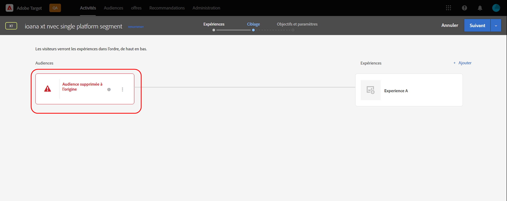

# Notes de mise à jour de Target (actualisées)

Ces notes de mise à jour contiennent des informations sur les fonctionnalités, les améliorations, les correctifs et les problèmes connus de chaque version d’[!DNL Adobe Target Standard] et de [!DNL Target Premium]. En outre, des notes de mise à jour sur les API, les SDK, le [!DNL Adobe Experience Platform Web SDK] et la bibliothèque at.js de Target, et ainsi que d’autres modifications de plateforme sont également incluses, le cas échéant.

>[!IMPORTANT]
>
>**Fin de vie de mbox.js** : depuis le 31 mars 2021, la bibliothèque mbox.js n’est plus prise en charge par [!DNL Adobe Target]. Après le 31 mars 2021, tous les appels effectués à partir de mbox.js échoueront et auront une influence sur vos pages qui comportent des activités [!DNL Target] qui s’exécutent en diffusant le contenu par défaut.
>
>Migrez vers la version la plus récente du nouveau [!DNL Adobe Experience Platform Web SDK] ou vers la bibliothèque JavaScript at.js afin dʼéviter tout problème potentiel avec vos sites. Pour plus d’informations, consultez [Aperçu : implémentation de Target pour le Web côté client](/help/c-implementing-target/c-implementing-target-for-client-side-web/implement-target-for-client-side-web.md).

(Les numéros de problème entre parenthèses sont destinés à une utilisation interne par [!DNL Adobe].)

## [!DNL Target Standard/Premium] 21.10.2 (13 octobre 2021)

Les améliorations suivantes ont été apportées lors de l’utilisation de [!DNL Target] [!UICONTROL Audiences] avec la balise [!DNL Adobe Experience Platform Web SDK] :

* Ajout d’icônes d’avertissement, de fenêtres contextuelles et de messages à différents emplacements de l’interface utilisateur [!DNL Target] pour indiquer que l’audience a été supprimée à la source et n’est plus disponible pour être utilisée dans les activités [!DNL Target].

   Les illustrations suivantes présentent certains des emplacements d’affichage des icônes, des fenêtres contextuelles et des messages :

   *  Page Liste des activités

      

   * Page [!UICONTROL Aperçu] de l’activité :

      

   *  Étape des expériences du workflow de création de l’activité :

      

   *  Étape de ciblage du workflow de création d’activité :

      

   * [!UICONTROL Étape Objectifs et ] paramètres du workflow de création d’activité :

      ![Audience supprimée au niveau du message source sur la page  [!UICONTROL Objectifs et ] Paramètres](assets/deleted-at-source-goals-settings.png)

   * Amélioration de l’audience ([!UICONTROL Remplacer l’audience] à l’étape [!UICONTROL Ciblage] du workflow de création d’activité) :

* Si vous tentez d’utiliser la fonction Combiner les audiences et que l’une des audiences a été supprimée à la source, l’option [!UICONTROL Enregistrer] est désactivée.

## [!DNL Target Standard/Premium] 21.10.1 (6 octobre 2021)

Cette version comprend les nouvelles fonctionnalités suivantes :

| Fonctionnalité | Détails |
| --- | --- |
|  Actualisation d’AudiencesUI | Dans le cadre des efforts déployés par l’équipe [!DNL Adobe Target] pour améliorer l’expérience utilisateur des [!DNL Target] utilisateurs, cette version actualise les pages [!UICONTROL Audiences] et [!UICONTROL Scripts de profil] dans l’interface utilisateur de [!DNL Target]. Cette mise à jour unifie et normalise les modèles de conception précédemment incohérents, tout en ajoutant de nouvelles améliorations, telles que :<ul><li>la possibilité de sélectionner et de supprimer plusieurs audiences simultanément ;</li><li>Une [conception du générateur d’audiences](/help/c-target/c-audiences/create-audience.md) actualisée</li><li>Prise en charge des règles d’exclusion dans le créateur de règles de bibliothèque [!UICONTROL Audience]</li><li>Un nouveau filtre &quot;Source d’audience&quot;, pour permettre une découverte d’audience plus rapide</li><li>Options de recherche persistante et de filtrage de session</li></ul>Pour plus d’informations, consultez [Audiences](/help/c-target/target.md). **REMARQUE** : La nouvelle   interface utilisateur d’Audiences a été temporairement désactivée pour tous les clients, à l’exception de ceux qui se trouvent actuellement dans un programme  [!DNL Target] bêta. Cette actualisation de l’interface utilisateur sera réactivée pour un sous-ensemble de clients le mardi 19 octobre et pour tous les autres clients le jeudi 21 octobre 2021. |
| [!UICONTROL Actualisation ] de l’interface utilisateur des scripts de profil | La bibliothèque [!UICONTROL Scripts de profil] a également été mise à jour. Elle comprend une interface actualisée ainsi que plusieurs mises à jour de productivité :<ul><li>La possibilité de sélectionner et de supprimer plusieurs scripts de profil simultanément</li><li>Un nouvel éditeur de code pour les scripts de profil</li><li>Mise en surbrillance de la syntaxe et vérification des erreurs dans l’éditeur de code</li><li>Saisie automatique des jetons (paramètres de mbox ou de profil) à l’aide de raccourcis clavier</li></ul>Pour plus d’informations, voir [Profils de visiteur](/help/c-target/c-visitor-profile/visitor-profile.md). |
|  Badge Recommendations Critères de création et de modification | Le workflow de création et d’édition [!UICONTROL Critères Recommendations] a été simplifié afin de simplifier le choix de l’algorithme et des paramètres de recommandations adaptés pour atteindre vos objectifs. Pour plus d’informations, voir  [Création de critères](/help/c-recommendations/c-algorithms/create-new-algorithm.md). |
|  badge Premium et du taux d’actualisation de l’algorithme | Vous pouvez désormais exécuter les algorithmes &quot;Les plus consultés&quot; et &quot;Meilleurs vendeurs&quot; avec une période de recherche arrière de six heures pour capturer le contenu qui est en tendance dernièrement. Lorsque l’intervalle de recherche en amont de six heures est sélectionné, les résultats de vos recommandations sont mis à jour toutes les 3 à 6 heures toute la journée. Pour plus d’informations, voir  [Source de données ](/help/c-recommendations/c-algorithms/create-new-algorithm.md#data-source) dans  *Création de critères*. |

## Notes de mise à jour supplémentaires et informations détaillées sur les versions

| Ressource | Détails |
|--- |--- |
| [Notes de mise à jour : SDK web Experience Platform Adobe Target](https://experienceleague.adobe.com/docs/experience-platform/edge/release-notes.html?lang=fr) | Informations détaillées sur les modifications apportées à chaque version du SDK web Platform. |
| [Informations détaillées sur les versions du fichier at.js](/help/c-implementing-target/c-implementing-target-for-client-side-web/target-atjs-versions.md) | Informations détaillées sur les modifications apportées à chaque version de la bibliothèque JavaScript at.js [!DNL Adobe Target]. |

## Modifications de la documentation, notes de mise à jour des versions antérieures et notes de mise à jour d’Experience Cloud

Outre les notes de chaque version, les ressources suivantes fournissent des informations supplémentaires :

| Ressource | Détails |
|--- |--- |
| Modifications de la documentation | Obtenez des informations détaillées sur les mises à jour apportées à ce guide qui ne sont pas incluses dans les notes de mise à jour. Pour plus d’informations, voir [Modifications de la documentation](/help/r-release-notes/doc-change.md#reference_366123CF00994BACBBF9BBDF2C4D840C). |
| Notes de mise à jour pour les versions antérieures | Affichez des informations sur les nouvelles fonctionnalités et améliorations des versions précédentes de Target Standard et Target Premium. Pour plus d’informations, voir [Notes de mise à jour des versions précédentes](/help/r-release-notes/release-notes-for-previous-releases.md). |
| Notes de mise à jour d’Adobe Experience Cloud | Affichez les dernières notes de mise à jour au sujet des solutions Adobe Experience Cloud. Pour plus d’informations, consultez [Notes de mise à jour d’Experience Cloud](https://experienceleague.adobe.com/docs/release-notes/experience-cloud/current.html?lang=fr). |

## Informations préliminaires {#section_5D588F0415A2435B851A4D0113ACA3A0}

Les ressources suivantes vous permettent de connaître les fonctionnalités à venir dans la prochaine version de Target.

| Ressource | Détails |
|--- |--- |
| Mise à jour prioritaire des produits Adobe | Pour recevoir des notifications avancées sur les améliorations à venir des produits Target et d’autres solutions Adobe Experience Cloud, inscrivez-vous à la mise à jour produit prioritaire Adobe : [https://www.adobe.com/subscription/priority-product-update.html](https://www.adobe.com/subscription/priority-product-update.html) |
| Notes de mise à jour à venir | Pour plus d’informations sur les versions de Target du mois en cours, notamment les informations de version préliminaire, voir la page [Notes de mise à jour de Target (préliminaires)](/help/r-release-notes/target-release-notes.md). |
