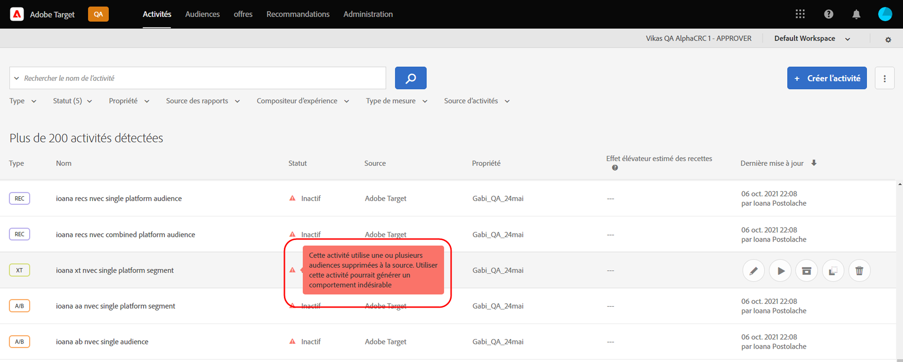

# Notes de mise à jour de Target (actualisées)

Ces notes de mise à jour contiennent des informations sur les fonctionnalités, les améliorations, les correctifs et les problèmes connus de chaque version d’[!DNL Adobe Target Standard] et de [!DNL Target Premium]. En outre, des notes de mise à jour sur les API, les SDK, le [!DNL Adobe Experience Platform Web SDK] et la bibliothèque at.js de Target, et ainsi que d’autres modifications de plateforme sont également incluses, le cas échéant.

>[!IMPORTANT]
>
>**Fin de vie de mbox.js** : depuis le 31 mars 2021, la bibliothèque mbox.js n’est plus prise en charge par [!DNL Adobe Target]. Après le 31 mars 2021, tous les appels effectués à partir de mbox.js échoueront et auront une influence sur vos pages qui comportent des activités [!DNL Target] qui s’exécutent en diffusant le contenu par défaut.
>
>Migrez vers la version la plus récente du nouveau [!DNL Adobe Experience Platform Web SDK] ou vers la bibliothèque JavaScript at.js afin dʼéviter tout problème potentiel avec vos sites. Pour plus d’informations, consultez [Aperçu : implémentation de Target pour le Web côté client](/help/c-implementing-target/c-implementing-target-for-client-side-web/implement-target-for-client-side-web.md).

(Les numéros de problème entre parenthèses sont destinés à une utilisation interne par [!DNL Adobe].)

## at.js version 2.8.0 (7 janvier 2022)

La bibliothèque JavaScript at.js [!DNL Target] collecte désormais des données de télémétrie d’utilisation et de performances des fonctionnalités. Les données personnelles ne sont pas collectées. L’exclusion de cette fonctionnalité est disponible en définissant `telemetryEnabled` sur false dans `targetGlobalSettings`. Pour plus d’informations, voir la section [telemetryEnabled dans targetGlobalSettings](/help/c-implementing-target/c-implementing-target-for-client-side-web/targetgobalsettings.md#telemetry).

## [!DNL Target Standard/Premium] version 21.10.5 (28 octobre 2021)

Lʼamélioration suivante a été apportée à cette version de maintenance :

| Fonctionnalité | Détails |
| --- | --- |
| [!UICONTROL Compositeur d’expérience visuelle] (VEC) | Ajout de la prise en charge des [Composants web](https://developer.mozilla.org/fr/docs/Web/Web_Components). Des expériences et des offres personnalisées peuvent être créées et testées sur des éléments personnalisés et sur des éléments à lʼintérieur dʼéléments personnalisés. Pour plus dʼinformations, consultez la section relative aux [Options du compositeur dʼexpérience visuelle](/help/c-experiences/c-visual-experience-composer/viztarget-options.md#custom). |

## [!DNL Target Standard/Premium] version 21.10.4 (21 octobre 2021)

Lʼamélioration suivante a été apportée à cette version de maintenance :

| Fonctionnalité | Détails |
| --- | --- |
| Recommandations basées sur le panier | Ajout dʼune nouvelle famille dʼalgorithmes pour proposer des recommandations basées sur le contenu du panier du visiteur. Pour plus d’informations, consultez les sections « Basé sur le panier » dans [Création de critères](/help/c-recommendations/c-algorithms/create-new-algorithm.md), « Ajouts au panier/consultations de panier/pages de passage en caisse » et « Exclusion des éléments déjà présents dans le panier du visiteur » dans [Planification et implémentation de Recommendations](/help/c-recommendations/plan-implement.md), ainsi que « Basé sur le panier » dans [Baser la recommandation sur une clé de recommandation](/help/c-recommendations/c-algorithms/base-the-recommendation-on-a-recommendation-key.md). |

## [!DNL Target Standard/Premium] version 21.10.3 (19 octobre 2021)

Cette version de maintenance comprend les améliorations, modifications et correctifs suivants :

* Correction de problèmes en raison desquels les clients ne parvenaient pas à ouvrir le panneau [!UICONTROL A4T] dans [!DNL Analysis Workspace] en cliquant sur le bouton [!UICONTROL Afficher dans Analytics] dans le rapport dʼactivité de [!DNL Target]. (TGT-42099, TGT-42100)
* Correction dʼun problème en raison duquel le bouton [!UICONTROL Modifier la conception] ne sʼaffichait pas lors de la modification des activités de [!UICONTROL Test A/B] et de [!UICONTROL Ciblage dʼexpérience] (XT) à lʼaide du [!UICONTROL Compositeur dʼexpérience d’après les formulaires]. (TGT-41980)
* Correction dʼun problème en raison duquel la case à cocher [!UICONTROL Compatible] ne sʼaffichait pas dans la sélection de critères lors de la création dʼune activité [!UICONTROL Recommendations]. (TGT-42053)
* Correction dʼun message dʼerreur incorrect qui sʼaffichait lorsque lʼutilisateur ne parvenait pas à sélectionner [!DNL Analytics] en tant que source de rapport (A4T) en raison dʼun manque dʼautorisations [!DNL Analytics]. (TGT-41954)
* Implémentation de plusieurs correctifs en matière dʼaccessibilité visant à améliorer la navigation au clavier dans l’ensemble de lʼinterface utilisateur de [!DNL Target].

## [!DNL Target Standard/Premium] version 21.10.2 (13 octobre 2021)

Les améliorations suivantes ont été ajoutées lors de lʼutilisation des [!UICONTROL Audiences] de [!DNL Target] avec le [!DNL Adobe Experience Platform Web SDK] :

* Ajout dʼicônes dʼavertissement, de fenêtres contextuelles et de messages à plusieurs endroits de lʼinterface utilisateur de [!DNL Target] pour indiquer que lʼaudience a été supprimée à la source et nʼest plus disponible pour une utilisation dans les activités [!DNL Target].

   Les illustrations suivantes présentent quelques emplacements d’affichage des icônes, des fenêtres contextuelles et des messages :

   * Page de la liste des [!UICONTROL Activités]

      

   * Pages dʼ[!UICONTROL Aperçu] des activités :

      

   * Étape relative aux [!UICONTROL Expériences] du workflow de création dʼune activité :

      ![Message « Audience supprimée à la source » sur la page relative aux [!UICONTROL Expériences]](assets/deleted-at-source-experiences.png)

   * Étape relative au [!UICONTROL Ciblage] du workflow de création dʼune activité :

      ![Message « Audience supprimée à la source » sur la page relative au [!UICONTROL Ciblage]](assets/deleted-at-source-targeting.png)

   * Étape relative aux [!UICONTROL Objectifs et paramètres] du workflow de création dʼune activité :

      ![Message « Audience supprimée à la source » sur la page relative aux [!UICONTROL Objectifs et paramètres]](assets/deleted-at-source-goals-settings.png)

   * Améliorations apportées aux audiences ([!UICONTROL Remplacer lʼaudience] à lʼétape relative au [!UICONTROL Ciblage] du workflow de création dʼune activité) :

* Si vous tentez dʼutiliser la fonctionnalité Combiner les audiences et que lʼune des audiences a été supprimée à la source, lʼoption [!UICONTROL Enregistrer] est désactivée.

## [!DNL Target Standard/Premium] 21.10.1 (6 octobre 2021)

Cette version comprend les nouvelles fonctionnalités suivantes :

| Fonctionnalité | Détails |
| --- | --- |
| Actualisation de l’interface utilisateur d’[!UICONTROL Audiences] | Sʼinscrivant dans le cadre dʼefforts continus réalisés par lʼéquipe [!DNL Adobe Target] pour améliorer lʼexpérience utilisateur pour les utilisateurs de [!DNL Target], cette version donne un coup de jeune aux pages [!UICONTROL Audiences] et [!UICONTROL Scripts de profil] dans lʼinterface utilisateur de [!DNL Target]. Cette mise à jour harmonise et uniformise les modèles de conception qui étaient auparavant incohérents. Elle apporte également de nouvelles améliorations, notamment :<ul><li>Possibilité de sélectionner et de supprimer plusieurs audiences simultanément</li><li>[Conception du créateur dʼaudiences](/help/c-target/c-audiences/create-audience.md) actualisée</li><li>Prise en charge des règles dʼexclusion dans le créateur de règles de la bibliothèque dʼ[!UICONTROL Audiences]</li><li>Nouveau filtre « Source de lʼaudience », pour permettre une détection plus rapide des audiences</li><li>Options de recherche et de filtrage persistantes dans la session</li></ul>Pour plus d’informations, consultez [Audiences](/help/c-target/target.md). **REMARQUE** : la nouvelle interface utilisateur dʼ[!UICONTROL Audiences] nʼest disponible que pour certains clients. La mise à jour sera progressivement déployée pour tous les clients à partir de janvier 2022. |
| Actualisation de lʼinterface utilisateur des [!UICONTROL Scripts de profil] | La bibliothèque de [!UICONTROL Scripts de profil] a également été mise à jour. Elle comprend une interface actualisée ainsi que plusieurs mises à jour relatives à la productivité :<ul><li>Possibilité de sélectionner et de supprimer plusieurs scripts de profil simultanément</li><li>Nouvel éditeur de code pour les scripts de profil</li><li>Mise en évidence de la syntaxe et vérification des erreurs dans lʼéditeur de code</li><li>Paramètres (mbox ou de profil) de saisie automatique des jetons à lʼaide de raccourcis clavier</li></ul>Pour plus dʼinformations, consultez la section [Profils des visiteurs](/help/c-target/c-visitor-profile/visitor-profile.md). **REMARQUE** : la nouvelle interface utilisateur des [!UICONTROL Scripts de profil] nʼest disponible que pour certains clients. La mise à jour sera progressivement déployée pour tous les clients à partir de janvier 2022. |
|  Création et modification de Critères de Recommendations | Le workflow de création et de modification de [!UICONTROL Critères de Recommendations] a été simplifié afin de vous permettre de choisir lʼalgorithme et les paramètres de recommandation appropriés de manière plus aisée pour atteindre vos objectifs. Pour plus dʼinformations, consultez la section [Création de critères](/help/c-recommendations/c-algorithms/create-new-algorithm.md). |
|  Améliorations apportées à lʼintervalle de recherche en amont et à la fréquence dʼactualisation des algorithmes de Recommendations | Vous pouvez désormais exécuter les algorithmes « Les plus consultés » et « Meilleurs vendeurs » dans un intervalle de recherche en amont de six heures pour capturer le contenu populaire le plus récent. Lorsque lʼintervalle de recherche en amont de six heures est sélectionné, les résultats de vos recommandations sont mis à jour toutes les 3 à 6 heures au cours de la journée. Pour plus dʼinformations, consultez la section [Source de données](/help/c-recommendations/c-algorithms/create-new-algorithm.md#data-source) sous *Création de critères*. |

## Notes de mise à jour supplémentaires et informations détaillées sur les versions

| Ressource | Détails |
|--- |--- |
| [Notes de mise à jour : SDK web Experience Platform Adobe Target](https://experienceleague.adobe.com/docs/experience-platform/edge/release-notes.html?lang=fr) | Informations détaillées sur les modifications apportées à chaque version du SDK web Platform. |
| [Informations détaillées sur les versions du fichier at.js](/help/c-implementing-target/c-implementing-target-for-client-side-web/target-atjs-versions.md) | Informations détaillées sur les modifications apportées à chaque version de la bibliothèque JavaScript at.js [!DNL Adobe Target]. |

## Modifications de la documentation, notes de mise à jour des versions antérieures et notes de mise à jour d’Experience Cloud

Outre les notes de chaque version, les ressources suivantes fournissent des informations supplémentaires :

| Ressource | Détails |
|--- |--- |
| Modifications de la documentation | Obtenez des informations détaillées sur les mises à jour apportées à ce guide qui ne sont pas incluses dans les notes de mise à jour. Pour plus d’informations, voir [Modifications de la documentation](/help/r-release-notes/doc-change.md#reference_366123CF00994BACBBF9BBDF2C4D840C). |
| Notes de mise à jour pour les versions antérieures | Affichez des informations sur les nouvelles fonctionnalités et améliorations des versions précédentes de Target Standard et Target Premium. Pour plus d’informations, voir [Notes de mise à jour des versions précédentes](/help/r-release-notes/release-notes-for-previous-releases.md). |
| Notes de mise à jour d’Adobe Experience Cloud | Affichez les dernières notes de mise à jour au sujet des solutions Adobe Experience Cloud. Pour plus d’informations, consultez [Notes de mise à jour d’Experience Cloud](https://experienceleague.adobe.com/docs/release-notes/experience-cloud/current.html?lang=fr). |

## Informations préliminaires {#section_5D588F0415A2435B851A4D0113ACA3A0}

Les ressources suivantes vous permettent de connaître les fonctionnalités à venir dans la prochaine version de Target.

| Ressource | Détails |
|--- |--- |
| Mise à jour prioritaire des produits Adobe | Pour recevoir des notifications avancées sur les améliorations à venir des produits Target et d’autres solutions Adobe Experience Cloud, inscrivez-vous à la mise à jour produit prioritaire Adobe : [https://www.adobe.com/subscription/priority-product-update.html](https://www.adobe.com/subscription/priority-product-update.html) |
| Notes de mise à jour à venir | Pour plus d’informations sur les versions de Target du mois en cours, notamment les informations de version préliminaire, voir la page [Notes de mise à jour de Target (préliminaires)](/help/r-release-notes/target-release-notes.md). |
